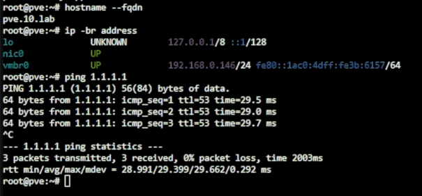
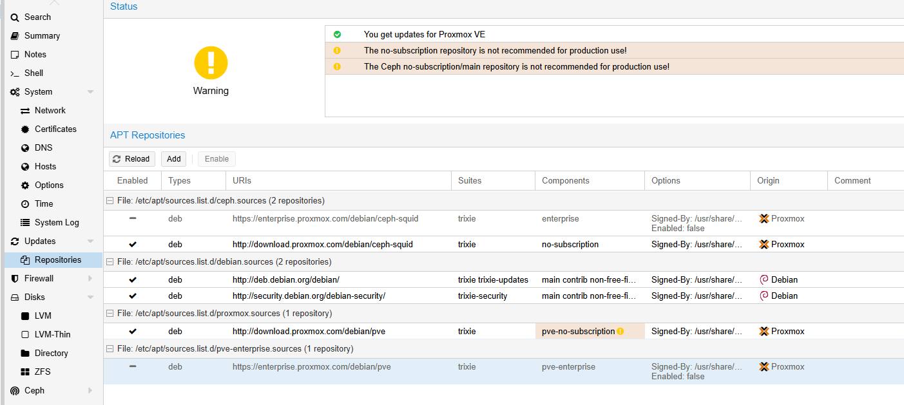
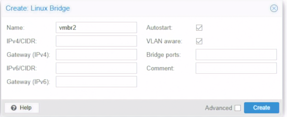
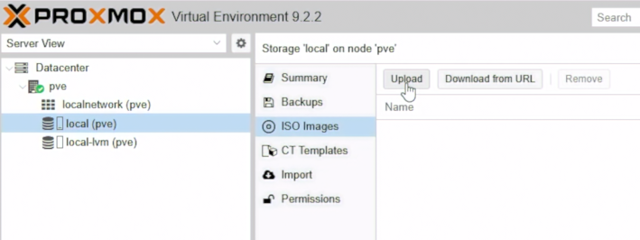
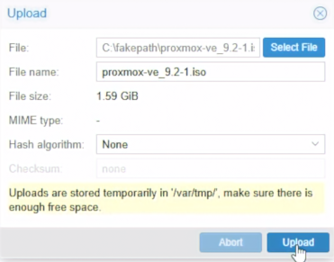
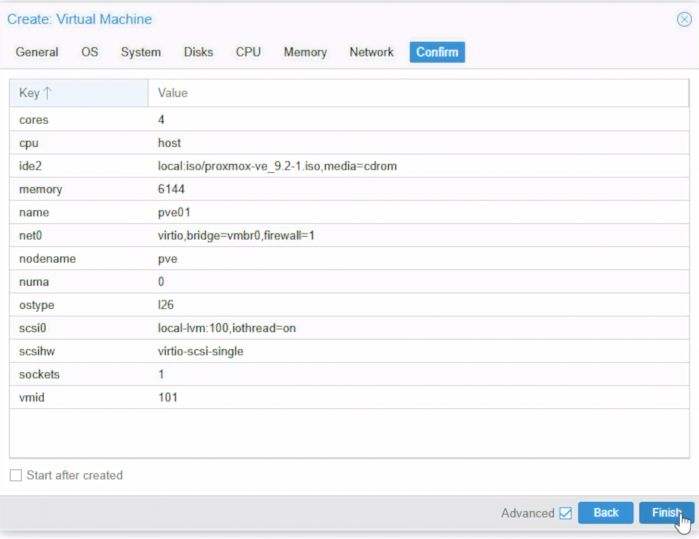
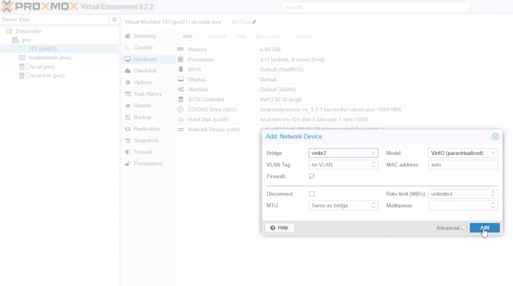
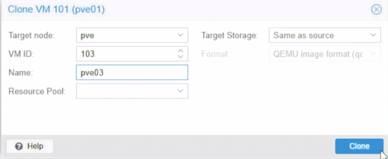
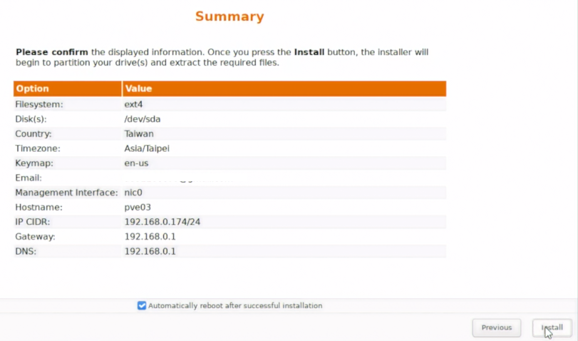
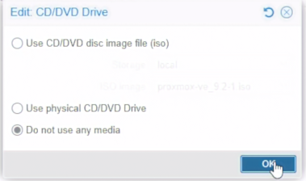

# Day 03｜從單機到三節點實驗環境：Proxmox VE 安裝與巢狀虛擬化

對應正文：[Day 03｜從單機到三節點實驗環境：Proxmox VE 安裝與巢狀虛擬化](https://ithelp.ithome.com.tw/articles/10407253)

本日一次完成實體主機的 `pve-l0`、三台 L1 PVE VM，以及 `pve01`～`pve03` 的安裝。這一天先讓所有 PVE 從現有路由器取得可用網路，OPNsense 與內部 VLAN 留到後續天數處理。

## 完成後的狀態

- **層級：L0 實體主機**
  - VMID：-
  - 名稱：pve-l0
  - 用途：承載整個單機 Lab
- **層級：L1 VM**
  - VMID：101
  - 名稱：pve01
  - 用途：PVE Cluster 節點 1
- **層級：L1 VM**
  - VMID：102
  - 名稱：pve02
  - 用途：PVE Cluster 節點 2
- **層級：L1 VM**
  - VMID：103
  - 名稱：pve03
  - 用途：PVE Cluster 節點 3

`pve-l0`、`pve01`、`pve02`、`pve03` 的管理網路都先接現有路由器 LAN。安裝器顯示的 IP、Prefix、Gateway 與 DNS 以 DHCP 實際帶入的內容為準，安裝完成後再到路由器依 MAC Address 建立固定租約。

這是 OPNsense 尚未建立時的 Bootstrap 設定，不是 30 天結束時的長期安全狀態。Day 15 會在不修改 Corosync 與 Ceph 的前提下，將 pve01～pve03 的 Default Gateway 與 DNS 切到 OPNsense Management VLAN 10；本節已錄製的安裝流程不需要重做。

## 1. 下載安裝媒體

1. 開啟 Proxmox VE ISO 頁面：<https://www.proxmox.com/en/downloads/proxmox-virtual-environment/iso>。
2. 下載目前系列使用的 `proxmox-ve_9.2-1.iso`。
3. 開啟 Rufus：<https://rufus.ie/downloads/>。
4. 插入至少 8 GB USB，選擇 ISO 後按 `START`。
5. Rufus 詢問寫入模式時先使用建議值；完成後安全退出 USB。

錄影前可在 Windows PowerShell 驗證檔案：

```powershell
Get-FileHash .\proxmox-ve_9.2-1.iso -Algorithm SHA256
```

官方 9.2-1 ISO SHA256：

```text
4e88fe416df9b527624a175f24c9aa07c714d3332afb1ee3dbf3879573ef2c6c
```

## 2. 安裝 L0 實體 PVE

### BIOS／UEFI

1. 開機時按主機板顯示的 `Delete`、`F2` 或 Boot Menu 鍵。
2. 啟用 Intel VT-x／VT-d，或 AMD-V／IOMMU。
3. 選擇剛製作的 USB 開機。

### Proxmox 安裝器

1. 選 `Install Proxmox VE (Graphical)`。
2. 閱讀 EULA，按 `I agree`。
3. `Target Harddisk` 選 500 GB 示範碟；Lab 採預設 LVM-thin，不在這顆單碟上假裝 ZFS Mirror。
4. `Country` 選 Taiwan、`Time zone` 選 `Asia/Taipei`，鍵盤依實際鍵盤選擇。
5. 設定 root 密碼與可收信的 Email。
6. `Management Interface` 選接到現有路由器 LAN、且畫面已取得 DHCP 資訊的網卡。
7. `Hostname` 輸入 `pve-l0.lab.home`。
8. `IP Address (CIDR)`、`Gateway`、`DNS Server` 保留安裝器依目前網路自動帶入的值。
9. 在 Summary 畫面逐項確認，按 `Install`。
10. 安裝完成後拔除 USB，按 `Reboot`。

> PVE 管理位址需要長期固定，但現在還不知道路由器會租出哪個 IP。正確順序是先接受實際租約，再用該網卡 MAC 建立 DHCP Reservation，而不是先猜一個位址。

### 第一次登入與固定租約

1. Console 開機完成後，拍下畫面顯示的完整 Web URL。
2. 同一個 LAN 的電腦開啟該 URL，接受自簽憑證警告。
3. `User name` 輸入 `root`，Realm 選 `Linux PAM standard authentication`。
4. 到路由器的 DHCP Client／Connected Devices 頁面找到 `pve-l0`。
5. 核對 MAC Address 與 Console 顯示的 IP，建立固定租約並保持目前 IP 不變。
6. 將實際結果記在本文末端的部署紀錄。

PVE Shell 可用以下指令確認實際網路，不需要手動代入範例 IP：

```bash
hostname --fqdn
ip -4 -br address show vmbr0
ip route
cat /etc/resolv.conf
```



*圖（一）確認 pve-l0 的主機名稱、管理位址與外部連線。*

### 確認巢狀虛擬化

在 `pve-l0` Shell 執行：

```bash
cat /sys/module/kvm_intel/parameters/nested 2>/dev/null
cat /sys/module/kvm_amd/parameters/nested 2>/dev/null
```

依 CPU 類型只會有其中一個檔案。輸出 `Y` 或 `1` 代表已啟用；若輸出 `N` 或 `0`，只執行符合自己 CPU 的其中一組設定：

```bash
# Intel
echo "options kvm-intel nested=Y" > /etc/modprobe.d/kvm-intel.conf

# AMD
echo "options kvm-amd nested=1" > /etc/modprobe.d/kvm-amd.conf

reboot
```

重新開機後再次檢查輸出。後續建立 pve01～pve03 時，還要將 VM 的 CPU Type 設為 `host`，才能把硬體虛擬化能力傳入 L1。

## 3. 更新套件來源

沒有 Enterprise Subscription 的 Lab 使用兩個不同用途的來源：

```text
PVE 套件庫：http://download.proxmox.com/debian/pve
Ceph Squid 套件庫：http://download.proxmox.com/debian/ceph-squid
```

你提供的網址只是 Repository URI，不能單獨貼成一行 APT 設定。PVE 9／Debian 13 使用 `trixie`，PVE Repository 的 Component 是 `pve-no-subscription`，Ceph Repository 的 Component 才是 `no-subscription`。

### 3.1 停用需要訂閱的來源

1. 選 `pve-l0` → `Updates` → `Repositories`。
2. 選取 URI 含 `enterprise.proxmox.com/debian/pve` 的項目，按 `Disable`。
3. 若畫面已有 URI 含 `enterprise.proxmox.com/debian/ceph-squid` 的項目，也按 `Disable`。
4. 不要停用 Debian 13 的 `trixie`、`trixie-updates` 與 `trixie-security` 基礎來源。

### 3.2 加入 PVE No-Subscription Repository

在 Shell 開啟檔案：

```bash
nano /etc/apt/sources.list.d/proxmox.sources
```

填入：

```text
Types: deb
URIs: http://download.proxmox.com/debian/pve
Suites: trixie
Components: pve-no-subscription
Signed-By: /usr/share/keyrings/proxmox-archive-keyring.gpg
```

按 `Ctrl+O`、Enter 儲存，再按 `Ctrl+X` 離開。

### 3.3 加入 Ceph Squid No-Subscription Repository

```bash
nano /etc/apt/sources.list.d/ceph.sources
```

填入：

```text
Types: deb
URIs: http://download.proxmox.com/debian/ceph-squid
Suites: trixie
Components: no-subscription
Signed-By: /usr/share/keyrings/proxmox-archive-keyring.gpg
```

同樣按 `Ctrl+O`、Enter、`Ctrl+X`。



*圖（二）停用 Enterprise Repository，改用 No-Subscription Repository。*

### 3.4 更新並核對來源

```bash
apt update
apt policy pve-manager ceph-common
grep -R --line-number --no-messages 'download.proxmox.com\|enterprise.proxmox.com' /etc/apt/sources.list /etc/apt/sources.list.d/
```

`apt update` 不應再出現 Enterprise Repository 的 `401 Unauthorized`，也不能同時混入其他 Debian 版本或不同 Ceph 大版本的來源。確認後再到 `Updates` 按 `Refresh`、`Upgrade`。

`pve-l0` 加入兩個來源是為了保留完整錄製環境；真正安裝 Ceph Daemon 的節點是後續 Cluster 內的 `pve01`～`pve03`。這是示範環境設定，正式環境應依支援與更新策略使用 Enterprise Repository。

## 4. 建立內部 Trunk Bridge

1. 選 `pve-l0` → `System` → `Network`。
2. 按 `Create` → `Linux Bridge`。
3. `Name` 填 `vmbr2`。
4. `Bridge ports` 留白，IPv4、IPv6 都選不配置。
5. 勾選 `VLAN aware`，Comment 填 `L1 PVE internal VLAN trunk`。
6. 按 `Create`，再按 `Apply Configuration`。



*圖（三）建立供 Lab 內部 VLAN 使用的 vmbr2。*

`vmbr0` 繼續連現有路由器；`vmbr2` 是 Lab 內部 VLAN 10～50 的 Trunk，不直接設定 Host IP 與 Default Gateway。Day 11 若需要從 L0 管理 OPNsense，會另外建立 `vmbr2.10` VLAN 子介面，不會新增 `vmbr3`。

## 5. 上傳 PVE ISO



*圖（四）進入 local Storage 的 ISO Images。*

1. 選 `pve-l0` → `local (pve-l0)` → `ISO Images`。
2. 按 `Upload`，選剛下載的 PVE ISO。
3. 等待 Task 顯示 `OK`。



*圖（五）上傳 Proxmox VE ISO。*

## 6. 建立 pve01

1. 右上角按 `Create VM`。
2. `General`：Node 選 `pve-l0`、VM ID 填 `101`、Name 填 `pve01`。
3. `OS`：選上傳的 PVE ISO；Guest OS Type 選 `Linux`。
4. `System`：Machine、BIOS 先用預設；勾選 `Qemu Agent` 可先保留，PVE 安裝完成後不靠它管理。
5. `Disks`：Bus 選 SCSI、Storage 選 `local-lvm`、Disk size 填 `80 GiB`、Discard 勾選。
6. `CPU`：Sockets `1`、Cores `4`、Type 選 `host`。
7. `Memory`：填 `12288 MiB`，不要啟用 Ballooning。
8. `Network`：Bridge 選 `vmbr0`、Model 選 `VirtIO`、VLAN Tag 留白。
9. 在 Confirm 取消 `Start after created`，按 `Finish`。



*圖（六）建立 pve01 的硬體摘要。圖中的 6144 MiB Memory 與 100 GiB Disk 是較早的錯誤值，應以本文的 12288 MiB 與 80 GiB 為準。*

10. 選 VM 101 → `Hardware` → `Add` → `Network Device`。
11. 第二張網卡 Bridge 選 `vmbr2`、Model 選 `VirtIO`、VLAN Tag 留白。
12. 到 `Options` 確認 `Start at boot` 目前關閉，避免同時吃滿 Lab 記憶體。



*圖（七）替 pve01 加入連到 vmbr2 的第二張 VirtIO 網卡。*

## 7. 複製 VM 硬體設定

為了錄影清楚，可以逐台建立；若使用 Clone，也要改正 VMID、名稱與 MAC Address。

- **VMID：101**
  - Name：pve01
  - CPU：4
  - RAM：12 GB
  - Disk：80 GB
  - net0：vmbr0
  - net1：vmbr2
- **VMID：102**
  - Name：pve02
  - CPU：4
  - RAM：12 GB
  - Disk：80 GB
  - net0：vmbr0
  - net1：vmbr2
- **VMID：103**
  - Name：pve03
  - CPU：4
  - RAM：12 GB
  - Disk：80 GB
  - net0：vmbr0
  - net1：vmbr2

建立 `pve02` 與 `pve03` 後，逐台確認兩張 VirtIO NIC 的 MAC Address 都不同。



*圖（八）由 pve01 複製 pve03 的 VM 硬體設定。*

## 8. 安裝 pve01～pve03

三台依序安裝，不要同時執行安裝器。

1. 選 VM → `Start` → `Console`。
2. 選 `Install Proxmox VE (Graphical)`。
3. Target Disk 選該 VM 的 80 GB 虛擬磁碟。
4. 設定時區、root 密碼與 Email。
5. Management Interface 選第一張網卡，也就是連到 `vmbr0` 的 NIC。
6. Hostname 依序輸入 `pve01.lab.home`、`pve02.lab.home`、`pve03.lab.home`。
7. IP、Gateway、DNS 保留安裝器從現有路由器取得並自動帶入的值。



*圖（九）確認 pve03 的安裝摘要與管理位址。*

8. 安裝完成後 Reboot；若仍從 ISO 啟動，到 `Hardware` → `CD/DVD Drive` 選 `Do not use any media`。



*圖（十）安裝完成後停用虛擬光碟媒體。*

9. 從 Console 拍下每台顯示的 Web URL。
10. 到路由器依 VM 的 net0 MAC 建立固定租約，保留它當下取得的 IP。

完成一台並固定租約後再安裝下一台。這樣 Day 07 建 Cluster 時，三個節點的管理 IP 已經穩定。

## 9. 三台節點的基本整理

每台都執行：

1. 登入該節點的 Web UI。
2. 到 `Updates` → `Repositories`，停用 PVE 與 Ceph Enterprise Repository。
3. 依本篇 3.2、3.3 分別建立 `proxmox.sources` 與 `ceph.sources`。
4. 執行 `apt update`，確認來源是 `trixie`，再完成套件更新。
5. Shell 執行 `hostname --fqdn`、`ip -4 -br address`、`ip route`。
6. 確認 net0 可到現有路由器，net1 尚未設定 IP。

## 10. 部署紀錄

安裝完成後填入實際值，不要把錄影電腦的 IP 當成 PVE IP：

- **主機：pve-l0**
  - FQDN：pve-l0.lab.home
  - 路由器固定租約：安裝完成後記錄
  - net0 MAC：安裝完成後記錄
  - Web UI 已登入：[ ]
- **主機：pve01**
  - FQDN：pve01.lab.home
  - 路由器固定租約：安裝完成後記錄
  - net0 MAC：安裝完成後記錄
  - Web UI 已登入：[ ]
- **主機：pve02**
  - FQDN：pve02.lab.home
  - 路由器固定租約：安裝完成後記錄
  - net0 MAC：安裝完成後記錄
  - Web UI 已登入：[ ]
- **主機：pve03**
  - FQDN：pve03.lab.home
  - 路由器固定租約：安裝完成後記錄
  - net0 MAC：安裝完成後記錄
  - Web UI 已登入：[ ]

## 錄影收尾畫面

- [ ] L0 Datacenter 中看得到 VM 101、102、103。
- [ ] 四台 PVE 都能透過路由器配發並保留的管理 IP 開啟 Web UI。
- [ ] 三台 L1 PVE 的 VMID、Hostname 與 FQDN 正確。
- [ ] 在 L0 檢查每台 L1 PVE VM：`net0` 接到 L0 `vmbr0`，`net1` 接到 L0 `vmbr2`；這裡的 `vmbr2` 是 `pve-l0` 上的 Trunk Bridge，不是 L1 PVE 內部的 Ceph `vmbr2`。
- [ ] 已說明單一實體主機只能模擬三節點，不能當成正式硬體 HA 證明。
