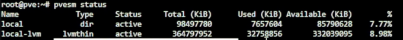
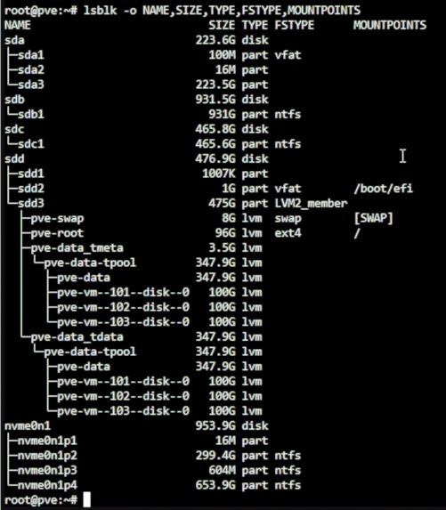
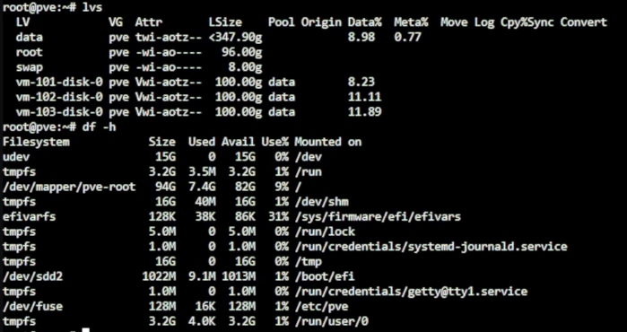
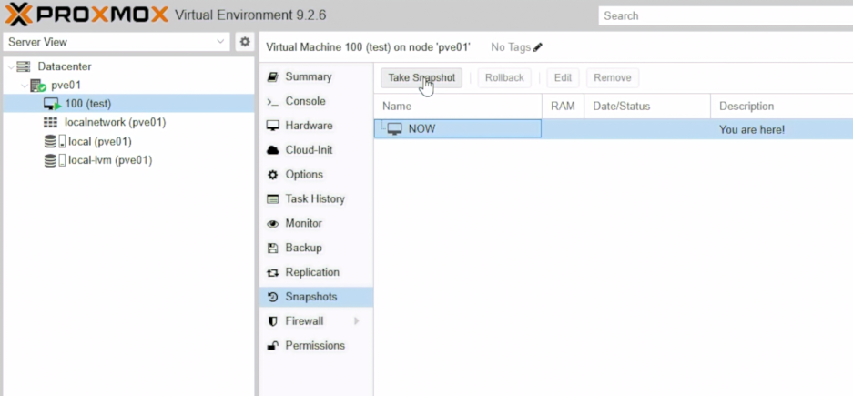
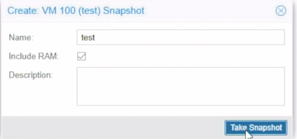
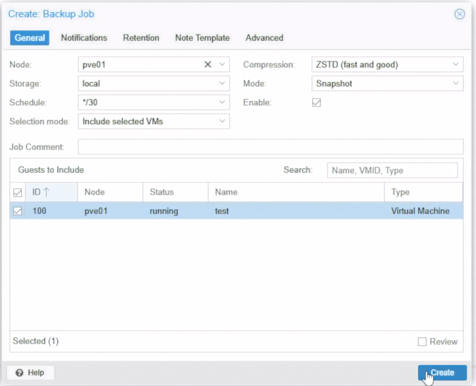
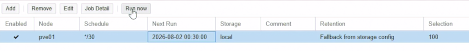
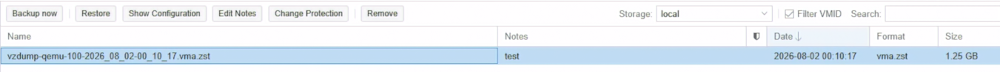

# Day 04｜從一顆磁碟到共享儲存：檔案系統、RAID、ZFS、快照與備份

對應文章：[Day 04｜從一顆磁碟到共享儲存：檔案系統、RAID、ZFS、快照與備份](https://ithelp.ithome.com.tw/articles/10407538)

本日不重裝主機，使用 Day 03 已完成的 `pve-l0` 與三台巢狀 PVE 說明 `local`、`local-lvm`、Snapshot 與 Backup 的責任差異。

## 1. 盤點目前儲存

1. 登入 `pve-l0`。
2. 選 `Datacenter` → `Storage`，確認 `local` 與 `local-lvm`。
3. 選 `pve-l0` → `Disks` → `LVM-Thin`，確認 Thin Pool 狀態。
4. 選 VM 101 → `Hardware` → `Hard Disk`，確認磁碟位於 `local-lvm`。
5. 在 Shell 執行：

```bash
pvesm status
lsblk -o NAME,SIZE,TYPE,FSTYPE,MOUNTPOINTS
lvs
df -h
```


*圖（一）使用 pvesm status 查看 PVE Storage 狀態。*



*圖（二）使用 lsblk 查看實體磁碟、分割區與 LVM 結構。*



*圖（三）使用 lvs 與 df 確認 Logical Volume 與檔案系統用量。*

## 2. local 與 local-lvm

- **儲存：local**
  - 用途：ISO、Template、備份檔
  - 重點：它是檔案型儲存
- **儲存：local-lvm**
  - 用途：VM 虛擬磁碟
  - 重點：支援 Thin Provisioning

## 3. Snapshot 實驗

1. 啟動一台不重要的測試 VM。如果尚未建立一般 Linux VM，可先用 L0 VM 101 測試 Snapshot 介面。我這裡用 Debian 建立一個測試 VM 示範。
2. 選 VM → `Snapshots` → `Take Snapshot`。



*圖（四）從測試 VM 建立 Snapshot。*

3. Name 填 `before-storage-demo`，Description 填拍攝日期與目的。



*圖（五）設定 Snapshot 名稱與是否包含記憶體狀態。*

4. 確認 Snapshot 出現在清單中。
5. 測試 Rollback，可以先新增或修改一個測試文件，再確認 Rollback 後是否回到原本狀態。

## 4. vzdump 備份實驗

1. 選 `Datacenter` → `Backup` → `Add`。
2. Node 選目前測試節點，Storage 選 `local`。
3. Schedule 先選錄影方便執行的時間，Selection mode 選 `Include selected VMs`。
4. 只選測試 VM。Mode 選 `Snapshot`，Compression 選 `ZSTD`。



*圖（六）建立測試用 vzdump Backup Job。圖中的每 30 分鐘排程只供錄影測試。*

5. 建立後選該 Job，按 `Run now`。



*圖（七）手動執行剛建立的 Backup Job。*

6. 到節點 → `local` → `Backups` 確認產生備份檔。



*圖（八）確認 local Storage 已產生 vzdump 備份檔。*

7. 可先在測試 VM 建立一個識別文件，再點選備份測試 `Restore`。還原時使用另一個未使用的 VMID，不要直接覆蓋原本的測試 VM。開機後確認識別文件存在。
8. 圖中的 `*/30` 是錄影用暫時排程，測試完成後停用或刪除這個 Backup Job，避免持續占用 `local` 空間。

CLI 可使用：

```bash
vzdump 100 --storage local --mode snapshot --compress zstd
```

執行先確認 `local` 空間足夠。
