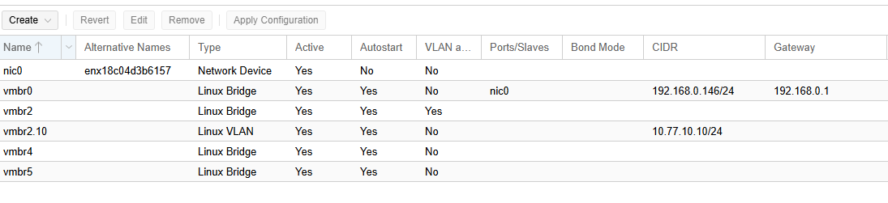
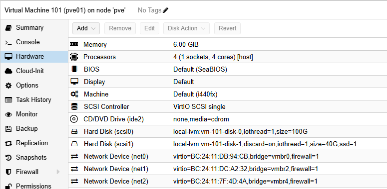
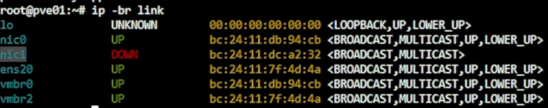
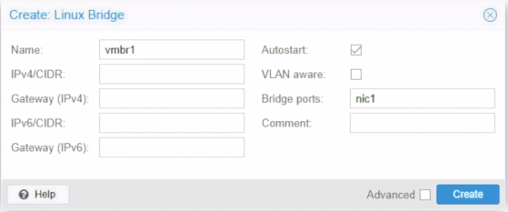
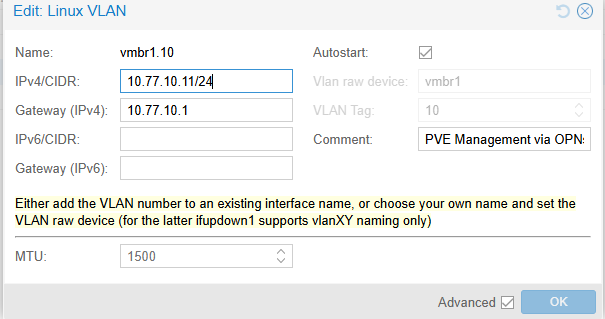
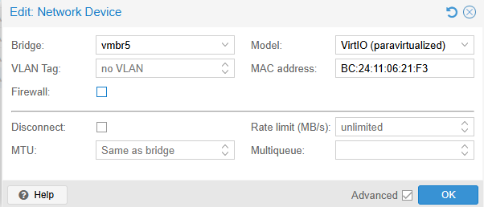
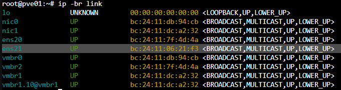
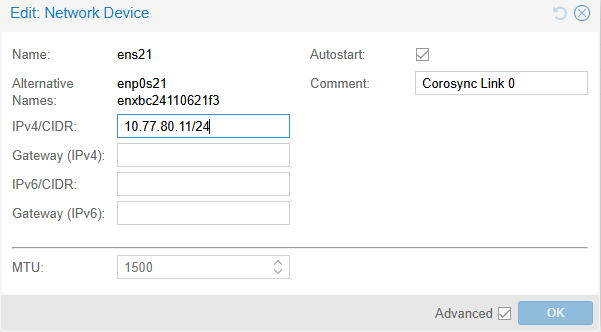
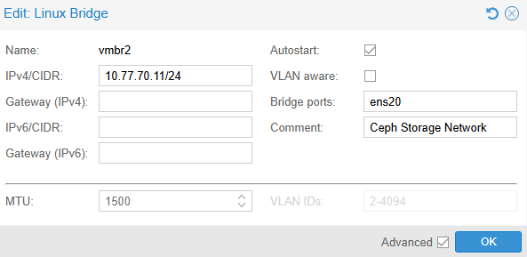
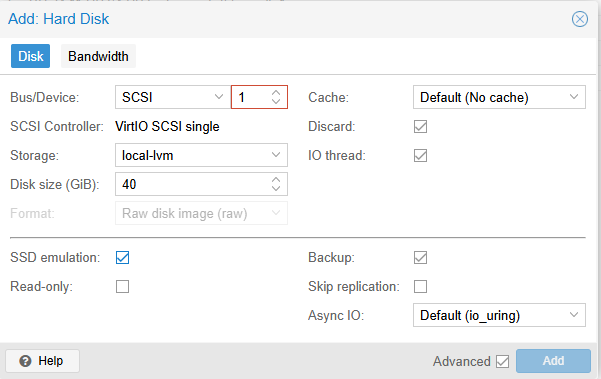

# Day 05｜從實體網卡到虛擬機：Linux Bridge、VLAN Trunk 與 PVE 虛擬網路

對應文章：[Day 05｜從實體網卡到虛擬機：Linux Bridge、VLAN Trunk 與 PVE 虛擬網路](https://ithelp.ithome.com.tw/articles/10407735)

本日把 Day 03 建立在實體宿主機 `pve-l0` 上的 `vmbr0` 與 `vmbr2` 說清楚，在三台巢狀 PVE 裡建立承接 L2 VM 的 VLAN-aware `vmbr1`，並完成 Day 07 需要的 Ceph `10.77.70.0/24`、Corosync `10.77.80.0/24` 以及三顆空白 OSD 磁碟。今天只完成網路與磁碟前置準備，不安裝 Ceph 套件，也不建立 MON、MGR、OSD 或 Pool。注意：`pve-l0` 的 `vmbr2` 與 `pve01`～`pve03` 裡面的 `vmbr2` 名稱相同，但位於不同主機，功能也完全不同。

- **所在位置：L0 `pve-l0`**
  - Bridge：`vmbr2`
  - Bridge port／上游：無實體 Port
  - 用途：交換 Lab 內部 VLAN Trunk 流量
- **所在位置：L0 `pve-l0`**
  - Bridge：`vmbr2.10`
  - Bridge port／上游：VLAN Raw Device `vmbr2`
  - 用途：L0 的 VLAN 10 管理介面，`10.77.10.10/24`，無 Gateway
- **所在位置：L0 `pve-l0`**
  - Bridge：`vmbr4`
  - Bridge port／上游：無實體 Port
  - 用途：交換 Nested Ceph Storage 流量
- **所在位置：L0 `pve-l0`**
  - Bridge：`vmbr5`
  - Bridge port／上游：無實體 Port
  - 用途：交換 Nested PVE Corosync 流量
- **所在位置：L1 `pve01`～`pve03`**
  - Bridge：`vmbr1`
  - Bridge port／上游：第二張 VirtIO NIC，通常是 `ens19`
  - 用途：L2 Guest VLAN Trunk
- **所在位置：L1 `pve01`～`pve03`**
  - Bridge：`vmbr1.10`
  - Bridge port／上游：VLAN Raw Device `vmbr1`
  - 用途：PVE Management VLAN 10，先設 IP、不設 Gateway
- **所在位置：L1 `pve01`～`pve03`**
  - Bridge：`vmbr2`
  - Bridge port／上游：第三張 VirtIO NIC，通常是 `ens20`
  - 用途：Ceph Storage Network
- **所在位置：L1 `pve01`～`pve03`**
  - Bridge：第四張 VirtIO NIC
  - Bridge port／上游：直接設定 `10.77.80.11～13/24`
  - 用途：Corosync Link 0，不設 Gateway

介面名稱只是辨識結果，實際操作必須用 MAC Address 對照，不能只看 `nic1`、`ens20` 等名稱猜測。同一張 NIC 只能成為一個 Linux Bridge 的 Port。Corosync 第四張 NIC 不加入 L1 Bridge，直接設定固定 IP。本次 pve01 的實際介面名稱是 `ens21`。

## 0. 防止鎖死自己的操作順序
錯誤的配置是有機會讓自己進不去管理畫面的，~~我自己剛學時大概鎖死自己 3 次~~

1. 修改前保持 L0 與 L1 Console 開啟。
2. 一次只改一個 Bridge。
3. 不移除 `vmbr0` 的管理位址與實體 Port。
4. Apply 後先驗證 Web UI，再改下一個節點。
## 1. 先確認 L0 `pve-l0` 網路

1. 登入 `pve-l0` → `System` → `Network`。
2. 確認 `vmbr0` 有實際管理位址與實體 Bridge Port。
3. 確認這裡看到的是 `pve-l0` 的 `vmbr2`：沒有 IP、沒有 Gateway、`VLAN aware` 已勾選。
4. 按 `Create` → `Linux Bridge`，建立或確認 `pve-l0` 的 `vmbr4`：Bridge ports、IPv4/CIDR、Gateway 全部留白，不勾 VLAN aware，Comment 填 `Nested Ceph Storage Network`。
5. 再按 `Create` → `Linux Bridge`，建立或確認 `pve-l0` 的 `vmbr5`：Bridge ports、IPv4/CIDR、Gateway 全部留白，不勾 VLAN aware，Comment 填 `Nested PVE Corosync Network`。
6. 按 `Create` → `Linux VLAN`，建立或確認 `vmbr2.10`。
7. Name 填 `vmbr2.10`。VLAN raw device 選 `vmbr2`。若介面依名稱自動辨識 VLAN Tag，確認結果為 `10`。
8. IPv4/CIDR 填 `10.77.10.10/24`，IPv4 Gateway 留白，IPv6 不設定，勾選 `Autostart`，Comment 填 `L0 VLAN 10 management path`。
9. 按 `Create` → `Apply Configuration`。這個子介面只預先讓 L0 加入 VLAN 10，不會取代 `vmbr0` 的 Default Gateway。
10. 確認 `vmbr0` 的管理位址與實體 Bridge Port 沒有被修改。



*圖（一）pve-l0 的 vmbr0、內部 Trunk、Ceph 與 Corosync Bridge。*

11. Shell 執行：

```bash
ip -br link
ip -4 -br address
bridge link
bridge vlan show
cat /etc/network/interfaces
```

這步驟只是再次確認網卡狀態也練習一下 CLI 命令，/etc/network/interfaces 就是 PVE 實際放置網卡配置的地方。

## 2. 為三台巢狀 PVE 補上 Ceph 網卡

先在 L0 依序檢查 VM 101、102、103 的 `Hardware`。如果已經有 Bridge 指向 `vmbr4` 的 `net2`，只記錄 MAC Address，缺少時才執行：

1. 選 VM → `Hardware` → `Add` → `Network Device`。
2. Bridge 選 `vmbr4`。
3. Model 選 `VirtIO (paravirtualized)`。
4. VLAN Tag 留白，Firewall 取消勾選，Disconnect 不勾選。
5. 按 `Add`，確認新增的是 `net2`，並記下它的 MAC Address。
6. 三台完成後再逐台啟動。

回到各 VM 的 `Hardware`，確認三張既有網卡角色：

- net0：Bridge `vmbr0`，VLAN Tag 留白，Day 03～15 負責 PVE Bootstrap、Web UI 與套件下載。Day 15 移除 Gateway 後只作同網段救援。
- net1：Bridge 選 L0 的 `vmbr2`，VLAN Tag 留白，承載 L2 Guest VLAN Trunk。進入 Nested PVE 後通常會顯示為 `ens19`。
- net2：Bridge 選 L0 的 `vmbr4`，VLAN Tag 留白，承載 Ceph Storage Network。進入 Nested PVE 後通常會顯示為 `ens20`。

Trunk 網卡本身不要固定成 VLAN 20、30、40 或 50，否則只能承載其中一個 VLAN。Ceph 的 `net2` 也不填 VLAN Tag，因為它已經透過獨立的 L0 `vmbr4` 與其他網路隔離。



*圖（二）Nested PVE 的網卡與磁碟配置。圖中的 6 GiB Memory 與 100 GiB System Disk 是早期畫面，正式設定以 Day 03 的 12 GiB 與 80 GiB 為準。*



*圖（三）用 MAC Address 對照 Nested PVE 內的 VirtIO 介面名稱。*

## 3. 在 pve01 建立 L2 Trunk Bridge

1. 登入 `pve01`。
2. 選 `pve01` → `System` → `Network`。
3. 先從介面清單辨認第二張 VirtIO NIC，也就是在 L0 VM Hardware 中接到 `vmbr2` 的 `net1`。不要只憑介面名稱猜測。一般會是 `nic1`，但應以 MAC Address 為準。
4. 按 `Create` → `Linux Bridge`。
5. Name 填 `vmbr1`。
6. Bridge ports 選第二張、連到 L0 `vmbr2` 的 NIC。
7. IPv4、IPv6 都選不配置，Gateway 留白。
8. 勾選 `VLAN aware`，Comment 填 `L2 guest VLAN trunk`。
9. 按 `Create` → `Apply Configuration`。



*圖（四）建立 vmbr1。圖中尚未勾選 VLAN aware，送出前必須勾選。*

10. Console 仍保持開啟，確認管理用 `vmbr0` 沒有被修改。

在 `pve02`、`pve03` 重複同一流程。

### 3.1 預先建立 PVE Management VLAN 10 子介面

`vmbr1` 建立完成後，在三台 L1 PVE 先建立 `vmbr1.10`，替後續把管理入口切換到 OPNsense 鋪路。這一天只設定 IP，不修改現有 Default Gateway。

先在 `pve01` 操作：

1. 選 `pve01` → `System` → `Network`。
2. 按 `Create` → `Linux VLAN`。
3. Name 填 `vmbr1.10`。VLAN raw device 選 `vmbr1`。若畫面依名稱自動辨識 VLAN Tag，確認結果為 `10`。
4. IPv4/CIDR 填 `10.77.10.11/24`。
5. IPv4 Gateway 留白，IPv6 不設定，勾選 `Autostart`。
6. Comment 填 `PVE Management VLAN 10`。
7. 按 `Create` → `Apply Configuration`。
8. 確認 `vmbr0` 原有的 `192.168.0.x` 位址與 Default Gateway 都沒有被修改。




*圖（五）此畫面拍攝於後續 Gateway 已切換的狀態；Day 05 建立時 Gateway 必須留白。*


在另外兩台重複相同步驟，只更換 IPv4/CIDR：

- pve01：`10.77.10.11/24`
- pve02：`10.77.10.12/24`
- pve03：`10.77.10.13/24`

三台的 `vmbr1.10` 都不填 Gateway。此時 `10.77.10.1` 尚未由 OPNsense 提供完整管理路徑，因此不要移除 `vmbr0` 的現有 Gateway。

## 4. 建立 Corosync 專用網路

### 4.1 在 L0 為三台 Nested PVE 加入第四張網卡

1. 依序關閉 VM 101、102、103，確認狀態顯示 `stopped`。
2. 在 L0 左側選 VM 101 `pve01` → `Hardware`。
3. 按 `Add` → `Network Device`。
4. 依照下列方式填寫：

   - **Bridge**：`vmbr5`
   - **Model**：`VirtIO (paravirtualized)`
   - **VLAN Tag**：留白
   - **MAC address**：使用自動產生值
   - **Firewall**：取消勾選
   - **Disconnect**：不勾選

5. 按 `Add`。回到 Hardware 後應看到新增的 `Network Device (net3)`，內容包含 `bridge=vmbr5`。
6. 選取 `net3` → `Edit`，把畫面中的 MAC Address 記錄下來。後面要靠這個位址辨認 Nested PVE 裡的新介面。



*圖（六）新增連到 vmbr5 的 Corosync 網卡。*

7. 在 VM 102 `pve02`、VM 103 `pve03` 重複相同步驟。三台必須使用各自自動產生的 MAC Address，不可複製成相同值。
8. 三台都完成後再逐台啟動。

### 4.2 在 Nested PVE Web UI 找出第四張 NIC

以下先以 `pve01` 為例：

1. 使用原本路由器配發並固定的 `192.168.0.x` 管理位址登入 pve01 Web UI。
2. 左側選節點 `pve01`。
3. 進入 `System` → `Network`。
4. 清單中會多出一張尚未加入任何 Linux Bridge、也沒有 IPv4/CIDR 的 Network Device。介面名稱可能是 `nic2`、`ens21` 或其他值，不可只靠名稱判斷。
5. 開啟同一節點的 `Shell` 執行，確認 MAC 位置對應的網卡：

   ```bash
   ip -br link
   ```




*圖（七）用 MAC Address 找出本次 pve01 的第四張網卡 ens21。*


6. 將輸出的 MAC Address 與 L0 VM 101 `Hardware` → `net3` 記錄的 MAC 對照，找出真正連到 `vmbr5` 的第四張 NIC。

### 4.3 使用 GUI 設定 Corosync IPv4

在 `pve01` 的 `System` → `Network`：

1. 選取剛才用 MAC Address 確認的第四張 Network Device。
2. 按上方 `Edit`，開啟 `Edit: Linux Network Device`。
3. 依照下列方式填寫：

   - **IPv4/CIDR**：`10.77.80.11/24`
   - **IPv4 Gateway**：留白。若畫面沒有這個欄位，不另外建立 Gateway
   - **IPv6/CIDR**：留白
   - **IPv6 Gateway**：留白
   - **Autostart**：勾選
   - **MTU**：保持預設，不自行填入 Jumbo Frame
   - **Comment**：`Corosync Link 0`



*圖（八）替 ens21 設定 Corosync Link 0 位址並啟用 Autostart。*

`Autostart` 是必要設定。這張 Corosync NIC 沒有加入 Linux Bridge。如果未勾選 Autostart，PVE 可能只保存 IPv4 設定，開機時卻不會自動啟用介面，重新啟動後也不會出現 `10.77.80.x`。勾選後，PVE 會在 `/etc/network/interfaces` 為該介面建立對應的 `auto` 設定。

4. 按 `OK` 儲存。
5. Network 畫面上方 `Apply Configuration`，按下並確認套用。
6. 套用後回到 Network 清單，確認該 Network Device 顯示 `10.77.80.11/24`，而 `vmbr0` 的 `192.168.0.x` 管理位址仍然存在。
7. 開啟 Shell 執行 `ip -4 -br address`。如果第四張 NIC 仍顯示 `DOWN` 或沒有 `10.77.80.11/24`，先再次確認 GUI 的 Autostart 已勾選並且 Pending Changes 已套用。
8. 若設定已保存但介面仍未啟用，可針對剛才以 MAC Address 確認的實際介面執行。本次 pve01 的實際介面名稱是 `ens21`：

   ```bash
   ifup ens21
   ip -4 -br address
   ```

  pve02、pve03 仍要先以 MAC Address 確認名稱。

接著在另外兩台重複完全相同的 GUI 流程，只更換 IPv4/CIDR：

- **節點：pve01**
  - IPv4/CIDR：`10.77.80.11/24`
  - Gateway：留白
  - Comment：`Corosync Link 0`
- **節點：pve02**
  - IPv4/CIDR：`10.77.80.12/24`
  - Gateway：留白
  - Comment：`Corosync Link 0`
- **節點：pve03**
  - IPv4/CIDR：`10.77.80.13/24`
  - Gateway：留白
  - Comment：`Corosync Link 0`

這三個位址直接設定在第四張 VirtIO NIC 上。

三台都設定完成後，在建立 Cluster 前依序重新啟動 pve01、pve02、pve03，每次只重新啟動一台。重新登入後再次確認 `10.77.80.11～13/24` 仍存在。這一步用來證明 Autostart 已生效，而不是只靠手動 `ip link set ... up` 暫時啟用。

### 4.4 確認沒有設定錯 Gateway

在三台 Nested PVE 各自執行：

```bash
ip -4 -br address
ip route
```

檢查重點：

- 第四張 NIC 有正確的 `10.77.80.11～13/24`。
- 第四張 NIC 在重新開機後仍為 `UP`，證明 Autostart 已生效。
- `10.77.80.0/24` 是直接連線路由。
- Default Route 仍指向原本路由器管理網路。
- 不可出現 `default via 10.77.80.x`。

最後從每台交叉 Ping 另外兩台。不要只 Ping 自己。這個網路不經現有路由器、OPNsense 或 Default Gateway。

```bash
ping -c 3 10.77.80.11
ping -c 3 10.77.80.12
ping -c 3 10.77.80.13
```

如果都正常代表配置成功。

## 5. 建立 Ceph Storage Network

先用 L0 記錄的 `net2` MAC Address，找出三台巢狀 PVE 內真正連到 L0 `vmbr4` 的第三張 VirtIO NIC。通常會是 `ens20`，但仍以 MAC Address 為準。

在 `pve01` 操作：

1. 選 `pve01` → `System` → `Network`。
2. 按 `Create` → `Linux Bridge`。
3. Name 填 `vmbr2`。
4. Bridge ports 選剛才用 MAC Address 確認、連到 L0 `vmbr4` 的第三張 NIC。
5. IPv4/CIDR 填 `10.77.70.11/24`。
6. Gateway 留白，IPv6 不設定。
7. 不勾 `VLAN aware`，勾選 `Autostart`。
8. Comment 填 `Ceph Storage Network`。




*圖（九）建立使用 ens20 的 Ceph Storage Network vmbr2。*

9. 按 `Create` → `Apply Configuration`，並確認管理用 `vmbr0` 沒有被修改。


在另外兩台重複相同流程，只更換 IPv4/CIDR：

- **節點：pve01**
  - vmbr2 IPv4/CIDR：`10.77.70.11/24`
  - Gateway：留白
- **節點：pve02**
  - vmbr2 IPv4/CIDR：`10.77.70.12/24`
  - Gateway：留白
- **節點：pve03**
  - vmbr2 IPv4/CIDR：`10.77.70.13/24`
  - Gateway：留白

三台都完成後，在各節點執行：

```bash
ip -4 -br address
ip route
```

檢查 `10.77.70.0/24` 是直接連線路由，Default Route 仍指向原本的管理網路，不可出現 `default via 10.77.70.x`。最後從每台交叉 Ping 另外兩台：

```bash
ping -c 3 10.77.70.11
ping -c 3 10.77.70.12
ping -c 3 10.77.70.13
```

這個網段沒有 Gateway，也不經 OPNsense，專門承載 Ceph Client、MON、OSD 與 OSD 複寫的 Lab 儲存流量。今天只是把網路準備好，尚未初始化 Ceph。

## 6. 為每個 Ceph 節點增加空白 OSD 磁碟

回到 L0，對 VM 101、102、103 各操作一次：

1. 正常關閉該巢狀 PVE，確認狀態為 `stopped`。
2. 選 VM → `Hardware` → `Add` → `Hard Disk`。
3. Bus/Device 選尚未使用的 `SCSI` 編號。
4. Storage 選 `local-lvm`，Disk size 填 `40 GiB`。
5. Cache 使用 `No cache`，勾選 `Discard` 與 `IO thread`。
6. 取消勾選 `Backup`。這顆磁碟之後會成為 Ceph OSD，不應被當成一般 VM 磁碟納入 vzdump 備份。
7. 只有 L0 實體底層確實是 SSD／NVMe 時才勾 `SSD emulation`（需要先勾選 `Advanced`）。
8. 按 `Add`，再啟動該節點。




*圖（十）新增 40 GiB OSD 磁碟；圖中 Backup 仍為勾選狀態，送出前必須取消。*

三台開機後各自執行：

```bash
lsblk -o NAME,SIZE,TYPE,FSTYPE,MOUNTPOINTS,MODEL
```

每台應看到一顆約 40 GiB、沒有 FSTYPE 與 Mountpoint 的額外磁碟。整顆空白磁碟留到 Day 07 建立 Ceph OSD。

## 7. 說明後續封包路徑（本步驟不操作）

Day 05 到這裡已完成 Bridge、Corosync、Ceph 網路與空白磁碟的前置準備，但不建立一般服務 VM。之後一般 VM 的 NIC 才會接在 L1 `vmbr1`，並在 VM Hardware 的 Network Device 填 VLAN Tag：

- **類型：Service**
  - VLAN Tag：20
  - 範例 VM：proxy01、proxy02、app01、app02
- **類型：Database**
  - VLAN Tag：30
  - 範例 VM：pg01、pg02、pg03
- **類型：Backup**
  - VLAN Tag：40
  - 範例 VM：backup01
- **類型：Bastion DMZ**
  - VLAN Tag：50
  - 範例 VM：jump01

看不懂沒關係，後續防火牆章節會再次解釋。
