# Day 06｜讓虛擬機可以重複部署：範本、Cloud-Init 與 Debian 雲端映像

對應文章：[Day 06｜讓虛擬機可以重複部署：範本、Cloud-Init 與 Debian 雲端映像](https://ithelp.ithome.com.tw/articles/10407778)

本日建立可重複使用的 Linux Template，並用 Cloud-Init 產生第一台測試 VM。正式服務 VM 的 VMID 與網路配置仍依全環境規劃，不在 Template 內寫死主機身分。

## 1. 下載 Cloud Image

使用 Debian 官方 Cloud Image：<https://cloud.debian.org/images/cloud/>。

1. 進入 `trixie` → `latest`，找到檔名含 `genericcloud-amd64.qcow2` 的 Debian 13 映像。
2. 對該檔案連結按右鍵，選 `複製連結網址`。
3. 登入 `pve01` → `Shell`。
4. 執行 `cd /var/lib/vz/template`。
5. 輸入 `wget -O debian-cloud.qcow2`，空一格後貼上剛複製的完整官方連結，再按 Enter。
6. 執行 `ls -lh debian-cloud.qcow2`，確認檔案不是 0 Byte。

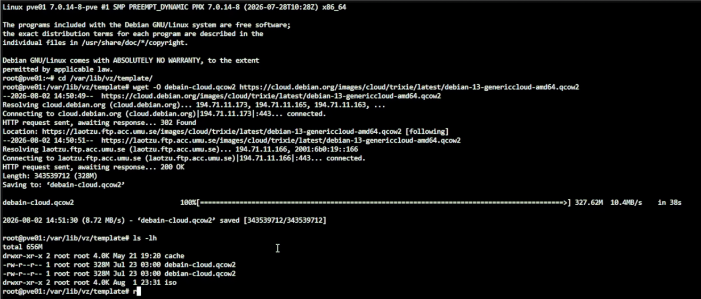

Cloud Image 不是安裝 ISO，所以不從 `ISO Images` 上傳。檔案只暫存在節點目錄，匯入完成並驗證後即可移除。

## 2. 建立 Template VM 9001

1. 右上角按 `Create VM`。
2. `General`：Node 選 `pve01`、VM ID 填 `9001`、Name 填 `debian-cloud-template`。
3. `OS`：選 `Do not use any media`，Type 選 Linux。
4. `System`：Machine 用預設，SCSI Controller 選 `VirtIO SCSI single`，勾選 `Qemu Agent`。
5. `Disks`：刪除精靈預設建立的磁碟，Template 將匯入 Cloud Image。
6. `CPU`：1 Socket、2 Cores、Type 選 `host`。
7. `Memory`：2048 MiB，Ballooning 最低值可設 1024 MiB。
8. `Network`：第一次準備 Template 時暫時選 `vmbr0`、Model 選 `VirtIO`，VLAN Tag 留白。此時 OPNsense 與內部 VLAN DHCP 尚未部署，若先接 `vmbr1`，Cloud-Init 會等待不存在的 DHCP，後續也無法下載套件。`vmbr0` 只用於取得現有路由器的 DHCP 與完成 Template 更新。
9. 取消 `Start after created`，按 `Finish`。

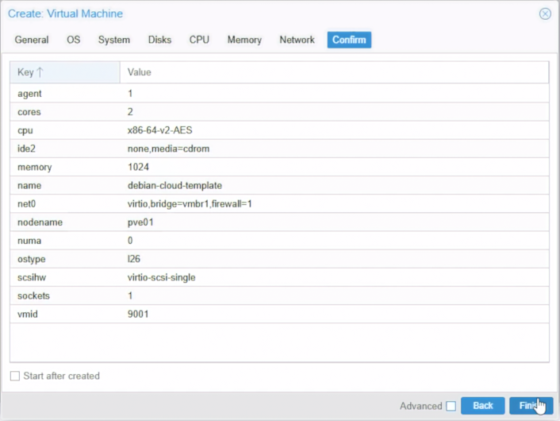

建立完成後先到 VM 9001 → `Hardware` 檢查。如果仍有精靈建立的空白 `Hard Disk (scsi0)`（通常是 32 GiB），先選取它按 `Detach`，再選取出現的 `Unused Disk` 按 `Remove` 並確認刪除。這一步只刪除剛建立、尚未寫入資料的空白磁碟；若不是全新的 VM 9001，不可照做。必須先移除預設空白磁碟，才能避免稍後把它誤認成 Debian Cloud Image。

## 3. 匯入 Cloud Image

在 `pve01` Shell 執行：

```bash
ls -lh /var/lib/vz/template/debian-cloud.qcow2
qm disk import 9001 /var/lib/vz/template/debian-cloud.qcow2 local-lvm
```

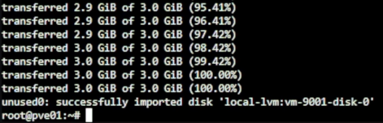

指令完成時必須看到成功匯入為 `unused0` 的訊息。若 Web UI 沒有出現新的 `Unused Disk`，不要開機，先執行 `qm config 9001` 與 `pvesm list local-lvm --vmid 9001` 確認；一顆沒有分割區的 32 GiB 預設空白磁碟不是 Debian Cloud Image。

接著回到 Web UI：

1. VM 9001 → `Hardware`，選 `Unused Disk 0` → `Edit`／`Add`。
2. Bus/Device 選 `SCSI 0`，Discard 勾選，SSD Emulation 可依底層儲存設定。

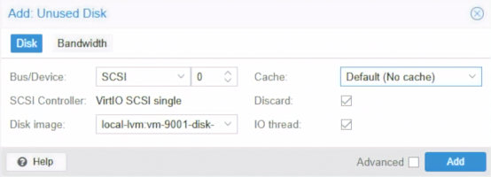

3. 如果 `Hardware` 仍有建立 VM 時自動產生的空白 `CD/DVD Drive (ide2)`，選取它並按 `Remove`。即使建立 VM 時選了 `Do not use any media`，PVE 仍可能保留一個空白光碟裝置並占用 `ide2`。
4. `Add` → `CloudInit Drive`，Storage 選 `local-lvm`，Bus/Device 選 `IDE 2`。不要選 `SCSI 0`；`scsi0` 必須保留給上一步掛載的 Debian 系統磁碟。

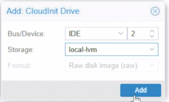

5. 若要保留後續測試 Serial Console 的能力，可用 `Add` → `Serial Port`，Port 填 `0`。GUI 會建立 `serial0`；底層設定顯示為 `serial0: socket`。本步驟可以保留裝置，但首次開機不強制使用它。

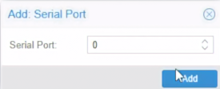

6. 到 `Options` → `Boot Order`，只啟用 `scsi0`，並放在第一順位。

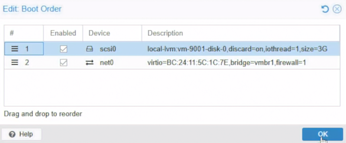

7. `Hardware` → `Display` 保持 `Default`，首次開機使用一般 Console。不要先改成 `Serial terminal 0`；如果畫面只停在 `Starting serial terminal on interface serial0`，代表 PVE 已連上序列埠，但 Guest 沒有輸出到該介面，改回 `Default` 即可看到正常開機畫面。

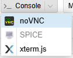

開機前再次確認 `Hardware`：Debian Cloud Image 應顯示為 `Hard Disk (scsi0)`，CloudInit Drive 應顯示為 `CloudInit Drive (ide2)`。如果看到 `Boot failed: not a bootable disk`，通常是 CloudInit Drive 誤占 `scsi0`，或匯入的 Debian 磁碟仍停在 `Unused Disk`；先關機並修正磁碟位置，不要反覆重啟。

## 4. 設定 Cloud-Init 基線

選 VM 9001 → `Cloud-Init`：

1. User 填日後 Lab 共用的管理帳號，例如 `labadmin`。
2. `Password` 只能填登入密碼，不能貼 SSH 公鑰。若只允許金鑰登入，此欄留空；若需要從 Console 以密碼首次登入，可先設定 Lab 專用的暫時密碼。
3. 在獨立的 `SSH public key` 欄位貼入 `.pub` 公鑰內容，例如以 `ssh-ed25519` 或 `ssh-rsa` 開頭的一整行。不要貼入私鑰，也不要把公鑰貼到 `Password` 欄位。
4. IP Config 選 `DHCP`，Template 不寫死任何服務 VM IP。
5. DNS Domain 可填 `lab.home`；DNS Server 留給部署時或 DHCP 決定。
6. 按 `Regenerate Image`。

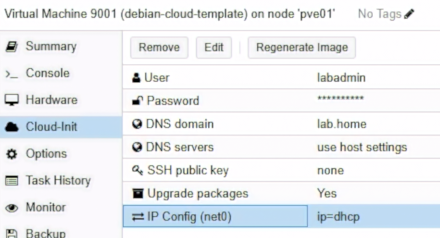

首次開機前到 `pve01` Shell 驗證：

```bash
qm config 9001 | grep ipconfig0
qm cloudinit dump 9001 network
```

第一條必須看到 `ipconfig0: ip=dhcp`；第二條除了 nameserver，還必須出現對應 `net0`／MAC Address 的 physical network 與 DHCP subnet。若只看到 nameserver，代表 `IP Config (net0)` 沒有成功儲存，不能直接開機，應回到 Cloud-Init 頁面重新編輯 DHCP 並按 `Regenerate Image`。

如果 VM 已在缺少 network-data 的狀態下開過機，Cloud-Init 會記住該次結果，單純重新開機不一定重新套用。先在 Guest 執行：

```bash
sudo cloud-init clean --logs
sudo shutdown -h now
```

關機後在 PVE 確認 DHCP 設定、按 `Regenerate Image`，再重新啟動。

Template 應保存的內容：作業系統、VirtIO 驅動、QEMU Guest Agent、更新基線。Template 不應保存：正式 Hostname、固定 IP、服務密碼、Patroni 身分或資料庫資料。

## 5. 安裝 QEMU Guest Agent 並清理基線

1. 啟動尚未轉換的 VM 9001，從 Console 或 SSH 登入。
2. 執行：

```bash
sudo apt update
sudo apt install -y qemu-guest-agent cloud-init
sudo systemctl enable --now qemu-guest-agent
sudo cloud-init status --wait
```

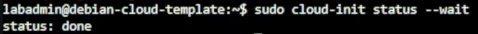

3. 確認 Guest Agent 與 Cloud-Init 正常後，先保留錄影素材。
4. 確認 VM 9001 沒有使用者資料，再清除 Cloud-Init 狀態與 Machine ID：

```bash
sudo cloud-init clean --logs --machine-id
sudo shutdown -h now
```

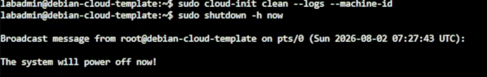

## 6. 轉成 Template 並建立測試 VM

1. 確認 VM 9001 已完全關機。
2. 右鍵 VM 9001 → `Convert to template`，確認轉換。
3. 右鍵 Template 9001 → `Clone`。
4. Mode 選 `Full Clone`，VM ID 填 `902`，Name 填 `cloudinit-test01`。

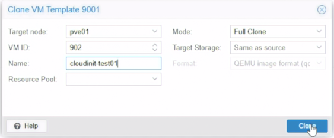

5. 測試 Clone 暫時保留 `vmbr0`，再到 `Cloud-Init` 設定 User、SSH Key、Hostname 與 DHCP，使用現有路由器驗證首次開機。
6. 按 `Regenerate Image` 後啟動。
7. 確認 PVE Summary 顯示 Guest Agent 回報的 IP。

```bash
cloud-init status
hostnamectl
ip -4 -br address
systemctl status qemu-guest-agent --no-pager
```

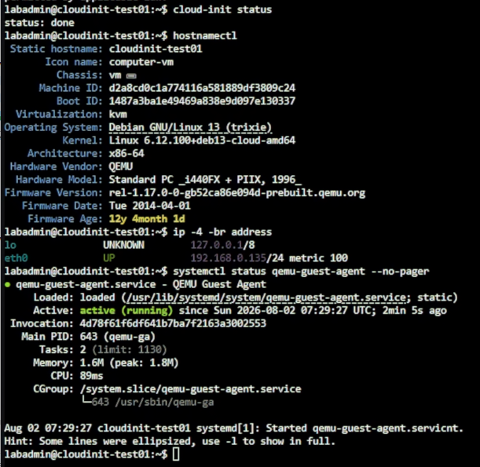

## 7. 後續服務 VM 的 VMID

| VMID | 名稱 | 初始節點 | VLAN |
|---:|---|---|---:|
| 201 | proxy01 | pve01 | 20 |
| 202 | proxy02 | pve02 | 20 |
| 211 | app01 | pve02 | 20 |
| 212 | app02 | pve03 | 20 |
| 221 | pg01 | pve01 | 30 |
| 222 | pg02 | pve02 | 30 |
| 223 | pg03 | pve03 | 30 |
| 231 | jump01 | pve03 | 50 |
| 241 | client01 | pve03 | 20 |
| 251 | monitor01 | pve02 | 20 |
| 261 | backup01 | pve01 | 40 |

真正建立這些服務 VM 時，從同一基線 Clone，在第一次開機前先把 Network Device 的 Bridge 從暫時使用的 `vmbr0` 改成 `vmbr1`，再填入對應 VLAN Tag、Hostname 與服務設定。不要讓正式服務 VM 長期留在現有路由器的管理網路。
