# Day 07｜三台 PVE 如何組成叢集：Corosync、法定票數與 Ceph 共享儲存

對應文章：[Day 07｜三台 PVE 如何組成叢集：Corosync、法定票數與 Ceph 共享儲存](https://ithelp.ithome.com.tw/users/20183351/ironman/9461)

## 建立前檢查

- Hostname 分別是 `pve01`、`pve02`、`pve03`，FQDN 位於 `lab.home`。
- Corosync IP 分別為 `10.77.80.11/24`、`10.77.80.12/24`、`10.77.80.13/24`，不設定 Gateway。
- 節點間能經 `10.77.80.0/24` 直接互通。

各節點執行檢查：

```bash
hostname --fqdn
ip -4 -br address
ip route
timedatectl
pvecm status
```

## 1. 建立 Cluster 前確認 Chrony

### 1.1 檢查外層 pve-l0

```bash
systemctl is-active chrony
chronyc tracking
chronyc sources -v
timedatectl
date -Is
```

### 1.2 分別檢查 pve01、pve02、pve03

```bash
systemctl is-active chrony
chronyc tracking
chronyc sources -v
timedatectl
date -Is
```

### 1.3 Chrony 未啟動處理

若未安裝或未啟動，執行：

```bash
apt update
apt install -y chrony
systemctl enable --now chrony
```

確認並停用其他 NTP Client：

```bash
systemctl is-active systemd-timesyncd
systemctl is-active chrony
systemctl disable --now systemd-timesyncd
systemctl restart chrony
```

### 1.4 時間強制校正

```bash
chronyc makestep
chronyc tracking
chronyc sources -v
date -Is
```

## 2. 複查 Corosync 網路

```bash
ping -c 3 10.77.80.11
ping -c 3 10.77.80.12
ping -c 3 10.77.80.13
```

## 3. 在 pve01 建立 Cluster

1. 登入 pve01。
2. 選 `Datacenter` → `Cluster` → `Create Cluster`。
3. Cluster Name 填 `iron-lab`。
4. Link 0 選 `10.77.80.11`。
5. 按 `Create`。
6. 選 `Join Information`，複製資訊。

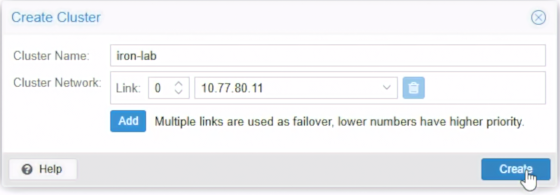

Shell 驗證：

```bash
pvecm status
pvecm nodes
systemctl status corosync --no-pager
```

## 4. 加入 pve02

1. 登入 pve02 Web UI。
2. 選 `Datacenter` → `Cluster` → `Join Cluster`。
3. 貼上 Join Information，輸入密碼。
4. Link 0 選 `10.77.80.12`。
5. 按 `Join`。
6. 回到 pve01 確認出現 pve02。

```bash
pvecm nodes
pvecm status
```

## 5. 加入 pve03

1. 登入 pve03 Web UI。
2. 重複加入步驟，Link 0 選 `10.77.80.13`。
3. 按 `Join`。
4. 回 pve01 確認三個 Node 皆出現。

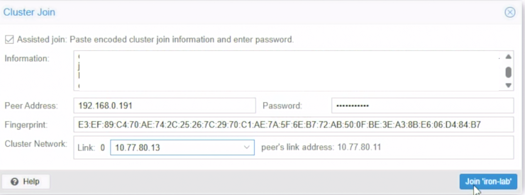

```bash
pvecm nodes
pvecm status
corosync-cfgtool -s
```

## 6. 關閉一個節點

在 L0 將 VM 103 Shutdown：

1. pve03 變成離線。
2. pve01 執行 `pvecm status`，確認 Total votes 2、Quorate Yes。

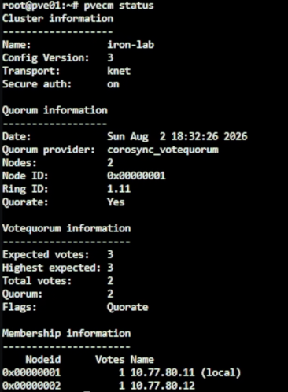

## 7. 再關閉一個節點

在 L0 將 VM 102 Shutdown：

1. pve01 執行 `pvecm status`，確認 Total votes 1、Quorate No。

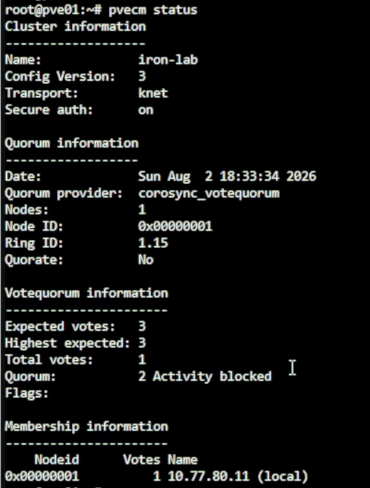

```bash
pvecm status
pvecm nodes
journalctl -u corosync -n 80 --no-pager
```

## 8. 恢復節點

1. 在 L0 啟動 VM 102，等待開機。
2. 確認恢復兩票。
3. 啟動 VM 103。
4. 確認三節點皆 Online、Total votes 回到 3。

## 9. 安裝 Ceph Squid 套件

三台節點執行：

```bash
pveceph install --repository no-subscription --version squid
ceph --version
```

確認為 `Ceph 19.2 Squid` 後輸入 `y`。

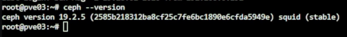

確認版本與 Repository：

```bash
apt policy ceph-common ceph-osd ceph-mon
```

排查衝突用（若有需要）：

```bash
grep -RhsnE 'enterprise\.proxmox|download\.proxmox|ceph-' \
  /etc/apt/sources.list /etc/apt/sources.list.d 2>/dev/null
apt-cache policy ceph-common ceph-base ceph-mon ceph-osd
```

## 10. 初始化 Ceph Cluster

只在 pve01 執行：

```bash
pveceph init --network 10.77.70.0/24 --cluster-network 10.77.70.0/24
```

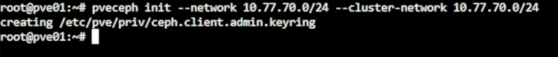

## 11. 建立 MON 與 MGR

三台節點各執行：

```bash
pveceph mon create
```

pve01、pve02 執行：

```bash
pveceph mgr create
```

Web UI 確認狀態：

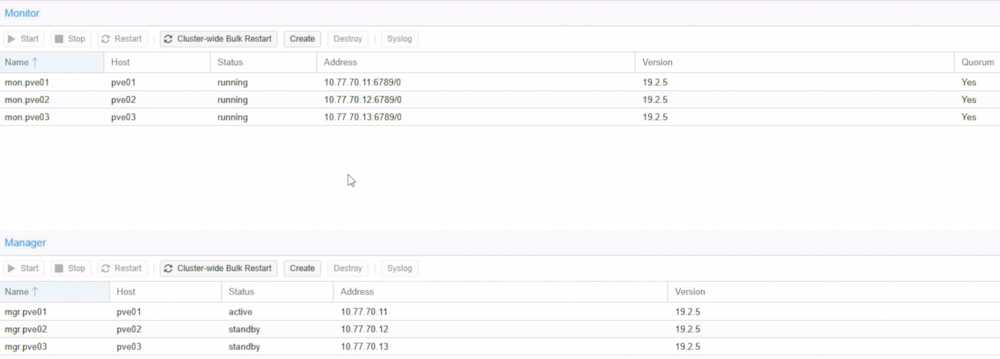

```bash
ceph -s
ceph mon dump
ceph mgr dump
```

## 12. 建立三個 OSD

各節點執行：

1. 選節點 → `Ceph` → `OSD` → `Create: OSD`。
2. 選 40 GiB 空白磁碟。
3. 按 `Create`。

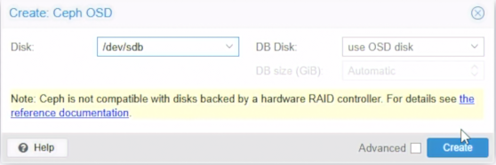

設定 Lab 記憶體限制：

```bash
ceph config set osd osd_memory_target 2147483648
ceph config get osd osd_memory_target
ceph -s
```

## 13. 建立 ceph-vm Pool

1. 選 `Ceph` → `Pools` → `Create`。
2. Name `ceph-vm`，Size `3`，Min. Size `2`。
3. `PG Autoscale Mode` 選 `on`。
4. 按 `Create`。

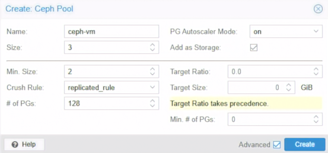

確認 Application：

```bash
ceph osd pool application get ceph-vm
```

若無 `rbd` 則執行：

```bash
ceph osd pool application enable ceph-vm rbd
```

```bash
ceph osd pool ls detail
pvesm status
ceph df
```

## 14. 建立 5GiB CephFS 共用 ISO

### 14.1 建立 MDS

pve01、pve02 執行：

1. 選 `Ceph` → `CephFS` → `Metadata Servers`。
2. 確認 Node，按 `Create`。

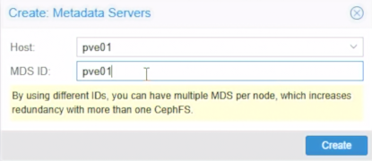

```bash
pveceph mds create
ceph mds stat
```

### 14.2 建立 CephFS 與加入 Storage

1. 選 `Ceph` → `CephFS` → `Create CephFS`。
2. Name `cephfs`，`PG Num` `32`。
3. `PG Autoscale Mode` `on`。
4. 勾選 `Add as Storage`，按 `Create`。

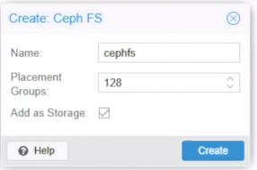

```bash
ceph fs ls
ceph fs status cephfs
ceph mds stat
ceph osd pool ls detail
pvesm status
```

若未自動加入 Storage，手動從 `Datacenter` → `Storage` 新增 `CephFS`。

### 14.3 確認 PG 與 Autoscaler

```bash
ceph osd pool get cephfs_data pg_num
ceph osd pool get cephfs_metadata pg_num
ceph osd pool get cephfs_metadata pg_num_min
ceph osd pool get cephfs_metadata pg_autoscale_bias
ceph osd pool get cephfs_data pg_autoscale_mode
ceph osd pool get cephfs_metadata pg_autoscale_mode
ceph osd pool autoscale-status
```

必要時開啟 Autoscale：

```bash
ceph osd pool set cephfs_data pg_autoscale_mode on
ceph osd pool set cephfs_metadata pg_autoscale_mode on
```

確認 Size：

```bash
ceph osd pool get cephfs_data size
ceph osd pool get cephfs_data min_size
ceph osd pool get cephfs_metadata size
ceph osd pool get cephfs_metadata min_size
```

必要時修正 Size：

```bash
ceph osd pool set cephfs_data size 3
ceph osd pool set cephfs_data min_size 2
ceph osd pool set cephfs_metadata size 3
ceph osd pool set cephfs_metadata min_size 2
```

### 14.4 限制根目錄為 5GiB (選用)

```bash
findmnt /mnt/pve/cephfs
df -h /mnt/pve/cephfs
apt update
apt install -y attr
setfattr -n ceph.quota.max_bytes -v 5368709120 /mnt/pve/cephfs
getfattr -n ceph.quota.max_bytes /mnt/pve/cephfs
df -h /mnt/pve/cephfs
```

### 14.5 上傳 ISO

1. 選 `cephfs` → `ISO Images`。
2. 上傳 ISO，確認三台節點均可讀取。

```bash
ceph fs status cephfs
ceph df
df -h /mnt/pve/cephfs
find /mnt/pve/cephfs/template/iso -maxdepth 1 -type f -printf '%f %s bytes\n'
```
