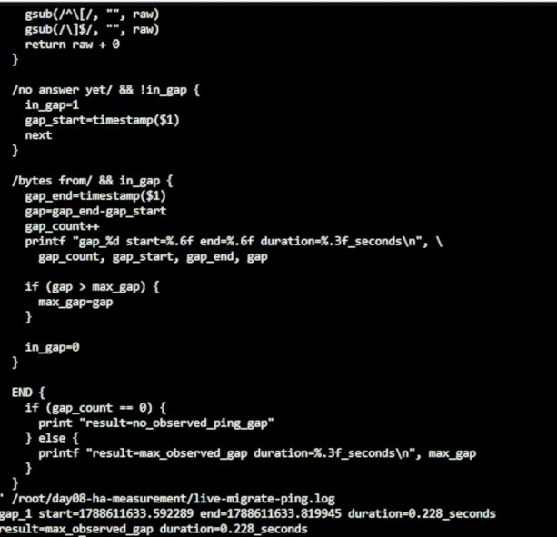
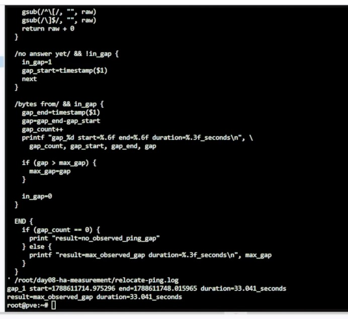
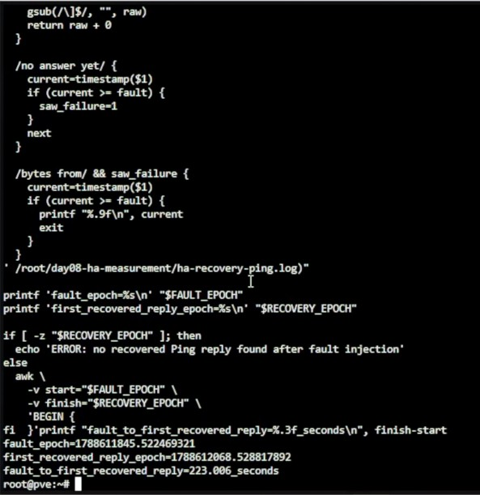
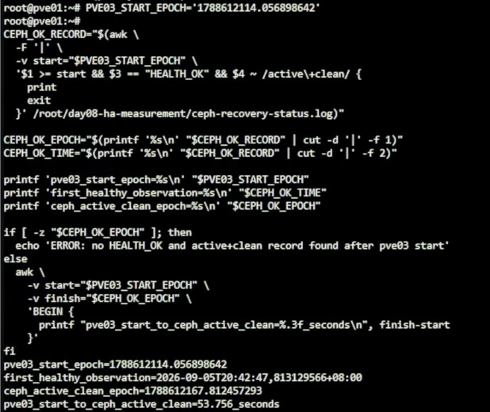

# Day 08 額外實作｜PVE Migration、HA Recovery 與 Ceph Recovery 時間量測

對應文章：[Day 08｜節點故障後 VM 如何接手：Proxmox VE 遷移、HA 隔離與恢復時間量測](https://ithelp.ithome.com.tw/articles/10408380)

## 0. 測試前的停止條件

出現以下任一情況時不要注入故障：

- `pvecm status` 不是三票且沒有 Quorum。
- `ceph -s` 不是 `HEALTH_OK`。
- 三個 OSD 沒有全部顯示 `up`、`in`。
- 測試 VM 的任何必要磁碟仍位於 `local-lvm`。
- HA Resource 已經進入 Error，或 Request State 不是 `started`。
- 另一台 Nested PVE、MON 或 OSD 已經離線。
- 無法確定測試 VM 目前位於哪個節點。
- 測試 VM 內含不能丟失的重要資料。

測試過程一次只停止一台 Nested PVE，不使用 `pvecm expected 1` 改寫投票門檻，也不在 HA Recovery 期間手動啟動同一台測試 VM。

## 1. 準備四個操作畫面

在瀏覽器開啟四個分頁或四個獨立視窗：

1. **L0 管理畫面**：登入 `pve-l0`，稍後用來停止與恢復 Nested PVE。
2. **Cluster 管理畫面**：登入不會在本次測試中停止的 pve01、pve02 或 pve03。
3. **L0 Probe Shell**：在 `pve-l0` 開啟 `Shell`，持續 Ping 測試 VM。
4. **Cluster 觀察 Shell**：在存活的 Nested PVE 開啟 `Shell`，記錄 HA 與 Ceph 狀態。

Cluster 管理畫面不能登入即將停止的節點，否則故障發生後 Web UI 會一起中斷。每次進行節點故障測試前，都要先重新確認測試 VM 的所在節點，再選另一台存活節點作為 Cluster 管理入口。

## 2. 確認測試 VM 與基準狀態

### 2.1 從 Web UI 找出測試 VM 所在節點

在 Cluster 管理畫面依序操作：

1. 點選左側 `Datacenter`。
2. 點選 `HA`。
3. 開啟 `Status`。
4. 找到 `vm:903`。
5. 記錄目前節點與狀態；狀態必須是 `started`。

如果實際使用的測試 VM 不是 VMID 903，從這一步開始將所有 `903` 改成自己的 VMID。

### 2.2 從 Nested PVE Shell 交叉確認

在任一正常的 Nested PVE 開啟 `Shell`，執行：

```bash
TEST_VMID=903

pvecm status
ha-manager config
ha-manager status
qm config "$TEST_VMID" |
  grep -E '^(cpu|net[0-9]+|scsi[0-9]+|virtio[0-9]+|sata[0-9]+|ide[0-9]+|efidisk[0-9]+|tpmstate[0-9]+):'
ceph -s
ceph pg stat
```

預期結果：

- `pvecm status` 顯示 `Quorate: Yes`，三個節點都有一票。
- `ha-manager status` 顯示 `vm:903` 為 `started`，並列出目前節點。
- 測試 VM 的系統磁碟、Cloud-Init Drive，以及存在時的 EFI／TPM Disk 都位於 `ceph-vm`。
- `ceph -s` 顯示 `HEALTH_OK`，三個 OSD 都是 `up`、`in`。
- `ceph pg stat` 顯示全部 PG 為 `active+clean`。

若 `ha-manager config` 沒有 `vm:903`，先回到原本的 Day 08 實作文件完成 HA Resource 與 Affinity Rule，不要在量測途中臨時補建。

### 2.3 找出測試 VM 的 IPv4 位址

在 Cluster Web UI：

1. 從左側選取 VM 903。
2. 點選 `Summary`。
3. 在 `IP Addresses` 確認測試 VM 接在 `vmbr0` 的 IPv4 位址是 `192.168.0.169`。
4. 不要使用 `127.0.0.1`、IPv6 Link-local 位址或 Nested PVE 本身的管理位址。

如果 Summary 沒有顯示位址，從 VM Console 登入後執行：

```bash
ip -4 -br address
```

本文後續命令固定使用 `192.168.0.169`。如果 VM 內看到其他位址，先修正 DHCP Reservation 或 VM 網路設定，不要在量測過程中混用不同位址。

### 2.4 從 L0 確認 Probe 路徑

在 `pve-l0` 的 Probe Shell 執行：

```bash
ping -n -c 5 192.168.0.169
```

五次都能收到回覆才繼續。測試 VM 由 DHCP 取得位址時，Migration 不會改變它的虛擬網卡 MAC Address，通常會繼續使用同一筆租約；仍應以這一步實際看到的位址為準。

### 2.5 確認各主機時間可以互相比對

在 L0 與任一正常 Nested PVE 分別執行：

```bash
date --iso-8601=ns
timedatectl show \
  -p NTPSynchronized \
  -p Timezone \
  -p LocalRTC
```

兩邊時間應一致，`NTPSynchronized=yes`，`LocalRTC=no`。若時間不同步，先回到 Day 07 的 Chrony 檢查流程；不要用彼此不一致的時間戳計算恢復時間。

## 3. 將測試 VM 放到固定起點

後續使用固定路徑：Live Migration 從 pve01 到 pve02，Relocate 從 pve02 到 pve03，最後停止承載測試 VM 的 pve03。這樣每個節點、VMID 與目標位置都是確定值。

在 pve01 Shell 完整執行：

```bash
mkdir -p /root/day08-ha-measurement
rm -f \
  /root/day08-ha-measurement/live-migrate-status.log \
  /root/day08-ha-measurement/live-migrate-requested.txt \
  /root/day08-ha-measurement/live-migrate-completed.txt

pvecm status
ceph -s
ha-manager status

ha-manager relocate vm:903 pve01

while true; do
  CURRENT_STATUS="$(ha-manager status | grep 'service vm:903')"
  date --iso-8601=ns
  printf '%s\n' "$CURRENT_STATUS"

  if printf '%s\n' "$CURRENT_STATUS" |
    grep -qE 'service vm:903 \(pve01, started\)'; then
    break
  fi

  sleep 1
done

ping -n -c 5 192.168.0.169
```

如果 VM 原本就在 pve01，`ha-manager relocate` 可能回覆不需要移動；只要後面顯示 `service vm:903 (pve01, started)` 且五次 Ping 全部成功，即可繼續。

## 4. 測量 Live Migration 中斷時間

### 4.1 在 L0 啟動獨立 Probe

在 `pve-l0` Shell 完整執行：

```bash
mkdir -p /root/day08-ha-measurement
rm -f /root/day08-ha-measurement/live-migrate-ping.log

stdbuf -oL ping \
  -n \
  -D \
  -O \
  -i 0.2 \
  192.168.0.169 2>&1 |
  tee /root/day08-ha-measurement/live-migrate-ping.log
```

畫面持續出現 `bytes from 192.168.0.169` 後，保持這個 Probe 運作。

### 4.2 在 pve01 觸發移動並計時

在 pve01 的另一個 Shell 完整執行：

```bash
mkdir -p /root/day08-ha-measurement
rm -f \
  /root/day08-ha-measurement/live-migrate-status.log \
  /root/day08-ha-measurement/live-migrate-requested.txt \
  /root/day08-ha-measurement/live-migrate-completed.txt

date --iso-8601=ns |
  tee /root/day08-ha-measurement/live-migrate-requested.txt

ha-manager migrate vm:903 pve02

while true; do
  CURRENT_TIME="$(date --iso-8601=ns)"
  CURRENT_STATUS="$(ha-manager status | grep 'service vm:903')"
  printf '%s %s\n' "$CURRENT_TIME" "$CURRENT_STATUS" |
    tee -a /root/day08-ha-measurement/live-migrate-status.log

  if printf '%s\n' "$CURRENT_STATUS" |
    grep -qE 'service vm:903 \(pve02, started\)'; then
    date --iso-8601=ns |
      tee /root/day08-ha-measurement/live-migrate-completed.txt
    break
  fi

  sleep 1
done
```

回到 L0 Probe Shell，確認 Ping 已連續正常至少 10 秒，按 `Ctrl+C` 停止。

### 4.3 直接計算 Live Migration 的 Ping 中斷

在 `pve-l0` Shell 完整執行：

```bash
awk '
  function timestamp(raw) {
    gsub(/^\[/, "", raw)
    gsub(/\]$/, "", raw)
    return raw + 0
  }

  /no answer yet/ && !in_gap {
    in_gap=1
    gap_start=timestamp($1)
    next
  }

  /bytes from/ && in_gap {
    gap_end=timestamp($1)
    gap=gap_end-gap_start
    gap_count++
    printf "gap_%d start=%.6f end=%.6f duration=%.3f_seconds\n", \
      gap_count, gap_start, gap_end, gap

    if (gap > max_gap) {
      max_gap=gap
    }

    in_gap=0
  }

  END {
    if (gap_count == 0) {
      print "result=no_observed_ping_gap"
    } else {
      printf "result=max_observed_gap duration=%.3f_seconds\n", max_gap
    }
  }
' /root/day08-ha-measurement/live-migrate-ping.log
```

`result=no_observed_ping_gap` 表示在 0.2 秒 Probe 間隔內沒有觀察到中斷，不代表絕對零停機。出現一個以上的 Gap 時，最後一行就是本次實驗觀察到的最長中斷。

本次實測得到 `result=max_observed_gap duration=0.228_seconds`。



*圖（一）Live Migration Ping 中斷量測結果。*

## 5. 測量 Relocate 中斷時間

### 5.1 在 L0 啟動新的 Probe

在 `pve-l0` Shell 完整執行：

```bash
rm -f /root/day08-ha-measurement/relocate-ping.log

stdbuf -oL ping \
  -n \
  -D \
  -O \
  -i 0.2 \
  192.168.0.169 2>&1 |
  tee /root/day08-ha-measurement/relocate-ping.log
```

畫面持續出現 `bytes from 192.168.0.169` 後，保持 Probe 運作。

### 5.2 在 pve01 觸發 Relocate

第 4 節完成後，VM 903 應位於 pve02。在 pve01 Shell 完整執行：

```bash
rm -f \
  /root/day08-ha-measurement/relocate-status.log \
  /root/day08-ha-measurement/relocate-requested.txt \
  /root/day08-ha-measurement/relocate-completed.txt

ha-manager status |
  grep 'service vm:903'

date --iso-8601=ns |
  tee /root/day08-ha-measurement/relocate-requested.txt

ha-manager relocate vm:903 pve03

while true; do
  CURRENT_TIME="$(date --iso-8601=ns)"
  CURRENT_STATUS="$(ha-manager status | grep 'service vm:903')"
  printf '%s %s\n' "$CURRENT_TIME" "$CURRENT_STATUS" |
    tee -a /root/day08-ha-measurement/relocate-status.log

  if printf '%s\n' "$CURRENT_STATUS" |
    grep -qE 'service vm:903 \(pve03, started\)'; then
    date --iso-8601=ns |
      tee /root/day08-ha-measurement/relocate-completed.txt
    break
  fi

  sleep 1
done
```

回到 L0 Probe Shell，確認 Ping 已連續正常至少 10 秒，按 `Ctrl+C`。

### 5.3 直接計算 Relocate 的 Ping 中斷

在 `pve-l0` Shell 完整執行：

```bash
awk '
  function timestamp(raw) {
    gsub(/^\[/, "", raw)
    gsub(/\]$/, "", raw)
    return raw + 0
  }

  /no answer yet/ && !in_gap {
    in_gap=1
    gap_start=timestamp($1)
    next
  }

  /bytes from/ && in_gap {
    gap_end=timestamp($1)
    gap=gap_end-gap_start
    gap_count++
    printf "gap_%d start=%.6f end=%.6f duration=%.3f_seconds\n", \
      gap_count, gap_start, gap_end, gap

    if (gap > max_gap) {
      max_gap=gap
    }

    in_gap=0
  }

  END {
    if (gap_count == 0) {
      print "result=no_observed_ping_gap"
    } else {
      printf "result=max_observed_gap duration=%.3f_seconds\n", max_gap
    }
  }
' /root/day08-ha-measurement/relocate-ping.log
```

這個結果包含 VM 停止、在 pve03 重新啟動與 Guest 網路恢復的時間，不是 Live Migration。

本次實測得到 `result=max_observed_gap duration=33.041_seconds`。



*圖（二）Relocate Ping 中斷量測結果。*

## 6. 測量 pve03 故障後的 HA Recovery

第 5 節完成後，VM 903 固定位於 pve03，因此本節要在 L0 停止的是 VMID 103。

### 6.1 在 pve01 確認可以安全測試

在 pve01 Shell 完整執行：

```bash
pvecm status
ceph -s
ceph pg stat
ha-manager status |
  grep 'service vm:903'
```

只有同時看到 `Quorate: Yes`、`HEALTH_OK`、全部 PG 為 `active+clean` 與 `service vm:903 (pve03, started)` 時才繼續。

### 6.2 在 L0 啟動 HA Recovery Probe

在 `pve-l0` Shell 完整執行：

```bash
rm -f /root/day08-ha-measurement/ha-recovery-ping.log

stdbuf -oL ping \
  -n \
  -D \
  -O \
  -i 0.2 \
  192.168.0.169 2>&1 |
  tee /root/day08-ha-measurement/ha-recovery-ping.log
```

看到連續回覆後，保持 Probe 運作。

### 6.3 在 pve01 記錄 HA 與 Ceph 狀態

在 pve01 的另一個 Shell 完整執行：

```bash
mkdir -p /root/day08-ha-measurement
rm -f \
  /root/day08-ha-measurement/ha-recovery-status.log \
  /root/day08-ha-measurement/ceph-recovery-status.log

while true; do
  CURRENT_EPOCH="$(date +%s.%N)"
  CURRENT_TIME="$(date --iso-8601=ns)"
  HA_STATUS="$(ha-manager status | grep 'service vm:903')"
  CEPH_HEALTH="$(ceph health)"
  CEPH_PG="$(ceph pg stat)"

  printf '%s|%s|%s\n' "$CURRENT_EPOCH" "$CURRENT_TIME" "$HA_STATUS" |
    tee -a /root/day08-ha-measurement/ha-recovery-status.log
  printf '%s|%s|%s|%s\n' \
    "$CURRENT_EPOCH" "$CURRENT_TIME" "$CEPH_HEALTH" "$CEPH_PG" |
    tee -a /root/day08-ha-measurement/ceph-recovery-status.log

  sleep 1
done
```

先看到 VM 位於 pve03、Ceph 為 `HEALTH_OK` 後，保持這個紀錄命令運作。

### 6.4 在 L0 停止 pve03

在 `pve-l0` 的另一個 Shell 完整執行：

```bash
mkdir -p /root/day08-ha-measurement

qm config 103 |
  grep '^name:'
qm status 103

date +%s.%N |
  tee /root/day08-ha-measurement/ha-fault-injected.epoch
date --iso-8601=ns |
  tee /root/day08-ha-measurement/ha-fault-injected.iso

qm stop 103
qm status 103
```

執行前，`qm config 103` 必須顯示 `name: pve03`，`qm status 103` 必須先顯示 `running`；停止後必須顯示 `stopped`。

### 6.5 等待 VM 自動恢復

不要手動啟動 VM 903。在 pve01 的另一個 Shell 完整執行：

```bash
while true; do
  CURRENT_TIME="$(date --iso-8601=ns)"
  CURRENT_STATUS="$(ha-manager status | grep 'service vm:903')"
  printf '%s %s\n' "$CURRENT_TIME" "$CURRENT_STATUS"

  if printf '%s\n' "$CURRENT_STATUS" |
    grep -qE 'service vm:903 \(pve0[12], started\)'; then
    break
  fi

  sleep 1
done
```

同時觀察 L0 Probe。Ping 恢復後繼續等待 10 秒，再按 `Ctrl+C`。pve01 上第 6.3 節的 HA／Ceph 紀錄仍要繼續運作。

### 6.6 直接計算 HA Recovery 的網路中斷

在 `pve-l0` Shell 完整執行：

```bash
awk '
  function timestamp(raw) {
    gsub(/^\[/, "", raw)
    gsub(/\]$/, "", raw)
    return raw + 0
  }

  /no answer yet/ && !in_gap {
    in_gap=1
    gap_start=timestamp($1)
    next
  }

  /bytes from/ && in_gap {
    gap_end=timestamp($1)
    gap=gap_end-gap_start
    gap_count++
    printf "gap_%d start=%.6f end=%.6f duration=%.3f_seconds\n", \
      gap_count, gap_start, gap_end, gap

    if (gap > max_gap) {
      max_gap=gap
    }

    in_gap=0
  }

  END {
    if (gap_count == 0) {
      print "result=no_observed_ping_gap"
    } else {
      printf "result=max_observed_gap duration=%.3f_seconds\n", max_gap
    }
  }
' /root/day08-ha-measurement/ha-recovery-ping.log
```

這個結果是從第一次確定沒收到 Ping 回覆，到 VM 在存活節點重新回覆的可觀察中斷。

### 6.7 計算從故障注入到第一次 Ping 恢復

同樣在 `pve-l0` Shell 完整執行：

```bash
FAULT_EPOCH="$(cat /root/day08-ha-measurement/ha-fault-injected.epoch)"

RECOVERY_EPOCH="$(awk -v fault="$FAULT_EPOCH" '
  function timestamp(raw) {
    gsub(/^\[/, "", raw)
    gsub(/\]$/, "", raw)
    return raw + 0
  }

  /no answer yet/ {
    current=timestamp($1)
    if (current >= fault) {
      saw_failure=1
    }
    next
  }

  /bytes from/ && saw_failure {
    current=timestamp($1)
    if (current >= fault) {
      printf "%.9f\n", current
      exit
    }
  }
' /root/day08-ha-measurement/ha-recovery-ping.log)"

printf 'fault_epoch=%s\n' "$FAULT_EPOCH"
printf 'first_recovered_reply_epoch=%s\n' "$RECOVERY_EPOCH"

if [ -z "$RECOVERY_EPOCH" ]; then
  echo 'ERROR: no recovered Ping reply found after fault injection'
else
  awk \
    -v start="$FAULT_EPOCH" \
    -v finish="$RECOVERY_EPOCH" \
    'BEGIN {
      printf "fault_to_first_recovered_reply=%.3f_seconds\n", finish-start
    }'
fi
```

這個數字包含 HA 偵測節點故障、Fencing／重新指派、VM 啟動與 Guest 網路恢復。

本次從關閉 pve03 到 VM 首次恢復 Ping 共 223.006 秒；從第一筆未回覆到首次恢復回覆的可觀察中斷為 222.170 秒。正文採用前者，因為它以明確的故障注入時間為起點。



*圖（三）HA Recovery 從故障注入到 Ping 恢復的量測結果。*

## 7. 恢復 pve03 並測量 Ceph 恢復時間

### 7.1 在 L0 啟動 pve03 並記錄時間

在 `pve-l0` Shell 完整執行：

```bash
date +%s.%N |
  tee /root/day08-ha-measurement/pve03-started.epoch
date --iso-8601=ns |
  tee /root/day08-ha-measurement/pve03-started.iso

qm start 103
qm status 103

cat /root/day08-ha-measurement/pve03-started.epoch
cat /root/day08-ha-measurement/pve03-started.iso
```

保留畫面中的 `pve03-started.epoch` 數值，第 7.3 節會直接用它計算。

### 7.2 在 pve01 等到 Ceph 完整恢復

第 6.3 節的記錄 Shell 繼續運作。在 pve01 另開一個 Shell，每秒自動檢查是否已完整恢復：

```bash
while true; do
  CURRENT_TIME="$(date --iso-8601=ns)"
  CEPH_HEALTH="$(ceph health)"
  CEPH_PG="$(ceph pg stat)"

  printf '%s %s %s\n' \
    "$CURRENT_TIME" "$CEPH_HEALTH" "$CEPH_PG"

  if [ "$CEPH_HEALTH" = 'HEALTH_OK' ] &&
    printf '%s\n' "$CEPH_PG" |
      grep -q 'active+clean'; then
    break
  fi

  sleep 1
done
```

命令自動結束後，在第 6.3 節的紀錄 Shell 按 `Ctrl+C`。然後在 pve01 執行完整驗證：

```bash
pvecm status
ceph -s
ceph pg stat
ceph mon stat
ceph osd tree
ha-manager status |
  grep 'service vm:903'
```

必須看到三個 PVE 節點恢復 Quorum、三個 MON 在 Quorum、三個 OSD 全部 `up/in`、`HEALTH_OK`、全部 PG 為 `active+clean`，且 VM 903 維持 `started`。

### 7.3 計算 pve03 啟動到 Ceph 恢復的時間

`pve03-started.epoch` 在 L0，Ceph 的每筆觀察時間已寫入 pve01 的 `ceph-recovery-status.log`。在 pve01 執行下列完整命令，只將第一行右側的數字替換為 L0 剛才顯示的 `pve03-started.epoch`：

```bash
PVE03_START_EPOCH='1788600000.000000000'

CEPH_OK_RECORD="$(awk \
  -F '|' \
  -v start="$PVE03_START_EPOCH" \
  '$1 >= start && $3 == "HEALTH_OK" && $4 ~ /active\+clean/ {
    print
    exit
  }' /root/day08-ha-measurement/ceph-recovery-status.log)"

CEPH_OK_EPOCH="$(printf '%s\n' "$CEPH_OK_RECORD" | cut -d '|' -f 1)"
CEPH_OK_TIME="$(printf '%s\n' "$CEPH_OK_RECORD" | cut -d '|' -f 2)"

printf 'pve03_start_epoch=%s\n' "$PVE03_START_EPOCH"
printf 'first_healthy_observation=%s\n' "$CEPH_OK_TIME"
printf 'ceph_active_clean_epoch=%s\n' "$CEPH_OK_EPOCH"

if [ -z "$CEPH_OK_EPOCH" ]; then
  echo 'ERROR: no HEALTH_OK and active+clean record found after pve03 start'
else
  awk \
    -v start="$PVE03_START_EPOCH" \
    -v finish="$CEPH_OK_EPOCH" \
    'BEGIN {
      printf "pve03_start_to_ceph_active_clean=%.3f_seconds\n", finish-start
    }'
fi
```

兩台主機必須已通過 NTP 同步，這個跨主機時間差才可以使用。

本次從啟動 pve03 到 Ceph 同時符合 `HEALTH_OK` 與全部 PG 為 `active+clean`，共 53.756 秒。PG 在 43.790 秒時已全部回到 `active+clean`，其後仍短暫存在 pve03 的時鐘偏差告警，因此完整健康時間採用 53.756 秒。



*圖（四）Ceph 從 pve03 啟動到恢復健康的量測結果。*

## 8. 最後完整驗證

在 pve01 完整執行：

```bash
pvecm status

ceph -s
ceph pg stat
ceph osd tree

ha-manager config
ha-manager status

ping -n -c 5 192.168.0.169
```

在 `pve-l0` 完整執行：

```bash
qm status 101
qm status 102
qm status 103

grep -H -E \
  'packets transmitted|packet loss' \
  /root/day08-ha-measurement/*-ping.log
```

最後整理四個實測數字：

| 欄位                                | 實測值    |
| ----------------------------------- | --------- |
| Live Migration 最長可觀察 Ping 中斷 | 0.228 秒  |
| Relocate 最長可觀察 Ping 中斷       | 33.041 秒 |
| 停止 pve03 到 VM 第一次恢復回覆     | 223.006 秒 |
| 啟動 pve03 到 Ceph 回到完整健康     | 53.756 秒 |

Live Migration／Relocate 的 Ping 中斷、故障注入到 VM 回覆，以及 Ceph 完整恢復是不同指標，不要相加成單一數字。

## 9. 測試失敗時如何安全收尾
如果 VM 長時間沒有在其他節點恢復：

1. 不要停止第二台 Nested PVE。
2. 不要執行 `pvecm expected 1`。
3. 不要手動複製或移動 `/etc/pve/nodes/.../qemu-server/903.conf`。
4. 先在 L0 恢復 VMID 103，也就是 pve03。
5. 等待 Cluster 回到三票 Quorum。
6. 等待 Ceph 回到 `HEALTH_OK` 與 `active+clean`。
7. 再保存以下診斷資料：

在 `pve-l0` Shell 完整執行：

```bash
qm config 103 |
  grep '^name:'
qm status 103

qm start 103
qm status 103
```

`qm config 103` 必須顯示 `name: pve03`。如果 pve03 本來就已經是 `running`，不要再執行第二次 Start。

在 pve01 Shell 等待節點重新加入，然後完整執行：

```bash
pvecm status
ha-manager status
ceph -s
ceph pg stat

journalctl \
  -u pve-ha-crm \
  -u pve-ha-lrm \
  --since '-30 min' \
  -o short-iso-precise \
  --no-pager
```

完成診斷前不要再次注入故障。
## 小結

本額外實作詳細測量了在 Nested PVE 環境下 HA Migration 與 Recovery 的真實中斷時間。數據顯示 Live Migration 的中斷極短，而節點非預期失效後的 HA Recovery 則需要數分鐘才能完全恢復虛擬機與 Ceph 儲存的健康狀態。此基準可作為後續調優或架構設計的參考。
