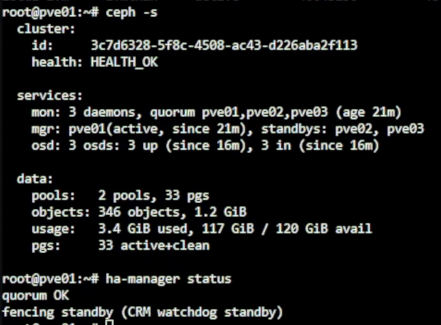
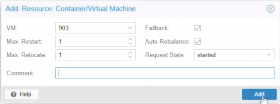
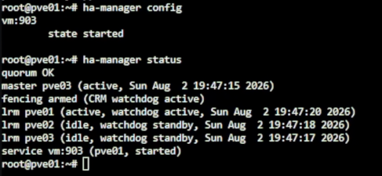
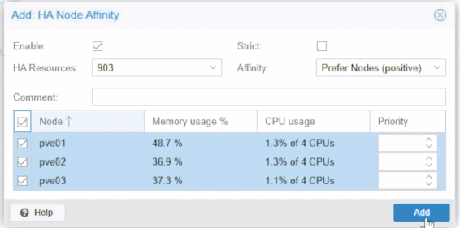

# Day 08｜節點掛掉時 VM 如何復原：Proxmox VE 遷移、HA 隔離與恢復前置

對應文章：[Day 08｜節點掛掉時 VM 如何復原：Proxmox VE 遷移、HA 隔離與恢復前置](https://ithelp.ithome.com.tw/users/20183351/ironman/9461)

今日將聚焦 Proxmox VE 的高可用。基於 Day 07 已建立的 `ceph-vm` RBD Storage，我們可以使用可丟棄測試 VM 實地展示 Migration 與 PVE HA Recovery。

## 1. 盤點 PVE HA 前置條件

1. 登入 Cluster 的 `Datacenter` → `Storage`。
2. 檢查 `ceph-vm` 的 Nodes、Shared 與 Content，並以 `ceph -s` 確認健康。
3. 點選測試 VM 的 `Hardware`，確認所有磁碟是否都位於 `ceph-vm`。
4. 至 `Datacenter` → `HA`，觀察 Affinity Rules、Resources、Status（PVE 9 已使用 HA Affinity Rules 取代 HA Groups）。
5. Shell 驗證：

```bash
pvecm status
pvesm status
ceph -s
ha-manager status
```



如測試 VM 磁碟仍只存在單一節點的 `local-lvm`，節點失效時其他節點找不到該磁碟。只有已移至 `ceph-vm` 的測試 VM 可進行 HA 實作。

## 2. 使用可丟棄 VM 建立 HA Resource

使用 Day 06 的 `cloudinit-test01`，或重新建立一個 VMID 903 測試 VM：

1. 點選測試 VM。
2. 至 VM 的 `Hardware`，選擇系統磁碟，點擊 `Disk Action` → `Move Storage`。
3. Target Storage 選 `ceph-vm`，勾選刪除來源磁碟，按 `Move disk`。
4. 等待 Task 顯示 `OK`，並確認 Hardware 中該磁碟位於 `ceph-vm`。
5. 啟動 VM，確認 Guest 開機後台無誤。
6. 至 `Datacenter` → `HA` → `Resources` → `Add`。
7. Resource 選測試 VM。
8. `Max Restart`、`Max Relocate` 與 Comment 可使用預設值，按 `Add`。



9. 加入後查看 `HA` → `Status`，並驗證：

```bash
ha-manager config
ha-manager status
```



若 `ha-manager config` 中未顯示 `state started`，可使用：

```bash
ha-manager set vm:903 --state started
```

## 3. 建立 HA Node Affinity Rule

PVE 9 將以往的 HA Group 節點偏好更改為 Node Affinity Rule。Rule 必須綁定已存在的 HA Resource，因此在完成上節後，才建立 Rule。

1. 至 `Datacenter` → `HA` → `Affinity Rules`。
2. 在 `HA Node Affinity Rules` 按 `Add`。
3. `Resources` 填入測試 VM，例如 `vm:903`。
4. `Nodes` 勾選 `pve01`、`pve02`、`pve03`。
5. `Strict` 不勾選。非 Strict Rule 表示優先使用列出節點，但這些節點都不可用時，仍可退至其他可用節點。
6. `Comment` 填 `Day08 lab node affinity`，按 `Add` 建立。



## 4. 確認 CPU Type 是否允許 Migration

至測試 VM 的 `Hardware` → `Processors` 查看 CPU Type，或以指令：

```bash
qm config 903 | grep '^cpu:'
```

- 若來源與目標是高度相容的 CPU，`host` 通常仍能 Live Migration。
- 若目標節點缺少 VM 已使用的 CPU Flag，Live Migration 可能被拒絕或失敗。
- Offline Migration 與 HA Recovery 不需要搬移正在執行的 CPU State，問題較少。

在 Lab 的 `pve01`～`pve03` 在同一層 L0 上，看到的是同一顆實體 CPU，因此可保證 `host` 的 Live Migration 實測可行。若是不同世代 CPU 混用的正式環境，建議選擇最低節點硬體共同支援的 CPU Model（例如 `x86-64-v2-AES`）。若需修改，至 `VM` → `Hardware` → `Processors` → `Edit` → `Type`。

## 5. 觀察 Migration 與 HA Recovery 的差異

- **Migration**：由管理者主動選擇目標節點並等待轉移完成，適用維護與排程。
- **HA Recovery**：節點被動失效不可用時，由 HA Manager、Quorum、Watchdog/Fencing、Affinity Rules 與資源狀態決定是否在其他節點重啟 VM。

錄影程序示範：
1. 右鍵測試 VM 選 `Migrate`。
2. 選擇 Target Node。
3. 確認磁碟位於 `ceph-vm` 後執行 Live Migration，觀察過程與 Guest 網路是否中斷。
4. 至 `HA Status` 確認 Resource 的節點已更新。
5. 關閉測試 VM，執行一次 Offline Migration，觀察兩種操作的介面與差異。
6. 要做 Recovery 實測，可至 L0 直接關閉測試 VM 所在的 Nested PVE 節點，觀察 HA 是否在另一節點啟動 VM。
7. 關閉節點會同時讓其 OSD 與 MON 離線，請記得以 `ceph -s` 確認。

## 6. 本 Lab 可以與無法驗證的內容

**可以實測：**
- HA Node Affinity Rule、HA Resource 與 HA Manager 狀態查看。
- Quorum 對 HA 決策的影響。
- 使用 Ceph RBD 的 Live／Offline Migration 與測試 VM Recovery。
- `CPU type=host` 在同質 Nested 節點間的相容性與轉移。

**不能直接套用：**
- 拔除實體主機電源（VM 仍可能損毀）。
- 三個虛擬 Ceph OSD 等於三個獨立實體儲存空間。
- 沒有硬體 Watchdog／Fencing 也能安全預防腦裂（正式環境需硬體）。
- 跨世代 Intel／AMD CPU 轉移。

## 7. 導入前補充

規劃 PVE HA 前，要充分評估：三台以上實體主機、獨立且備援的 Corosync 網路、Watchdog/Fencing 機制、共享或分散式儲存、相容的 Cluster CPU Model、UPS、備份等實體驗證與演練。
