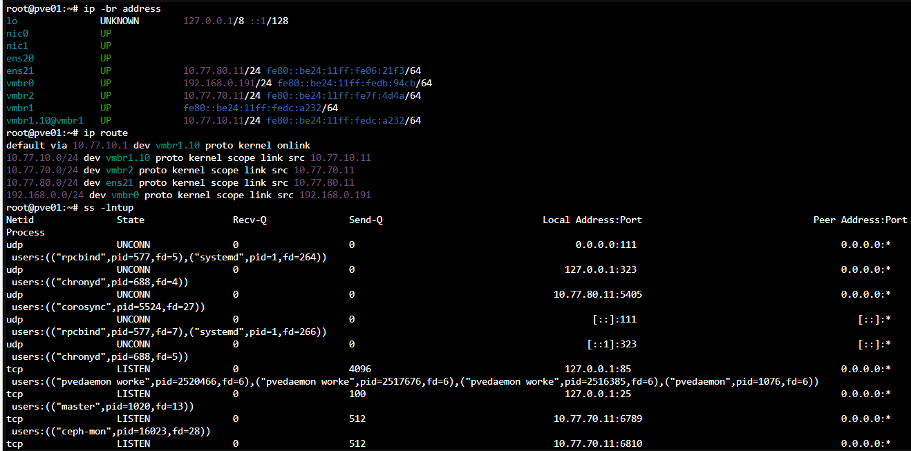
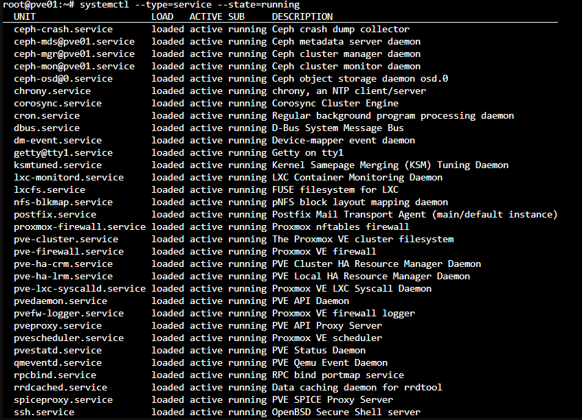
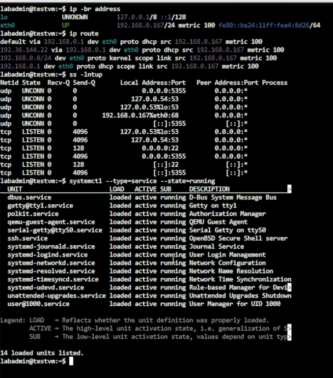
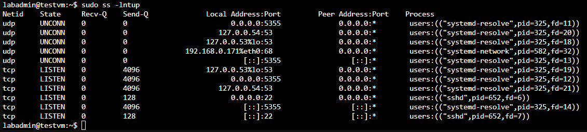

# Day 09｜狀態式防火牆如何運作：封包路徑、連線狀態與信任邊界

對應文章：[Day 09｜狀態式防火牆如何運作：封包路徑、連線狀態與信任邊界](https://ithelp.ithome.com.tw/articles/10408763)

本日不部署防火牆規則，先把誰要連到誰寫成可以在 Day 14 實作的清單。若沒有先做這一步，後面很容易因為服務暫時連不到就建立過寬的 `any to any`。

## 1. 確認固定區域

以[實作環境設定索引](../config/README.md)內的網路、VM 與 Port 表為唯一參數來源：

| 區域 | 網段 | 主要主機 |
|---|---|---|
| Management | `10.77.10.0/24` | OPNsense 與 Day 15 起的 pve01～pve03 管理位址 |
| Service | `10.77.20.0/24` | proxy、app、client、monitor |
| Database | `10.77.30.0/24` | pg01～pg03、Patroni、etcd |
| Backup | `10.77.40.0/24` | backup01 |
| Bastion DMZ | `10.77.50.0/24` | jump01 |
| OpenVPN | `10.77.60.0/24` | 遠端使用者 |
| Ceph | `10.77.70.0/24` | PVE MON／OSD，不經 OPNsense |
| Corosync | `10.77.80.0/24` | PVE 叢集通訊，不經 OPNsense |

## 2. 建立流量需求表

逐列記錄來源、目的、Port 與理由：

| 來源 | 目的 | Port | 是否允許 | 理由 |
|---|---|---:|---|---|
| Cloudflare `CLOUDFLARE_IPV4` | 公開 WAN 入口，DNAT 至 Web VIP `10.77.20.10` | 443 | 是 | 公開 Web 入口 |
| Internet | jump01 `10.77.50.11` | WAN TCP 45222，DNAT 至 TCP 22 | 是 | 受控管理入口 |
| Internet | DB VIP／pg01～03 | 5432 | 否 | DB 不公開 WAN |
| jump01 | 授權內部主機 | 22 | 是 | ProxyJump |
| proxy01／02 | pg01～03 | 5432、8008 | 是 | DB 流量與 Patroni Health Check |
| pg01～03 | pg01～03 | 5432、2379、2380 | 是 | WAL、etcd Client／Peer |
| pg01～03 | backup01 | Repository 所需 SSH | 是 | pgBackRest Repository |
| monitor01 | 受監控主機 | Exporter Port | 是 | Metrics Scrape |
| VPN Admin | pve01～03 | 8006 | 是 | PVE Web UI |
| VPN Client | DB VIP | 5432 | 依群組 | 私有 DB 入口 |
| VPN Client | pg01～03 | 5432、8008、2379 | 否 | 不繞過 VIP 與管理邊界 |

## 3. 盤點現有暴露面

在已存在的 Debian VM 執行：

```bash
ip -br address
ip route
sudo ss -lntup
systemctl --type=service --state=running
```

在 PVE 節點執行：

```bash
ip -br address
ip route
ss -lntup
systemctl --type=service --state=running
pvesh get /cluster/firewall/options
```



圖（一）PVE 節點的介面與路由表指出一般對外流量、Ceph 與 Corosync 使用不同路徑，`ss` 則列出本機正在監聽的 Socket。



圖（二）PVE 節點的執行中服務可與監聽連接埠交叉比對。



圖（三）Debian 測試 VM 的介面、路由、監聽 Socket 與執行中服務。



圖（四）以足夠權限執行 `ss` 後，可以確認監聽 Socket 所屬程序。

測試 VM 使用 DHCP，因此兩次補拍的位址不同；這不影響本圖確認監聽程序的用途。

保存盤點結果，但不要讓 Public IP、MAC、Token 與憑證內容出現在文件中。

## 4. 記錄後續驗收方法

Day 09 先定義測試來源、操作方法與預期結果。防火牆規則及對應服務完成後，再從指定來源執行測試並保存結果：

| 測試來源 | 操作方法 | 預期結果 | 可執行階段 |
|---|---|---|---|
| `proxy01` | `nc -vz -w 3 10.77.30.11 5432` | 允許連到 PostgreSQL | proxy 與 PostgreSQL 服務完成後 |
| `jump01` | `nc -vz -w 3 10.77.30.11 5432` | 拒絕直接連到 PostgreSQL | PostgreSQL 服務完成後 |
| VPN Admin | `curl -kI --connect-timeout 5 https://10.77.10.11:8006/` | 允許連到 PVE Web UI | Day 17 完成 VPN 與規則後 |
| VPN 一般使用者 | `nc -vz -w 3 10.77.30.11 8008` | 拒絕直接連到 Patroni API | Patroni 服務完成後 |

本日只記錄方法與預期結果，不把尚未執行的測試寫成驗證成功。後續測試時，允許項目要看到連線成功，拒絕項目則要搭配 OPNsense Live View 或規則計數器確認封包確實被規則阻擋，避免把服務尚未啟動誤判成防火牆拒絕。

此時 pve01～pve03 還在路由器 Bootstrap 網段，不提前改線。清單先記錄 Day 15 的最終位址 `10.77.10.11`～`.13`，以及 PVE 只需要 DNS、NTP、HTTP／HTTPS 更新等必要出口；完成 OPNsense 規則後才逐台切換 Default Gateway。
