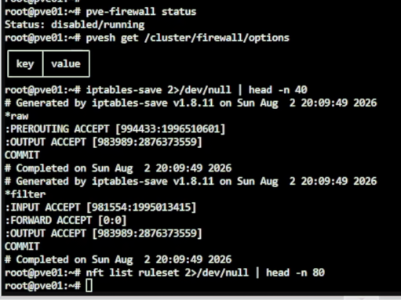
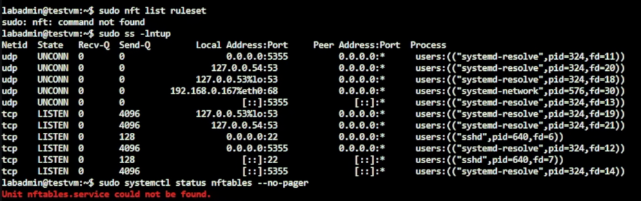

# Day 10｜防火牆種類與部署位置：封包過濾、代理防火牆、WAF、IDS／IPS 與 NGFW

對應文章：[Day 10｜防火牆種類與部署位置：封包過濾、代理防火牆、WAF、IDS／IPS 與 NGFW](https://ithelp.ithome.com.tw/articles/10409006)

本日不急著部署 OPNsense，先確認每一層負責的工作，避免同一條規則在 PVE、OPNsense 與 Debian Host 同時修改後無法排錯。

## 1. 固定責任邊界

| 層級 | 本系列用途 | 不負責 |
|---|---|---|
| 上游路由器 | 提供 L0 管理、OPNsense WAN 與 Day 03～15 PVE Bootstrap | Day 15 後的 PVE／服務 VLAN 存取政策 |
| OPNsense | VLAN Routing、NAT、VPN、跨區 Default Deny | PostgreSQL Role 權限 |
| PVE Firewall | 保護 Hypervisor／特定 VM 的管理面 | 取代 OPNsense Routing |
| Debian nftables | 主機最後一道入口限制 | 跨 VLAN Gateway |
| Nginx／HAProxy | L7 Web 與角色感知 DB Proxy | WAN 邊界防火牆 |
| PostgreSQL | `pg_hba.conf`、TLS、Role／GRANT | 阻止所有網路掃描 |

## 2. 記錄 PVE Firewall 現況

在 pve01～pve03 各執行：

```bash
pve-firewall status
pvesh get /cluster/firewall/options
iptables-save 2>/dev/null | head -n 40
nft list ruleset 2>/dev/null | head -n 80
```



圖（一）pve01 的 PVE Firewall 狀態與現有規則。

只記錄現況，不在三台節點同時啟用新規則。若之後要啟用 PVE Firewall，先建立允許目前管理來源連 TCP 8006／22 的規則，再由單一節點測試。

## 3. 記錄 Debian Host Firewall 現況

在一台測試 VM 執行：

```bash
sudo nft list ruleset
sudo ss -lntup
sudo systemctl status nftables --no-pager
```



圖（二）Debian 測試 VM 的 nftables 與 Socket 現況。

空白規則集表示目前沒有 nftables 規則；`command not found` 則表示 nftables 尚未安裝。兩種結果都可作為後續比較基準。
