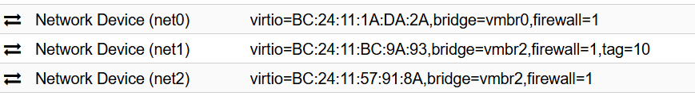
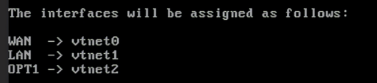
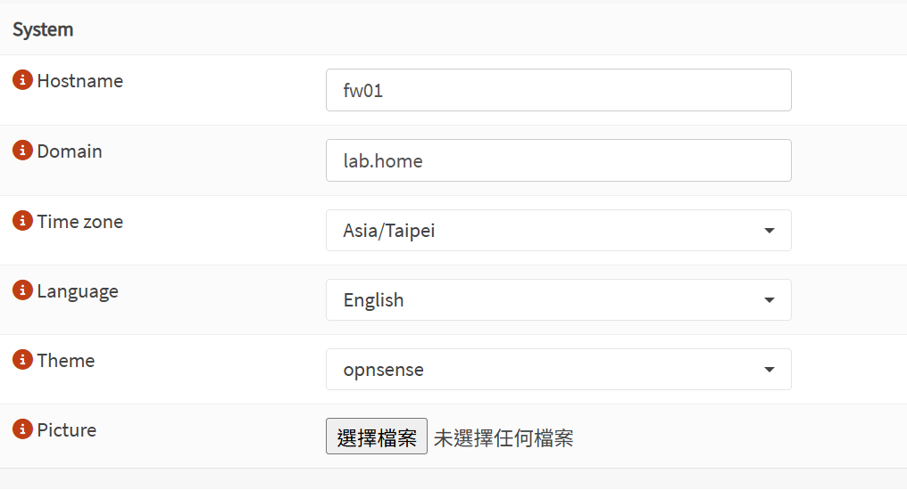
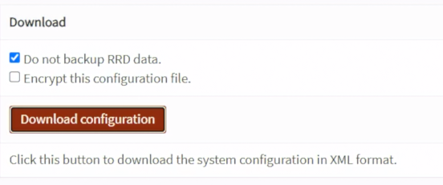
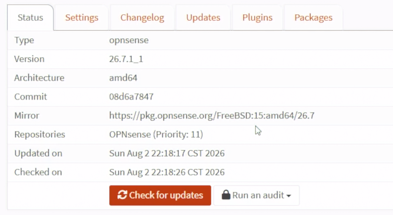
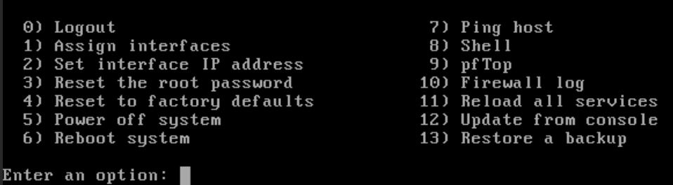
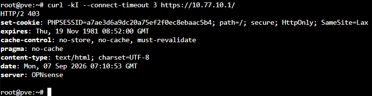

# Day 11｜在 Proxmox VE 安裝 OPNsense：vNIC、WAN／LAN 介面指派與主控台（Console）救援

對應文章：[Day 11｜在 Proxmox VE 安裝 OPNsense：vNIC、WAN／LAN 介面指派與主控台（Console）救援](https://ithelp.ithome.com.tw/articles/10409291)

`fw01` 放在 L0 `pve-l0`，VMID `110`。本日完成安裝、三張網卡、管理介面與設定備份；VLAN 在 Day 13 建立。

Day 11 先讓 OPNsense 本身上線。pve01～pve03 此時仍使用 Day 03 建立的路由器 Bootstrap Gateway，避免在 VLAN 與規則尚未完成前失去管理路徑。等 Day 14 完成基本規則後，Day 15 才逐台把 PVE Management 與一般對外出口切到 OPNsense。

## 1. 下載 OPNsense DVD ISO

1. 開啟 <https://opnsense.org/download/>。
2. Architecture 選 `amd64`、Image type 選 `dvd`、Mirror 選距離較近且可正常下載者。
3. 下載 `OPNsense-版本-dvd-amd64.iso.bz2`、SHA256 與 Signature。以本次 2026 年 8 月使用的版本為例，檔名應為 `OPNsense-26.7-dvd-amd64.iso.bz2`。
4. 使用 7-Zip 解開 `.bz2`，得到 `.iso`。
5. 在 `pve-l0` → `local` → `ISO Images` → `Upload` 上傳 ISO。
6. 將下載版本、SHA256 與日期寫進部署紀錄；不要只記「最新版」。

SHA-256 與數位簽章可用來檢查下載檔案的完整性及來源真實性，本 Lab 不強制執行。若要核對 SHA-256，可在解壓前執行：

```powershell
Get-FileHash .\OPNsense-26.7-dvd-amd64.iso.bz2 -Algorithm SHA256
```

將輸出值與 OPNsense 官方 26.7 發行頁面提供的 SHA-256 比對。

下載後必須先核對副檔名：

```text
dvd    → .iso.bz2，解壓後是 .iso，適合本文件的 PVE CD/DVD 安裝流程
vga    → .img.bz2，USB／磁碟映像
serial → .img.bz2，只輸出到 Serial Console
nano   → .img.bz2，預先安裝的 Embedded 映像
```

若拿到 `.img`，代表下載時沒有選到 `dvd`。不要把 `.img` 上傳成 ISO 或掛在 CD/DVD Drive；這可能只會停在黑畫面、找不到開機媒體，或因下載到 `serial` 映像而在一般 VGA Console 看不到輸出。`.img` 雖可用匯入磁碟的方式啟動，但需要額外安排安裝來源碟、目標系統碟與 Console 類型，不採用於本系列。

## 2. 建立 fw01 VM 110

在 `pve-l0` 按 `Create VM`：

1. `General`：VM ID 填 `110`、Name 填 `fw01`，勾選 `Start at boot`。
2. `OS`：選剛上傳的 OPNsense DVD ISO，Guest OS 選 `Other`。
3. `System`：Machine 選 `q35`、BIOS 選 `SeaBIOS`，不要新增 EFI Disk；SCSI Controller 選 `VirtIO SCSI single`。
4. `Disks`：Bus／Device 選 SCSI、Storage 選 `local-lvm`、Disk size 填 `16GB`，勾選 `Discard` 與 `IO thread`。
5. `CPU`：1 Socket、2 Cores、Type 選 `host`。
6. `Memory`：填 `3072 MiB`，不啟用 Ballooning。
7. `Network`：Model 選 `VirtIO`、Bridge 選 `vmbr0`、VLAN Tag 留白。這張網卡是 net0／WAN。
8. 完成精靈建立 VM。

這次實測曾使用 `OVMF (UEFI)` 並在 EFI Disk 啟用 `Pre-Enroll keys`，開機時出現：

```text
UEFI QEMU DVD-ROM ... Access Denied
Start PXE over IPv4
```

這代表 Secure Boot 拒絕載入 OPNsense DVD，接著才改用 PXE。為了讓讀者直接完成安裝，本教學採用已實測成功的 `SeaBIOS`，不建立 EFI Disk。

建立後到 `Hardware` 再加入：

1. net0 保持 Bridge `vmbr0`、VLAN Tag 留白，作為 WAN，先由上游路由器 DHCP 取址。
2. 按 `Add` → `Network Device` 建立 net1。Model 選 `VirtIO`、Bridge 選 `vmbr2`、VLAN Tag 填 `10`，作為 Internal Management／LAN。PVE 會處理 VLAN Tag，因此 OPNsense 內看到的 `vtnet1` 是未標記介面。
3. 再按 `Add` → `Network Device` 建立 net2。Model 選 `VirtIO`、Bridge 選 `vmbr2`、VLAN Tag 留白，作為 VLAN 20～50 Trunk。

保存三張 NIC 的 MAC Address，後面以 MAC 對照 `vtnet0～2`，不要只靠介面順序猜測。

建立後在 L0 Shell 確認第三張網卡：

```bash
qm config 110 | grep '^net2'
```



*圖（一）確認 fw01 三張 VirtIO NIC 的 Bridge 與 VLAN Tag。*

`net2` 必須顯示 `bridge=vmbr2`，而且不填 VLAN Tag。若顯示 `bridge=vmbr0`，請先關閉 fw01，把 net2 的 Bridge 改回 `vmbr2` 再繼續。

到 `Options` → `Boot Order`，安裝階段將 CD/DVD Drive `ide2` 放在系統碟 `scsi0` 前面。CLI 對應指令是：

```bash
qm set 110 --boot 'order=ide2;scsi0'
```

## 3. 安裝到虛擬磁碟

1. 啟動 VM，開啟 PVE Console。
2. Live Environment 登入使用者輸入 `installer`，密碼輸入 `opnsense`。
3. Keymap 選預設。
4. 本 Lab 單顆 16GB 虛擬磁碟選 `Install (UFS)`；它沒有磁碟冗餘，正式設備再依磁碟規劃評估 ZFS。
5. 確認選到 16GB 系統碟，接受 Partition 與 Swap 建議。
6. 設定新的 root 密碼，不要錄到畫面中。
7. 選 `Complete Install`，安裝完成後關機。
8. 到 `Hardware` 的 CD/DVD Drive 退出 OPNsense ISO，或到 `Options` → `Boot Order` 將 `scsi0` 改成第一順位。
9. 若使用 CLI，執行：

   ```bash
   qm set 110 --boot 'order=scsi0'
   qm start 110
   ```

10. 再次開機時確認系統從 16GB `scsi0` 啟動，而不是重新進入安裝程式。

## 4. 指派介面

從 Console 選 `1) Assign interfaces`：

1. `Do you want to configure LAGGs now?` 輸入 `N`。本 Lab 沒有使用 LACP／LAGG。
2. `Do you want to configure VLANs now?` 輸入 `N`。本日只完成實體／虛擬介面指派，VLAN 20～50 留到 Day 13 從 Web UI 建立。
3. 接著依 MAC Address 指派：

```text
WAN：vtnet0
LAN：vtnet1
OPT1：vtnet2
```



*圖（二）依 MAC Address 將 WAN、LAN 與 OPT1 指派給 vtnet0～2。*

先用 MAC Address 確認。此時不要在 Console 建 VLAN，Day 13 再從 Web UI 建立。

選 `2) Set interface(s) IP address`，將 LAN 設為：

```text
IPv4：10.77.10.1/24
Gateway：不設定
IPv6：先不設定
DHCP Server：關閉
Web GUI：HTTPS
```

## 5. 從管理電腦開啟 Web UI

L0 不需要建立 `vmbr3`。Day 05 已在 `pve-l0` → `System` → `Network` 建立 `vmbr2.10`，這裡先選取它並按 `Edit`，確認：

1. VLAN raw device 是 `vmbr2`，VLAN Tag 是 `10`。
2. IPv4/CIDR 是 `10.77.10.10/24`。
3. IPv4 Gateway、IPv6/CIDR 與 IPv6 Gateway 全部留空。
4. `Autostart` 已勾選。

若先前略過 Day 05，才依照以上數值按 `Create` → `Linux VLAN` 補建，完成後按 `Apply Configuration`。

`vmbr2.10` 是掛在既有 `vmbr2` 上的 VLAN 介面，不是另一座 Bridge。先從 L0 Shell 確認：

```bash
ip -4 -br address show vmbr2.10
ping -c 3 10.77.10.1
```

確認可達後，管理電腦用 SSH Tunnel 經目前登入 PVE 使用的管理 IP 進入：

```powershell
ssh -L 8443:10.77.10.1:443 root@192.168.0.146
```

不要將 IP 寫在 `Read-Host` 的提示文字中。若使用 `$L0ManagementIP = Read-Host '192.168.0.146'` 後直接按 Enter，變數會是空值，SSH 會顯示連線到空白 Host。若未來 L0 IP 改變，才使用以下寫法並在提示後實際輸入 IP：

```powershell
$L0ManagementIP = Read-Host '請輸入 L0 管理 IP'
ssh -L 8443:10.77.10.1:443 "root@$L0ManagementIP"
```

保持 SSH 視窗開啟，在瀏覽器開啟：

```text
https://127.0.0.1:8443
```

首次使用自簽憑證會出現警告。確認連線目的確實是本機 Tunnel 後再繼續，不要把忽略憑證警告當成正式環境作法。

## 6. 初始設定與備份

1. 登入 Web UI，執行 Wizard。
2. Hostname 設 `fw01`，Domain 設 `lab.home`。
3. DNS 暫時使用上游路由器提供值；不要在此時修改 WAN 為 PPPoE。
4. Timezone 選 `Asia/Taipei`，NTP 保留可用來源。
5. WAN 維持 DHCP，取消會阻擋實驗上游 Private Address 的選項，因為目前是 Double NAT Lab。
6. 確認 LAN `10.77.10.1/24`。
7. 到 `System → Configuration → Backups` 下載 `config.xml`。



*圖（三）OPNsense 初始設定的 Hostname、Domain 與 Timezone。*



*圖（四）下載 OPNsense config.xml 設定備份。*

`config.xml` 可能含 Password Hash、Certificate 與 Private Key，不可提交到 Git。

## 7. 更新 OPNsense

先完成前一節的 `config.xml` 備份，再執行更新。更新過程保持 PVE Console 開啟，不要同時修改 Interface Assignment、VLAN、PPPoE 或 Firewall Rule。

1. 先到 `Interfaces` → `Overview`，確認 WAN 已從上游路由器取得 DHCP 位址。
2. 到 `System` → `Firmware` → `Settings`，確認 Release Type 是 `Community`，不要切換成 `Development`。
3. Firmware Mirror 先保留預設；若下載速度過慢或連線失敗，再改選可正常連線的 East Asia Mirror。
4. 回到 `System` → `Firmware` → `Status`。
5. 按 `Check for updates`。
6. 有更新時先閱讀 Changelog，再按下安裝更新的按鈕。
7. 等待套件下載與安裝完成。若畫面提示需要 Reboot，允許重新啟動；更新期間 SSH Tunnel 與 Web UI 暫時中斷是正常現象。
8. OPNsense 重新開機完成後，再次建立 SSH Tunnel：

   ```powershell
   ssh -L 8443:10.77.10.1:443 root@192.168.0.146
   ```

9. 重新開啟 `https://127.0.0.1:8443`，到 `Lobby` → `Dashboard` 記錄更新後版本。
10. 再到 `System` → `Firmware` → `Status` 執行一次 `Check for updates`，確認沒有尚未完成的更新。
11. 更新成功後重新下載一份 `config.xml`，檔名標註更新後版本與日期，仍不可提交到 Git。



*圖（五）確認 OPNsense Firmware 版本與更新狀態。*

本次使用 `26.7` 安裝 ISO，更新後的小版本以實際結果為準，不預設固定版號。若 `Check for updates` 失敗，先確認 WAN、DNS、Default Gateway 與 Firmware Mirror，不要直接改用 Development Repository。

官方更新說明：<https://docs.opnsense.org/manual/updates.html>

## 8. Console 救援演練

保持 PVE Console 開啟，記錄以下選項：

```text
1) Assign interfaces
2) Set interface(s) IP address
3) Reset the root password
4) Reset to factory defaults
11) Reload all services
13) Restore a backup
```



*圖（六）OPNsense 主控台的介面指派、服務重新載入與 Shell 救援選單。*

本日保留現有設定，選擇 `11) Reload all services` 重新載入服務。完成後回到 L0 再次確認 HTTPS：

```bash
curl -kI --connect-timeout 3 https://10.77.10.1/
```



*圖（七）重新載入服務後，從 pve-l0 再次取得 OPNsense HTTPS 回應。*
