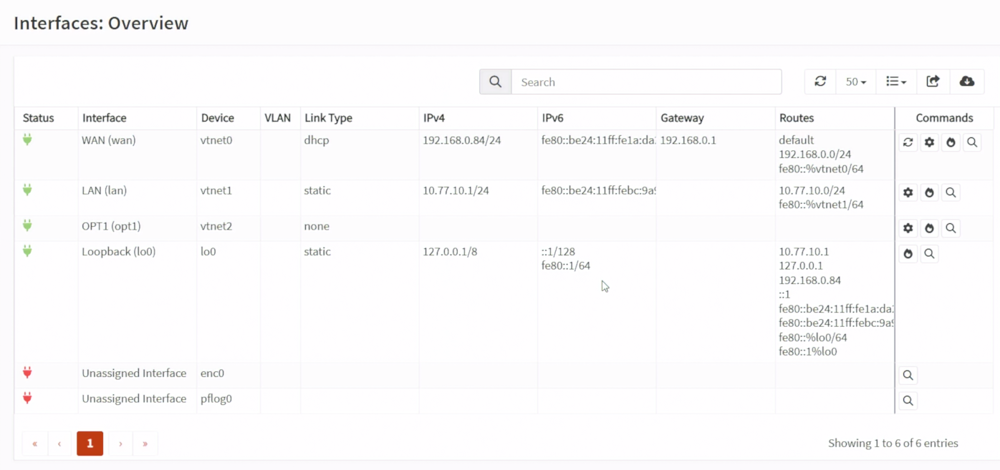
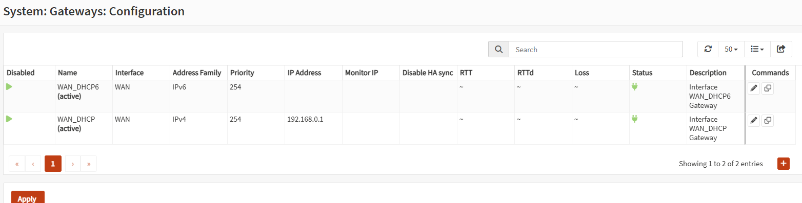
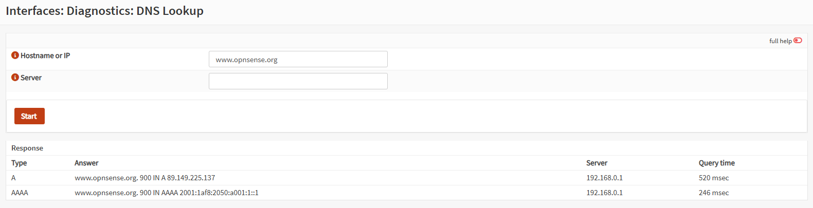
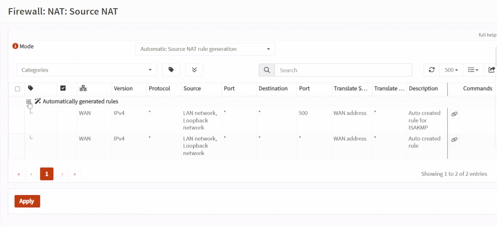
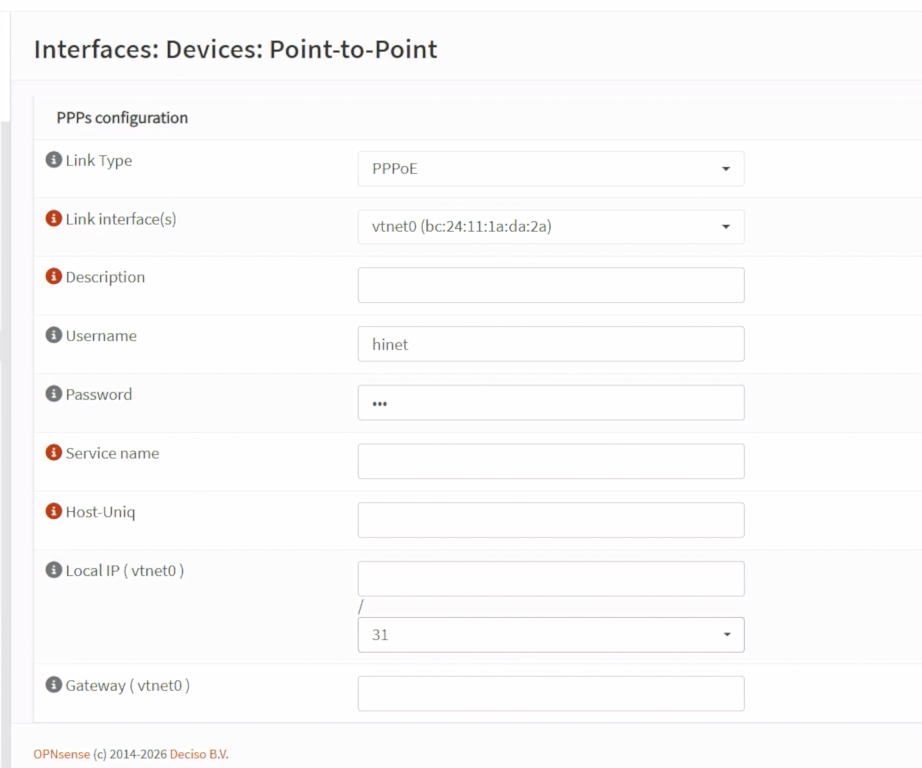

# Day 12｜WAN 如何連上網際網路：OPNsense 的 DHCP、PPPoE、NAT 與 DDNS

對應文章：[Day 12｜WAN 如何連上網際網路：OPNsense 的 DHCP、PPPoE、NAT 與 DDNS](https://ithelp.ithome.com.tw/articles/10409585)

本 Lab 先使用上游路由器 DHCP，等所有服務完成後再決定是否把實體 WAN 直接交給 OPNsense。沒有實體 Console 或獨立救援路徑時，不要直接切換 PPPoE。


## 1. 確認目前 Double NAT

到 `Interfaces → Overview` 記錄 WAN：

```text
介面：vtnet0
IPv4 Configuration Type：DHCP
位址：由上游路由器配發的私有 IP
Gateway：上游路由器
```

因 WAN 收到私有 IP，到 `Interfaces → WAN` 取消 `Block private networks`，保留 `Block bogon networks`，按 Save／Apply。



*圖（一）確認 OPNsense WAN、LAN 與 OPT1 介面狀態。*


*圖（二）Double NAT Lab 的 WAN 需取消 Block private networks。*

到 `System → Gateways → Configuration` 確認 DHCP Gateway Online，再從 `Interfaces → Diagnostics → Ping`：

1. Source 選 WAN。
2. Ping 上游 Gateway。
3. Ping `1.1.1.1`。
4. 到 `Interfaces → Diagnostics → DNS Lookup` 查詢 `www.opnsense.org`。



*圖（三）確認 DHCP Gateway 目前為 Online。*


*圖（四）從 fw01 驗證公網 IPv4 可達性。*



*圖（五）從 fw01 驗證 DNS 名稱解析。*

## 2. Source NAT

OPNsense 26.7 已將舊版的 `Outbound NAT` 選單改名為 `Source NAT`。到 `Firewall → NAT → Source NAT`：

1. 先確認目前使用自動產生 Source NAT 規則的模式；這就是舊文件所稱的 `Automatic outbound NAT rule generation`。
2. 本日維持自動模式，不新增手動 Source NAT 規則。
3. 若畫面出現需要套用的變更，再按 Save／Apply；沒有變更時不需重新儲存設定。
4. Day 13 建好 VLAN 後，回來確認自動產生的 Source NAT 規則是否包含 `10.77.20.0/24`～`10.77.50.0/24`。



*圖（六）確認 OPNsense 自動產生的 Source NAT 規則。*

不要在 VLAN 尚未建立前手工新增四條重複 NAT。

在舊版文章或搜尋結果中，以下名稱指的是同一類功能：

```text
Outbound NAT
Source NAT
SNAT
```

本系列依 OPNsense 26.7 畫面統一使用 `Source NAT`。

## 3. 記錄上游路由器限制

Double NAT 下公開服務需要兩層轉送：

```text
Internet
  → 上游路由器 Port Forward
  → fw01 WAN
  → OPNsense Port Forward
  → Web VIP 或 jump01
```

本系列已知上游路由器具有可接受入站連線的公網 IPv4。到上游路由器確認 WAN Address 與外部查到的公網 IP 相符；後續公開服務時，再分別建立上游路由器與 OPNsense 兩層 Port Forward。

## 4. PPPoE 切換步驟（本日只確認設定位置）

OPNsense 26.7 不再直接於 `Interfaces → WAN` 的 IPv4 Configuration Type 下拉選單建立 PPPoE。該選單只看到 `None`、`Static IPv4` 與 `DHCP` 是正常現象。PPPoE 必須先建立 Point-to-Point Device，再進行 Interface Assignment。

本日只確認下列選單位置，不輸入帳密、不按 Save／Apply，也不將目前 WAN 從 DHCP 改成 None。真正切換時，必須具備實體 Console／獨立救援網路，並已確認 ISP 帳密。

1. 到 `Interfaces` → `Devices` → `Point-to-Point`，按 `Add`。
2. Link Type 選 `PPPoE`。
3. Link interface 選 WAN Parent `vtnet0`。
4. 填入 ISP Username／Password；Service Name 與 Host-Uniq 只有 ISP 明確要求時才填。帳密不得寫入文件或提交至 Git。
5. 儲存後到 `Interfaces` → `Assignments`，選擇新建立的 `pppoe0` Device 並加入。
6. 進入新指派的 PPPoE Interface，勾選 Enable，IPv4 Configuration Type 選 `PPPoE`，再 Save／Apply。
7. 真正切換時，原本承載 DHCP 的 Parent WAN 必須停止取得 IPv4，避免同一條 WAN 同時保留 DHCP 與 PPPoE；這一步只在維護窗口執行。
8. 從 PVE Console 確認 PPPoE Interface、WAN Address 與 Gateway，並到 `System` → `Log Files` → `General` 檢查 PPP／LCP／Authentication 訊息。



*圖（七）OPNsense Point-to-Point Device 的 PPPoE 設定位置。*
