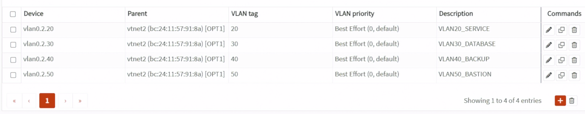
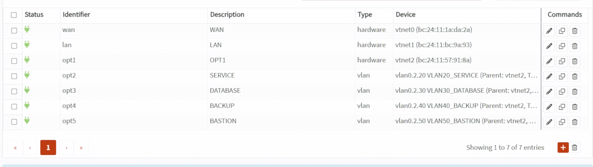
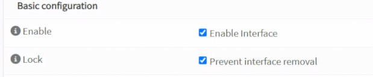
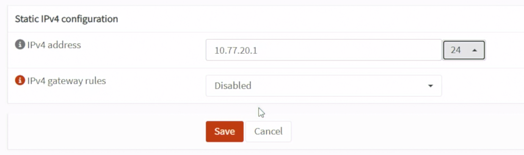
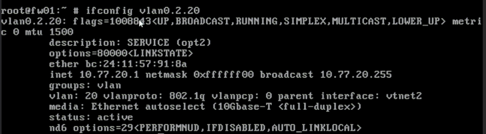
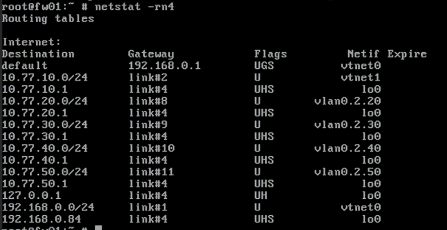

# Day 13｜從 VLAN 到安全區域：802.1Q、跨網段路由與 OPNsense 介面

對應文章：[Day 13｜從 VLAN 到安全區域：802.1Q、跨網段路由與 OPNsense 介面](https://ithelp.ithome.com.tw/users/20183351/ironman/9461)

本日讓 OPNsense 的 `vtnet2` 承載 VLAN 20～50。Management 使用獨立 `vtnet1`，不在 Trunk 上重複建立 VLAN 10。

## 本日實際變更範圍

Day 13 實際只修改 OPNsense：

1. 在父介面 `vtnet2` 建立 VLAN 20、30、40、50 裝置。
2. 將四個 VLAN 裝置指派並啟用為 SERVICE、DATABASE、BACKUP、BASTION 介面。
3. 設定四個介面的靜態 IPv4 位址，讓 `IPv4 gateway rules` 維持 `Disabled`，並且不啟用 DHCP 服務。
4. 驗證四條直接連線路由並下載 `config.xml` 備份。

今天不建立或修改服務 VM，不建立介面群組（Interface Group），也不新增暫時或正式防火牆規則。下方的 VM VLAN 清單只記錄後續部署日要套用的設定。

## 1. 建立 VLAN 裝置

到 `Interfaces` → `Devices` → `VLAN`，按 `Add`。OPNsense 26.7 的裝置名稱（Device）欄位不能留白，也不能只填 VLAN ID。名稱最多 15 個字元，必須以 `vlan0` 開頭，後面只能使用數字與句點，例如 `vlan0.1.104`。不符合時會顯示：

```text
The device name prefix "vlan" is required.
Only a maximum of 15 characters is allowed starting with "vlan0" combined with numeric characters and dots.
```

依序建立四個 VLAN 裝置：

1. Service VLAN：Device 填 `vlan0.2.20`、Parent 選 `vtnet2`、VLAN tag 填 `20`、Description 填 `VLAN20_SERVICE`。
2. Database VLAN：Device 填 `vlan0.2.30`、Parent 選 `vtnet2`、VLAN tag 填 `30`、Description 填 `VLAN30_DATABASE`。
3. Backup VLAN：Device 填 `vlan0.2.40`、Parent 選 `vtnet2`、VLAN tag 填 `40`、Description 填 `VLAN40_BACKUP`。
4. Bastion VLAN：Device 填 `vlan0.2.50`、Parent 選 `vtnet2`、VLAN tag 填 `50`、Description 填 `VLAN50_BASTION`。

每建立一項就核對 Device、Parent 與 Tag，再按 Save。不要在 Parent `vtnet2` 本身配置 IP，也不要建立 `vlan10`；Management 已由獨立的 `vtnet1` 負責。



*圖（一）確認 VLAN 20～50 的裝置名稱、父介面與 VLAN Tag。*

## 2. 指派介面

到 `Interfaces` → `Assignments`，將四個 VLAN 裝置加入並改名：

1. 將 `vlan0.2.20` 加入，Description／Interface Name 使用 `SERVICE`，IPv4 Static Address 設為 `10.77.20.1/24`。
2. 將 `vlan0.2.30` 加入，Description／Interface Name 使用 `DATABASE`，IPv4 Static Address 設為 `10.77.30.1/24`。
3. 將 `vlan0.2.40` 加入，Description／Interface Name 使用 `BACKUP`，IPv4 Static Address 設為 `10.77.40.1/24`。
4. 將 `vlan0.2.50` 加入，Description／Interface Name 使用 `BASTION`，IPv4 Static Address 設為 `10.77.50.1/24`。

四個介面均不啟用 DHCP 服務。



*圖（二）將四個 VLAN 裝置指派為 OPNsense 介面。*

每個介面：

1. 勾選 Enable Interface。
2. IPv4 Configuration Type 選 Static IPv4。
3. 填入前面指定的 `10.77.20.1/24`、`10.77.30.1/24`、`10.77.40.1/24` 或 `10.77.50.1/24`。
4. `IPv4 gateway rules` 維持 `Disabled`，上游閘道由 WAN 負責。
5. 取消內部介面的 Block private networks／Block bogon networks。
6. Save；四個都完成後 Apply Changes。



*圖（三）啟用 VLAN 介面。*



*圖（四）設定 VLAN 介面的靜態 IPv4 位址，並讓 IPv4 gateway rules 維持 Disabled。*

## 3. 記錄未來 VM 的 VLAN 配置

Day 13 尚未建立服務 VM，本節只記錄後續配置，不進入 PVE 建立或修改任何 VM，也不執行 `qm set`。

等各服務進入自己的部署日後，VM 的主要網卡（NIC）才接到 L1 `vmbr1`，並依用途設定 VLAN Tag：

- proxy01／proxy02，VMID 201／202：VLAN Tag `20`。
- app01／app02，VMID 211／212：VLAN Tag `20`。
- pg01～pg03，VMID 221～223：VLAN Tag `30`。
- ca01，VMID 224：VLAN Tag `30`。
- jump01，VMID 231：VLAN Tag `50`。
- client01，VMID 241：VLAN Tag `20`。
- monitor01，VMID 251：VLAN Tag `20`。
- backup01，VMID 261：VLAN Tag `40`。
- pg-restore01，VMID 904：VLAN Tag `30`；只在 PITR 演練期間建立，不加入 Patroni／etcd。

服務 VM 預設只接一張網卡。不要為了讓 Database 與 Backup 互通而替 VM 加第二張跨區網卡。

實際執行時間：

- Day 15 建立 jump01 時設定 VLAN 50。
- Day 19 建立 ca01、Day 20 建立 PostgreSQL 節點時都使用 VLAN 30。ca01 使用 `10.77.30.10`，pg01～03 使用 `10.77.30.11`～`.13`。

ca01 與 PostgreSQL 節點同在 VLAN 30，兩者的封包不一定經過 OPNsense。Day 19 會在 ca01 建立 nftables 主機防火牆（Host Firewall）；正式環境建議將線上中繼 CA（Online Intermediate CA）放到獨立的 PKI／Security VLAN。
- Day 25 建立 Proxy、Web Backend 與 client01 時設定 VLAN 20。
- Day 28 建立 backup01 時設定 VLAN 40，建立臨時 pg-restore01 時設定 VLAN 30。
- Day 16 提前建立 monitor01 SSH 基線時設定 VLAN 20；Day 29 沿用同一台 VM 安裝監控服務。

## 4. 確認 OPNsense VLAN 介面

今天只確認 OPNsense 本身的介面與直接連線路由（Connected Route），不測試尚未存在的 VM。

1. 到 `Interfaces` → `Overview`。
2. 確認 SERVICE 已啟用，位址為 `10.77.20.1/24`。
3. 確認 DATABASE 已啟用，位址為 `10.77.30.1/24`。
4. 確認 BACKUP 已啟用，位址為 `10.77.40.1/24`。
5. 確認 BASTION 已啟用，位址為 `10.77.50.1/24`。
6. 確認四個介面的 Parent 都來自 `vtnet2`，WAN 仍是 `vtnet0`，LAN 仍是 `vtnet1`。
7. 從 OPNsense Console 選 `8) Shell`，執行：

```bash
ifconfig vlan0.2.20
ifconfig vlan0.2.30
ifconfig vlan0.2.40
ifconfig vlan0.2.50
netstat -rn4
```

`ifconfig` 應顯示介面已啟用，並列出 IPv4 位址、VLAN Tag 與父介面。以下畫面以 SERVICE 為例：



*圖（五）使用 ifconfig 確認 OPNsense VLAN 介面的實際狀態。*

`netstat -rn4` 應出現四個直接連線網段：

```text
10.77.20.0/24
10.77.30.0/24
10.77.40.0/24
10.77.50.0/24
```



*圖（六）使用 netstat 確認 VLAN 20～50 的直接連線路由。*

本日驗證範圍是 OPNsense 介面與直接連線路由；L1 橋接器（Bridge）、VM VLAN Tag 與跨 VLAN 防火牆政策會在 VM 建立後驗證。

## 5. 備份 Day 13 設定

1. 到 `System` → `Configuration` → `Backups`。
2. 下載加入 VLAN 20～50 後的 `config.xml`。
3. 檔名記錄日期與 OPNsense 版本。

## 6. 未來 VM 無法連線時的排錯順序

等後續 VM 建立後，若無法連到自己的預設閘道，再依序檢查：

1. VM 網卡的 VLAN Tag。
2. L1 `vmbr1` 是否啟用 VLAN-aware。
3. L1 net1 是否連到 L0 `vmbr2`。
4. L0 `vmbr2` 是否 VLAN-aware。
5. fw01 net2 是否連到 L0 `vmbr2`。
6. OPNsense VLAN 的父介面、VLAN Tag 與介面啟用狀態。
7. OPNsense Live View 是否出現預設拒絕（Default Deny）。
