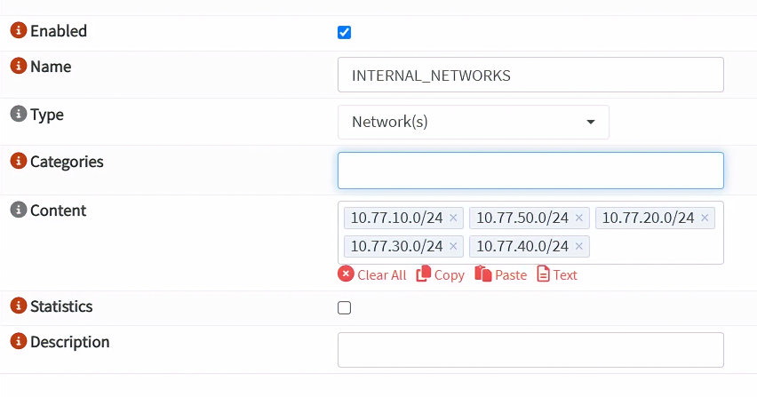
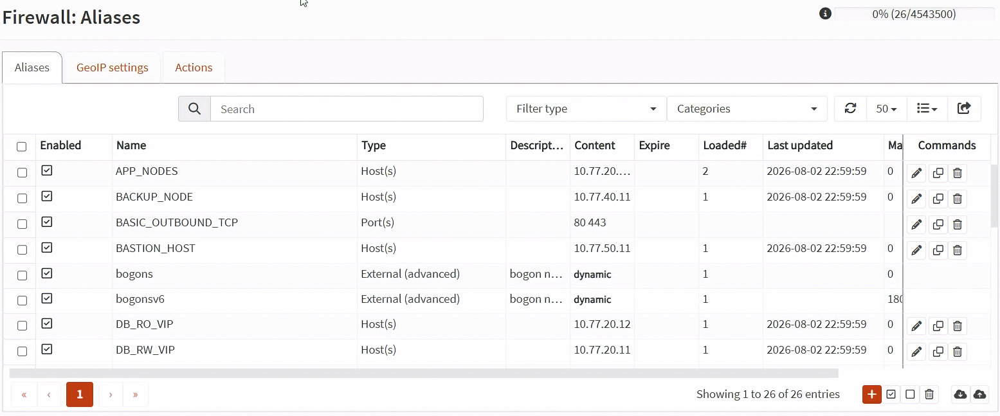
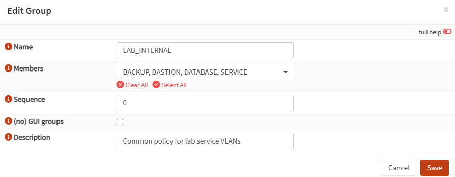
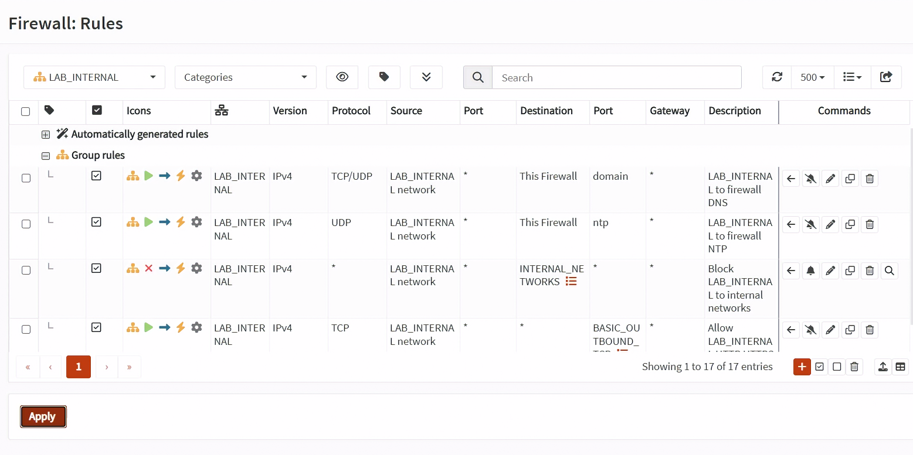
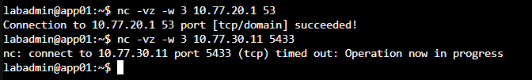
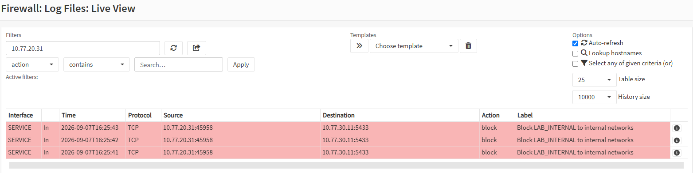

# Day 14｜從預設拒絕到最小權限：OPNsense 防火牆的別名與規則順序

對應文章：[Day 14｜從預設拒絕到最小權限：OPNsense 防火牆的別名與規則順序](https://ithelp.ithome.com.tw/users/20183351/ironman/9461)

Day 14 會實際建立 Alias 與 VLAN 的基礎規則。由於 proxy、PostgreSQL、jump01 等 VM 還沒有建立，服務專屬的跨區規則、WAN NAT 與連線測試只記錄規格，不在今天啟用。

今天也不在尚未完成規則前修改 PVE Default Gateway。Day 15 會先新增 `PVE_NODES` Alias 與 LAN 出口規則，再逐台將 pve01～pve03 切到 Management VLAN 10。

## 1. 建立 INTERNAL_NETWORKS

1. 進入 `Firewall` → `Aliases`。
2. 按右下角 `Add`。
3. `Enabled` 保持勾選。
4. `Name` 填入 `INTERNAL_NETWORKS`。
5. 先將 `Type` 選成 `Network(s)`，不要選 `Host(s)`。
6. 在 `Content` 中分別新增下列五個項目：

```text
10.77.10.0/24
10.77.20.0/24
10.77.30.0/24
10.77.40.0/24
10.77.50.0/24
```

7. 每個 CIDR 都是一個獨立項目，不要輸入 `10.77.10.0/24～10.77.50.0/24`。
8. `Description` 填入 `All internal lab networks`。
9. 按 `Save`，回到 Alias 清單後按 `Apply`。

如果出現下列錯誤，通常是 `Type` 還在 `Host(s)`，或把多個網段當成同一個項目輸入：

```text
Entry "10.77.10.0/24" is not a valid hostname, IP address or range.
```

OPNsense 的 Network Alias 可使用 CIDR，`10.77.10.0/24` 本身是有效的網段寫法。



*圖（一）建立 INTERNAL_NETWORKS Network Alias。*

## 2. 建立主機 Alias

下列 VM 雖然還沒有建立，Alias 只是對已規劃 IP 的命名清單，因此可以先建立，不會自動建立 VM 或放行流量。

每一個 Alias 都使用下列步驟：

1. 在 `Firewall` → `Aliases` 按 `Add`。
2. `Type` 選 `Host(s)`。
3. 填入 `Name`。
4. 將每個 IP 分別加入 `Content`。
5. 填入用途說明，按 `Save`。

依序建立：

- `PROXY_NODES`：`10.77.20.21`、`10.77.20.22`。
- `APP_NODES`：`10.77.20.31`、`10.77.20.32`。
- `PG_NODES`：`10.77.30.11`、`10.77.30.12`、`10.77.30.13`。
- `CA_NODE`：`10.77.30.10`。
- `BACKUP_NODE`：`10.77.40.11`。
- `BASTION_HOST`：`10.77.50.11`。
- `WEB_VIP`：`10.77.20.10`。
- `DB_RW_VIP`：`10.77.20.11`。
- `DB_RO_VIP`：`10.77.20.12`。
- `BASTION_TARGETS`：`10.77.20.21`、`10.77.20.22`、`10.77.30.11`、`10.77.30.12`、`10.77.30.13`、`10.77.40.11`。

全部完成後按 `Apply`。`BASTION_TARGETS` 不要直接放入整個 `10.77.0.0/16`，否則 jump01 未來會可以嘗試 SSH 到過多主機。

`CA_NODE` 只先保留名稱，不加入 `BASTION_TARGETS`，也不在 Day 14 建立 Allow。Day 19 會在 ca01 使用 nftables Host Firewall 放行 `PG_NODES → CA_NODE TCP 9000`。因為這是同 VLAN 流量，OPNsense 看不到，必須由 ca01 自身的 Host Firewall 處理。



*圖（二）確認 Host、Network 與 Port Alias 清單。*

## 3. 建立 Port Alias

這一節需要實際操作。

1. 到 `Firewall` → `Aliases`，按 `Add`。
2. `Type` 選 `Port(s)`。
3. 建立 `WEB_PORTS`，`Content` 分別加入 `80` 與 `443`。
4. 按 `Save`。
5. 使用相同方法建立 `PGSQL_PORT`，加入 `5432`。
6. 建立 `PATRONI_API`，加入 `8008`。
7. 建立 `ETCD_PORTS`，分別加入 `2379` 與 `2380`。
8. 建立 `BASIC_OUTBOUND_TCP`，分別加入 `80` 與 `443`。
9. 最後按 `Apply`。

## 4. 使用 Interface Group 簡化共同規則

不需要對 `SERVICE`、`DATABASE`、`BACKUP`、`BASTION` 重複建立四套規則。先把四個 VLAN 放入同一個 Interface Group，再建立一套共同規則即可。

不要直接在單一規則中同時勾選四個 Interface。在 OPNsense 新版 Rules 中，多個 Interface 會使這條規則成為 Floating Rule，處理順序比 Group Rule 與單一 Interface Rule 更早，未來加入例外規則時較難判讀。

### 4.1 建立 LAB_INTERNAL Interface Group

1. 進入 `Firewall` → `Groups`。
2. 按右下角橘色 `+`。
3. `Name` 填入 `LAB_INTERNAL`。
4. `Members` 同時選擇 `SERVICE`、`DATABASE`、`BACKUP` 與 `BASTION`。
5. `No GUI groups` 不要勾選，這樣才能在 Rules 畫面看到這個 Group。
6. `Description` 填入 `Common policy for lab service VLANs`。
7. 按 `Save`，再按 `Apply`。

`LAN` 不加入這個 Group，避免影響現在從 `10.77.10.0/24` 進入 OPNsense Web GUI 的管理路徑。



*圖（三）建立包含 SERVICE、DATABASE、BACKUP 與 BASTION 的 LAB_INTERNAL Group。*

### 4.2 建立共用 DNS 規則

1. 進入 `Firewall` → `Rules`。
2. 按右下角橘色 `+`。
3. `Interface` 只選 Group `LAB_INTERNAL`，不要再勾選四個成員 Interface。
4. `Action` 選 `Pass`，`Quick` 保持勾選，`Direction` 選 `in`。
5. `Version` 選 `IPv4`，`Protocol` 選 `TCP/UDP`。
6. `Source` 選 `LAB_INTERNAL network`，Source Port 保持 `any`。
7. `Destination` 選 `This Firewall`。
8. `Destination Port` 填入 `53` 或選 `DNS`。
9. `Description` 填入 `LAB_INTERNAL to firewall DNS`。
10. 按 `Save`。

`LAB_INTERNAL network` 代表四個成員 Interface 的所有網段。`This Firewall` 則代表 OPNsense 本身的介面位址；這條規則仍只開放 TCP／UDP 53，不會開放其他服務。

### 4.3 建立共用 NTP 規則

1. 回到 `Firewall` → `Rules`，再按右下角橘色 `+`。
2. `Interface` 選 `LAB_INTERNAL`，`Action` 選 `Pass`。
3. `Version` 選 `IPv4`，`Protocol` 選 `UDP`。
4. `Source` 選 `LAB_INTERNAL network`。
5. `Destination` 選 `This Firewall`。
6. `Destination Port` 填入 `123` 或選 `NTP`。
7. `Description` 填入 `LAB_INTERNAL to firewall NTP`。
8. 按 `Save`。

這條規則只允許封包到達 OPNsense。若 OPNsense NTP 服務沒有監聽這些 Interface，後續仍要調整 NTP 服務設定。

### 4.4 建立共用內網 Block 規則

1. 回到 `Firewall` → `Rules`，再按右下角橘色 `+`。
2. `Interface` 選 `LAB_INTERNAL`，`Action` 選 `Block`。
3. `Version` 選 `IPv4`，`Protocol` 選 `any`。
4. `Source` 選 `LAB_INTERNAL network`。
5. `Destination` 選 Alias `INTERNAL_NETWORKS`。
6. 勾選 `Log packets that are handled by this rule`。
7. `Description` 填入 `Block LAB_INTERNAL to internal networks`。
8. 按 `Save`。

### 4.5 建立共用套件更新規則

1. 回到 `Firewall` → `Rules`，再按右下角橘色 `+`。
2. `Interface` 選 `LAB_INTERNAL`，`Action` 選 `Pass`。
3. `Version` 選 `IPv4`，`Protocol` 選 `TCP`。
4. `Source` 選 `LAB_INTERNAL network`。
5. `Destination` 選 `any`。
6. `Destination Port` 選 Alias `BASIC_OUTBOUND_TCP`。
7. `Description` 填入 `Allow LAB_INTERNAL HTTP HTTPS outbound`。
8. 按 `Save`。

`Destination` 不要選 `WAN network`。`WAN network` 只是 fw01 WAN 直接連接的上游網段，不代表整個 Internet。

### 4.6 確認 Group Rule 順序

1. 回到 `Firewall` → `Rules`。
2. 在左上角 `All rules` 下拉選單選擇 `LAB_INTERNAL`。
3. 將規則排成：

```text
LAB_INTERNAL to firewall DNS
LAB_INTERNAL to firewall NTP
未來的明確跨區 Allow
Block LAB_INTERNAL to internal networks
Allow LAB_INTERNAL HTTP HTTPS outbound
```

4. 如果規則順序不對，勾選要移動的規則，再按目標規則右側的「Move selected rules before this rule」箭頭。
5. 按畫面左下角 `Apply`。

內網 Block 規則必須放在 Internet 更新 Allow 之前，否則目的為內網主機的 TCP 80／443 也可能被寬鬆規則先命中。



*圖（四）確認 LAB_INTERNAL 共用規則的排列順序。*

## 5. 服務專屬規則今天不啟用

下列是後續部署日要建立的規則，今天只記錄，不要進入 GUI 新增：

```text
PROXY_NODES → PG_NODES TCP 5432
PROXY_NODES → PG_NODES TCP 8008
PG_NODES → PG_NODES TCP 5432
PG_NODES → PG_NODES TCP 2379-2380
PG_NODES → BACKUP_NODE TCP 22
BASTION_HOST → BASTION_TARGETS TCP 22
```

實際新增時，Interface 也選 `LAB_INTERNAL`，再使用 Source 與 Destination Alias 限定真正的來源與目標。必須將這些規則放在 `Block LAB_INTERNAL to internal networks` 上方。等對應 VM 與服務存在後才啟用，才能判斷是規則、路由還是服務本身的問題。


## 6. 今天可以做的確認

因為服務 VM 尚未建立，今天不執行 `nc`、`curl` 或跨 VLAN 連線測試。也不必進入 `Firewall` → `Diagnostics` → `Aliases`；那是排錯時查看 Alias 實際載入內容的工具，不是必要設定步驟。

今天只做下列確認：

1. 進入 `Firewall` → `Aliases`，在主清單搜尋 `INTERNAL_NETWORKS`。
2. 如果找到，按右側鉛筆開啟，確認 Type 是 `Network(s)`，Content 有 `10.77.10.0/24`、`10.77.20.0/24`、`10.77.30.0/24`、`10.77.40.0/24`、`10.77.50.0/24`。內容正確就取消離開，不用重建。
3. 如果主清單完全找不到 `INTERNAL_NETWORKS`，代表第 1 節沒有成功儲存，回到第 1 節建立後按 `Apply`。
4. 進入 `Firewall` → `Groups`，確認 `LAB_INTERNAL` 包含 `SERVICE`、`DATABASE`、`BACKUP` 與 `BASTION`。
5. 進入 `Firewall` → `Rules`，用左上角 `All rules` 下拉選單篩選 `LAB_INTERNAL`。
6. 確認 DNS、NTP 在內網 Block 之上，上網 Allow 在內網 Block 之下。
7. OPNsense 不會顯示一個叫做 `Group Rule` 的狀態欄位。按其中一條規則右側的鉛筆進入編輯畫面，確認 `Interface` 只有 `LAB_INTERNAL` 一項，沒有同時勾選 SERVICE、DATABASE、BACKUP、BASTION。
8. 確認沒有新增跨區 `any to any`。

以下兩張呈現 app01 與 pg01 建立後的驗證結果，不屬於 Day 14 當日必要操作。



*圖（五）從測試主機確認允許與拒絕結果。*



*圖（六）在 OPNsense Live View 確認規則命中結果。*

## 7. 儲存 Day 14 設定備份

1. 進入 `System` → `Configuration` → `Backups`。
2. 下載完成 Alias 與基礎規則後的 `config.xml`。
3. 檔名記錄日期與 OPNsense 版本。
