# Day 15｜SSH 跳板機的部署與權限設計（上）：Linux 路由切換與建立安全入口

對應文章：[Day 15｜SSH 跳板機的部署與權限設計（上）：Linux 路由切換與建立安全入口](https://ithelp.ithome.com.tw/users/20183351/ironman/9461)

本日先將 pve01～pve03 的預設出口從現有路由器切換到 OPNsense，再建立 VMID `231`、IP `10.77.50.11/24` 的 jump01。WAN 使用 TCP `45222` 轉送到 jump01 TCP `22`。

## 1. 切換三台 PVE 的對外出口

Day 03～15 使用現有路由器是為了在 OPNsense 尚未完成時安裝、建立 Cluster 與保留救援路徑，不是長期安全架構。Day 14 已完成 OPNsense VLAN、Alias 與基礎規則，現在把三台 L1 PVE 的 Default Gateway 切到 VLAN 10，讓它們的 DNS、NTP 與套件更新經過 OPNsense。

本 Lab 採分階段切換：

- `vmbr1.10` 成為 PVE 正式管理與對外出口。
- 原本 `vmbr0` 的 `192.168.0.x/24` 位址先保留，但移除 Default Gateway，只供同一路由器 LAN 與 L0 Console 救援。
- L0 `pve-l0` 繼續使用 `192.168.0.146/24` 與路由器 Gateway，因為 fw01 本身運行在 L0，L0 不能把唯一救援路徑放在自己承載的 Firewall VM 後方。
- Corosync `10.77.80.0/24` 與 Ceph `10.77.70.0/24` 不設 Gateway，本節不修改。

暫時保留舊 `192.168.0.x` 位址，代表同一個路由器 LAN 在過渡期間仍可能直接碰到 PVE Web UI；它只是一條 Lab 救援路徑，不等於已完成管理平面隔離。正式環境應使用實體隔離或嚴格限制來源的 OOB 網路，並讓一般 PVE Management 流量經過具備備援的防火牆。

### 1.1 建立 PVE_NODES Alias

到 OPNsense `Firewall` → `Aliases` 按 `Add`：

1. `Name` 填 `PVE_NODES`。
2. `Type` 選 `Host(s)`。
3. `Content` 分別加入 `10.77.10.11`、`10.77.10.12`、`10.77.10.13`。
4. `Description` 填 `PVE management addresses after Day 15 cutover`。
5. Save 後按 `Apply`。

這是因 Day 15 新增 PVE Management 切換所需的 Alias；Day 14 已建立的其他 Alias 全部保留，不用重做。

### 1.2 先建立 PVE 出口規則

進入 OPNsense `Firewall` → `Rules`。每次按右下角橘色 `+`，Interface 都只選 `LAN`，依序建立：

1. DNS：Interface `LAN`、Action `Pass`、Version `IPv4`、Protocol `TCP/UDP`、Source `PVE_NODES`、Destination `LAN address`、Destination Port `53`，Description 填 `PVE_NODES to OPNsense DNS`。
2. Gateway 診斷：Interface `LAN`、Action `Pass`、Version `IPv4`、Protocol `ICMP`、Source `PVE_NODES`、Destination `LAN address`，Description 填 `PVE_NODES ping OPNsense gateway`。
3. NTP：Interface `LAN`、Action `Pass`、Version `IPv4`、Protocol `UDP`、Source `PVE_NODES`、Destination `any`、Destination Port `123`，Description 填 `PVE_NODES outbound NTP`。
4. 阻擋其他內網：Interface `LAN`、Action `Block`、Version `IPv4`、Protocol `any`、Source `PVE_NODES`、Destination `INTERNAL_NETWORKS`，勾選 Log，Description 填 `Block PVE_NODES to routed internal networks`。
5. 套件更新：Interface `LAN`、Action `Pass`、Version `IPv4`、Protocol `TCP`、Source `PVE_NODES`、Destination `any`、Destination Port `BASIC_OUTBOUND_TCP`，Description 填 `PVE_NODES HTTP HTTPS updates`。
6. 其他對外流量：Interface `LAN`、Action `Block`、Version `IPv4`、Protocol `any`、Source `PVE_NODES`、Destination `any`，勾選 Log，Description 填 `Block other PVE_NODES egress`。

規則順序必須是：

```text
PVE_NODES to OPNsense DNS
PVE_NODES ping OPNsense gateway
PVE_NODES outbound NTP
未來明確允許的 PVE 管理或監控流量
Block PVE_NODES to routed internal networks
PVE_NODES HTTP HTTPS updates
Block other PVE_NODES egress
原本 Default allow LAN to any
```

最後按左下角 `Apply`。今天不先刪除 OPNsense 原本的 LAN Default Allow；新增的最後一條 Block 會先擋下 `PVE_NODES` 其他對外流量，其他尚未盤點的 LAN 管理主機不會因此立即斷線。

### 1.3 切換前備份與確認

切換期間始終從 L0 Web UI 打開對應 Nested PVE VM 的 Console，不要只保留瀏覽器中的 PVE Web UI。先在 pve01、pve02、pve03 各自執行：

```bash
cp /etc/network/interfaces /root/interfaces.before-day15
ip -br address
ip route
pvecm status
chronyc tracking
ceph -s
```

確認：

- Cluster 目前 Quorate。
- Corosync Link 0 仍是對應的 `10.77.80.11`、`.12`、`.13`。
- Ceph 仍使用 `10.77.70.11`、`.12`、`.13`。
- L0 可直接開啟三台 Nested PVE Console。

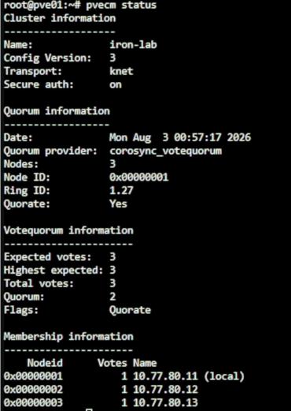

*圖（一）切換前確認 PVE Cluster 仍保有 Quorum。*

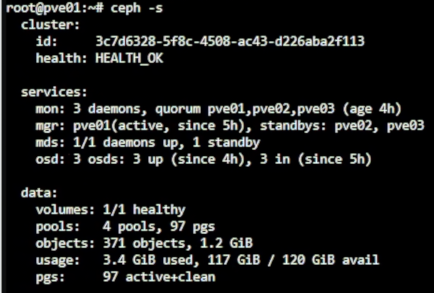

*圖（二）切換前確認 Ceph 為 HEALTH_OK。*

### 1.4 先切換 pve01

使用 pve01 目前的 `192.168.0.x` Web UI，到 `pve01` → `System` → `Network`：

1. 選 `vmbr0` 按 `Edit`，保留原本 `192.168.0.191/24`，只將 `IPv4 Gateway` 清空，按 `OK`／`Save` 保存為 Pending Change，但先不按 `Apply Configuration`。
2. 選取 Day 05 已建立的 `vmbr1.10`，按 `Edit`。
3. 確認 VLAN raw device 是 `vmbr1`，VLAN Tag 是 `10`。
4. 確認 IPv4/CIDR 是 `10.77.10.11/24`。
5. 將原本留白的 IPv4 Gateway 改為 `10.77.10.1`。
6. IPv6 保持不設定，確認 `Autostart` 已勾選，Comment 可改為 `PVE Management via OPNsense`。
7. 儲存後檢查 Pending Changes：`vmbr0` 只移除 Gateway，`vmbr1.10` 保留 `10.77.10.11/24` 並新增 Gateway。
8. 若先前略過 Day 05、畫面中沒有 `vmbr1.10`，才按 `Create` → `Linux VLAN`，依照上述數值補建。
9. 保持 L0 Console 開啟，按 `Apply Configuration`。
10. 到 pve01 `System` → `DNS`，DNS Server 改為 `10.77.10.1`，Search Domain 保持 `lab.home`。

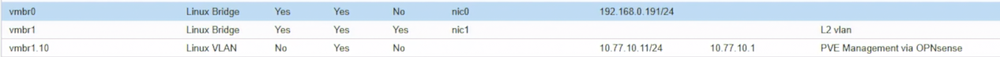

*圖（三）pve01 的 `vmbr1.10` 使用 `10.77.10.11/24`，並將預設閘道設為 `10.77.10.1`。*

Proxmox VE 在 VLAN-aware Linux Bridge 上使用 `vmbr1.10` 作為 Host Management VLAN 是官方支援的配置方式。一台 Host 只保留一條 IPv4 Default Gateway；不可讓 `vmbr0` 與 `vmbr1.10` 同時存在 Default Gateway。

### 1.5 驗證 pve01 後才處理其他節點

在 pve01 Console 執行：

```bash
ip -br address show vmbr1.10
ip route
ip route get 1.1.1.1
ping -c 3 10.77.10.1
getent hosts download.proxmox.com
curl -4I https://download.proxmox.com/
apt update
chronyc tracking
pvecm status
ceph -s
```

預期 `ip route get 1.1.1.1` 顯示：

```text
via 10.77.10.1 dev vmbr1.10 src 10.77.10.11
```

同時到 OPNsense `Firewall` → `Log Files` → `Live View`，使用 Source `10.77.10.11` 過濾，確認 DNS、NTP、HTTP／HTTPS 命中剛才建立的規則。

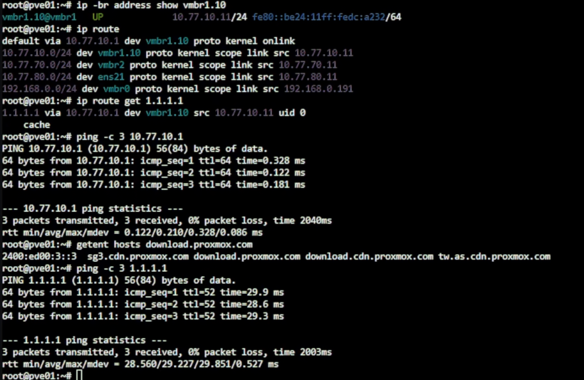

*圖（四）路由查詢顯示外部流量經 `vmbr1.10` 與 `10.77.10.1` 送出，DNS 解析與 Gateway 連線也正常。*

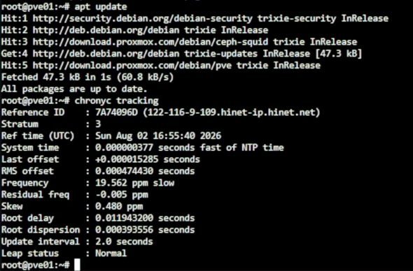

*圖（五）APT 更新與 Chrony 狀態確認套件出口及時間同步均可正常運作。*

只有 pve01 的 Web UI、APT、Time Sync、Cluster 與 Ceph 全部正常後，才使用相同步驟處理：

- pve02：`vmbr1.10` 設 `10.77.10.12/24`，Gateway `10.77.10.1`。
- pve03：`vmbr1.10` 設 `10.77.10.13/24`，Gateway `10.77.10.1`。

不可同時 Apply 三台節點的網路設定。

### 1.6 切換完成後的名稱解析

三台都能從 VLAN 10 上網後，將內部 DNS 或每台 PVE 的 `/etc/hosts` 更新為：

```text
10.77.10.11 pve01.lab.home pve01
10.77.10.12 pve02.lab.home pve02
10.77.10.13 pve03.lab.home pve03
```

在三台分別確認：

```bash
getent hosts pve01.lab.home
getent hosts pve02.lab.home
getent hosts pve03.lab.home
pvecm nodes
pvecm status
```

本節不修改 Hostname，也不修改 Corosync `link0`，只是將原 Hostname 改解析到正式 Management VLAN 位址。後續使用 `https://pve01.lab.home:8006`、`pve02.lab.home:8006`、`pve03.lab.home:8006` 管理節點。

目前 Windows 管理電腦仍在 `192.168.0.0/24`，上游路由器通常不知道 `10.77.10.0/24` 要往哪裡送。不要為了省事在上游建立一條會繞過 OPNsense 的一般路由；可經已連到 VLAN 10 的 L0 建立 SSH Tunnel：

```powershell
ssh -L 8011:10.77.10.11:8006 -L 8012:10.77.10.12:8006 -L 8013:10.77.10.13:8006 root@192.168.0.146
```

保持視窗開啟，分別瀏覽 `https://127.0.0.1:8011`、`:8012`、`:8013`。瀏覽器顯示憑證名稱警告是因為網址使用 `127.0.0.1`；這只是 Lab Tunnel 的已知限制，不是正式環境的憑證處理方式。若 L0 SSH 尚未開放，先使用 L0 PVE Console 與舊救援 IP 驗證，不要臨時建立不受控的跨網段路由。

### 1.7 失聯時回復

若切換後無法上網，不要連續修改其他節點。從 L0 開啟該 Nested PVE Console，先臨時恢復舊 Default Route：

```bash
ip route replace default via 192.168.0.1 dev vmbr0
```

這只是當次開機的臨時回復。要永久回復，使用舊 `192.168.0.x` Web UI 或 L0 Console：

1. 將 `vmbr1.10` 的 IPv4 Gateway 清空。
2. 將 `vmbr0` 的 IPv4 Gateway 恢復為 `192.168.0.1`。
3. Apply Configuration。
4. 必要時依 `/root/interfaces.before-day15` 對照原設定，不要盲目覆蓋正在運作的網路檔。

## 2. 從 Template 建立 VM

在 pve03：

1. 右鍵 Debian Template → `Clone`。
2. Mode 選 Full Clone。
3. VMID `231`、Name `jump01`、Target Storage 選 `local-lvm`。
4. 完成 Clone 後先不要啟動 VM。Clone 畫面只能選擇儲存位置，磁碟容量會直接繼承 Template，不會出現 Disk Size 欄位。
5. 選擇 VM 231 `jump01` → `Hardware`，將 CPU 設為 1 vCPU、Memory 設為 1GB。
6. 在 `Hardware` 選取 `Hard Disk (scsi0)`，按 `Disk Action` → `Resize`。
7. 先看清單中 `scsi0` 目前容量。如果 Debian Cloud Image 是 3 GiB，`Size Increment (GiB)` 填入 `5`，完成後總容量就是 8 GiB。這個欄位填的是增加量，不是最終容量，因此不要填 `8`。
8. 如果 `scsi0` 已經是 8 GiB 或更大，不要再 Resize。Proxmox VE 可以擴大虛擬磁碟，但不支援直接將現有虛擬磁碟縮小到 8 GiB；Lab 可直接保留較大容量。
9. Network Device 接 `vmbr1`、VLAN Tag `50`。
10. Cloud-Init 設定管理用 SSH 公鑰，不設定共用密碼。
11. IP 設 `10.77.50.11/24`、Gateway `10.77.50.1`、DNS `10.77.50.1`。
12. Regenerate Image 後啟動。

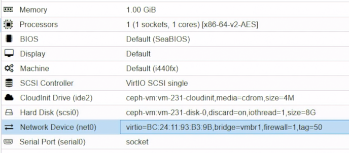

*圖（六）jump01 的 CPU、Memory、Disk 與 VLAN 50 NIC。*

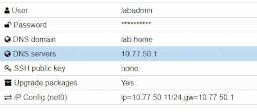

*圖（七）jump01 的 Cloud-Init IP、Gateway 與 DNS。*

此圖只核對 IP、Gateway 與 DNS；畫面中的密碼與 SSH 公鑰為建置當時狀態，後續以 opsadmin 專用金鑰取代。

如果 GUI 找不到 Resize，可在 VM 231 所在的 PVE 節點先確認磁碟名稱，再將它擴大到最終 8 GiB：

```bash
qm config 231 | grep '^scsi0:'
qm disk resize 231 scsi0 8G
```

`8G` 是 CLI 的最終容量寫法，與 GUI 要填「增加量」不同。磁碟擴大後啟動 jump01，Debian Cloud Image 通常會由 Cloud-Init 自動擴展 Partition 與 Filesystem。登入後確認：

```bash
lsblk
df -h /
cloud-init status --long
```

如果 `scsi0` 已是 8 GiB，但根目錄仍顯示舊容量，先不要猜測分割區名稱或直接執行 `resize2fs`；先保留 `lsblk -f` 與 `findmnt /` 輸出，依實際 Partition 與 Filesystem 類型處理。

登入後：

```bash
sudo hostnamectl set-hostname jump01
sudo apt update
sudo apt full-upgrade -y
sudo apt install -y openssh-server fail2ban auditd nftables
ip -br address
ip route
```

本日的安全驗證範圍為 OpenSSH 與 nftables；fail2ban 與 auditd 先完成安裝，相關規則留待後續設定。

## 3. 建立管理帳號

### 3.1 在本地 Windows 電腦產生專用 SSH 金鑰

在管理電腦開啟 PowerShell。這裡為 jump01 建立一組獨立的 Ed25519 金鑰，不與其他主機共用：

```powershell
$Jump01KeyDirectory = Join-Path $env:USERPROFILE '.ssh\ithome_jump01_ed25519'
$Jump01Key = Join-Path $Jump01KeyDirectory 'id_ed25519'
New-Item -ItemType Directory -Force -Path $Jump01KeyDirectory | Out-Null
ssh-keygen -t ed25519 -a 100 -f $Jump01Key -C 'opsadmin@jump01'
```

`ssh-keygen` 會要求輸入兩次 Passphrase。正式使用建議設定 Passphrase；若檔案已存在，不要直接同意覆蓋，先換一個檔名或確認舊 Key 已不再使用。

產生後會得到：

```text
%USERPROFILE%\.ssh\ithome_jump01_ed25519\id_ed25519      私鑰，只留在本地電腦
%USERPROFILE%\.ssh\ithome_jump01_ed25519\id_ed25519.pub  公鑰，可以放到 jump01
```

顯示公鑰並複製到剪貼簿：

```powershell
Get-Content "${Jump01Key}.pub"
Get-Content "${Jump01Key}.pub" | Set-Clipboard
```

公鑰應是一整行，開頭通常是 `ssh-ed25519`。不要把沒有 `.pub` 的私鑰貼進終端、文章、截圖或 Repository。

### 3.2 在 jump01 建立帳號並安裝公鑰

從 PVE 開啟 VM 231 Console、登入 `labadmin` 後先確認：

```bash
hostnamectl --static
```

```text
jump01
```

若顯示 `pve01`～`pve03`，代表仍在 PVE 節點，請先切回 jump01。

```bash
sudo adduser opsadmin
sudo usermod -aG sudo opsadmin
sudo install -d -m 700 -o opsadmin -g opsadmin /home/opsadmin/.ssh
sudo install -m 600 -o opsadmin -g opsadmin /dev/null /home/opsadmin/.ssh/authorized_keys
```

用編輯器將管理電腦的公鑰貼入：

```bash
sudoedit /home/opsadmin/.ssh/authorized_keys
```

把 PowerShell 複製的 `ssh-ed25519 ... opsadmin@jump01` 完整一行貼入。`authorized_keys` 只保留一份公鑰，不要重複貼上，也不要留下單獨的 `.`、提示符號或換行後的其他文字。儲存後再次修正擁有者與權限：

```bash
sudo chown -R opsadmin:opsadmin /home/opsadmin/.ssh
sudo chmod 700 /home/opsadmin/.ssh
sudo chmod 600 /home/opsadmin/.ssh/authorized_keys
```

完成第 6 節的 DNAT 後，在本地 PowerShell 讀取 fw01 當下的 WAN IP 並測試：

```powershell
$Fw01WanIp = Read-Host '請輸入 fw01 目前顯示的 WAN IP'
ssh -i $Jump01Key -p 45222 "opsadmin@$Fw01WanIp"
```

第一次連線先核對畫面上的 Host Key Fingerprint，再輸入 `yes`。套用 OpenSSH 設定前先保持 PVE Console 開啟；完成第 6 節的目的地 NAT 與 WAN 規則後，再由另一個 PowerShell 視窗驗證 `opsadmin` Key 登入。若驗證失敗，可透過 Console 回復 OpenSSH 設定。

## 4. SSH 安全設定

建立 `/etc/ssh/sshd_config.d/20-bastion-hardening.conf`：

```sshconfig
PermitRootLogin no
PasswordAuthentication no
KbdInteractiveAuthentication no
PubkeyAuthentication yes
AllowAgentForwarding no
X11Forwarding no
PermitTunnel no
GatewayPorts no
MaxAuthTries 3
LoginGraceTime 30
ClientAliveInterval 300
ClientAliveCountMax 2
AllowUsers opsadmin
```

驗證後只 Reload：

```bash
sudo sshd -t
sudo systemctl reload ssh
sudo sshd -T | grep -E 'permitrootlogin|passwordauthentication|allowagentforwarding|maxauthtries'
```

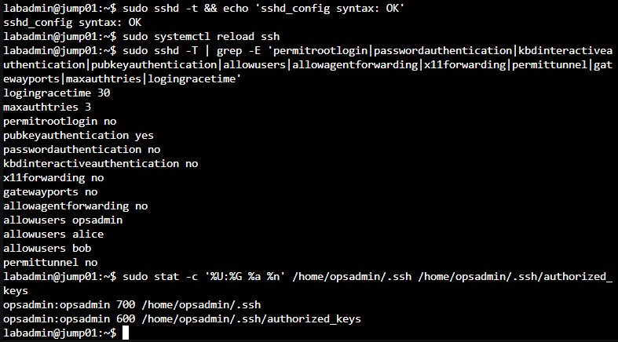

*圖（八）OpenSSH 關閉 root、密碼及鍵盤互動式驗證並啟用公鑰驗證；opsadmin 的 SSH 目錄及 authorized_keys 權限分別為 700、600。*

不要在唯一 Session 中直接 Restart。保持 PVE Console 與既有 SSH Session，直到新 Session 驗證完成。

## 5. Debian 主機防火牆

建立 `/etc/nftables.conf`，只允許 SSH 與必要回應：

```nft
flush ruleset
table inet filter {
  chain input {
    type filter hook input priority 0; policy drop;
    ct state established,related accept
    iifname "lo" accept
    ip protocol icmp accept
    tcp dport 22 ct state new accept
  }
  chain forward { type filter hook forward priority 0; policy drop; }
  chain output { type filter hook output priority 0; policy accept; }
}
```

```bash
sudo nft -c -f /etc/nftables.conf
sudo systemctl enable --now nftables
sudo nft list ruleset
```

OPNsense 負責來源限制；主機防火牆再確保 jump01 不會成為 Router。

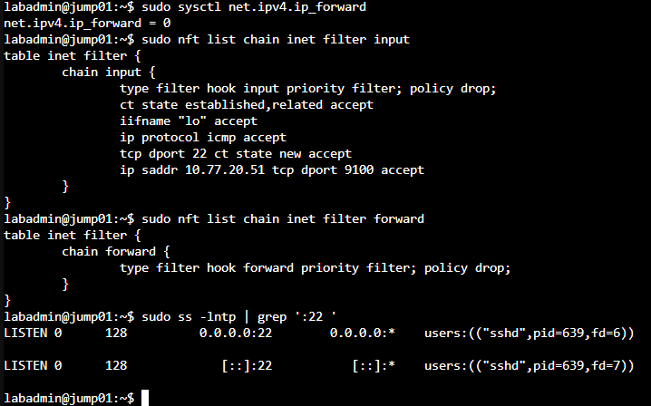

*圖（九）IPv4 Forwarding 已關閉，nftables 的 Input 與 Forward Chain 採預設丟棄，sshd 只監聽 TCP 22。*

## 6. 啟用 OPNsense Port Forward

OPNsense 26.7 將舊版 `Port Forward` 選單改名為 `Destination NAT`。進入 `Firewall` → `NAT` → `Destination NAT`，按 `Add` 後依序設定：

1. Interface 選 `WAN`。
2. TCP/IP Version 選 `IPv4`。
3. Protocol 選 `TCP`。
4. Destination 選 `WAN address`。
5. Destination Port 填 `45222`。
6. Redirect target IP 填 `10.77.50.11`。
7. Redirect target Port 填 `22`。
8. Description 填 `WAN_45222_TO_JUMP01_SSH`。
9. 展開 `Options`；若畫面有 `Firewall rule`，選 `Manual`。若沒有這個欄位，就保留預設，下一節仍手動建立 WAN 規則。

Save／Apply。這條規則只負責把 `fw01 WAN:45222` 改寫成 `10.77.50.11:22`。本系列將 `Firewall rule` 設為 `Manual`，因此下一節會另外建立可檢視及調整的 WAN 規則。

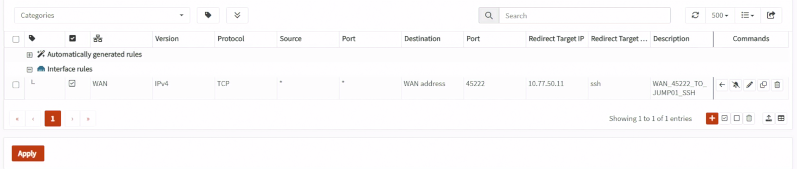

*圖（十）Destination NAT 將 `WAN address:45222` 轉送至 `10.77.50.11:22`。*

### 6.1 手動建立 WAN Allow Rule

進入 `Firewall` → `Rules`，按右下角橘色 `+` 建立：

1. Interface 選 `WAN`。
2. Action 選 `Pass`。
3. TCP/IP Version 選 `IPv4`。
4. Protocol 選 `TCP`。
5. Source 選 `any`；正式環境有固定管理來源時改用來源 IP Alias。
6. Destination 選 Day 14 已建立的 `BASTION_HOST` Alias；其內容是 `10.77.50.11`。
7. Destination Port 填 `22`。
8. 勾選 Log，Description 填 `ALLOW_WAN_DNAT_TO_JUMP01_SSH`。
9. 本 Lab 從與 fw01 WAN 同為 `192.168.0.0/24` 的 Windows 電腦測試，因此展開 Advanced，將 `Disable reply-to` 勾選，或將 `reply-to` 設為 `Disable／None`。
10. Save 後按 `Apply`。本系列沒有另外建立一條可見的 WAN 最終 Block Rule；未命中這條 Allow 的其他 WAN 流量，會由 OPNsense／pf 內建的隱含 Default Deny 拒絕。若你自行建立過明確 Block，才需要確認這條 Allow 位於它上方。


*圖（十一）WAN Pass Rule 比對轉換後的 BASTION_HOST 與 SSH 連接埠。*

WAN 規則使用轉送後的目的 `10.77.50.11:22`，不是原始的 `WAN address:45222`，因為 Destination NAT 會先改寫目的位址，Firewall Filter 再比對封包。到 Live View 時可用 Description、來源位址與 `10.77.50.11:22` 確認命中。

本 Lab 的 Windows 與 fw01 WAN 位於同一網段，因此這條規則要停用 `reply-to`。修改後到 `Firewall` → `Diagnostics` → `States` 刪除 TCP 45222 的舊測試 State 再重連；正式 Internet 或 Multi-WAN 環境不要直接照抄。

Double NAT 時還要在上游路由器把 TCP 45222 轉送到 fw01 WAN IP。本系列已知上游具有可接受入站連線的公網 IPv4；完成兩層轉送後，必須從真正外部網路驗證，不能只用同網段或模擬 WAN 用戶端結果宣稱 Internet 可連入。

## 7. 驗證

從 WAN 側的 Windows PowerShell 使用本節建立的專用 Key 測試：

```powershell
$Jump01Key = Join-Path $env:USERPROFILE '.ssh\ithome_jump01_ed25519\id_ed25519'
$Fw01WanIp = Read-Host '請輸入 fw01 目前顯示的 WAN IP'
ssh -i $Jump01Key -p 45222 -o PasswordAuthentication=no "opsadmin@$Fw01WanIp"
```

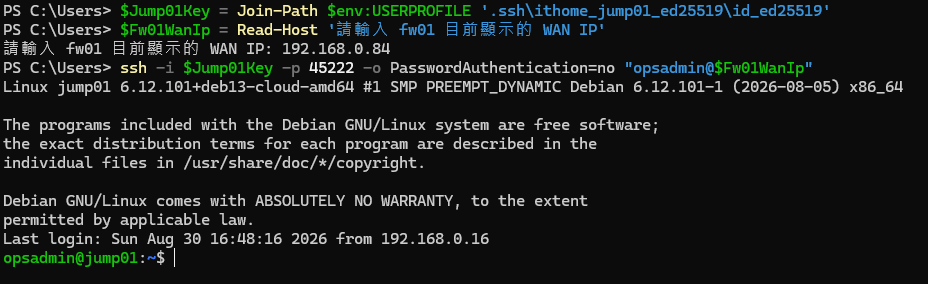

*圖（十二）正確的管理帳號與專用私鑰可透過 fw01 WAN TCP 45222 登入 jump01。*

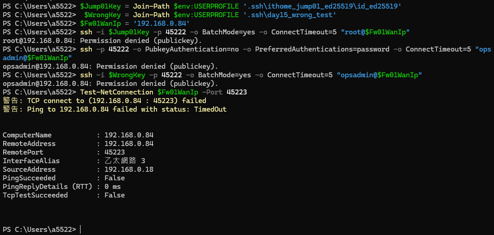

*圖（十三）root、密碼及錯誤私鑰均遭到 SSH 拒絕，未開放的 TCP 45223 也無法連線。*

確認：

```text
公鑰成功
密碼登入失敗
root 登入失敗
錯誤 Key 失敗
OPNsense Live View 有對應 State
journalctl -u ssh 有登入紀錄
```
