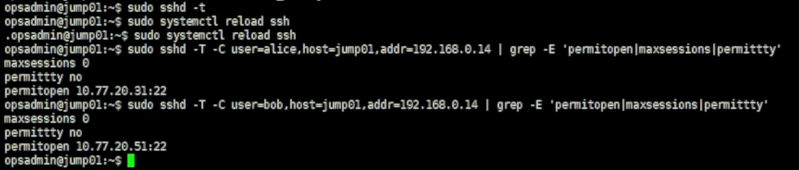
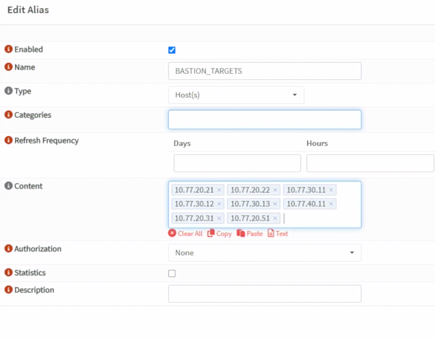
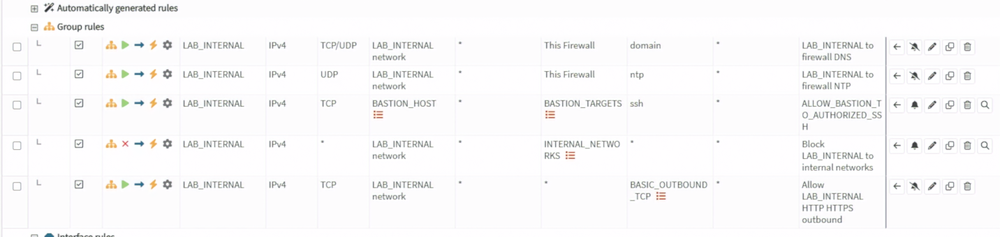
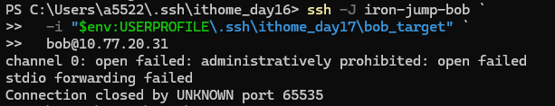

# Day 16｜SSH 跳板機的部署與權限設計（下）：ProxyJump 與多人權限隔離

對應文章：[Day 16｜SSH 跳板機的部署與權限設計（下）：ProxyJump 與多人權限隔離](https://ithelp.ithome.com.tw/users/20183351/ironman/9461)

本日建立兩台最小化 Guest VM 作為 SSH 管理目標：Alice 只能管理 app01，Bob 只能管理 monitor01。一般使用者不登入 pve01～pve03，也不透過 Day 16 取得 PVE Web UI 權限；PVE Web UI 會在 Day 17 由獨立 VPN-Admin 路徑處理。

## 1. 本日連線關係

```text
Alice
  → jump01 的 alice 無 Shell 帳號
  → 只允許 Forward 到 app01 10.77.20.31:22
  → app01 再次驗證 Alice 的 Target Key

Bob
  → jump01 的 bob 無 Shell 帳號
  → 只允許 Forward 到 monitor01 10.77.20.51:22
  → monitor01 再次驗證 Bob 的 Target Key
```

app01 會在 Day 25 安裝 Web Backend；monitor01 會在 Day 29 安裝監控服務。Day 16 只提前建立作業系統、SSH 帳號與網路，不提前安裝後續服務。

## 2. 建立 app01

app01 使用 VMID `211`，放在 pve02。

1. 在 PVE Web UI 找到 Debian 13 Cloud-Init Template。
2. 右鍵選 `Clone`。
3. `Mode` 選 `Full Clone`。
4. `Target Node` 選 `pve02`。
5. `VM ID` 填 `211`，Name 填 `app01`。
6. Storage 使用目前 VM 共用的 `ceph-vm`；若你的 Template 仍在 Local Storage，先將 Full Clone 建在可用 Storage，再依既有遷移流程移到 pve02。
7. Clone 完成後先不要啟動。
8. 到 VM 211 → `Hardware`，CPU 設 1 Core、Memory 設 1024 MiB。
9. 選取 `Hard Disk (scsi0)`，先記下目前容量，再按 `Disk Action` → `Resize`。
10. app01 的目標容量為 12 GiB。GUI 的 `Size Increment (GiB)` 填的是「增加量」：若目前是 3 GiB 就填 `9`；若目前是 8 GiB 就填 `4`；若已經是 12 GiB 或更大則不要 Resize。
11. Network Device 使用 `vmbr1`，VLAN Tag 填 `20`。
12. 到 `Cloud-Init`，User 保留 Template 的 `labadmin`。本次 Lab 沿用你目前設定的管理密碼，`SSH public key` 不強制填寫；密碼不要寫入文件或截圖。
13. IP 設 `10.77.20.31/24`，Gateway 設 `10.77.20.1`。
14. DNS 設 `10.77.20.1`，Search Domain 設 `lab.home`。
15. 按 `Regenerate Image`，再啟動 VM。

Proxmox VE 的 GUI Resize 欄位填增加量，不是最終容量。若 GUI 不方便操作，可以在 VM 211 所在節點先確認磁碟名稱，再以 CLI 將它擴大至最終 12 GiB：

```bash
qm config 211 | grep '^scsi0:'
qm disk resize 211 scsi0 12G
```

若 Template Disk 已大於原規劃的 12 GiB，直接保留，不要嘗試縮小磁碟。正式環境仍建議使用個人 SSH 公私鑰，避免使用共用密碼；本次 Lab 先依目前的密碼方式完成部署。

從 VM 211 Console 登入後執行：

```bash
sudo hostnamectl set-hostname app01
sudo apt update
sudo apt install -y openssh-server
lsblk
df -h /
ip -br address
ip route
```

確認：

```bash
hostnamectl --static
ip neigh show 10.77.20.1
getent ahostsv4 deb.debian.org
curl -4I --connect-timeout 10 https://deb.debian.org/
sudo apt update
```

目前 Day 14 的最小權限規則只允許 DNS、NTP、HTTP 與 HTTPS，沒有允許 Service VLAN 對 Gateway 或 Internet 的 ICMP。因此 `ping 10.77.20.1`／`ping 1.1.1.1` 失敗可以是預期結果，不能單獨判定沒有網路；本系列以 ARP Neighbor、DNS、HTTPS 與 APT 結果確認對外連線。

## 3. 建立 monitor01

monitor01 使用 VMID `251`，同樣先放在 pve02。

1. 右鍵 Debian 13 Cloud-Init Template → `Clone`。
2. `Mode` 選 `Full Clone`，Target Node 選 `pve02`。
3. VM ID 填 `251`，Name 填 `monitor01`。
4. Storage 使用 pve02 的 `local-lvm`。monitor01 是單台監控 VM，後續 Prometheus 資料會持續成長，本系列不拿它做 PVE HA／Migration 示範，因此不占用容量有限的 `ceph-vm`。
5. CPU 設 2 Core，Memory 設 2048 MiB。
6. 選取 `Hard Disk (scsi0)` → `Disk Action` → `Resize`，將最終容量擴大到 24 GiB。若目前是 3 GiB，GUI 的 `Size Increment (GiB)` 填 `21`；若容量不同，以 `24－目前容量` 計算增加量；已達 24 GiB 或更大則不要 Resize。
7. Network Device 使用 `vmbr1`，VLAN Tag 填 `20`。
8. Cloud-Init IP 設 `10.77.20.51/24`，Gateway 設 `10.77.20.1`。
9. DNS 設 `10.77.20.1`，Search Domain 設 `lab.home`。
10. User 保留 `labadmin`，本次沿用目前的管理密碼，`SSH public key` 不強制填寫。按 `Regenerate Image` 後啟動。

CLI 的最終容量寫法如下：

```bash
qm config 251 | grep '^scsi0:'
qm disk resize 251 scsi0 24G
```

若 Template Disk 已超過原規劃的 24 GiB，同樣保留現況，不縮小。正式環境建議改用個人 SSH 公私鑰，本次 Lab 的管理密碼只作為目前部署方式。

登入 VM 251 Console：

```bash
sudo hostnamectl set-hostname monitor01
sudo apt update
sudo apt install -y openssh-server
hostnamectl --static
lsblk
df -h /
ip -br address
ip route
ip neigh show 10.77.20.1
getent ahostsv4 deb.debian.org
curl -4I --connect-timeout 10 https://deb.debian.org/
```

## 4. 在 Windows 建立四把 Key

每位使用者各有一把 Bastion Key 與一把 Target Key。Private Key 全部只留在 Windows，不放到 jump01。

```powershell
$Day16KeyDirectory = Join-Path $env:USERPROFILE '.ssh\ithome_day16'
New-Item -ItemType Directory -Force -Path $Day16KeyDirectory | Out-Null

ssh-keygen -t ed25519 -a 100 -f "$Day16KeyDirectory\alice_bastion" -C 'alice@jump01'
ssh-keygen -t ed25519 -a 100 -f "$Day16KeyDirectory\alice_target" -C 'alice@app01'
ssh-keygen -t ed25519 -a 100 -f "$Day16KeyDirectory\bob_bastion" -C 'bob@jump01'
ssh-keygen -t ed25519 -a 100 -f "$Day16KeyDirectory\bob_target" -C 'bob@monitor01'
```

四次都完成後確認：

```powershell
Get-ChildItem $Day16KeyDirectory
```

沒有 `.pub` 的檔案是 Private Key，不可貼到伺服器或提交 Git。

## 5. 建立 jump01 的無 Shell 帳號

從 VM 231 Console 登入 jump01，先確認：

```bash
hostnamectl --static
```

必須顯示 `jump01`，再執行：

```bash
sudo groupadd --system bastion-proxy
sudo useradd -m -U -s /usr/sbin/nologin -G bastion-proxy alice
sudo useradd -m -U -s /usr/sbin/nologin -G bastion-proxy bob
sudo usermod -p "$(openssl passwd -6 "$(openssl rand -base64 48)")" alice
sudo usermod -p "$(openssl passwd -6 "$(openssl rand -base64 48)")" bob

for user in alice bob; do
  sudo install -d -m 700 -o "$user" -g "$user" "/home/$user/.ssh"
  sudo install -m 600 -o "$user" -g "$user" /dev/null "/home/$user/.ssh/authorized_keys"
done
```

### 5.1 安裝 Alice Bastion Key

Windows：

```powershell
$Day16KeyDirectory = Join-Path $env:USERPROFILE '.ssh\ithome_day16'
Get-Content "$Day16KeyDirectory\alice_bastion.pub" | Set-Clipboard
```

jump01：

```bash
sudoedit /home/alice/.ssh/authorized_keys
sudo chown alice:alice /home/alice/.ssh/authorized_keys
sudo chmod 600 /home/alice/.ssh/authorized_keys
```

### 5.2 安裝 Bob Bastion Key

Windows：

```powershell
Get-Content "$Day16KeyDirectory\bob_bastion.pub" | Set-Clipboard
```

jump01：

```bash
sudoedit /home/bob/.ssh/authorized_keys
sudo chown bob:bob /home/bob/.ssh/authorized_keys
sudo chmod 600 /home/bob/.ssh/authorized_keys
```

## 6. 在目標 VM 建立個人帳號

### 6.1 app01 建立 Alice

進入 VM 211 Console，確認 Hostname 是 `app01`：

```bash
sudo useradd -m -U -s /bin/bash alice
sudo usermod -p "$(openssl passwd -6 "$(openssl rand -base64 48)")" alice
sudo install -d -m 700 -o alice -g alice /home/alice/.ssh
sudo install -m 600 -o alice -g alice /dev/null /home/alice/.ssh/authorized_keys
```

Windows 複製 Target Public Key：

```powershell
Get-Content "$Day16KeyDirectory\alice_target.pub" | Set-Clipboard
```

app01 貼入並修正權限：

```bash
sudoedit /home/alice/.ssh/authorized_keys
sudo chown alice:alice /home/alice/.ssh/authorized_keys
sudo chmod 600 /home/alice/.ssh/authorized_keys
```

Alice 不加入 `sudo` 群組。

### 6.2 monitor01 建立 Bob

進入 VM 251 Console，確認 Hostname 是 `monitor01`：

```bash
sudo useradd -m -U -s /bin/bash bob
sudo usermod -p "$(openssl passwd -6 "$(openssl rand -base64 48)")" bob
sudo install -d -m 700 -o bob -g bob /home/bob/.ssh
sudo install -m 600 -o bob -g bob /dev/null /home/bob/.ssh/authorized_keys
```

Windows：

```powershell
Get-Content "$Day16KeyDirectory\bob_target.pub" | Set-Clipboard
```

monitor01：

```bash
sudoedit /home/bob/.ssh/authorized_keys
sudo chown bob:bob /home/bob/.ssh/authorized_keys
sudo chmod 600 /home/bob/.ssh/authorized_keys
```

Bob 同樣不加入 `sudo` 群組。

## 7. 限制 jump01 的轉送目的地

編輯 Day 15 建立的 `/etc/ssh/sshd_config.d/20-bastion-hardening.conf`，將：

```sshconfig
AllowUsers opsadmin
```

改為：

```sshconfig
AllowUsers opsadmin alice bob
```

建立 `/etc/ssh/sshd_config.d/30-bastion-users.conf`：

```sshconfig
Match User alice
    AuthenticationMethods publickey
    AllowTcpForwarding local
    PermitOpen 10.77.20.31:22
    PermitTTY no
    MaxSessions 0
    X11Forwarding no
    AllowAgentForwarding no

Match User bob
    AuthenticationMethods publickey
    AllowTcpForwarding local
    PermitOpen 10.77.20.51:22
    PermitTTY no
    MaxSessions 0
    X11Forwarding no
    AllowAgentForwarding no
```

檢查後 Reload：

```bash
sudo sshd -t
sudo systemctl reload ssh
sudo sshd -T -C user=alice,host=jump01,addr=192.168.0.14 | grep -E 'permitopen|maxsessions|permittty'
sudo sshd -T -C user=bob,host=jump01,addr=192.168.0.14 | grep -E 'permitopen|maxsessions|permittty'
```

Alice 必須顯示 `10.77.20.31:22`，Bob 必須顯示 `10.77.20.51:22`。



*圖（一）Alice 與 Bob 分別套用自己的 PermitOpen 目標，且 PermitTTY 為 no、MaxSessions 為 0。*

## 8. 更新 OPNsense BASTION_TARGETS

### 8.1 更新 Alias

1. 進入 `Firewall` → `Aliases`。
2. 編輯既有 `BASTION_TARGETS`。
3. 在原內容之外加入 `10.77.20.31` 與 `10.77.20.51`。
4. 按 `Save`，再按 `Apply`。



*圖（二）將 app01 與 monitor01 加入 BASTION_TARGETS Alias。*

不要加入 pve01～pve03，也不要把整個 Management 或 Service Network 放進 Alias。

### 8.2 啟用 Bastion SSH Rule

1. 進入 `Firewall` → `Rules`，按右下角橘色 `+`。
2. Interface 選 `LAB_INTERNAL`。
3. Action 選 `Pass`，Direction 選 `in`，Quick 保持勾選。
4. Version 選 `IPv4`，Protocol 選 `TCP`。
5. Source 選 `BASTION_HOST`。
6. Destination 選 `BASTION_TARGETS`。
7. Destination Port 填 `22`。
8. 勾選 Log，Description 填 `ALLOW_BASTION_TO_AUTHORIZED_SSH`。
9. Save 後將規則移到 `Block LAB_INTERNAL to internal networks` 上方。
10. 按 `Apply`。

在 jump01 確認網路層：

```bash
nc -vz 10.77.20.31 22
nc -vz 10.77.20.51 22
```



*圖（三）ALLOW_BASTION_TO_AUTHORIZED_SSH 位於內部網段封鎖規則之前。*

## 9. 建立 Windows SSH Config

```powershell
$SshConfig = Join-Path $env:USERPROFILE '.ssh\config'
if (-not (Test-Path $SshConfig)) {
    New-Item -ItemType File -Path $SshConfig | Out-Null
}
$CurrentWindowsUser = whoami
icacls $SshConfig /inheritance:r
icacls $SshConfig /grant:r "${CurrentWindowsUser}:(F)"
notepad $SshConfig
```

加入：

```sshconfig
Host iron-jump-alice
    HostName 192.168.0.84
    Port 45222
    User alice
    IdentityFile ~/.ssh/ithome_day16/alice_bastion
    IdentitiesOnly yes

Host app01-via-jump
    HostName 10.77.20.31
    User alice
    IdentityFile ~/.ssh/ithome_day16/alice_target
    IdentitiesOnly yes
    ProxyJump iron-jump-alice
    ForwardAgent no

Host iron-jump-bob
    HostName 192.168.0.84
    Port 45222
    User bob
    IdentityFile ~/.ssh/ithome_day16/bob_bastion
    IdentitiesOnly yes

Host monitor01-via-jump
    HostName 10.77.20.51
    User bob
    IdentityFile ~/.ssh/ithome_day16/bob_target
    IdentitiesOnly yes
    ProxyJump iron-jump-bob
    ForwardAgent no
```

若 fw01 WAN 位址已改變，只修改兩個 `iron-jump-*` 的 HostName。

## 10. 驗證

Alice 正向測試：

```powershell
ssh app01-via-jump
```

登入後應顯示 `app01`／`alice`。

Bob 正向測試：

```powershell
ssh monitor01-via-jump
```

登入後應顯示 `monitor01`／`bob`。

Alice 嘗試 Bob 的目標：

```powershell
ssh -vv -J iron-jump-alice `
  -i "$env:USERPROFILE\.ssh\ithome_day16\alice_target" `
  alice@10.77.20.51
```

Bob 嘗試 Alice 的目標：

```powershell
ssh -vv -J iron-jump-bob `
  -i "$env:USERPROFILE\.ssh\ithome_day16\bob_target" `
  bob@10.77.20.31
```

兩項負向測試都應由 jump01 顯示 `administratively prohibited` 或 `open failed`。



*圖（四）Bob 嘗試存取未授權的 app01 時，由 jump01 以 administratively prohibited 拒絕。*

圖中的 `ithome_day17` 是系列天數調整前建立的本機資料夾名稱，不影響既有測試結果；本文件中的示範路徑統一使用 `ithome_day16`。

最後確認兩個人不能取得 jump01 Shell：

```powershell
ssh iron-jump-alice
ssh iron-jump-bob
```
