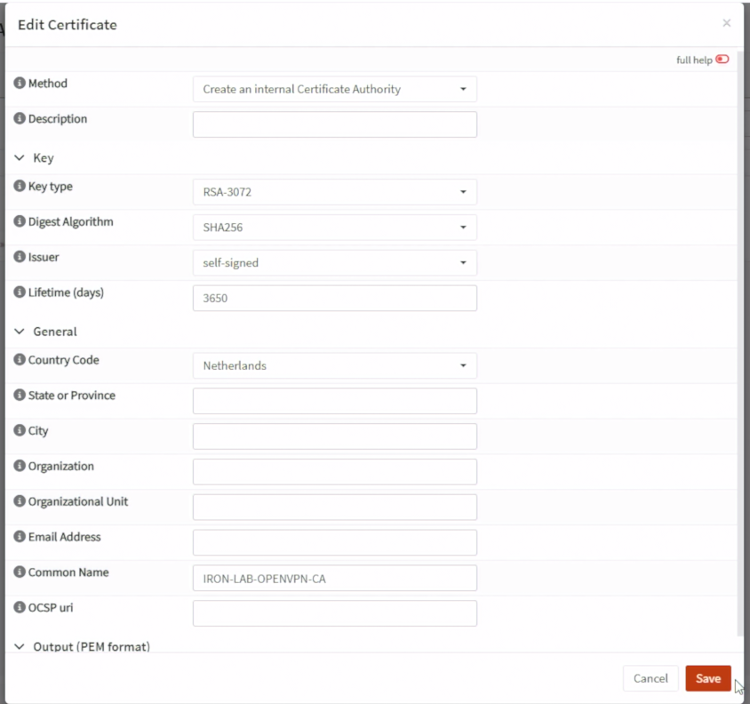
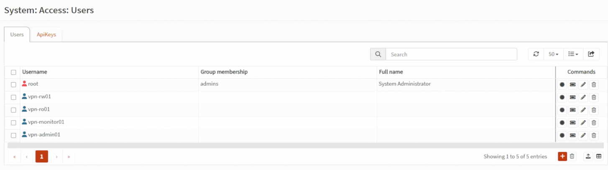
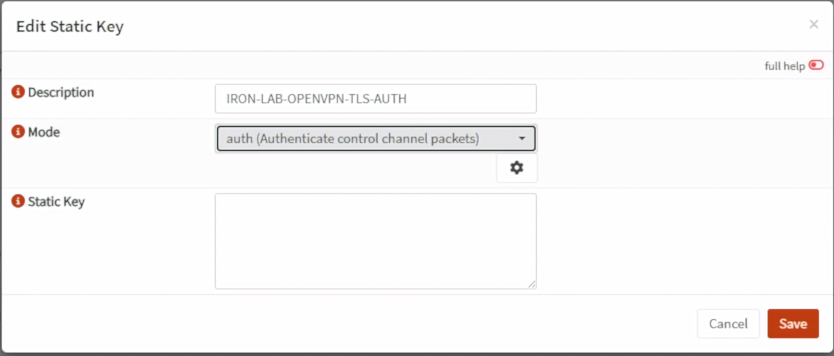
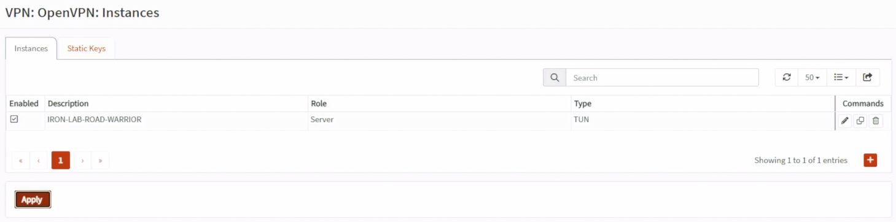
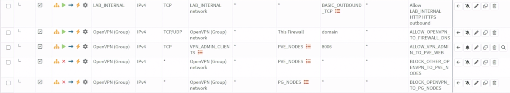
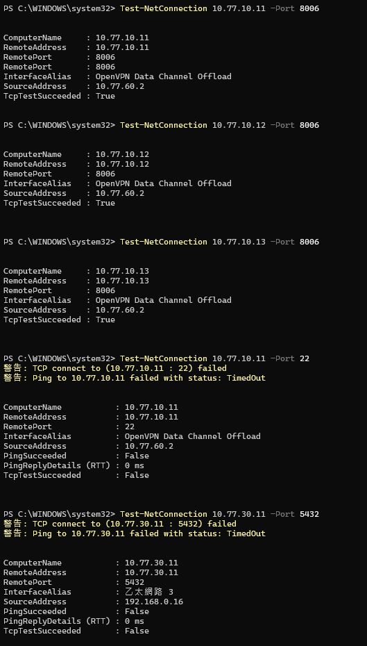

# Day 17｜外部人員如何安全連入內部服務？OpenVPN、Road Warrior 與 Split Tunnel

對應文章：[Day 17｜外部人員如何安全連入內部服務？OpenVPN、Road Warrior 與 Split Tunnel](https://ithelp.ithome.com.tw/users/20183351/ironman/9461)

本日建立 OPNsense OpenVPN Road Warrior。Tunnel Network 固定為 `10.77.60.0/24`。一般 VPN 使用者只能連固定服務入口；只有獨立 `vpn-admin` 群組可以連 PVE Web UI 8006，而且仍不能直接連 pg01～pg03、Patroni 或 etcd。

## 1. 確認內建 OpenVPN 功能

OPNsense 26.7 已將 OpenVPN 與新版 `Instances`、`Client Export` 功能整合在基礎系統。

1. 到 `System` → `Firmware` → `Packages`，搜尋 `openvpn`，確認套件已安裝。
2. 到 `VPN` → `OpenVPN`，確認可以看到 `Instances`。
3. 同一選單確認可以看到 `Client Export`、`Connection Status` 與 `Log File`。
4. `System` → `Firmware` → `Plugins` 只搜尋到 `os-openvpn-legacy` 是正常的，不要安裝它。本系列使用新版 `Instances`，不使用舊版 Servers／Clients 設定頁。


## 2. 建立內部 CA

到 `System → Trust → Authorities`：

1. Add。
2. Method 選 Create an internal Certificate Authority。
3. `Common Name` 填 `IRON-LAB-OPENVPN-CA`。OPNsense 26.7 的目前畫面若沒有 `Descriptive Name`，不需要另外尋找；若有選用的 `Description` 欄位，可填相同名稱方便辨識。
4. Key Type 選 RSA 3072 位元或畫面提供的更高安全等級。
5. Digest Algorithm 選 SHA256 以上。
6. Issuer 保持 Self-signed。
7. Lifetime 依 Lab 設定並記錄到期日，例如 `3650` 天只作為教學 CA 的有效期限。
8. Country、State、City、Organization 等識別欄位可以依實際資料填寫；不影響本 Lab 路由設定。
9. OCSP URI 留空，本系列沒有另外部署 OCSP Responder。
10. 按 Save，回到 Authorities 清單確認 `IRON-LAB-OPENVPN-CA` 已出現。



*圖（一）建立 `IRON-LAB-OPENVPN-CA` 內部 CA。*

不要把 CA Private Key 放入 Git。

## 3. 建立 Server Certificate

到 `System → Trust → Certificates`：

1. 按 Add，Method 選 `Create an internal Certificate`。若選成 Import 或 CSR，後面不會出現簽發者選項。
2. Type 選 `Server Certificate`。
3. Private Key Location 選 `Save on this firewall`。
4. Key Type 選 RSA 3072 位元或畫面提供的更高安全等級，Digest Algorithm 選 SHA256 以上。
5. 新版畫面不會顯示名為 `CA` 的欄位；在 `Issuer` 選 `IRON-LAB-OPENVPN-CA`。這就是簽發本張 Server Certificate 的 CA。
6. Common Name 填 `vpn.lab.home`。
7. 在 `DNS domain names` 加入 `vpn.lab.home`。這個欄位就是憑證的 DNS Subject Alternative Name（SAN），OPNsense 26.7 不需要另外選 Type／Value。
8. Lifetime 依 Lab 設定並記錄到期日，例如 `825` 天。
9. Description 若有顯示，可填 `IRON-LAB-OPENVPN-SERVER`；沒有就略過。
10. Save 後回到 Certificates 清單，確認 Type 是 Server、Issuer 是 `IRON-LAB-OPENVPN-CA`。

如果選了 `Create an internal Certificate` 仍完全看不到 `Issuer`，先回 `System` → `Trust` → `Authorities`，確認 `IRON-LAB-OPENVPN-CA` 已成功儲存且帶有 Private Key；只有可簽發憑證的內部 CA 才能出現在 Issuer 清單。

## 4. 建立使用者與個人憑證

到 `System → Access → Users`，為每位測試者建立獨立帳號：

```text
vpn-rw01
vpn-ro01
vpn-monitor01
vpn-admin01
```

每個帳號都要建立自己的 Client Certificate，而且必須與 OpenVPN Server Certificate 由同一個 CA 簽發。以 `vpn-admin01` 為例：

1. 編輯 `vpn-admin01` 使用者。
2. 到該使用者的 Certificates 區域，按新增憑證。
3. Method 選 `Create an internal Certificate`。
4. Type 選 `Client Certificate`，不要選 Server Certificate。
5. Issuer 選 `IRON-LAB-OPENVPN-CA`。
6. Common Name 必須是 `vpn-admin01`，與 Username 完全相同；從使用者頁面建立時通常會自動帶入。
7. Save，並為其餘三個帳號各自重複一次，不共用憑證或 Profile。

完成後到 `System` → `Trust` → `Certificates` 核對：

```text
vpn.lab.home   Type：Server   Issuer：IRON-LAB-OPENVPN-CA
vpn-rw01       Type：Client   Issuer：IRON-LAB-OPENVPN-CA
vpn-ro01       Type：Client   Issuer：IRON-LAB-OPENVPN-CA
vpn-monitor01  Type：Client   Issuer：IRON-LAB-OPENVPN-CA
vpn-admin01    Type：Client   Issuer：IRON-LAB-OPENVPN-CA
```



*圖（二）確認四個 OpenVPN 測試帳號已建立。*

若 Client Certificate 的 Issuer 是其他 CA，不能直接修改原憑證的簽發者；回到對應使用者建立一張由 `IRON-LAB-OPENVPN-CA` 簽發的新憑證。先保留舊憑證，等新 Profile 匯出並連線成功後再撤銷舊憑證。

若啟用 TOTP，先確認 fw01 與手機時間一致，再測試 OTP。

另外建立本機群組 `vpn-admin`，只把 `vpn-admin01` 加入。一般 VPN 使用者不能加入這個群組。

## 5. 建立 OpenVPN Instance

先到 `VPN` → `OpenVPN` → `Instances` → `Static Keys`：

1. 按 Add。
2. Mode 選 `auth`。
3. Description 填 `IRON-LAB-OPENVPN-TLS-AUTH`。
4. 使用畫面上的齒輪／Generate 產生 Static Key。
5. Save／Apply。

儲存後必須先回到 Static Keys 清單，確認能看到 `IRON-LAB-OPENVPN-TLS-AUTH`，再重新開啟／重新整理 Server Instance 表單。若只填 Description、沒有按齒輪產生 Key，或尚未 Save／Apply，`TLS static key` 選單會保持空白。



*圖（三）建立 OpenVPN TLS Static Key。*

再回到 `VPN` → `OpenVPN` → `Instances` 新增 Server。OPNsense 26.7 的欄位名稱是 `Certificate`，不叫 `Server Certificate`；在這個欄位選前一節建立的 `vpn.lab.home` Server Certificate。

1. Role 選 `Server`。
2. Description 填 `IRON-LAB-ROAD-WARRIOR`。
3. Protocol 選 `UDP (IPv4)`。
4. Port number 填 `1194`。
5. Bind address 留空；fw01 WAN 使用 DHCP，留空會綁定可用位址。
6. Server (IPv4) 填 `10.77.60.0/24`。
7. Certificate 選 `IRON-LAB-OPENVPN-SERVER`。
8. TLS static key 選 `IRON-LAB-OPENVPN-TLS-AUTH`。
9. Authentication 選 `Local Database`；OTP 依實際啟用。
10. Strict User/CN Matching 勾選；每位使用者憑證 CN 必須與 Username 相同。
11. Local Network 加入 `10.77.10.0/24` 與 `10.77.20.0/24`；不要推送整個 `10.77.0.0/16`。
12. Redirect gateway 留空，使用 Split Tunnel。
13. DNS Server 填 `10.77.10.1`，也就是 fw01 的 Management VLAN 位址；這個欄位要填 IP，不能填 `lab.home` 或 `home.lab`。
14. DNS Default Domain／Search Domain 若畫面有提供，填 `lab.home`。本系列主機名稱統一為 `pve01.lab.home`、`app01.lab.home` 等，不使用 `home.lab`。

使用現代 TLS 與 Data Cipher 預設值，不啟用 Compression。Save／Apply 後確認 Instance Running。



*圖（四）確認 OpenVPN Instance 已啟用。*

## 6. WAN 與 OpenVPN Firewall Rule

### 6.1 建立 WAN UDP 1194 規則

1. 進入 `Firewall` → `Rules`，按右下角橘色 `+`。
2. Interface 只選 `WAN`。
3. Action 選 `Pass`，Direction 選 `in`，Quick 保持勾選。
4. TCP/IP Version 選 `IPv4`，Protocol 選 `UDP`。
5. Source 選 `any`。
6. Destination 選 `WAN address`。
7. Destination Port 填 `1194`。
8. 勾選 Log，Description 填 `ALLOW_WAN_TO_OPENVPN_1194`。
9. 本 Lab 的測試電腦與 fw01 WAN 同在 `192.168.0.0/24`，展開 Advanced，將 `Disable reply-to` 勾選，或把 reply-to 設為 `Disable／None`。正式 Internet／PPPoE 環境不需要直接照抄這項。
10. Save 後按 `Apply`。本系列沒有另外建立一條可見的 WAN 最終 Block Rule；未命中 Allow 的其他 WAN 流量會由 OPNsense／pf 內建的隱含 Default Deny 拒絕。若你自行建立過明確 Block，才需要把這條 Allow 排在它上方。

這條規則只讓 Client 建立 VPN Tunnel，不代表 Client 已經可以存取任何內部服務。

### 6.2 建立 VPN-Admin 動態 Alias

1. 進入 `Firewall` → `Aliases`，按右下角橘色 `+`。
2. Name 填 `VPN_ADMIN_CLIENTS`。
3. Type 選 `OpenVPN group`。
4. Content 選／填入 Day 17 建立的本機群組 `vpn-admin`。
5. Description 填 `Connected OpenVPN members of vpn-admin`。
6. Save，再按 `Apply`。

這個 Alias 在還沒有人登入 VPN 時可以是空的。`vpn-admin01` 連線後，OPNsense 才會把它取得的 `10.77.60.x` Tunnel IP 動態加入 Alias。憑證 Common Name 必須與 Username `vpn-admin01` 相同，且該使用者必須屬於 `vpn-admin`。

### 6.3 建立 OpenVPN DNS 規則

1. 回到 `Firewall` → `Rules`，按 `+`。
2. Interface 選 `OpenVPN`。這是 OPNsense 將所有 OpenVPN Tunnel 集合起來的介面群組，不要選 WAN 或 LAB_INTERNAL。
3. Action 選 `Pass`，Direction 選 `in`，Quick 保持勾選。
4. Version 選 `IPv4`，Protocol 選 `TCP/UDP`。
5. Source 選 `OpenVPN network`；若目前畫面沒有這個內建選項，Source Type 選 `Network` 並填 `10.77.60.0/24`。
6. Destination 選 `This Firewall`。
7. Destination Port 填 `53`。
8. Description 填 `ALLOW_OPENVPN_TO_FIREWALL_DNS`。
9. Save／Apply。

### 6.4 只讓 VPN-Admin 存取 PVE Web UI

新增第一條規則：

1. Interface 選 `OpenVPN`，Action 選 `Pass`，Version 選 `IPv4`，Protocol 選 `TCP`。
2. Source 選 Alias `VPN_ADMIN_CLIENTS`。
3. Destination 選 Alias `PVE_NODES`。
4. Destination Port 填 `8006`。
5. 勾選 Log，Description 填 `ALLOW_VPN_ADMIN_TO_PVE_WEB`。
6. Save／Apply。

緊接著新增第二條規則：

1. Interface 選 `OpenVPN`，Action 選 `Block`，Version 選 `IPv4`，Protocol 選 `any`。
2. Source 使用 `OpenVPN network`；沒有內建選項時填 `10.77.60.0/24`。
3. Destination 選 `PVE_NODES`，Destination Port 保持 `any`。
4. 勾選 Log，Description 填 `BLOCK_OTHER_OPENVPN_TO_PVE_NODES`。
5. Save／Apply。

第一條 Allow 必須位於第二條 Block 上方。如此 `vpn-admin01` 只能連 PVE TCP 8006；它連 PVE SSH 22 仍會命中第二條 Block，一般 VPN 使用者連 8006 也會被同一條規則拒絕。



*圖（五）確認 OpenVPN 最小權限規則與排列順序。*

### 6.5 明確阻擋 VPN 直連 PostgreSQL 節點

1. 新增規則，Interface 選 `OpenVPN`，Action 選 `Block`。
2. Version 選 `IPv4`，Protocol 選 `any`。
3. Source 使用 `OpenVPN network` 或 `10.77.60.0/24`。
4. Destination 選 Day 14 已建立的 `PG_NODES`。
5. Destination Port 保持 `any`。
6. 勾選 Log，Description 填 `BLOCK_OPENVPN_TO_PG_NODES`。
7. Save／Apply。

這一條直接阻擋 VPN 使用者連 pg01～pg03，比拆成 5432、8008、2379、2380 四組規則簡單，也能避免遺漏其他管理 Port。Day 26 完成的 DB RW／RO VIP 位於 Service VLAN，不屬於 `PG_NODES`，後續仍能另外建立精確的 VIP Allow。

### 6.6 確認規則順序

在 `Firewall` → `Rules` 左上角的篩選選擇 `OpenVPN`，順序應為：

```text
ALLOW_OPENVPN_TO_FIREWALL_DNS
ALLOW_VPN_ADMIN_TO_PVE_WEB
BLOCK_OTHER_OPENVPN_TO_PVE_NODES
BLOCK_OPENVPN_TO_PG_NODES
未來 Day 26／29 的服務 Allow
其他未授權流量由 OPNsense／pf 隱含 Default Deny 拒絕
```

不另外建立 `OpenVPN network → any` 的明確最終 Block。沒有命中任何 Pass Rule 的其他流量，直接由 OPNsense／pf 內建的隱含 Default Deny 拒絕。

### 6.7 今天先不要建立的規則

下列服務尚未完成，Day 17 只記錄，不進入 GUI 建立：

```text
Day 26：VPN-DB-RW → DB RW VIP TCP 5432
Day 26：VPN-DB-RO → DB RO VIP TCP 5432
Day 29：VPN-Monitor → monitor01 Grafana 指定 Port
```

正式環境若需要更嚴格的群組與固定位址隔離，可以使用不同 OpenVPN Instance／Tunnel Pool、Client Specific Override 或外部身分系統；本 Lab 先用 `OpenVPN group` Alias 完成 VPN-Admin 的動態授權。

## 7. 匯出與連線

到 `VPN → OpenVPN → Client Export`：

1. Remote Access Server 選 `IRON-LAB-ROAD-WARRIOR`。
2. Host Name Resolution 填實際 WAN DNS／IP。
3. 確認清單顯示的是剛建立、Issuer 為 `IRON-LAB-OPENVPN-CA` 的使用者憑證。
4. Export Type 選 `File only`／`Inline configuration`，下載把 CA、使用者憑證、Private Key 與 TLS Static Key 內嵌在同一份 `.ovpn` 的版本。
5. 將 Profile 透過受控方式交付，不上傳 Repository。

如果 Client Export 顯示 `Certificate does not belong to server CA`，代表所選 Client Certificate 與 Server Certificate 的 Issuer 不一致。回到 `System` → `Trust` → `Certificates` 比對兩者的 Issuer；不要重做防火牆規則，也不要更換 WAN Port。若 Instance 的 Certificate 選錯，回 `VPN` → `OpenVPN` → `Instances`，把 Certificate 改回由 `IRON-LAB-OPENVPN-CA` 簽發的 `vpn.lab.home` Server Certificate。

如果 Client 啟動時顯示 `Cannot pre-load keyfile (...-tls.key)`，代表下載的是多檔案版本，卻只複製或匯入了 `.ovpn`。最簡單的修正是重新匯出 Inline／File only 版本；若要保留原本的匯出格式，必須完整解壓縮，並讓 `.ovpn` 與它引用的 `...-tls.key`、憑證及 Private Key 保持在同一個目錄，不要只取出 `.ovpn`。`--cipher is not set` 在這個案例只是警告，不是程式退出的原因，不要為了消除警告加入已淘汰的 BF-CBC。

Client 連線後確認：

```powershell
ipconfig
route print
Resolve-DnsName pve01.lab.home -Server 10.77.10.1
Test-NetConnection 10.77.20.11 -Port 5432
Test-NetConnection 10.77.30.11 -Port 5432
```

### 連線後補上內部 DNS 記錄

Windows 的 OpenVPN 介面取得 `10.77.60.x/24`，而且 `route print` 顯示 `10.77.10.0/24`、`10.77.20.0/24` 經由 `10.77.60.1` 時，代表 Split Tunnel 已正常建立。OpenVPN 介面沒有 Default Gateway 是正常現象；一般上網仍走本機原有閘道，只有指定的 Lab 網段走 VPN。

如果執行下列命令時收到 `DNS_ERROR_RCODE_NAME_ERROR`：

```powershell
Resolve-DnsName pve01.lab.home -Server 10.77.10.1
```

這個結果不是 VPN 或 DNS Firewall Rule 不通。OPNsense 已經收到查詢並回覆 NXDOMAIN，只是 Unbound DNS 還沒有 `pve01.lab.home` 記錄。

到 `Services` → `Unbound DNS` → `Overrides`，依序新增三筆 Host Override：

```text
Host：pve01
Domain：lab.home
Type：A
IP Address：10.77.10.11

Host：pve02
Domain：lab.home
Type：A
IP Address：10.77.10.12

Host：pve03
Domain：lab.home
Type：A
IP Address：10.77.10.13
```

Save／Apply 後回到 Windows 清除 DNS Cache 並重新查詢：

```powershell
Clear-DnsClientCache
Resolve-DnsName pve01.lab.home -Server 10.77.10.1
Resolve-DnsName pve02.lab.home -Server 10.77.10.1
Resolve-DnsName pve03.lab.home -Server 10.77.10.1
```

預期分別取得 `10.77.10.11`、`10.77.10.12`、`10.77.10.13`。

Day 26 前第一條 DB VIP 測試可以尚未成功，但直連 `10.77.30.11` 必須被拒絕。

使用 `vpn-admin01` Profile 連線後，在 Windows PowerShell 測試：

```powershell
Test-NetConnection 10.77.10.11 -Port 8006
Test-NetConnection 10.77.10.12 -Port 8006
Test-NetConnection 10.77.10.13 -Port 8006
Test-NetConnection 10.77.10.11 -Port 22
```

前三項應成功，TCP 22 應失敗。接著使用瀏覽器開啟 `https://10.77.10.11:8006`，以 PVE 管理員身分登入。



*圖（六）`vpn-admin01` 連入三台 PVE 的 TCP 8006 成功、連入 TCP 22 失敗。*

再換成 `vpn-ro01` 或 `vpn-monitor01` Profile，重測 TCP 8006，必須被拒絕並在 Live View 命中 PVE Block Rule。

本次 `vpn-admin01` 實測中，三台 PVE 的 TCP 8006 均可連線、PVE SSH 22 與 pg01 TCP 5432 均被拒絕，代表 VPN 路由和 Day 17 的最小權限規則符合預期。

## 8. 撤銷測試

1. 停用 `vpn-ro01` 帳號。
2. 撤銷該 Client Certificate，更新 CRL。
3. 中止既有 Session。
4. 確認舊 Profile 無法重新連線。
