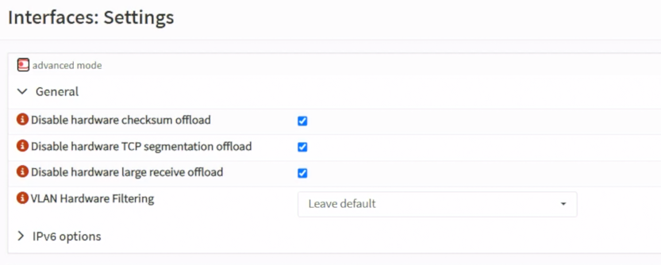
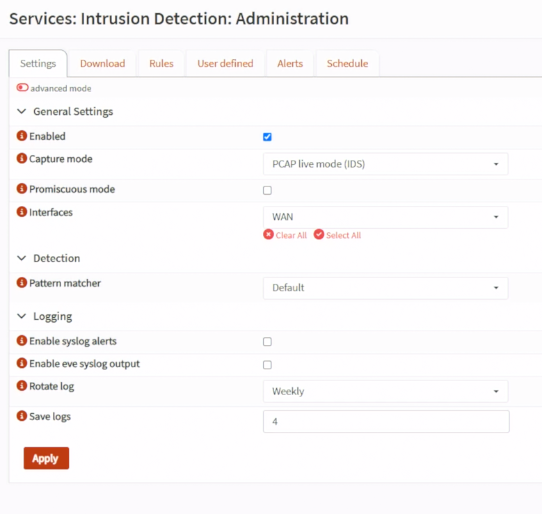
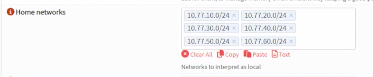
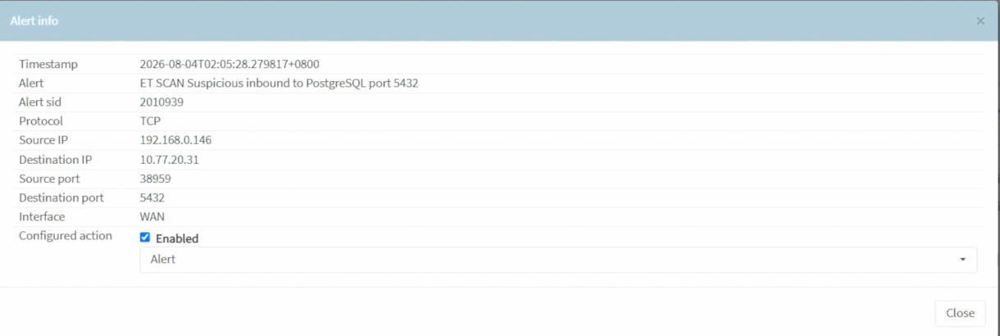
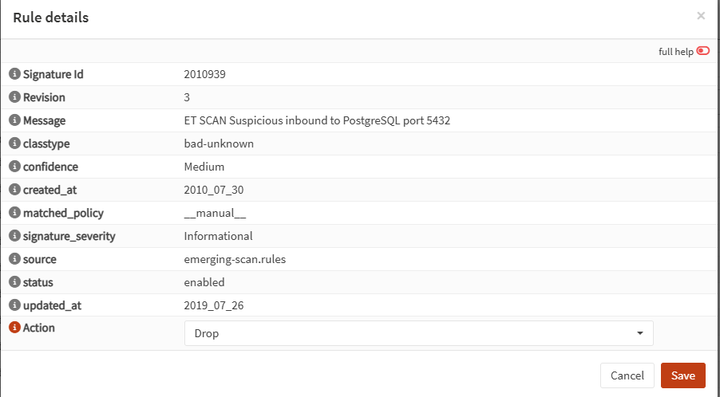
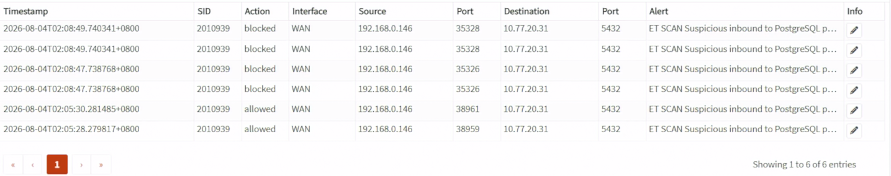

# Day 18｜在網路邊界發現並阻擋威脅：OPNsense Suricata IDS／IPS 的運作與實測

對應文章：[Day 18｜在網路邊界發現並阻擋威脅：OPNsense Suricata IDS／IPS 的運作與實測](https://ithelp.ithome.com.tw/users/20183351/ironman/9461)

本日先用 IDS Alert Mode 確認介面與規則，再切換 IPS。不要直接在唯一 WAN 管理路徑啟用阻擋模式。

## 1. 增加 fw01 記憶體與建立快照

確認 VM 110 至少 3GB RAM。啟用大量 Ruleset 前觀察實際用量；若 Suricata 發生 OOM，先增加到 4GB，而不是刪除所有安全規則。

變更前：

1. 下載最新 `config.xml`。
2. 在 PVE 建立短期 Snapshot `before-suricata`。
3. 保持 PVE Console 與 SSH Tunnel 可用。

Snapshot 只用於短期回復，不取代設定備份。

## 2. 關閉 Hardware Offloading

到 `Interfaces → Settings`，將以下三個以 `Disable` 開頭的選項全部勾選：

```text
Disable hardware checksum offload
Disable hardware TCP segmentation offload
Disable hardware large receive offload
```

這三個欄位是負向命名，因此「勾選」代表停用 Offloading，不是啟用它。Save／Apply，依畫面提示重新啟動。虛擬化環境若保留 Offloading，Packet Capture 與 IPS 可能看到不完整或錯誤的封包狀態。



*圖（一）停用 OPNsense 的 Hardware Offloading。*

## 3. 啟用 IDS Alert Mode

到 `Services → Intrusion Detection → Administration → Settings`：

1. 勾選 Enabled。
2. Capture mode 選 `PCAP live mode (IDS)`。新版介面不再提供獨立的 IPS Mode 核取方塊；這個模式只產生 Alert，不會丟棄封包。
3. Promiscuous Mode 依介面需求保留預設。
4. Interfaces 先選 WAN；要觀察跨 VLAN 流量時再加入承載 VLAN 的 Parent／對應介面。
5. Home Networks 預設會帶入 `192.168.0.0/16`、`10.0.0.0/8`、`172.16.0.0/12`。這三筆是完整 RFC1918 私有位址範圍，而 `10.0.0.0/8` 已經包含所有 `10.77.x.x`，因此不要在預設值後面重複追加 Lab 網段。
6. 本系列要讓 HOME_NET 精確代表 OPNsense 後方受保護的網路，因此移除上述三筆預設值，改為逐筆加入 `10.77.10.0/24`、`10.77.20.0/24`、`10.77.30.0/24`、`10.77.40.0/24`、`10.77.50.0/24`、`10.77.60.0/24`。不要加入模擬 WAN `192.168.0.0/24`、Ceph `10.77.70.0/24` 或 Corosync `10.77.80.0/24`。
7. Save／Apply。



*圖（二）啟用 IDS Alert Mode 並選擇監看介面。*



*圖（三）將 HOME_NET 限定為本 Lab 受保護網段。*

## 4. 下載與啟用 Ruleset

到 `Download` 頁面：

1. 選取完整來源 `ET open/emerging.rules`，按 Download／Update Rules。Download 頁面負責下載整包 ET Open，不是在這一頁逐一挑選 Scan、Policy 等分類。
2. 下載完成後進入 `Services` → `Intrusion Detection` → `Administration` → `Rules`。
3. 搜尋 SID `2010939`，找到 `ET SCAN Suspicious inbound to PostgreSQL port 5432`。
4. 按該規則右側的 Edit 鉛筆圖示，勾選 `Enabled`，將 `Action` 設為 `Alert`，再按 `Save`。
5. 回到 Rules 頁面按 `Apply`，重新搜尋 SID `2010939`，確認規則已經 Enabled，而且 Action 是 Alert。

這裡操作的是下載規則的單條手動覆寫，不要進入 `Administration` → `User defined`。User defined 的 Source IP、Destination IP、SSL/Fingerprint、Bypass 等欄位用來建立新的自訂規則，不能用來啟用既有的 ET Open 規則。

### 4.1 可選：改用 Policy 管理整個 Scan 分類

若希望一次管理 `emerging-scan` 裡的一批規則，可以用 Policy 取代前面的單條 Edit。兩種方法擇一使用；本日預設仍採用 SID `2010939` 的單條手動覆寫。

1. 進入 `Services` → `Intrusion Detection` → `Policy` → `Policies`，按 `Add`。
2. 依序設定：

| 欄位 | 設定值 | 作用 |
|---|---|---|
| Enabled | 勾選 | 啟用這筆 Policy |
| Priority | `10` | 數字越低越優先；從 `10` 開始可替日後更高優先的 Policy 保留較小編號 |
| Rulesets | `ET open/emerging-scan.rules` | 只比對 Scan 分類；不同版本可能省略 `.rules` |
| Action | `Disabled` | 只挑出目前尚未啟用的規則 |
| Rules | 全部留空 | 不再使用產品、部署位置等中繼資料縮小範圍 |
| New action | `Alert` | 將符合條件的規則啟用為只告警 |
| Description | `LAB_ET_ALERT` | 識別這筆 Lab Policy |

3. 按 `Save`，再按頁面上的 `Apply`。
4. 回到 `Administration` → `Rules`，以 `scan` 或 `matched_policy` 篩選，確認符合條件的規則已經 Enabled、Action 是 Alert，套用來源是 `LAB_ET_ALERT`。

這筆 Policy 會處理 `emerging-scan` 中所有符合條件的 Disabled 規則，不只 SID `2010939`。如果先前已對 SID `2010939` 建立手動覆寫，請保留本日預設作法，不要再疊加這筆 Policy；要全面改用 Policy 時，應先到 `Policy` → `Rule adjustments` 移除對應的手動調整，再重新 Apply。

本日只手動啟用 `emerging-scan` 分類中的 SID `2010939`，因為它直接對應接下來送往 PostgreSQL Port 的 Nmap 探測，測試流量可由自己控制、停止與重複。其他分類留到服務存在且有明確觀察目的時再啟用：

- `emerging-scan`：包含連接埠掃描、服務探測與部分 Nmap 行為的偵測規則；本日只啟用其中一條可重現的規則。
- `emerging-policy`：偵測代理工具、異常協定使用方式及可能違反組織政策的流量。它不一定代表入侵，而且較容易產生雜訊，本日不啟用。
- `emerging-dns`：可選分類，用於觀察可疑 DNS 查詢與已知異常行為，本日不啟用。
- `emerging-web_server`：為後續 Nginx／應用服務提供 Web Server 攻擊與異常請求的偵測規則；Day 18 先下載，等對應服務與流量存在後再展示命中結果。
- `emerging-malware`：如果目前版本有顯示，可用來偵測已知惡意軟體與部分 C2 通訊；沒有顯示就略過。正常 Lab 不應為了命中它而下載或執行真正惡意程式。

本日暫時不要啟用整套 `dos`、`exploit`、`current_events`、`p2p`、`games`、`voip`、`mobile_malware` 或所有 ET Open 規則。它們不是全部沒有價值，而是與目前 Lab 服務不一定相關；一次啟用過多會增加記憶體用量、告警雜訊與誤判排查工作，也不利於解釋是哪一類規則產生結果。

Ruleset 是規則來源；規則的 Enabled 狀態與 Action 可以由 Policy 批次管理，也可以在 Rules 頁面手動覆寫。OPNsense 官方建議大量或長期管理時使用 Policy，因為它能按照 Ruleset、既有 Action 與規則中繼資料批次套用設定。本日只驗證一條規則，因此直接在 Rules 頁面手動覆寫；第 6 節也只把同一條已命中的 Signature 改為 Drop，不把整個 `emerging-scan` 或其他分類一次全部切成 Drop。

Policy 位於 `Services` → `Intrusion Detection` → `Policy`，不是 `Administration` 裡的分頁。本日預設不建立 Policy，避免為了單一 SID 改動整個 Scan 分類；需要示範批次管理時，可以改做 4.1 節，但不要和單條手動覆寫混在一起。

記錄 Ruleset 更新時間與啟用數量。

## 5. 產生受控測試流量

Day 18 尚未建立 Day 25 的 proxy01 `10.77.20.21`，因此本日改用 Day 16 已建立的 app01 `10.77.20.31` 當作受控目標。

### 5.1 先確認 PVE L0 的封包會經過 fw01

在 PVE L0 執行：

```bash
ip route get 10.77.20.31
```

如果結果顯示 `via 192.168.0.1`，代表封包被送往原本的家用路由器，根本沒有經過 fw01，因此 Suricata 不可能看到。加入只針對本次測試目標的暫時 Route：

```bash
ip route replace 10.77.20.31/32 via 192.168.0.84 dev vmbr0
ip route get 10.77.20.31
```

第二次結果必須顯示 `via 192.168.0.84 dev vmbr0`。`192.168.0.84` 是目前 fw01 的 WAN 位址；若 `Interfaces` → `Overview` 顯示的 fw01 WAN 已改變，這裡也要使用實際位址。

### 5.2 用 Packet Capture 證明路徑

到 OPNsense `Interfaces` → `Diagnostics` → `Packet Capture`：

1. Interface 選 `WAN`。
2. Address Family 選 `IPv4`。
3. Protocol 選 `TCP`。
4. Host Address 填 PVE L0 `192.168.0.146`。
5. Count 填 `100`，開始 Capture。

回 PVE L0 執行：

```bash
sudo apt update
sudo apt install -y nmap
sudo nmap -sS -Pn -p 22,80,443,5432 10.77.20.31
```

停止 Capture 並檢視結果。必須看到來源 `192.168.0.146`、目的 `10.77.20.31` 的 TCP SYN；若完全沒有封包，先處理 Route，不要繼續修改 IDS Ruleset。

### 5.3 核對 ET Open Alert

到 `Services` → `Intrusion Detection` → `Administration` → `Alerts`，依來源 `192.168.0.146`、目的 `10.77.20.31` 或 SID `2010939` 過濾。本次實測命中結果為：

```text
Interface：WAN
Action：allowed
Source：192.168.0.146
Destination：10.77.20.31
Destination Port：5432
SID：2010939
Signature：ET SCAN Suspicious inbound to PostgreSQL port 5432
```

`allowed` 是正常結果，因為目前 Capture mode 是 `PCAP live mode (IDS)`，只告警而不丟棄封包。既然 ET Open 已經穩定命中 SID `2010939`，本系列不需要另外建立 User defined 測試規則。



*圖（四）Alert 詳細資料顯示 SID `2010939`、測試來源與目的，設定動作為 Alert。*

若仍沒有 Alert：

1. 確認流量真的經過所選介面。
2. 確認 Intrusion Detection 狀態是 Running，而且 Capture mode 是 `PCAP live mode (IDS)`。
3. 到 Rules 搜尋 SID `2010939`，確認它已由手動覆寫設為 Enabled／Alert。
4. 清除 Alerts 頁面的時間、Action 或 Ruleset 篩選後重新整理。
5. 不要靠重複掃描外部網站測試。

## 6. 切換 IPS

確認 Alert Mode 正常後：

1. 到 `Services` → `Intrusion Detection` → `Administration` → `Rules` 搜尋 SID `2010939`，按 Edit，只將這一條已驗證的 ET 規則 Action 由 Alert 改成 Drop，再按 Save 與 Apply。不要把整個 `emerging-scan` 設成 Drop。
2. 回到 Settings，將 Capture mode 從 `PCAP live mode (IDS)` 改成 `Netmap (IPS)`。本 Lab 不選 `Divert (IPS)`；Divert 模式還必須另外建立帶有 Divert-to 的新版 Firewall Rule。
3. Apply 後重做同一項測試。
4. 在 Alerts 確認 SID `2010939` 的 Action 從 `allowed` 變成 `blocked`／`drop`。由於 WAN Firewall 本來就會拒絕未授權的連線，Nmap 結果可能前後相同；本次以 Suricata Alert Action 的變化作為 IPS 已執行 Drop 的主要證據。



*圖（五）單條規則 `2010939` 的 Action 設為 Drop。*



*圖（六）相同 SID 的紀錄先顯示 `allowed`，切換 Netmap 與 Drop 後顯示 `blocked`。*

如果管理連線中斷，從 PVE Console 停用 Intrusion Detection 或還原設定，不在失聯狀態盲目修改更多規則。

測試完成後可在 PVE L0 移除本次暫時 Route：

```bash
sudo ip route del 10.77.20.31/32
```
