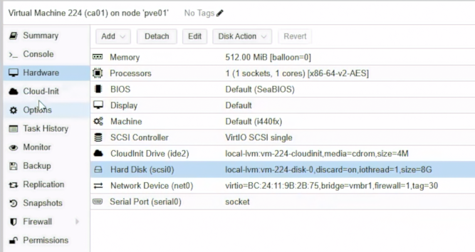
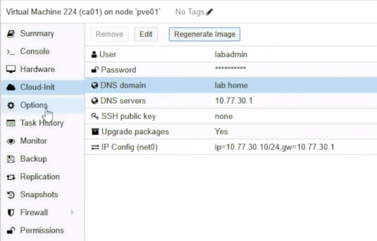
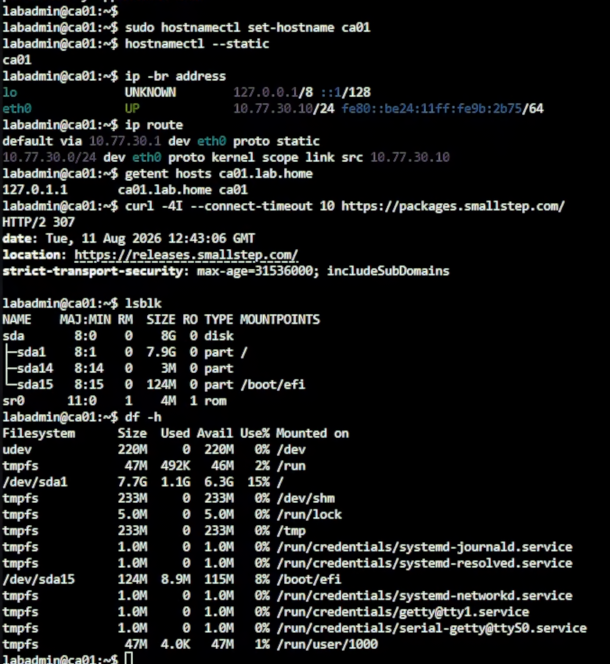
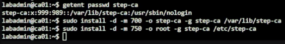
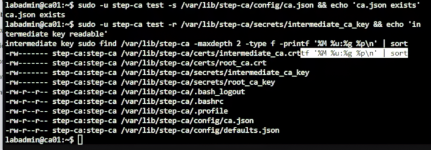
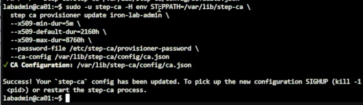
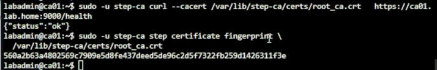
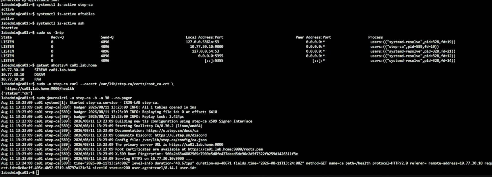

# Day 19｜從金鑰到信任鏈：使用 step-ca 為 PostgreSQL HA 建立專用內部 CA

對應文章：[Day 19｜從金鑰到信任鏈：使用 step-ca 為 PostgreSQL HA 建立專用內部 CA](https://ithelp.ithome.com.tw/users/20183351/ironman/9461)

本日建立 `ca01`、初始化 `step-ca`、完成 nftables Host Firewall，最後簽發一張暫時 Certificate 驗證信任鏈。
## 完成後的狀態

- ca01 位於 pve01，VMID `224`。
- 1 vCPU、512 MiB RAM、8 GiB `local-lvm`，不使用 Ceph。
- NIC 接 pve01 的 `vmbr1`，VLAN Tag `30`。
- IP `10.77.30.10/24`，Gateway 與 DNS 都是 `10.77.30.1`。
- `step-ca` 只監聽 `10.77.30.10:9000`。
- ca01 nftables 只允許未來的 pg01～pg03 連入 TCP 9000。
- 網路 SSH 關閉，後續只從 PVE Console 管理。

## 0. 開始前確認

操作位置：PVE Web UI。

1. 登入 PVE Cluster 任一節點的 Web UI。
2. 左側確認 `pve01` 為 Online。
3. 選 `pve01` → `local-lvm` → `Summary`，確認至少還有 8 GiB 可用空間。
4. 確認 Day 06 的 Debian 13 Cloud Image Template 可以在 pve01 建立 Full Clone。
5. 確認 VLAN 30 的 Gateway `10.77.30.1` 已能提供 DNS 與對外 HTTPS。

## 1. 建立 ca01 VM

操作位置：PVE Web UI。

1. 左側選 Day 06 的 Debian Template。
2. 右上角按 `More` → `Clone`。
3. `Target Node` 選 `pve01`。
4. `VM ID` 填 `224`。
5. `Name` 填 `ca01`。
6. `Mode` 選 `Full Clone`。
7. `Target Storage` 選 `local-lvm`。
8. 按 `Clone`，等待 Task 顯示 `OK`。
9. 左側選 VM 224 `ca01` → `Hardware`。
10. 選 `Processors` → `Edit`，Sockets 填 `1`、Cores 填 `1`，CPU Type 沿用 Template 的相容模式，按 `OK`。
11. 選 `Memory` → `Edit`，Memory 填 `512 MiB`，取消 Ballooning，按 `OK`。
12. 選 `Hard Disk (scsi0)` → `Disk Action` → `Resize`。
13. 若目前磁碟小於 8 GiB，只輸入需要增加的容量，讓最後容量至少為 8 GiB；不要把 `8` 當成最終大小直接重複增加。
14. 選 `Network Device (net0)` → `Edit`。
15. Bridge 選 `vmbr1`、Model 選 `VirtIO`、VLAN Tag 填 `30`、Firewall 保持勾選，按 `OK`。
16. 選 `Cloud-Init`。
17. `User` 使用目前 Template 已驗證可登入的 `labadmin`。
18. `Password` 使用本 Lab 的暫時密碼；不要在畫面或文件中顯示實際內容。
19. `IP Config (net0)` 按 `Edit`，IPv4 選 `Static`。
20. IPv4/CIDR 填 `10.77.30.10/24`，Gateway 填 `10.77.30.1`，按 `OK`。
21. `DNS domain` 填 `lab.home`，`DNS servers` 填 `10.77.30.1`。
22. 按 `Regenerate Image`，等待 Task 顯示 `OK`。
23. 到 `Options` → `Start at boot` → `Edit`，勾選後按 `OK`。
24. 按 `Start`，再開啟 `Console`。



圖（一）VM 224 `ca01` 的硬體配置與接在 `vmbr1`、標記 VLAN 30 的網卡。



圖（二）Cloud-Init 設定 `labadmin`、`lab.home`、DNS `10.77.30.1` 與靜態 IP `10.77.30.10/24`。

在 ca01 Console 登入後執行：

```bash
sudo hostnamectl set-hostname ca01
hostnamectl --static
ip -br address
ip route
getent hosts ca01.lab.home
curl -4I --connect-timeout 10 https://packages.smallstep.com/
lsblk
df -h /
```



圖（三）初次檢查時，`ca01.lab.home` 尚解析成 `127.0.1.1`；接下來修正 Cloud-Init 的 hosts Template。

`getent hosts ca01.lab.home` 必須解析為 `10.77.30.10`。若沒有結果，或錯誤解析為 `127.0.1.1`，代表 Cloud-Init 產生的 `/etc/hosts` 把 FQDN 指向 Loopback Address。

Proxmox 的 NoCloud User Data 會在開機時設定 `manage_etc_hosts: true`，它可能覆蓋 Guest OS 內 `cloud.cfg.d` 的設定。因此不要只修改 `/etc/hosts`，也不要只新增 `manage_etc_hosts: false`；本 Lab 直接修改 Cloud-Init 使用的 Debian hosts Template。

先備份並開啟 Template：

```bash
sudo cp -a /etc/cloud/templates/hosts.debian.tmpl \
  /etc/cloud/templates/hosts.debian.tmpl.before-ca01
sudo nano /etc/cloud/templates/hosts.debian.tmpl
```

找到：

```text
127.0.1.1 {{fqdn}} {{hostname}}
```

改成：

```text
10.77.30.10 {{fqdn}} {{hostname}}
```

保留 Template 內其他 IPv4 與 IPv6 內容，按 `Ctrl+O`、Enter、`Ctrl+X`。

接著同步修正目前正在使用的檔案：

```bash
sudo nano /etc/hosts
```

保留 `127.0.0.1 localhost` 與原有 IPv6 內容，把：

```text
127.0.1.1 ca01.lab.home ca01
```

改成：

```text
10.77.30.10 ca01.lab.home ca01
```

在 Nano 按 `Ctrl+O`、Enter 儲存，再按 `Ctrl+X` 離開。

重新驗證：

```bash
getent ahostsv4 ca01.lab.home
```

結果中使用的 IPv4 必須是 `10.77.30.10`，不能是 `127.0.1.1`。第 10 節重新開機後 Cloud-Init 會依照修改過的 Template 重建 `/etc/hosts`，屆時還會再次執行這項檢查。

## 2. 安裝 step CLI、step-ca 與 nftables

操作位置：PVE Web UI → VM 224 `ca01` → `Console`，不是 pve01 的 Shell。

逐行執行：

```bash
sudo apt update
sudo apt install -y --no-install-recommends curl gpg ca-certificates nftables
sudo install -d -m 0755 /etc/apt/keyrings
sudo curl -fsSL https://packages.smallstep.com/keys/apt/repo-signing-key.gpg \
  -o /etc/apt/keyrings/smallstep.asc
sudo nano /etc/apt/sources.list.d/smallstep.sources
```

填入：

```text
Types: deb
URIs: https://packages.smallstep.com/stable/debian
Suites: debs
Components: main
Signed-By: /etc/apt/keyrings/smallstep.asc
```

按 `Ctrl+O`、Enter、`Ctrl+X`，再執行：

```bash
sudo apt update
apt-cache policy step-cli step-ca
sudo apt install -y step-cli step-ca
step version
step-ca version
```

`apt-cache policy` 必須能看到 Candidate。若沒有 Candidate，不要改用不明來源 Binary，先檢查剛建立的 `.sources` 內容與 `apt update` 錯誤。

## 3. 建立 step-ca Service Account 與密碼檔

操作位置：PVE Web UI → VM 224 `ca01` → `Console`，不是 pve01 的 Shell。

建立：

```bash
sudo useradd --system --create-home \
  --home-dir /var/lib/step-ca \
  --shell /usr/sbin/nologin step-ca
```

確認是否已建立 `step-ca` Account：

```bash
getent passwd step-ca
```

建立目錄：

```bash
sudo install -d -m 700 -o step-ca -g step-ca /var/lib/step-ca
sudo install -d -m 750 -o root -g step-ca /etc/step-ca
```



圖（四）建立 `step-ca` 系統帳號，以及 CA 資料與設定目錄。

### 3.1 建立 CA Key Password File

```bash
sudo install -m 640 -o root -g step-ca /dev/null /etc/step-ca/password
sudo nano /etc/step-ca/password
```

在空白檔案只輸入一行「實際 CA Key Password」。不要加入引號、`PASSWORD=`、註解或前後空白。這個密碼不可為空。

按 `Ctrl+O`、Enter、`Ctrl+X`。

### 3.2 建立 Provisioner Password File

```bash
sudo install -m 600 -o step-ca -g step-ca /dev/null /etc/step-ca/provisioner-password
sudo -u step-ca nano /etc/step-ca/provisioner-password
```

輸入另一組非空 Password，只放一行。它是 `iron-lab-admin` Provisioner 用來簽發 Certificate 的密碼，不是 CA Key Password。

按 `Ctrl+O`、Enter、`Ctrl+X`。

只檢查檔案存在與大小，不顯示內容：

```bash
sudo test -s /etc/step-ca/password && echo 'CA key password file: non-empty'
sudo test -s /etc/step-ca/provisioner-password && echo 'Provisioner password file: non-empty'
sudo stat -c '%U %G %a %s %n' \
  /etc/step-ca/password \
  /etc/step-ca/provisioner-password
```

兩個 `test -s` 都必須輸出 `non-empty`。若沒有輸出就停止，不要執行初始化，也不要執行 `cat` 顯示密碼。

## 4. 初始化 Internal CA

操作位置：PVE Web UI → VM 224 `ca01` → `Console`，不是 pve01 的 Shell。

第一次初始化執行：

```bash
sudo -u step-ca -H env STEPPATH=/var/lib/step-ca \
  step ca init \
  --name 'IRON-LAB Internal CA' \
  --deployment-type standalone \
  --dns ca01.lab.home \
  --address 10.77.30.10:9000 \
  --provisioner iron-lab-admin \
  --password-file /etc/step-ca/password \
  --provisioner-password-file /etc/step-ca/provisioner-password
```

完成後立刻檢查，不要先建立 systemd Service：

```bash
sudo -u step-ca test -s /var/lib/step-ca/config/ca.json && echo 'ca.json exists'
sudo -u step-ca test -r /var/lib/step-ca/secrets/intermediate_ca_key && echo 'intermediate key readable'
sudo find /var/lib/step-ca -maxdepth 2 -type f -printf '%M %u:%g %p\n' | sort
```



圖（五）確認 `ca.json`、根憑證、中繼憑證與對應金鑰已建立。

至少要看見：

```text
/var/lib/step-ca/config/ca.json
/var/lib/step-ca/certs/root_ca.crt
/var/lib/step-ca/certs/intermediate_ca.crt
/var/lib/step-ca/secrets/root_ca_key
/var/lib/step-ca/secrets/intermediate_ca_key
```

若 `ca.json exists` 沒有出現，停止。不要執行 `systemctl enable --now step-ca`，因為 Service 不會自行建立缺少的 CA 設定。

## 5. 調整 Lab Certificate 有效期

操作位置：PVE Web UI → VM 224 `ca01` → `Console`，不是 pve01 的 Shell。

本系列使用 90 天預設有效期，避免尚未完成 Renewal 前隔天過期：

```bash
sudo -u step-ca -H env STEPPATH=/var/lib/step-ca \
  step ca provisioner update iron-lab-admin \
  --x509-min-dur=5m \
  --x509-default-dur=2160h \
  --x509-max-dur=8760h \
  --password-file /etc/step-ca/provisioner-password \
  --ca-config /var/lib/step-ca/config/ca.json
```



圖（六）將 `iron-lab-admin` 的最短、預設與最長憑證有效期寫入尚未啟動的 CA 設定。

這個 `update` 是直接修改尚未啟動的 `ca.json`。`step ca provisioner list` 是查詢運作中 CA 的線上指令，不支援 `--ca-config`；等第 6 節啟動 step-ca 後再查詢。

## 6. 建立 systemd Service

操作位置：PVE Web UI → VM 224 `ca01` → `Console`，不是 pve01 的 Shell。

```bash
sudo nano /etc/systemd/system/step-ca.service
```

填入：

```ini
[Unit]
Description=IRON-LAB step-ca
After=network-online.target
Wants=network-online.target

[Service]
Type=simple
User=step-ca
Group=step-ca
Environment=STEPPATH=/var/lib/step-ca
ExecStart=/usr/bin/step-ca /var/lib/step-ca/config/ca.json --password-file /etc/step-ca/password
Restart=on-failure
RestartSec=5s
NoNewPrivileges=true
PrivateTmp=true
ProtectSystem=strict
ReadWritePaths=/var/lib/step-ca
ProtectHome=true

[Install]
WantedBy=multi-user.target
```

按 `Ctrl+O`、Enter、`Ctrl+X`，再依序執行：

```bash
sudo chown -R step-ca:step-ca /var/lib/step-ca
sudo systemd-analyze verify /etc/systemd/system/step-ca.service
sudo systemctl daemon-reload
sudo systemctl enable --now step-ca
sleep 2
sudo systemctl is-active step-ca
sudo systemctl status step-ca -l --no-pager
sudo journalctl -u step-ca -b -n 30 --no-pager
sudo ss -lntp | grep ':9000'
```

`systemctl status` 剛好顯示 Active 不足以判斷成功，所以要等待兩秒後再查 `is-active`、Journal 與 Listener。

服務確定正常後，再透過 CA API 列出 Provisioner：

```bash
sudo -u step-ca -H env STEPPATH=/var/lib/step-ca \
  step ca provisioner list \
  --ca-url https://ca01.lab.home:9000 \
  --root /var/lib/step-ca/certs/root_ca.crt | \
  grep -E '"(type|name|minTLSCertDuration|maxTLSCertDuration|defaultTLSCertDuration)"'
```

輸出必須包含 `iron-lab-admin`、JWK 與設定的三組有效期。不直接錄下完整 JSON，避免將 `encryptedKey` 放進影片或公開文件。

健康檢查：

```bash
sudo -u step-ca curl --cacert /var/lib/step-ca/certs/root_ca.crt \
  https://ca01.lab.home:9000/health
sudo -u step-ca step certificate fingerprint \
  /var/lib/step-ca/certs/root_ca.crt
```



圖（七）`/health` 回傳 `{"status":"ok"}`，並顯示根憑證的 SHA256 Fingerprint。

保存 SHA256 Fingerprint，但不要保存任何 Password。Day 20 三台 PG Bootstrap 時要使用同一個 Fingerprint。

## 7. 建立 ca01 Host Firewall

操作位置：PVE Web UI → VM 224 `ca01` → `Console`，不是 pve01 的 Shell。

```bash
sudo nano /etc/nftables.conf
```

填入：

```nftables
#!/usr/sbin/nft -f

flush ruleset

table inet filter {
  chain input {
    type filter hook input priority filter; policy drop;
    iifname "lo" accept
    ct state established,related accept
    ip saddr { 10.77.30.11, 10.77.30.12, 10.77.30.13 } tcp dport 9000 accept
  }

  chain forward {
    type filter hook forward priority filter; policy drop;
  }

  chain output {
    type filter hook output priority filter; policy drop;
    oifname "lo" accept
    ct state established,related accept
    ip daddr 10.77.30.1 udp dport { 53, 123 } accept
    ip daddr 10.77.30.1 tcp dport 53 accept
    tcp dport 443 accept
  }
}
```

按 `Ctrl+O`、Enter、`Ctrl+X`。先檢查語法，再啟用：

```bash
sudo nft --check --file /etc/nftables.conf
sudo systemctl enable --now nftables
sudo nft list ruleset
sudo -u step-ca curl --cacert /var/lib/step-ca/certs/root_ca.crt \
  https://ca01.lab.home:9000/health
```

Health Check 必須在啟用 nftables 後仍成功。

Day 20 建立 pg01～03 後，還要分別從三台測試 TCP 9000，確認 nftables 允許的來源可以到達 ca01。

## 8. 簽發暫時測試 Certificate

操作位置：PVE Web UI → VM 224 `ca01` → `Console`，不是 pve01 的 Shell。

建立暫存目錄：

```bash
sudo -u step-ca install -d -m 700 /var/lib/step-ca/tmp-test
```

簽發只供本日檢查的 Certificate：

```bash
sudo -u step-ca -H env STEPPATH=/var/lib/step-ca \
  step ca certificate test.lab.home \
  /var/lib/step-ca/tmp-test/test.crt \
  /var/lib/step-ca/tmp-test/test.key \
  --ca-url https://ca01.lab.home:9000 \
  --root /var/lib/step-ca/certs/root_ca.crt \
  --provisioner iron-lab-admin \
  --provisioner-password-file /etc/step-ca/provisioner-password \
  --san test.lab.home \
  --not-after=10m
```

驗證：

```bash
sudo -u step-ca step certificate verify \
  /var/lib/step-ca/tmp-test/test.crt \
  --roots /var/lib/step-ca/certs/root_ca.crt
sudo -u step-ca step certificate inspect \
  /var/lib/step-ca/tmp-test/test.crt --short
sudo -u step-ca openssl x509 \
  -in /var/lib/step-ca/tmp-test/test.crt \
  -noout -subject -issuer -dates -ext subjectAltName
```

確認 Subject、Issuer、有效期與 SAN 後刪除暫時測試檔。這是本日明確要求移除的可重建測試資料：

```bash
sudo rm -f \
  /var/lib/step-ca/tmp-test/test.crt \
  /var/lib/step-ca/tmp-test/test.key
sudo rmdir /var/lib/step-ca/tmp-test
```

## 9. 關閉 ca01 網路 SSH

操作位置：PVE Web UI → VM 224 `ca01` → `Console`，不是 pve01 的 Shell。

先確認 PVE Console 仍可操作，再執行：

```bash
sudo systemctl disable --now ssh
sudo systemctl is-enabled ssh
sudo systemctl is-active ssh
sudo ss -lntp
```

預期 SSH 顯示 Disabled／Inactive，Listener 只保留必要服務，其中 step-ca 為 TCP 9000。

## 10. 重新開機驗證

操作位置：先在 PVE Web UI → VM 224 `ca01` → `Console` 執行重開機，再使用 PVE Web UI 觀察 VM 狀態。

```bash
sudo reboot
```

等待 Console 回到 Login Prompt，再登入並執行：

```bash
systemctl is-active step-ca
systemctl is-active nftables
systemctl is-active ssh
sudo ss -lntp
getent ahostsv4 ca01.lab.home
sudo -u step-ca curl --cacert /var/lib/step-ca/certs/root_ca.crt \
  https://ca01.lab.home:9000/health
sudo journalctl -u step-ca -b -n 30 --no-pager
```



圖（八）重新開機後，確認 `step-ca`、`nftables`、TCP 9000、名稱解析與 `/health` 均正常。

重新開機後 `ca01.lab.home` 仍必須解析為 `10.77.30.10`，接著 `/health` 才應回傳正常結果。

## 參考資料

- [Smallstep｜Getting Started with step-ca](https://smallstep.com/docs/step-ca/getting-started/)
- [Smallstep｜Configuring step-ca](https://smallstep.com/docs/step-ca/configuration/)
- [Smallstep｜step ca init Reference](https://smallstep.com/docs/step-cli/reference/ca/init/)
- [Smallstep｜Certificate Provisioners](https://smallstep.com/docs/step-ca/provisioners/)
