# Day 20｜準備 PostgreSQL HA 的三個資料庫節點：PostgreSQL 18、資料磁碟、TLS 與 SCRAM-SHA-256

對應文章：[Day 20｜準備 PostgreSQL HA 的三個資料庫節點：PostgreSQL 18、資料磁碟、TLS 與 SCRAM-SHA-256](https://ithelp.ithome.com.tw/users/20183351/ironman/9461)

本日建立 pg01～pg03，逐台完成 Data Disk、PGDG Repository、PostgreSQL 18、名稱解析與 TLS，形成三台可獨立驗收的資料庫節點。

## 本日操作原則

- 每一節都會標示操作位置。
- 寫「三台逐台執行」時，先完整做完 pg01，再做 pg02、pg03。
- 不要把三段磁碟格式化指令同時貼到三個 Console。
- 指令中的 `/dev/sdb` 只有在 `lsblk` 驗證它是 16 GiB 空白 Data Disk 後才能使用。
- Private Key 必須在目前 PG Node 本機產生，不經 ca01 或 jump01 複製。

## 1. 建立 pg01

操作位置：PVE Web UI。

1. 左側選 Day 06 的 Debian 13 Template。
2. 右上角按 `More` → `Clone`。
3. `Target Node` 選 `pve01`。
4. `VM ID` 填 `221`。
5. `Name` 填 `pg01`。
6. `Mode` 選 `Full Clone`。
7. `Target Storage` 選 pve01 的 `local-lvm`。
8. 按 `Clone`，等待 Task 顯示 `OK`。
9. 選 VM 221 → `Hardware` → `Processors` → `Edit`。
10. Sockets 填 `1`、Cores 填 `2`，CPU Type 使用目前已驗證可 Migration 的相容模式，按 `OK`。
11. 選 `Memory` → `Edit`，Memory 填 `2048 MiB`，取消 Ballooning，按 `OK`。
12. 選 System Disk → `Disk Action` → `Resize`。
13. 讓 System Disk 最終至少為 24 GiB；Resize 欄位填的是增加量，不是最終容量。
14. 選 `Network Device (net0)` → `Edit`。
15. Bridge 選 `vmbr1`、VLAN Tag 填 `30`、Model 選 `VirtIO`、Firewall 勾選，按 `OK`。
16. 選 `Cloud-Init`。
17. User 使用 `labadmin`，Password 使用本次 Lab 管理密碼。
18. `IP Config (net0)` → `Edit`，IPv4 選 `Static`。
19. IPv4/CIDR 填 `10.77.30.11/24`，Gateway 填 `10.77.30.1`，按 `OK`。
20. DNS Domain 填 `lab.home`，DNS Server 填 `10.77.30.1`。
21. 按 `Regenerate Image`。
22. 到 `Hardware` → `Add` → `Hard Disk`。
23. Bus／Device 選 `SCSI`，Storage 選 pve01 的 `local-lvm`，Disk size 填 `16 GiB`。
24. 勾選 `Discard` 與 `IO thread`，按 `Add`。
25. 到 `Options` → `Start at boot` → `Edit`，勾選後按 `OK`。
26. 按 `Start`，開啟 `Console`。

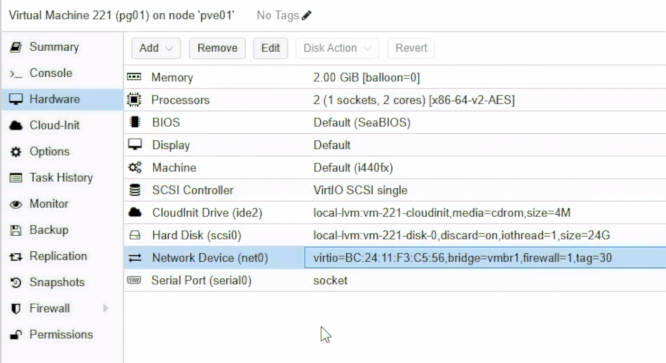

圖（一）pg01 使用 2 vCPU、2 GiB 記憶體與 24 GiB 系統磁碟，網卡連接 `vmbr1` 並標記 VLAN 30。

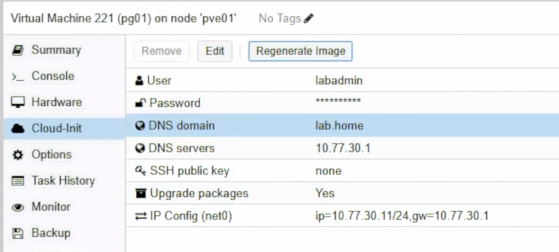

圖（二）Cloud-Init 設定 `labadmin`、`lab.home`、DNS `10.77.30.1` 與靜態 IP `10.77.30.11/24`。

## 2. 建立 pg02 與 pg03

操作位置：PVE Web UI。

按照第 1 節完整重複兩次，只替換以下值：

- pg02：Target Node `pve02`、VMID `222`、Name `pg02`、IP `10.77.30.12/24`。
- pg03：Target Node `pve03`、VMID `223`、Name `pg03`、IP `10.77.30.13/24`。

每台都必須有：

- 2 vCPU、2048 MiB RAM。
- 至少 24 GiB System Disk。
- 16 GiB SCSI Data Disk。
- `vmbr1`、VLAN Tag 30、VirtIO、Firewall Enabled。
- Gateway／DNS `10.77.30.1`。
- System Disk 與 16 GiB Data Disk 都使用目前節點的 `local-lvm`。

三台開機後各自在 Console 執行：

```bash
hostnamectl --static
ip -br address
ip route
lsblk
curl -4I --connect-timeout 10 https://apt.postgresql.org/
```

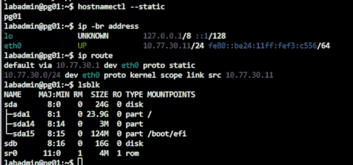

圖（三）pg01 已套用主機名稱、`10.77.30.11/24`、預設閘道與 24 GiB 系統磁碟，16 GiB 資料磁碟此時尚未建立檔案系統。

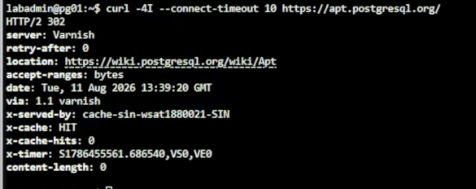

圖（四）`apt.postgresql.org` 回傳 HTTP 302 重新導向，確認 pg01 可以連到 PostgreSQL Apt 軟體庫入口。

如果 Hostname 仍是 Template 名稱，分別執行：

```bash
sudo hostnamectl set-hostname pg01
```

pg02、pg03 改成自己的名稱，重新登入 Console 後再確認。

## 3. 三台先完成時間同步

操作位置：pg01、pg02、pg03 Console。三台都要完成，不能只在 pg01 執行。

PostgreSQL 的 Log、TLS Certificate 有效期，以及後續 etcd 的 Raft Election 和 Patroni Leader Lock 都需要一致的時間。三台 PG VM 建立後，先把 Chrony 當作共同基線完成。

先在 pg01 執行：

```bash
sudo timedatectl set-timezone Asia/Taipei
sudo apt update
sudo apt install -y chrony
echo 'server 10.77.30.1 iburst prefer' | \
  sudo tee /etc/chrony/sources.d/opnsense.sources
sudo systemctl enable --now chrony
sudo systemctl restart chrony
sudo chronyc makestep
chronyc waitsync 30 0.1
systemctl is-enabled chrony
systemctl is-active chrony
chronyc tracking
chronyc sources -n -v
timedatectl
```

完成後，在 pg02、pg03 逐台執行完全相同的指令。

`10.77.30.1` 是 Database VLAN 上的 OPNsense Gateway。三台使用相同的內部時間來源，不依賴各自能否直接連到公用 NTP。新增 `opnsense.sources` 不需要刪除套件原有的來源；`prefer` 只表示可用時優先選擇 OPNsense。

檢查結果必須符合：

- `systemctl is-enabled chrony` 顯示 `enabled`。
- `systemctl is-active chrony` 顯示 `active`。
- `chronyc tracking` 的 `Leap status` 顯示 `Normal`。
- `chronyc sources -n -v` 中，`10.77.30.1` 所在列以 `^*` 開頭，確認目前選用 OPNsense 同步。
- `timedatectl` 顯示 `Time zone: Asia/Taipei` 與 `System clock synchronized: yes`。

`chronyc waitsync 30 0.1` 最多檢查 30 次，等待系統時間誤差降到 0.1 秒內；成功時可能不會顯示額外訊息。若 `10.77.30.1` 一直未成為 `^*`，先檢查 `LAB_INTERNAL to firewall NTP` 規則，以及 OPNsense 是否對 Database VLAN 提供 NTP，確認同步後再繼續建立服務。

pg01、pg02、pg03 都要實際完成安裝與同步，並逐台以 `chronyc tracking` 與 `chronyc sources -n -v` 驗證結果。

## 4. 初始化 pg01 Data Disk

操作位置：pg01 Console。

先執行：

```bash
sudo lsblk -o NAME,SIZE,TYPE,FSTYPE,MOUNTPOINTS,MODEL
sudo wipefs -n /dev/sdb
```

只有同時符合以下條件才能繼續：

- `/dev/sdb` 容量為 16 GiB。
- Type 為 `disk`。
- FSTYPE 與 MOUNTPOINTS 都是空白。
- `wipefs -n` 沒有顯示既有 Filesystem Signature。

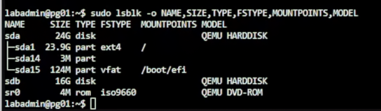

圖（五）格式化前確認 `/dev/sdb` 為 16 GiB 磁碟，FSTYPE 與掛載位置皆為空白。

確認後執行：

```bash
sudo mkfs.ext4 -L pgdata /dev/sdb
sudo mkdir -p /var/lib/postgresql
grep -q '^LABEL=pgdata /var/lib/postgresql ' /etc/fstab || \
  echo 'LABEL=pgdata /var/lib/postgresql ext4 defaults,noatime 0 2' | \
  sudo tee -a /etc/fstab
sudo systemctl daemon-reload
sudo findmnt --verify --verbose
sudo mount -a
findmnt /var/lib/postgresql
df -hT /var/lib/postgresql
```

`findmnt` 必須顯示 `/dev/sdb` 掛載到 `/var/lib/postgresql`，Filesystem 為 ext4。

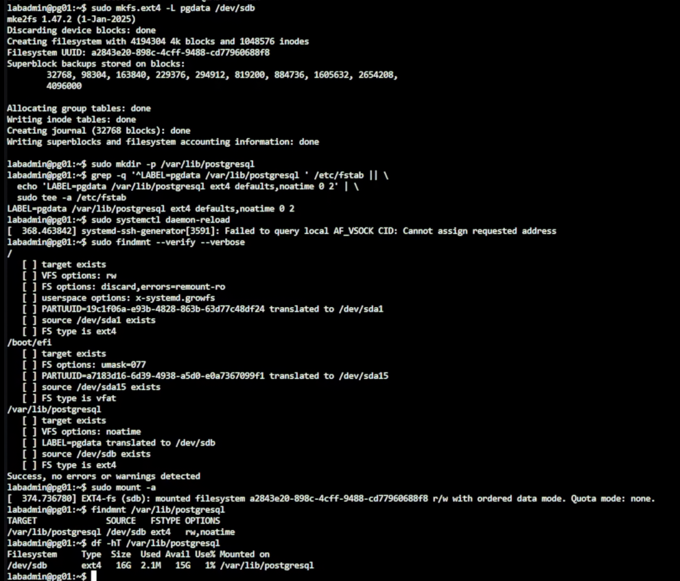

圖（六）`/dev/sdb` 完成 ext4 格式化、寫入 `/etc/fstab` 並掛載至 `/var/lib/postgresql`。畫面中的 AF_VSOCK 提示與磁碟掛載分開判讀；`findmnt --verify` 顯示檢查成功，最後的 `findmnt` 與 `df` 也確認掛載結果。

## 5. 初始化 pg02、pg03 Data Disk

操作位置：先 pg02 Console，再 pg03 Console。

1. 在 pg02 重複第 4 節全部指令。
2. 完成 `findmnt` 與 `df -hT` 驗證後才離開 pg02。
3. 在 pg03 重複第 4 節全部指令。
4. 三台都再次執行：

```bash
findmnt /var/lib/postgresql
grep '^LABEL=pgdata /var/lib/postgresql ' /etc/fstab
```

每台 `/etc/fstab` 只能有一行 `LABEL=pgdata`。若先前誤貼多次，先用 `sudo nano /etc/fstab` 保留一行，再執行 `sudo systemctl daemon-reload` 與 `sudo mount -a`。

## 6. 加入 PGDG Repository 並安裝 PostgreSQL 18

操作位置：pg01、pg02、pg03 逐台執行。

先在 pg01 執行完整流程：

```bash
sudo apt update
sudo apt install -y postgresql-common ca-certificates curl
sudo /usr/share/postgresql-common/pgdg/apt.postgresql.org.sh
sudo apt update
apt-cache policy postgresql-18
```

Repository Script 顯示確認畫面時按 Enter。`apt-cache policy` 出現 Candidate 後才安裝：

```bash
sudo chown postgres:postgres /var/lib/postgresql
sudo chmod 0750 /var/lib/postgresql
sudo apt install -y postgresql-18 postgresql-client-18 postgresql-contrib-18
psql --version
sudo pg_lsclusters
```

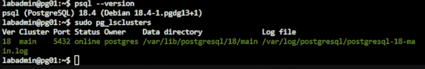

圖（七）pg01 已安裝 PostgreSQL 18.4，`pg_lsclusters` 顯示 `18/main` 位於資料磁碟下並處於 online。

完成 pg01 後，在 pg02、pg03 重複相同流程。安裝 `postgresql-common` 不會自動執行 PGDG Script；三台都要明確執行一次。

## 7. 固定名稱解析

操作位置：ca01、pg01、pg02、pg03。

這四台都是由 Cloud Image 建立。只修改 `/etc/hosts`，重新開機後可能會被 Cloud-Init 覆蓋，因此四台都要同步修改 Debian hosts Template。

先在每台備份並開啟 Template：

```bash
sudo cp -a /etc/cloud/templates/hosts.debian.tmpl \
  /etc/cloud/templates/hosts.debian.tmpl.before-day21
sudo nano /etc/cloud/templates/hosts.debian.tmpl
```

刪除 Template 中把 `{{fqdn}}` 與 `{{hostname}}` 指向 `127.0.1.1` 的那一行。ca01 已在 Day 19 改為 `10.77.30.10 {{fqdn}} {{hostname}}`，這一行也一起換成下面的完整靜態名稱清單。保留原有的 `127.0.0.1 localhost` 與 IPv6 內容：

```text
10.77.30.10 ca01.lab.home ca01
10.77.30.11 pg01.lab.home pg01
10.77.30.12 pg02.lab.home pg02
10.77.30.13 pg03.lab.home pg03
10.77.20.21 proxy01.lab.home proxy01
10.77.20.22 proxy02.lab.home proxy02
10.77.20.11 db-rw.lab.home db-rw
10.77.20.12 db-ro.lab.home db-ro
10.77.40.11 backup01.lab.home backup01
```

按 `Ctrl+O`、Enter、`Ctrl+X`。接著同步修改目前正在使用的 `/etc/hosts`：

```bash
sudo nano /etc/hosts
```

刪除把本機 FQDN 指向 `127.0.1.1` 的項目，保留 `127.0.0.1 localhost` 與 IPv6 內容，再加入相同的靜態名稱清單：

```text
10.77.30.10 ca01.lab.home ca01
10.77.30.11 pg01.lab.home pg01
10.77.30.12 pg02.lab.home pg02
10.77.30.13 pg03.lab.home pg03
10.77.20.21 proxy01.lab.home proxy01
10.77.20.22 proxy02.lab.home proxy02
10.77.20.11 db-rw.lab.home db-rw
10.77.20.12 db-ro.lab.home db-ro
10.77.40.11 backup01.lab.home backup01
```

按 `Ctrl+O`、Enter、`Ctrl+X`。四台都逐一驗證完整 FQDN：

```bash
for host in ca01.lab.home pg01.lab.home pg02.lab.home pg03.lab.home; do
  getent ahostsv4 "$host" | head -n 1
done
```

結果必須依序使用 `10.77.30.10`～`10.77.30.13`，不能出現 `127.0.1.1`。pg01、pg02、pg03 可以逐台重新開機並重複上述檢查，確認 Cloud-Init 依照修改後的 Template 重建 `/etc/hosts`；一次只重新開機一台。ca01 已在 Day 19 完成相同的重新開機驗證。

## 8. 從三台 PG 測試 ca01 Firewall

操作位置：pg01、pg02、pg03。

每台執行：

```bash
curl -sk --connect-timeout 5 \
  https://ca01.lab.home:9000/health
```

這裡的 `-k` 只用來確認三台 PG 節點能經由 TCP 9000 通過 ca01 nftables Host Firewall；完成 Bootstrap 後，正式連線改用已驗證的信任鏈。

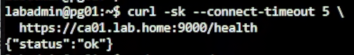

圖（八）pg01 存取 ca01 健康檢查端點並取得 `{"status":"ok"}`，確認 TCP 9000 路徑可用。

## 9. 在三台安裝 step CLI

操作位置：pg01、pg02、pg03 逐台執行。

```bash
sudo apt update
sudo apt install -y curl gpg ca-certificates
sudo install -d -m 0755 /etc/apt/keyrings
sudo curl -fsSL https://packages.smallstep.com/keys/apt/repo-signing-key.gpg \
  -o /etc/apt/keyrings/smallstep.asc
sudo nano /etc/apt/sources.list.d/smallstep.sources
```

填入：

```text
Types: deb
URIs: https://packages.smallstep.com/stable/debian
Suites: debs
Components: main
Signed-By: /etc/apt/keyrings/smallstep.asc
```

按 `Ctrl+O`、Enter、`Ctrl+X`，再執行：

```bash
sudo apt update
sudo apt install -y step-cli
step version
```

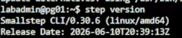

圖（九）pg01 已可執行 step CLI，畫面中的版本為 0.30.6。

## 10. Bootstrap ca01 Root Trust

操作位置：先 ca01，再 pg01、pg02、pg03。

在 ca01 Console 顯示 Fingerprint：

```bash
sudo -u step-ca step certificate fingerprint \
  /var/lib/step-ca/certs/root_ca.crt
```

透過受控方式把 Fingerprint 記錄下來。回到 pg01，將值貼入：

```bash
CA_FINGERPRINT='貼上-ca01-輸出的-SHA256-Fingerprint'
sudo step ca bootstrap \
  --ca-url https://ca01.lab.home:9000 \
  --fingerprint "$CA_FINGERPRINT"
sudo install -d -m 750 -o postgres -g postgres /etc/postgresql/tls
sudo install -m 644 -o postgres -g postgres \
  /root/.step/certs/root_ca.crt /etc/postgresql/tls/ca.crt
```

在 pg02、pg03 重複相同指令。三台使用同一個 Root Fingerprint。

## 11. 在 pg01 本機申請 Server Certificate

操作位置：pg01 Console。

```bash
sudo step ca certificate pg01.lab.home \
  /etc/postgresql/tls/server.crt \
  /etc/postgresql/tls/server.key \
  --ca-url https://ca01.lab.home:9000 \
  --root /etc/postgresql/tls/ca.crt \
  --provisioner iron-lab-admin \
  --not-after=2160h \
  --san pg01 \
  --san pg01.lab.home \
  --san db-rw.lab.home \
  --san db-ro.lab.home \
  --san 10.77.30.11
```

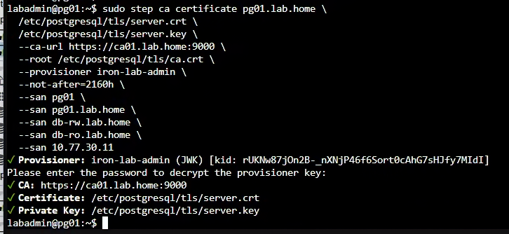

圖（十）pg01 使用 `iron-lab-admin` Provisioner 向 ca01 申請憑證，伺服器憑證與私鑰直接寫入本機 TLS 目錄。

提示輸入 Password 時，輸入 Day 19 建立的 `iron-lab-admin` Provisioner Password。不要輸入 CA Key Password。

設定權限並檢查：

```bash
sudo chown -R postgres:postgres /etc/postgresql/tls
sudo chmod 750 /etc/postgresql/tls
sudo chmod 644 /etc/postgresql/tls/ca.crt /etc/postgresql/tls/server.crt
sudo chmod 600 /etc/postgresql/tls/server.key
sudo -u postgres test -r /etc/postgresql/tls/server.key && echo 'server key readable'
sudo -u postgres grep -c '^-----BEGIN CERTIFICATE-----$' \
  /etc/postgresql/tls/server.crt
sudo -u postgres openssl verify \
  -show_chain \
  -CAfile /etc/postgresql/tls/ca.crt \
  -untrusted /etc/postgresql/tls/server.crt \
  /etc/postgresql/tls/server.crt
sudo -u postgres openssl x509 -in /etc/postgresql/tls/server.crt \
  -noout -subject -issuer -dates -ext subjectAltName
```

`server.crt` 內應有兩段 `BEGIN CERTIFICATE`，分別是 Server Leaf Certificate 與 Intermediate CA Certificate。`ca.crt` 保存受信任的 Root CA；OpenSSL 驗證時使用 `-untrusted server.crt`，讓它取用 Bundle 內的 Intermediate 並建立 `Leaf → Intermediate → Root` Chain。

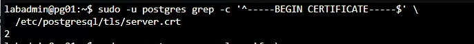

圖（十一）`server.crt` 共有兩段憑證，分別提供伺服器葉憑證與中繼 CA 憑證。

`/etc/postgresql/tls` 使用 `750 postgres:postgres`，因此 `labadmin` 即使看到 Certificate File 是 `644`，仍不能穿越上層目錄讀取檔案。不要把目錄放寬成 `755`；Certificate 與 Private Key 的檢查都使用 `sudo -u postgres` 執行。驗證成功時必須顯示 `server.crt: OK`，並列出深度 0～2 的完整 Chain。

## 12. 在 pg02、pg03 本機申請 Server Certificate

操作位置：pg02 Console，再 pg03 Console。

pg02 使用：

```bash
sudo step ca certificate pg02.lab.home \
  /etc/postgresql/tls/server.crt \
  /etc/postgresql/tls/server.key \
  --ca-url https://ca01.lab.home:9000 \
  --root /etc/postgresql/tls/ca.crt \
  --provisioner iron-lab-admin \
  --not-after=2160h \
  --san pg02 \
  --san pg02.lab.home \
  --san db-rw.lab.home \
  --san db-ro.lab.home \
  --san 10.77.30.12
```

pg03 使用：

```bash
sudo step ca certificate pg03.lab.home \
  /etc/postgresql/tls/server.crt \
  /etc/postgresql/tls/server.key \
  --ca-url https://ca01.lab.home:9000 \
  --root /etc/postgresql/tls/ca.crt \
  --provisioner iron-lab-admin \
  --not-after=2160h \
  --san pg03 \
  --san pg03.lab.home \
  --san db-rw.lab.home \
  --san db-ro.lab.home \
  --san 10.77.30.13
```

因為上述簽發命令透過 `sudo step` 執行，新產生的 `server.crt` 與 `server.key` 可能屬於 `root`。完成 pg02 的簽發後立刻執行以下完整區塊；完成 pg03 的簽發後，再在 pg03 執行同一個區塊：

```bash
sudo chown -R postgres:postgres /etc/postgresql/tls
sudo chmod 750 /etc/postgresql/tls
sudo chmod 644 /etc/postgresql/tls/ca.crt /etc/postgresql/tls/server.crt
sudo chmod 600 /etc/postgresql/tls/server.key

sudo -u postgres test -r /etc/postgresql/tls/ca.crt && echo 'ca readable'
sudo -u postgres test -r /etc/postgresql/tls/server.crt && echo 'certificate readable'
sudo -u postgres test -r /etc/postgresql/tls/server.key && echo 'key readable'

sudo -u postgres grep -c '^-----BEGIN CERTIFICATE-----$' \
  /etc/postgresql/tls/server.crt
sudo -u postgres openssl verify \
  -show_chain \
  -CAfile /etc/postgresql/tls/ca.crt \
  -untrusted /etc/postgresql/tls/server.crt \
  /etc/postgresql/tls/server.crt
sudo -u postgres openssl x509 -in /etc/postgresql/tls/server.crt \
  -noout -subject -issuer -dates -ext subjectAltName
```

三個 Readable Check 都必須顯示結果，Certificate 數量應為 `2`，而 Chain 驗證必須顯示 `server.crt: OK`。若其中一個 `echo` 沒有出現，不要繼續 Restart PostgreSQL，先用 `sudo stat -c '%U %G %a %n' /etc/postgresql/tls/*` 核對 Owner、Group 與 Mode。

最後，三台 `server.key` 不應有相同 Hash：

```bash
sudo sha256sum /etc/postgresql/tls/server.key
```

只比較三台輸出的 Hash 是否不同，不把 Private Key 內容貼到任何地方。

## 13. 設定 PostgreSQL 18

操作位置：pg01、pg02、pg03。

先在 pg01 開啟：

```bash
sudo nano /etc/postgresql/18/main/postgresql.conf
```

找到或新增：

```ini
listen_addresses = 'localhost,10.77.30.11'
port = 5432
password_encryption = 'scram-sha-256'
ssl = on
ssl_cert_file = '/etc/postgresql/tls/server.crt'
ssl_key_file = '/etc/postgresql/tls/server.key'
ssl_ca_file = '/etc/postgresql/tls/ca.crt'
wal_level = replica
max_wal_senders = 10
max_replication_slots = 10
wal_log_hints = on
logging_collector = on
log_connections = 'receipt,authentication,authorization'
log_disconnections = on
log_line_prefix = '%m [%p] %q%u@%d '
```

PostgreSQL 18 的 `log_connections` 已是 String Parameter，不再只用 Boolean 表達。雖然 `on` 為了向下相容仍可使用，而且等同於 `receipt,authentication,authorization`，本文件直接列出三個實際啟用的 Connection Stage，避免讀者誤以為 `setup_durations` 也會一起記錄。若要連建立連線各階段的耗時都寫入 Log，再把 `setup_durations` 加入清單，或改用 `all`。

`log_disconnections` 目前仍是 Boolean，因此使用 `on` 沒有問題。這些連線記錄預設關閉，是因為每次連入、驗證與離線都可能產生 Log I/O、儲存量與敏感資訊暴露；PostgreSQL 使用保守的通用預設，讓管理者依工作負載、稽核需求與 Log 保存能力自行開啟。本 Lab 為了保留連線與切換證據才明確啟用。

按 `Ctrl+O`、Enter、`Ctrl+X`。

pg02 使用相同設定，但 `listen_addresses` 改為 `localhost,10.77.30.12`。pg03 改為 `localhost,10.77.30.13`。

## 14. 設定最小 pg_hba.conf

操作位置：pg01、pg02、pg03。

```bash
sudo cp -a /etc/postgresql/18/main/pg_hba.conf \
  /etc/postgresql/18/main/pg_hba.conf.before-day21
sudo nano /etc/postgresql/18/main/pg_hba.conf
```

保留套件建立的 Local Administrative Login，並在檔案末端確認有最終 Reject：

```text
host all all 0.0.0.0/0 reject
host all all ::/0 reject
```

目前的遠端規則以最終 `reject` 收尾；Application、VPN 與 Replication Network 會在具備實際角色及來源位址後，再加入精確的 `hostssl` 規則。

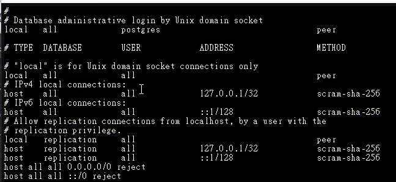

圖（十二）保留 Unix Socket 與 Loopback 管理規則，並以 IPv4、IPv6 的最終 `reject` 收斂其餘遠端連線。

## 15. Restart 並逐台驗證

操作位置：pg01、pg02、pg03。

每台執行：

```bash
sudo pg_ctlcluster 18 main restart
sudo pg_lsclusters
sudo -u postgres psql -Atqc 'SHOW data_directory;'
sudo -u postgres psql -Atqc 'SHOW ssl;'
sudo -u postgres psql -Atqc 'SHOW hba_file;'
sudo -u postgres psql -P pager=off -x \
  -c 'SELECT line_number,type,database,user_name,address,auth_method,error FROM pg_hba_file_rules;'
sudo ss -lntp | grep ':5432'
findmnt /var/lib/postgresql
sudo journalctl -u postgresql -b -n 50 --no-pager
```

`pg_hba_file_rules.error` 必須全部為空。Data Directory 必須位於掛載的 Data Disk 之下。

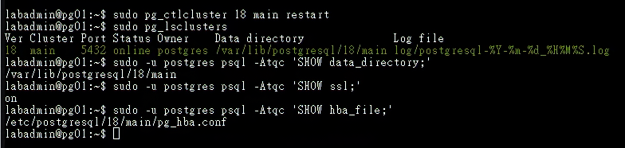

圖（十三）重新啟動後，`18/main` 維持 online，資料目錄位於 `/var/lib/postgresql/18/main`，TLS 已啟用並使用預期的 pg_hba.conf。

## 16. 建立本日管理 Role

操作位置：只在 pg01。

```bash
sudo -u postgres psql
```

在 psql 內執行：

```sql
CREATE DATABASE appdb;
CREATE ROLE dba_admin LOGIN;
\password dba_admin
GRANT CONNECT ON DATABASE appdb TO dba_admin;
\du dba_admin
\q
```

使用 `\password` 互動輸入，避免把密碼寫進 Shell History。本日以 `dba_admin` 完成管理角色基線。

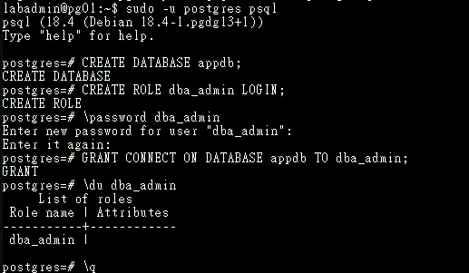

圖（十四）pg01 建立 `appdb` 與具備 LOGIN 的 `dba_admin`，並授予該角色資料庫 CONNECT 權限。

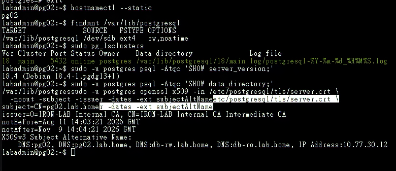

圖（十五）再抽查 pg02，資料磁碟掛載、`18/main` 狀態、資料目錄與憑證 SAN 均符合該節點的規劃值。

## 參考資料

- [PostgreSQL｜Linux Downloads](https://www.postgresql.org/download/linux/debian/)
- [PostgreSQL 18｜SSL Support](https://www.postgresql.org/docs/18/ssl-tcp.html)
- [PostgreSQL 18｜The pg_hba.conf File](https://www.postgresql.org/docs/18/auth-pg-hba-conf.html)
