# Day 21｜讓三台 PostgreSQL 保持資料同步：串流複寫、WAL、複寫槽與熱待命

對應文章：[Day 21｜讓三台 PostgreSQL 保持資料同步：串流複寫、WAL、複寫槽與熱待命](https://ithelp.ithome.com.tw/users/20183351/ironman/9461)

本日以 pg01 為主節點（Primary），pg02／pg03 為實體待命節點（Physical Standby），先理解 WAL、LSN、複寫槽（Replication Slot）與同步狀態。完成原生複寫觀察後，後續會重建為 Patroni 管理的叢集。

> 部分截圖來自較早期的規劃截圖，測試資料仍使用 `day22-*`，複寫連線名稱也可能顯示套件預設的 `18/main`。目前操作請以本文的 `day21-*` 與 `PGAPPNAME=pg02／pg03` 為準；這些畫面用來確認相同的複寫狀態與操作結果。

## 本日操作順序

1. 在 pg01 建立 `replication_user`，加入精確的 `hostssl replication` 規則並重新載入設定。
2. 在 pg01 確認主節點設定，並建立 pg02、pg03 各自使用的複寫槽。
3. 先在 pg02 準備登入資訊，停止本機 PostgreSQL，再執行 `pg_basebackup`。
4. pg02 驗證為待命節點後，才在 pg03 重複相同步驟。
5. 回到 pg01 確認同時看見兩條串流複寫連線。
6. 先建立測試資料，再由 pg02、pg03 驗證 WAL 套用。
7. 最後只在 pg03 暫停 WAL 套用，觀察完立即恢復。

本日依序重建 pg02 與 pg03。逐台完成可以保留一台可供對照，也比較容易判斷錯誤發生在哪個節點。

## 1. 主節點前置確認

**操作節點：只在 pg01。**

在 pg01：

```bash
sudo -u postgres psql
```

建立專用角色（Role），密碼使用互動輸入：

```sql
CREATE ROLE replication_user WITH LOGIN REPLICATION;
\password replication_user
\q
```

開啟 `pg_hba.conf`：

```bash
sudo nano /etc/postgresql/18/main/pg_hba.conf
```

把三條規則放在最終 `reject` 之前：

```text
hostssl replication replication_user 10.77.30.11/32 scram-sha-256
hostssl replication replication_user 10.77.30.12/32 scram-sha-256
hostssl replication replication_user 10.77.30.13/32 scram-sha-256
```

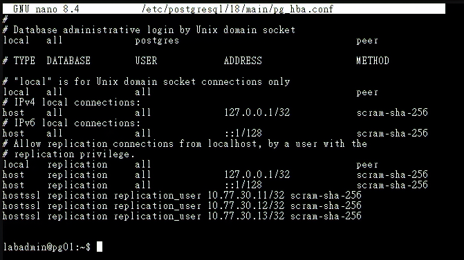

*圖（一）pg01 已在最終拒絕規則之前加入三台節點的 `hostssl replication` 規則。*

按 `Ctrl+O`、Enter、`Ctrl+X`，再檢查並重新載入設定：

```bash
sudo -u postgres psql -P pager=off -x \
  -c 'SELECT line_number,type,database,user_name,address,auth_method,error FROM pg_hba_file_rules;'
sudo pg_ctlcluster 18 main reload
```

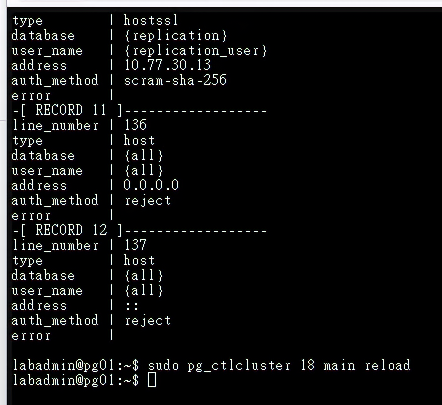

*圖（二）`pg_hba_file_rules` 已解析複寫規則且 `error` 欄位為空，接著重新載入 PostgreSQL 設定。*

確認 `error` 全部為空，再確認 pg01 確實監聽 Database VLAN 位址：

```bash
sudo -u postgres psql -Atqc 'SHOW listen_addresses;'
sudo ss -lntp | grep ':5432'
```

輸出必須包含 `10.77.30.11`。若只看到 `localhost`、`127.0.0.1` 或 `::1`，先修正 `listen_addresses` 並重新啟動 PostgreSQL，再處理複本節點的資料目錄。

監聽正常後再建立複寫槽：

```bash
sudo -u postgres psql -x -c "SELECT name,setting FROM pg_settings WHERE name IN ('wal_level','max_wal_senders','max_replication_slots','wal_log_hints');"
sudo -u postgres psql -c "SELECT pg_create_physical_replication_slot('pg02_slot');"
sudo -u postgres psql -c "SELECT pg_create_physical_replication_slot('pg03_slot');"
sudo -u postgres psql -c "SELECT slot_name,active,restart_lsn FROM pg_replication_slots;"
```

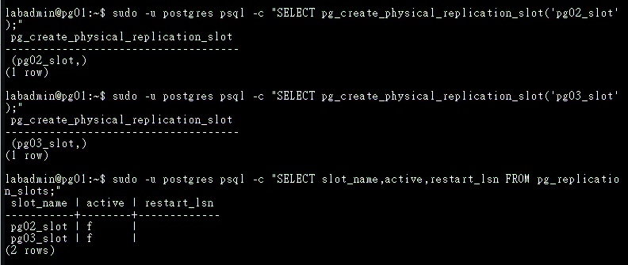

*圖（三）pg01 已建立 `pg02_slot` 與 `pg03_slot`；待命節點連線前，兩個複寫槽的 `active` 均為 `false`。*

如果複寫槽已存在，先查明是否有待命節點正在使用，並沿用正確的既有複寫槽。

## 2. 準備複寫登入資訊

**操作節點：先 pg02，完成第 3 節後再於 pg03 重複。**

在 pg02／pg03 的 `/var/lib/postgresql/.pgpass` 加入：

```bash
sudo -u postgres nano /var/lib/postgresql/.pgpass
```

```text
pg01.lab.home:5432:replication:replication_user:實際複寫密碼
```

```bash
sudo chown postgres:postgres /var/lib/postgresql/.pgpass
sudo chmod 600 /var/lib/postgresql/.pgpass
sudo install -d -m 700 -o postgres -g postgres /var/lib/postgresql/.postgresql
sudo install -m 644 -o postgres -g postgres /etc/postgresql/tls/ca.crt /var/lib/postgresql/.postgresql/root.crt
```

在停止本機 PostgreSQL 前，先從目前的複本節點確認 DNS 與 pg01 服務可達：

```bash
getent ahostsv4 pg01.lab.home
pg_isready -h pg01.lab.home -p 5432
```

必須解析為 `10.77.30.11`，而且 `pg_isready` 必須顯示 `accepting connections`。若顯示 `no response` 或 `rejecting connections`，保留本機 PostgreSQL 與資料目錄，先回 pg01 檢查服務、`listen_addresses` 與 TCP 5432 監聽。

`.pgpass` 屬於敏感登入資訊，只保存在權限受限的主機檔案，並排除於公開畫面、文件與 Git。

## 3. 建立 pg02 待命節點

**操作節點：只在 pg02。**

確認 pg02 尚無正式資料。將原目錄移為可回復副本，再建立新的空目錄：

```bash
sudo systemctl stop postgresql
sudo mv /var/lib/postgresql/18/main /var/lib/postgresql/18/main.before-replication
sudo install -d -m 700 -o postgres -g postgres /var/lib/postgresql/18/main
```

確認新目錄是空的，再執行基礎備份（Base Backup）：

```bash
sudo find /var/lib/postgresql/18/main -mindepth 1 -maxdepth 1 -print
sudo -u postgres env \
  PGPASSFILE=/var/lib/postgresql/.pgpass \
  PGAPPNAME=pg02 \
  PGSSLMODE=verify-full \
  PGSSLROOTCERT=/var/lib/postgresql/.postgresql/root.crt \
  pg_basebackup \
  -h pg01.lab.home \
  -U replication_user \
  -D /var/lib/postgresql/18/main \
  -R -X stream -P \
  -S pg02_slot
```

只有 `pg_basebackup` 正常完成並回到 Shell 提示字元，而且 `PG_VERSION`、`standby.signal` 都存在時，才啟動 PostgreSQL：

```bash
sudo test -s /var/lib/postgresql/18/main/PG_VERSION && echo 'base backup complete'
sudo test -f /var/lib/postgresql/18/main/standby.signal && echo 'standby signal exists'
sudo systemctl start postgresql
```

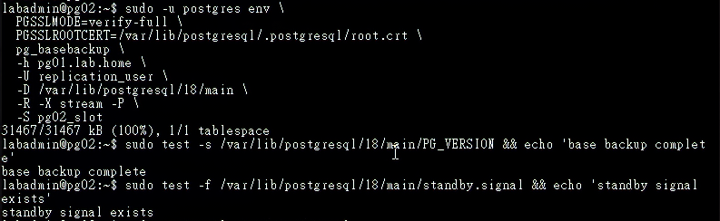

*圖（四）pg02 的基礎備份已完成，`PG_VERSION` 與 `standby.signal` 均已建立。*

只有 `pg_basebackup` 正常完成才執行 `systemctl start postgresql`。若出現任何錯誤，保留 `main.before-replication` 與錯誤現場，再修正主節點監聽、DNS、TLS、登入資訊或 `pg_hba.conf`。

本篇已先在 pg01 建立 `pg02_slot`，因此命令直接以 `-S` 引用既有複寫槽，省略 `-C`。遇到 `slot already exists` 時先保留複寫槽，再確認它的使用節點與狀態。

在 `postgresql.auto.conf` 確認產生 `primary_conninfo` 與 `primary_slot_name`，且 `primary_conninfo` 包含 `application_name=pg02`。畫面與文件須遮蔽密碼：

```bash
sudo grep -E 'primary_conninfo|primary_slot_name' /var/lib/postgresql/18/main/postgresql.auto.conf | sed 's/password=[^ ]*/password=REDACTED/'
sudo test -f /var/lib/postgresql/18/main/standby.signal
sudo -u postgres psql -c 'SELECT pg_is_in_recovery();'
```

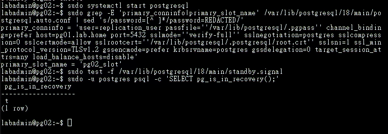

*圖（五）pg02 啟動後可讀取複寫連線設定，`pg_is_in_recovery()` 回傳 `true`，確認它以待命節點身分運作。畫面中的 `18/main` 是早期錄製時的預設連線名稱。*

## 4. 建立 pg03 待命節點

**操作節點：只在 pg03。確認 pg02 已正常 Streaming 後才開始。**

在 pg03 重複相同步驟，並將 `PGAPPNAME` 與複寫槽改為：

```text
PGAPPNAME：pg03
複寫槽：pg03_slot
資料目錄：/var/lib/postgresql/18/main
主節點：pg01.lab.home
```

## 5. 主節點驗證

**操作節點：只在 pg01。**

在 pg01：

```bash
sudo -u postgres psql
```

```sql
SELECT application_name, client_addr, state, sync_state,
       sent_lsn, write_lsn, flush_lsn, replay_lsn
FROM pg_stat_replication
ORDER BY application_name;
```

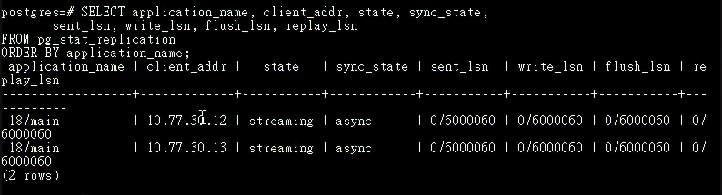

*圖（六）pg01 同時看見來自 `10.77.30.12` 與 `10.77.30.13` 的兩條 `streaming` 連線，且兩者均為非同步複寫。畫面中的 `18/main` 是早期錄製時的預設連線名稱。*

應看到兩條 `streaming`。預設非同步時 `sync_state` 通常是 `async`，表示提交未等待待命節點確認；主節點永久損毀時，尚未送達的交易可能遺失。

## 6. WAL 與 LSN 實驗

**操作順序：先在 pg01 寫入，再到 pg02、pg03 讀取。**

pg01：

```sql
\c appdb
CREATE TABLE IF NOT EXISTS public.replication_demo(
  id bigint GENERATED ALWAYS AS IDENTITY PRIMARY KEY,
  created_at timestamptz NOT NULL DEFAULT now(),
  source text NOT NULL
);
INSERT INTO public.replication_demo(source) VALUES ('day21-primary');
SELECT pg_current_wal_lsn();
```

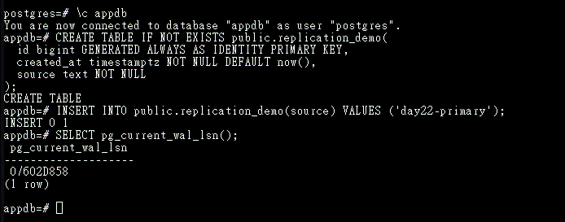

*圖（七）pg01 建立測試表、寫入第一筆資料並記錄目前 WAL LSN；畫面中的 `day22-primary` 對應本文現行的 `day21-primary` 測試值。*

本日使用預設的 `public` Schema 建立複寫測試表。應用程式 Schema 與角色會在實際部署服務時建立，讓 Schema Owner 直接套用正確角色。

pg02／pg03：

```bash
sudo -u postgres psql
```

```sql
\c appdb
SELECT pg_is_in_recovery();
SELECT pg_last_wal_receive_lsn(), pg_last_wal_replay_lsn();
SELECT * FROM public.replication_demo ORDER BY id DESC LIMIT 5;
```

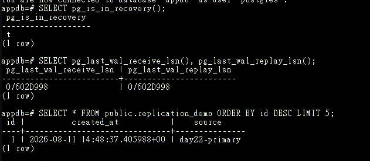

*圖（八）待命節點的 `pg_is_in_recovery()` 為 `true`，Receive LSN 與 Replay LSN 已追平，並可讀到主節點寫入的測試資料。*

## 7. 暫停 WAL 套用與觀察延遲

**操作順序：在 pg03 暫停 WAL 套用。到 pg01 寫入並觀察。最後回到 pg03 恢復。**

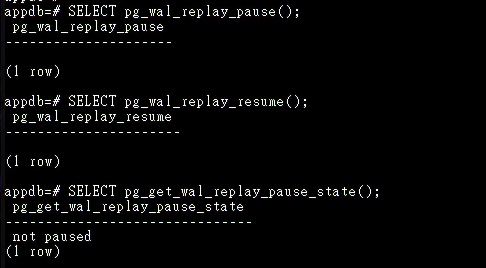

*圖（九）早期檢查畫面確認 `pg_wal_replay_pause()` 與 `pg_wal_replay_resume()` 可以切換 WAL 套用狀態；以下正式觀察會再次暫停並於測試後恢復。*

### 7.1 在 pg03 記錄暫停前基準

操作位置：pg03 Console。

進入 `appdb`：

```bash
sudo -u postgres psql -d appdb
```

先記錄 Receive LSN、Replay LSN 與測試表筆數：

```sql
SELECT pg_last_wal_receive_lsn(), pg_last_wal_replay_lsn();
SELECT count(*) FROM public.replication_demo;
```

暫停 WAL 套用並確認狀態：

```sql
SELECT pg_wal_replay_pause();
SELECT pg_sleep(1);
SELECT pg_get_wal_replay_pause_state();
```

狀態必須進入 `paused`；若顯示 `pause requested`，等待一秒後再次查詢，直到真正暫停。保持這個 psql 工作階段與 pg03 的 PostgreSQL 服務運作。

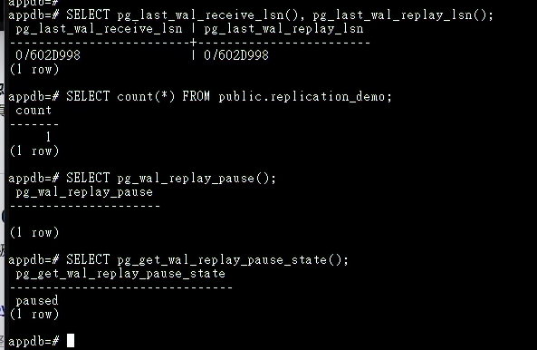

*圖（十）pg03 先記錄 Receive LSN、Replay LSN 與資料筆數，再將 WAL 套用狀態切換為 `paused`。*

### 7.2 在 pg01 追加測試資料

操作位置：切換到 pg01 Console，pg03 保持暫停。

```bash
sudo -u postgres psql -d appdb
```

寫入 20 筆可辨識的測試資料：

```sql
INSERT INTO public.replication_demo(source)
SELECT 'day21-replay-pause-' || value
FROM generate_series(1,20) AS series(value);

SELECT count(*) FROM public.replication_demo;
SELECT pg_current_wal_lsn();
```

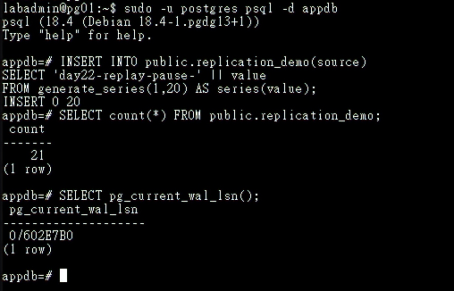

*圖（十一）pg03 暫停 WAL 套用期間，pg01 新增 20 筆可辨識資料並記錄新的 WAL LSN；畫面中的 `day22-replay-pause-*` 對應本文現行的 `day21-replay-pause-*`。*

觀察 pg01 看到的複寫連線：

```sql
SELECT application_name,
       client_addr,
       state,
       sent_lsn,
       write_lsn,
       flush_lsn,
       replay_lsn,
       replay_lag,
       sync_state
FROM pg_stat_replication
ORDER BY application_name;
```

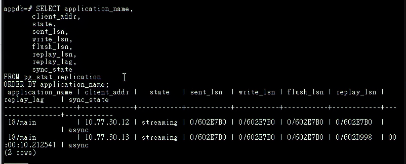

*圖（十二）pg01 顯示兩條連線持續 `streaming`；pg03 的 Replay LSN 暫時落後，反映 WAL 已傳送但尚未完成套用。畫面中的 `18/main` 是早期錄製時的預設連線名稱。*

再檢查實體複寫槽保留 WAL 的位置與估算容量：

```sql
SELECT slot_name,
       active,
       restart_lsn,
       pg_size_pretty(
         pg_wal_lsn_diff(pg_current_wal_lsn(), restart_lsn)
       ) AS retained_wal
FROM pg_replication_slots
ORDER BY slot_name;
```

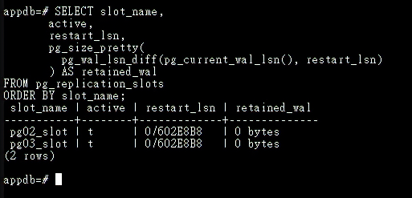

*圖（十三）兩個實體複寫槽均為使用中；此時 `retained_wal` 為 `0 bytes`，表示複寫槽不需額外保留更早的 WAL。*

pg03 的連線可能保持 `streaming`，`write_lsn` 與 `flush_lsn` 也可能繼續前進。這次暫停只停止 WAL 套用，WAL 接收會繼續；觀察重點是 pg03 的 `replay_lsn` 暫時落後並出現 `replay_lag`。如果 pg03 已接收並落盤 WAL，實體複寫槽的 `restart_lsn` 可以前進，因此 `retained_wal` 可能顯示 `0 bytes`。套用狀態與 LSN 差距才是這項測試的判讀依據。

### 7.3 回到 pg03 確認 WAL 套用暫停期間的資料狀態

操作位置：切回 pg03 原本的 psql Session。

```sql
SELECT pg_get_wal_replay_pause_state();
SELECT pg_last_wal_receive_lsn(), pg_last_wal_replay_lsn();
SELECT count(*) FROM public.replication_demo;
```

Receive LSN 可能已前進，Replay LSN 與表格筆數則維持暫停前的結果。

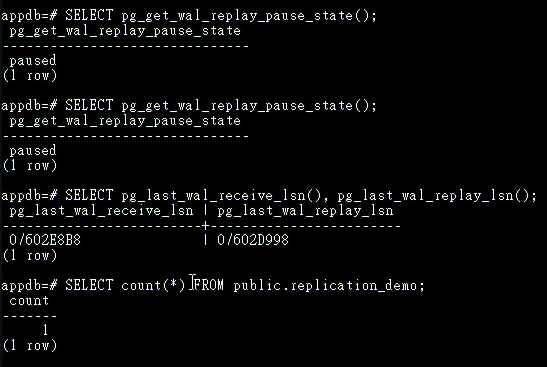

*圖（十四）pg03 維持 `paused` 時，Receive LSN 已前進而 Replay LSN 與資料筆數停留在暫停前，呈現接收與套用兩個不同進度。*

### 7.4 在 pg03 恢復 WAL 套用

在 pg03 執行：

```sql
SELECT pg_wal_replay_resume();
SELECT pg_get_wal_replay_pause_state();
```

狀態應回到 `not paused`。等待數秒後再次檢查：

```sql
SELECT pg_last_wal_receive_lsn(), pg_last_wal_replay_lsn();
SELECT *
FROM public.replication_demo
WHERE source LIKE 'day21-replay-pause-%'
ORDER BY id;
```

應看到剛才新增的 20 筆資料。輸入 `\q` 離開 pg03 的 psql。

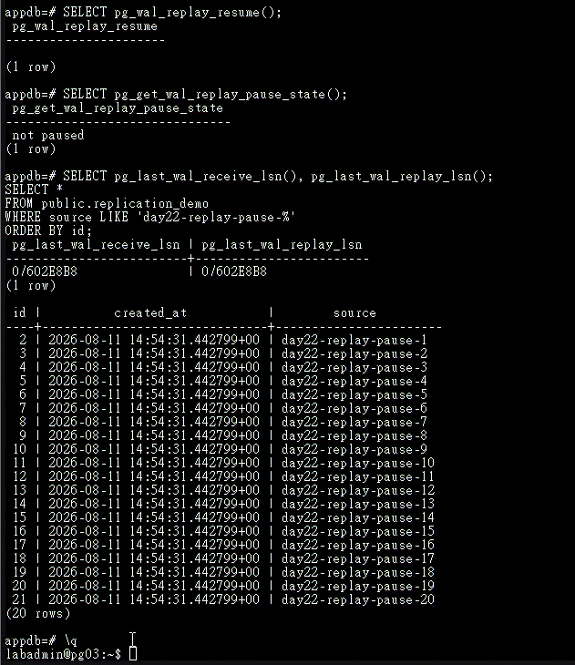

*圖（十五）pg03 恢復 WAL 套用後，Replay LSN 追上 Receive LSN，並可讀到新增的 20 筆資料；畫面中的 `day22-replay-pause-*` 對應本文現行的 `day21-replay-pause-*`。*

### 7.5 回到 pg01 做收尾確認

在 pg01 的 psql 再執行：

```sql
SELECT application_name,
       state,
       replay_lsn,
       replay_lag
FROM pg_stat_replication
ORDER BY application_name;

SELECT slot_name,
       active,
       restart_lsn,
       pg_size_pretty(
         pg_wal_lsn_diff(pg_current_wal_lsn(), restart_lsn)
       ) AS retained_wal
FROM pg_replication_slots
ORDER BY slot_name;
```

確認 pg03 的 WAL 套用已繼續前進後，輸入 `\q` 離開。WAL 套用暫停只做短時間觀察，完成後立即恢復。WAL 接收程序持續接收時，尚待套用的 WAL 會累積在 pg03，查詢也會停留在舊資料狀態；若 pg03 中斷接收或確認 WAL，複寫槽的 `restart_lsn` 便會停止前進，使 pg01 保留越來越多 WAL，並面臨磁碟耗盡風險。

如果中途操作中斷或忘記目前狀態，可在 pg03 強制執行以下收尾命令：

```bash
sudo -u postgres psql -d postgres \
  -c 'SELECT pg_wal_replay_resume();'
```

## 額外實作：驗證熱待命的讀寫邊界

這項測試不影響串流複寫的建置結果，可在完成前述步驟後補做。以下以 pg02 待命節點確認熱待命能提供查詢，並由 PostgreSQL 拒絕寫入操作。

在 pg02 連入 `appdb`：

```bash
sudo -u postgres psql -d appdb -P pager=off
```

先確認節點處於復原模式，再讀取由 pg01 複寫而來的資料：

```sql
SELECT pg_is_in_recovery();

SELECT id, source
FROM public.replication_demo
ORDER BY id DESC
LIMIT 3;
```

`pg_is_in_recovery()` 應回傳 `true`，查詢也應顯示主節點先前寫入的資料。接著在同一個 pg02 工作階段嘗試寫入：

```sql
INSERT INTO public.replication_demo(source)
VALUES ('day21-standby-write-test');
```

PostgreSQL 應回傳 `cannot execute INSERT in a read-only transaction`。這項錯誤是預期結果，用來證明熱待命的唯讀邊界。完成後輸入 `\q` 離開。

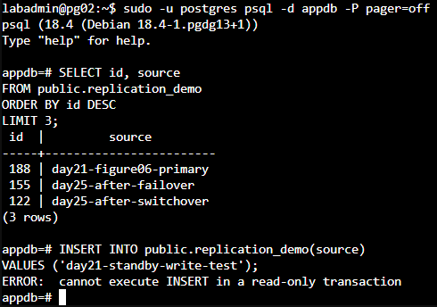

*圖（十六）pg02 可以讀取已套用的資料，寫入操作則由 PostgreSQL 拒絕。畫面是在 Patroni 建立後補拍，因此資料內容與當下的主節點角色不同，熱待命的判讀方式相同。*
