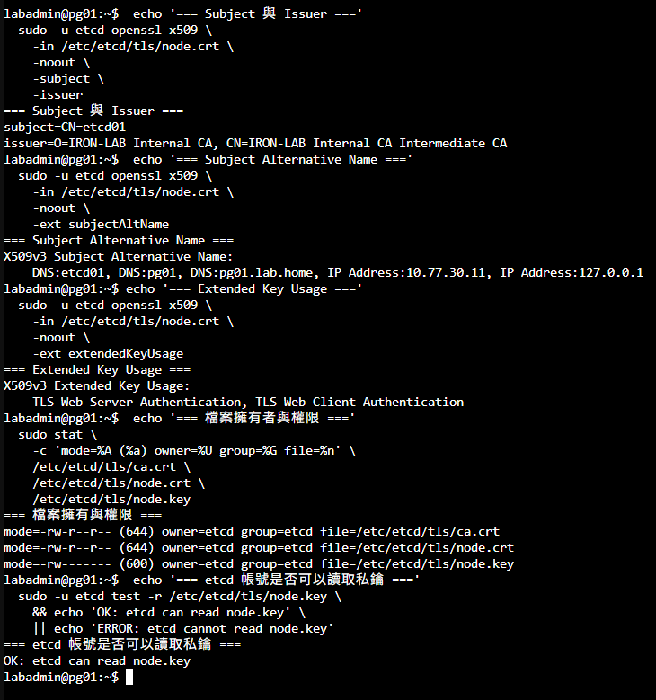
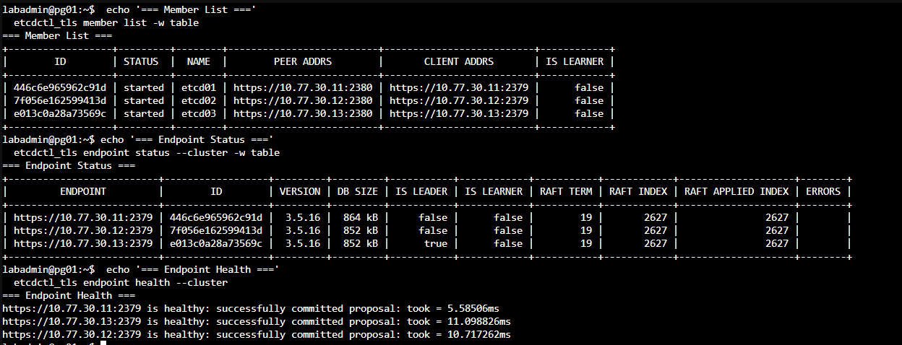
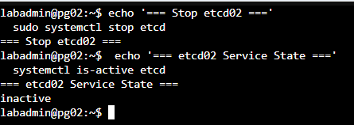
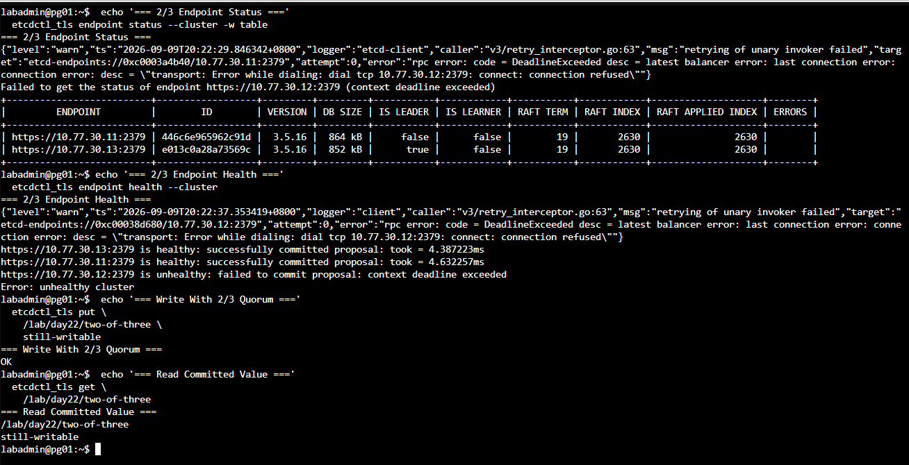
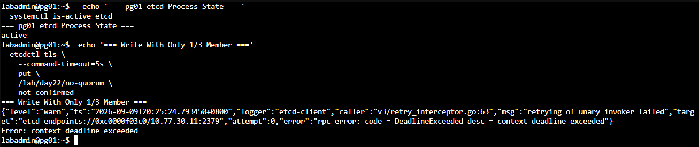
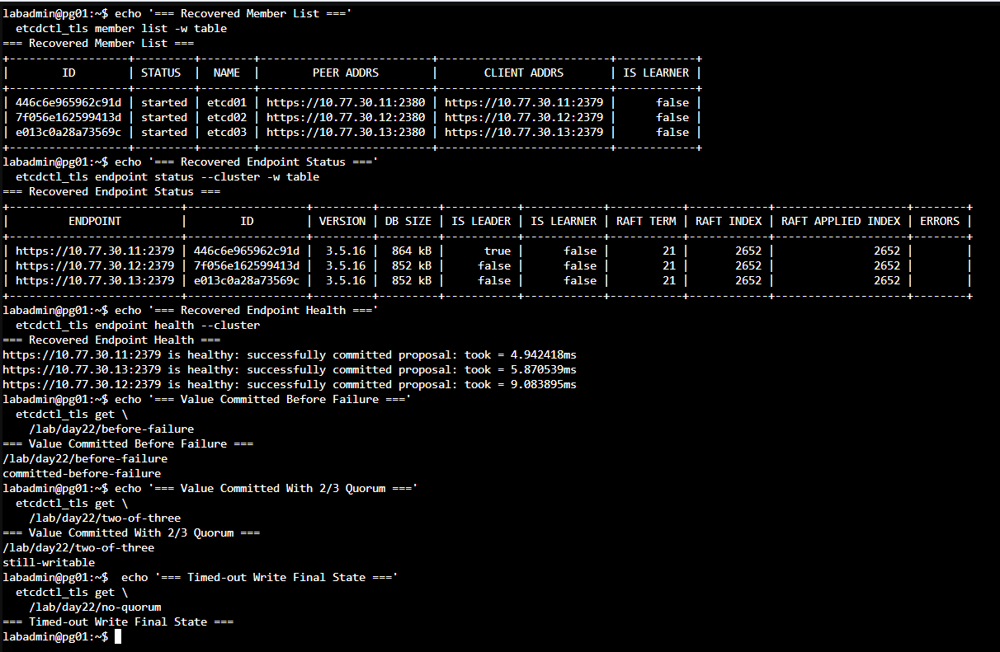
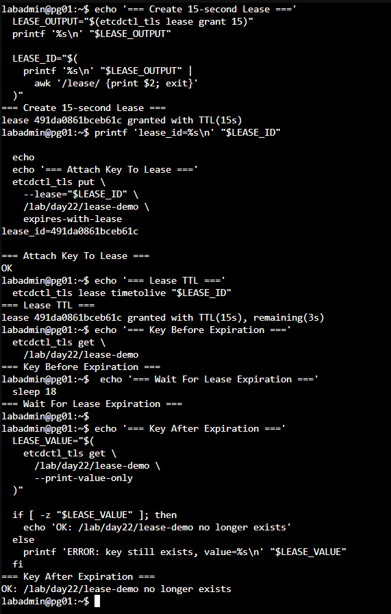

# Day 22｜Patroni 如何讓 PostgreSQL 叢集取得一致決策？三節點 etcd、Raft 與 mTLS

對應文章：[Day 22｜Patroni 如何讓 PostgreSQL 叢集取得一致決策？三節點 etcd、Raft 與 mTLS](https://ithelp.ithome.com.tw/users/20183351/ironman/9461)

etcd01～03 分別部署在 pg01～03，同一組 Database VLAN。Lab 可以演示 Quorum，容錯範圍則限於三台 VM，三者共用的 L0 Host 是共同故障域。

## 本日操作順序

1. 逐台在 pg01、pg02、pg03 安裝 etcd，但先保持服務關閉。
2. 在 ca01 建立獨立的 etcd Provisioner，不另外建立第二套 Root CA。
3. 逐台在 pg01、pg02、pg03 本機產生 Private Key，向 ca01 申請自己的 etcd 憑證。
4. 逐台寫入自己的 etcd Name、IP 與相同的 Initial Cluster 清單。
5. 先啟動 pg01，再於短時間內啟動 pg02、pg03，建立第一個三成員 Cluster。
6. 確認三台健康後，依序驗證 2／3、1／3 與恢復後的 Quorum 行為。

## 0. 開始前確認時間同步

**操作節點：pg01、pg02、pg03。這裡只驗證 Day 20 已完成的 Chrony 基線。**

三台逐台執行：

```bash
systemctl is-enabled chrony
systemctl is-active chrony
chronyc tracking
chronyc sources -v
```

三台都必須顯示 Chrony 為 `enabled`、`active`，`Leap status` 為 `Normal`，並且至少有一個以 `^*` 開頭的同步來源。若尚未同步，先回到 Day 20 的時間同步步驟處理，再啟動 etcd。可比較的系統時間有助於判讀憑證有效期、租約觀察結果與跨節點紀錄；Quorum 則以 Raft 通訊與投票狀態為準。

## 1. 安裝套件

**操作節點：pg01、pg02、pg03。逐台安裝，全部保持停止狀態。**

依序在 pg01、pg02、pg03 執行：

```bash
sudo apt update
sudo apt install -y etcd-server etcd-client
etcd --version
etcdctl version
sudo systemctl disable --now etcd
```

## 2. 建立 etcd 節點憑證

**操作順序：先到 ca01 建立 etcd 專用 Provisioner，再依序於 pg01、pg02、pg03 本機申請憑證。**

Day 19 已建立 ca01 與共同信任的 Root CA，本日沿用這套 CA。PostgreSQL 與 etcd 使用不同 Provisioner，讓兩種服務擁有不同的簽發密碼與有效期範圍；兩者目前共用相同的 Intermediate CA。

### 2.1 在 ca01 建立 etcd Provisioner

使用 PVE Console 進入 ca01：

```bash
sudo install -m 600 -o step-ca -g step-ca /dev/null \
  /etc/step-ca/etcd-provisioner-password
sudo -u step-ca nano /etc/step-ca/etcd-provisioner-password
```

輸入只供 `iron-lab-etcd` 使用的非空 Password，按 `Ctrl+O`、Enter、`Ctrl+X`。確認檔案非空但不要顯示內容：

```bash
sudo -u step-ca test -s /etc/step-ca/etcd-provisioner-password && \
  echo 'etcd provisioner password file: non-empty'
```

建立 Provisioner：

```bash
sudo -u step-ca -H env STEPPATH=/var/lib/step-ca \
  step ca provisioner add iron-lab-etcd \
  --type JWK \
  --create \
  --password-file /etc/step-ca/etcd-provisioner-password \
  --x509-min-dur 5m \
  --x509-default-dur 2160h \
  --x509-max-dur 8760h \
  --ca-config /var/lib/step-ca/config/ca.json

sudo systemctl restart step-ca
sudo systemctl status step-ca --no-pager
sudo -u step-ca -H env STEPPATH=/var/lib/step-ca \
  step ca provisioner list \
  --ca-url https://ca01.lab.home:9000 \
  --root /var/lib/step-ca/certs/root_ca.crt | \
  grep -E '"(type|name|minTLSCertDuration|maxTLSCertDuration|defaultTLSCertDuration)"'
```

`iron-lab-etcd` 的 Provisioner Password 與 Day 19 使用的 `iron-lab-admin` 密碼分開保存，實際內容不得出現在畫面與 Git 中。

### 2.2 在三台節點準備 etcd TLS 目錄

**操作節點：pg01、pg02、pg03。以下步驟三台都要做。**

Day 20 已安裝 `step-cli` 並完成 ca01 Bootstrap，因此不需要重新安裝套件或再次接受 Fingerprint：

```bash
sudo install -d -m 750 -o etcd -g etcd /etc/etcd/tls
sudo install -m 644 -o etcd -g etcd \
  /root/.step/certs/root_ca.crt /etc/etcd/tls/ca.crt
```

### 2.3 各節點在本機申請憑證

在 pg01 執行：

```bash
sudo step ca certificate etcd01 \
  /etc/etcd/tls/node.crt \
  /etc/etcd/tls/node.key \
  --ca-url https://ca01.lab.home:9000 \
  --root /etc/etcd/tls/ca.crt \
  --provisioner iron-lab-etcd \
  --not-after=2160h \
  --san etcd01 \
  --san pg01 \
  --san pg01.lab.home \
  --san 10.77.30.11 \
  --san 127.0.0.1
```

在 pg02 執行：

```bash
sudo step ca certificate etcd02 \
  /etc/etcd/tls/node.crt \
  /etc/etcd/tls/node.key \
  --ca-url https://ca01.lab.home:9000 \
  --root /etc/etcd/tls/ca.crt \
  --provisioner iron-lab-etcd \
  --not-after=2160h \
  --san etcd02 \
  --san pg02 \
  --san pg02.lab.home \
  --san 10.77.30.12 \
  --san 127.0.0.1
```

在 pg03 執行：

```bash
sudo step ca certificate etcd03 \
  /etc/etcd/tls/node.crt \
  /etc/etcd/tls/node.key \
  --ca-url https://ca01.lab.home:9000 \
  --root /etc/etcd/tls/ca.crt \
  --provisioner iron-lab-etcd \
  --not-after=2160h \
  --san etcd03 \
  --san pg03 \
  --san pg03.lab.home \
  --san 10.77.30.13 \
  --san 127.0.0.1
```

每台的 `node.key` 都由 `step` 在本機建立，不經過 jump01，也不複製到另外兩台。簽發完成後，每台應有：

```text
/etc/etcd/tls/ca.crt
/etc/etcd/tls/node.crt
/etc/etcd/tls/node.key
```

```bash
sudo chown -R etcd:etcd /etc/etcd/tls
sudo chmod 750 /etc/etcd/tls
sudo chmod 644 /etc/etcd/tls/ca.crt /etc/etcd/tls/node.crt
sudo chmod 600 /etc/etcd/tls/node.key
sudo -u etcd test -r /etc/etcd/tls/node.key
sudo -u etcd openssl x509 -in /etc/etcd/tls/node.crt -noout -subject -issuer -ext subjectAltName
sudo -u etcd openssl x509 -in /etc/etcd/tls/node.crt -noout -text | grep -A2 'Extended Key Usage'
sudo -u etcd openssl verify \
  -show_chain \
  -CAfile /etc/etcd/tls/ca.crt \
  -untrusted /etc/etcd/tls/node.crt \
  /etc/etcd/tls/node.crt
sudo -u etcd openssl x509 -checkend 2592000 -noout -in /etc/etcd/tls/node.crt
```

檢查結果必須包含 TLS Web Server Authentication 與 TLS Web Client Authentication，因為同一張憑證同時供 etcd Peer 與 Client Mutual TLS 使用。後續部署 Patroni 時會另外製作 Patroni 可讀的受限副本，並維持 `/etc/etcd/tls/node.key` 的權限。



圖（一）pg01 的 etcd 憑證包含節點名稱、IP、伺服器與用戶端驗證用途，私鑰則只允許 `etcd` 服務帳號讀取。

正式環境若需要更清楚的責任分離，應由 Offline Root CA 分別簽發 PostgreSQL 與 etcd 的 Intermediate CA，再把 Online Intermediate CA 部署在獨立 PKI VLAN 的 Unprivileged LXC、專用 VM 或既有 PKI 平台。

## 3. 固定 Initial Cluster

**操作節點：pg01、pg02、pg03。每台設定自己的 Name 與 IP，但三台的 Initial Cluster 成員清單必須完全一致。**

Initial Cluster 是第一次建立 etcd Cluster 時使用的成員名冊。等號左側是 Member Name，右側是其他 Member 用來連線的 Peer URL：

```text
etcd01=https://10.77.30.11:2380,etcd02=https://10.77.30.12:2380,etcd03=https://10.77.30.13:2380
```

三台的 `ETCD_INITIAL_CLUSTER` 必須逐字一致，但每台的 `ETCD_NAME`、Listen URL 與 Advertise URL 必須對應自己的 IP。以下 Port 不可互換：

- TCP 2379 是 Client Port，提供 `etcdctl` 與後續 Patroni 使用。
- TCP 2380 是 Peer Port，供 etcd01～03 彼此交換 Raft 訊息。
- `LISTEN` 決定本機在哪些 Address Bind Socket。
- `ADVERTISE` 是本節點告訴其他 Client 或 Member「請使用這個位址連我」，因此必須填入其他節點可到達的固定 IP。
- `INITIAL_CLUSTER_TOKEN` 用來區分不同 Cluster Bootstrap；三台必須相同。
- `INITIAL_CLUSTER_STATE="new"` 只表示這是第一次建立這組 Cluster。成功啟動後，Member Identity 會保存在 Data Directory，日常 Restart 不會重新 Bootstrap。

### 3.1 在 pg01 寫入 etcd01 設定

操作位置：pg01 Console。

```bash
sudo cp -a /etc/default/etcd /etc/default/etcd.before-day22 2>/dev/null || true
sudo nano /etc/default/etcd
```

清除檔案內會與下列變數重複的舊設定，再填入：

```bash
ETCD_NAME="etcd01"
ETCD_DATA_DIR="/var/lib/etcd/iron-pg"
ETCD_LISTEN_PEER_URLS="https://10.77.30.11:2380"
ETCD_INITIAL_ADVERTISE_PEER_URLS="https://10.77.30.11:2380"
ETCD_LISTEN_CLIENT_URLS="https://10.77.30.11:2379,https://127.0.0.1:2379"
ETCD_ADVERTISE_CLIENT_URLS="https://10.77.30.11:2379"
ETCD_INITIAL_CLUSTER="etcd01=https://10.77.30.11:2380,etcd02=https://10.77.30.12:2380,etcd03=https://10.77.30.13:2380"
ETCD_INITIAL_CLUSTER_STATE="new"
ETCD_INITIAL_CLUSTER_TOKEN="iron-pg-etcd-v1"
ETCD_CERT_FILE="/etc/etcd/tls/node.crt"
ETCD_KEY_FILE="/etc/etcd/tls/node.key"
ETCD_TRUSTED_CA_FILE="/etc/etcd/tls/ca.crt"
ETCD_CLIENT_CERT_AUTH="true"
ETCD_PEER_CERT_FILE="/etc/etcd/tls/node.crt"
ETCD_PEER_KEY_FILE="/etc/etcd/tls/node.key"
ETCD_PEER_TRUSTED_CA_FILE="/etc/etcd/tls/ca.crt"
ETCD_PEER_CLIENT_CERT_AUTH="true"
```

按 `Ctrl+O`、Enter、`Ctrl+X`，但先不要啟動 etcd。

### 3.2 在 pg02 寫入 etcd02 設定

操作位置：pg02 Console。

```bash
sudo cp -a /etc/default/etcd /etc/default/etcd.before-day22 2>/dev/null || true
sudo nano /etc/default/etcd
```

清除重複的舊設定，再填入完整內容：

```bash
ETCD_NAME="etcd02"
ETCD_DATA_DIR="/var/lib/etcd/iron-pg"
ETCD_LISTEN_PEER_URLS="https://10.77.30.12:2380"
ETCD_INITIAL_ADVERTISE_PEER_URLS="https://10.77.30.12:2380"
ETCD_LISTEN_CLIENT_URLS="https://10.77.30.12:2379,https://127.0.0.1:2379"
ETCD_ADVERTISE_CLIENT_URLS="https://10.77.30.12:2379"
ETCD_INITIAL_CLUSTER="etcd01=https://10.77.30.11:2380,etcd02=https://10.77.30.12:2380,etcd03=https://10.77.30.13:2380"
ETCD_INITIAL_CLUSTER_STATE="new"
ETCD_INITIAL_CLUSTER_TOKEN="iron-pg-etcd-v1"
ETCD_CERT_FILE="/etc/etcd/tls/node.crt"
ETCD_KEY_FILE="/etc/etcd/tls/node.key"
ETCD_TRUSTED_CA_FILE="/etc/etcd/tls/ca.crt"
ETCD_CLIENT_CERT_AUTH="true"
ETCD_PEER_CERT_FILE="/etc/etcd/tls/node.crt"
ETCD_PEER_KEY_FILE="/etc/etcd/tls/node.key"
ETCD_PEER_TRUSTED_CA_FILE="/etc/etcd/tls/ca.crt"
ETCD_PEER_CLIENT_CERT_AUTH="true"
```

按 `Ctrl+O`、Enter、`Ctrl+X`，先不要啟動 etcd。

### 3.3 在 pg03 寫入 etcd03 設定

操作位置：pg03 Console。

```bash
sudo cp -a /etc/default/etcd /etc/default/etcd.before-day22 2>/dev/null || true
sudo nano /etc/default/etcd
```

清除重複的舊設定，再填入完整內容：

```bash
ETCD_NAME="etcd03"
ETCD_DATA_DIR="/var/lib/etcd/iron-pg"
ETCD_LISTEN_PEER_URLS="https://10.77.30.13:2380"
ETCD_INITIAL_ADVERTISE_PEER_URLS="https://10.77.30.13:2380"
ETCD_LISTEN_CLIENT_URLS="https://10.77.30.13:2379,https://127.0.0.1:2379"
ETCD_ADVERTISE_CLIENT_URLS="https://10.77.30.13:2379"
ETCD_INITIAL_CLUSTER="etcd01=https://10.77.30.11:2380,etcd02=https://10.77.30.12:2380,etcd03=https://10.77.30.13:2380"
ETCD_INITIAL_CLUSTER_STATE="new"
ETCD_INITIAL_CLUSTER_TOKEN="iron-pg-etcd-v1"
ETCD_CERT_FILE="/etc/etcd/tls/node.crt"
ETCD_KEY_FILE="/etc/etcd/tls/node.key"
ETCD_TRUSTED_CA_FILE="/etc/etcd/tls/ca.crt"
ETCD_CLIENT_CERT_AUTH="true"
ETCD_PEER_CERT_FILE="/etc/etcd/tls/node.crt"
ETCD_PEER_KEY_FILE="/etc/etcd/tls/node.key"
ETCD_PEER_TRUSTED_CA_FILE="/etc/etcd/tls/ca.crt"
ETCD_PEER_CLIENT_CERT_AUTH="true"
```

按 `Ctrl+O`、Enter、`Ctrl+X`，先不要啟動 etcd。

### 3.4 啟動前逐台核對

操作位置：依序在 pg01、pg02、pg03 執行。本節只核對設定，完成後再啟動 etcd。

先確認 systemd Service 會讀取 `/etc/default/etcd`：

```bash
sudo systemctl cat etcd | grep -E 'EnvironmentFile|ExecStart'
```

確認本機 IP、etcd Name、URL、共同成員清單與 TLS File：

```bash
ip -4 -br address
sudo grep -E '^ETCD_(NAME|DATA_DIR|LISTEN|ADVERTISE|INITIAL|CERT|KEY|TRUSTED|CLIENT|PEER)' \
  /etc/default/etcd
sudo -u etcd test -r /etc/etcd/tls/ca.crt && echo 'CA readable'
sudo -u etcd test -r /etc/etcd/tls/node.crt && echo 'certificate readable'
sudo -u etcd test -r /etc/etcd/tls/node.key && echo 'key readable'
sudo ss -lntp | grep -E ':(2379|2380) ' || true
```

核對結果：

- pg01 只能使用 `ETCD_NAME="etcd01"` 與本機 IP `10.77.30.11`。
- pg02 只能使用 `ETCD_NAME="etcd02"` 與本機 IP `10.77.30.12`。
- pg03 只能使用 `ETCD_NAME="etcd03"` 與本機 IP `10.77.30.13`。
- 三台的 `ETCD_INITIAL_CLUSTER`、`ETCD_INITIAL_CLUSTER_TOKEN` 與 TLS Path 必須完全相同。
- 啟動前 TCP 2379、2380 不應被其他 Process 占用。
- 三個 TLS Readable Check 都必須出現。

最後逐台檢查 Certificate SAN。pg01 應看到 `etcd01`／`10.77.30.11`，pg02 應看到 `etcd02`／`10.77.30.12`，pg03 應看到 `etcd03`／`10.77.30.13`：

```bash
sudo -u etcd openssl x509 \
  -in /etc/etcd/tls/node.crt \
  -noout -subject -ext subjectAltName
```

Name、IP、Initial Cluster 字串與 SAN 全部正確後再進入第 4 節。pg02、pg03 的 Certificate 必須分別使用 `etcd02`、`etcd03` 的 SAN。

## 4. 第一次啟動

**操作順序：先 pg01，再於短時間內依序啟動 pg02、pg03。完成前不要離開去做其他設定。**

先在三台各自建立全新的 Data Directory，但只 Enable Service，不要立刻 Start：

```bash
sudo install -d -m 700 -o etcd -g etcd /var/lib/etcd/iron-pg
sudo find /var/lib/etcd/iron-pg -mindepth 1 -maxdepth 2 -print
sudo systemctl enable etcd
```

`find` 不應輸出任何項目。第一次 Bootstrap 需要三票中的至少兩票才能選出 Leader，單獨執行第一台的 `systemctl start` 可能會等待其他 Member，甚至等到 systemd Timeout。因此先開好三台 Console，再依序執行非阻塞啟動：

在 pg01：

```bash
sudo systemctl --no-block start etcd
```

接著立刻在 pg02：

```bash
sudo systemctl --no-block start etcd
```

最後立刻在 pg03：

```bash
sudo systemctl --no-block start etcd
```

等待數秒後，依序在三台檢查：

```bash
sudo systemctl status etcd -l --no-pager
sudo journalctl -u etcd -b -n 30 -o cat --no-pager
sudo ss -lntp | grep -E ':(2379|2380) '
```

三台都應為 `active (running)`，並監聽自己的 TCP 2379、2380。如果出現 `couldn't find local name`，代表 `ETCD_NAME` 沒有出現在 `/etc/default/etcd`，或沒有與 `ETCD_INITIAL_CLUSTER` 左側名稱一致。

第一次啟動只要失敗，`/var/lib/etcd/iron-pg` 就可能已留下不完整的 Member Data。先停止三台並保存失敗目錄，不要直接帶著部分資料重試：

```bash
sudo systemctl stop etcd
if [ -e /var/lib/etcd/iron-pg.failed-before-cluster ]; then
  echo '停止：失敗目錄備份已存在，請先確認內容'
else
  sudo mv /var/lib/etcd/iron-pg /var/lib/etcd/iron-pg.failed-before-cluster
  sudo install -d -m 700 -o etcd -g etcd /var/lib/etcd/iron-pg
fi
```

若顯示停止訊息，不要覆蓋既有備份。三台設定修正完成後，再重新按照 pg01 → pg02 → pg03 的非阻塞順序啟動。Cluster 健康以前不要刪除保存的失敗目錄。

## 5. 使用 etcdctl 驗證 Cluster

**操作節點：先在 pg01 設定並驗證。需要從其他節點管理時，再於 pg02、pg03 重複。**

`node.crt` 與 `node.key` 刻意只允許 `etcd` Service Account 讀取，因此直接以 `labadmin` 執行會出現 `permission denied`。也不要先 `export ETCDCTL_*` 再執行 `sudo etcdctl`；`sudo` 預設會清除這些環境變數，etcdctl 將退回未加密的 `http://127.0.0.1:2379`，接著得到 `error reading server preface: EOF`，etcd Log 也會出現 `first record does not look like a TLS handshake`。

在 pg01 的目前 Bash Session 建立一個暫時 Function，讓每次操作都明確以 `etcd` 身分帶入相同的 HTTPS Endpoint 與 Client Certificate：

```bash
etcdctl_tls() {
  sudo -u etcd env \
    ETCDCTL_API=3 \
    ETCDCTL_ENDPOINTS='https://10.77.30.11:2379,https://10.77.30.12:2379,https://10.77.30.13:2379' \
    ETCDCTL_CACERT='/etc/etcd/tls/ca.crt' \
    ETCDCTL_CERT='/etc/etcd/tls/node.crt' \
    ETCDCTL_KEY='/etc/etcd/tls/node.key' \
    etcdctl "$@"
}

etcdctl_tls member list -w table
etcdctl_tls endpoint status --cluster -w table
etcdctl_tls endpoint health --cluster
```

這個 Function 只存在於目前的 Terminal Session，不會寫入系統設定，也不會放寬 Private Key 權限。若關閉 Terminal 或重新登入，先重新執行上面的 Function 定義，再繼續本日實驗。

## 6. Quorum 實驗

**操作順序：準備三個 Console，先完成單一 Member 故障並恢復 3/3 Healthy，接著才演示失去 Quorum。**

### 6.1 準備三個 Console 並記錄初始狀態

1. 開啟 pg01 Console，保留第 5 節已定義 `etcdctl_tls` 的 Bash Session。後續叢集查詢與測試 Key 都在這個 Console 執行。
2. 另外開啟 pg02、pg03 Console，這兩個 Console 只負責停止、啟動與查看本機 etcd。
3. 在 pg01 確認三個 Member 與 Endpoint：

```bash
etcdctl_tls member list -w table
etcdctl_tls endpoint status --cluster -w table
etcdctl_tls endpoint health --cluster
```

4. `member list` 應列出 etcd01、etcd02、etcd03。`endpoint status` 應有三列，而且只有一列的 `IS LEADER` 是 `true`。
5. 記下 Leader 所在的 Endpoint。`10.77.30.11` 是 pg01、`.12` 是 pg02、`.13` 是 pg03。
6. 三列都 Healthy 才能開始。若初始狀態已缺少 Member，不要繼續製造第二個故障。



圖（二）三個成員均已啟動，三個端點可以提交提案，且當下只有 etcd03 為 Raft 領導者。

### 6.2 停止一個非 Leader Member

1. 優先選 pg03 作為停止對象。若 pg03 是 Leader，就改選 pg02；本節先停止非 Leader，避免同時混入 Leader Election 的畫面。
2. 到選定節點的 Console。例如選擇 pg03 時執行：

```bash
sudo systemctl stop etcd
systemctl is-active etcd
```

3. 預期 `systemctl is-active` 顯示 `inactive`。不要關閉整台 VM，也不要刪除 `/var/lib/etcd/iron-pg`。



圖（三）停止一個非領導者成員後，該節點的 etcd 服務顯示為 `inactive`。
4. 回到 pg01 執行：

```bash
etcdctl_tls endpoint status --cluster -w table
etcdctl_tls endpoint health --cluster
```

5. 被停止的 Endpoint 應顯示 Unhealthy、Timeout 或無法連線，其餘兩個 Endpoint 為 Healthy。三節點叢集保有 2 票與 Quorum。
6. 在 pg01 寫入並讀回測試 Key，證明 2／3 狀態可完成一致寫入：

```bash
etcdctl_tls put /lab/day22/status healthy
etcdctl_tls get /lab/day22/status
```

7. `put` 應回傳 `OK`，`get` 應顯示 Key 與 `healthy`。
8. 回到剛才停止的節點。例如 pg03 執行：

```bash
sudo systemctl start etcd
systemctl is-active etcd
sudo journalctl -u etcd -b -n 20 -o cat --no-pager
```

9. 預期服務回到 `active`。回到 pg01 重複執行：

```bash
etcdctl_tls endpoint health --cluster
etcdctl_tls endpoint status --cluster -w table
```

10. 等三台全部 Healthy，再進行下一節。如果剛啟動時尚未恢復，可以等待數秒後重查，不要重建 Member 或清空 Data Directory。

### 6.3 保留 pg01，停止 pg03

1. 在 pg01 再次確認 3/3 Healthy，並清除上次可能留下的測試 Key：

```bash
etcdctl_tls endpoint health --cluster
etcdctl_tls del /lab/day22/no-quorum
```

2. 到 pg03 Console 執行：

```bash
sudo systemctl stop etcd
systemctl is-active etcd
```

3. 回到 pg01。此時 pg01、pg02 還有 2 票，應可正常讀寫：

```bash
etcdctl_tls put /lab/day22/two-of-three still-writable
etcdctl_tls get /lab/day22/two-of-three
etcdctl_tls endpoint health --cluster
```

4. `put` 應回傳 `OK`，證明停止一台後保有 Quorum。pg03 顯示 Unhealthy 是本節預期結果。



圖（四）叢集保有 2／3 法定票數，可以提交並讀回 `/lab/day22/two-of-three`。

### 6.4 再停止 pg02，實際失去 Quorum

1. 保持 pg03 停止，到 pg02 Console 執行：

```bash
sudo systemctl stop etcd
systemctl is-active etcd
```

2. 確認 pg02 顯示 `inactive`。此時只剩 pg01 的 1 票，不足三節點叢集需要的 2 票。
3. 回到 pg01，先確認 etcd Process 的執行狀態：

```bash
systemctl is-active etcd
```

4. 結果可能是 `active`。這只代表 Process 存活，叢集是否能提交寫入要由下一步確認。
5. 在 pg01 嘗試寫入新的 Key，將 Client Timeout 限制為 5 秒，避免命令長時間等待：

```bash
etcdctl_tls --command-timeout=5s \
  put /lab/day22/no-quorum not-confirmed
```

6. 預期得到 `context deadline exceeded` 或類似 Timeout。這證明目前無法取得多數票完成一致寫入。
7. 不要在 1/3 狀態執行 `force-new-cluster`、修改 Membership、刪除 Data Directory，或把剩下的 pg01 當成新的單節點 Cluster。
8. Client Timeout 只表示呼叫端沒有得到明確結果。恢復 Quorum 後重新讀取 Key，Application 再依最終狀態決定是否需要重試。



圖（五）只剩 1／3 成員時，pg01 的 etcd 程序維持 `active`，新的 `put` 則因無法取得多數確認而逾時。

### 6.5 依序恢復 pg02、pg03

1. 先到 pg02 Console 恢復第二票：

```bash
sudo systemctl start etcd
systemctl is-active etcd
sudo journalctl -u etcd -b -n 20 -o cat --no-pager
```

2. 確認 pg02 為 `active`，回到 pg01 執行：

```bash
etcdctl_tls endpoint health --cluster
etcdctl_tls get /lab/day22/status
etcdctl_tls get /lab/day22/two-of-three
etcdctl_tls get /lab/day22/no-quorum
```

3. pg01、pg02 應恢復 Healthy，`status` 與 `two-of-three` 應可讀回。記錄 `no-quorum` 是否存在，並以這次查詢結果判定先前逾時寫入的最終狀態。
4. 到 pg03 Console 恢復第三個 Member：

```bash
sudo systemctl start etcd
systemctl is-active etcd
sudo journalctl -u etcd -b -n 20 -o cat --no-pager
```

5. 最後回到 pg01 執行：

```bash
etcdctl_tls member list -w table
etcdctl_tls endpoint health --cluster
etcdctl_tls endpoint status --cluster -w table
```

6. 完成條件是三個 Member 都存在、三個 Endpoint 都 Healthy，而且只有一個 Leader。確認後才結束本日實驗。



圖（六）恢復 pg02 與 pg03 後，三個端點重新健康並形成單一 Raft 領導者，故障前及 2／3 狀態下提交的資料可以讀取。

## 7. 使用主機防火牆限制 etcd 連線

**操作節點：pg01、pg02、pg03。以下設定三台都要做。**

pg01～03 位於同一個 Database VLAN，同網段流量不會經過 OPNsense。TCP 2379 與 2380 因此由每台 PostgreSQL 主機的 nftables 限制為三個節點彼此互連；跨 VLAN 來源則繼續由 OPNsense 的 Default Deny 阻擋。本規則使用獨立的 `day22_etcd` Table，只處理 etcd Port，不改變主機上的其他流量政策。

先在三台節點安裝 nftables，備份既有設定：

```bash
sudo apt update
sudo apt install -y nftables netcat-openbsd
sudo cp -a /etc/nftables.conf /etc/nftables.conf.before-day22
sudo nano /etc/nftables.conf
```

在既有內容最後加入以下 Table；若檔案中已存在同名 Table，先更新原有內容，不要重複加入：

```nftables
table inet day22_etcd {
  chain input {
    type filter hook input priority 10; policy accept;

    iifname "lo" tcp dport { 2379, 2380 } accept
    ip saddr { 10.77.30.11, 10.77.30.12, 10.77.30.13 } tcp dport { 2379, 2380 } accept
    tcp dport { 2379, 2380 } drop
  }
}
```

三台逐台檢查語法並載入設定：

```bash
sudo nft --check --file /etc/nftables.conf
sudo systemctl enable --now nftables
sudo systemctl reload nftables
sudo nft list table inet day22_etcd
```

在 pg01 使用既有的 mTLS 函式確認三個端點可以正常通訊：

```bash
etcdctl_tls endpoint health --cluster
for ip in 10.77.30.11 10.77.30.12 10.77.30.13; do
  nc -vz -w 3 "$ip" 2379
  nc -vz -w 3 "$ip" 2380
done
```

最後從同 VLAN、但未列入允許來源的 ca01 測試 pg01。兩個連線都應逾時或失敗：

```bash
nc -vz -w 3 10.77.30.11 2379
nc -vz -w 3 10.77.30.11 2380
```

這組正反測試同時確認三個 etcd 成員可以互連，ca01 則無法存取 Client 與 Peer Port。

## 額外實作：驗證租約到期後自動移除 Key

**操作節點：pg01。先確認三個 Endpoint 均為 Healthy。**

建立 15 秒租約並將測試 Key 綁定到該租約。本節不送出 KeepAlive，等待 TTL 到期後再次讀取：

```bash
LEASE_OUTPUT="$(etcdctl_tls lease grant 15)"
printf '%s\n' "$LEASE_OUTPUT"
LEASE_ID="$(
  printf '%s\n' "$LEASE_OUTPUT" |
    awk '/lease/ {print $2; exit}'
)"

etcdctl_tls put --lease="$LEASE_ID" /lab/day22/lease-demo expires-with-lease
etcdctl_tls lease timetolive "$LEASE_ID"
etcdctl_tls get /lab/day22/lease-demo

sleep 18

LEASE_VALUE="$(
  etcdctl_tls get /lab/day22/lease-demo --print-value-only
)"
if [ -z "$LEASE_VALUE" ]; then
  echo 'OK: /lab/day22/lease-demo no longer exists'
else
  printf 'ERROR: key still exists, value=%s\n' "$LEASE_VALUE"
fi
```



圖（七）測試 Key 綁定 15 秒租約後可正常讀取；未執行 KeepAlive 並超過 TTL 後，etcd 自動移除該 Key。
