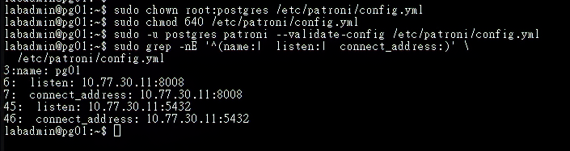
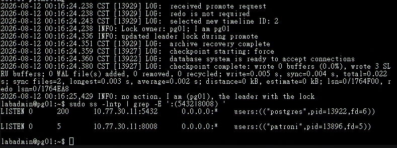
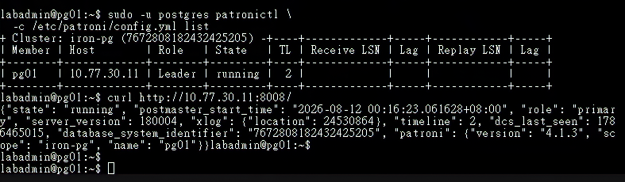
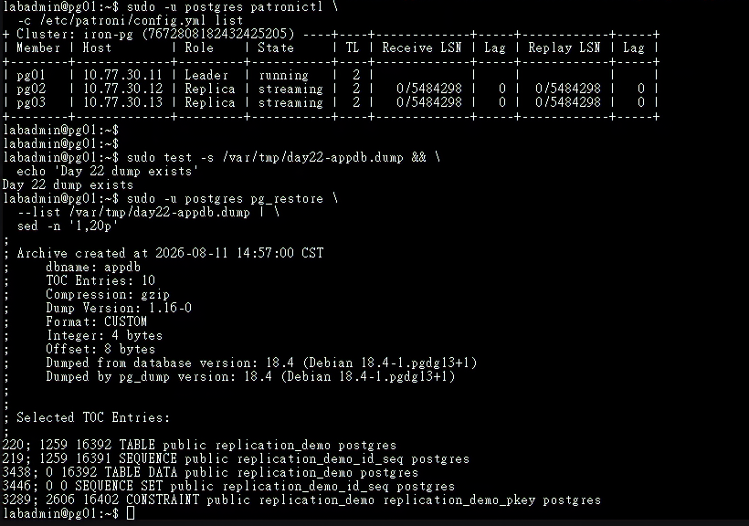
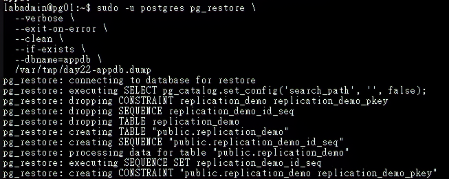
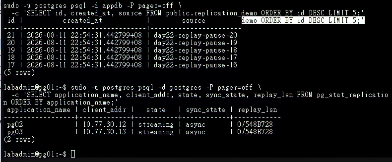
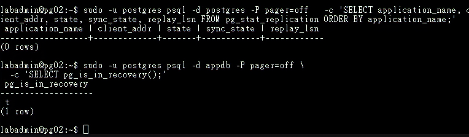
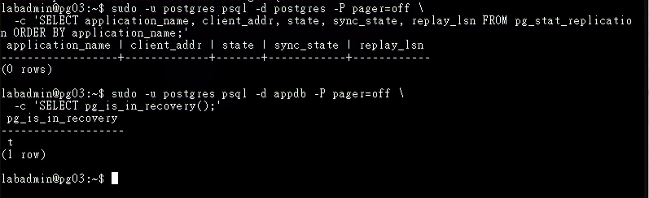

# Day 23｜PostgreSQL HA 叢集實作（上）：使用 Patroni 完成自動選主與狀態管理

對應文章：[Day 23｜PostgreSQL HA 叢集實作（上）：使用 Patroni 完成自動選主與狀態管理](https://ithelp.ithome.com.tw/users/20183351/ironman/9461)

既有的手動串流複寫已完成教學目的。本日先保存邏輯備份與舊資料目錄，再建立新的 Patroni 資料目錄；後續由 Patroni 統一管理資料庫角色與生命週期。

## 本日操作順序

1. 先在 pg01 確認既有邏輯備份可讀，再逐台停止原本由 `postgresql.service` 管理的服務。
2. 逐台安裝 Patroni 並準備讀取 etcd 的 TLS 憑證。
3. 逐台建立 `/etc/patroni/config.yml`。`scope` 相同，`name`、`listen` 與 `connect_address` 各自不同。
4. 逐台建立 systemd 服務單元（Unit），並在下一節依序啟動。
5. 先啟動 pg01 並確認成為 Leader，再啟動 pg02，最後啟動 pg03。
6. 建立 PostgreSQL 與 Patroni 的主機防火牆規則，完成允許與阻擋測試。
7. 只在目前 Leader 還原既有測試資料，最後從三台確認角色。

## 1. 安裝 Patroni

**操作順序：先在 pg01 確認邏輯備份，再到 pg01、pg02、pg03 逐台安裝並保存舊資料目錄。**

先在 pg01 確認邏輯備份存在，而且 `pg_restore` 能讀取內容：

```bash
sudo test -s /var/tmp/day22-appdb.dump && \
  echo 'existing dump is readable'

sudo -u postgres pg_restore \
  --list /var/tmp/day22-appdb.dump | \
  sed -n '1,20p'
```

第一條必須顯示 `existing dump is readable`，第二條必須列出備份標頭與物件清單。兩項都成功後，再依序到 pg01、pg02、pg03 執行：

```bash
sudo apt update
sudo apt install -y patroni python3-psycopg2 python3-etcd
patroni --version
patronictl version
python3 -c 'import etcd; print(etcd.__file__)'
sudo systemctl disable --now postgresql
sudo pg_lsclusters
```

Patroni 的 `etcd3` DCS 實作需要 `python-etcd` 模組，在 Debian 13 的套件名稱是 `python3-etcd`。名稱相近的 `python3-etcd3gw` 是另一套 etcd 用戶端，無法讓 Patroni 載入 `patroni.dcs.etcd3`。最後一條匯入指令必須輸出 `etcd` 模組路徑；出現 `ModuleNotFoundError` 時先修正套件相依性。

`pg_lsclusters` 必須顯示 `18 main` 的狀態為 `down`。確認套件管理的 PostgreSQL 已停止後，再在三台節點各自保存原資料目錄並建立 Patroni 資料目錄：

```bash
sudo test ! -e /var/lib/postgresql/18/main.day22 && \
  sudo test -d /var/lib/postgresql/18/main && \
  sudo mv /var/lib/postgresql/18/main /var/lib/postgresql/18/main.day22 && \
  sudo install -d -m 700 -o postgres -g postgres \
    /var/lib/postgresql/18/patroni
```

這組指令只在原資料目錄存在且 `main.day22` 尚未建立時執行移動；若命令鏈中止，先檢查兩個路徑，確認內容後再繼續。原本的手動叢集會保存在 `main.day22`，可供後續復原使用。

## 2. 準備 Patroni 讀取 etcd 的 TLS 憑證

**操作節點：pg01、pg02、pg03。每台安裝自己的用戶端憑證與私鑰。**

etcd 的私鑰只授權 `etcd` 讀取。每台另外建立一份由 Patroni 使用的受限副本：

```bash
sudo install -d -m 750 -o root -g postgres /etc/patroni/etcd-tls
sudo install -m 644 -o root -g postgres /etc/etcd/tls/ca.crt /etc/patroni/etcd-tls/ca.crt
sudo install -m 640 -o root -g postgres /etc/etcd/tls/node.crt /etc/patroni/etcd-tls/node.crt
sudo install -m 640 -o root -g postgres /etc/etcd/tls/node.key /etc/patroni/etcd-tls/node.key
sudo -u postgres test -r /etc/patroni/etcd-tls/node.key
```

## 3. 建立 Patroni 設定

**操作節點：pg01、pg02、pg03。三台各自建立完整設定檔，不把 pg01 的檔案直接複製到另外兩台。**

三份設定的 `scope`、`namespace`、etcd 端點、首次建立設定與驗證資訊必須一致；`name`、REST API 位址與 PostgreSQL 位址則必須使用目前節點自己的值。為避免複製後漏改 IP，以下分別提供三台的完整內容。

### 3.1 建立 pg01 設定

操作位置：pg01 Console。

```bash
sudo install -d -m 750 -o root -g postgres /etc/patroni
sudo nano /etc/patroni/config.yml
```

```yaml
scope: iron-pg
namespace: /service/
name: pg01

restapi:
  listen: 10.77.30.11:8008
  connect_address: 10.77.30.11:8008
  allowlist:
    - 10.77.30.11
    - 10.77.30.12
    - 10.77.30.13

etcd3:
  hosts: 10.77.30.11:2379,10.77.30.12:2379,10.77.30.13:2379
  protocol: https
  cacert: /etc/patroni/etcd-tls/ca.crt
  cert: /etc/patroni/etcd-tls/node.crt
  key: /etc/patroni/etcd-tls/node.key

bootstrap:
  dcs:
    ttl: 30
    loop_wait: 10
    retry_timeout: 10
    maximum_lag_on_failover: 1048576
    postgresql:
      use_pg_rewind: true
      use_slots: true
      parameters:
        wal_level: replica
        hot_standby: "on"
        wal_log_hints: "on"
        max_wal_senders: 10
        max_replication_slots: 10
        password_encryption: scram-sha-256
        ssl: "on"
        ssl_cert_file: /etc/postgresql/tls/server.crt
        ssl_key_file: /etc/postgresql/tls/server.key
        ssl_ca_file: /etc/postgresql/tls/ca.crt
  initdb:
    - encoding: UTF8
    - data-checksums
  pg_hba:
    - local all all peer
    - hostssl replication replication_user 10.77.30.0/24 scram-sha-256
    - hostssl postgres rewind_user 10.77.30.0/24 scram-sha-256
    - host all all 0.0.0.0/0 reject

postgresql:
  use_unix_socket: true
  listen: 10.77.30.11:5432
  connect_address: 10.77.30.11:5432
  data_dir: /var/lib/postgresql/18/patroni
  bin_dir: /usr/lib/postgresql/18/bin
  pgpass: /var/lib/postgresql/.pgpass-patroni
  authentication:
    replication:
      username: replication_user
      password: 實際複寫密碼
    superuser:
      username: postgres
      password: 實際管理密碼
    rewind:
      username: rewind_user
      password: 實際Rewind密碼
  parameters:
    unix_socket_directories: /var/run/postgresql

tags:
  nofailover: false
  noloadbalance: false
  clonefrom: false
  nosync: false
```

將三個 `password` 值換成本次 Lab 實際使用的複寫、postgres 與 Rewind 密碼。密碼不得出現在 Git、文件或公開畫面；正式環境應由設定管理系統（Configuration Management）或祕密儲存服務（Secret Store）產生設定檔。

儲存後先設定權限並驗證 pg01：

```bash
sudo chown root:postgres /etc/patroni/config.yml
sudo chmod 640 /etc/patroni/config.yml
sudo -u postgres patroni --validate-config /etc/patroni/config.yml
```



圖（一）pg01 的 Patroni 設定通過語法驗證，節點名稱、REST API 與 PostgreSQL 位址均使用 `10.77.30.11`。

驗證成功後才繼續 pg02。

### 3.2 建立 pg02 設定

操作位置：pg02 Console。

```bash
sudo install -d -m 750 -o root -g postgres /etc/patroni
sudo nano /etc/patroni/config.yml
```

```yaml
scope: iron-pg
namespace: /service/
name: pg02

restapi:
  listen: 10.77.30.12:8008
  connect_address: 10.77.30.12:8008
  allowlist:
    - 10.77.30.11
    - 10.77.30.12
    - 10.77.30.13

etcd3:
  hosts: 10.77.30.11:2379,10.77.30.12:2379,10.77.30.13:2379
  protocol: https
  cacert: /etc/patroni/etcd-tls/ca.crt
  cert: /etc/patroni/etcd-tls/node.crt
  key: /etc/patroni/etcd-tls/node.key

bootstrap:
  dcs:
    ttl: 30
    loop_wait: 10
    retry_timeout: 10
    maximum_lag_on_failover: 1048576
    postgresql:
      use_pg_rewind: true
      use_slots: true
      parameters:
        wal_level: replica
        hot_standby: "on"
        wal_log_hints: "on"
        max_wal_senders: 10
        max_replication_slots: 10
        password_encryption: scram-sha-256
        ssl: "on"
        ssl_cert_file: /etc/postgresql/tls/server.crt
        ssl_key_file: /etc/postgresql/tls/server.key
        ssl_ca_file: /etc/postgresql/tls/ca.crt
  initdb:
    - encoding: UTF8
    - data-checksums
  pg_hba:
    - local all all peer
    - hostssl replication replication_user 10.77.30.0/24 scram-sha-256
    - hostssl postgres rewind_user 10.77.30.0/24 scram-sha-256
    - host all all 0.0.0.0/0 reject

postgresql:
  use_unix_socket: true
  listen: 10.77.30.12:5432
  connect_address: 10.77.30.12:5432
  data_dir: /var/lib/postgresql/18/patroni
  bin_dir: /usr/lib/postgresql/18/bin
  pgpass: /var/lib/postgresql/.pgpass-patroni
  authentication:
    replication:
      username: replication_user
      password: 實際複寫密碼
    superuser:
      username: postgres
      password: 實際管理密碼
    rewind:
      username: rewind_user
      password: 實際Rewind密碼
  parameters:
    unix_socket_directories: /var/run/postgresql

tags:
  nofailover: false
  noloadbalance: false
  clonefrom: false
  nosync: false
```

儲存後設定權限並驗證 pg02：

```bash
sudo chown root:postgres /etc/patroni/config.yml
sudo chmod 640 /etc/patroni/config.yml
sudo -u postgres patroni --validate-config /etc/patroni/config.yml
```

確認沒有顯示設定驗證錯誤後才繼續 pg03。

### 3.3 建立 pg03 設定

操作位置：pg03 Console。

```bash
sudo install -d -m 750 -o root -g postgres /etc/patroni
sudo nano /etc/patroni/config.yml
```

```yaml
scope: iron-pg
namespace: /service/
name: pg03

restapi:
  listen: 10.77.30.13:8008
  connect_address: 10.77.30.13:8008
  allowlist:
    - 10.77.30.11
    - 10.77.30.12
    - 10.77.30.13

etcd3:
  hosts: 10.77.30.11:2379,10.77.30.12:2379,10.77.30.13:2379
  protocol: https
  cacert: /etc/patroni/etcd-tls/ca.crt
  cert: /etc/patroni/etcd-tls/node.crt
  key: /etc/patroni/etcd-tls/node.key

bootstrap:
  dcs:
    ttl: 30
    loop_wait: 10
    retry_timeout: 10
    maximum_lag_on_failover: 1048576
    postgresql:
      use_pg_rewind: true
      use_slots: true
      parameters:
        wal_level: replica
        hot_standby: "on"
        wal_log_hints: "on"
        max_wal_senders: 10
        max_replication_slots: 10
        password_encryption: scram-sha-256
        ssl: "on"
        ssl_cert_file: /etc/postgresql/tls/server.crt
        ssl_key_file: /etc/postgresql/tls/server.key
        ssl_ca_file: /etc/postgresql/tls/ca.crt
  initdb:
    - encoding: UTF8
    - data-checksums
  pg_hba:
    - local all all peer
    - hostssl replication replication_user 10.77.30.0/24 scram-sha-256
    - hostssl postgres rewind_user 10.77.30.0/24 scram-sha-256
    - host all all 0.0.0.0/0 reject

postgresql:
  use_unix_socket: true
  listen: 10.77.30.13:5432
  connect_address: 10.77.30.13:5432
  data_dir: /var/lib/postgresql/18/patroni
  bin_dir: /usr/lib/postgresql/18/bin
  pgpass: /var/lib/postgresql/.pgpass-patroni
  authentication:
    replication:
      username: replication_user
      password: 實際複寫密碼
    superuser:
      username: postgres
      password: 實際管理密碼
    rewind:
      username: rewind_user
      password: 實際Rewind密碼
  parameters:
    unix_socket_directories: /var/run/postgresql

tags:
  nofailover: false
  noloadbalance: false
  clonefrom: false
  nosync: false
```

儲存後設定權限並驗證 pg03：

```bash
sudo chown root:postgres /etc/patroni/config.yml
sudo chmod 640 /etc/patroni/config.yml
sudo -u postgres patroni --validate-config /etc/patroni/config.yml
```

三台都通過驗證後，分別執行下列指令核對最容易複製錯誤的欄位：

```bash
sudo grep -nE '^(name:|  listen:|  connect_address:)' \
  /etc/patroni/config.yml
```

- pg01 只能出現 `name: pg01` 與 `10.77.30.11`。
- pg02 只能出現 `name: pg02` 與 `10.77.30.12`。
- pg03 只能出現 `name: pg03` 與 `10.77.30.13`。

三份設定都必須保留 `postgresql.use_unix_socket: true`。Patroni 會把 `connect_address` 公告為節點的 TCP 5432，供 Replica 與後續 HAProxy 使用；管理本機 PostgreSQL 時則優先使用 `/var/run/postgresql` Unix Socket，讓系統帳號 `postgres` 通過 `local all all peer` 完成首次建立後的操作。省略這項設定時，Patroni 會從本機 IP 回連 5432，並被最後一條 `host all all 0.0.0.0/0 reject` 擋下。

啟動前還要特別核對 Rewind 的三個部分，三者缺一不可：

1. `bootstrap.dcs.postgresql.use_pg_rewind: true`：允許 Patroni 在 Timeline 分歧後使用 `pg_rewind`。
2. `bootstrap.pg_hba` 內有 `hostssl postgres rewind_user 10.77.30.0/24 scram-sha-256`：允許舊 Primary 連到新 Leader 的 `postgres` 資料庫。
3. `postgresql.authentication.rewind` 內有 `rewind_user` 與對應密碼：提供 Patroni 實際連線憑證。

本機初始 YAML 的正確層級是 `bootstrap.dcs.postgresql.use_pg_rewind` 與 `bootstrap.pg_hba`。第一次 Bootstrap 完成並寫入 DCS 後，`patronictl show-config` 會將動態設定顯示成 `postgresql.use_pg_rewind` 與 `postgresql.pg_hba`；請依這個層級讓 `pg_hba` 與 `parameters` 保持同層。

## 4. 建立 systemd 服務單元

**操作節點：pg01、pg02、pg03。此節只建立並啟用服務單元，先不啟動 Patroni。**

若套件沒有提供符合路徑的服務單元，建立 `/etc/systemd/system/patroni.service`：

```bash
sudo nano /etc/systemd/system/patroni.service
```

```ini
[Unit]
Description=Patroni PostgreSQL HA
After=network-online.target etcd.service
Wants=network-online.target

[Service]
Type=simple
User=postgres
Group=postgres
ExecStart=/usr/bin/patroni /etc/patroni/config.yml
ExecReload=/bin/kill -HUP $MAINPID
KillMode=process
TimeoutStopSec=30
Restart=on-failure
RestartSec=5

[Install]
WantedBy=multi-user.target
```

```bash
sudo systemctl daemon-reload
sudo systemctl enable patroni
systemctl is-enabled patroni
```

`systemctl daemon-reload` 讓 systemd 重新讀取剛建立的服務單元，`systemctl enable patroni` 則建立開機自動啟動關聯；此時服務保持 `inactive (dead)`。下一節會依 pg01 → pg02 → pg03 的順序使用 `enable --now` 啟動服務。

## 5. 依序啟動

**操作順序：pg01 → 確認 Leader → pg02 → 確認 Replica → pg03 → 確認 Replica。**

1. 只在 pg01 執行：

```bash
sudo -u postgres python3 -c \
  'import etcd; from patroni.dcs import etcd3; print("Patroni etcd3 driver: OK")'
sudo systemctl enable --now patroni
sudo systemctl status patroni -l --no-pager
sudo journalctl -u patroni -b -n 100 -o cat --no-pager
```

匯入檢查必須先顯示 `Patroni etcd3 driver: OK`。若出現 `Failed to import patroni.dcs.etcd3` 或 `Available implementations: consul, kubernetes`，先停止 Patroni、安裝 `python3-etcd` 並再次確認，避免服務持續自動重啟。

若曾在缺少 `use_unix_socket: true` 時啟動，服務紀錄會出現 `pg_hba.conf rejects connection`、`Failed to bootstrap cluster`，Patroni 並會把失敗的資料目錄改名為 `patroni.failed`。先執行 `sudo systemctl stop patroni`，修正並驗證設定，再把這次失敗產生的 `patroni` 目錄另外改名保存、重建空目錄後重試；保存既有手動叢集的 `main.day22` 應維持原狀。

`enable --now` 中的 `enable` 設定開機自動啟動，`--now` 會立即啟動目前服務。單獨執行 `daemon-reload` 或 `enable` 時，Patroni 尚未開始監聽 Port。

2. 確認 pg01 成為 Leader，而且 PostgreSQL 5432 與 REST 8008 已開始監聽：

```bash
sudo ss -lntp | grep -E ':(5432|8008) '
sudo -u postgres patronictl \
  -c /etc/patroni/config.yml list
curl http://10.77.30.11:8008/
```

`/etc/patroni/config.yml` 權限是 `0640 root:postgres`，請使用 `sudo -u postgres` 執行 `patronictl`。pg01 顯示 Leader 後即可繼續。



圖（二）Patroni 已將 pg01 提升為 Leader，PostgreSQL 5432 與 Patroni REST API 8008 均開始監聽。



圖（三）`patronictl list` 顯示 pg01 是唯一 Leader，REST API 同時回傳 pg01 的 Primary 角色與 Patroni 版本。

3. 到 pg02 啟動 Patroni：

```bash
sudo -u postgres python3 -c \
  'import etcd; from patroni.dcs import etcd3; print("Patroni etcd3 driver: OK")'
sudo systemctl enable --now patroni
sudo systemctl status patroni -l --no-pager
sudo journalctl -u patroni -b -n 100 -o cat --no-pager
```

回到 pg01 查看叢集，等 pg02 完成基礎備份並顯示 `Replica`、`streaming`：

```bash
sudo -u postgres patronictl \
  -c /etc/patroni/config.yml list
```

4. pg02 穩定後，到 pg03 執行同一組啟動命令：

```bash
sudo -u postgres python3 -c \
  'import etcd; from patroni.dcs import etcd3; print("Patroni etcd3 driver: OK")'
sudo systemctl enable --now patroni
sudo systemctl status patroni -l --no-pager
sudo journalctl -u patroni -b -n 100 -o cat --no-pager
```

再次回到 pg01，確認 pg02、pg03 都顯示 `Replica`、`streaming`：

```bash
sudo -u postgres patronictl \
  -c /etc/patroni/config.yml list
```

三台都加入後，在 pg01 驗證第一次 Bootstrap 寫入 DCS 的設定，以及 Leader 實際載入的 HBA。這項檢查要在任何角色切換測試前完成：

```bash
sudo -u postgres patronictl \
  -c /etc/patroni/config.yml \
  show-config iron-pg

sudo -u postgres psql -d postgres -P pager=off \
  -c "SELECT line_number,type,database,user_name,address,auth_method,error
      FROM pg_hba_file_rules
      WHERE user_name @> ARRAY['rewind_user']::name[]
      ORDER BY line_number;"
```

`show-config` 中的 `postgresql.use_pg_rewind` 必須是 `true`；查詢結果必須看到 `hostssl postgres rewind_user 10.77.30.0/24 scram-sha-256`，且 `error` 為空。`pg_rewind` 除了帳號密碼，也需要這條 HBA 授權舊 Primary 連到新 Leader；時間軸分歧後才能執行復原。

`bootstrap.dcs` 與 `bootstrap.pg_hba` 只在第一次建立叢集時生效。若這裡檢查失敗，代表叢集已用不完整設定建立；後續修正需要直接更新 DCS 的動態設定。先在 pg01 合併以下設定：

```bash
sudo -u postgres patronictl \
  -c /etc/patroni/config.yml \
  edit-config iron-pg \
  --apply - \
  --force <<'YAML'
postgresql:
  pg_hba:
    - local all all peer
    - hostssl replication replication_user 10.77.30.0/24 scram-sha-256
    - hostssl postgres rewind_user 10.77.30.0/24 scram-sha-256
    - host all all 0.0.0.0/0 reject
  use_pg_rewind: true
YAML
```

結尾的 `YAML` 必須從行首開始、單獨一行且前後沒有空白；若終端機持續顯示 `>`，按 `Ctrl+C` 取消後重新輸入。接著套用並再次驗證：

```bash
sudo -u postgres patronictl \
  -c /etc/patroni/config.yml \
  reload iron-pg --force

sleep 12

sudo -u postgres patronictl \
  -c /etc/patroni/config.yml \
  show-config iron-pg

sudo -u postgres psql -d postgres -P pager=off \
  -c "SELECT line_number,type,database,user_name,address,auth_method,error
      FROM pg_hba_file_rules
      WHERE user_name @> ARRAY['rewind_user']::name[]
      ORDER BY line_number;"
```

確認動態設定與實際 HBA 都正確後，再進行角色切換與故障測試。

三台設定中的 `restapi.allowlist` 只允許 pg01～pg03 呼叫會改變叢集狀態的 REST 方法；代理服務與監控使用的 `GET` 健康檢查維持可讀。正式環境可依風險再配置 REST TLS 與驗證，並將管理介面限制在受控來源。

## 6. 限制 PostgreSQL 與 Patroni 的連線來源

**操作節點：先在 pg01、pg02、pg03 建立相同規則，再從 pg01 與 ca01 分別執行允許及阻擋測試。**

三台資料庫節點需要互相存取 PostgreSQL 5432 與 Patroni 8008。後續的 proxy01、proxy02 需要查詢 Patroni 角色並連線 PostgreSQL，monitor01 則需要讀取 Patroni 狀態，因此先把這些規劃來源加入主機防火牆。跨 VLAN 流量依舊受到 OPNsense 規則控制，尚未建立對應規則的來源無法只靠這份主機規則跨越 VLAN。

到 pg01、pg02、pg03 逐台備份並編輯 `/etc/nftables.conf`：

```bash
sudo test -e /etc/nftables.conf.before-day23 || \
  sudo cp -a /etc/nftables.conf /etc/nftables.conf.before-day23
sudo nano /etc/nftables.conf
```

保留原本的 `flush ruleset` 與 Day 22 etcd 規則，在檔案末端加入以下獨立資料表：

```nftables
table inet day23_postgresql {
  chain input {
    type filter hook input priority filter; policy accept;

    iifname "lo" tcp dport { 5432, 8008 } accept
    ip saddr { 10.77.30.11, 10.77.30.12, 10.77.30.13 } tcp dport { 5432, 8008 } accept
    ip saddr { 10.77.20.21, 10.77.20.22 } tcp dport { 5432, 8008 } accept
    ip saddr 10.77.20.51 tcp dport 8008 accept
    tcp dport { 5432, 8008 } drop
  }
}
```

先檢查完整規則檔語法，再重新載入並確認新資料表存在：

```bash
sudo nft --check --file /etc/nftables.conf
sudo systemctl reload nftables
sudo nft list table inet day23_postgresql
```

三台都完成後，在 pg01 確認資料庫節點之間的兩個連接埠皆可連線：

```bash
for host in 10.77.30.11 10.77.30.12 10.77.30.13; do
  nc -vz -w 3 "$host" 5432
  nc -vz -w 3 "$host" 8008
done
```

六次測試都應成功。接著開啟 ca01 Console，確認未列入允許來源的 ca01 無法直接連線 pg01 的兩個連接埠：

```bash
for port in 5432 8008; do
  if timeout 3 bash -c "</dev/tcp/10.77.30.11/${port}"; then
    echo "UNEXPECTED: ${port} reachable"
  else
    echo "BLOCKED: ${port}"
  fi
done
```

兩次都應顯示 `BLOCKED`。此時 pg01 的服務已在監聽，前一項允許測試也已成功，因此這項結果用來驗證主機防火牆阻擋未授權來源。`restapi.allowlist` 另外限制會變更叢集狀態的 REST 方法，和連接埠層級的 nftables 規則共同形成兩層保護。

## 7. 還原既有測試資料

**操作順序：先在 pg01 確認 Leader 與邏輯備份，再只對 Leader 還原；最後分別到 pg02、pg03 查詢 Replica。**

### 7.1 確認 pg01 是目前 Leader

操作位置：pg01 Console。

```bash
sudo -u postgres patronictl \
  -c /etc/patroni/config.yml list
```

本日依序從 pg01 建立叢集，因此這裡預期 pg01 顯示 `Leader`，pg02、pg03 顯示 `Replica`。既有邏輯備份只保存在 pg01；確認 pg01 維持 Leader 後，再依下一節執行還原。若角色與預期不同，先回第 5 節確認啟動順序與叢集狀態。

### 7.2 確認邏輯備份存在而且可讀

操作位置：pg01 Console。

```bash
sudo test -s /var/tmp/day22-appdb.dump && \
  echo 'existing dump is readable'

sudo -u postgres pg_restore \
  --list /var/tmp/day22-appdb.dump | \
  sed -n '1,20p'
```

第一條必須顯示 `existing dump is readable`，第二條必須列出備份標頭與物件清單。若檔案不存在、大小為 0 或 `pg_restore --list` 報錯，先停止本節並修正備份問題，再建立 `appdb`。



圖（四）pg01 是 Leader、pg02 與 pg03 均為串流中的 Replica，既有邏輯備份也能列出物件清單。

### 7.3 在 Leader 建立 appdb

操作位置：pg01 Console。

先確認新叢集尚未存在 `appdb`：

```bash
sudo -u postgres psql -Atqc \
  "SELECT datname FROM pg_database WHERE datname = 'appdb';"
```

正常的新叢集不會輸出任何內容。接著建立資料庫：

```bash
sudo -u postgres createdb appdb
```

如果查詢已經顯示 `appdb`，先確認它是否由前一次失敗的還原操作留下，再決定是否清理；已存在的資料庫不需重複執行 `createdb`。

### 7.4 還原邏輯備份

操作位置：pg01 Console。

```bash
sudo -u postgres pg_restore \
  --verbose \
  --exit-on-error \
  --clean \
  --if-exists \
  --dbname=appdb \
  /var/tmp/day22-appdb.dump
```

`--clean --if-exists` 會先清理邏輯備份內的同名物件，`--exit-on-error` 會在發生錯誤時停止。命令回到終端機提示字元且沒有顯示錯誤後即可繼續。



圖（五）畫面顯示 `pg_restore` 正在目前 Leader pg01 建立 `replication_demo` 資料表、序列與主鍵；整體是否成功以上一段的命令結束狀態為準。

### 7.5 在 Leader 驗證資料

操作位置：pg01 Console。

```bash
sudo -u postgres psql -d appdb -P pager=off \
  -c '\dt public.*'

sudo -u postgres psql -d appdb -P pager=off \
  -c 'SELECT count(*) AS rows, min(id) AS first_id, max(id) AS last_id FROM public.replication_demo;'

sudo -u postgres psql -d appdb -P pager=off \
  -c 'SELECT id, created_at, source FROM public.replication_demo ORDER BY id DESC LIMIT 5;'
```

記錄 Leader 的資料筆數；先前實驗可能寫入不同數量，因此以三台查詢結果一致作為判讀條件。接著確認兩台 Replica 都已連線：

```bash
sudo -u postgres psql -d postgres -P pager=off \
  -c 'SELECT application_name, client_addr, state, sync_state, replay_lsn FROM pg_stat_replication ORDER BY application_name;'
```

預期看到 pg02、pg03 兩列，`state` 都是 `streaming`。若只有一列，先處理缺少的 Replica，不要直接宣告還原完成。



圖（六）pg01 能查到還原後的資料，`pg_stat_replication` 顯示 pg02、pg03 均維持非同步串流複寫。

### 7.6 到 pg02 驗證 Replica

操作位置：pg02 Console。

```bash
sudo -u postgres psql -d appdb -P pager=off \
  -c 'SELECT pg_is_in_recovery();'

sudo -u postgres psql -d appdb -P pager=off \
  -c 'SELECT count(*) AS rows, min(id) AS first_id, max(id) AS last_id FROM public.replication_demo;'

sudo -u postgres psql -d appdb -P pager=off \
  -c 'SELECT id, created_at, source FROM public.replication_demo ORDER BY id DESC LIMIT 5;'
```

`pg_is_in_recovery()` 必須是 `t`，資料筆數與最後五筆資料必須和 pg01 一致。若剛還原完暫時查不到資料表，先等待 Replica 重播 WAL 後重新查詢；資料表應由串流複寫取得。



圖（七）pg02 的 `pg_is_in_recovery()` 回傳 `t`；Replica 沒有下游節點，因此本機 `pg_stat_replication` 為空。

### 7.7 到 pg03 驗證 Replica

操作位置：pg03 Console，執行和 pg02 完全相同的三條查詢：

```bash
sudo -u postgres psql -d appdb -P pager=off \
  -c 'SELECT pg_is_in_recovery();'

sudo -u postgres psql -d appdb -P pager=off \
  -c 'SELECT count(*) AS rows, min(id) AS first_id, max(id) AS last_id FROM public.replication_demo;'

sudo -u postgres psql -d appdb -P pager=off \
  -c 'SELECT id, created_at, source FROM public.replication_demo ORDER BY id DESC LIMIT 5;'
```

pg03 同樣必須是復原狀態，資料筆數與內容必須和 pg01、pg02 一致。完成本節即可確認既有測試資料已由 Patroni 叢集複寫。`app_owner`、`app_rw`、`app_ro` 等應用程式角色由 Web 後端部署流程建立。



圖（八）pg03 的 `pg_is_in_recovery()` 回傳 `t`；Replica 沒有下游節點，因此本機 `pg_stat_replication` 為空。

## 8. 驗證責任邊界

**操作節點：從任一健康節點查詢叢集，再分別登入 pg01、pg02、pg03 驗證本機角色。**

```bash
sudo -u postgres patronictl -c /etc/patroni/config.yml list
sudo -u postgres psql -c 'SELECT pg_is_in_recovery();'
curl -i http://10.77.30.11:8008/primary
curl -i http://10.77.30.12:8008/replica
```

後續使用 Patroni 或 `patronictl` 停止／啟動資料庫，讓 Patroni 持續作為本次 PostgreSQL 執行個體的唯一控制來源。套件預設的 `postgresql.service` 保持停用，也不要手動啟動 `postgresql@18-main`，以免舊叢集和 Patroni 競爭連接埠與資料目錄。
