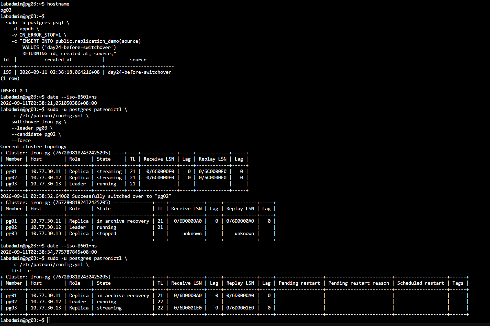
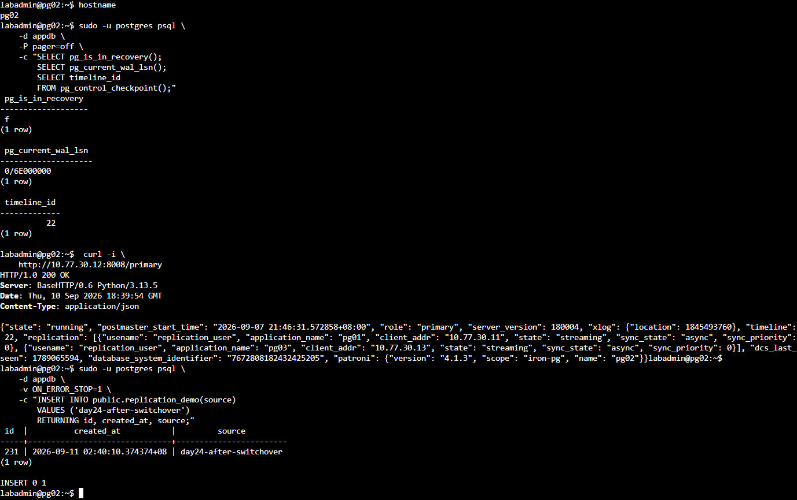
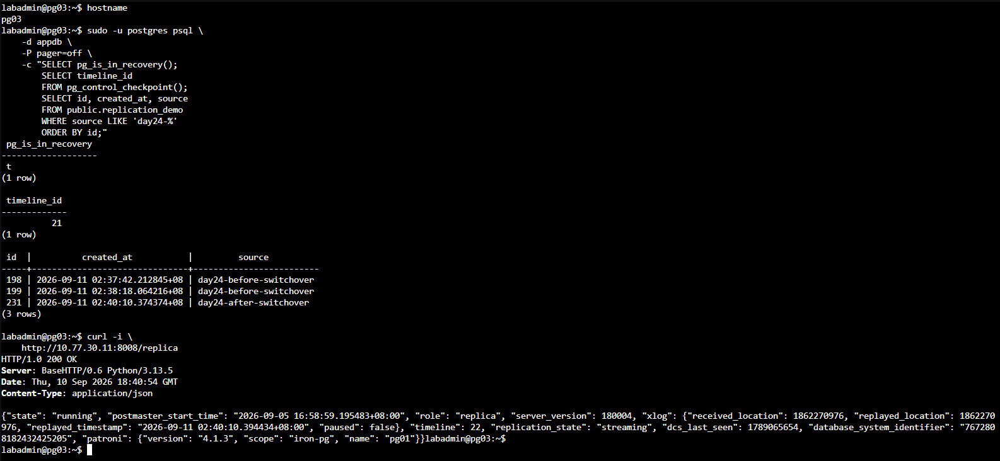
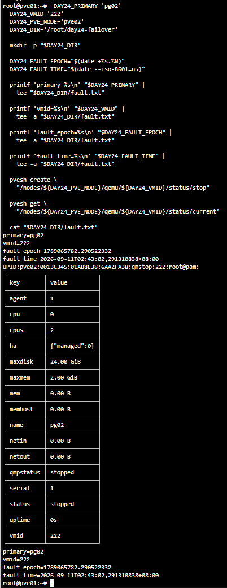
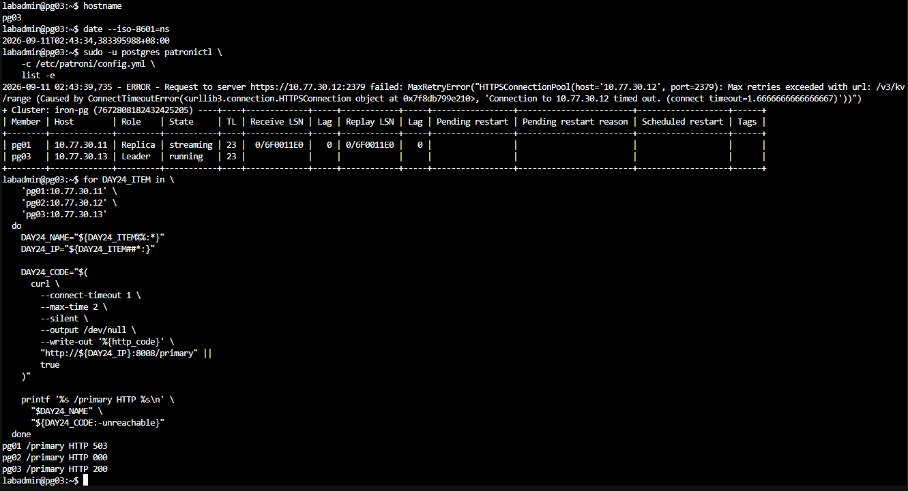
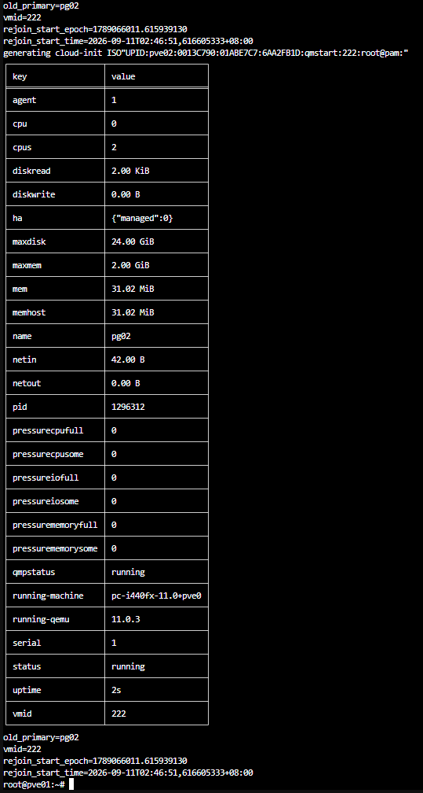
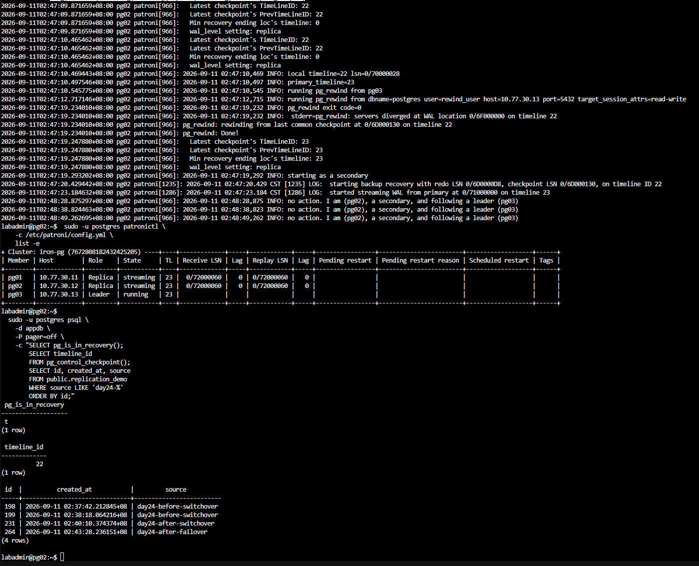

# Day 24｜PostgreSQL HA 叢集實作（下）：計畫性切換、故障切換與舊 Primary 安全回歸

對應文章：[Day 24｜PostgreSQL HA 叢集實作（下）：計畫性切換、故障切換與舊 Primary 安全回歸](https://ithelp.ithome.com.tw/users/20183351/ironman/9461)

本日使用先前串流複寫實作建立的 `appdb.public.replication_demo` 測試資料。開始前要確認 3／3 etcd 與 3／3 Patroni 成員健康，並保存目前時間軸（Timeline）、Leader 與複寫狀態。

> 額外量測：[Primary 故障切換與舊 Primary 重新加入時間](./DAY24_額外實作_量測Failover與Rejoin時間.md)

## 本日操作順序

1. 從任一健康 PostgreSQL 節點記錄目前 Leader、時間軸、LSN 與複寫狀態。
2. 先執行計畫性切換（Planned Switchover），確認新舊角色正常後恢復 3／3 健康。
3. 再停止當下的 Leader，觸發非計畫性故障切換（Unplanned Failover）。操作前必須核對實際角色。
4. 確認新 Leader 可寫、Replica 已追上後，再讓舊 Primary 重新加入（Rejoin）。

每個實驗一次只注入一種故障。前一個實驗未恢復 3/3 健康前，不進入下一節。

## 1. 建立切換前基準

**操作順序：先從任一 PostgreSQL 節點找出 Leader，再到目前 Leader 執行 SQL。**

在任一 PostgreSQL 節點執行：

```bash
sudo -u postgres patronictl -c /etc/patroni/config.yml list -e
```

記下 Role 為 `Leader` 的節點名稱。本次實測為 pg03；若畫面顯示其他節點，後面的 Leader 操作要跟著實際結果調整。

在進行任何切換前，先確認 DCS 中的動態設定同時包含正確層級的 `pg_hba` 與 `use_pg_rewind`：

```bash
sudo -u postgres patronictl \
  -c /etc/patroni/config.yml \
  show-config iron-pg

sudo -u postgres psql -d postgres -P pager=off \
  -c "SELECT line_number,type,database,user_name,address,auth_method,error
      FROM pg_hba_file_rules
      WHERE user_name @> ARRAY['rewind_user']::name[]
      ORDER BY line_number;"
```

這裡複查先前建立的 Rewind 設定。`postgresql.use_pg_rewind` 必須為 `true`，並且存在 `hostssl postgres rewind_user 10.77.30.0/24 scram-sha-256` 且 `error` 為空的 HBA 規則。條件不符時先修正設定，再開始角色切換實驗。

在本次實測的 Leader pg03 執行：

```bash
sudo -u postgres psql -d appdb -P pager=off
```

進入 `psql` 後執行：

```sql
SELECT pg_is_in_recovery();
SELECT pg_current_wal_lsn();
SELECT timeline_id FROM pg_control_checkpoint();
SELECT application_name,
       client_addr,
       state,
       sync_state,
       replay_lsn
FROM pg_stat_replication
ORDER BY application_name;
SELECT count(*) FROM public.replication_demo;
\q
```

預期 `pg_is_in_recovery()` 為 `f`，而 `pg_stat_replication` 可看到兩個 `streaming` Replica。先寫入一筆切換前資料：

```bash
sudo -u postgres psql -d appdb -v ON_ERROR_STOP=1 \
  -c "INSERT INTO public.replication_demo(source) VALUES ('day24-before-switchover') RETURNING id,created_at,source;"
```

本日量測 Patroni 角色變化、REST 端點與資料庫可寫時間。完整用戶端 RTO 要等代理、固定入口與應用程式完成後一起量測。

## 2. 計畫性切換

**操作位置：任一健康 PostgreSQL 節點。先讀取當下角色，再選一台狀態為 `streaming` 且 Lag 為 0 的 Replica。**

先確認狀態：

```bash
sudo -u postgres patronictl -c /etc/patroni/config.yml list -e
```

本次實測的 Leader 是 pg03、候選是 pg02，因此執行：

```bash
date -Is
sudo -u postgres patronictl -c /etc/patroni/config.yml \
  switchover iron-pg --leader pg03 --candidate pg02 --force
```

若目前角色不同，將 `--leader` 與 `--candidate` 改成畫面中的實際名稱。切換完成後立即執行：

```bash
sudo -u postgres patronictl -c /etc/patroni/config.yml list -e
curl -i http://10.77.30.12:8008/primary
curl -i http://10.77.30.13:8008/replica
```

上例預期 pg02 的 `/primary` 與 pg03 的 `/replica` 都回應 HTTP 200。接著在新 Leader pg02 寫入資料：

```bash
sudo -u postgres psql -d appdb -v ON_ERROR_STOP=1 \
  -c "INSERT INTO public.replication_demo(source) VALUES ('day24-after-switchover') RETURNING id,created_at,source;"
```

到舊 Leader pg03 確認已成為 Replica 並能讀到新資料：

```bash
sudo -u postgres psql -d appdb -P pager=off \
  -c "SELECT pg_is_in_recovery(); SELECT id,source FROM public.replication_demo WHERE source LIKE 'day24-%' ORDER BY id;"
```

預期 `pg_is_in_recovery()` 為 `t`，並能看到切換前後兩筆資料。等 `patronictl list -e` 再次顯示三台 `running／streaming` 且 Lag 為 0，才進入下一節。



圖（一）本次實測由 pg03 切換至 pg02，切換前後分別保留可辨識的測試資料。



圖（二）pg02 的復原狀態為 `false`，`/primary` 回傳 HTTP 200，並能寫入切換後資料。



圖（三）原 Primary pg03 的 `pg_is_in_recovery()` 為 `t`，並能讀取由新 Primary 寫入的資料；畫面下方另外確認 pg01 的 `/replica` 回傳 HTTP 200。

## 3. 非計畫性故障切換

**操作順序：先找出當下 Leader，再從 PVE Web UI 強制停止該 Leader VM。這是 Lab 故障注入，不可在正式環境照做。**

先在任一存活 PostgreSQL 節點執行並記錄目前 Leader：

```bash
sudo -u postgres patronictl -c /etc/patroni/config.yml list -e
```

目前的 VM 對應如下：

- pg01：VM 221，位於 pve01。
- pg02：VM 222，位於 pve02。
- pg03：VM 223，位於 pve03。

在另一台 Replica 開啟觀察 Console：

```bash
watch -n 1 'sudo -u postgres patronictl -c /etc/patroni/config.yml list -e'
```

接著到 PVE Web UI：

1. 選取目前 Leader 對應的 VM。
2. 先再次核對 VM 名稱與 `patronictl` 顯示的 Leader 相同。
3. 記錄目前時間。
4. 按右上角 `Stop`，確認強制停止該 VM。
5. 不要停止第二台 PG VM，也不要停止存活節點的 etcd。
6. 回到觀察 Console，等待另一台 Replica 成為 Leader。

新 Leader 出現後按 `Ctrl+C` 離開 `watch`，再執行：

```bash
sudo -u postgres patronictl -c /etc/patroni/config.yml list -e
```

在新 Leader 寫入一筆資料。以下指令要在 Role 為 `Leader` 的節點執行：

```bash
sudo -u postgres psql -d appdb -v ON_ERROR_STOP=1 \
  -c "INSERT INTO public.replication_demo(source) VALUES ('day24-after-failover') RETURNING id,created_at,source;"
```

記錄故障注入時間、新 Leader 出現時間與第一筆 SQL 寫入成功時間。這些結果只涵蓋 PostgreSQL 節點的直接路徑；完整用戶端 RTO 還要納入 Nginx、HAProxy、VIP 與應用程式重連時間。需要重現正文的秒數時，使用前言連結的額外量測文件。



圖（四）停止當下的 Primary pg02，並保存 VMID 與故障注入時間。



圖（五）pg02 停止後，pg03 成為時間軸 23 的唯一 Leader；pg01 維持 Replica，pg02 無法連線。

## 4. 舊 Primary 重新加入

**操作位置：PVE Web UI 與剛才被停止的舊 Leader。先啟動 VM，再確認 Patroni 如何讓它以 Replica 身分回歸。**

1. 在 PVE Web UI 選取剛才停止的 VM。
2. 按 `Start`。
3. 開啟該 VM 的 Console，等待網路與 systemd 完成啟動。



圖（六）重新啟動舊 Primary pg02，讓 Patroni 接手後續的角色判斷與資料對齊。

在舊 Leader 執行：

```bash
sudo systemctl status patroni -l --no-pager
sudo journalctl -u patroni -b -n 100 -o cat --no-pager
sudo -u postgres patronictl -c /etc/patroni/config.yml list -e
sudo -u postgres psql -d appdb -Atqc 'SELECT pg_is_in_recovery();'
```

預期它以 Replica 身分回歸，`pg_is_in_recovery()` 為 `t`。再確認故障期間寫入的資料已同步回來：

```bash
sudo -u postgres psql -d appdb -P pager=off \
  -c "SELECT id,created_at,source FROM public.replication_demo WHERE source LIKE 'day24-%' ORDER BY id;"
```

若節點長時間停在 `starting`、`start failed` 或沒有成為 Replica，先保存 Log，不要立刻 `reinit`。在舊節點觀察：

```bash
sudo journalctl -u patroni -f -o cat
```

正常的時間軸分岔回歸流程會看到 Patroni 判斷資料分岔、執行 `pg_rewind`、以 Replica 身分啟動，最後成為 `streaming`。若看到以下訊息，先依第 1 節修正 DCS 動態設定與實際 HBA，再只重啟失敗節點的 Patroni：



圖（七）Patroni 使用 `pg_rewind` 對齊分岔的資料歷史，pg02 最後以 Replica 身分回歸，叢集恢復一個 Leader 與兩個串流複寫中的 Replica。

```text
pg_hba.conf rejects connection ... user "rewind_user"
requested timeline ... is not a child of this server's history
```

```bash
sudo systemctl restart patroni
sudo journalctl -u patroni -f -o cat
```

不要直接執行 `pg_ctl`，也不要重啟目前 Leader。`use_pg_rewind: true`、`wal_log_hints: on`／資料頁校驗和（Data Checksums）與 `pg_rewind` HBA 都正確，但 `pg_rewind` 執行失敗時，才在任一健康 PostgreSQL 節點執行最後手段：

```bash
sudo -u postgres patronictl -c /etc/patroni/config.yml list -e
sudo -u postgres patronictl -c /etc/patroni/config.yml \
  reinit iron-pg 舊節點名稱 --wait --force
```

將 `舊節點名稱` 換成實際失敗的 pg01、pg02 或 pg03。`reinit` 會刪除並由健康 Leader 重建該 Replica 的資料，只能對已確認失敗的 Replica 執行，不能對 Leader 或唯一健康副本執行。完成後再次確認三台都為 `running／streaming`、Timeline 一致、Lag 為 0。

## 5. 維持單一控制來源的操作原則

**本節只說明風險，不執行破壞性指令。**

- 不在舊 Primary 上直接執行 `pg_ctl start`。
- 不同時重建兩個 Replica。
- 不在角色未知時對 Data Directory 執行覆寫。
- 不把 PVE HA 重啟 VM 當成 Patroni Promotion。
