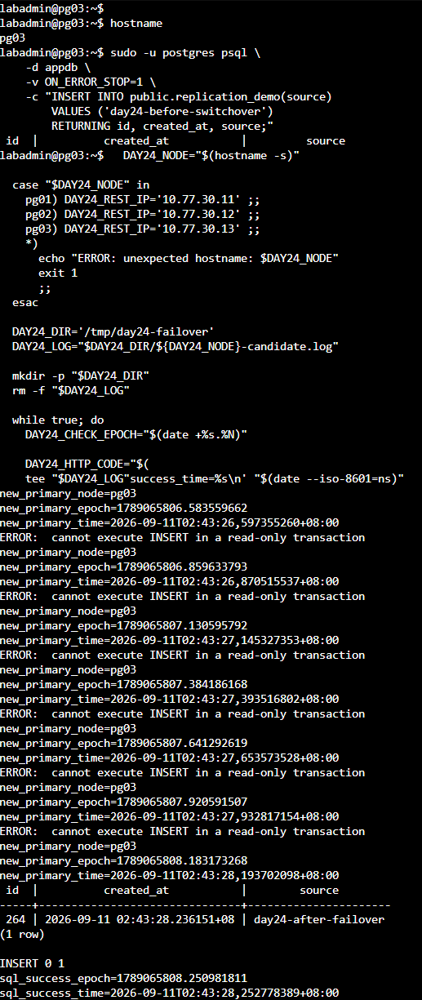
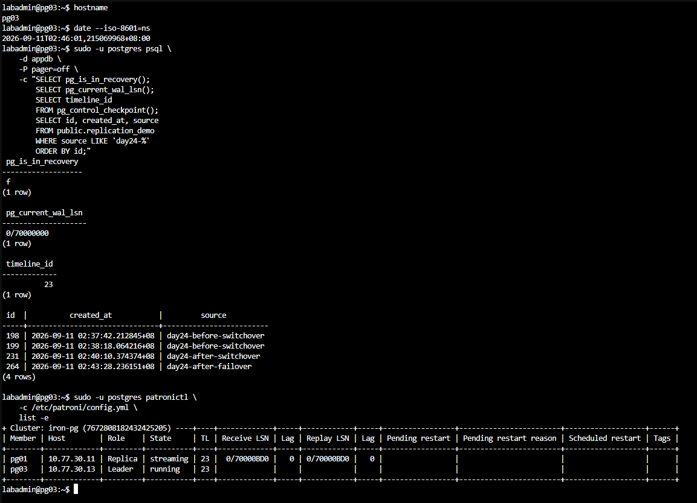
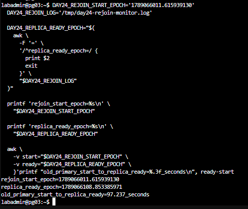

# Day 24 額外實作｜量測 Primary 故障切換與舊 Primary 重新加入時間

對應文章：[Day 24｜PostgreSQL HA 叢集實作（下）：計畫性切換、故障切換與舊 Primary 安全回歸](https://ithelp.ithome.com.tw/users/20183351/ironman/9461)

本文件接續 Day 24 主實作，以 0.2 秒探測分開記錄新 Primary 角色端點恢復、第一筆直接 SQL 寫入成功，以及舊 Primary 以 Replica 身分重新加入的時間。實驗會強制停止當下的 Primary VM，只適合可丟棄的 Lab。

| 時間點 | 事件 |
| --- | --- |
| T0 | 送出停止 Primary VM 指令 |
| T2 | 新 Primary 的 `/primary` 首次回傳 HTTP 200 |
| T3 | 新 Primary 第一筆直接 SQL 寫入成功 |
| T4 | 舊 Primary 的 `/replica` 首次回傳 HTTP 200 |

`T2 - T0` 是角色切換時間，`T3 - T0` 是直接 SQL 可寫恢復時間。這些結果尚未包含代理、固定入口與用戶端重連時間。

## 1. 確認健康基準

T0 由 PVE 節點記錄，T2、T3 與 T4 由 PostgreSQL 節點記錄。開始前先在參與量測的 PVE 與 PostgreSQL 節點執行：

```bash
timedatectl show -p NTPSynchronized --value
chronyc tracking
```

`NTPSynchronized` 應為 `yes`，`chronyc tracking` 的 `Leap status` 應為 `Normal`。兩端完成時間同步後，才計算跨主機時間差。

在任一 PostgreSQL 節點執行：

```bash
sudo -u postgres patronictl -c /etc/patroni/config.yml list -e
```

開始前應只有一台 Leader，兩台 Replica 的狀態為 `streaming`，Lag 為 0。在當下 Primary 寫入一筆故障前標記，並保留成功回傳：

```bash
DAY24_BEFORE_MARK="day24-before-failover-$(date +%s)"
sudo -u postgres psql -d appdb -v ON_ERROR_STOP=1 \
  -v marker="$DAY24_BEFORE_MARK" \
  -c "INSERT INTO public.replication_demo(source) VALUES (:'marker') RETURNING id,created_at,source;"
printf 'before_marker=%s\n' "$DAY24_BEFORE_MARK"
```

## 2. 在兩台 Replica 啟動候選節點探測

在兩台 Replica 分別開啟 Console，執行相同腳本。只有成為 Primary 的節點會取得 HTTP 200，並繼續嘗試 SQL 寫入。

```bash
DAY24_NODE="$(hostname -s)"
case "$DAY24_NODE" in
  pg01) DAY24_REST_IP='10.77.30.11' ;;
  pg02) DAY24_REST_IP='10.77.30.12' ;;
  pg03) DAY24_REST_IP='10.77.30.13' ;;
  *) echo "ERROR: unexpected hostname: $DAY24_NODE"; exit 1 ;;
esac

DAY24_DIR='/tmp/day24-failover'
DAY24_LOG="$DAY24_DIR/${DAY24_NODE}-candidate.log"
mkdir -p "$DAY24_DIR"
rm -f "$DAY24_LOG"

while true; do
  DAY24_CHECK_EPOCH="$(date +%s.%N)"
  DAY24_HTTP_CODE="$(curl -sS -o /dev/null -w '%{http_code}' \
    --connect-timeout 1 --max-time 1 \
    "http://${DAY24_REST_IP}:8008/primary" || true)"
  printf 'check_epoch=%s http_code=%s\n' \
    "$DAY24_CHECK_EPOCH" "$DAY24_HTTP_CODE" >> "$DAY24_LOG"

  if [ "$DAY24_HTTP_CODE" = '200' ]; then
    if ! grep -q '^new_primary_epoch=' "$DAY24_LOG"; then
      printf 'new_primary_node=%s\n' "$DAY24_NODE" | tee -a "$DAY24_LOG"
      printf 'new_primary_epoch=%s\n' "$DAY24_CHECK_EPOCH" | tee -a "$DAY24_LOG"
      printf 'new_primary_time=%s\n' "$(date --iso-8601=ns)" | tee -a "$DAY24_LOG"
    fi

    DAY24_SQL_OUTPUT="$(sudo -u postgres psql -d appdb -v ON_ERROR_STOP=1 \
      -c "INSERT INTO public.replication_demo(source) VALUES ('day24-after-failover') RETURNING id,created_at,source;" 2>&1)"
    DAY24_SQL_STATUS=$?
    printf '%s\n' "$DAY24_SQL_OUTPUT" | tee -a "$DAY24_LOG"
    if [ "$DAY24_SQL_STATUS" -eq 0 ]; then
      printf 'sql_success_epoch=%s\n' "$(date +%s.%N)" | tee -a "$DAY24_LOG"
      printf 'sql_success_time=%s\n' "$(date --iso-8601=ns)" | tee -a "$DAY24_LOG"
      break
    fi
  fi
  sleep 0.2
done
```

## 3. 記錄 T0 並停止當下 Primary VM

本次實測的 Primary 是 pg02，位於 pve02，VMID 為 222。在可操作 PVE Cluster API 的節點執行：

```bash
DAY24_PRIMARY='pg02'
DAY24_VMID='222'
DAY24_PVE_NODE='pve02'
DAY24_DIR='/root/day24-failover'
mkdir -p "$DAY24_DIR"

DAY24_FAULT_EPOCH="$(date +%s.%N)"
DAY24_FAULT_TIME="$(date --iso-8601=ns)"
printf 'primary=%s\n' "$DAY24_PRIMARY" | tee "$DAY24_DIR/fault.txt"
printf 'vmid=%s\n' "$DAY24_VMID" | tee -a "$DAY24_DIR/fault.txt"
printf 'fault_epoch=%s\n' "$DAY24_FAULT_EPOCH" | tee -a "$DAY24_DIR/fault.txt"
printf 'fault_time=%s\n' "$DAY24_FAULT_TIME" | tee -a "$DAY24_DIR/fault.txt"

pvesh create "/nodes/${DAY24_PVE_NODE}/qemu/${DAY24_VMID}/status/stop"
pvesh get "/nodes/${DAY24_PVE_NODE}/qemu/${DAY24_VMID}/status/current"
cat "$DAY24_DIR/fault.txt"
```

腳本會在呼叫停止 VM 的 PVE API 前立即記錄 T0，因此量測結果包含 PVE API 處理與 VM 停止所需的時間。


圖（一）停止當下 Primary pg02，同時保存 VMID、Epoch 與 ISO 8601 時間。

### 90 秒內沒有出現新 Primary 時安全復原

本 Lab 先以 90 秒作為單次觀察上限。兩台候選節點在停止指令送出後都沒有取得 `/primary` HTTP 200 時，依序執行：

1. 在兩個探測 Console 按 `Ctrl+C`，停止候選節點探測。
2. 保持各節點原有角色設定，不手動促升 Replica。
3. 回到 PVE 節點啟動剛才停止的 VM：

   ```bash
   pvesh create "/nodes/${DAY24_PVE_NODE}/qemu/${DAY24_VMID}/status/start"
   ```

4. 在各服務所在節點保存故障期間的 Patroni、PostgreSQL 與 etcd 紀錄；服務單元名稱不同時，改用環境中的實際名稱或 PostgreSQL 日誌路徑：

   ```bash
   sudo journalctl -u patroni --since '-10 min' --no-pager > /tmp/day24-patroni.log
   sudo journalctl -u postgresql --since '-10 min' --no-pager > /tmp/day24-postgresql.log
   sudo journalctl -u etcd --since '-10 min' --no-pager > /tmp/day24-etcd.log
   ```

5. 在 PostgreSQL 節點檢查叢集：

   ```bash
   sudo -u postgres patronictl -c /etc/patroni/config.yml list -e
   ```

看到一台 Leader、兩台狀態為 `streaming` 的 Replica 後，再根據紀錄排除 DCS、複寫延遲或候選資格問題。叢集恢復健康前先結束本次量測。

## 4. 計算角色切換與可寫恢復時間



圖（二）pg03 的 `/primary` 首次回傳 HTTP 200 後，SQL 經過短暫唯讀階段才成功寫入。

把 PVE 上 `fault.txt` 的 `fault_epoch` 複製到新 Primary，再執行：

```bash
DAY24_FAULT_EPOCH='1789065782.290522332'
DAY24_LOG='/tmp/day24-failover/pg03-candidate.log'
DAY24_NEW_PRIMARY_EPOCH="$(awk -F= '/^new_primary_epoch=/{print $2; exit}' "$DAY24_LOG")"
DAY24_SQL_SUCCESS_EPOCH="$(awk -F= '/^sql_success_epoch=/{print $2; exit}' "$DAY24_LOG")"
awk -v start="$DAY24_FAULT_EPOCH" \
  -v primary="$DAY24_NEW_PRIMARY_EPOCH" \
  -v sql="$DAY24_SQL_SUCCESS_EPOCH" \
  'BEGIN {
    printf "role_switch_seconds=%.3f\n", primary-start
    printf "direct_sql_write_seconds=%.3f\n", sql-start
  }'
```

上面的 Epoch 是本次實測值；重新執行時要換成自己 `fault.txt` 中的數值。本次角色端點恢復為 24.293 秒，第一筆直接 SQL 寫入成功為 25.960 秒。

新 Primary 的腳本結束後，到另一台候選節點按 `Ctrl+C` 停止探測。

再確認只有一個 Primary，並比較故障前後資料：

```bash
for ip in 10.77.30.11 10.77.30.12 10.77.30.13; do
  printf '%s ' "$ip"
  curl -sS -o /dev/null -w 'primary=%{http_code}\n' \
    --connect-timeout 1 --max-time 2 "http://${ip}:8008/primary" || echo 'unreachable'
done

sudo -u postgres patronictl -c /etc/patroni/config.yml list -e
sudo -u postgres psql -d appdb -P pager=off \
  -c "SELECT id,created_at,source FROM public.replication_demo WHERE source LIKE 'day24-%' ORDER BY id;"
```


圖（三）pg02 停止後，pg03 是時間軸 23 的唯一 Leader。



圖（四）新 Primary 保留本次故障前已確認的資料，並能接受故障後寫入。這項查詢只能判讀本次實驗是否觀察到資料遺失。

## 5. 量測舊 Primary 重新加入時間

先在存活的 PostgreSQL 節點啟動探測：

```bash
DAY24_OLD_PRIMARY_IP='10.77.30.12'
DAY24_DIR='/tmp/day24-rejoin'
DAY24_REJOIN_LOG="$DAY24_DIR/replica-monitor.log"
mkdir -p "$DAY24_DIR"
rm -f "$DAY24_REJOIN_LOG"

while true; do
  DAY24_CHECK_EPOCH="$(date +%s.%N)"
  DAY24_HTTP_CODE="$(curl -sS -o /dev/null -w '%{http_code}' \
    --connect-timeout 1 --max-time 1 \
    "http://${DAY24_OLD_PRIMARY_IP}:8008/replica" || true)"
  printf 'check_epoch=%s http_code=%s\n' \
    "$DAY24_CHECK_EPOCH" "$DAY24_HTTP_CODE" >> "$DAY24_REJOIN_LOG"
  if [ "$DAY24_HTTP_CODE" = '200' ]; then
    printf 'replica_ready_epoch=%s\n' "$DAY24_CHECK_EPOCH" | tee -a "$DAY24_REJOIN_LOG"
    printf 'replica_ready_time=%s\n' "$(date --iso-8601=ns)" | tee -a "$DAY24_REJOIN_LOG"
    break
  fi
  sleep 0.2
done
```

探測開始後，在 PVE 節點呼叫啟動 VM 的 API 前立即記錄起點：

```bash
DAY24_OLD_PRIMARY='pg02'
DAY24_VMID='222'
DAY24_PVE_NODE='pve02'
DAY24_DIR='/root/day24-rejoin'
mkdir -p "$DAY24_DIR"

DAY24_REJOIN_START_EPOCH="$(date +%s.%N)"
DAY24_REJOIN_START_TIME="$(date --iso-8601=ns)"
printf 'old_primary=%s\n' "$DAY24_OLD_PRIMARY" | tee "$DAY24_DIR/start.txt"
printf 'vmid=%s\n' "$DAY24_VMID" | tee -a "$DAY24_DIR/start.txt"
printf 'rejoin_start_epoch=%s\n' "$DAY24_REJOIN_START_EPOCH" | tee -a "$DAY24_DIR/start.txt"
printf 'rejoin_start_time=%s\n' "$DAY24_REJOIN_START_TIME" | tee -a "$DAY24_DIR/start.txt"

pvesh create "/nodes/${DAY24_PVE_NODE}/qemu/${DAY24_VMID}/status/start"
pvesh get "/nodes/${DAY24_PVE_NODE}/qemu/${DAY24_VMID}/status/current"
cat "$DAY24_DIR/start.txt"
```


圖（五）啟動 pg02 VM，並保存重新加入的起點時間。

等待探測結束後，在舊 Primary 檢查 Patroni 處理過程：

```bash
sudo journalctl -u patroni -b -n 150 -o cat --no-pager
sudo -u postgres patronictl -c /etc/patroni/config.yml list -e
sudo -u postgres psql -d appdb -Atqc 'SELECT pg_is_in_recovery();'
```


圖（六）Patroni 辨識分岔的時間軸，執行 `pg_rewind` 後讓 pg02 在時間軸 23 恢復串流複寫。

把 PVE 上 `start.txt` 的 `rejoin_start_epoch` 複製到存活節點，計算耗時：

```bash
DAY24_REJOIN_START_EPOCH='1789066011.615939130'
DAY24_REJOIN_LOG='/tmp/day24-rejoin/replica-monitor.log'
DAY24_REPLICA_READY_EPOCH="$(awk -F= '/^replica_ready_epoch=/{print $2; exit}' "$DAY24_REJOIN_LOG")"
awk -v start="$DAY24_REJOIN_START_EPOCH" \
  -v ready="$DAY24_REPLICA_READY_EPOCH" \
  'BEGIN {printf "old_primary_start_to_replica_ready=%.3f_seconds\n", ready-start}'
```



圖（七）本次實測從送出啟動 pg02 VM 指令到 `/replica` 首次回傳 HTTP 200，共 97.237 秒；這段時間包含 PVE API 處理與 VM 開機。

## 6. 結果記錄

| 量測項目 | 起點 | 終點 | 本次實測 |
| --- | --- | --- | --- |
| 資料庫角色切換 | T0：送出停止 Primary VM 指令 | T2：`/primary` 首次回傳 HTTP 200 | 24.293 秒 |
| 直接 SQL 可寫恢復 | T0：送出停止 Primary VM 指令 | T3：第一筆寫入成功 | 25.960 秒 |
| 舊 Primary 重新加入 | 送出啟動舊 Primary VM 指令 | T4：`/replica` 首次回傳 HTTP 200 | 97.237 秒 |
| 故障前資料可見性 | 最後一筆已確認寫入 | 新 Primary 查到相同標記 | 本次沒有觀察到資料遺失 |

角色切換與可寫恢復的起點包含 PVE API 處理及 VM 停止時間；重新加入的起點包含 PVE API 處理及 VM 開機時間。數值只適用於本次 Lab 的資源、網路、Patroni 設定與故障時點。正式環境需要重複多次，並把用戶端、代理、連線池與應用程式恢復一起納入 RTO／RPO 判讀。
