# Day 25｜為 Web 與資料庫建立服務入口：Nginx 負載平衡、TLS 邊界與 HAProxy 讀寫分流

對應文章：[Day 25｜為 Web 與資料庫建立服務入口：Nginx 負載平衡、TLS 邊界與 HAProxy 讀寫分流](https://ithelp.ithome.com.tw/users/20183351/ironman/9461)

本日建立 proxy01／02、app02 與 client01，並沿用既有的 app01。Nginx 負責 Web Reverse Proxy；HAProxy 使用 Patroni REST API 判斷 Primary／Replica 角色。

## 本日操作順序

1. 在 PVE Web UI 依序建立 proxy01、proxy02、app02、client01，既有 app01 不重建；逐台確認 Cloud-Init DNS 已進入 systemd-resolved。
2. 先完成 app01，再完成 app02。每台都要先確認 App 本機 Port 與資料庫連線。
3. 逐台在 proxy01、proxy02 安裝 Nginx 與 HAProxy。
4. 在 OPNsense 啟用預留的 Proxy → PostgreSQL 5432／Patroni 8008 規則，並從兩台 Proxy 實測。
5. 先完成 proxy01 的 Nginx 設定與測試，再把相同設定套到 proxy02。
6. 先完成 proxy01 的 HAProxy 設定與測試，再處理 proxy02。
7. 最後從 client01 發送 Web 與 Database Request，避免用 Proxy 自己測自己而漏掉網路規則。

## 1. 建立與確認 VM

操作位置：PVE Web UI。先完整建立 proxy01，再使用同一套步驟建立其他 VM。既有的 app01 只做確認，不重新 Clone。

### 1.1 建立 proxy01

1. 在左側選既有的 Debian 13 Template。
2. 右上角按 `More` → `Clone`。
3. `Target Node` 選 `pve01`。
4. `VM ID` 填 `201`。
5. `Name` 填 `proxy01`。
6. `Mode` 選 `Full Clone`。
7. `Target Storage` 選 pve01 的 `local-lvm`。
8. 按 `Clone`，等待 Task 顯示 `OK`。
9. 選 VM 201 → `Hardware` → `Processors` → `Edit`。
10. Sockets 填 `1`、Cores 填 `2`，CPU Type 使用目前已驗證可 Migration 的相容模式，按 `OK`。
11. 選 `Memory` → `Edit`，Memory 填 `1024 MiB`，取消 Ballooning，按 `OK`。
12. 選 System Disk → `Disk Action` → `Resize`。
13. 先看目前容量，再填「還要增加多少 GiB」，使最終容量為 16 GiB。例如目前是 3 GiB，Resize 填 `13`。
14. 選 `Network Device (net0)` → `Edit`。
15. Bridge 選 `vmbr1`、VLAN Tag 填 `20`、Model 選 `VirtIO`、Firewall 勾選，按 `OK`。
16. 選 `Cloud-Init`。
17. User 填 `labadmin`，Password 填本次 Lab 管理密碼。Public Key 可留空；正式環境建議改用個人 Public Key。
18. 點 `IP Config (net0)` → `Edit`，IPv4 選 `Static`。
19. IPv4/CIDR 填 `10.77.20.21/24`，Gateway 填 `10.77.20.1`，按 `OK`。
20. DNS Domain 填 `lab.home`，DNS Server 填 `10.77.20.1`。
21. 按 `Regenerate Image`。
22. 到 `Options` → `Start at boot` → `Edit`，勾選後按 `OK`。
23. 按 `Start`，再開啟 `Console`。

Full Clone 視窗不能直接設定最終磁碟大小。`Resize` 填的是增加量，不是最終容量；磁碟已達目標時不要再擴大，PVE 也不支援在這裡縮小虛擬磁碟。

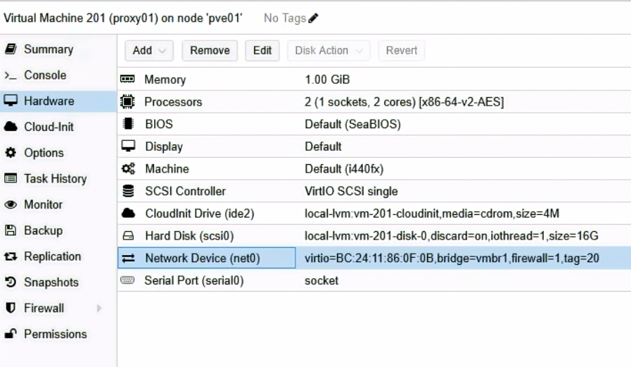

圖（一）proxy01 使用 local-lvm、16 GiB 磁碟、vmbr1 與 VLAN Tag 20

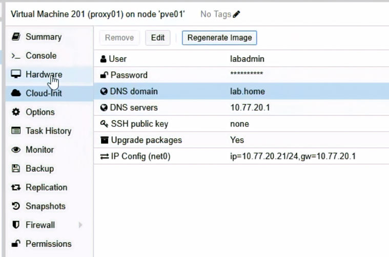

圖（二）proxy01 設定為 10.77.20.21，Gateway 與 DNS 均指向 OPNsense

### 1.2 建立 proxy02

重複 1.1 的 23 個步驟，只替換以下值：

- `Target Node`：`pve02`。
- `VM ID`：`202`。
- `Name`：`proxy02`。
- `Target Storage`：pve02 的 `local-lvm`。
- IPv4/CIDR：`10.77.20.22/24`。

其餘保持 2 vCPU、1024 MiB RAM、16 GiB System Disk、`vmbr1`、VLAN Tag 20、Gateway 與 DNS `10.77.20.1`。

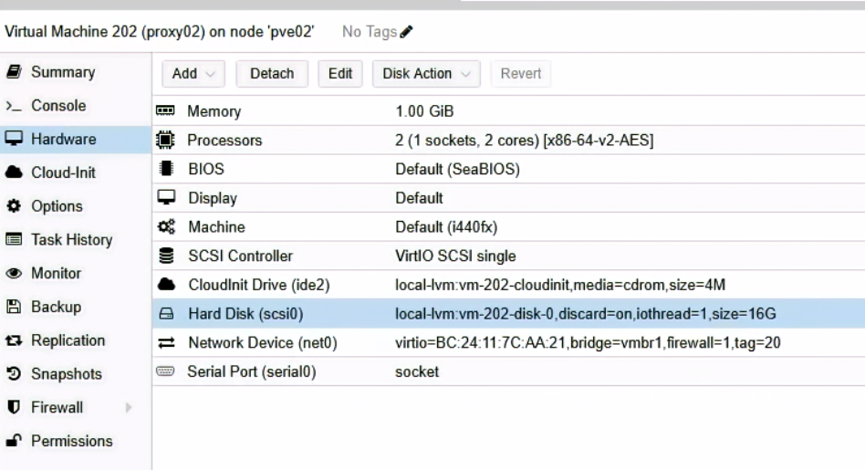

圖（三）proxy02 建立於 pve02，使用 local-lvm、16 GiB 磁碟與 VLAN Tag 20

### 1.3 建立 app02

再重複 1.1 的流程，改用以下值：

- `Target Node`：`pve03`。
- `VM ID`：`212`。
- `Name`：`app02`。
- `Target Storage`：`ceph-vm`。
- CPU：1 Socket、1 Core。
- Memory：1024 MiB，取消 Ballooning。
- System Disk 最終容量：12 GiB。
- IPv4/CIDR：`10.77.20.32/24`。

app01 與 app02 使用 `ceph-vm`，用來示範 Ceph RBD、Live Migration 與 PVE HA 工作負載。Proxy 與 Client 則使用各節點 `local-lvm`，避免所有一般服務都消耗三副本 Ceph 容量。

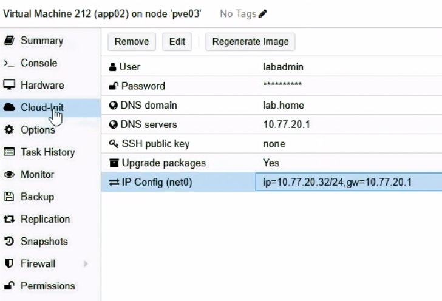

圖（四）app02 設定為 10.77.20.32，Gateway 與 DNS 均為 10.77.20.1

### 1.4 建立 client01

再重複 1.1 的流程，改用以下值：

- `Target Node`：`pve03`。
- `VM ID`：`241`。
- `Name`：`client01`。
- `Target Storage`：pve03 的 `local-lvm`。
- CPU：1 Socket、1 Core。
- Memory：1024 MiB，取消 Ballooning。
- System Disk 最終容量：8 GiB。
- IPv4/CIDR：`10.77.20.41/24`。

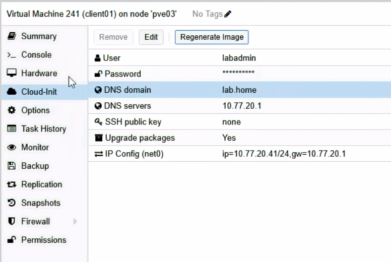

圖（五）client01 設定為 10.77.20.41，作為本日服務路徑的用戶端

### 1.5 確認五台 VM

在 proxy01、proxy02、app02、client01 的 Console 各自執行：

```bash
hostnamectl --static
ip -br address
ip route
cloud-init status --long
curl -4I --connect-timeout 10 https://deb.debian.org/
```

Hostname 如果是 Template 名稱，在當前 VM 執行 `sudo hostnamectl set-hostname 當前主機名`，重新登入 Console 再確認。

在既有 app01 只執行同一組確認指令，保留原本的 SSH 帳號與 Key。

### 1.6 確認 systemd-resolved 已取得內部 DNS

**操作節點：proxy01、proxy02、app01、app02、client01。逐台確認，不能只用外部網站可以連線來判斷 DNS 設定完成。**

PVE Cloud-Init 畫面已設定 DNS Server `10.77.20.1` 與 DNS Domain `lab.home`，但 Debian 實際查詢名稱時會先交給 systemd-resolved 的本機 Stub Resolver `127.0.0.53`。因此還要確認 systemd-resolved 真正取得 OPNsense DNS：

```bash
cat /etc/resolv.conf
resolvectl status
resolvectl query deb.debian.org
```

`/etc/resolv.conf` 顯示 `nameserver 127.0.0.53` 是正常的 Stub Resolver 架構，不代表實際上游 DNS 是本機。`resolvectl status` 的 Global 或網路介面區塊必須看到：

```text
DNS Servers: 10.77.20.1
DNS Domain: lab.home
```

如果已看到這兩項，且 `resolvectl query deb.debian.org` 成功，不需建立額外設定檔。

如果 Cloud-Init 已寫入 IP、預設閘道與 Search Domain，systemd-resolved 卻沒有取得 `10.77.20.1`，在當前主機建立持久化 drop-in：

```bash
sudo install -d -m 0755 /etc/systemd/resolved.conf.d

printf '%s\n' \
  '[Resolve]' \
  'DNS=10.77.20.1' \
  'Domains=lab.home' |
  sudo tee /etc/systemd/resolved.conf.d/10-lab-dns.conf

sudo systemctl restart systemd-resolved
sudo resolvectl flush-caches
```

重新驗證：

```bash
resolvectl status
resolvectl query deb.debian.org
getent ahostsv4 deb.debian.org
```

指令成功後重開機一次，確認設定在重開後存在：

```bash
sudo reboot
```

重新登入後執行：

```bash
resolvectl status
resolvectl query deb.debian.org
```

不要直接編輯 `/etc/resolv.conf`。本系統的該路徑連結到 `/run/systemd/resolve/stub-resolv.conf`，內容會由 systemd-resolved 重新產生；直接修改無法成為穩定的開機後設定。建立 `web.lab.home`、`db-rw.lab.home` 與 `db-ro.lab.home` 後，會再用這條內部 DNS 路徑驗證三組 VIP。

如果已經完成固定入口，可再執行：

```bash
getent ahostsv4 web.lab.home
getent ahostsv4 db-rw.lab.home
getent ahostsv4 db-ro.lab.home
```

三個名稱應分別解析為 `10.77.20.10`、`10.77.20.11` 與 `10.77.20.12`。若直接查詢 `dig @10.77.20.1 <名稱> A` 有答案，`getent` 卻沒有輸出，表示 OPNsense 的 DNS Record 存在，問題位於該台 Debian 主機的 systemd-resolved 上游設定。

## 2. 建立 Application Database 與最小權限 Role

**操作位置：目前的 Patroni Leader。先用 `patronictl list` 找出 Leader，不要假設一定是 pg01。**

在任一 PG Node 執行：

```bash
sudo -u postgres patronictl -c /etc/patroni/config.yml list
```

找到 Role 為 `Leader` 的節點後，進入該節點 Console：

```bash
sudo -u postgres psql
```

依序執行：

```sql
CREATE ROLE app_owner LOGIN;
CREATE ROLE app_rw LOGIN;
CREATE ROLE app_ro LOGIN;
ALTER ROLE app_ro SET default_transaction_read_only = on;
\password app_owner
\password app_rw
\password app_ro
\c appdb
CREATE SCHEMA IF NOT EXISTS app AUTHORIZATION app_owner;
GRANT CONNECT ON DATABASE appdb TO app_rw, app_ro;
GRANT USAGE ON SCHEMA app TO app_rw, app_ro;
ALTER DEFAULT PRIVILEGES FOR ROLE app_owner IN SCHEMA app
  GRANT SELECT, INSERT, UPDATE, DELETE ON TABLES TO app_rw;
ALTER DEFAULT PRIVILEGES FOR ROLE app_owner IN SCHEMA app
  GRANT USAGE, SELECT ON SEQUENCES TO app_rw;
ALTER DEFAULT PRIVILEGES FOR ROLE app_owner IN SCHEMA app
  GRANT SELECT ON TABLES TO app_ro;
\q
```

三次 `\password` 都使用互動輸入，不把密碼寫在 SQL File 或 Shell History。

以 PostgreSQL Local Administrative Session 切換成 `app_owner` 建立 Application Table：

```bash
sudo -u postgres psql appdb -v ON_ERROR_STOP=1
```

```sql
SET ROLE app_owner;
CREATE TABLE IF NOT EXISTS app.failover_probe(
  id bigint GENERATED ALWAYS AS IDENTITY PRIMARY KEY,
  created_at timestamptz DEFAULT clock_timestamp(),
  note text NOT NULL
);
RESET ROLE;
\q
```

回到 PostgreSQL 管理 Session，確認既有 Table 也套用權限：

```bash
sudo -u postgres psql appdb
```

```sql
GRANT SELECT, INSERT, UPDATE, DELETE ON app.failover_probe TO app_rw;
GRANT USAGE, SELECT ON ALL SEQUENCES IN SCHEMA app TO app_rw;
GRANT SELECT ON app.failover_probe TO app_ro;
\q
```

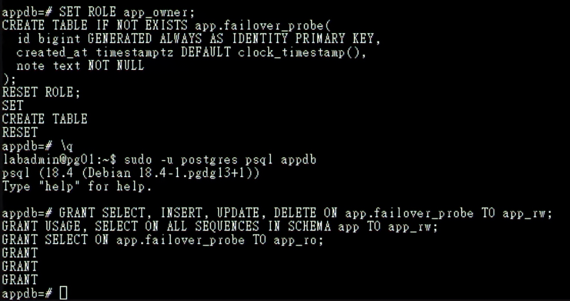

圖（六）app.failover_probe 建立完成，app_rw 與 app_ro 取得各自需要的權限

帳號建立完成後先不要在本機測試密碼連線。此時 Patroni 管理的 `pg_hba` 還沒允許 Proxy 來源，先完成下一節再透過 HAProxy 測試，才能同時證明 Role、HBA 與實際連線路徑都正確。

### 2.1 將 Application 來源加入 Patroni 管理的 pg_hba

操作位置：任一可執行 `patronictl` 的 PG Node。

```bash
sudo -u postgres patronictl -c /etc/patroni/config.yml edit-config iron-pg
```

在目前 Dynamic Configuration 的 `postgresql` → `pg_hba` 清單中，把以下規則放在最終 `reject` 之前：

```yaml
- hostssl appdb app_rw 10.77.20.21/32 scram-sha-256
- hostssl appdb app_rw 10.77.20.22/32 scram-sha-256
- hostssl appdb app_ro 10.77.20.21/32 scram-sha-256
- hostssl appdb app_ro 10.77.20.22/32 scram-sha-256
```

儲存並離開 Editor，確認差異後輸入 `y` 套用。接著執行：

```bash
sudo -u postgres patronictl -c /etc/patroni/config.yml reload iron-pg --force
sudo -u postgres patronictl -c /etc/patroni/config.yml show-config iron-pg
```

接著依序登入 pg01、pg02、pg03，每台都執行：

```bash
sudo -u postgres psql -d postgres -P pager=off \
  -c "SELECT line_number,type,database,user_name,address,auth_method,error FROM pg_hba_file_rules WHERE address IN ('10.77.20.21','10.77.20.22') ORDER BY line_number;"
```

每台都應看到四條 `hostssl` 規則，`error` 必須為空。若某台尚未更新，先執行 `sudo systemctl reload patroni` 並重新檢查。不要直接只改目前 Leader 的 `pg_hba.conf`，否則切換後規則會不一致。

## 3. 建立兩個 Web Backend

**操作順序：先 app01，確認服務正常後再於 app02 重複。兩台設定相同，Host Name 與 IP 不同。**

app01／app02 安裝：

```bash
sudo apt update
sudo apt install -y python3-flask python3-psycopg2
sudo install -d -m 0755 /opt/iron-app
```

開啟 Application File：

```bash
sudo nano /opt/iron-app/app.py
```

貼上以下內容：

```python
import os
import socket
import psycopg2
from flask import Flask, jsonify

app = Flask(__name__)

def connect_db():
    options = dict(
        host=os.environ["DB_HOST"],
        port=5432,
        dbname="appdb",
        user="app_rw",
        password=os.environ["DB_PASSWORD"],
        sslmode=os.environ.get("DB_SSLMODE", "verify-full"),
    )
    if os.environ.get("DB_SSLROOTCERT"):
        options["sslrootcert"] = os.environ["DB_SSLROOTCERT"]
    return psycopg2.connect(**options)

@app.get("/health")
def health():
    return jsonify(status="ok", backend=socket.gethostname())

@app.get("/")
def index():
    return jsonify(message="iron-lab", backend=socket.gethostname())

@app.post("/write")
def write():
    with connect_db() as conn:
        with conn.cursor() as cur:
            cur.execute("INSERT INTO app.failover_probe(note) VALUES (%s) RETURNING id", (socket.gethostname(),))
            row_id = cur.fetchone()[0]
    return jsonify(id=row_id, backend=socket.gethostname())

app.run(host="0.0.0.0", port=8080)
```

按 `Ctrl+O`、Enter、`Ctrl+X` 儲存離開。

建立設定目錄，再開啟 Environment File：

```bash
sudo install -d -m 0755 /etc/iron-app
sudo nano /etc/iron-app.env
```

在 Editor 貼上：

```text
DB_HOST=10.77.20.21
DB_SSLMODE=require
DB_PASSWORD=實際app_rw密碼
```

按 `Ctrl+O`、Enter、`Ctrl+X` 儲存，再限制權限：

```bash
sudo chown root:root /etc/iron-app.env
sudo chmod 600 /etc/iron-app.env
```

本次尚未建立 VIP，因此只在受控 Lab 內暫時透過 proxy01 並使用 `sslmode=require` 驗證功能。建立固定入口時會安裝 Root CA，並將 `DB_HOST` 改成 `db-rw.lab.home`、`DB_SSLMODE` 改為 `verify-full`、增加 `DB_SSLROOTCERT=/etc/iron-app/pg-ca.crt`。三台 PostgreSQL 憑證 SAN 必須包含這個服務名稱；正式流量應使用完整的憑證與名稱驗證。

開啟 systemd Unit File：

```bash
sudo nano /etc/systemd/system/iron-app.service
```

貼上以下內容：

```ini
[Unit]
Description=Iron Lab Web Backend
After=network-online.target
Wants=network-online.target

[Service]
EnvironmentFile=/etc/iron-app.env
ExecStart=/usr/bin/python3 /opt/iron-app/app.py
User=nobody
Group=nogroup
Restart=on-failure

[Install]
WantedBy=multi-user.target
```

按 `Ctrl+O`、Enter、`Ctrl+X` 儲存，再執行：

```bash
sudo systemctl daemon-reload
sudo systemctl enable --now iron-app
sudo systemctl status iron-app --no-pager
curl http://127.0.0.1:8080/health
```

## 4. 安裝 Nginx 與 HAProxy

**操作節點：proxy01、proxy02。逐台安裝並確認版本。**

proxy01／02：

```bash
sudo apt update
sudo apt install -y nginx haproxy curl socat
nginx -v
haproxy -vv | sed -n '1,5p'
echo 'net.ipv4.ip_nonlocal_bind=1' | sudo tee /etc/sysctl.d/90-vip.conf
sudo sysctl --system
sudo sysctl net.ipv4.ip_nonlocal_bind
```

最後一行必須顯示 `net.ipv4.ip_nonlocal_bind = 1`。啟動 Keepalived 前，Web／DB VIP 尚未掛在 Proxy NIC；HAProxy 要靠這項 Kernel Setting 預先 Bind `10.77.20.11` 與 `10.77.20.12`。

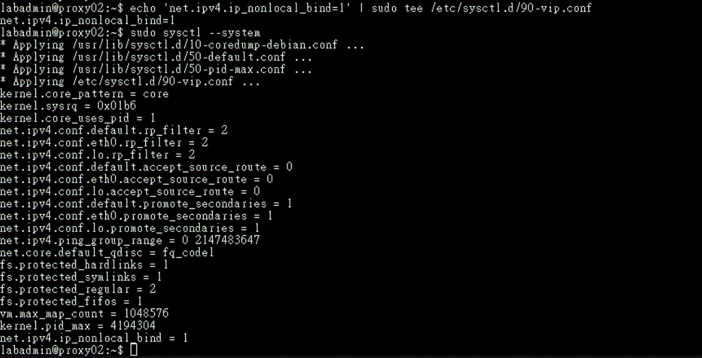

圖（七）proxy02 套用設定後，net.ipv4.ip_nonlocal_bind 為 1

### 4.1 啟用 Proxy 到 PostgreSQL／Patroni 的 OPNsense 規則

**操作位置：OPNsense Web UI。先前只建立 Alias，現在 Proxy 與 PostgreSQL 都已存在，必須在啟動 HAProxy Health Check 前正式加入服務專屬規則。**

進入 `Firewall` → `Rules`，在左上角選擇 `LAB_INTERNAL`。新增第一條規則：

1. `Action`：`Pass`。
2. `Quick`：保持勾選。
3. `Interface`：只選 Interface Group `LAB_INTERNAL`；
4. `Invert Interface`：不要勾選。
5. `Direction`：`in`。
6. `Version`：`IPv4`。
7. `Protocol`：`TCP`。
8. `Source`：Alias `PROXY_NODES`。
9. `Source Port`：`any`。
10. `Destination`：Alias `PG_NODES`。
11. `Destination Port`：Alias `PGSQL_PORT`。
12. `Description`：`Allow Proxy to PostgreSQL`。
13. 按 `Save`。

再新增第二條規則，只有 Destination Port 與 Description 不同：

1. `Action`：`Pass`，`Quick` 保持勾選。
2. `Interface`：只選 Interface Group `LAB_INTERNAL`，
3. `Direction`：`in`，`Version`：`IPv4`，`Protocol`：`TCP`。
4. `Source`：Alias `PROXY_NODES`，Source Port：`any`。
5. `Destination`：Alias `PG_NODES`。
6. `Destination Port`：Alias `PATRONI_API`。
7. `Description`：`Allow Proxy to Patroni API`。
8. 按 `Save`。

將兩條規則移到 `Block LAB_INTERNAL to internal networks` 上方，再按 `Apply`。正確順序至少要包含：

```text
Allow Proxy to PostgreSQL
Allow Proxy to Patroni API
Block LAB_INTERNAL to internal networks
```

規則要建立在流量進入 OPNsense 的 `LAB_INTERNAL` Group／SERVICE 成員路徑，不要建立在 DATABASE Interface；OPNsense Stateful Firewall 會自動允許回程封包，不需再建立 PG → Proxy 的反向規則。

儲存後重新開啟兩條規則核對 `Interface`。在 Rules [new] 中，只指定 `LAB_INTERNAL` Group 應歸類為 Group Rule；若顯示 Floating Rule，通常代表選到了 `any`、多個 Interface 或 `Invert Interface`，修正後再 Apply。不要改成單獨的 SERVICE Interface Rule，因為既有的 `Block LAB_INTERNAL to internal networks` Group Rule 會比單一 Interface Rule 更早處理。

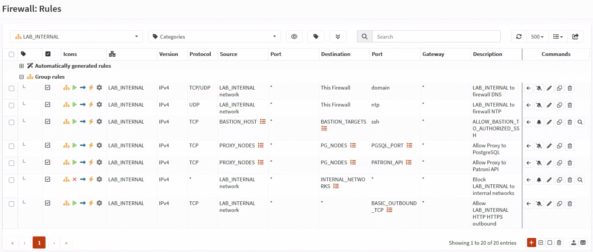

圖（八）兩條 Proxy 專屬規則位於內部網路阻擋規則之前

套用後，先在 proxy01 執行以下整段：

```bash
for ip in 10.77.30.11 10.77.30.12 10.77.30.13; do
  echo "=== ${ip} ==="

  if timeout 3 bash -c "</dev/tcp/${ip}/5432"; then
    echo 'PostgreSQL 5432: reachable'
  else
    echo 'PostgreSQL 5432: FAILED'
  fi

  curl -sS \
    --connect-timeout 3 \
    -o /dev/null \
    -w 'Patroni 8008: HTTP %{http_code}\n' \
    "http://${ip}:8008/"
done
```

三台都必須顯示 `PostgreSQL 5432: reachable`，Patroni 8008 必須回傳可連線的 HTTP Status。接著在 proxy02 重複同一段測試。若出現 Timeout，先到 `Firewall` → `Log Files` → `Live View` 以來源 `10.77.20.21`／`.22`、目的 `10.77.30.11`～`.13` 查 Block；不要先修改 HAProxy。

只有兩台 Proxy 對三台 PG 的 5432 與 8008 都通過後，才繼續下一節。

## 5. Nginx Reverse Proxy

**操作順序：先在 proxy01 完成設定、`nginx -t` 與本機測試，再於 proxy02 重複。**

在 proxy01 開啟 Nginx Site File：

```bash
sudo nano /etc/nginx/sites-available/iron-web
```

貼上以下內容：

```nginx
upstream iron_backends {
    zone iron_backends 64k;
    least_conn;
    server 10.77.20.31:8080 max_fails=2 fail_timeout=5s;
    server 10.77.20.32:8080 max_fails=2 fail_timeout=5s;
}

server {
    listen 80;
    server_name web.lab.home;

    location = /health {
        proxy_pass http://iron_backends/health;
        proxy_connect_timeout 2s;
        proxy_read_timeout 3s;
    }

    location / {
        proxy_pass http://iron_backends;
        proxy_set_header Host $host;
        proxy_set_header X-Real-IP $remote_addr;
        proxy_set_header X-Forwarded-For $proxy_add_x_forwarded_for;
        proxy_set_header X-Forwarded-Proto $scheme;
        proxy_connect_timeout 2s;
        proxy_read_timeout 10s;
    }
}
```

按 `Ctrl+O`、Enter、`Ctrl+X` 儲存，再執行：

```bash
sudo ln -sfn /etc/nginx/sites-available/iron-web /etc/nginx/sites-enabled/iron-web
sudo rm -f /etc/nginx/sites-enabled/default
sudo nginx -t
sudo systemctl reload nginx
sudo systemctl status nginx --no-pager
curl -sS http://127.0.0.1/health
```

proxy01 完成後，在 proxy02 重複本節的所有步驟。

在 proxy02 完成後，分別於兩台執行以下指令，確認 Own-IP 的 HTTP 入口都可使用：

proxy01：

```bash
curl -sS http://10.77.20.21/health
```

proxy02：

```bash
curl -sS http://10.77.20.22/health
```

本日的 Web 入口使用內部 HTTP，先驗證 Nginx、Backend 與切換流程。正式網域、Cloudflare Origin Certificate、Nginx `listen 443 ssl` 與 WAN TCP 443 會在建立外部入口時一併完成。

## 6. HAProxy 設定

**操作順序：先在 proxy01 完整覆蓋設定、檢查並啟動，再到 proxy02 使用它自己的完整設定。不要把下列內容附加到 Debian 預設檔案後面。**

HAProxy 的 PostgreSQL Client Traffic 使用 TCP 5432／5433，但 Backend Health Check 改連 Patroni HTTP 8008，藉此分辨 Primary 與 Replica。`defaults.mode` 必須是 `tcp`；只有本機 Stats Page 使用 `mode http`。

### 6.1 proxy01 完整設定

**操作節點：只在 proxy01。以下整段可直接複製貼上。**

```bash
sudo cp -an \
  /etc/haproxy/haproxy.cfg \
  /etc/haproxy/haproxy.cfg.day25.bak

sudo tee /etc/haproxy/haproxy.cfg >/dev/null <<'HAPROXY'
global
    log /dev/log local0
    log /dev/log local1 notice
    user haproxy
    group haproxy
    daemon
    stats socket /run/haproxy/admin.sock mode 660 level admin
    stats timeout 30s

defaults
    log global
    mode tcp
    option tcplog
    option dontlognull
    timeout connect 3s
    timeout client 30s
    timeout server 30s

frontend pg_rw_node
    bind 10.77.20.21:5432
    default_backend pg_primary

frontend pg_rw_vip
    bind 10.77.20.11:5432
    default_backend pg_primary

frontend pg_ro_node
    bind 10.77.20.21:5433
    default_backend pg_replicas

frontend pg_ro_vip
    bind 10.77.20.12:5432
    default_backend pg_replicas

backend pg_primary
    option httpchk GET /primary
    http-check expect status 200
    default-server inter 2s fall 2 rise 2 on-marked-down shutdown-sessions
    server pg01 10.77.30.11:5432 check port 8008
    server pg02 10.77.30.12:5432 check port 8008
    server pg03 10.77.30.13:5432 check port 8008

backend pg_replicas
    balance roundrobin
    option httpchk GET /replica?lag=64MB
    http-check expect status 200
    default-server inter 2s fall 2 rise 2
    server pg01 10.77.30.11:5432 check port 8008
    server pg02 10.77.30.12:5432 check port 8008
    server pg03 10.77.30.13:5432 check port 8008

listen local_stats
    bind 127.0.0.1:8404
    mode http
    stats enable
    stats uri /stats
HAPROXY

test "$(sudo sysctl -n net.ipv4.ip_nonlocal_bind)" = '1' && \
  echo 'ip_nonlocal_bind: OK'

sudo haproxy -c -f /etc/haproxy/haproxy.cfg
sudo systemctl enable haproxy
sudo systemctl restart haproxy
sudo systemctl status haproxy -l --no-pager
```

結尾的 `HAPROXY` 必須從行首開始並單獨一行。`restart` 是必要步驟：`enable --now` 不會讓已在 Running 狀態的 HAProxy 重新載入剛寫入的設定。

### 6.2 proxy02 完整設定

**操作節點：只在 proxy02。以下內容已使用 proxy02 Own-IP `10.77.20.22`，不需手動替換。**

```bash
sudo cp -an \
  /etc/haproxy/haproxy.cfg \
  /etc/haproxy/haproxy.cfg.day25.bak

sudo tee /etc/haproxy/haproxy.cfg >/dev/null <<'HAPROXY'
global
    log /dev/log local0
    log /dev/log local1 notice
    user haproxy
    group haproxy
    daemon
    stats socket /run/haproxy/admin.sock mode 660 level admin
    stats timeout 30s

defaults
    log global
    mode tcp
    option tcplog
    option dontlognull
    timeout connect 3s
    timeout client 30s
    timeout server 30s

frontend pg_rw_node
    bind 10.77.20.22:5432
    default_backend pg_primary

frontend pg_rw_vip
    bind 10.77.20.11:5432
    default_backend pg_primary

frontend pg_ro_node
    bind 10.77.20.22:5433
    default_backend pg_replicas

frontend pg_ro_vip
    bind 10.77.20.12:5432
    default_backend pg_replicas

backend pg_primary
    option httpchk GET /primary
    http-check expect status 200
    default-server inter 2s fall 2 rise 2 on-marked-down shutdown-sessions
    server pg01 10.77.30.11:5432 check port 8008
    server pg02 10.77.30.12:5432 check port 8008
    server pg03 10.77.30.13:5432 check port 8008

backend pg_replicas
    balance roundrobin
    option httpchk GET /replica?lag=64MB
    http-check expect status 200
    default-server inter 2s fall 2 rise 2
    server pg01 10.77.30.11:5432 check port 8008
    server pg02 10.77.30.12:5432 check port 8008
    server pg03 10.77.30.13:5432 check port 8008

listen local_stats
    bind 127.0.0.1:8404
    mode http
    stats enable
    stats uri /stats
HAPROXY

test "$(sudo sysctl -n net.ipv4.ip_nonlocal_bind)" = '1' && \
  echo 'ip_nonlocal_bind: OK'

sudo haproxy -c -f /etc/haproxy/haproxy.cfg
sudo systemctl enable haproxy
sudo systemctl restart haproxy
sudo systemctl status haproxy -l --no-pager
```

### 6.3 逐台驗證 Listener 與 Backend

在 proxy01：

```bash
sudo ss -lntp | \
  grep -E '10\.77\.20\.(21|11|12):(5432|5433)'

echo 'show stat' | \
  sudo socat stdio /run/haproxy/admin.sock | \
  awk -F, '
    BEGIN {
      printf "%-13s %-6s %-7s %-8s %s\n", "BACKEND", "NODE", "STATUS", "CHECK", "HTTP"
    }
    ($1 == "pg_primary" || $1 == "pg_replicas") && $2 != "BACKEND" {
      printf "%-13s %-6s %-7s %-8s %s\n", $1, $2, $18, $37, $38
    }
  '
```

必須看到 `10.77.20.21:5432`、`10.77.20.21:5433`、`10.77.20.11:5432`、`10.77.20.12:5432`。

在 proxy02：

```bash
sudo ss -lntp | \
  grep -E '10\.77\.20\.(22|11|12):(5432|5433)'

echo 'show stat' | \
  sudo socat stdio /run/haproxy/admin.sock | \
  awk -F, '
    BEGIN {
      printf "%-13s %-6s %-7s %-8s %s\n", "BACKEND", "NODE", "STATUS", "CHECK", "HTTP"
    }
    ($1 == "pg_primary" || $1 == "pg_replicas") && $2 != "BACKEND" {
      printf "%-13s %-6s %-7s %-8s %s\n", $1, $2, $18, $37, $38
    }
  '
```

必須看到 `10.77.20.22:5432`、`10.77.20.22:5433`、`10.77.20.11:5432`、`10.77.20.12:5432`。`pg_primary` 應只有目前 Patroni Leader 為 `UP / L7OK / 200`，`pg_replicas` 應有兩台 Replica 為 `UP / L7OK / 200`。同一節點在不符合其角色的 Backend 顯示 `DOWN / L7STS / 503`，代表角色篩選正常，節點本身可以保持在線。若 Listener 不完整或 Restart 失敗，執行 `sudo journalctl -u haproxy -b -n 100 -o cat --no-pager`，修正後再繼續 Client 測試。

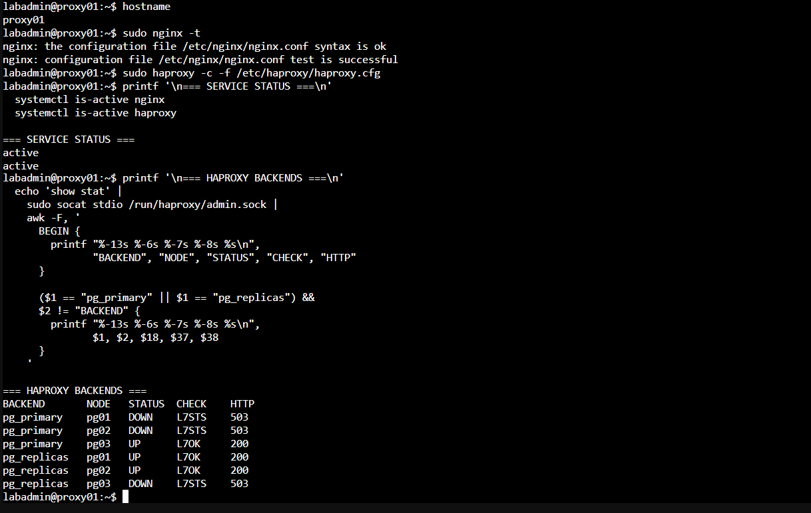

圖（九）proxy01 的 Nginx、HAProxy 與角色感知 Backend 均正常

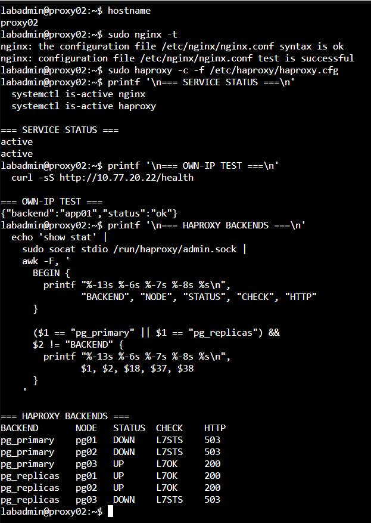

圖（十）proxy02 能回應 Web 請求，並取得相同的 PostgreSQL 角色結果

## 7. 基本功能測試

**操作節點：client01。必要時從 jump01 對照管理路徑，但主要測試結果以 client01 為準。**

client01：

```bash
sudo apt update
sudo apt install -y curl postgresql-client
psql --version
for i in $(seq 1 6); do curl -s http://10.77.20.21/; echo; done
psql 'host=10.77.20.21 port=5432 dbname=appdb user=app_rw sslmode=require'
psql 'host=10.77.20.21 port=5433 dbname=appdb user=app_ro sslmode=require'
```

第一個 `app_rw` 連線提示輸入密碼後，執行：

```sql
INSERT INTO app.failover_probe(note)
VALUES ('day25-app-rw-test')
RETURNING id,created_at,note;
\q
```

這筆 INSERT 必須成功。第二個 `app_ro` 連線提示輸入密碼後，先讀取資料，再嘗試寫入：

```sql
SELECT id,created_at,note
FROM app.failover_probe
ORDER BY id DESC
LIMIT 5;

INSERT INTO app.failover_probe(note)
VALUES ('day25-app-ro-must-fail');
\q
```

SELECT 必須成功，INSERT 必須收到 Read-only Transaction 或 Permission Denied。若 app_rw、app_ro 都被 HBA 拒絕，先到目前 Leader 查看 PostgreSQL Log，並確認連線抵達資料庫時的 Source IP 是 proxy01 的 `10.77.20.21`。

重複 Web Request 應看到 app01／app02；RW 連線落到 Primary，RO 連線落到 Replica。這裡使用 Proxy Node IP，Certificate SAN 未包含 `10.77.20.21`，因此暫時使用 `sslmode=require`。改用 `db-rw.lab.home`、`db-ro.lab.home` 後必須改為 `verify-full`。

## 8. Web Backend 故障測試

**操作位置：client01 持續送 Request，app01 執行停止與恢復。**

在 client01 開啟第一個 Console：

```bash
while true; do
  date -Is
  curl -sS --connect-timeout 2 http://10.77.20.21/health || echo 'request failed'
  sleep 1
done
```

在 **app01** 執行（這裡只停 Web Backend，不要在 app01 查 Nginx Log）：

```bash
sudo systemctl stop iron-app
```

回到 **client01**，確認新 Request 能由 app02 持續回應。接著登入 **proxy01** 檢查 Nginx Log（`/var/log/nginx/` 不在 app01）：

```bash
sudo tail -n 50 /var/log/nginx/error.log
sudo tail -n 50 /var/log/nginx/access.log
```

最後回到 **app01** 恢復 Web Backend：

```bash
sudo systemctl start iron-app
curl -s http://127.0.0.1:8080/health
```


圖（十一）app01 的 Web Backend 完成停止、恢復與本機健康檢查

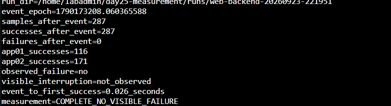

圖（十二）app01 停止期間由 app02 持續回應，本次未觀察到失敗請求

上述兩張畫面使用 0.2 秒探測腳本記錄；完整量測方法與結果判讀請接續 [額外實作：量測代理與應用程式中斷時間](./DAY25_額外實作_量測代理與應用程式中斷時間.md)。

## 9. PostgreSQL Role 切換測試

**操作位置：client01 持續寫入，目前 Leader 執行 Planned Switchover。今天只測 HAProxy Node IP，不測 VIP。**

在 client01：

```bash
while true; do
  date -Is
  curl -sS -X POST --connect-timeout 3 http://10.77.20.21/write || echo 'write failed'
  sleep 1
done
```

在任一 PG Node 先記錄目前 Leader，再執行：

```bash
sudo -u postgres patronictl -c /etc/patroni/config.yml list
sudo -u postgres patronictl -c /etc/patroni/config.yml switchover
```

依提示選目前 Leader 與目標 Candidate，確認後觀察 Client。切換完成再執行：

```bash
sudo -u postgres patronictl -c /etc/patroni/config.yml list
```

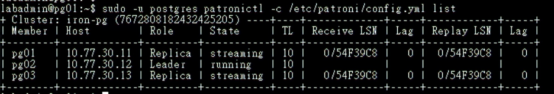

圖（十三）pg02 接任 Leader 後，pg01 與 pg03 均恢復為 streaming Replica

到 proxy01 確認 HAProxy 已把 RW Backend 指到新 Leader：

```bash
echo 'show stat' | \
  sudo socat stdio /run/haproxy/admin.sock | \
  awk -F, '
    BEGIN {
      printf "%-13s %-6s %-7s %-8s %s\n", "BACKEND", "NODE", "STATUS", "CHECK", "HTTP"
    }
    ($1 == "pg_primary" || $1 == "pg_replicas") && $2 != "BACKEND" {
      printf "%-13s %-6s %-7s %-8s %s\n", $1, $2, $18, $37, $38
    }
  '
```

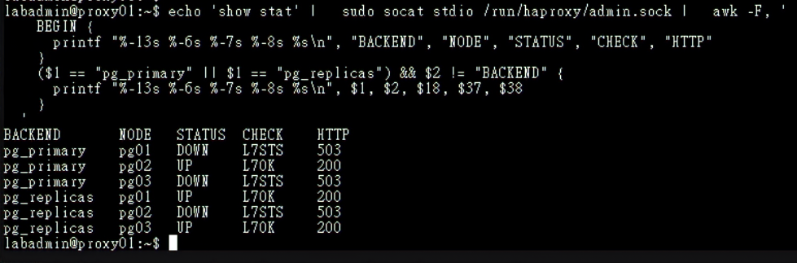

圖（十四）HAProxy 將 pg02 列為唯一可用的 Primary，並保留兩台 Replica

回到 client01 重新建立 DB-RW 連線，確認新連線抵達 pg02 並完成寫入：

```bash
psql \
  -W \
  'host=10.77.20.21 port=5432 dbname=appdb user=app_rw sslmode=require' \
  -P pager=off \
  -v ON_ERROR_STOP=1 \
  -c "SELECT inet_server_addr() AS server_ip,
             inet_server_port() AS server_port,
             pg_is_in_recovery() AS in_recovery;" \
  -c "INSERT INTO app.failover_probe(note)
      VALUES ('day25-after-switchover')
      RETURNING id,created_at,note;"
```

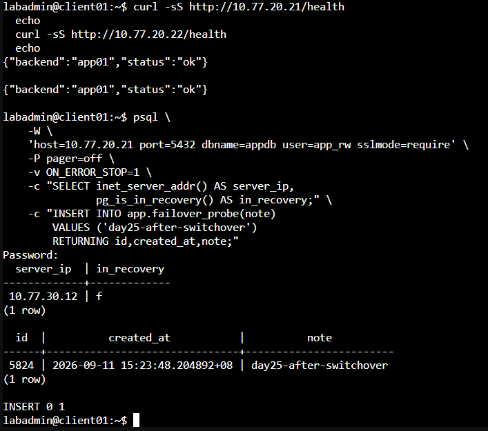

圖（十五）DB-RW 新連線抵達 pg02，測試資料寫入成功

本日驗證 Nginx 與 HAProxy 各自在 `proxy01`、`proxy02` 的固定 IP 上可用；Proxy 節點故障與 VIP 移動由固定入口實作接續驗證。
