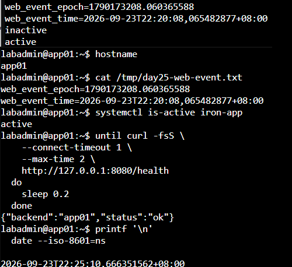
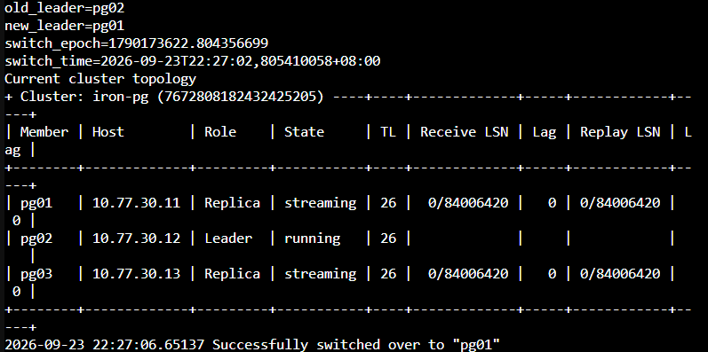
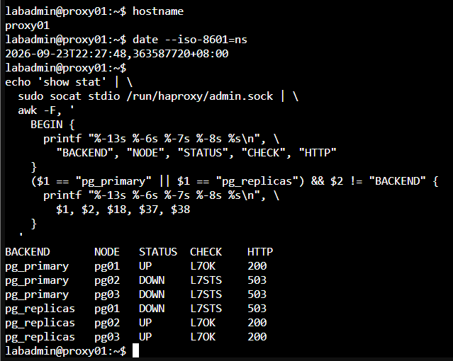
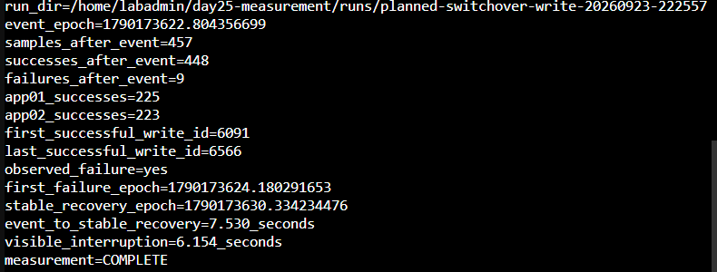
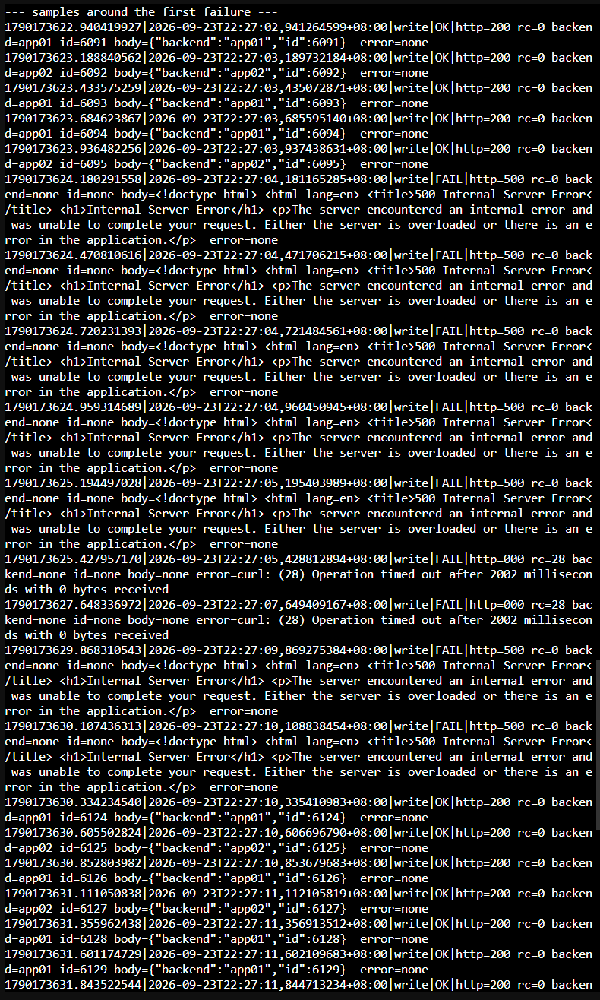
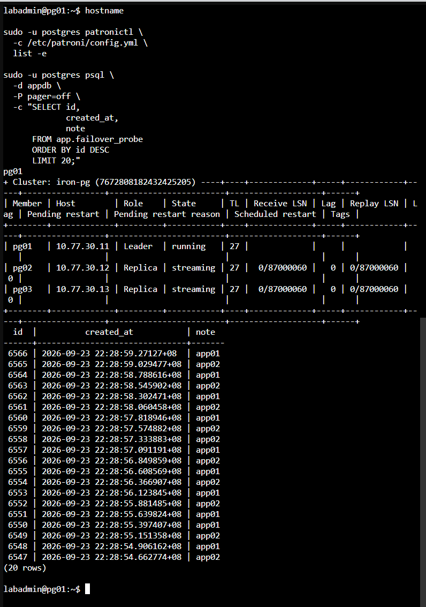

# Day 25 額外實作｜量測代理與應用程式中斷時間

本文件接續 [Day 25 主實作](./DAY25_Nginx_HAProxy與WebBackend.md)，量測兩個使用者實際會遇到的結果：

1. `app01` 停止服務時，經 Nginx 存取 Web 服務是否出現可見中斷。
2. PostgreSQL 計畫性切換時，經 Nginx、應用程式與 HAProxy 寫入資料庫的服務恢復時間。

本次尚未建立 Keepalived 與 VIP，因此兩項測試都固定使用 `proxy01` 的節點 IP `10.77.20.21`。這可以排除 VIP 漂移時間，只觀察代理與應用程式路徑。

探測間隔為 0.2 秒。發生失敗後，以連續三次成功中的第一筆作為穩定恢復點。若整段樣本沒有捕捉到失敗，結果會顯示 `observed_failure=no` 與 `visible_interruption=not_observed`，代表本次未觀察到可見中斷。

## 一、量測邊界與時間點

| 量測             | 起點                                 | 終點                                                | 結果用途                                           |
| ---------------- | ------------------------------------ | --------------------------------------------------- | -------------------------------------------------- |
| Web 可見中斷     | client01 第一個 `/health` 失敗       | 後續連續三次 `/health` 成功中的第一筆               | 判斷移除一台 Web Backend 對使用者的影響            |
| 應用程式可寫中斷 | client01 第一個 `/write` 失敗        | 新 Primary 可用後，連續三次 `/write` 成功中的第一筆 | 量化完整應用程式寫入路徑的恢復時間                 |
| 切換到穩定可寫   | 送出 Planned Switchover 前記錄的時間 | 連續三次 `/write` 成功中的第一筆                    | 觀察 Patroni、HAProxy 與應用程式共同完成切換的時間 |

`第一個失敗到穩定恢復` 全部由 client01 記錄，可直接代表該觀察點看到的服務中斷。`切換指令到穩定恢復` 的起點與終點來自不同主機，只有時間同步正常時才採用。

## 二、確認健康基準與時間同步

### 2.1 在 client01、app01、app02 與任一 PostgreSQL 節點確認時間同步

四台主機分別執行：

```bash
hostname
date --iso-8601=ns
timedatectl show -p NTPSynchronized --value
```

`NTPSynchronized` 應全部為 `yes`。任一主機尚未同步時，先修正時間來源再開始量測。client01 單機記錄的可見中斷是主要結果；跨主機的切換指令到恢復時間只作參考。

### 2.2 在 proxy01 確認入口與服務

```bash
hostname

systemctl is-active nginx haproxy

sudo ss -lntp | \
  awk '$4 ~ /:80$/ || $4 ~ /^10\.77\.20\.21:(5432|5433)$/'

echo 'show stat' | \
  sudo socat stdio /run/haproxy/admin.sock | \
  awk -F, '
    BEGIN {
      printf "%-13s %-6s %-7s %-8s %s\n", \
        "BACKEND", "NODE", "STATUS", "CHECK", "HTTP"
    }
    ($1 == "pg_primary" || $1 == "pg_replicas") && $2 != "BACKEND" {
      printf "%-13s %-6s %-7s %-8s %s\n", \
        $1, $2, $18, $37, $38
    }
  '
```

應看到 Nginx 與 HAProxy 為 `active`，proxy01 節點 IP 正在監聽 HTTP 80、DB-RW 5432 與 DB-RO 5433。`pg_primary` 應只有一台 PostgreSQL 節點符合 HTTP 200。

### 2.3 在任一 PostgreSQL 節點確認叢集

```bash
hostname

sudo -u postgres patronictl \
  -c /etc/patroni/config.yml \
  list -e
```

開始前應只有一台 Leader，兩台 Replica 均為 `streaming`，Lag 為 0。

### 2.4 確認 app01、app02 使用 proxy01 節點 IP

若接續主實作執行，`/etc/iron-app.env` 已使用 `DB_HOST=10.77.20.21` 與 `DB_SSLMODE=require`，確認後可直接進入 2.5。若目前環境已改用固定 DB-RW 網域與 `verify-full`，再依本節建立暫時的 systemd Runtime Override。這項設定只寫入 `/run`，重新開機便會消失，持久設定維持原樣。

先在 app01、app02 分別確認目前設定：

```bash
sudo sed -n -E \
  '/^DB_(HOST|SSLMODE|SSLROOTCERT)=/p' \
  /etc/iron-app.env
```

只有目前設定已改用固定 DB-RW 網域時，才在 app01 與 app02 分別執行以下步驟：

```bash
hostname

sudo install -d -m 0755 \
  /run/systemd/system/iron-app.service.d

sudo nano \
  /run/systemd/system/iron-app.service.d/day25-measurement.conf
```

完整貼入：

```ini
[Service]
Environment=DB_HOST=10.77.20.21
Environment=DB_SSLMODE=require
Environment=DB_SSLROOTCERT=
```

按 `Ctrl+O`、Enter、`Ctrl+X` 儲存，再執行：

```bash
sudo systemctl daemon-reload
sudo systemctl restart iron-app

systemctl is-active iron-app

IRON_APP_PID="$(
  systemctl show \
    -p MainPID \
    --value \
    iron-app
)"

sudo sh -c \
  "tr '\\0' '\\n' < /proc/${IRON_APP_PID}/environ" | \
  grep -E '^DB_(HOST|SSLMODE|SSLROOTCERT)='

curl -fsS \
  http://127.0.0.1:8080/health
```

畫面應顯示 `DB_HOST=10.77.20.21`、`DB_SSLMODE=require`，並成功取得本機 `/health` 回應。命令刻意不輸出 `DB_PASSWORD`。

### 2.5 從 client01 確認完整路徑

```bash
hostname

for request in 1 2 3 4 5 6
do
  curl -fsS \
    --connect-timeout 1 \
    --max-time 2 \
    http://10.77.20.21/health
  printf '\n'
done

curl -fsS \
  --connect-timeout 1 \
  --max-time 3 \
  -X POST \
  http://10.77.20.21/write
printf '\n'
```

應看到 app01、app02 的健康回應，以及一筆含有 `id` 與 `backend` 的寫入結果。

## 三、在 client01 建立共用探測腳本

以下步驟全部在 client01 執行。長腳本使用 `nano`，避免終端機貼上 `tee` 或 Here Document 時被截斷。

### 3.1 建立目錄

```bash
hostname

DAY25_BASE='/home/labadmin/day25-measurement'

mkdir -p \
  "$DAY25_BASE/runs"

command -v bash
command -v curl
command -v awk
```

### 3.2 建立 probe.sh

```bash
nano \
  /home/labadmin/day25-measurement/probe.sh
```

完整貼入：

```bash
#!/bin/bash
set -u

probe_type="${1:?usage: probe.sh web|write RUN_DIR}"
run_dir="${2:?usage: probe.sh web|write RUN_DIR}"
log_file="$run_dir/probe.log"
body_file="$run_dir/body.$$"

case "$probe_type" in
  web)
    request_url='http://10.77.20.21/health'
    ;;
  write)
    request_url='http://10.77.20.21/write'
    ;;
  *)
    echo 'usage: probe.sh web|write RUN_DIR' >&2
    exit 2
    ;;
esac

cleanup() {
  rm -f "$body_file"
}
trap cleanup EXIT
trap 'exit 0' INT TERM

while true; do
  request_epoch="$(date +%s.%N)"
  request_time="$(date --iso-8601=ns)"
  : > "$body_file"

  curl_args=(
    -sS
    --connect-timeout 1
    --max-time 2
    -o "$body_file"
    -w '%{http_code}'
  )

  if [ "$probe_type" = 'write' ]; then
    curl_args+=(
      -X POST
    )
  fi

  http_code="$(
    curl "${curl_args[@]}" \
      "$request_url" \
      2>"$run_dir/curl-error.$$"
  )"
  curl_rc=$?

  body="$(
    tr '\n|' '  ' < "$body_file" \
      2>/dev/null || true
  )"
  curl_error="$(
    tr '\n|' '  ' < "$run_dir/curl-error.$$" \
      2>/dev/null || true
  )"
  rm -f "$run_dir/curl-error.$$"

  backend="$(
    printf '%s\n' "$body" | \
      sed -n 's/.*"backend":"\([^"]*\)".*/\1/p'
  )"
  row_id="$(
    printf '%s\n' "$body" | \
      sed -n 's/.*"id":\([0-9][0-9]*\).*/\1/p'
  )"

  status='FAIL'
  if [ "$curl_rc" -eq 0 ] && \
     [ "$http_code" = '200' ]; then
    case "$probe_type" in
      web)
        if printf '%s\n' "$body" | \
             grep -Fq '"status":"ok"'; then
          status='OK'
        fi
        ;;
      write)
        if [ -n "$row_id" ]; then
          status='OK'
        fi
        ;;
    esac
  fi

  printf '%s|%s|%s|%s|http=%s rc=%s backend=%s id=%s body=%s error=%s\n' \
    "$request_epoch" \
    "$request_time" \
    "$probe_type" \
    "$status" \
    "${http_code:-000}" \
    "$curl_rc" \
    "${backend:-none}" \
    "${row_id:-none}" \
    "${body:-none}" \
    "${curl_error:-none}" | \
    tee -a "$log_file"

  sleep 0.2
done
```

### 3.3 建立 start-run.sh

```bash
nano \
  /home/labadmin/day25-measurement/start-run.sh
```

完整貼入：

```bash
#!/bin/bash
set -eu

run_name="${1:?usage: start-run.sh RUN_NAME web|write}"
probe_type="${2:?usage: start-run.sh RUN_NAME web|write}"
base_dir='/home/labadmin/day25-measurement'

case "$probe_type" in
  web|write) ;;
  *)
    echo 'probe type must be web or write' >&2
    exit 2
    ;;
esac

run_dir="$base_dir/runs/${run_name}-$(date +%Y%m%d-%H%M%S)"
mkdir -p "$run_dir"

printf '%s\n' "$probe_type" > "$run_dir/probe.type"
date +%s.%N > "$run_dir/probe-start.epoch"
date --iso-8601=ns > "$run_dir/probe-start.iso"

nohup \
  "$base_dir/probe.sh" \
  "$probe_type" \
  "$run_dir" \
  > "$run_dir/probe.stdout" \
  2>&1 &

probe_pid=$!
printf '%s\n' "$probe_pid" > "$run_dir/probe.pid"
printf '%s\n' "$run_dir" > "$base_dir/current-run"

printf 'run_dir=%s\n' "$run_dir"
printf 'probe_pid=%s\n' "$probe_pid"
printf 'probe_type=%s\n' "$probe_type"
```

### 3.4 建立 stop-run.sh

```bash
nano \
  /home/labadmin/day25-measurement/stop-run.sh
```

完整貼入：

```bash
#!/bin/bash
set -eu

run_dir="${1:-$(cat /home/labadmin/day25-measurement/current-run)}"
pid_file="$run_dir/probe.pid"

test -f "$pid_file"
probe_pid="$(cat "$pid_file")"

case "$probe_pid" in
  ''|*[!0-9]*)
    echo "ERROR: invalid PID in $pid_file" >&2
    exit 1
    ;;
esac

if kill -0 "$probe_pid" 2>/dev/null; then
  kill "$probe_pid"
  for attempt in 1 2 3 4 5
  do
    if ! kill -0 "$probe_pid" 2>/dev/null; then
      break
    fi
    sleep 0.2
  done
fi

date +%s.%N > "$run_dir/probe-stop.epoch"
date --iso-8601=ns > "$run_dir/probe-stop.iso"

printf 'run_dir=%s\n' "$run_dir"
printf 'log_lines=%s\n' "$(wc -l < "$run_dir/probe.log")"
tail -n 12 "$run_dir/probe.log"
```

### 3.5 建立 analyze-run.sh

```bash
nano \
  /home/labadmin/day25-measurement/analyze-run.sh
```

完整貼入：

```bash
#!/bin/bash
set -eu

run_dir="${1:?usage: analyze-run.sh RUN_DIR EVENT_EPOCH}"
event_epoch="${2:?usage: analyze-run.sh RUN_DIR EVENT_EPOCH}"
log_file="$run_dir/probe.log"

test -s "$log_file"

printf 'run_dir=%s\n' "$run_dir"
printf 'event_epoch=%s\n' "$event_epoch"

awk -F '|' -v event="$event_epoch" '
  function metadata_value(text, key, parts, count, i, item) {
    count=split(text, parts, " ")
    for (i=1; i<=count; i++) {
      item=parts[i]
      if (index(item, key "=") == 1) {
        sub("^" key "=", "", item)
        return item
      }
    }
    return ""
  }

  ($1 + 0) < (event + 0) {
    next
  }

  {
    samples++

    if ($4 == "OK") {
      ok++
      backend=metadata_value($5, "backend")
      row_id=metadata_value($5, "id")

      if (backend == "app01") app01++
      if (backend == "app02") app02++

      if (row_id ~ /^[0-9]+$/) {
        if (first_id == "") first_id=row_id
        last_id=row_id
      }

      if (first_ok == "") first_ok=$1

      if (saw_failure && stable == "") {
        if (consecutive_ok == 0) candidate=$1
        consecutive_ok++
        if (consecutive_ok >= 3) stable=candidate
      }
    } else {
      failed++
      if (!saw_failure) {
        saw_failure=1
        first_failure=$1
      }
      consecutive_ok=0
      candidate=""
    }
  }

  END {
    printf "samples_after_event=%d\n", samples
    printf "successes_after_event=%d\n", ok
    printf "failures_after_event=%d\n", failed
    printf "app01_successes=%d\n", app01
    printf "app02_successes=%d\n", app02

    if (first_id != "") {
      printf "first_successful_write_id=%s\n", first_id
      printf "last_successful_write_id=%s\n", last_id
    }

    if (!saw_failure) {
      print "observed_failure=no"
      print "visible_interruption=not_observed"
      if (first_ok != "") {
        printf "event_to_first_success=%.3f_seconds\n", first_ok-event
      }
      print "measurement=COMPLETE_NO_VISIBLE_FAILURE"
      exit
    }

    print "observed_failure=yes"
    printf "first_failure_epoch=%.9f\n", first_failure

    if (stable == "") {
      print "stable_recovery=not_found"
      print "visible_interruption=incomplete"
      print "measurement=INCOMPLETE"
      exit
    }

    printf "stable_recovery_epoch=%.9f\n", stable
    printf "event_to_stable_recovery=%.3f_seconds\n", stable-event
    printf "visible_interruption=%.3f_seconds\n", stable-first_failure
    print "measurement=COMPLETE"
  }
' "$log_file"
```

### 3.6 檢查腳本語法與權限

```bash
chmod 750 \
  /home/labadmin/day25-measurement/probe.sh \
  /home/labadmin/day25-measurement/start-run.sh \
  /home/labadmin/day25-measurement/stop-run.sh \
  /home/labadmin/day25-measurement/analyze-run.sh

bash -n \
  /home/labadmin/day25-measurement/probe.sh

bash -n \
  /home/labadmin/day25-measurement/start-run.sh

bash -n \
  /home/labadmin/day25-measurement/stop-run.sh

bash -n \
  /home/labadmin/day25-measurement/analyze-run.sh

printf '%s\n' 'DAY25_MEASUREMENT_SCRIPTS_OK'
```

四次 `bash -n` 都沒有輸出，最後顯示 `DAY25_MEASUREMENT_SCRIPTS_OK` 才繼續。

## 四、量測 Web Backend 停止期間的可見中斷

本節只停止 app01 的 `iron-app`，app02 保持運作。測試結束後立即恢復 app01，再進行資料庫切換測試。

### 4.1 在 client01 啟動 Web 探測

```bash
DAY25_BASE='/home/labadmin/day25-measurement'

"$DAY25_BASE/start-run.sh" \
  web-backend \
  web

DAY25_WEB_RUN="$(cat "$DAY25_BASE/current-run")"
printf 'DAY25_WEB_RUN=%s\n' "$DAY25_WEB_RUN"

sleep 5
tail -n 12 "$DAY25_WEB_RUN/probe.log"
```

確認基準期間已持續出現 `OK`，並能看到 app01、app02 回應後，再執行故障注入。

### 4.2 在 app01 記錄事件並停止服務

```bash
hostname

DAY25_WEB_EVENT_EPOCH="$(date +%s.%N)"
DAY25_WEB_EVENT_TIME="$(date --iso-8601=ns)"

printf 'web_event_epoch=%s\n' \
  "$DAY25_WEB_EVENT_EPOCH" | \
  tee /tmp/day25-web-event.txt

printf 'web_event_time=%s\n' \
  "$DAY25_WEB_EVENT_TIME" | \
  tee -a /tmp/day25-web-event.txt

sudo systemctl stop iron-app
systemctl is-active iron-app || true

sleep 10

sudo systemctl start iron-app
systemctl is-active iron-app
curl -fsS http://127.0.0.1:8080/health
printf '\n'

cat /tmp/day25-web-event.txt
```

將最後顯示的 `web_event_epoch` 複製到下一步。此時間點在停止指令前記錄，用來輔助對照 Nginx 移除 Backend 的反應；Web 可見中斷由 client01 的第一個失敗開始計算。

### 4.3 在 client01 停止並分析 Web 探測

app01 恢復後繼續等待 10 秒，再執行：

```bash
DAY25_BASE='/home/labadmin/day25-measurement'
DAY25_WEB_RUN="$(cat "$DAY25_BASE/current-run")"

sleep 10

"$DAY25_BASE/stop-run.sh" \
  "$DAY25_WEB_RUN"

read -r -p '貼上 app01 顯示的 web_event_epoch：' \
  DAY25_WEB_EVENT_EPOCH

"$DAY25_BASE/analyze-run.sh" \
  "$DAY25_WEB_RUN" \
  "$DAY25_WEB_EVENT_EPOCH" | \
  tee "$DAY25_WEB_RUN/result.txt"

printf '%s\n' '--- first failures after event ---'
awk -F '|' \
  -v event="$DAY25_WEB_EVENT_EPOCH" \
  '($1 + 0) >= (event + 0) && $4 == "FAIL" {print; count++; if (count == 8) exit}' \
  "$DAY25_WEB_RUN/probe.log"

printf '%s\n' '--- final samples ---'
tail -n 15 \
  "$DAY25_WEB_RUN/probe.log"
```

判讀方式：

- `measurement=COMPLETE`：探測捕捉到失敗，且後續已有連續三次成功。
- `measurement=COMPLETE_NO_VISIBLE_FAILURE`：app01 停止期間由 app02 持續回應，本次沒有觀察到使用者可見中斷。
- `measurement=INCOMPLETE`：曾出現失敗，但停止探測前尚未取得連續三次成功；延長觀察後重測。



圖（一）app01 在記錄事件後停止並恢復 `iron-app`，最後由本機健康檢查確認服務可用


圖（二）client01 共取得 287 筆成功樣本，app01 停止期間由 app02 持續回應

## 五、量測 PostgreSQL 計畫性切換期間的可寫中斷

本節持續呼叫 `POST /write`。每一次成功都代表請求已經通過 Nginx、其中一台應用程式、HAProxy Node IP，並由當下 Primary 完成交易。

### 5.1 在 client01 啟動 Write 探測

```bash
DAY25_BASE='/home/labadmin/day25-measurement'

"$DAY25_BASE/start-run.sh" \
  planned-switchover-write \
  write

DAY25_WRITE_RUN="$(cat "$DAY25_BASE/current-run")"
printf 'DAY25_WRITE_RUN=%s\n' "$DAY25_WRITE_RUN"

sleep 5
tail -n 12 "$DAY25_WRITE_RUN/probe.log"
```

基準期間必須持續出現 `OK`、HTTP 200 與遞增的 `id`。若已有失敗，先停止探測並修正服務健康狀態。

### 5.2 在任一 PostgreSQL 節點選擇 Leader 與 Candidate

```bash
hostname

sudo -u postgres patronictl \
  -c /etc/patroni/config.yml \
  list -e
```

從輸出選擇目前 Leader 與一台 `streaming`、Lag 0 的 Replica。依當下角色修改下列兩個值：

```bash
DAY25_OLD_LEADER='pg02'
DAY25_NEW_LEADER='pg01'

printf 'old_leader=%s\n' "$DAY25_OLD_LEADER"
printf 'new_leader=%s\n' "$DAY25_NEW_LEADER"
```

Leader 與 Candidate 不得相同；候選節點必須是當下狀態正常的 Replica。

### 5.3 記錄切換時間並執行 Planned Switchover

在同一台 PostgreSQL 節點執行：

```bash
DAY25_SWITCH_DIR='/tmp/day25-planned-switchover'
mkdir -p "$DAY25_SWITCH_DIR"

DAY25_SWITCH_EPOCH="$(date +%s.%N)"
DAY25_SWITCH_TIME="$(date --iso-8601=ns)"

printf 'old_leader=%s\n' \
  "$DAY25_OLD_LEADER" | \
  tee "$DAY25_SWITCH_DIR/event.txt"

printf 'new_leader=%s\n' \
  "$DAY25_NEW_LEADER" | \
  tee -a "$DAY25_SWITCH_DIR/event.txt"

printf 'switch_epoch=%s\n' \
  "$DAY25_SWITCH_EPOCH" | \
  tee -a "$DAY25_SWITCH_DIR/event.txt"

printf 'switch_time=%s\n' \
  "$DAY25_SWITCH_TIME" | \
  tee -a "$DAY25_SWITCH_DIR/event.txt"

sudo -u postgres patronictl \
  -c /etc/patroni/config.yml \
  switchover iron-pg \
  --leader "$DAY25_OLD_LEADER" \
  --candidate "$DAY25_NEW_LEADER" \
  --force | \
  tee "$DAY25_SWITCH_DIR/switchover-output.txt"

sudo -u postgres patronictl \
  -c /etc/patroni/config.yml \
  list -e | \
  tee "$DAY25_SWITCH_DIR/after-list.txt"

cat "$DAY25_SWITCH_DIR/event.txt"
```

切換完成後應看到指定 Candidate 成為 Leader，另外兩台為 Replica。指令失敗時不要改用強制故障切換；保留輸出、停止 client01 探測並先恢復叢集健康。

### 5.4 在 proxy01 確認 HAProxy 指向新 Primary

```bash
hostname
date --iso-8601=ns

echo 'show stat' | \
  sudo socat stdio /run/haproxy/admin.sock | \
  awk -F, '
    BEGIN {
      printf "%-13s %-6s %-7s %-8s %s\n", \
        "BACKEND", "NODE", "STATUS", "CHECK", "HTTP"
    }
    ($1 == "pg_primary" || $1 == "pg_replicas") && $2 != "BACKEND" {
      printf "%-13s %-6s %-7s %-8s %s\n", \
        $1, $2, $18, $37, $38
    }
  '
```

`pg_primary` 應只有新 Leader 為 `UP / L7OK / 200`。

### 5.5 在 client01 停止並分析 Write 探測

切換完成後繼續等待至少 20 秒，再執行：

```bash
DAY25_BASE='/home/labadmin/day25-measurement'
DAY25_WRITE_RUN="$(cat "$DAY25_BASE/current-run")"

sleep 20

"$DAY25_BASE/stop-run.sh" \
  "$DAY25_WRITE_RUN"

read -r -p '貼上 PostgreSQL 節點顯示的 switch_epoch：' \
  DAY25_SWITCH_EPOCH

"$DAY25_BASE/analyze-run.sh" \
  "$DAY25_WRITE_RUN" \
  "$DAY25_SWITCH_EPOCH" | \
  tee "$DAY25_WRITE_RUN/result.txt"

printf '%s\n' '--- samples around the first failure ---'
awk -F '|' \
  -v event="$DAY25_SWITCH_EPOCH" \
  '($1 + 0) >= (event + 0) {print; count++; if (count == 35) exit}' \
  "$DAY25_WRITE_RUN/probe.log"

printf '%s\n' '--- final successful samples ---'
tail -n 15 \
  "$DAY25_WRITE_RUN/probe.log"
```

如果 `measurement=COMPLETE`，可依下列兩項結果判讀：

- `visible_interruption`：client01 從第一個失敗到穩定可寫的時間。
- `event_to_stable_recovery`：從送出切換指令前的記錄點到穩定可寫的時間；四台主機時間同步正常時才採用。

如果 `measurement=COMPLETE_NO_VISIBLE_FAILURE`，代表本次 0.2 秒間隔的樣本未觀察到失敗；連續成功的原始樣本可用於核對結果。



圖（三）切換前 pg02 是 Leader，`patronictl` 成功將 Primary 角色交給 pg01



圖（四）角色切換後，HAProxy 的 `pg_primary` Backend 只有 pg01 為 `UP / L7OK / 200`



圖（五）457 筆樣本中有 9 筆失敗，第一個失敗到穩定恢復為 6.154 秒



圖（六）`/write` 先出現 HTTP 500 與逾時，之後恢復為連續 HTTP 200 並產生遞增的資料列 ID

## 六、確認成功寫入已存在於叢集

在任一 PostgreSQL 節點先確認角色，再查詢最新紀錄：

```bash
hostname

sudo -u postgres patronictl \
  -c /etc/patroni/config.yml \
  list -e

sudo -u postgres psql \
  -d appdb \
  -P pager=off \
  -c "SELECT id,
             created_at,
             note
      FROM app.failover_probe
      ORDER BY id DESC
      LIMIT 20;"
```

表格中的 `id` 應涵蓋 client01 最後幾筆成功回應，`note` 會顯示實際處理請求的 app01 或 app02。這項查詢用來核對成功回覆確實對應到已提交的資料，量測範圍止於成功寫入驗收。



圖（七）pg01 擔任新 Leader，兩台 Replica 恢復串流，最新資料列可對上 client01 的成功寫入 ID

## 七、移除暫時覆寫並恢復持久設定

只有 2.4 建立過 Runtime Override 時，才在 app01、app02 分別執行：

```bash
hostname

sudo rm -f \
  /run/systemd/system/iron-app.service.d/day25-measurement.conf

sudo rmdir \
  --ignore-fail-on-non-empty \
  /run/systemd/system/iron-app.service.d

sudo systemctl daemon-reload
sudo systemctl restart iron-app

systemctl is-active iron-app

sudo sed -n -E \
  '/^DB_(HOST|SSLMODE|SSLROOTCERT)=/p' \
  /etc/iron-app.env

IRON_APP_PID="$(
  systemctl show \
    -p MainPID \
    --value \
    iron-app
)"

sudo sh -c \
  "tr '\\0' '\\n' < /proc/${IRON_APP_PID}/environ" | \
  grep -E '^DB_(HOST|SSLMODE|SSLROOTCERT)='

curl -fsS \
  http://127.0.0.1:8080/health
printf '\n'
```

執行中的環境應恢復為 `/etc/iron-app.env` 內的持久設定。若固定 DB-RW 入口已完成，畫面會顯示 `DB_HOST=db-rw.lab.home`、`DB_SSLMODE=verify-full` 與 CA 路徑；命令不會輸出資料庫密碼。

若環境已完成固定服務入口，再於 client01 驗證 `web.lab.home`；直接接續本日主實作時，以第 2.5 節使用 `10.77.20.21` 的驗證結果為準。

固定服務入口已完成時執行：

```bash
hostname

curl -fsS \
  http://web.lab.home/health
printf '\n'

curl -fsS \
  -X POST \
  http://web.lab.home/write
printf '\n'
```

兩個請求都應成功，並使用原本的持久設定。

## 八、結果表填寫方式

採用具有完整起點、終點與原始樣本的數值：

| 觀察項目             | 起點                           | 終點                              | 本次結果                                                  |
| -------------------- | ------------------------------ | --------------------------------- | --------------------------------------------------------- |
| HAProxy 角色更新     | 舊 Primary 的 `/primary` 開始回傳 503 | HAProxy 將新 Primary 標記為可用   | 使用起點、終點與原始樣本皆完整的量測結果                  |
| Web Backend 可見中斷 | client01 第一個 `/health` 失敗 | 連續三次 `/health` 成功中的第一筆 | 依 Web 測試的 `result.txt` 填寫；未見失敗則寫未觀察到中斷 |
| 應用程式可寫中斷     | client01 第一個 `/write` 失敗  | 連續三次 `/write` 成功中的第一筆  | 依 Write 測試的 `result.txt` 填寫                         |
| 切換到穩定可寫       | `switch_epoch`                 | 連續三次 `/write` 成功中的第一筆  | 時間同步正常時才填寫                                      |

三項結果具有不同觀察點：HAProxy 更新時間描述代理控制面，Web 測試描述一台應用程式失效的影響，`/write` 測試則涵蓋使用者請求、Web 代理、應用程式、資料庫代理與 Primary 切換的完整路徑。
