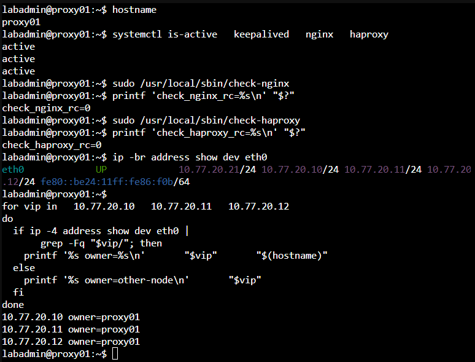
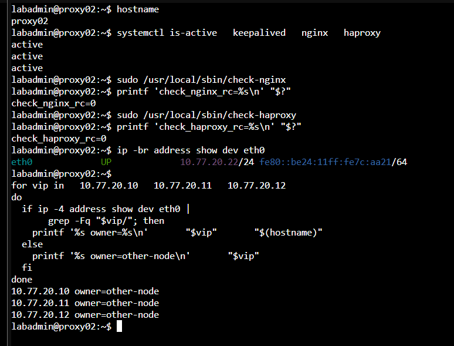
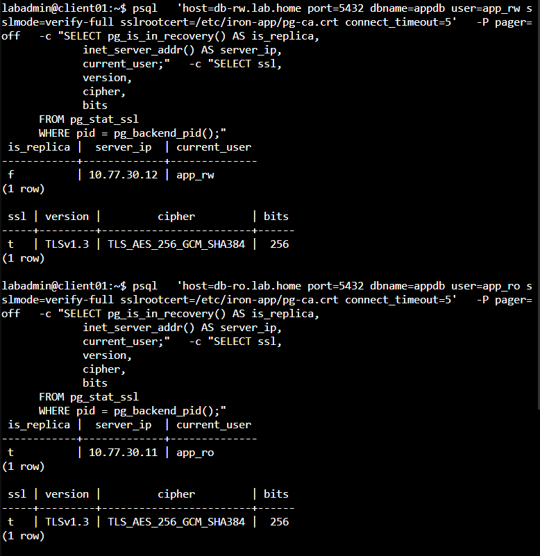
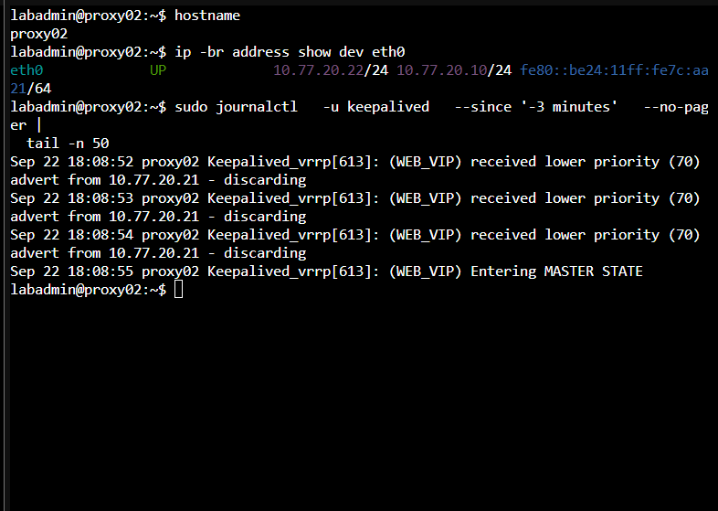
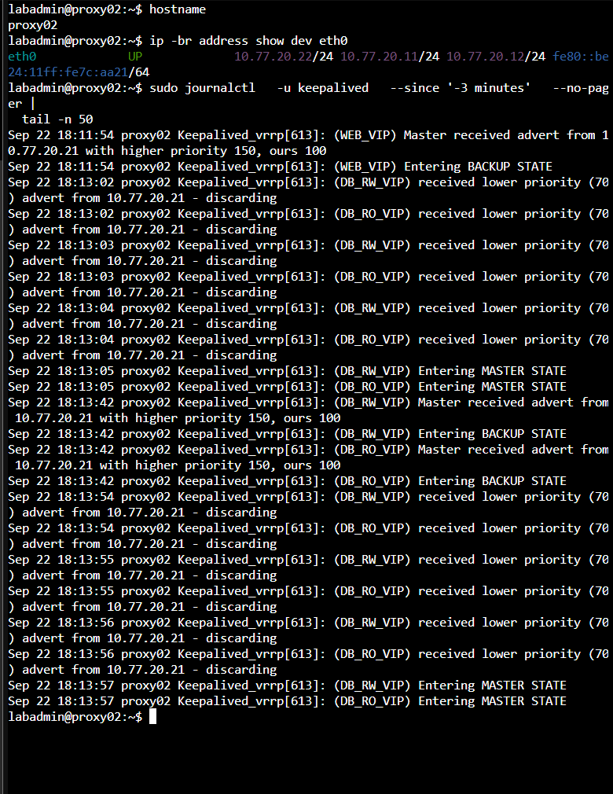
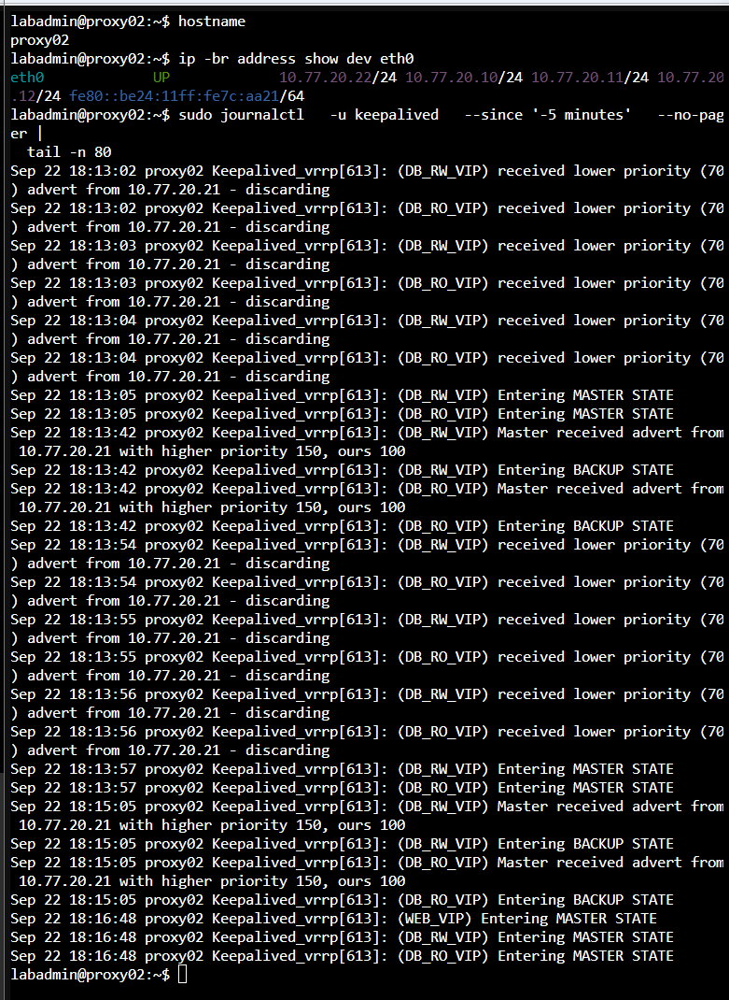

# Day 26｜讓代理節點故障後自動接管：Keepalived、VRRP 與三組高可用 VIP

對應文章：[Day 26｜讓代理節點故障後自動接管：Keepalived、VRRP 與三組高可用 VIP](https://ithelp.ithome.com.tw/users/20183351/ironman/9461)

本日由 proxy01／02 提供三組獨立 VIP：Web `10.77.20.10`、DB RW `10.77.20.11`、DB RO `10.77.20.12`。VIP 不配置在 OPNsense。

## 本日操作順序

1. 先在 proxy01、proxy02 分別確認實際 Service NIC 名稱與 Nginx、HAProxy 健康狀態。
2. 逐台建立 Health Script，先手動執行並確認 Exit Code。
3. 先完成 proxy01 的 Keepalived Config，但先不要測試故障。
4. 再完成 proxy02 的 Config，確認 VRID、Priority 與 Peer Address 和 proxy01 相符。
5. 先啟動較高 Priority 的 proxy01，確認它成為 Master 後再啟動 proxy02，建立容易判讀的初始狀態；實際 HA 運作不依賴此啟動順序。
6. 從 client01 分別測試三組 VIP，最後才到 OPNsense 啟用正式需要的規則。

## 1. 前置確認

**操作節點：proxy01、proxy02。逐台確認，不要假設兩台 NIC 都叫 `eth0`。**

先在 proxy01 執行並確認，再到 proxy02 重複：

```bash
sudo apt update
sudo apt install -y keepalived
ip -br address
sudo sysctl net.ipv4.ip_nonlocal_bind
sudo nginx -t
sudo haproxy -c -f /etc/haproxy/haproxy.cfg
```

以下假設 Service NIC 是 `eth0`。若 `ip -br address` 顯示其他名稱，兩台 Keepalived Config 都要改成實際名稱。

## 2. 建立 Health Script

**操作節點：proxy01、proxy02。`check-haproxy` 兩台相同，但 `check-nginx` 必須檢查各自的 Node IP；不能兩台都指向 proxy01。**

proxy01 的 `/usr/local/sbin/check-nginx`：

```bash
sudo nano /usr/local/sbin/check-nginx
```

```bash
#!/bin/sh
systemctl is-active --quiet nginx && curl -fsS --max-time 2 http://10.77.20.21/health >/dev/null
```

在 proxy01 按 `Ctrl+O`、Enter、`Ctrl+X` 儲存。

proxy02 的 `/usr/local/sbin/check-nginx` 使用以下完整內容：

```bash
sudo nano /usr/local/sbin/check-nginx
```

```bash
#!/bin/sh
systemctl is-active --quiet nginx && curl -fsS --max-time 2 http://10.77.20.22/health >/dev/null
```

在 proxy02 按 `Ctrl+O`、Enter、`Ctrl+X` 儲存。特別確認 proxy01 是 `.21`，proxy02 是 `.22`。如果 proxy02 也檢查 `.21`，當 proxy01 Nginx 停止時，兩台的 `chk_nginx` 會一起失敗，Web VIP 就無法正確切換。

接著在兩台開啟 `/usr/local/sbin/check-haproxy`：

```bash
sudo nano /usr/local/sbin/check-haproxy
```

```bash
#!/bin/sh
systemctl is-active --quiet haproxy && \
  printf 'show info\n' | \
  socat -T 2 stdio UNIX-CONNECT:/run/haproxy/admin.sock | \
  grep -q '^Stopping: 0'
```

HAProxy 3.0 的 `show info` 輸出可能不包含 `Status: READY`；這裡改查實際存在的 `Stopping: 0`。因此此 Script 同時確認 systemd 服務為 Active、Runtime Socket 能回應，而且 HAProxy 程序未進入停止狀態；Listener、後端與資料庫角色由後續連線測試確認。

兩台都按 `Ctrl+O`、Enter、`Ctrl+X` 儲存，再執行：

```bash
sudo chown root:root /usr/local/sbin/check-nginx /usr/local/sbin/check-haproxy
sudo chmod 750 /usr/local/sbin/check-nginx /usr/local/sbin/check-haproxy
sudo /usr/local/sbin/check-nginx
echo $?
sudo /usr/local/sbin/check-haproxy
echo $?
sudo grep -n 'http://' /usr/local/sbin/check-nginx
```

兩個 Script 的 Exit Code 都必須是 `0`。最後一個指令在 proxy01 必須顯示 `10.77.20.21`，在 proxy02 必須顯示 `10.77.20.22`。Exit Code 為非零時，先檢查 Nginx、HAProxy 與腳本內的 Own-IP，確認正常後再啟動 Keepalived。

## 3. proxy01 Keepalived Config

**操作節點：只在 proxy01。**

建立 `/etc/keepalived/keepalived.conf`：

```bash
sudo cp -a /etc/keepalived/keepalived.conf \
  /etc/keepalived/keepalived.conf.before-day26 2>/dev/null || true
sudo nano /etc/keepalived/keepalived.conf
```

```conf
global_defs {
    router_id PROXY01
    enable_script_security
    script_user root
}

vrrp_script chk_nginx {
    script "/usr/local/sbin/check-nginx"
    interval 2
    timeout 2
    fall 2
    rise 2
    weight -80
}

vrrp_script chk_haproxy {
    script "/usr/local/sbin/check-haproxy"
    interval 2
    timeout 2
    fall 2
    rise 2
    weight -80
}

vrrp_instance WEB_VIP {
    state BACKUP
    interface eth0
    virtual_router_id 20
    priority 150
    advert_int 1
    unicast_src_ip 10.77.20.21
    unicast_peer { 10.77.20.22 }
    authentication {
        auth_type PASS
        auth_pass IR0N2026
    }
    virtual_ipaddress { 10.77.20.10/24 dev eth0 }
    track_script { chk_nginx }
}

vrrp_instance DB_RW_VIP {
    state BACKUP
    interface eth0
    virtual_router_id 21
    priority 150
    advert_int 1
    unicast_src_ip 10.77.20.21
    unicast_peer { 10.77.20.22 }
    authentication {
        auth_type PASS
        auth_pass IR0N2026
    }
    virtual_ipaddress { 10.77.20.11/24 dev eth0 }
    track_script { chk_haproxy }
}

vrrp_instance DB_RO_VIP {
    state BACKUP
    interface eth0
    virtual_router_id 22
    priority 150
    advert_int 1
    unicast_src_ip 10.77.20.21
    unicast_peer { 10.77.20.22 }
    authentication {
        auth_type PASS
        auth_pass IR0N2026
    }
    virtual_ipaddress { 10.77.20.12/24 dev eth0 }
    track_script { chk_haproxy }
}
```

按 `Ctrl+O`、Enter、`Ctrl+X` 儲存，但先不啟動 Keepalived。先驗證這份設定：

```bash
sudo keepalived --config-test \
  --use-file=/etc/keepalived/keepalived.conf
```

Config Test 必須成功。若出現 NIC 不存在，回到第 1 節，把設定中的 `eth0` 全部改成 proxy01 的實際 Service NIC 名稱。

`auth_pass` 主要用來降低誤配置風險；正式環境要限制 VRRP Peer 與網路存取，建立完整的安全邊界。

## 4. proxy02 Config

**操作節點：只在 proxy02。完成後先做 Config Check。**

先備份原始設定，再開啟 Config：

```bash
sudo cp -a /etc/keepalived/keepalived.conf \
  /etc/keepalived/keepalived.conf.before-day26 2>/dev/null || true
sudo nano /etc/keepalived/keepalived.conf
```

將下列完整設定貼入：

```conf
global_defs {
    router_id PROXY02
    enable_script_security
    script_user root
}

vrrp_script chk_nginx {
    script "/usr/local/sbin/check-nginx"
    interval 2
    timeout 2
    fall 2
    rise 2
    weight -80
}

vrrp_script chk_haproxy {
    script "/usr/local/sbin/check-haproxy"
    interval 2
    timeout 2
    fall 2
    rise 2
    weight -80
}

vrrp_instance WEB_VIP {
    state BACKUP
    interface eth0
    virtual_router_id 20
    priority 100
    advert_int 1
    unicast_src_ip 10.77.20.22
    unicast_peer { 10.77.20.21 }
    authentication {
        auth_type PASS
        auth_pass IR0N2026
    }
    virtual_ipaddress { 10.77.20.10/24 dev eth0 }
    track_script { chk_nginx }
}

vrrp_instance DB_RW_VIP {
    state BACKUP
    interface eth0
    virtual_router_id 21
    priority 100
    advert_int 1
    unicast_src_ip 10.77.20.22
    unicast_peer { 10.77.20.21 }
    authentication {
        auth_type PASS
        auth_pass IR0N2026
    }
    virtual_ipaddress { 10.77.20.11/24 dev eth0 }
    track_script { chk_haproxy }
}

vrrp_instance DB_RO_VIP {
    state BACKUP
    interface eth0
    virtual_router_id 22
    priority 100
    advert_int 1
    unicast_src_ip 10.77.20.22
    unicast_peer { 10.77.20.21 }
    authentication {
        auth_type PASS
        auth_pass IR0N2026
    }
    virtual_ipaddress { 10.77.20.12/24 dev eth0 }
    track_script { chk_haproxy }
}
```

按 `Ctrl+O`、Enter、`Ctrl+X` 儲存，再檢查 proxy02 的節點專屬欄位並執行 Config Test：

```bash
sudo grep -nE 'router_id|priority|unicast_src_ip|unicast_peer' \
  /etc/keepalived/keepalived.conf
sudo keepalived --config-test \
  --use-file=/etc/keepalived/keepalived.conf
```

Config Test 必須成功。若出現 NIC 不存在，回到第 1 節，把 `eth0` 改成 proxy02 的實際 Service NIC 名稱。

## 5. 啟動與確認

**以下使用固定的驗證順序：先啟動 proxy01，等三組 VIP 都出現後，再啟動 proxy02。這個順序能避開初始選舉的短暫過渡；Keepalived 完成收斂後的角色由 VRRP 選舉結果決定。**

先在 proxy01 執行：

```bash
sudo keepalived --config-test \
  --use-file=/etc/keepalived/keepalived.conf
sudo systemctl enable --now keepalived
sleep 5
systemctl is-active nginx haproxy keepalived
ip -br address show eth0
```

確認 proxy01 已持有 `10.77.20.10`、`10.77.20.11`、`10.77.20.12` 三組 VIP，再到 proxy02 執行：

```bash
sudo keepalived --config-test \
  --use-file=/etc/keepalived/keepalived.conf
sudo systemctl enable --now keepalived
sleep 5
systemctl is-active nginx haproxy keepalived
ip -br address show eth0
```

`sleep 5` 是讓 VRRP 完成初始選舉與收斂；不要在服務剛啟動後立即判斷 VIP 所屬。若先啟動 proxy02，它在尚未收到 proxy01 Advertisement 時會暫時成為 Master；proxy01 上線後，proxy02 收到 Priority 150 的 Advertisement 就會自動退回 BACKUP。

之後主機自動重啟不需要人工控制順序：

- 只有 proxy02 重啟：proxy01 持續為 Master，proxy02 回來後留在 BACKUP。
- proxy01 重啟：proxy02 先接手 VIP；proxy01 回來後依 Priority 150 進行 Preempt，VIP 回到 proxy01。
- 兩台同時重啟：VRRP 會自行選舉，最後由健康且 Priority 較高的節點持有 VIP。

正常收斂後，proxy01 持有三組 VIP，proxy02 不持有。

在 proxy01 執行：

```bash
systemctl is-active nginx haproxy keepalived
ip -4 -o address show dev eth0 |
  awk '$4 ~ /^10\.77\.20\.(10|11|12)\/24$/'
```

預期三個 Service 都是 `active`，並看到三組 VIP。在 proxy02 執行：

```bash
systemctl is-active nginx haproxy keepalived
if ip -4 -o address show dev eth0 |
  awk '$4 ~ /^10\.77\.20\.(10|11|12)\/24$/' |
  grep -q .; then
  echo 'ERROR: proxy02 still owns one or more VIPs'
else
  echo 'OK: proxy02 does not own VIP'
fi
```

正常基準下 proxy02 不應出現三組 VIP。如果啟動或重啟後的短暫選舉期曾在兩台看到 VIP，先等待 5 至 10 秒並檢查 Keepalived Log。收斂後兩台同時持有同一組 VIP，表示發生持續性 split-brain；此時停止 proxy02 Keepalived，檢查 VRID、Unicast Peer、NIC 與兩台之間的 VRRP Protocol 112，修正後再繼續測試 Client。



圖（一）正常收斂後，proxy01 的服務與健康腳本皆正常，並持有三組 VIP



圖（二）proxy02 的服務與健康腳本皆正常，穩定狀態下未持有 VIP

client01：

```bash
sudo apt update
sudo apt install -y curl netcat-openbsd postgresql-client tcpdump
curl http://10.77.20.10/health
nc -vz 10.77.20.11 5432
nc -vz 10.77.20.12 5432
```

三個服務入口都應成功。接著確認 OPNsense Unbound 是否已建立 Host Override；尚未建立時依下列步驟新增：

1. 登入 OPNsense Web UI。
2. 選 `Services` → `Unbound DNS` → `Overrides`。
3. 在 `Host Overrides` 按 `Add`。
4. 依下表逐筆建立，Type 都選 `A (IPv4 address)`：

   | Host    | Domain     | IP Address    | Description | 最終 FQDN        |
   | ------- | ---------- | ------------- | ----------- | ---------------- |
   | `web`   | `lab.home` | `10.77.20.10` | `Web VIP`   | `web.lab.home`   |
   | `db-rw` | `lab.home` | `10.77.20.11` | `DB RW VIP` | `db-rw.lab.home` |
   | `db-ro` | `lab.home` | `10.77.20.12` | `DB RO VIP` | `db-ro.lab.home` |

5. 每筆按 `Save`，三筆都完成後按頁面上方 `Apply`。
6. 確認清單中的 Host 分別是 `web`、`db-rw`、`db-ro`，三筆 Domain 都是 `lab.home`。
7. 回到 client01 重做三次 `getent ahostsv4`。

OPNsense 會將 `Host` 與 `Domain` 組合成 FQDN。不要把 `db-rw.lab.home` 或 `db-ro.lab.home` 整串填入 Domain，也不要在這兩筆繼續使用 Host `web`；否則會產生 `web.db-rw.lab.home` 或 `web.db-ro.lab.home` 這類錯誤名稱。

確認 DNS 指向三組 VIP：

```bash
getent ahostsv4 web.lab.home
getent ahostsv4 db-rw.lab.home
getent ahostsv4 db-ro.lab.home
```

## 6. 將 Root CA 安裝到測試節點

操作位置：先在 ca01 PVE Console 取得 Public Root Certificate，再到 app01、app02、client01 安裝。Root Certificate 可以公開，但 Private Key 絕對不能複製離開 ca01。

在 ca01 顯示 Root Certificate 與 Fingerprint：

```bash
sudo cat /var/lib/step-ca/certs/root_ca.crt
sudo openssl x509 -in /var/lib/step-ca/certs/root_ca.crt \
  -noout -fingerprint -sha256
```

記錄完整 PEM 與 SHA256 Fingerprint。到 app01 執行：

```bash
sudo install -d -m 0755 /etc/iron-app
sudo nano /etc/iron-app/pg-ca.crt
```

貼上從 `-----BEGIN CERTIFICATE-----` 到 `-----END CERTIFICATE-----` 的完整內容，按 `Ctrl+O`、Enter、`Ctrl+X`。再執行：

```bash
sudo chown root:root /etc/iron-app/pg-ca.crt
sudo chmod 644 /etc/iron-app/pg-ca.crt
sudo openssl x509 -in /etc/iron-app/pg-ca.crt \
  -noout -fingerprint -sha256
```

Fingerprint 必須與 ca01 相同。在 app02 重複相同操作。

到 client01 建立相同路徑：

```bash
sudo install -d -m 0755 /etc/iron-app
sudo nano /etc/iron-app/pg-ca.crt
```

貼上同一份 Public Root Certificate，儲存後執行：

```bash
sudo chown root:root /etc/iron-app/pg-ca.crt
sudo chmod 644 /etc/iron-app/pg-ca.crt
sudo openssl x509 -in /etc/iron-app/pg-ca.crt \
  -noout -fingerprint -sha256
```

app01、app02、client01 顯示的 Fingerprint 都必須與 ca01 相同。

持續探測需要在背景連線兩組資料庫入口，因此在 client01 建立僅供目前使用者讀取的密碼檔：

```bash
(
  umask 077
  nano /home/labadmin/.pgpass
)
```

填入以下兩行，分別換成 `app_rw` 與 `app_ro` 的實際密碼：

```text
db-rw.lab.home:5432:appdb:app_rw:實際app_rw密碼
db-ro.lab.home:5432:appdb:app_ro:實際app_ro密碼
```

密碼包含冒號 `:` 或反斜線 `\` 時，必須在該字元前加上反斜線進行跳脫。

儲存後立即限制權限：

```bash
chmod 600 /home/labadmin/.pgpass
stat -c '%U %G %a %n' /home/labadmin/.pgpass
```

結果必須顯示擁有者為 `labadmin`、權限為 `600`。密碼檔只保存在 client01，不顯示內容、不複製到其他節點，也不提交到 Git。

最後在 client01 先各做一次 TLS 連線，確認進入持續 Probe 前沒有 DNS、憑證、密碼或 HBA 問題：

```bash
psql \
  'host=db-rw.lab.home port=5432 dbname=appdb user=app_rw sslmode=verify-full sslrootcert=/etc/iron-app/pg-ca.crt connect_timeout=3' \
  -w \
  -Atqc 'SELECT pg_is_in_recovery(),inet_server_addr();'

psql \
  'host=db-ro.lab.home port=5432 dbname=appdb user=app_ro sslmode=verify-full sslrootcert=/etc/iron-app/pg-ca.crt connect_timeout=3' \
  -w \
  -Atqc 'SELECT pg_is_in_recovery(),inet_server_addr();'
```

RW 預期第一欄為 `f`，RO 預期為 `t`。



圖（三）DB-RW 抵達 Primary、DB-RO 抵達 Replica，兩條連線都通過完整 TLS 驗證

## 7. 分開測試三組 VIP

**操作節點：從 client01 發起測試。切換時只停止一項服務，驗證完立即恢復。**

開始前在 client01 安裝 `tmux`，並在目前這一個 SSH／Console Connection 內建立名為 `day26` 的 Session：

```bash
sudo apt update
sudo apt install -y tmux
tmux new-session -s day26
```

進入 `tmux` 後，在目前 Pane 依序執行下列指令，將同一個 Window 分成左邊一個、右邊上下各一個，共三個 Pane：

```bash
tmux split-window -h
tmux split-window -v
```

第一條指令建立右側 Pane，tmux 會自動將焦點移到新 Pane；第二條指令因此會將右側 Pane 分成上下兩個。之後按 `Ctrl+B`，放開後按方向鍵，即可在三個 Pane 間切換。

在第一個 Pane 持續測 Web VIP：

```bash
while true; do
  printf '%s web ' "$(date -Is)"
  curl -sS --connect-timeout 2 http://10.77.20.10/health || echo 'failed'
  sleep 1
done
```

在第二個 Pane 持續測 DB RW VIP：

```bash
while true; do
  printf '%s rw ' "$(date -Is)"
  psql \
    'host=db-rw.lab.home port=5432 dbname=appdb user=app_rw sslmode=verify-full sslrootcert=/etc/iron-app/pg-ca.crt connect_timeout=2' \
    -w \
    -Atqc 'SELECT pg_is_in_recovery(),inet_server_addr();' || echo 'failed'
  sleep 1
done
```

在第三個 Pane 持續測 DB RO VIP：

```bash
while true; do
  printf '%s ro ' "$(date -Is)"
  psql \
    'host=db-ro.lab.home port=5432 dbname=appdb user=app_ro sslmode=verify-full sslrootcert=/etc/iron-app/pg-ca.crt connect_timeout=2' \
    -w \
    -Atqc 'SELECT pg_is_in_recovery(),inet_server_addr();' || echo 'failed'
  sleep 1
done
```

不要顯示或提交 `.pgpass`；正式環境應改由祕密儲存服務提供資料庫憑證。

`tmux` 的離開與結束方式不同：

- 只是暫時離開、讓三個 Probe 繼續執行：按 `Ctrl+B`，放開後按 `d`。
- 回到原本 Session：在 client01 執行 `tmux attach-session -t day26`。
- 當日測試完成：先到三個 Pane 各按一次 `Ctrl+C` 停止 Probe，再按 `Ctrl+B`、放開後按 `d` 回到普通 Shell，最後執行：

```bash
tmux kill-session -t day26
tmux list-sessions 2>/dev/null || echo 'No tmux session remains'
```

若 SSH Connection 意外中斷，`tmux` 內的 Probe 不會因此停止；重新連入 client01 後用上述 `attach-session` 取回畫面。

### 7.1 停止 proxy01 Nginx

在 proxy01：

```bash
date -Is
sudo systemctl stop nginx
```

預期只有 Web VIP 移到 proxy02，DB RW／RO VIP 留在 proxy01。分別在 proxy01 與 proxy02 執行：

```bash
ip -br address show eth0
sudo journalctl -u keepalived --since '-2 min' --no-pager
```



圖（四）proxy02 接管 Web VIP，DB-RW 與 DB-RO VIP 保持在 proxy01

恢復：

```bash
sudo systemctl start nginx
sudo nginx -t
systemctl is-active nginx
```

在兩台重新執行 `ip -br address show eth0`。等待 Web VIP 回到 proxy01，且第一個 Client Probe 恢復正常後，才做下一項。

### 7.2 停止 proxy01 HAProxy

在 proxy01：

```bash
date -Is
sudo systemctl stop haproxy
```

預期 DB RW 與 DB RO VIP 移到 proxy02，Web VIP 留在 proxy01。先確認接管結果：



圖（五）proxy02 接管 DB-RW 與 DB-RO VIP，Web VIP 保持在 proxy01

確認後恢復：

```bash
sudo systemctl start haproxy
sudo haproxy -c -f /etc/haproxy/haproxy.cfg
systemctl is-active haproxy
```

在兩台重新執行 `ip -br address show eth0`。等待 DB RW／RO VIP 回到 proxy01，且兩個 DB Probe 恢復正常後，才做下一項。

### 7.3 關閉 proxy01 VM

操作位置：PVE Web UI。

1. 左側選 VM 201 `proxy01`。
2. 選 `Summary`，先確認 VM 202 `proxy02` 為 Running。
3. 按右上角 `Shutdown`，不要使用 `Stop`。
4. 等待 proxy01 顯示 Stopped。
5. 回 client01 觀察三個 Probe。
6. 到 proxy02 執行 `ip -br address show eth0`，確認三組 VIP 都在 proxy02。



圖（六）proxy01 關機後，proxy02 成為三組 VRRP 執行個體的 MASTER 並持有全部 VIP

確認接管後恢復正常基準：

1. 在 PVE Web UI 選 VM 201 → `Start`。
2. 等待 Nginx、HAProxy、Keepalived 都為 Active，再確認 VIP 是否依 Priority Preempt 回 proxy01。

每一項都要記錄：執行時間、第一次失敗、第一次恢復、VIP 所在節點與錯誤訊息。不要只記錄 `systemctl active`。

## 8. 完成今日可執行的最後設定

**操作位置：fw01 的 OPNsense Web UI。規則完成後回到 client01 驗證。**

### 8.1 確認 Web VIP 的目前服務邊界

目前 Web VIP 提供內部 HTTP 服務。外部 HTTPS 入口需要先部署 Web Server Certificate、Nginx `listen 443 ssl`、WAN TCP 443 Port Forward 與對應的 WAN Pass Rule，再開放網際網路連線。

在 client01 確認目前的服務邊界：

```bash
curl -fsS http://web.lab.home/health
nc -vz -w 3 web.lab.home 443
```

HTTP Health Check 應成功，TCP 443 應顯示目前沒有服務監聽，確認 Web VIP 的內部 HTTP 入口已可使用。

### 8.2 建立 OpenVPN 到 DB VIP 的規則

本系列使用 `OpenVPN` Interface Group 接收所有 OpenVPN Tunnel Traffic。以下規則的 Interface 都選 `OpenVPN`，不選 `WAN`、`LAB_INTERNAL` 或個別 `ovpns` Device。

#### 8.2.1 建立 DB 使用者群組

既有的 `vpn-rw01`、`vpn-ro01` 帳號已具備個人 Client Certificate。現在建立對應的 DB 群組：

1. 進入 `System` → `Access` → `Groups`。
2. 按 `Add`，Group Name 填 `vpn-db-rw`，將 `vpn-rw01` 加入 Member，Description 填 `VPN DB read-write users`，按 `Save`。
3. 再按 `Add`，Group Name 填 `vpn-db-ro`，將 `vpn-ro01` 加入 Member，Description 填 `VPN DB read-only users`，按 `Save`。
4. 回到 Users 檢查：`vpn-rw01` 只屬於 `vpn-db-rw`，`vpn-ro01` 只屬於 `vpn-db-ro`，不要把兩者加入 `vpn-admin`。

#### 8.2.2 建立 OpenVPN Group 動態 Alias

1. 進入 `Firewall` → `Aliases`，按 `Add`。
2. Name 填 `VPN_DB_RW_CLIENTS`。
3. Type 選 `OpenVPN group`。
4. Content 選／填 `vpn-db-rw`。
5. Description 填 `Connected OpenVPN members of vpn-db-rw`，按 `Save`。
6. 再建立 `VPN_DB_RO_CLIENTS`，Type 同樣選 `OpenVPN group`，Content 選／填 `vpn-db-ro`，Description 填 `Connected OpenVPN members of vpn-db-ro`。
7. 按 `Apply`。

沒有對應使用者連入 VPN 時，這兩個 Alias 可以是空的，屬於正常現象。

#### 8.2.3 在 OpenVPN Interface 建立三條規則

進入 `Firewall` → `Rules`，左上角的 Interface 篩選明確選 `OpenVPN`。三條規則的 Direction 都選 `in`、Quick 保持勾選、TCP/IP Version 選 `IPv4`、Protocol 選 `TCP`。

第一條是 RW 使用者連 RW VIP：

1. Action：`Pass`。
2. Interface：`OpenVPN`。
3. Source：Alias `VPN_DB_RW_CLIENTS`。
4. Destination：Alias `DB_RW_VIP`（`10.77.20.11`）。
5. Destination Port：`5432`。
6. 勾選 Log，Description：`ALLOW_VPN_DB_RW_TO_DB_RW_VIP`。
7. 按 `Save`。

第二條明確拒絕 RO 使用者連 RW VIP：

1. Action：`Block`。
2. Interface：`OpenVPN`。
3. Source：Alias `VPN_DB_RO_CLIENTS`。
4. Destination：Alias `DB_RW_VIP`（`10.77.20.11`）。
5. Destination Port：`5432`。
6. 勾選 Log，Description：`BLOCK_VPN_DB_RO_TO_DB_RW_VIP`。
7. 按 `Save`。

第三條是 RO 使用者連 RO VIP：

1. Action：`Pass`。
2. Interface：`OpenVPN`。
3. Source：Alias `VPN_DB_RO_CLIENTS`。
4. Destination：Alias `DB_RO_VIP`（`10.77.20.12`）。
5. Destination Port：`5432`。
6. 勾選 Log，Description：`ALLOW_VPN_DB_RO_TO_DB_RO_VIP`。
7. 按 `Save`，先不按 `Apply`，先完成下一節的規則排序。

#### 8.2.4 排列 OpenVPN 規則順序

OPNsense 會依規則順序比對 Traffic。在 `Firewall` → `Rules` 選 `OpenVPN`，使用規則左側的 Move／Anchor 功能調整順序，由上而下應為：

```text
ALLOW_OPENVPN_TO_FIREWALL_DNS
ALLOW_VPN_ADMIN_TO_PVE_WEB
BLOCK_OTHER_OPENVPN_TO_PVE_NODES
ALLOW_VPN_DB_RW_TO_DB_RW_VIP
BLOCK_VPN_DB_RO_TO_DB_RW_VIP
ALLOW_VPN_DB_RO_TO_DB_RO_VIP
BLOCK_OPENVPN_TO_PG_NODES
其他未授權流量由 pf 隱含 Default Deny 拒絕
```

`BLOCK_VPN_DB_RO_TO_DB_RW_VIP` 必須位於任何可能允許 RO 使用者存取較寬範圍的 Pass Rule 之上。本系列不建立 `OpenVPN network → any Pass`；若當前畫面存在自行新增的寬鬆 Pass Rule，先停用或移到所有精確 Block 之下，否則後面的拒絕測試沒有意義。

排序完成後按 `Apply`，再重新進入 `OpenVPN` 規則清單，由上往下核對一次。

確認 `BLOCK_VPN_DB_RO_TO_DB_RW_VIP` 存在，並保留既有的 `BLOCK_OPENVPN_TO_PG_NODES`。VIP 可用後也要繼續阻擋 PG Node 直連。

DB VIP 不建立 WAN Port Forward。

規則完成後，先使用 `vpn-rw01` Profile 連入 OpenVPN，在 Windows PowerShell 執行：

```powershell
Test-NetConnection db-rw.lab.home -Port 5432
Test-NetConnection db-ro.lab.home -Port 5432
Test-NetConnection 10.77.30.11 -Port 5432
```

RW VIP 應成功，RO VIP 與 PG Node 直連必須失敗。斷開後改用 `vpn-ro01` Profile 連入，執行：

```powershell
Test-NetConnection db-ro.lab.home -Port 5432
Test-NetConnection db-rw.lab.home -Port 5432
Test-NetConnection 10.77.30.11 -Port 5432
```

RO VIP 應成功；RW VIP 必須失敗並命中 `BLOCK_VPN_DB_RO_TO_DB_RW_VIP`；PG Node 直連也必須失敗。

完成兩組測試後，進入 OPNsense `Firewall` → `Log Files` → `Live View`，依 Source Tunnel IP 與 Description 過濾，確認精確 Block Rule 或 Default Deny 留下對應紀錄。連線失敗與阻擋日誌要同時成立，才能判定流量由防火牆拒絕。若結果不符，不要把 Source 暫時放寬成 `any`，先檢查 VPN 路由、規則順序與命中的規則。

### 8.3 將 app01、app02 改用 DB RW VIP

操作位置：app01、app02。

```bash
sudo nano /etc/iron-app.env
```

將檔案內容確認為以下四行；`DB_PASSWORD` 填入為 `app_rw` 設定的實際密碼，不可刪除或保留範例文字：

```text
DB_HOST=db-rw.lab.home
DB_SSLMODE=verify-full
DB_SSLROOTCERT=/etc/iron-app/pg-ca.crt
DB_PASSWORD=實際app_rw密碼
```

按 `Ctrl+O`、Enter、`Ctrl+X`，再執行：

```bash
sudo systemctl restart iron-app
sudo systemctl status iron-app --no-pager
curl -sS http://127.0.0.1:8080/health
```

```bash
curl -i -X POST --connect-timeout 3 \
  http://127.0.0.1:8080/write
```

`/write` 必須回傳 HTTP 200 與包含 `id`、`backend` 的 JSON。若回傳 HTTP 500，立即在同一台 App Node 執行：

```bash
sudo journalctl -u iron-app \
  --since '-5 min' \
  -o cat --no-pager
```

依最後一段 Python Traceback 修正問題；不要只看 `systemctl status`，因為它會省略錯誤內容。常見訊息可依下列方向判讀：

在 app01、app02 都完成上述修改，而且兩台本機 `/write` 都成功後，才從 client01 連續寫入，確認兩個 Backend 經 DB RW VIP 都可使用：

```bash
for i in $(seq 1 6); do
  curl -sS -X POST --connect-timeout 3 http://web.lab.home/write
  echo
done
```

可以在 app01、app02 做負向測試：

```bash
  for ip in 10.77.30.11 10.77.30.12 10.77.30.13; do
    echo "=== ${ip}:5432 ==="
    timeout 3 bash -c "</dev/tcp/${ip}/5432" &&
      echo 'ERROR: direct connection unexpectedly reachable' ||
      echo 'OK: direct connection blocked'
  done

```

Service VLAN 的 App 與 DB VIP 位於同一 Layer 2 Network，這段流量不會經過 OPNsense；需由 Proxy Host Firewall、HAProxy Authentication Path 與 PostgreSQL Role 控制。
