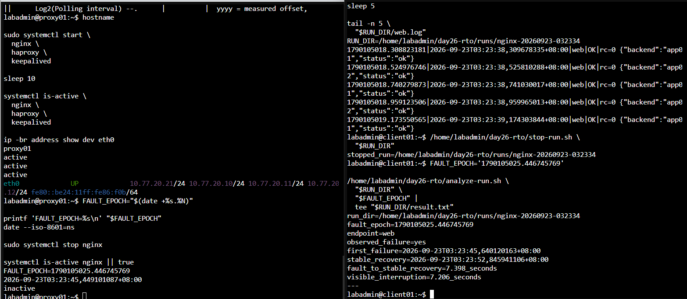
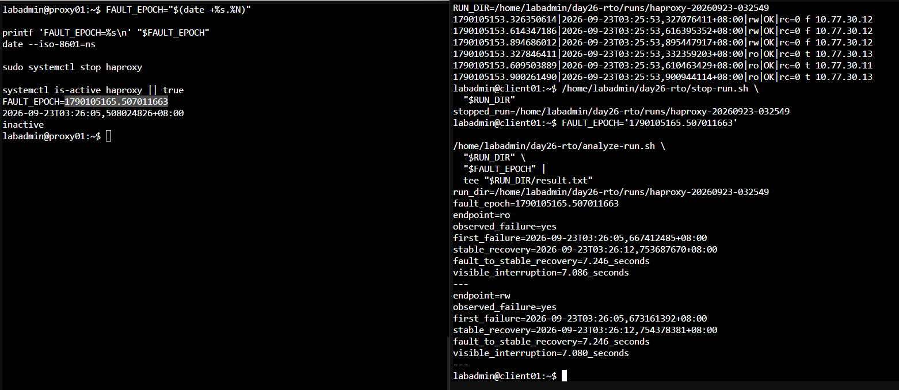
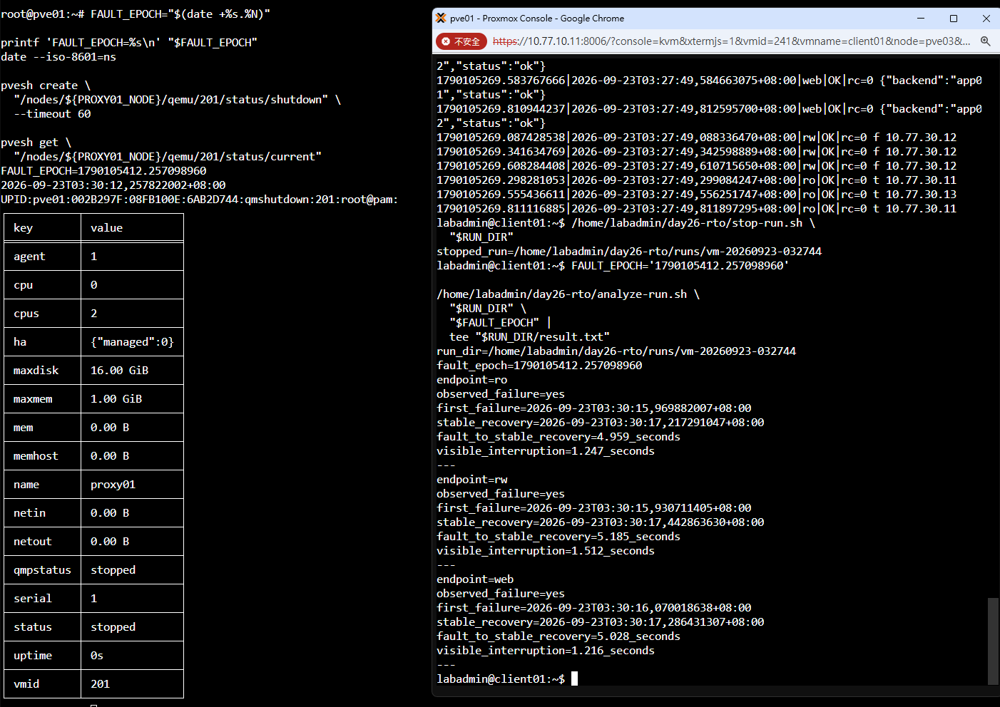
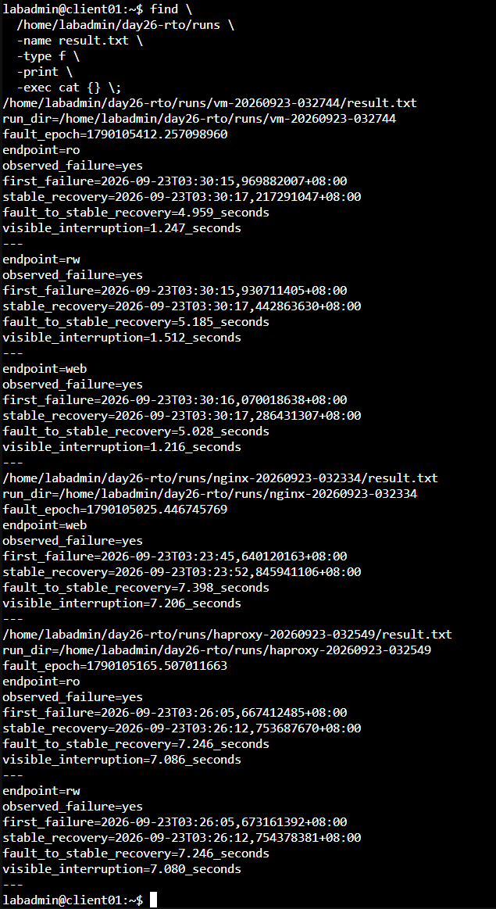

# Day 26 額外實作：量測三組 VIP 的故障切換時間

本篇接續 [Day 26 Keepalived 與三組 VIP](./DAY26_Keepalived與三組VIP.md)。主實作先完成三組固定入口與接管驗證；這裡改用 0.2 秒探測保存每次請求結果，自動計算故障注入到穩定恢復，以及用戶端真正觀察到的中斷時間。

本次補測三種情境：

1. 停止 proxy01 的 Nginx，量測 Web VIP。
2. 停止 proxy01 的 HAProxy，量測 DB-RW 與 DB-RO VIP。
3. 正常關閉 proxy01 VM，量測三組 VIP。

探測間隔為 0.2 秒。切換後連續三次成功中的第一筆，視為穩定恢復時間。結果會自動列出：

- 故障注入時間。
- 第一次失敗時間。
- 穩定恢復時間。
- 故障注入到穩定恢復秒數。
- 第一次失敗到穩定恢復的可見中斷秒數。

如果探測沒有捕捉到失敗，結果會顯示 `observed_failure=no` 與 `visible_interruption=not_observed`，不可解讀為中斷時間 0 秒。

## 一、確認三端時間同步

分別在 `client01`、`proxy01` 與稍後操作 VM 的 PVE 節點執行：

```bash
hostname
date --iso-8601=ns
timedatectl show -p NTPSynchronized --value
```

最後一行都應為 `yes`。故障到恢復的起點與終點來自不同主機，因此時間未同步時不要開始量測。

### 1.1 proxy01、proxy02 或 client01 顯示 no

在顯示 `no` 的 Debian VM 執行下列完整命令。這三台位於 Service VLAN，使用 OPNsense 的 `10.77.20.1` 作為共同時間來源：

```bash
hostname

sudo timedatectl set-timezone Asia/Taipei

sudo apt update
sudo apt install -y chrony

echo 'server 10.77.20.1 iburst prefer' | \
  sudo tee /etc/chrony/sources.d/opnsense.sources

sudo systemctl disable --now systemd-timesyncd 2>/dev/null || true
sudo systemctl enable --now chrony
sudo systemctl restart chrony

sudo chronyc makestep
chronyc waitsync 30 0.1

systemctl is-enabled chrony
systemctl is-active chrony
chronyc tracking
chronyc sources -n -v
date --iso-8601=ns
timedatectl show \
  -p Timezone \
  -p NTPSynchronized
```

確認結果：

- `chrony` 為 `enabled` 與 `active`。
- `chronyc tracking` 的 `Leap status` 為 `Normal`。
- `chronyc sources -n -v` 中至少有一個來源以 `^*` 開頭；本次預期為 `10.77.20.1`。
- `NTPSynchronized=yes`。

如果 `chronyc waitsync 30 0.1` 完成後顯示未同步，執行以下診斷並保留輸出，完成時間同步後再進行 RTO 測試：

```bash
hostname
ip route
systemctl status chrony --no-pager -l
sudo chronyc online
sudo chronyc burst 4/4
sleep 5
chronyc tracking
chronyc sources -n -v
sudo journalctl -u chrony -b -n 100 -o short-iso-precise --no-pager
```

此時要檢查 OPNsense 是否向 Service VLAN 提供 NTP，以及防火牆是否允許這些 VM 連往 `10.77.20.1` 的 UDP 123。

### 1.2 PVE 節點顯示 no

PVE 已使用 Chrony。先執行既有服務的重新同步，不要在這裡更換 NTP 套件：

```bash
hostname
systemctl is-enabled chrony
systemctl is-active chrony
chronyc sources -n -v

systemctl restart chrony
chronyc makestep
chronyc waitsync 30 0.1

chronyc tracking
chronyc sources -n -v
date --iso-8601=ns
timedatectl show \
  -p Timezone \
  -p NTPSynchronized
```

PVE 顯示 `no` 時，保留 `chronyc tracking`、`chronyc sources -n -v` 與 `journalctl -u chrony` 的輸出，先修正既有時間來源或 NTP 防火牆規則，再執行本次測試。

## 二、在 client01 建立量測腳本

以下步驟全部在 `client01` 執行。

### 2.1 建立目錄並確認依賴

```bash
hostname

mkdir -p \
  /home/labadmin/day26-rto/runs

command -v curl
command -v psql

ls -l \
  /home/labadmin/.pgpass \
  /etc/iron-app/pg-ca.crt
```

### 2.2 建立 probe.sh

```bash
nano \
  /home/labadmin/day26-rto/probe.sh
```

完整貼入：

```bash
#!/bin/bash
set -u

export LC_ALL=C

probe_type="${1:?usage: probe.sh web|rw|ro RUN_DIR}"
run_dir="${2:?usage: probe.sh web|rw|ro RUN_DIR}"
log_file="${run_dir}/${probe_type}.log"

while true; do
  epoch="$(date +%s.%N)"
  iso_time="$(date --iso-8601=ns)"

  case "$probe_type" in
    web)
      output="$(
        curl \
          -fsS \
          --connect-timeout 1 \
          --max-time 1 \
          http://web.lab.home/health \
          2>&1
      )"
      rc=$?

      if [ "$rc" -eq 0 ]; then
        if ! printf '%s' "$output" |
          grep -Eq '"status"[[:space:]]*:[[:space:]]*"ok"'; then
          output="unexpected_web_response ${output}"
          rc=4
        fi
      fi
      ;;

    rw)
      output="$(
        PGOPTIONS='-c statement_timeout=1000' \
        psql \
          'host=db-rw.lab.home port=5432 dbname=appdb user=app_rw sslmode=verify-full sslrootcert=/etc/iron-app/pg-ca.crt connect_timeout=1' \
          -w \
          -Atqc \
          'SELECT pg_is_in_recovery(),inet_server_addr();' \
          2>&1
      )"
      rc=$?

      if [ "$rc" -eq 0 ]; then
        case "$output" in
          f'|'*) ;;
          *)
            output="unexpected_rw_role ${output}"
            rc=4
            ;;
        esac
      fi
      ;;

    ro)
      output="$(
        PGOPTIONS='-c statement_timeout=1000' \
        psql \
          'host=db-ro.lab.home port=5432 dbname=appdb user=app_ro sslmode=verify-full sslrootcert=/etc/iron-app/pg-ca.crt connect_timeout=1' \
          -w \
          -Atqc \
          'SELECT pg_is_in_recovery(),inet_server_addr();' \
          2>&1
      )"
      rc=$?

      if [ "$rc" -eq 0 ]; then
        case "$output" in
          t'|'*) ;;
          *)
            output="unexpected_ro_role ${output}"
            rc=4
            ;;
        esac
      fi
      ;;

    *)
      echo 'usage: probe.sh web|rw|ro RUN_DIR' >&2
      exit 2
      ;;
  esac

  output="$(printf '%s' "$output" | tr '\n|' '  ')"

  if [ "$rc" -eq 0 ]; then
    status='OK'
  else
    status='FAIL'
  fi

  printf '%s|%s|%s|%s|rc=%s %s\n' \
    "$epoch" \
    "$iso_time" \
    "$probe_type" \
    "$status" \
    "$rc" \
    "$output" \
    >> "$log_file"

  sleep 0.2
done
```

按 `Ctrl+O`、`Enter` 儲存，再按 `Ctrl+X` 離開：

```bash
chmod 750 \
  /home/labadmin/day26-rto/probe.sh

bash -n \
  /home/labadmin/day26-rto/probe.sh
```

腳本只有在 Web 回應包含 `"status":"ok"`、DB-RW 回傳 `f`、DB-RO 回傳 `t` 時記為 `OK`；內容或資料庫角色不符時，會以 `rc=4` 記錄。

### 2.3 建立 start-run.sh

```bash
nano \
  /home/labadmin/day26-rto/start-run.sh
```

完整貼入：

```bash
#!/bin/bash
set -eu

base_dir='/home/labadmin/day26-rto'
scenario="${1:?usage: start-run.sh nginx|haproxy|vm}"
stamp="$(date +%Y%m%d-%H%M%S)"
run_dir="${base_dir}/runs/${scenario}-${stamp}"

case "$scenario" in
  nginx)
    probe_types='web'
    ;;
  haproxy)
    probe_types='rw ro'
    ;;
  vm)
    probe_types='web rw ro'
    ;;
  *)
    echo 'usage: start-run.sh nginx|haproxy|vm' >&2
    exit 2
    ;;
esac

mkdir -p "$run_dir"

for probe_type in $probe_types; do
  nohup \
    "$base_dir/probe.sh" \
    "$probe_type" \
    "$run_dir" \
    >/dev/null 2>&1 &

  printf '%s\n' "$!" \
    > "${run_dir}/${probe_type}.pid"
done

printf '%s\n' "$run_dir"
```

儲存後執行：

```bash
chmod 750 \
  /home/labadmin/day26-rto/start-run.sh

bash -n \
  /home/labadmin/day26-rto/start-run.sh
```

### 2.4 建立 stop-run.sh

```bash
nano \
  /home/labadmin/day26-rto/stop-run.sh
```

完整貼入：

```bash
#!/bin/bash
set -eu

run_dir="${1:?usage: stop-run.sh RUN_DIR}"

for pid_file in "$run_dir"/*.pid; do
  [ -e "$pid_file" ] || continue

  pid="$(cat "$pid_file")"
  kill "$pid" 2>/dev/null || true
done

sleep 1

printf 'stopped_run=%s\n' "$run_dir"
```

儲存後執行：

```bash
chmod 750 \
  /home/labadmin/day26-rto/stop-run.sh

bash -n \
  /home/labadmin/day26-rto/stop-run.sh
```

### 2.5 建立 analyze-run.sh

```bash
nano \
  /home/labadmin/day26-rto/analyze-run.sh
```

完整貼入：

```bash
#!/bin/bash
set -eu

run_dir="${1:?usage: analyze-run.sh RUN_DIR FAULT_EPOCH}"
fault_epoch="${2:?usage: analyze-run.sh RUN_DIR FAULT_EPOCH}"

printf 'run_dir=%s\n' "$run_dir"
printf 'fault_epoch=%s\n' "$fault_epoch"

for log_file in "$run_dir"/*.log; do
  [ -e "$log_file" ] || continue

  endpoint="$(basename "$log_file" .log)"

  awk \
    -F '|' \
    -v fault="$fault_epoch" \
    -v endpoint="$endpoint" '
      ($1 + 0) < (fault + 0) {
        next
      }

      $4 == "FAIL" {
        if (!saw_failure) {
          saw_failure=1
          first_failure_epoch=$1
          first_failure_iso=$2
        }

        consecutive_ok=0
        candidate_epoch=""
        candidate_iso=""
        next
      }

      $4 == "OK" && !saw_failure {
        if (pre_failure_ok == 0) {
          first_three_ok_epoch=$1
          first_three_ok_iso=$2
        }

        pre_failure_ok++

        if (pre_failure_ok >= 3 && confirmed_three_ok_epoch == "") {
          confirmed_three_ok_epoch=first_three_ok_epoch
          confirmed_three_ok_iso=first_three_ok_iso
        }

        next
      }

      $4 == "OK" && saw_failure && stable_recovery_epoch == "" {
        if (consecutive_ok == 0) {
          candidate_epoch=$1
          candidate_iso=$2
        }

        consecutive_ok++

        if (consecutive_ok >= 3) {
          stable_recovery_epoch=candidate_epoch
          stable_recovery_iso=candidate_iso
        }
      }

      END {
        printf "endpoint=%s\n", endpoint

        if (!saw_failure) {
          print "observed_failure=no"

          if (confirmed_three_ok_epoch != "") {
            printf "first_three_ok_after_fault=%s\n", confirmed_three_ok_iso
            printf "fault_to_first_three_ok=%.3f_seconds\n", \
              confirmed_three_ok_epoch-fault
          } else {
            print "first_three_ok_after_fault=not_found"
          }

          print "visible_interruption=not_observed"
        } else {
          print "observed_failure=yes"
          printf "first_failure=%s\n", first_failure_iso

          if (stable_recovery_epoch == "") {
            print "stable_recovery=not_found"
          } else {
            printf "stable_recovery=%s\n", stable_recovery_iso
            printf "fault_to_stable_recovery=%.3f_seconds\n", \
              stable_recovery_epoch-fault
            printf "visible_interruption=%.3f_seconds\n", \
              stable_recovery_epoch-first_failure_epoch
          }
        }

        print "---"
      }
    ' \
    "$log_file"
done
```

儲存後執行：

```bash
chmod 750 \
  /home/labadmin/day26-rto/analyze-run.sh

bash -n \
  /home/labadmin/day26-rto/analyze-run.sh
```

四個 `bash -n` 都沒有輸出才繼續。

## 三、量測 Nginx 故障

### 3.1 在 proxy01 恢復正常基準

```bash
hostname

sudo systemctl start \
  nginx \
  haproxy \
  keepalived

sleep 10

systemctl is-active \
  nginx \
  haproxy \
  keepalived

ip -br address show dev eth0
```

proxy01 應持有 `10.77.20.10`、`10.77.20.11`、`10.77.20.12`。

### 3.2 在 client01 啟動 Web 探測

```bash
RUN_DIR="$(
  /home/labadmin/day26-rto/start-run.sh nginx
)"

printf 'RUN_DIR=%s\n' "$RUN_DIR"

sleep 5

tail -n 5 \
  "$RUN_DIR/web.log"
```

最後五行應為 `web|OK`。

### 3.3 在 proxy01 停止 Nginx

```bash
FAULT_EPOCH="$(date +%s.%N)"

printf 'FAULT_EPOCH=%s\n' "$FAULT_EPOCH"
date --iso-8601=ns

sudo systemctl stop nginx

systemctl is-active nginx || true
```

複製完整 `FAULT_EPOCH`。

### 3.4 在 client01 分析結果

等待至少 20 秒，再執行：

```bash
/home/labadmin/day26-rto/stop-run.sh \
  "$RUN_DIR"
```

把下一行換成本次 Nginx 故障的數值：

```bash
FAULT_EPOCH='請貼上本次 Nginx 停止時的完整數值'

/home/labadmin/day26-rto/analyze-run.sh \
  "$RUN_DIR" \
  "$FAULT_EPOCH" |
  tee "$RUN_DIR/result.txt"
```

若顯示 `observed_failure=no`，代表本次探測未觀察到失敗，結果仍然有效，不需為了得到失敗樣本而重做。

完成後在 proxy01 恢復：

```bash
sudo systemctl start nginx
sleep 10
systemctl is-active nginx
ip -br address show dev eth0
```

## 四、量測 HAProxy 故障

### 4.1 在 client01 啟動 RW 與 RO 探測

```bash
RUN_DIR="$(
  /home/labadmin/day26-rto/start-run.sh haproxy
)"

printf 'RUN_DIR=%s\n' "$RUN_DIR"

sleep 5

tail -n 3 "$RUN_DIR/rw.log"
tail -n 3 "$RUN_DIR/ro.log"
```

RW 應為 `OK` 且內容包含 `f`；RO 應為 `OK` 且內容包含 `t`。

### 4.2 在 proxy01 停止 HAProxy

```bash
FAULT_EPOCH="$(date +%s.%N)"

printf 'FAULT_EPOCH=%s\n' "$FAULT_EPOCH"
date --iso-8601=ns

sudo systemctl stop haproxy

systemctl is-active haproxy || true
```

複製完整 `FAULT_EPOCH`。

### 4.3 在 client01 分析結果

等待至少 25 秒，再執行：

```bash
/home/labadmin/day26-rto/stop-run.sh \
  "$RUN_DIR"
```

把下一行換成本次 HAProxy 故障的數值：

```bash
FAULT_EPOCH='請貼上本次 HAProxy 停止時的完整數值'

/home/labadmin/day26-rto/analyze-run.sh \
  "$RUN_DIR" \
  "$FAULT_EPOCH" |
  tee "$RUN_DIR/result.txt"
```

結果應同時包含 `endpoint=ro` 與 `endpoint=rw`，才能完整判讀兩組資料庫入口。

完成後在 proxy01 恢復：

```bash
sudo systemctl start haproxy
sleep 10
systemctl is-active haproxy
ip -br address show dev eth0
```

## 五、量測 proxy01 VM 正常關機

### 5.1 在 client01 啟動三組探測

```bash
RUN_DIR="$(
  /home/labadmin/day26-rto/start-run.sh vm
)"

printf 'RUN_DIR=%s\n' "$RUN_DIR"

sleep 5

tail -n 3 "$RUN_DIR/web.log"
tail -n 3 "$RUN_DIR/rw.log"
tail -n 3 "$RUN_DIR/ro.log"
```

三組都應為 `OK`。

### 5.2 在任一 PVE 節點找出 VM 201 所在節點

```bash
PROXY01_NODE="$(
  pvesh get \
    /cluster/resources \
    --type vm \
    --output-format json |
  perl -MJSON::PP -0777 -ne '
    $resources = decode_json($_);

    for $resource (@$resources) {
      if (($resource->{type} // "") eq "qemu" &&
          ($resource->{vmid} // 0) == 201) {
        print $resource->{node};
        last;
      }
    }
  '
)"

printf 'PROXY01_NODE=%s\n' "$PROXY01_NODE"

if [ -z "$PROXY01_NODE" ]; then
  echo 'ERROR: VM 201 was not found in cluster resources' >&2
else
  pvesh get \
    "/nodes/${PROXY01_NODE}/qemu/201/status/current"
fi
```

結果應顯示 `PROXY01_NODE=實際節點名稱`，並列出 VM 201 的目前狀態。若顯示 `ERROR`，先不要執行關機步驟。

### 5.3 在同一台 PVE 正常關閉 VM 201

```bash
FAULT_EPOCH="$(date +%s.%N)"

printf 'FAULT_EPOCH=%s\n' "$FAULT_EPOCH"
date --iso-8601=ns

pvesh create \
  "/nodes/${PROXY01_NODE}/qemu/201/status/shutdown" \
  --timeout 60

pvesh get \
  "/nodes/${PROXY01_NODE}/qemu/201/status/current"
```

複製完整 `FAULT_EPOCH`。

### 5.4 在 client01 分析結果

等待至少 30 秒，再執行：

```bash
/home/labadmin/day26-rto/stop-run.sh \
  "$RUN_DIR"
```

把下一行換成本次 VM 關機的數值：

```bash
FAULT_EPOCH='請貼上本次 VM 關機時的完整數值'

/home/labadmin/day26-rto/analyze-run.sh \
  "$RUN_DIR" \
  "$FAULT_EPOCH" |
  tee "$RUN_DIR/result.txt"
```

結果應同時包含 `endpoint=ro`、`endpoint=rw` 與 `endpoint=web`，才能完整判讀三組入口。

### 5.5 重新啟動 proxy01

在 PVE 執行：

```bash
pvesh create \
  "/nodes/${PROXY01_NODE}/qemu/201/status/start"

pvesh get \
  "/nodes/${PROXY01_NODE}/qemu/201/status/current"
```

等待 proxy01 開機，再於 proxy01 執行：

```bash
hostname

systemctl is-active \
  nginx \
  haproxy \
  keepalived

sleep 10

ip -br address show dev eth0
```

## 六、彙整測試結果

在 client01 執行：

```bash
find \
  /home/labadmin/day26-rto/runs \
  -name result.txt \
  -type f \
  -print \
  -exec cat {} \;
```

將輸出與 `/home/labadmin/day26-rto/runs/` 下的原始 Log 一起保存，才能回頭核對自動分析結果。

### 本次實測結果

| 故障情境 | 入口 | 故障到穩定恢復 | 可見中斷 |
|---|---|---:|---:|
| 停止 proxy01 Nginx | Web | 7.398 秒 | 7.206 秒 |
| 停止 proxy01 HAProxy | DB-RO | 7.246 秒 | 7.086 秒 |
| 停止 proxy01 HAProxy | DB-RW | 7.246 秒 | 7.080 秒 |
| 正常關閉 proxy01 VM | DB-RO | 4.959 秒 | 1.247 秒 |
| 正常關閉 proxy01 VM | DB-RW | 5.185 秒 | 1.512 秒 |
| 正常關閉 proxy01 VM | Web | 5.028 秒 | 1.216 秒 |



圖（一）停止 proxy01 的 Nginx 後，腳本量出 Web 入口的第一次失敗與穩定恢復時間



圖（二）停止 proxy01 的 HAProxy 後，DB-RW 與 DB-RO 一起接管並維持正確角色



圖（三）PVE 正常關閉 proxy01 後，三組入口都由 proxy02 接管



圖（四）三次 `result.txt` 的完整彙整結果

故障注入發生在 proxy01 或 PVE，穩定恢復時間由 client01 記錄，因此「故障到穩定恢復」以測試前各端已完成時間同步為前提。「可見中斷」的起點與終點都來自 client01，同一主機內的時間差不受跨主機時鐘偏差影響。

Nginx 與 HAProxy 停止後幾乎立即出現探測失敗，因此故障到穩定恢復與可見中斷相差約 0.2 秒。VM 正常關機時，停止命令送出後會有一段可服務時間；故障注入到穩定恢復約為 5 秒，用戶端真正觀察到的中斷則介於 1.216 至 1.512 秒。

這些數值只代表本次硬體、VRRP 計時器、健康檢查、網路與 0.2 秒探測條件。突然斷電、網路分割、較高負載或不同重試策略都可能得到不同結果。若要與 RTO 比較，應先定義目標值，再以相同方法重複量測多次。
