# Day 27｜將私有雲服務安全發布至網際網路：Cloudflare DNS、CDN、WAF 與 Full (strict)

對應文章：[Day 27｜將私有雲服務安全發布至網際網路：Cloudflare DNS、CDN、WAF 與 Full (strict)](https://ithelp.ithome.com.tw/users/20183351/ironman/9461)

完成建置後，可接著執行 [Day 27 額外實作｜公開 HTTPS 驗證與故障恢復量測](./DAY27_額外實作_公開HTTPS驗證與故障恢復量測.md)，補齊完整證據鏈與恢復時間。

本日沿用既有的 Nginx／Web Backend 與 Web VIP `10.77.20.10`，新增公開 DNS、Cloudflare Proxy、Origin TLS、WAN TCP 443 與外部驗證。

## 本日操作順序

1. 在 GoDaddy 搜尋並購買根網域，完成帳號與聯絡資料驗證。
2. 記錄正式網域、Origin 公網 IPv4、DDNS Hostname 與目前狀態。
3. 將網域的權威 DNS 從 GoDaddy 委派給 Cloudflare。
4. 依公網位址的維護方式建立橘雲 A 或 CNAME Record，但先不宣告完成。
5. 建立 Cloudflare Origin Certificate，安全部署到 proxy01、proxy02。
6. 讓兩台 Nginx 同時提供正式 Hostname 的 TCP 443。
7. 在 OPNsense 只允許 Cloudflare IPv4 網段進入 Origin TCP 443。
8. 啟用 Full (strict)，並讓 Nginx 安全還原 Client IP。
9. 從真正外部網路測試公開 HTTPS、Origin Bypass 與 Proxy 接管。

## 0. 前置條件與參數

本日需要以下條件：

- 已有 GoDaddy 帳號與可收信的聯絡電子郵件；已持有網域者可略過第 1 節。
- 上網路徑具有可從網際網路連入的公網 IPv4。
- `web.lab.home` 已解析到 `10.77.20.10`，內部 HTTP Health Check 正常。
- proxy01 為 `10.77.20.21`，proxy02 為 `10.77.20.22`。
- 兩台 Nginx、Keepalived 與 Web Backend 都為 Active。

實作前先決定公開 Hostname。下文使用 `app.example.com`，請在貼上指令或設定前改成自己的真實網域。不要把 `example.com` 原樣保留在實機設定。本日只需購買 `example.com` 這類根網域；`app.example.com` 是後續由 DNS Record 建立的子網域，不需另行購買。

記錄下列參數，但不要把真實公網 IPv4、憑證私鑰或 Cloudflare Token 提交到 Git：

```text
公開 Hostname：app.example.com
Origin 公網 IPv4：實際公網 IPv4
公網位址由固定 A Record 或 DDNS 維護：A／DDNS
DDNS Hostname（未使用則留空）：例如 origin-ddns.example.net
OPNsense WAN 是否直接持有公網 IPv4：是／否
上游路由器是否另做 Port Forward：是／否
```

在 client01 確認當前內部服務：

```bash
sudo apt update
sudo apt install -y curl dnsutils
getent hosts web.lab.home
curl -fsS http://web.lab.home/health
```

在 proxy01、proxy02 各自確認：

```bash
sudo nginx -t
systemctl is-active nginx keepalived
ip -br address show eth0
```

先在 OPNsense 進入 `System` → `Configuration` → `Backups`，下載當前 `config.xml`。再記錄 GoDaddy 原 Nameserver、DNSSEC 狀態與現有 DNS Record，這些是委派失敗時的回復依據。

## 1. 在 GoDaddy 購買網域

已持有可修改 Nameserver 的網域時，直接進入第 2 節。本節只購買網域註冊服務，不購買 GoDaddy 網站主機、網站建置工具、企業信箱或 SSL 憑證。後續會由 Cloudflare 提供公開 Edge TLS，並使用 Cloudflare Origin Certificate 保護 Cloudflare 到 Nginx 的連線。

### 1.1 登入帳號並搜尋根網域

1. 開啟 [GoDaddy 網域搜尋](https://www.godaddy.com/domains)，登入已有帳號，或建立一個新帳號。
2. 帳號使用可長期接收續約、驗證與安全通知的電子郵件，並啟用兩步驗證。
3. 在搜尋欄輸入想註冊的根網域，例如 `ironlab-example.com`。不要輸入 `https://`、路徑或 `app.` 子網域。
4. 搜尋結果顯示可註冊後，再次檢查拼字與頂級網域（例如 `.com`），然後按 `Add to Cart`、`Make It Yours` 或當前畫面上的同義按鈕。
5. 不要因為搜尋結果顯示相似名稱，就把多個不需要的網域一起加入購物車。

GoDaddy 的頁面文字會因地區、語言、帳號與促銷活動而不同。以「選擇正確根網域並加入購物車」為判斷依據，不要依賴某個促銷按鈕的固定名稱。

### 1.2 檢查註冊期間、續約價格與加購項目

進入購物車後，先不要直接付款，逐項檢查：

1. 網域名稱與頂級網域完全正確。網域註冊完成後，不能像一般商品一樣直接改名。
2. 註冊年限符合需求。部分首年促銷需要一次購買多年，不能只看首年顯示價格。
3. 同時檢查「今日應付總額」與「後續每年續約價格」，並確認幣別、稅額與折扣條件。
4. 根據自己的續約政策決定是否啟用自動續約。若關閉，必須自行維護到期提醒；若啟用，必須維護有效的付款方式。
5. 移除本 Lab 不需要的網站主機、網站建置工具、企業信箱、付費 SSL 憑證與其他加購項目。
6. 區分 Domain Privacy 與 Domain Protection。符合資格的 GoDaddy 網域會有基本 Domain Privacy，用來隱藏公開 WHOIS 中的註冊人聯絡資料；額外的 Domain Protection 是可選付費保護，會對更換 Nameserver 等高風險操作加上身分驗證。

本日需要改用 Cloudflare Nameserver；若購買 Domain Protection，第 3 節修改 Nameserver 時會多一次一次性密碼或兩步驗證，這是預期行為，不需關閉保護。

### 1.3 完成付款

1. 進入 `Checkout`，填寫或選擇付款方式與帳單資料。
2. 付款前最後核對網域拼字、註冊期間、自動續約、加購項目與應付總額。
3. 送出訂單後等待付款完成頁面，保留收據與訂單編號。付款卡號、帳單地址、電話、電子郵件與訂單編號均不得加入文件或提交至 Git。

### 1.4 驗證網域已進入帳號

1. 進入 GoDaddy `Domain Portfolio`，確認剛購買的根網域已出現。
2. 開啟該網域的 `Domain Settings`，核對到期日、自動續約狀態、聯絡資料、Domain Privacy 與 Domain Protection 狀態。
3. 若帳號顯示聯絡資料驗證提示，在 `Domain Portfolio` 重新傳送確認信，再到註冊人信箱按下驗證連結。新註冊資料未經驗證時，網域可能顯示等待驗證狀態。
4. 進入 `DNS` 或 Nameservers 管理畫面，確認自己對該網域具有變更 Nameserver 的權限。這一步不建立 GoDaddy 網站，也不需要先設定 GoDaddy 主機空間。

完成條件是：根網域出現在 `Domain Portfolio`、聯絡資料已驗證，並可以進入 Nameserver 管理畫面。接下來才把這個網域加入 Cloudflare。

## 2. 將既有網域連接到 Cloudflare

本節將 Cloudflare 設為這個網域的權威 DNS 與 Reverse Proxy；GoDaddy 繼續管理網域註冊、續約與付款。

### 2.1 進入新增站點並選擇連接網域

1. 登入 Cloudflare Dashboard，先選擇要使用的 Account。
2. 在左側進入 `Domains`／`網域`。
3. 按 `Add a site`／`新增站點`。

進入「新增站點」後，Cloudflare 會顯示三個不同操作：

```text
連接網域
讓您的網站更快、更安全、更可靠

轉移網域
將您的網域註冊搬遷至 Cloudflare，並節省續約費用

購買網域
以零加價費用註冊新網域
```

接著選取免費方案
本日選擇 `連接網域`。這個選項會把既有的 GoDaddy 網域加入 Cloudflare，建立 Cloudflare Zone，並在後續提供要設定到 GoDaddy 的權威 Nameserver。

不要選擇 `轉移網域`。該選項會把網域註冊、續約與付款關係從 GoDaddy 搬到 Cloudflare Registrar，需要網域解鎖與 Authorization Code，不屬於本日實作。也不要選擇 `購買網域`，因為第 1 節已經在 GoDaddy 完成購買。

### 2.2 輸入根網域與匯入選項

1. 在 `Domain name`／`網域名稱` 輸入已購買的根網域，例如 `example.com` 或實際使用的 `xianmantang.shop`。
2. 不要輸入 `https://`、URL Path，也不要只輸入 `app.example.com` 這類子網域。
3. `Import DNS records`／`匯入 DNS 記錄` 選 `Automatic`／`自動`，讓 Cloudflare 先掃描現有 DNS Record。
4. `AI training and search policy`／`AI 訓練與搜尋政策` 不影響 DNS 委派、Cloudflare Proxy 或 Origin TLS。本 Lab 可以保留畫面目前值，之後再依網站內容政策調整 Search、AI Proxy 與 Training Crawler。
5. 畫面若詢問網域是否購自 Shopify、Wix 或 Block，因本系列使用 GoDaddy，選擇否或繼續一般 Domain Onboarding 流程。
6. 按 `Continue`／`繼續`，選擇要使用的 Plan；本 Lab 可使用 Free Plan。

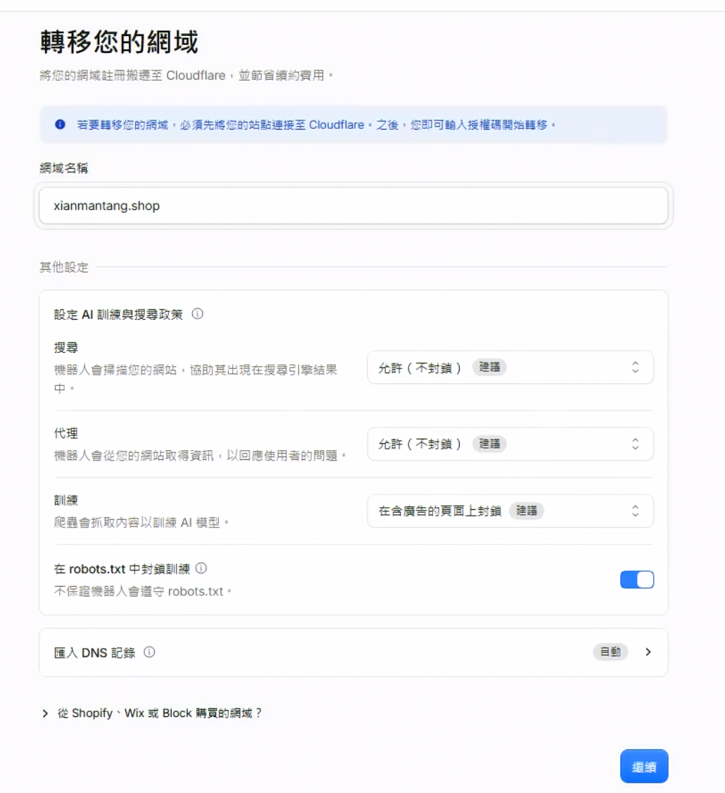

圖（一）在 Cloudflare 連接既有根網域；畫面中的搜尋與 AI 訓練政策不影響本次 DNS、Proxy 與 Origin TLS 設定

進入下一頁後，Cloudflare 會顯示掃描到的 A、AAAA、CNAME、MX 與 TXT Record。逐筆核對，Quick Scan 不保證找到所有既有 Record。缺少的 Record 要先補齊，尤其不要在尚未確認 Mail、驗證 TXT 與其他既有服務時就更換 Nameserver。

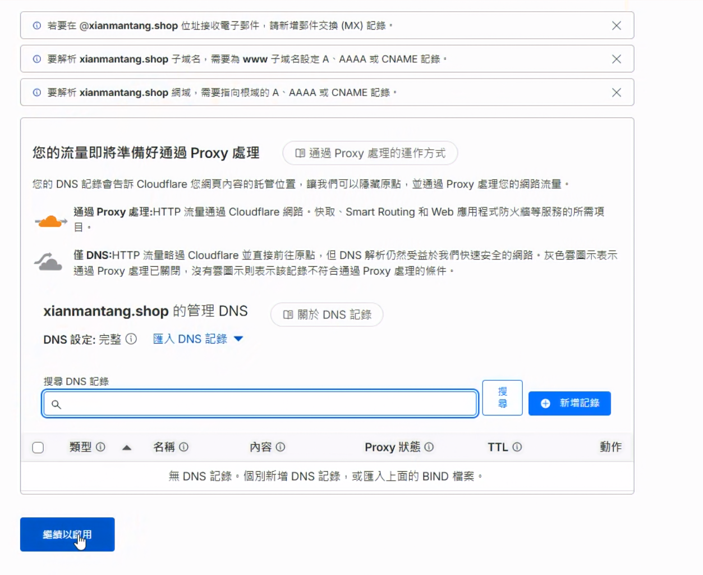

圖（二）新購網域沒有既有 DNS Record 時，清單可以是空白；已有服務的網域必須先補齊郵件與驗證記錄

核對完成後繼續，記錄 Cloudflare 指派的兩個 Nameserver，例如 `name1.ns.cloudflare.com` 與 `name2.ns.cloudflare.com`。實際值以目前 Dashboard 顯示為準。

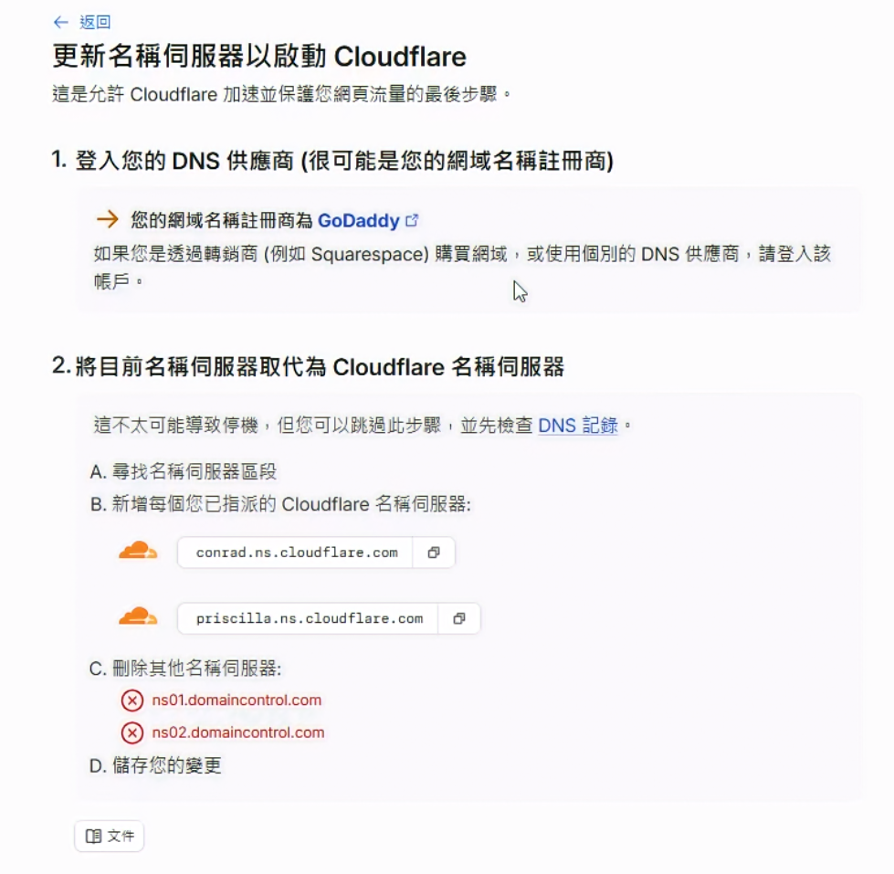

圖（三）Cloudflare 為本次網域指派兩台權威名稱伺服器，兩個值都要完整複製到 GoDaddy

完成本節時，Cloudflare Zone 可以先顯示 `Pending Nameserver Update` 或相近狀態。這表示 Zone 已建立，正在等待 GoDaddy 更換 Nameserver。

如果 GoDaddy 目前已對這個網域啟用 DNSSEC，先依 Cloudflare 畫面指示移除註冊層的舊 DS Record，等待原 DS TTL 到期，並以 `dig DS example.com +short` 確認查無結果後，再更換 Nameserver。Zone 變成 Active 後，由 Cloudflare 啟用新 DNSSEC，並將 Cloudflare 提供的新 DS Record 加回註冊商。

## 3. 在 GoDaddy 變更 Nameserver

1. 登入 GoDaddy，開啟 `Domain Portfolio`。
2. 選擇實際網域，進入 `DNS`。
3. 在 `Nameservers` 選擇使用自定 Nameserver。
4. 移除原 Nameserver，填入 Cloudflare 指派的兩個值。
5. 儲存後回 Cloudflare 按 `Check nameservers now`。

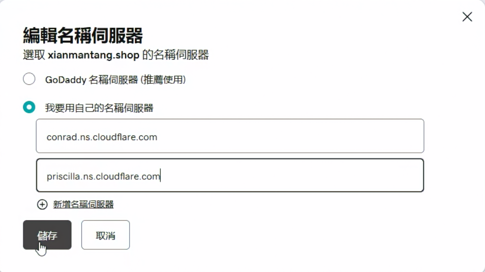

圖（四）GoDaddy 使用自訂名稱伺服器，內容與 Cloudflare 指派的兩個值一致

Nameserver 委派不一定立即在所有 Resolver 生效。本次實作約等待一小時後，Cloudflare Zone 才顯示 `Active`；實際時間會受註冊商處理與 DNS 快取影響。Zone 顯示 `Active` 前，不要刪除舊 DNS 記錄或將舊服務當成已切換。

從任一可使用 `dig` 的主機檢查委派：

```bash
dig NS example.com +short
dig +trace NS example.com
```

輸出必須是 Cloudflare 指派的 Nameserver，而且 Cloudflare Dashboard 必須顯示 Zone `Active`。

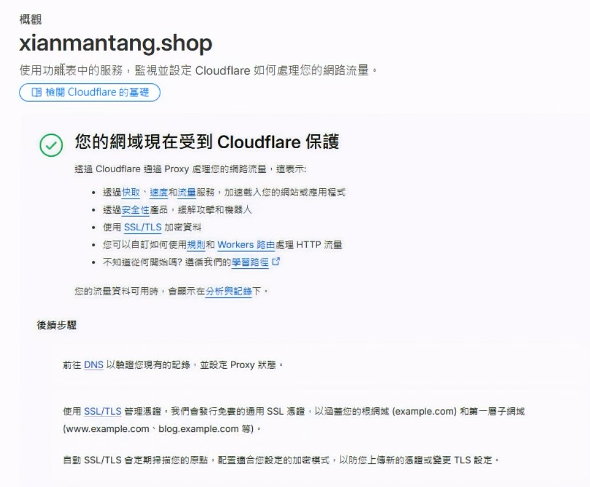

圖（五）名稱伺服器委派生效後，Cloudflare Zone 進入 Active 狀態

## 4. 建立橘雲公開 Record

在 Cloudflare 進入 `DNS` → `Records`。固定公網 IPv4 可建立 A Record：

1. Type：`A`。
2. Name：`app`。
3. IPv4 address：Origin 的實際公網 IPv4。
4. Proxy status：`Proxied`（橘雲）。
5. TTL：`Auto`。

本次環境的公網 IPv4 由 DDNS Hostname 維護，因此示範改用 CNAME Record：

1. Type：`CNAME`。
2. Name：`app`。
3. Target：實際 DDNS Hostname。
4. Proxy status：`Proxied`（橘雲）。
5. TTL：`Auto`。

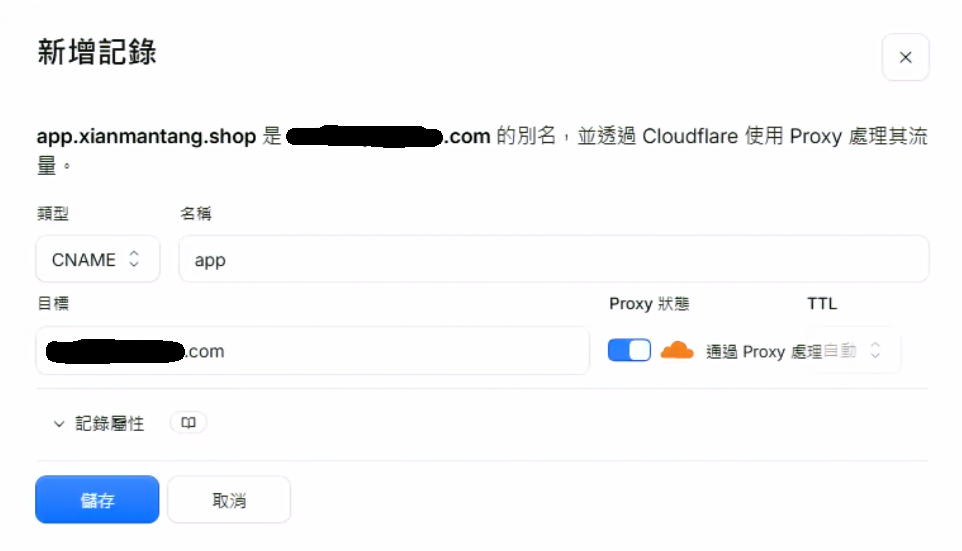

圖（六）本次以橘雲 CNAME 指向既有 DDNS Hostname，由 DDNS 負責追蹤異動的公網 IPv4

兩種方式只選一種。固定公網 IPv4 使用 A Record；會變動的公網 IPv4 先由 DDNS 更新目標 Hostname，再讓 `app` 的 CNAME 指向該名稱。Cloudflare 會預設展平 Proxied CNAME，公開查詢回覆 Cloudflare Anycast IP。DDNS Hostname 必須持續解析到目前的 Origin 公網 IPv4，避免 Cloudflare 回源到舊位址。

本 Lab 的 Cloudflare 回源與 OPNsense WAN 路徑都使用 IPv4。Cloudflare IPv6 Compatibility 預設會讓橘雲主機名稱同時提供 Edge IPv6，因此外部查詢仍可能取得 Cloudflare 的 AAAA；這不表示 Origin 已具備 IPv6。日後若讓 Origin 使用 IPv6，必須一起建立 Cloudflare IPv6 Alias、OPNsense IPv6 Rule 與 Origin IPv6 Listener。

在外部 Resolver 查詢：

```bash
dig app.example.com A +short
```

橘雲生效後，查詢結果應是 Cloudflare Anycast IPv4，不應直接顯示 Origin 公網 IPv4。這項結果只證明 DNS 與 Proxy Status；Origin HTTPS 需由後續 TLS 測試驗證。

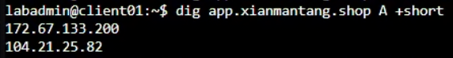

圖（七）Proxied CNAME 經 Cloudflare 展平後，公開 A 查詢回覆 Cloudflare Anycast IPv4

## 5. 建立 Cloudflare Origin Certificate

在 Cloudflare 進入 `SSL/TLS` → `Origin Server`，按 `Create Certificate`：

1. 選擇由 Cloudflare 產生 Private Key 與 CSR。
2. Private Key Type 使用 `RSA (2048)`，便於與常見 Nginx 環境相容。
3. Hostnames 至少包含真實公開 Hostname，例如 `app.example.com`。
4. 選擇符合維運政策的有效期，並另外建立到期監控。
5. 按 `Create`，複製 Origin Certificate 與 Private Key。

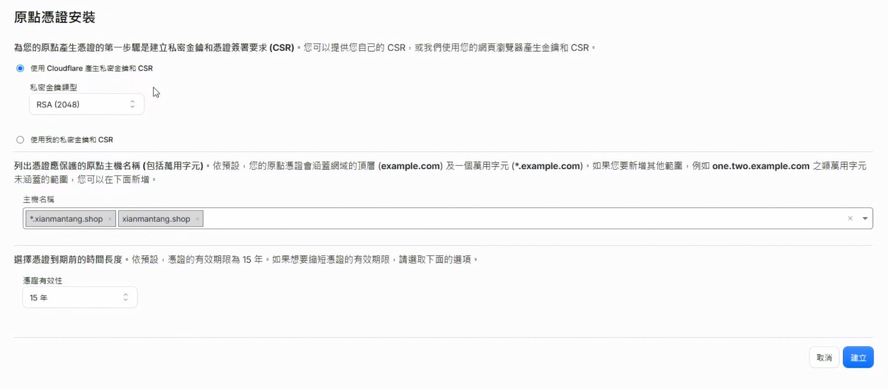

圖（八）建立 RSA Origin Certificate，主機名稱涵蓋根網域與第一層子網域

Private Key 只會在建立時顯示，請立即保存到受保護的位置。私鑰不得加入文件或提交至 Git。

在 proxy01 建立目錄與檔案：

```bash
sudo install -d -o root -g root -m 0750 /etc/nginx/tls
sudo nano /etc/nginx/tls/iron-origin.crt
sudo nano /etc/nginx/tls/iron-origin.key
```

將 Certificate 貼入 `iron-origin.crt`，Private Key 貼入 `iron-origin.key`。按 `Ctrl+O`、Enter、`Ctrl+X` 儲存後執行：

```bash
sudo chown root:root /etc/nginx/tls/iron-origin.crt /etc/nginx/tls/iron-origin.key
sudo chmod 0644 /etc/nginx/tls/iron-origin.crt
sudo chmod 0600 /etc/nginx/tls/iron-origin.key
sudo openssl x509 -in /etc/nginx/tls/iron-origin.crt \
  -noout -subject -issuer -dates -ext subjectAltName
sudo openssl pkey -in /etc/nginx/tls/iron-origin.key -check -noout
```

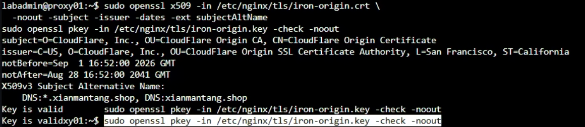

圖（九）Origin Certificate 涵蓋實際網域，私鑰檢查同時回傳 `Key is valid`

憑證的 Subject Alternative Name 必須包含真實公開 Hostname。接著在 proxy02 重複同一節，安裝同一張 Certificate 與對應 Private Key，檔案路徑與權限也必須一致。

## 6. 讓兩台 Nginx 提供 Origin HTTPS

### 6.1 建立 Cloudflare Real IP 信任清單

先在 proxy01 確認 Nginx 含 Real IP Module：

```bash
sudo nginx -V 2>&1 | grep -- '--with-http_realip_module'
```

用 Cloudflare 官方公布的清單產生 Nginx `set_real_ip_from` 設定：

```bash
cf_realip_tmp="$(mktemp)"
{
  curl -fsS https://www.cloudflare.com/ips-v4 |
    sed 's/^/set_real_ip_from /; s/$/;/'
  curl -fsS https://www.cloudflare.com/ips-v6 |
    sed 's/^/set_real_ip_from /; s/$/;/'
  printf '%s\n' \
    'real_ip_header CF-Connecting-IP;' \
    'real_ip_recursive on;' \
    "log_format iron_cloudflare '\$remote_addr peer=\$realip_remote_addr host=\$host status=\$status request_id=\$request_id \"\$request\"';"
} > "$cf_realip_tmp"

sudo install -o root -g root -m 0644 \
  "$cf_realip_tmp" /etc/nginx/conf.d/cloudflare-realip.conf
rm -f "$cf_realip_tmp"

sudo sed -n '1,8p' /etc/nginx/conf.d/cloudflare-realip.conf
sudo tail -n 5 /etc/nginx/conf.d/cloudflare-realip.conf
```

`real_ip_header` 不能單獨使用。只有 `set_real_ip_from` 列出的 Cloudflare Proxy 網段才能改寫 Client IP，否則來源可以自行偽造 `CF-Connecting-IP`。

### 6.2 更新 Nginx Site

在 proxy01 備份當前 Site，再開啟編輯：

```bash
sudo cp -a /etc/nginx/sites-available/iron-web \
  /etc/nginx/sites-available/iron-web.before-day27
sudo nano /etc/nginx/sites-available/iron-web
```

將檔案完整內容替換為以下設定，並把兩處 `app.example.com` 改成真實公開 Hostname：

```nginx
upstream iron_backends {
    zone iron_backends 64k;
    least_conn;
    server 10.77.20.31:8080 max_fails=2 fail_timeout=5s;
    server 10.77.20.32:8080 max_fails=2 fail_timeout=5s;
    keepalive 16;
}

server {
    listen 80 default_server;
    server_name _;
    return 444;
}

server {
    listen 80;
    server_name web.lab.home;

    location = /health {
        proxy_pass http://iron_backends/health;
        proxy_connect_timeout 2s;
        proxy_read_timeout 3s;
    }

    location / {
        proxy_pass http://iron_backends;
        proxy_set_header Host $host;
        proxy_set_header X-Real-IP $remote_addr;
        proxy_set_header X-Forwarded-For $remote_addr;
        proxy_set_header X-Forwarded-Proto $scheme;
        proxy_connect_timeout 2s;
        proxy_read_timeout 10s;
    }
}

server {
    listen 443 ssl default_server;
    server_name _;

    ssl_certificate     /etc/nginx/tls/iron-origin.crt;
    ssl_certificate_key /etc/nginx/tls/iron-origin.key;
    ssl_protocols TLSv1.2 TLSv1.3;

    return 444;
}

server {
    listen 443 ssl;
    server_name app.example.com;

    ssl_certificate     /etc/nginx/tls/iron-origin.crt;
    ssl_certificate_key /etc/nginx/tls/iron-origin.key;
    ssl_protocols TLSv1.2 TLSv1.3;
    ssl_session_cache shared:SSL:10m;
    ssl_session_timeout 10m;

    access_log /var/log/nginx/iron-web-access.log iron_cloudflare;

    location = /health {
        proxy_pass http://iron_backends/health;
        proxy_set_header Host $host;
        proxy_set_header X-Real-IP $remote_addr;
        proxy_set_header X-Forwarded-For $remote_addr;
        proxy_set_header X-Forwarded-Proto https;
        proxy_set_header X-Request-ID $request_id;
        proxy_connect_timeout 2s;
        proxy_read_timeout 3s;
    }

    location / {
        proxy_pass http://iron_backends;
        proxy_set_header Host $host;
        proxy_set_header X-Real-IP $remote_addr;
        proxy_set_header X-Forwarded-For $remote_addr;
        proxy_set_header X-Forwarded-Proto https;
        proxy_set_header X-Request-ID $request_id;
        proxy_connect_timeout 2s;
        proxy_read_timeout 10s;
    }
}
```

驗證設定，再 Reload：

```bash
sudo nginx -t
sudo systemctl reload nginx
sudo systemctl status nginx --no-pager
sudo ss -lntp | grep -E ':(80|443)\s'
```

先檢查 Nginx 回傳的憑證名稱與有效期：

```bash
openssl s_client \
  -connect 127.0.0.1:443 \
  -servername app.example.com \
  </dev/null 2>/dev/null |
  openssl x509 -noout -subject -issuer -dates -ext subjectAltName
```

再測試 HTTPS Listener 與 Backend。Cloudflare Origin CA 供 Cloudflare 驗證 Origin 身分，因此本機傳輸測試明確使用 `-k`；後面的 Full (strict) 會由 Cloudflare 驗證 Origin Certificate：

```bash
curl -kfsS \
  --resolve app.example.com:443:127.0.0.1 \
  https://app.example.com/health
```

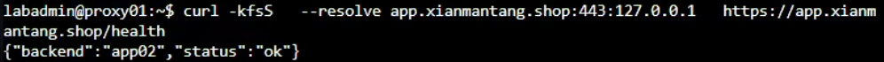

圖（十）以 `--resolve` 將正式 Hostname 指向本機 TCP 443，成功取得 Web Backend 健康回應

在 proxy02 重複 6.1 與 6.2。兩台的 Hostname、Certificate Path、Nginx Site 與 Real IP 設定必須一致。

### 6.3 讓 Keepalived 檢查 HTTPS

目前的 `check-nginx` 只檢查 HTTP。加入公開 HTTPS 後，Web VIP 應該同時反映 Nginx TCP 443 與 HTTPS Health Check。

proxy01 開啟：

```bash
sudo nano /usr/local/sbin/check-nginx
```

完整內容改為：

```bash
#!/bin/sh
systemctl is-active --quiet nginx && \
  curl -kfsS --max-time 2 \
    --resolve app.example.com:443:10.77.20.21 \
    https://app.example.com/health >/dev/null
```

proxy02 使用同一內容，但 `--resolve` 的 IP 必須是它自己的 `10.77.20.22`。兩台都要把 `app.example.com` 改成真實 Hostname。

兩台各自驗證：

```bash
sudo chown root:root /usr/local/sbin/check-nginx
sudo chmod 0750 /usr/local/sbin/check-nginx
sudo /usr/local/sbin/check-nginx
echo $?
```

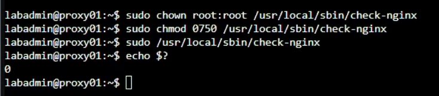

圖（十一）`check-nginx` 執行後 Exit Code 為 `0`，代表本機 Nginx 與 HTTPS Health Check 通過

確認 Exit Code 為 `0` 後，再繼續開放 WAN 443。

## 7. 在 OPNsense 建立 Cloudflare IPv4 Alias

進入 `Firewall` → `Aliases`，按 `Add`：

1. Enabled：勾選。
2. Name：`CLOUDFLARE_IPV4`。
3. Type：`URL Table (IPs)`。
4. Refresh Frequency：`1` Day。
5. Content：`https://www.cloudflare.com/ips-v4`。
6. Description：`Cloudflare published IPv4 proxy ranges`。
7. 按 `Save`，再按 `Apply`。

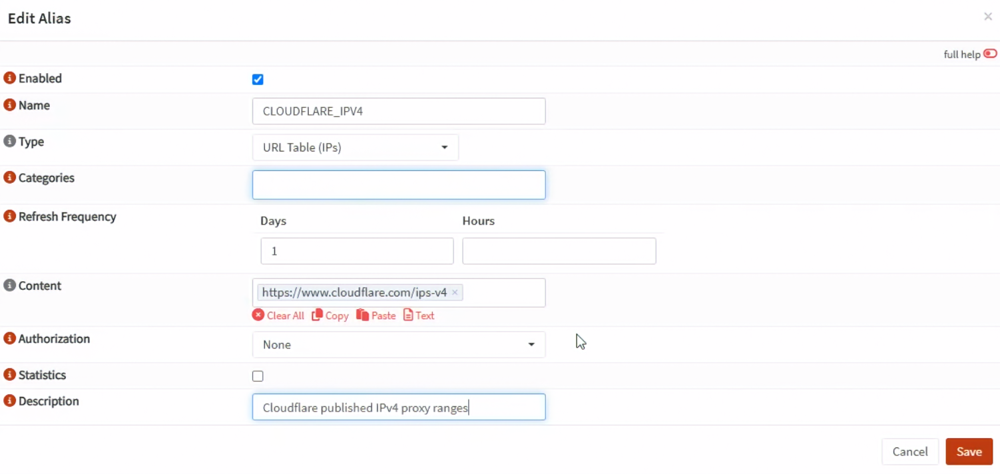

圖（十二）`CLOUDFLARE_IPV4` 使用 `URL Table (IPs)`，每日從 Cloudflare 官方網址更新 IPv4 網段

此時先在 `Firewall` → `Aliases` 確認 `CLOUDFLARE_IPV4` 已啟用、Type 與 Content 正確。`Firewall` → `Diagnostics` → `Aliases` 顯示的是已載入 pf 的執行階段 Table；新建 Alias 尚未被規則引用時，左上角選單不一定會出現它。完成下一節的 NAT 與 WAN Rule 並按下 `Apply` 後，再檢查實際載入內容。

本日的 DDNS Hostname 最終解析至 Origin 公網 IPv4，並建立 IPv4 WAN Rule。Nginx 保留 Cloudflare IPv6 Trusted Proxy 清單，供未來建立完整 IPv6 Origin 路徑時使用。

## 8. 建立 WAN TCP 443 轉送與過濾規則

### 8.1 建立 Port Forward

進入 `Firewall` → `NAT` → `Destination NAT (Port Forward)`，按 `Add`：

1. Interface：`WAN`。
2. TCP/IP Version：`IPv4`。
3. Protocol：`TCP`。
4. Source：Alias `CLOUDFLARE_IPV4`。
5. Source Port：`any`。
6. Destination：`WAN address`。
7. Destination Port：`443 (HTTPS)`。
8. Redirect Target IP：Alias `WEB_VIP`（`10.77.20.10`）。
9. Redirect Target Port：`443`。
10. Log：勾選。
11. Description：`DNAT_CF_HTTPS_TO_WEB_VIP`。
12. 按 `Save`，先不按 `Apply`。

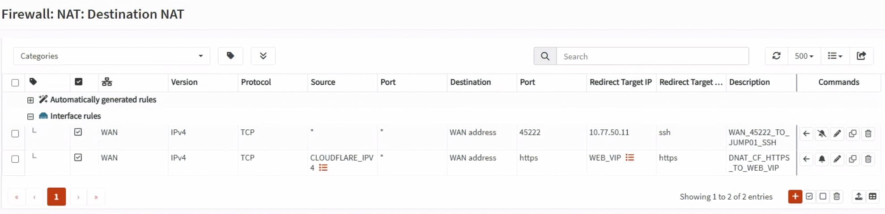

圖（十三）Destination NAT 只接受 `CLOUDFLARE_IPV4` 來源，並將 WAN TCP 443 轉送到 `WEB_VIP`

新版 `Destination NAT` 將原本的 `Filter Rule Association` 改為 `Firewall rule`。本次選擇手動建立 WAN Pass Rule，由 NAT 負責目的位址轉換，WAN Rule 負責允許連線。

### 8.2 建立 WAN Pass Rule

進入 `Firewall` → `Rules`，介面明確選 `WAN`，按 `Add`：

1. Action：`Pass`。
2. Interface：`WAN`。
3. Direction：`in`。
4. TCP/IP Version：`IPv4`。
5. Protocol：`TCP`。
6. Source：Alias `CLOUDFLARE_IPV4`。
7. Destination：Alias `WEB_VIP`（`10.77.20.10`）。
8. Destination Port：`443 (HTTPS)`。
9. Log：勾選。
10. Description：`ALLOW_CF_TO_WEB_VIP_HTTPS`。
11. 按 `Save`。

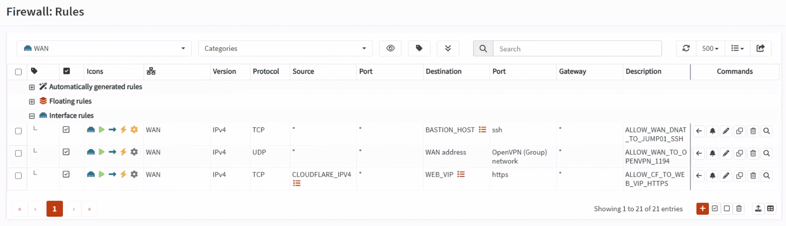

圖（十四）WAN Pass Rule 的來源為 `CLOUDFLARE_IPV4`，目的地為 `WEB_VIP` 的 HTTPS

OPNsense 先做 NAT，再用轉換後的 Destination 檢查 Filter Rule，因此這條手動 WAN Rule 的 Destination 填入 `10.77.20.10:443`。

將 `ALLOW_CF_TO_WEB_VIP_HTTPS` 放在 WAN 上任何可能先命中的寬鬆 Block／Pass Rule 之前，但不要把來源放寬成 `any`。本 Lab 依 pf 的隱含 Default Deny 拒絕其他來源，不需要另建一條 `any → 443 Block` 才會生效。

按 `Apply`，再重新打開 WAN Rule List，確認規則位於 `WAN`。本日的 NAT 只選一個 WAN Interface，Pass Rule 也明確建立在 WAN。

### 8.3 確認 Cloudflare IPv4 Alias 已載入

進入 `Firewall` → `Diagnostics` → `Aliases`。部分 OPNsense 版本會將這個頁面或頁籤標示為 `pfTables`。在頁面左上角的 Alias 選單選擇 `CLOUDFLARE_IPV4`，確認下方顯示多個 Cloudflare IPv4 CIDR。

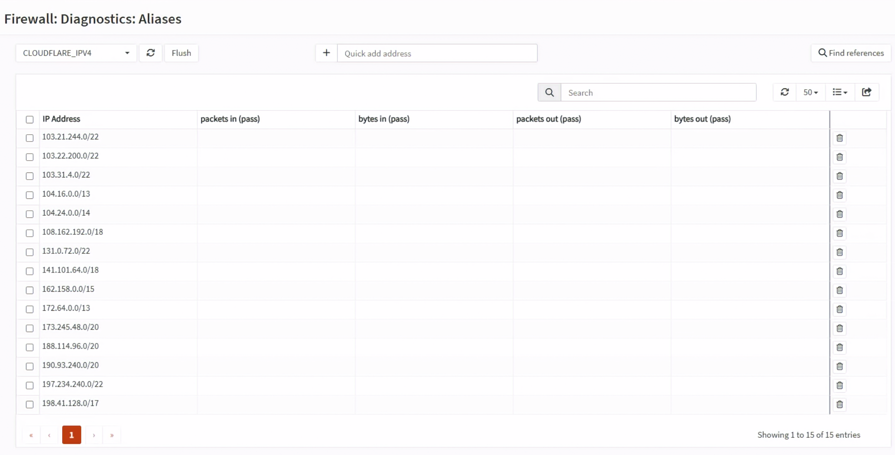

圖（十五）Diagnostics 頁面列出 `CLOUDFLARE_IPV4` 的多個 CIDR，表示 pf Table 已載入

如果左上角找不到 `CLOUDFLARE_IPV4`，先回到 `Firewall` → `Aliases` 確認下列設定，再按 `Save` 與 `Apply`：

- Enabled 已勾選。
- Type 是 `URL Table (IPs)`。
- Content 完整填入 `https://www.cloudflare.com/ips-v4`。
- NAT 與 WAN Rule 都已引用 `CLOUDFLARE_IPV4`。

套用後依然沒有出現時，在 OPNsense Console 或 SSH Shell 執行：

```sh
configctl filter refresh_aliases
pfctl -t CLOUDFLARE_IPV4 -T show
```

第二個命令應列出多個 CIDR。若顯示 Table 不存在，表示 Filter Rule 尚未套用或規則沒有引用此 Alias；若 Table 存在但沒有內容，則檢查 OPNsense 的 DNS、對外 HTTPS 連線，以及 URL 是否輸入正確。

### 8.4 公網 IPv4 位於上游路由器時

如果 OPNsense WAN 取得的是私有 IPv4，公網 IPv4 實際位於上游路由器，還要在上游路由器新增第一段 Port Forward：

```text
上游路由器公網 IPv4:443
  → OPNsense WAN IPv4:443
  → OPNsense DNAT
  → Web VIP 10.77.20.10:443
```

上游路由器若支援來源網段條件，也限定為 Cloudflare IPv4 清單；若不支援，至少要由 OPNsense 的 `CLOUDFLARE_IPV4` Rule 做最終拒絕。如果 OPNsense WAN 直接持有公網 IPv4，不要再建立這段上游 Port Forward。

## 9. 啟用 Cloudflare Full (strict)

回 Cloudflare Dashboard，進入 `SSL/TLS` → `Overview`，將 Encryption Mode 設為 `Full (strict)`。

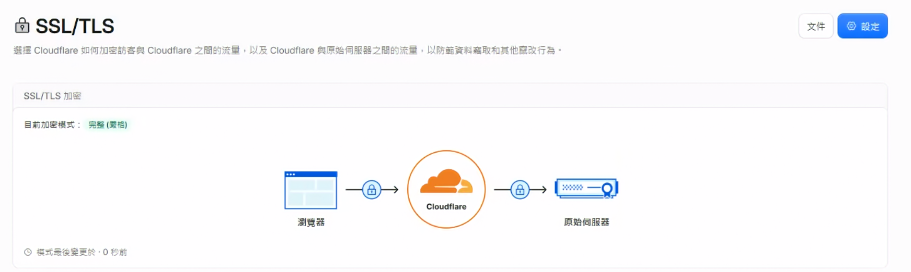

圖（十六）Cloudflare 的目前加密模式為 Full (strict)，Edge 到 Origin 會驗證 Origin 憑證

不使用 `Flexible`。Flexible 只加密 Client 到 Cloudflare，Cloudflare 到 Origin 仍可能使用 HTTP，不符合本日的雙層 TLS 要求。

使用行動電話行動網路或其他真正外部網路測試：

```bash
curl -I --connect-timeout 10 https://app.example.com/
curl -fsS --connect-timeout 10 https://app.example.com/health
```

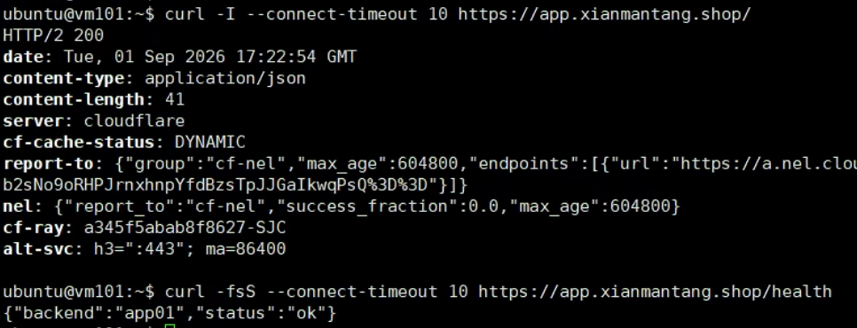

圖（十七）外部請求取得 HTTP 200、`server: cloudflare` 與 `cf-ray`，健康檢查同時回傳後端身分

預期 HTTPS 成功，`/health` 回傳 app01 或 app02。如果 Cloudflare 回傳 526，檢查兩台 Origin Certificate 的有效期、Hostname、憑證鏈與 Nginx `server_name`；不要改成 Flexible 規避錯誤。

## 10. 驗證 Origin 只接受 Cloudflare 路徑

這個測試必須從真正外部網路執行。將公開 Hostname 強制指向 Origin 公網 IPv4，保留正確 Host Header 與 TLS SNI：

```bash
curl -vk --connect-timeout 5 \
  --resolve app.example.com:443:實際Origin公網IPv4 \
  https://app.example.com/health
```

預期結果是 Timeout 或連線被拒，不能取得 HTTP 200。若直連 Origin 成功：

1. 檢查 OPNsense NAT 與 WAN Pass Rule 的 Source 是否都是 `CLOUDFLARE_IPV4`。
2. 檢查 WAN 上是否存在較前面的 `any → 443 Pass`。
3. 如果有上游路由器，確認所有公開 TCP 443 封包都會進入 OPNsense。
4. 在 `Firewall` → `Log Files` → `Live View` 以 Destination Port `443` 與 Description 過濾。

內部 Hairpin NAT 成功或失敗都不能取代這個 WAN 負向測試。

## 11. 驗證 Real Client IP

從外部網路連續發出數個 Request：

```bash
for i in $(seq 1 4); do
  curl -fsS https://app.example.com/health
  echo
done
```

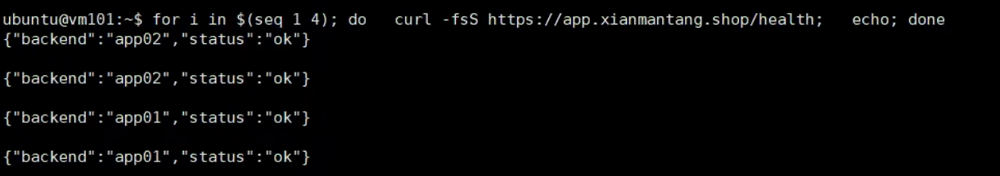

圖（十八）連續公開 HTTPS 請求皆成功，回應中的 `backend` 顯示 Nginx 將請求分配給 app01 與 app02

在目前持有 Web VIP 的 Proxy 查看 Access Log：

```bash
sudo tail -n 20 /var/log/nginx/iron-web-access.log
```

Log 中的第一個位址應是外部 Client IP，`peer=` 應是實際與 Nginx 建立 TCP 連線的 Cloudflare Proxy IP。如果兩者都是 Cloudflare IP，檢查 `cloudflare-realip.conf`；如果直連 Origin 也能任意修改 Client IP，檢查 `set_real_ip_from` 是否被放寬成任意來源。

## 12. 驗證 Web VIP 接管後恢復公開連線

先確認 Web VIP 當前在 proxy01：

```bash
ip -4 -o address show dev eth0 |
  grep '10.77.20.10/24'
```

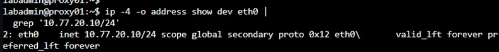

圖（十九）停止服務前先確認 Web VIP `10.77.20.10` 由 proxy01 持有

在 proxy01 停止 Nginx：

```bash
sudo systemctl stop nginx
```

在 proxy02 確認 Web VIP 已移入：

```bash
ip -4 -o address show dev eth0 |
  grep '10.77.20.10/24'
sudo /usr/local/sbin/check-nginx
echo $?
```

再從外部網路連續測試：

```bash
for i in $(seq 1 6); do
  date -Is
  curl -fsS --connect-timeout 10 https://app.example.com/health
  sleep 1
done
```

預期 Web VIP 移到 proxy02 後 HTTPS 恢復，憑證名稱與 Full (strict) 不因接管而變化。測試結束後在 proxy01 恢復：

```bash
sudo systemctl start nginx
sudo /usr/local/sbin/check-nginx
echo $?
```

等待 Keepalived 狀態穩定後，在兩台確認只有一台持有 `10.77.20.10`。

## 13. 回復與停止條件

遇到以下任一情況就停止擴大變更：

- Cloudflare Zone 長時間未變成 Active。
- 原有 Mail、TXT 或其他公開 DNS Record 遺失。
- 任一台 Nginx `nginx -t` 失敗或 HTTPS Health Check 不是 `0`。
- Cloudflare IP Alias 為空或無法更新。
- Origin Bypass 負向測試取得 HTTP 200。

若 Nginx 設定失敗，在各 Proxy 回復變更前的 Site：

```bash
sudo cp -a /etc/nginx/sites-available/iron-web.before-day27 \
  /etc/nginx/sites-available/iron-web
sudo nginx -t
sudo systemctl reload nginx
```

接著在 OPNsense 停用 `DNAT_CF_HTTPS_TO_WEB_VIP` 與 `ALLOW_CF_TO_WEB_VIP_HTTPS`。只有在決定放棄 Cloudflare DNS 委派，而且舊 DNS 區域已完整恢復後，才將 GoDaddy Nameserver 改回原值。不要在 DNS 記錄未恢復時只切回 Nameserver。

## 參考資料

- [GoDaddy｜Search and buy available domain names](https://www.godaddy.com/domains)
- [GoDaddy｜Verifying contact information for ICANN Validation](https://www.godaddy.com/help/verifying-contact-information-for-icann-validation-8948)
- [GoDaddy｜What shows in the WHOIS directory?](https://www.godaddy.com/help/what-shows-in-the-whois-directory-330)
- [GoDaddy｜What is Domain Protection?](https://www.godaddy.com/help/what-is-domain-protection-32311)
- [GoDaddy｜Turn my domain auto-renew on or off](https://www.godaddy.com/help/turn-my-domain-auto-renew-on-or-off-41085)
- [GoDaddy｜Change my domain nameservers](https://www.godaddy.com/en-uk/help/change-my-domain-nameservers-664)
- [Cloudflare｜Set up a full DNS zone](https://developers.cloudflare.com/dns/zone-setups/full-setup/)
- [Cloudflare｜Proxy status](https://developers.cloudflare.com/dns/proxy-status/)
- [Cloudflare｜CNAME flattening](https://developers.cloudflare.com/dns/cname-flattening/)
- [Cloudflare｜IPv6 compatibility](https://developers.cloudflare.com/network/ipv6-compatibility/)
- [Cloudflare｜Origin CA certificates](https://developers.cloudflare.com/ssl/origin-configuration/origin-ca/)
- [Cloudflare｜Full (strict) encryption mode](https://developers.cloudflare.com/ssl/origin-configuration/ssl-modes/full-strict/)
- [Cloudflare｜Protect your origin server](https://developers.cloudflare.com/fundamentals/security/protect-your-origin-server/)
- [Cloudflare｜IP ranges](https://www.cloudflare.com/ips/)
- [OPNsense｜Aliases](https://docs.opnsense.org/manual/aliases.html)
- [OPNsense｜Network Address Translation](https://docs.opnsense.org/manual/nat.html)
- [OPNsense｜Firewall rules](https://docs.opnsense.org/manual/firewall.html)
- [NGINX｜SSL module](https://nginx.org/en/docs/http/ngx_http_ssl_module.html)
- [NGINX｜Real IP module](https://nginx.org/en/docs/http/ngx_http_realip_module.html)
