# Day 27 額外實作｜公開 HTTPS 驗證與故障恢復量測

對應文章：[Day 27｜將私有雲服務安全發布至網際網路：Cloudflare DNS、CDN、WAF 與 Full (strict)](https://ithelp.ithome.com.tw/users/20183351/ironman/9461)

本文件接續 Day 27 主實作，驗證公開 DNS、Cloudflare 代理、兩段 TLS、Origin 保護、真實用戶端 IP、Web VIP 故障接管與 WAF。主實作負責完成建置；本文件負責留下可重現的正向、負向與故障恢復證據。

## 0. 先準備三個實際值

下列值請換成實際環境資料：

```text
PUBLIC_ZONE：根網域，例如 example.com
PUBLIC_HOST：公開完整主機名稱，例如 app.example.com
ORIGIN_IPV4：OPNsense WAN 或上游轉送至 OPNsense 的公網 IPv4
```

外部測試必須使用 Lab 之外的網路，例如手機分享網路上的 Linux／WSL、Cloud Shell 或外部 VPS。不要在 client01、PVE 節點或內部 VLAN 執行圖（八）、圖（十）、圖（十二）、圖（十三）與圖（十四）的外部測試。

---

## 1. 驗證公開網域已委派給 Cloudflare

### 1.1 核對 Cloudflare 與註冊商設定

不需終端命令，依序核對：

1. Cloudflare Dashboard → 選擇網域 → **Overview**，確認狀態為 `Active`，並記下 Cloudflare 指派的兩台 Nameserver。
2. GoDaddy → Domain Portfolio → 選擇網域 → DNS → Nameservers，確認兩台 Nameserver 與 Cloudflare 完全相同。

### 1.2 從外部解析器確認委派

執行位置：外部 Linux 測試主機。

先填入實際根網域，再整段執行：

```bash
PUBLIC_ZONE='xianmantang.shop'

clear
hostname
date --iso-8601=ns
printf 'public_zone=%s\n' "$PUBLIC_ZONE"
printf '%s\n' '--- authoritative nameservers observed externally ---'
dig +short NS "$PUBLIC_ZONE" | sort
```

Cloudflare、註冊商與外部查詢應顯示相同的兩台名稱伺服器。

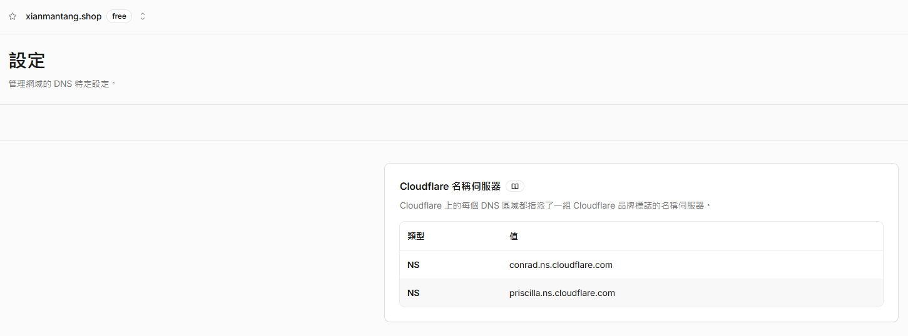

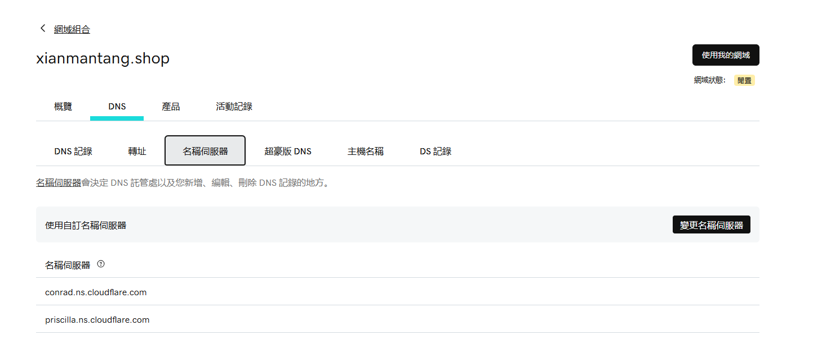

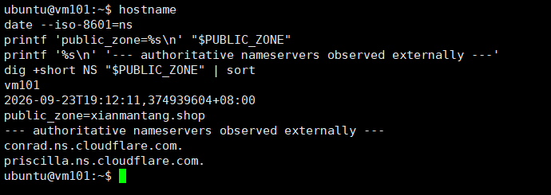

圖（一）Cloudflare、GoDaddy 與外部解析器顯示一致的網域委派

---

## 2. 驗證橘雲改變公開 DNS 回覆與連線目的

執行位置：外部 Linux 測試主機。

先填入實際值，再整段執行：

```bash
PUBLIC_ZONE='請填入實際根網域'
PUBLIC_HOST='請填入實際公開完整主機名稱'

DAY27_TMP_DIR="$(mktemp -d)"

clear
hostname
date --iso-8601=ns
printf 'public_zone=%s\n' "$PUBLIC_ZONE"
printf 'public_host=%s\n' "$PUBLIC_HOST"

printf '%s\n' '--- NS records ---'
dig +short NS "$PUBLIC_ZONE" | sort

printf '%s\n' '--- proxied A records returned to the public client ---'
dig +short A "$PUBLIC_HOST" | sort

printf '%s\n' '--- public HTTPS response ---'
curl -sS \
  --connect-timeout 10 \
  --max-time 15 \
  -H 'Cache-Control: no-cache, no-store' \
  -D "$DAY27_TMP_DIR/headers" \
  -o "$DAY27_TMP_DIR/body" \
  -w 'http_code=%{http_code}\nremote_ip=%{remote_ip}\n' \
  "https://${PUBLIC_HOST}/health?proof=day27-dns-$(date +%s%N)"

grep -Ei '^(HTTP/|server:|cf-ray:|cf-cache-status:)' \
  "$DAY27_TMP_DIR/headers"
printf '%s\n' '--- response body ---'
cat "$DAY27_TMP_DIR/body"
printf '\n'

rm -rf -- "$DAY27_TMP_DIR"
```

結果應包含 NS、公開 A Record、`HTTP 200`、`server: cloudflare`、`cf-ray`、Cloudflare Remote IP，以及 `/health` 回傳的後端身分。A Record 不需與某一個固定 Cloudflare IP 完全相同；重點是它不等於 Origin 公網 IPv4。

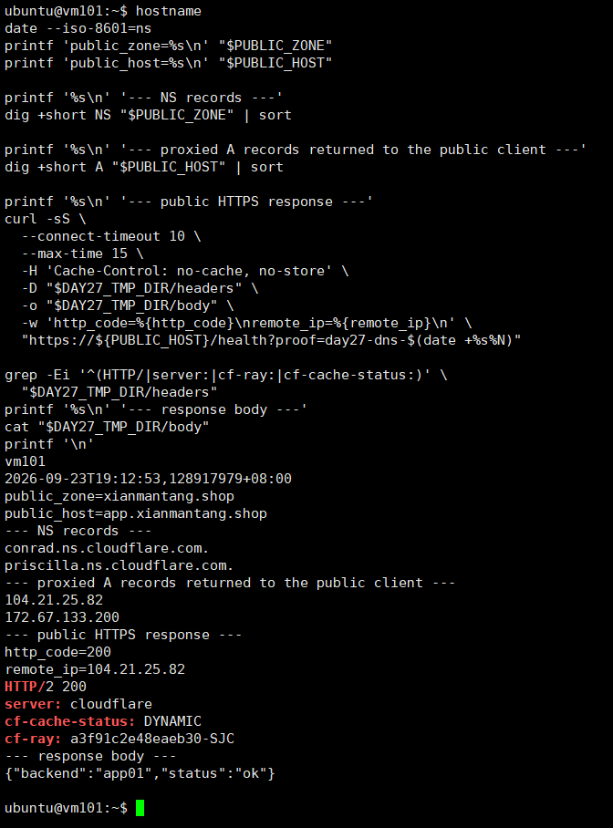

圖（二）橘雲 DNS 回覆、Cloudflare 回應標頭與後端身分

---

## 3. 驗證兩台 Nginx 提供合格的 Origin HTTPS

以下命令要在 proxy01、proxy02 各執行一次。先填入同一個實際公開 Hostname。

### 3.1 驗證 proxy01

執行位置：proxy01。

```bash
PUBLIC_HOST='app.xianmantang.shop'

clear
hostname
date --iso-8601=ns

printf '%s\n' '--- certificate actually served by local Nginx ---'
openssl s_client \
  -connect 127.0.0.1:443 \
  -servername "$PUBLIC_HOST" \
  </dev/null 2>/dev/null |
openssl x509 \
  -noout \
  -subject \
  -issuer \
  -dates \
  -ext subjectAltName

printf '%s\n' '--- Nginx configuration and services ---'
sudo nginx -t 2>&1
systemctl is-active nginx keepalived

printf '%s\n' '--- TCP listeners ---'
sudo ss -lntp | grep -E ':(80|443)\s'

printf '%s\n' '--- Keepalived Nginx health script ---'
sudo /usr/local/sbin/check-nginx
CHECK_NGINX_RC="$?"
printf 'check_nginx_rc=%s\n' "$CHECK_NGINX_RC"
```

結果應包含 `proxy01`、憑證 Subject／Issuer／有效期間／SAN、`nginx -t` 成功、兩個服務為 active、TCP 443 Listener 與 `check_nginx_rc=0`。

### 3.2 驗證 proxy02

執行位置：proxy02。完整執行與 3.1 相同的命令，確認 `hostname` 回傳 `proxy02`。

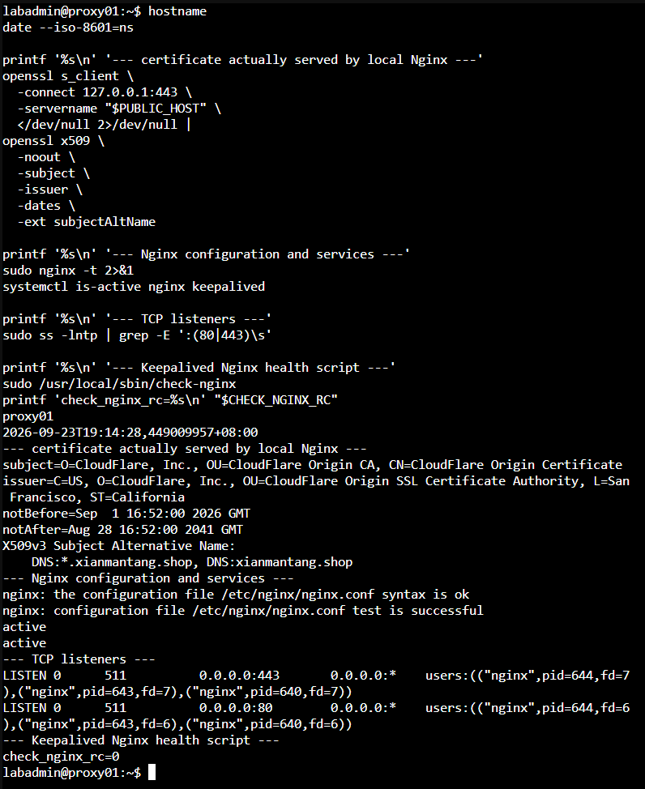

圖（三）Origin 憑證、TCP 443 Listener 與 Nginx 健康狀態

---

## 4. 驗證 Full (strict) 完成兩段 TLS

### 4.1 確認 Cloudflare 回源模式

Cloudflare Dashboard → 選擇網域 → SSL/TLS → Overview，確認 Encryption Mode 為 `Full (strict)`。

### 4.2 從外部用戶端驗證 Edge Certificate

執行位置：外部 Linux 測試主機。

```bash
PUBLIC_HOST='請填入實際公開完整主機名稱'

DAY27_TMP_DIR="$(mktemp -d)"

clear
hostname
date --iso-8601=ns
printf 'public_host=%s\n' "$PUBLIC_HOST"

printf '%s\n' '--- certificate served to the public client ---'
openssl s_client \
  -connect "${PUBLIC_HOST}:443" \
  -servername "$PUBLIC_HOST" \
  </dev/null 2>/dev/null |
openssl x509 \
  -noout \
  -subject \
  -issuer \
  -dates \
  -ext subjectAltName

printf '%s\n' '--- public HTTPS response ---'
curl -sS \
  --connect-timeout 10 \
  --max-time 15 \
  -H 'Cache-Control: no-cache, no-store' \
  -D "$DAY27_TMP_DIR/headers" \
  -o "$DAY27_TMP_DIR/body" \
  -w 'http_code=%{http_code}\nremote_ip=%{remote_ip}\nssl_verify_result=%{ssl_verify_result}\n' \
  "https://${PUBLIC_HOST}/health?proof=day27-edge-tls-$(date +%s%N)"

grep -Ei '^(HTTP/|server:|cf-ray:|cf-cache-status:)' \
  "$DAY27_TMP_DIR/headers"
cat "$DAY27_TMP_DIR/body"
printf '\n'

rm -rf -- "$DAY27_TMP_DIR"
```

結果應包含 Edge Certificate 的 Subject／Issuer／SAN、`http_code=200` 與 `ssl_verify_result=0`。外部測試驗證用戶端到 Cloudflare；Full (strict) Dashboard 畫面則確認 Cloudflare 到 Origin 的模式。

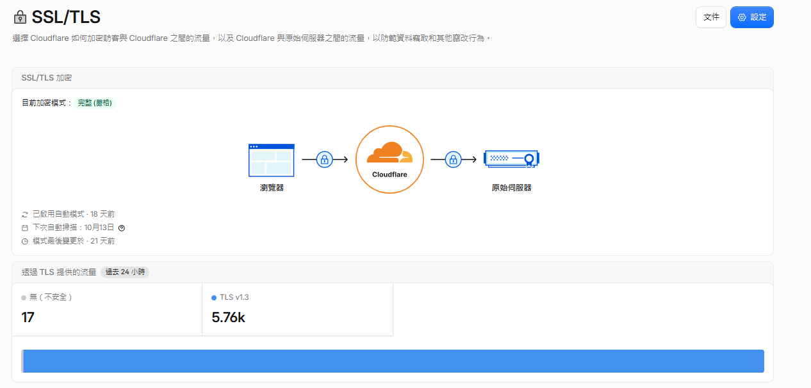

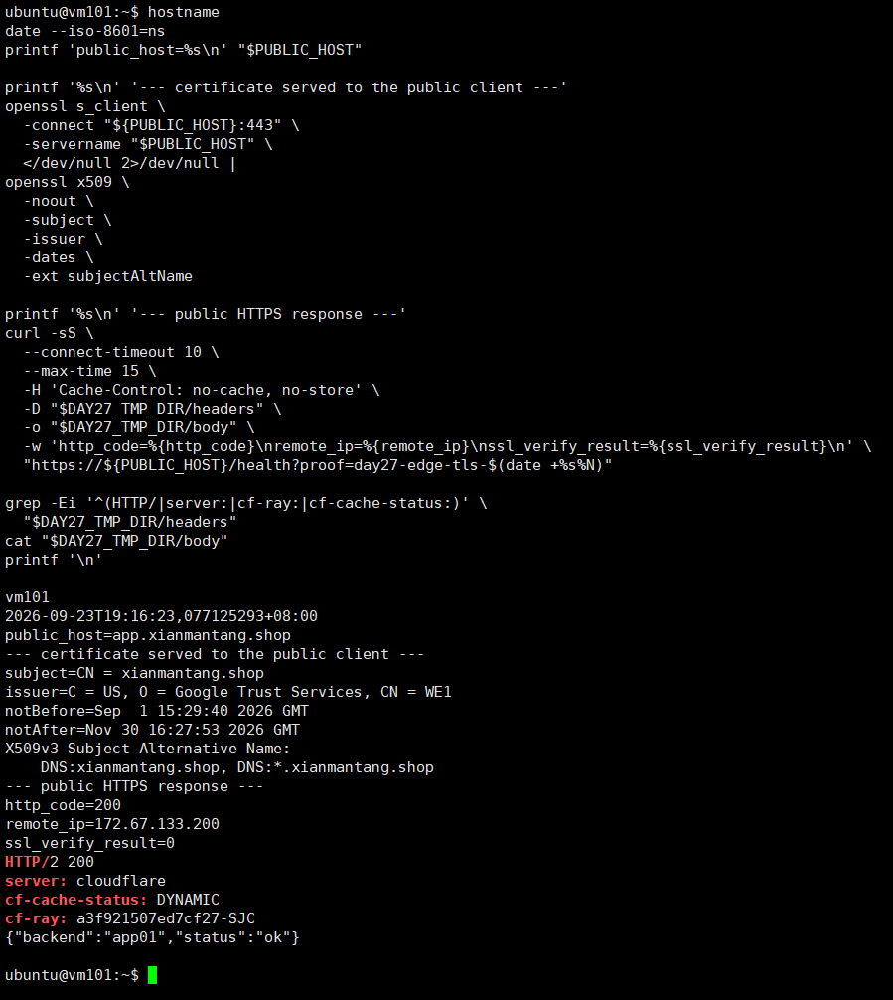

圖（四）Cloudflare 回源模式與公開 Edge TLS 驗證結果

---

## 5. 驗證 OPNsense 只轉送 Cloudflare 來源

### 5.1 核對 Alias 定義與執行階段內容

OPNsense GUI：

1. Firewall → Aliases → 找到並編輯 `CLOUDFLARE_IPV4`。
2. 確認 Alias 名稱、Type、Cloudflare 官方 IPv4 清單 URL 與 Enabled 狀態。
3. Firewall → Diagnostics → Aliases；部分版本顯示為 pfTables。
4. 選擇 `CLOUDFLARE_IPV4`，確認已載入多筆 CIDR。

也可以從 OPNsense Console 選擇 Shell，執行下列唯讀命令補強證據：

```sh
hostname
date
echo '--- first 20 loaded Cloudflare IPv4 CIDRs ---'
pfctl -t CLOUDFLARE_IPV4 -T show | sed -n '1,20p'
echo '--- loaded CIDR count ---'
pfctl -t CLOUDFLARE_IPV4 -T show | wc -l
```

### 5.2 核對 WAN Rule 與 Port Forward

OPNsense GUI：

1. Firewall → Rules → WAN。
2. 確認 `ALLOW_CF_TO_WEB_VIP_HTTPS` 的規則順序；Source 應為 `CLOUDFLARE_IPV4`、Destination 應為 `WEB_VIP`、Destination Port 應為 TCP 443。
3. Firewall → NAT → Destination NAT／Port Forward。
4. 確認 `DNAT_CF_HTTPS_TO_WEB_VIP` 的 Source、Destination Port 443、Redirect Target `10.77.20.10` 與 Redirect Port 443。

可在 OPNsense Shell 追加以下唯讀檢查：

```sh
hostname
date
echo '--- WAN filter rule label ---'
pfctl -sr -v | grep -B 2 -A 3 'ALLOW_CF_TO_WEB_VIP_HTTPS'
echo '--- HTTPS NAT targeting the Web VIP ---'
pfctl -sn | grep -E '10\.77\.20\.10.*443|443.*10\.77\.20\.10'
```

GUI 用來核對設定，Shell 輸出補充執行階段狀態。

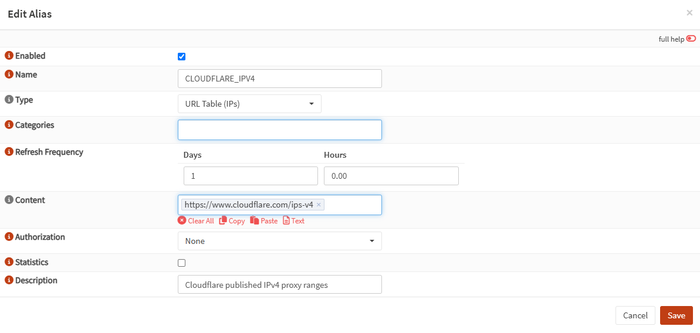

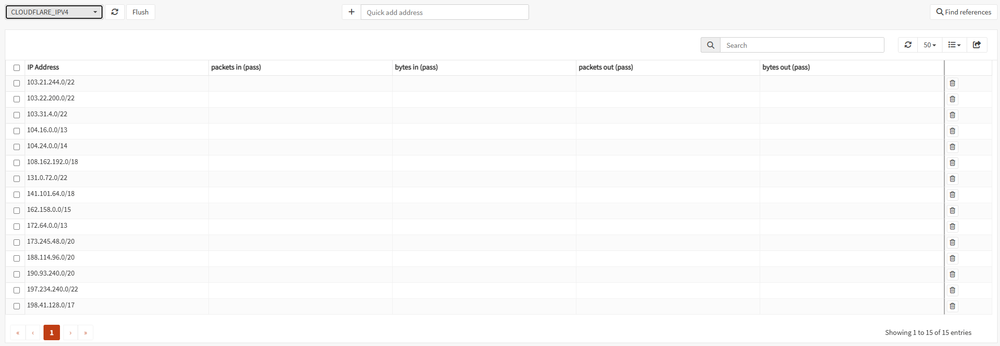

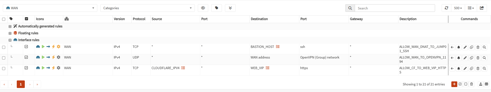

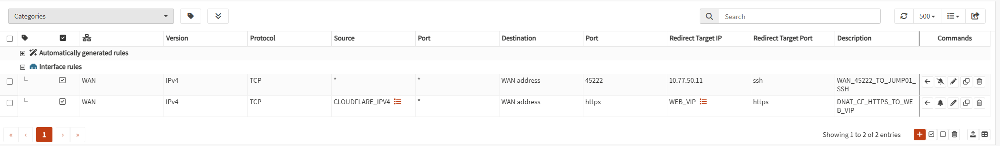

圖（五）Cloudflare Alias、WAN Rule 與 Destination NAT 共同保護 Origin

---

## 6. 驗證 Origin 只接受 Cloudflare 路徑

執行位置：同一台外部 Linux 測試主機。

先填入實際主機名稱與 Origin 公網 IPv4。指令會在輸出前執行 `clear`，避免測試結果顯示完整 Origin IPv4。

```bash
PUBLIC_HOST='請填入實際公開完整主機名稱'
ORIGIN_IPV4='請填入實際Origin公網IPv4'

DAY27_TMP_DIR="$(mktemp -d)"

clear
hostname
date --iso-8601=ns
printf 'public_host=%s\n' "$PUBLIC_HOST"

printf '%s\n' '--- normal public path through Cloudflare ---'
curl -sS \
  --connect-timeout 10 \
  --max-time 15 \
  -H 'Cache-Control: no-cache, no-store' \
  -o "$DAY27_TMP_DIR/public-body" \
  -w 'public_http_code=%{http_code}\npublic_remote_ip=%{remote_ip}\n' \
  "https://${PUBLIC_HOST}/health?proof=day27-public-$(date +%s%N)"
PUBLIC_RC="$?"
cat "$DAY27_TMP_DIR/public-body"
printf '\npublic_curl_rc=%s\n' "$PUBLIC_RC"

printf '%s\n' '--- forced direct connection to Origin ---'
curl -ksS \
  --connect-timeout 5 \
  --max-time 8 \
  --resolve "${PUBLIC_HOST}:443:${ORIGIN_IPV4}" \
  -o "$DAY27_TMP_DIR/origin-body" \
  -w 'origin_http_code=%{http_code}\n' \
  "https://${PUBLIC_HOST}/health?proof=day27-origin-bypass-$(date +%s%N)"
ORIGIN_RC="$?"
printf 'origin_curl_rc=%s\n' "$ORIGIN_RC"

if [ -s "$DAY27_TMP_DIR/origin-body" ]; then
  printf '%s\n' 'WARNING: Origin returned a response:'
  cat "$DAY27_TMP_DIR/origin-body"
  printf '\n'
else
  printf '%s\n' 'origin_response_body=empty'
fi

rm -rf -- "$DAY27_TMP_DIR"
```

預期結果：公開路徑為 `public_http_code=200`、`public_curl_rc=0`；直連 Origin 通常為 `origin_http_code=000`，並因逾時得到 `origin_curl_rc=28`，或因拒絕連線得到其他非 0 值。若 Origin 回傳 HTTP 內容，應回頭檢查上游 Port Forward、OPNsense NAT 與 WAN Rule。

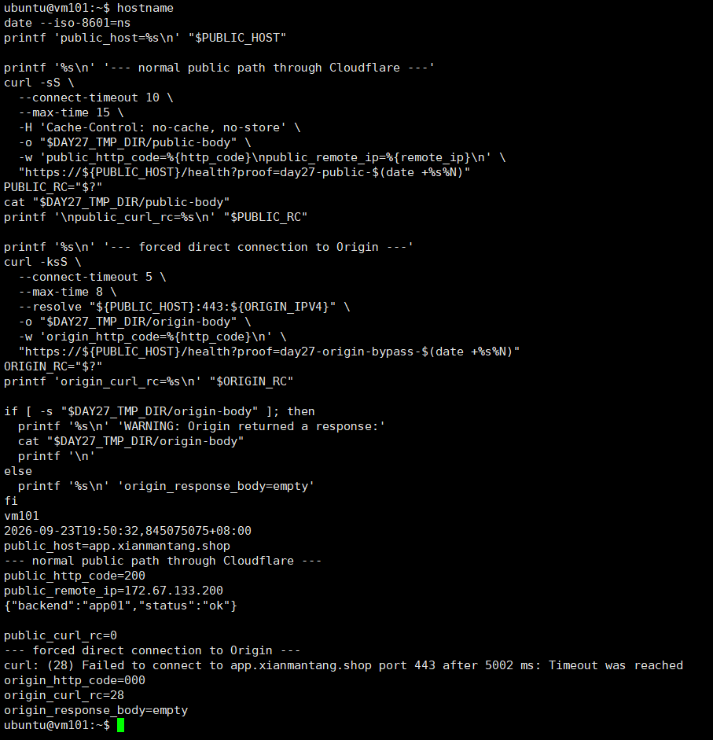

圖（六）同一台外部主機完成公開路徑正向測試與 Origin 繞過負向測試

---

## 7. 驗證 Nginx 同時保存真實用戶端與 Cloudflare Peer

這項驗證以相同的 `proof_id` 對應外部請求與 Nginx Access Log。

### 7.1 從外部送出唯一請求

執行位置：外部 Linux 測試主機。

```bash
PUBLIC_HOST='請填入實際公開完整主機名稱'
PROOF_ID="day27-realip-$(date +%s%N)"

clear
hostname
date --iso-8601=ns
printf 'public_host=%s\n' "$PUBLIC_HOST"
printf 'proof_id=%s\n' "$PROOF_ID"

printf '%s\n' '--- client address observed by Cloudflare ---'
curl -fsS "https://${PUBLIC_HOST}/cdn-cgi/trace" |
  grep -E '^(ip|colo|http)='

printf '%s\n' '--- unique request sent to the Origin path ---'
curl -sS \
  --connect-timeout 10 \
  --max-time 15 \
  -H 'Cache-Control: no-cache, no-store' \
  -D - \
  -o /dev/null \
  -w 'http_code=%{http_code}\nremote_ip=%{remote_ip}\n' \
  "https://${PUBLIC_HOST}/health?proof=${PROOF_ID}" |
  grep -Ei '^(HTTP/|server:|cf-ray:|cf-cache-status:|http_code=|remote_ip=)'

printf 'PROOF_ID=%s\n' "$PROOF_ID"
```

### 7.2 從目前 Web VIP 持有者找到同一筆 Log

先在 proxy01 與 proxy02 任一台執行以下命令，找出目前持有者：

```bash
hostname
ip -4 address show dev eth0 | grep -F '10.77.20.10/24' || \
  echo 'web_vip_not_on_this_node'
```

登入持有 `10.77.20.10/24` 的 Proxy，填入相同的 `PROOF_ID` 後執行：

```bash
PROOF_ID='day27-realip-1790162539670339034'

clear
hostname
date --iso-8601=ns
printf 'proof_id=%s\n' "$PROOF_ID"
printf '%s\n' '--- matching Nginx access log entry ---'
sudo grep -F "$PROOF_ID" /var/log/nginx/iron-web-access.log | tail -n 3
```

同一個 `proof_id` 應能對上兩端。Nginx Log 應同時顯示真實用戶端 IP、`peer=` 的 Cloudflare 來源、Host 與 HTTP Status。

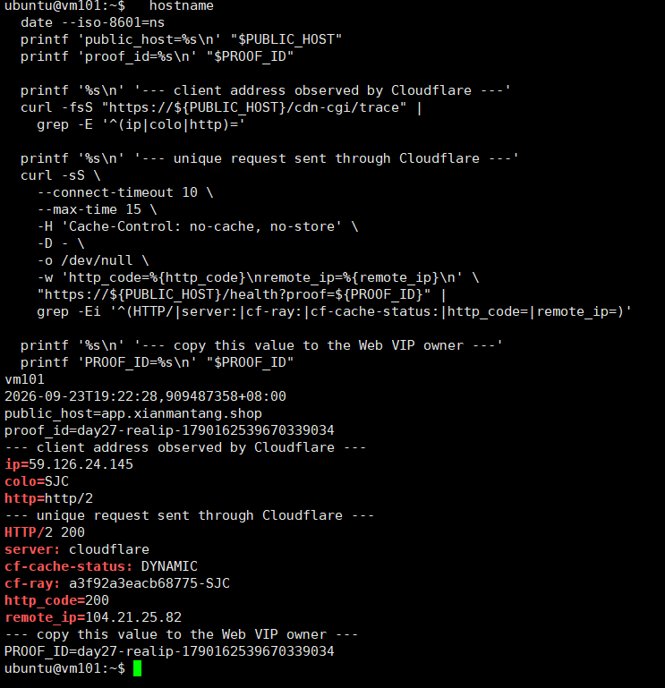

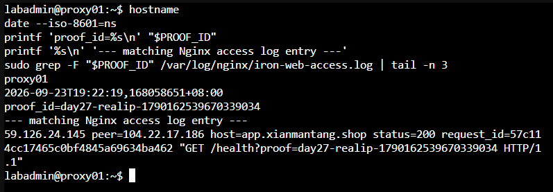

圖（七）唯一 proof id 對應外部請求與 Nginx Access Log

---

## 8. 量測 Web VIP 接管後的公開 HTTPS 恢復時間

這項測試會短暫停止 proxy01 的 Nginx。開始前先確認 proxy01 持有 Web VIP，而且 proxy02 的 Nginx、Keepalived 都是 active。

### 8.1 測試前確認時間與角色

在外部測試主機、proxy01、proxy02 分別執行：

```bash
hostname
date --iso-8601=ns
timedatectl show -p NTPSynchronized --value
```

三台都應顯示正確時間。若 `NTPSynchronized=no`，先修正時間同步，再進行秒數量測。

在 proxy01 與 proxy02 分別執行：

```bash
hostname
systemctl is-active nginx keepalived
ip -4 address show dev eth0 | grep -F '10.77.20.10/24' || \
  echo 'web_vip_not_on_this_node'
```

只有 proxy01 應顯示 Web VIP。若目前由 proxy02 持有，請以實際持有者作為故障注入節點，並相應交換下列節點名稱。

### 8.2 在外部測試主機建立完整探測腳本

執行位置：外部 Linux 測試主機。

```bash
mkdir -p "$HOME/day27-proof"

tee "$HOME/day27-proof/public-probe.sh" >/dev/null <<'EOF'
#!/usr/bin/env bash
set -u

PUBLIC_HOST="${1:?usage: public-probe.sh PUBLIC_HOST [LOG_FILE]}"
LOG_FILE="${2:-$HOME/day27-proof/public-failover.log}"

mkdir -p "$(dirname "$LOG_FILE")"
: > "$LOG_FILE"

TMP_DIR="$(mktemp -d)"
cleanup() {
  rm -rf -- "$TMP_DIR"
}
trap cleanup EXIT

SEQUENCE=0

while true; do
  SEQUENCE=$((SEQUENCE + 1))
  EPOCH="$(date +%s.%N)"
  ISO_TIME="$(date --iso-8601=ns)"
  HEADERS="$TMP_DIR/headers"
  BODY="$TMP_DIR/body"
  ERROR_FILE="$TMP_DIR/error"

  : > "$HEADERS"
  : > "$BODY"
  : > "$ERROR_FILE"

  HTTP_CODE="$(
    curl -sS \
      --connect-timeout 2 \
      --max-time 4 \
      -H 'Cache-Control: no-cache, no-store' \
      -H 'Pragma: no-cache' \
      -D "$HEADERS" \
      -o "$BODY" \
      -w '%{http_code}' \
      "https://${PUBLIC_HOST}/health?day27_failover=${EPOCH}-${SEQUENCE}" \
      2>"$ERROR_FILE"
  )"
  CURL_RC="$?"

  CACHE_STATUS="$(
    awk 'BEGIN { IGNORECASE=1 }
         /^cf-cache-status:/ {
           sub(/^[^:]*:[[:space:]]*/, "")
           gsub(/\r/, "")
           print
           exit
         }' "$HEADERS"
  )"
  [ -n "$CACHE_STATUS" ] || CACHE_STATUS='NONE'

  BODY_TEXT="$(tr '\r\n|' '   ' < "$BODY" | cut -c 1-160)"
  ERROR_TEXT="$(tr '\r\n|' '   ' < "$ERROR_FILE" | cut -c 1-160)"

  if [ "$CURL_RC" -eq 0 ] && [ "$HTTP_CODE" = '200' ]; then
    if [ "$CACHE_STATUS" = 'HIT' ]; then
      STATUS='CACHE_HIT'
    else
      STATUS='OK'
    fi
  else
    STATUS='FAIL'
  fi

  printf '%s|%s|%s|seq=%s|curl_rc=%s|http=%s|cache=%s|body=%s|error=%s\n' \
    "$EPOCH" \
    "$ISO_TIME" \
    "$STATUS" \
    "$SEQUENCE" \
    "$CURL_RC" \
    "$HTTP_CODE" \
    "$CACHE_STATUS" \
    "$BODY_TEXT" \
    "$ERROR_TEXT" |
    tee -a "$LOG_FILE"

  sleep 1
done
EOF

chmod 750 "$HOME/day27-proof/public-probe.sh"
bash -n "$HOME/day27-proof/public-probe.sh"
printf 'probe_script_syntax=ok\n'
```

### 8.3 開始外部探測

在外部測試主機執行，並填入實際主機名稱：

```bash
PUBLIC_HOST='請填入實際公開完整主機名稱'
LOG_FILE="$HOME/day27-proof/public-failover.log"

clear
hostname
date --iso-8601=ns
"$HOME/day27-proof/public-probe.sh" \
  "$PUBLIC_HOST" \
  "$LOG_FILE"
```

先確認連續出現 `OK`，保持這個終端執行。

### 8.4 在目前 Web VIP 持有者注入故障

開啟另一個終端登入 proxy01。若 8.1 顯示 Web VIP 由 proxy02 持有，則改在 proxy02 執行。

```bash
mkdir -p "$HOME/day27-proof"

FAULT_EPOCH="$(date +%s.%N)"
FAULT_TIME="$(date --iso-8601=ns)"

{
  printf 'fault_node=%s\n' "$(hostname)"
  printf 'fault_epoch=%s\n' "$FAULT_EPOCH"
  printf 'fault_time=%s\n' "$FAULT_TIME"
  printf 'fault_action=systemctl_stop_nginx\n'
} | tee "$HOME/day27-proof/fault-injected.txt"

sudo systemctl stop nginx

printf '%s\n' '--- state five seconds after fault injection ---'
sleep 5
hostname
date --iso-8601=ns
systemctl is-active nginx || true
systemctl is-active keepalived
ip -4 address show dev eth0 | grep -F '10.77.20.10/24' || \
  echo 'web_vip_not_on_this_node'

printf 'FAULT_EPOCH=%s\n' "$FAULT_EPOCH"
```

### 8.5 確認另一台 Proxy 接管

在 proxy02 執行；若故障注入節點原本是 proxy02，則改在 proxy01 執行。

```bash
clear
hostname
date --iso-8601=ns
systemctl is-active nginx keepalived
ip -4 address show dev eth0 | grep -F '10.77.20.10/24' || \
  echo 'ERROR_web_vip_not_on_takeover_node'

printf '%s\n' '--- recent Keepalived events ---'
sudo journalctl \
  -u keepalived \
  --since '-3 minutes' \
  --no-pager \
  -n 30
```

### 8.6 停止探測並計算兩種時間

外部探測恢復且至少連續出現三筆 `OK` 後，以 `Ctrl+C` 停止。將 8.4 顯示的數值貼入 `FAULT_EPOCH`，再整段執行：

```bash
FAULT_EPOCH='1790163384.222833464'
LOG_FILE="$HOME/day27-proof/public-failover.log"

clear
hostname
date --iso-8601=ns
printf 'fault_epoch=%s\n' "$FAULT_EPOCH"
printf 'log_file=%s\n' "$LOG_FILE"

awk -F '|' -v fault="$FAULT_EPOCH" '
  ($1 + 0) < (fault + 0) {
    next
  }

  $3 == "FAIL" && first_failure == "" {
    first_failure = $1
    first_failure_line = $0
  }

  $3 == "OK" {
    if (streak == 0) {
      streak_start = $1
      streak_start_line = $0
    }

    streak++

    if (streak == 3) {
      recovered = streak_start
      confirmed = $1
      recovered_line = streak_start_line
      confirmed_line = $0
      exit
    }

    next
  }

  {
    streak = 0
    streak_start = ""
    streak_start_line = ""
  }

  END {
    printf "fault_epoch=%.9f\n", fault

    if (recovered == "") {
      print "ERROR=no_three_consecutive_uncached_HTTP_200_after_fault"
      exit 1
    }

    printf "first_stable_recovery_epoch=%.9f\n", recovered
    printf "third_success_confirmation_epoch=%.9f\n", confirmed
    printf "fault_to_first_stable_recovery=%.3f_seconds\n", \
      recovered - fault

    if (first_failure != "") {
      printf "first_observed_failure_epoch=%.9f\n", first_failure
      printf "user_visible_interruption=%.3f_seconds\n", \
        recovered - first_failure
      print "first_failure_record=" first_failure_line
    } else {
      print "user_visible_interruption=no_failed_request_observed"
    }

    print "first_stable_recovery_record=" recovered_line
    print "third_success_confirmation_record=" confirmed_line
  }
' "$LOG_FILE"
```

兩個時間的含義：

- `fault_to_first_stable_recovery`：從停止 Nginx 到連續三筆成功中的第一筆。
- `user_visible_interruption`：從外部觀察到第一筆失敗，到連續三筆成功中的第一筆。
- 若沒有任何 `FAIL`，只能寫成「本次一秒取樣未觀察到失敗」，不可宣稱中斷時間為 0 秒。
- `CACHE_HIT` 不列入成功，避免以 Cloudflare Cache 回覆代替 Origin 可用性。

### 8.7 恢復故障注入節點

回到被停止 Nginx 的 Proxy 執行：

```bash
sudo systemctl start nginx

clear
hostname
date --iso-8601=ns
systemctl is-active nginx keepalived
sudo nginx -t 2>&1
sudo /usr/local/sbin/check-nginx
CHECK_NGINX_RC="$?"
printf 'check_nginx_rc=%s\n' "$CHECK_NGINX_RC"
ip -4 address show dev eth0 | grep -F '10.77.20.10/24' || \
  echo 'web_vip_not_on_this_node'
```

等待 Keepalived 穩定後，在兩台 Proxy 再執行一次 VIP 檢查，確認只有一台持有 `10.77.20.10/24`。

故障節點與注入時間、接管節點的 Web VIP 與服務狀態，以及第一筆失敗、第一筆穩定恢復與第三筆成功確認，共同構成公開 HTTPS 恢復時間的證據鏈。

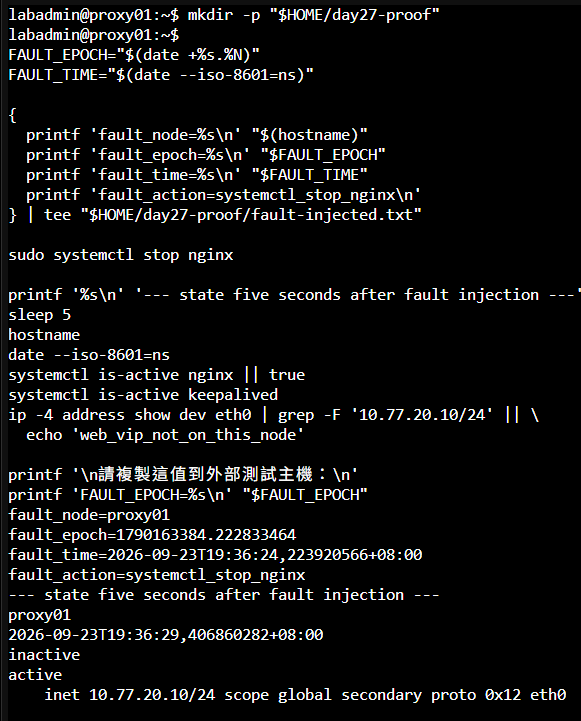

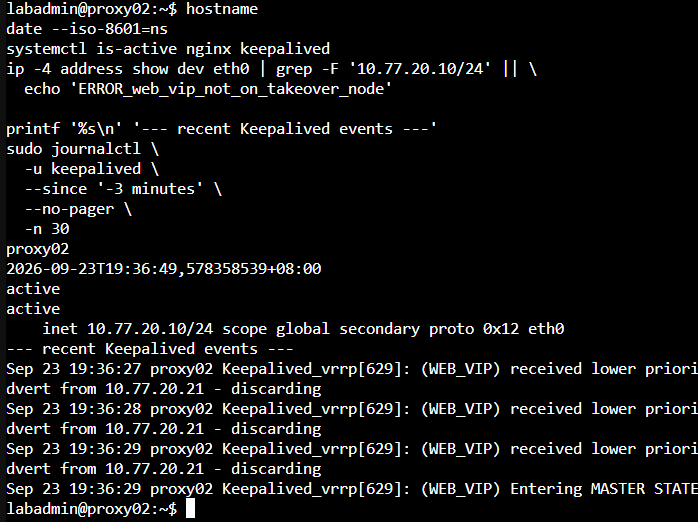

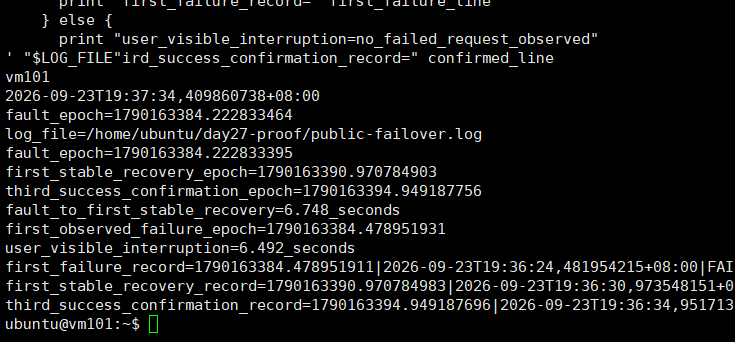

圖（八）故障注入、Web VIP 接管與公開 HTTPS 恢復時間

---

## 9. 驗證 Cloudflare WAF 阻擋受控請求

本節建立一條只匹配測試路徑的 Custom Rule，完成外部阻擋驗證後立即移除，避免測試規則長期留在正式入口。

1. Cloudflare Dashboard → Security → WAF／Security rules → Custom rules。
2. 建立只用於測試的規則：

```text
Rule name: DAY27_WAF_PROOF
Expression: http.request.uri.path eq "/day27-waf-proof"
Action: Block
```

3. 從外部 Linux 測試主機執行：

```bash
PUBLIC_HOST='請填入實際公開完整主機名稱'

clear
hostname
date --iso-8601=ns
curl -sS \
  --connect-timeout 10 \
  --max-time 15 \
  -D - \
  -o /dev/null \
  -w 'http_code=%{http_code}\nremote_ip=%{remote_ip}\n' \
  "https://${PUBLIC_HOST}/day27-waf-proof?proof=$(date +%s%N)"
```

4. Cloudflare Dashboard → Security → Events，依時間、主機名稱與 URI Path 篩選，核對 `DAY27_WAF_PROOF`、Block Action、Path、Ray ID 與時間。
5. 停用或刪除 `DAY27_WAF_PROOF`，再從外部測試主機確認一般 `/health` 回傳 HTTP 200：

```bash
curl -sS \
  --connect-timeout 10 \
  --max-time 15 \
  -o /dev/null \
  -w 'http_code=%{http_code}\n' \
  "https://${PUBLIC_HOST}/health?proof=day27-waf-cleanup-$(date +%s%N)"
```

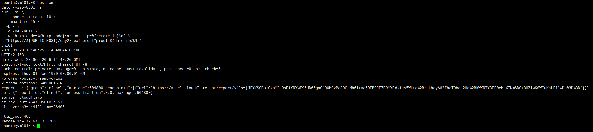

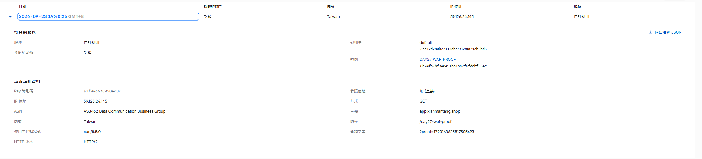

圖（九）HTTP 403 與 Security Events 共同驗證 Custom Rule 已命中

---

## 10. 完成後確認

- 公開網域經 Cloudflare 取得 HTTP 200，強制直連 Origin 的請求遭到阻擋。
- Nginx Access Log 能以相同的 `proof_id` 對應外部請求，並分辨真實用戶端與 Cloudflare Peer。
- Web VIP 接管後，外部 HTTPS 探測恢復連續三次 HTTP 200。
- `DAY27_WAF_PROOF` 已停用或刪除，一般 `/health` 回復 HTTP 200。
- Cloudflare API Token、Cookie 與 Origin Private Key 未寫入文件或提交至 Git。
