# Day 28｜PostgreSQL 資料誤刪如何復原？使用 pgBackRest、WAL Archive 與 PITR 回到指定時間點

對應文章：[Day 28｜PostgreSQL 資料誤刪如何復原？使用 pgBackRest、WAL Archive 與 PITR 回到指定時間點](https://ithelp.ithome.com.tw/articles/10418150)

本日建立 backup01 專用 Repository Host，完成 Full Backup、WAL Archive 與獨立 Restore VM 的 Point-in-Time Recovery。禁止直接在運作中的 Patroni Cluster 上覆寫還原。

## 本日操作順序

1. 在 PVE Web UI 建立 backup01 與 Repository Disk，先確認底層 Storage 空間再配置容量。
2. 依序在 backup01、pg01、pg02、pg03 安裝相同版本的 pgBackRest。
3. 只在 backup01 建立 Repository Account、目錄與 Server Config。
4. 逐台在 pg01、pg02、pg03 建立 Database Host Config 與 SSH 存取。
5. 在 DCS 寫入一次 Patroni Archive 設定；先逐台重啟 Replica，再計畫性切換並重啟舊 Leader。
6. 只在 backup01 建立 Stanza、執行 Full Backup 並驗證 WAL Archive。
7. 在目前 Leader 建立並誤刪測試資料，記錄精確時間。
8. 另外建立 Restore VM 做 PITR，不可直接還原到正在運作的 pg01～pg03。

## 1. 建立 backup01

**操作位置：PVE Web UI 建立 VM。作業系統內的磁碟與網路設定只在 backup01。**

加入 Repository Disk 前，先在 pve01 Shell 執行：

```bash
pvesm status
lvs -a -o lv_name,lv_size,data_percent,metadata_percent
```

若 `local-lvm` 剩餘不足 20%，先停止本節，檢查不再使用的 ISO、Backup、Snapshot 與 Test Clone，不要繼續超額分配。

確認容量後建立 VM：

1. 左側選 Day 06 的 Debian 13 Template。
2. 右上角按 `More` → `Clone`。
3. `Target Node` 選 `pve01`。
4. `VM ID` 填 `261`。
5. `Name` 填 `backup01`。
6. `Mode` 選 `Full Clone`。
7. `Target Storage` 選 pve01 的 `local-lvm`。
8. 按 `Clone`，等待 Task 顯示 `OK`。
9. 選 VM 261 → `Hardware` → `Processors` → `Edit`。
10. Sockets 填 `1`、Cores 填 `2`，按 `OK`。
11. 選 `Memory` → `Edit`，Memory 填 `2048 MiB`，取消 Ballooning，按 `OK`。
12. 選 `Network Device (net0)` → `Edit`。
13. Bridge 選 `vmbr1`、VLAN Tag 填 `40`、Model 選 `VirtIO`、Firewall 勾選，按 `OK`。
14. 選 `Cloud-Init`，User 填 `labadmin`，Password 填 Lab 管理密碼。
15. 點 `IP Config (net0)` → `Edit`，IPv4 選 `Static`。
16. IPv4/CIDR 填 `10.77.40.11/24`，Gateway 填 `10.77.40.1`，按 `OK`。
17. DNS Domain 填 `lab.home`，DNS Server 填 `10.77.40.1`，按 `Regenerate Image`。
18. 到 `Hardware` → `Add` → `Hard Disk`。
19. Bus／Device 選 `SCSI`，Storage 選 pve01 的 `local-lvm`，Disk size 填 `32 GiB`。
20. 勾選 `Discard` 與 `IO thread`，按 `Add`。
21. 到 `Options` → `Start at boot` → `Edit`，勾選後按 `OK`。
22. 按 `Start`，再開啟 `Console`。

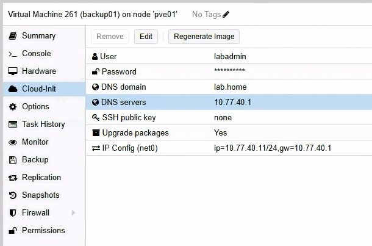

圖（一）backup01 使用 VLAN 40、固定 IP `10.77.40.11/24`、閘道與 DNS `10.77.40.1`。

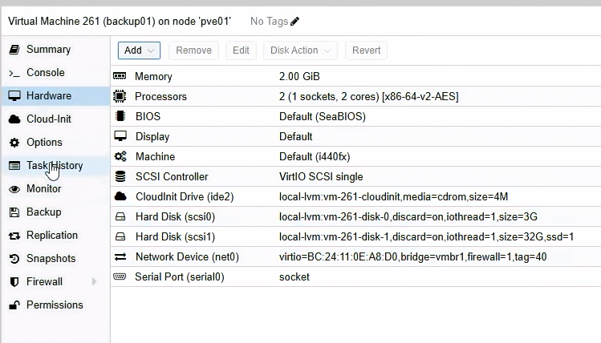

圖（二）backup01 配置 2 vCPU、2 GiB 記憶體、3 GiB 系統磁碟與 32 GiB Repository 磁碟。

開機後先執行：

```bash
hostnamectl --static
ip -br address
ip route
resolvectl status
resolvectl query deb.debian.org
sudo lsblk -o NAME,SIZE,TYPE,FSTYPE,MOUNTPOINTS,MODEL
```

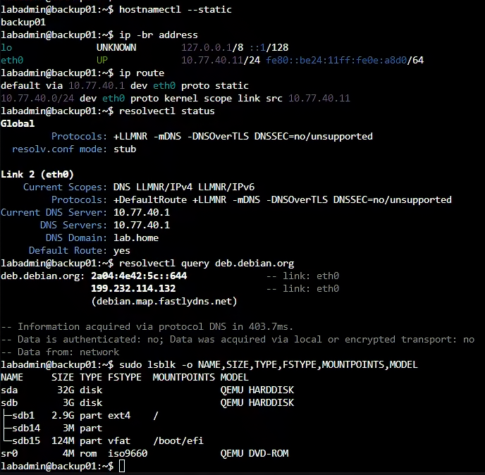

圖（三）backup01 已載入預定網路設定，`lsblk` 顯示 32 GiB 空白 Repository 磁碟為 `/dev/sda`。

`resolvectl status` 必須在 Global 或網路介面區塊看到 DNS Server `10.77.40.1` 與 DNS Domain `lab.home`。如果 Cloud-Init 已設定 IP 與預設閘道，systemd-resolved 卻沒有取得這兩項，執行：

```bash
sudo install -d -m 0755 /etc/systemd/resolved.conf.d
printf '%s\n' \
  '[Resolve]' \
  'DNS=10.77.40.1' \
  'Domains=lab.home' |
  sudo tee /etc/systemd/resolved.conf.d/10-lab-dns.conf
sudo systemctl restart systemd-resolved
sudo resolvectl flush-caches
resolvectl status
resolvectl query deb.debian.org
```

`deb.debian.org` 成功只代表對外 DNS 正常。Day 20 的 `pg01～03.lab.home` 使用各節點的固定 Hosts 清單，尚未建立成 OPNsense Host Override，因此新建的 backup01 還要加入三台 PostgreSQL 節點的固定名稱。

先備份並開啟 Cloud-Init 使用的 Hosts Template：

```bash
sudo cp -a /etc/cloud/templates/hosts.debian.tmpl \
  /etc/cloud/templates/hosts.debian.tmpl.before-day28
sudo nano /etc/cloud/templates/hosts.debian.tmpl
```

在檔案末端加入：

```text
10.77.30.11 pg01.lab.home pg01
10.77.30.12 pg02.lab.home pg02
10.77.30.13 pg03.lab.home pg03
```

按 `Ctrl+O`、Enter、`Ctrl+X`，再將相同三行加入目前正在使用的 `/etc/hosts`：

```bash
sudo nano /etc/hosts
```

完成後驗證：

```bash
for host in pg01.lab.home pg02.lab.home pg03.lab.home; do
  getent ahostsv4 "$host" | head -n 1
done
```

結果必須依序顯示 `10.77.30.11`、`10.77.30.12`、`10.77.30.13`。不要直接修改 `/etc/resolv.conf`；它是 systemd-resolved 管理的 Stub Resolver 設定。

以下指令假設 32 GiB 空白 Repository Disk 是 `/dev/sda`。如 `lsblk` 顯示不同名稱，後續所有 `/dev/sda` 都要改成實際空白磁碟；不能只根據名稱猜測。

確認空白磁碟後建立檔案系統：

```bash
sudo lsblk -o NAME,SIZE,FSTYPE,MOUNTPOINTS
sudo wipefs -n /dev/sda
sudo mkfs.ext4 -L pgrepo /dev/sda
sudo mkdir -p /var/lib/pgbackrest
grep -q '^LABEL=pgrepo /var/lib/pgbackrest ' /etc/fstab || \
  echo 'LABEL=pgrepo /var/lib/pgbackrest ext4 defaults,noatime 0 2' | \
  sudo tee -a /etc/fstab
sudo systemctl daemon-reload
sudo findmnt --verify --verbose
sudo mount -a
findmnt /var/lib/pgbackrest
df -hT /var/lib/pgbackrest
```

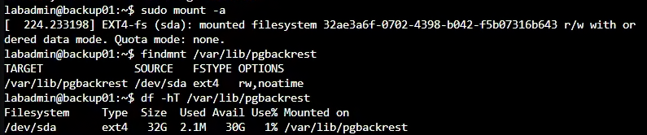

圖（四）`/dev/sda` 已以 ext4 掛載至 `/var/lib/pgbackrest`，可用容量約 30 GiB。

## 2. 逐台安裝相同版本 pgBackRest

**操作順序：backup01 → pg01 → pg02 → pg03。每台安裝後立即確認版本完全相同。**

backup01、pg01～03 都使用 PGDG Repository：

```bash
sudo apt update
sudo apt install -y postgresql-common ca-certificates curl
sudo /usr/share/postgresql-common/pgdg/apt.postgresql.org.sh
sudo apt update
sudo apt install -y pgbackrest openssh-client openssh-server
sudo systemctl enable --now ssh
pgbackrest version
```

四台的 pgBackRest 版本必須完全一致。保存：

```bash
apt-cache policy pgbackrest
```

## 3. 建立 Repository 帳號

**操作節點：只在 backup01。**

backup01：

```bash
sudo useradd --system --create-home --home-dir /var/lib/pgbackrest --shell /bin/bash pgbackrest
sudo chown -R pgbackrest:pgbackrest /var/lib/pgbackrest
sudo chmod 750 /var/lib/pgbackrest
sudo install -d -m 700 -o pgbackrest -g pgbackrest /var/lib/pgbackrest/.ssh
```

建立兩個方向的專用 SSH Key：

```text
Repository → pg01～03：執行備份時讀取 Primary／Standby
pg01～03 postgres → Repository：archive-push 與 restore 存取 Repository
```

OPNsense 只允許 PG_NODES 與 BACKUP_NODE 間必要的 TCP 22。正式部署還應在 `authorized_keys` 加入 Forced Command，以及 `no-agent-forwarding`、`no-port-forwarding`、`no-X11-forwarding` 等限制，讓服務帳號金鑰只能執行必要的 pgBackRest 遠端命令。本篇先保留容易觀察與排錯的 Lab 設定。

### 3.1 建立 backup01 到三台 PG 的 Key

操作節點：只在 backup01。

```bash
sudo -u pgbackrest ssh-keygen -t ed25519 \
  -f /var/lib/pgbackrest/.ssh/id_ed25519 \
  -C 'pgbackrest@backup01' -N ''
sudo -u pgbackrest cat /var/lib/pgbackrest/.ssh/id_ed25519.pub
```

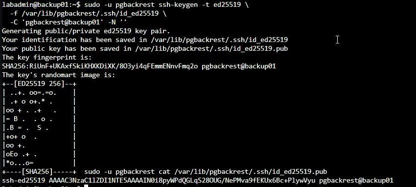

圖（五）backup01 以 `pgbackrest` 帳號建立專用 Ed25519 金鑰，後續只分發 Public Key。

複製整行 Public Key，不要複製沒有 `.pub` 的 Private Key。

操作節點：pg01、pg02、pg03 逐台執行。

```bash
sudo -u postgres install -d -m 700 /var/lib/postgresql/.ssh
sudo -u postgres nano /var/lib/postgresql/.ssh/authorized_keys
```

在每一台貼上剛才的同一行 Public Key，按 `Ctrl+O`、Enter、`Ctrl+X`，再執行：

```bash
sudo chown -R postgres:postgres /var/lib/postgresql/.ssh
sudo chmod 700 /var/lib/postgresql/.ssh
sudo chmod 600 /var/lib/postgresql/.ssh/authorized_keys
```

### 3.2 建立三台 PG 到 backup01 的 Key

操作節點：pg01、pg02、pg03。每台都建立自己的 Key，不複製 Private Key。

```bash
sudo -u postgres ssh-keygen -t ed25519 \
  -f /var/lib/postgresql/.ssh/id_ed25519 \
  -C "postgres@$(hostname -s)" -N ''
sudo -u postgres cat /var/lib/postgresql/.ssh/id_ed25519.pub
```

每次複製當前節點的 Public Key。到 backup01 開啟：

```bash
sudo -u pgbackrest nano /var/lib/pgbackrest/.ssh/authorized_keys
```

將 pg01、pg02、pg03 的三行 Public Key 各貼一行，按 `Ctrl+O`、Enter、`Ctrl+X`，再執行：

```bash
sudo chown -R pgbackrest:pgbackrest /var/lib/pgbackrest/.ssh
sudo chmod 700 /var/lib/pgbackrest/.ssh
sudo chmod 600 /var/lib/pgbackrest/.ssh/authorized_keys
```

### 3.3 放行並驗證 SSH 路徑

操作位置：OPNsense Web UI。

1. 進入 `Firewall` → `Rules`。
2. 按 `Add`，Interface 選 `LAB_INTERNAL`、Action 選 `Pass`、Version 選 `IPv4`、Protocol 選 `TCP`。
3. Source 選 `PG_NODES`、Destination 選 `BACKUP_NODE`、Destination Port 填 `22`。
4. Description 填 `PG nodes to pgBackRest repository`，按 `Save`。
5. 再按 `Add`，Interface 選 `LAB_INTERNAL`、Action 選 `Pass`、Version 選 `IPv4`、Protocol 選 `TCP`。
6. Source 選 `BACKUP_NODE`、Destination 選 `PG_NODES`、Destination Port 填 `22`。
7. Description 填 `pgBackRest repository to PG nodes`，按 `Save`。
8. 將兩條 Allow Rule 都移到 `Block LAB_INTERNAL to internal networks` 上方。
9. 按頁面上方 `Apply`。

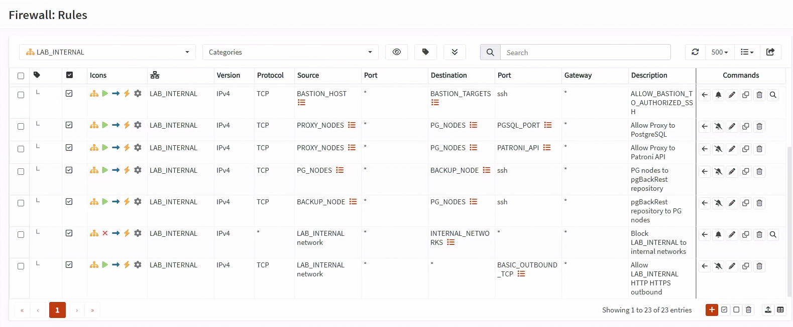

圖（六）兩條 SSH 規則位於跨 VLAN Block 上方，分別允許 PG_NODES 到 BACKUP_NODE，以及 BACKUP_NODE 到 PG_NODES。

兩條規則都要使用 `LAB_INTERNAL`，不要分別建立在 Database 或 Backup 個別 Interface。Day 14 的跨 VLAN Block 位於 `LAB_INTERNAL` Interface Group；Group Rule 會先於個別 Interface Rule 評估，因此建立在個別介面的 Allow 無法越過前面的 Group Block。

在 backup01 逐一建立 Known Hosts 並測試：

```bash
sudo -u pgbackrest ssh-keyscan -H pg01.lab.home pg02.lab.home pg03.lab.home \
  | sudo -u pgbackrest tee /var/lib/pgbackrest/.ssh/known_hosts
sudo -u pgbackrest ssh postgres@pg01.lab.home 'hostnamectl --static'
sudo -u pgbackrest ssh postgres@pg02.lab.home 'hostnamectl --static'
sudo -u pgbackrest ssh postgres@pg03.lab.home 'hostnamectl --static'
```

正式環境要先從 PVE Console 或資產管理資料比對 SSH Host Key Fingerprint，不能只依賴第一次 `ssh-keyscan`。

在 pg01、pg02、pg03 各自執行：

```bash
sudo -u postgres ssh-keyscan -H backup01.lab.home \
  | sudo -u postgres tee /var/lib/postgresql/.ssh/known_hosts
sudo -u postgres ssh pgbackrest@backup01.lab.home 'hostnamectl --static'
```

## 4. Repository Host Config

**操作節點：只在 backup01。**

backup01 開啟設定檔：

```bash
sudo install -d -m 755 /etc/pgbackrest
sudo nano /etc/pgbackrest/pgbackrest.conf
```

貼上：

```ini
[iron-pg]
pg1-host=pg01.lab.home
pg1-host-user=postgres
pg1-path=/var/lib/postgresql/18/patroni
pg2-host=pg02.lab.home
pg2-host-user=postgres
pg2-path=/var/lib/postgresql/18/patroni
pg3-host=pg03.lab.home
pg3-host-user=postgres
pg3-path=/var/lib/postgresql/18/patroni

[global]
repo1-path=/var/lib/pgbackrest/repo
repo1-retention-full=2
repo1-retention-diff=4
start-fast=y
process-max=2
log-level-console=info
log-level-file=detail
```

`repo1-retention-full=2` 保留兩份 Full；`repo1-retention-diff=4` 的計數包含 Full，代表四個 Full／Differential 備份集合的計數範圍。

按 `Ctrl+O`、Enter、`Ctrl+X` 儲存，再執行：

```bash
sudo install -d -m 750 -o pgbackrest -g pgbackrest /var/lib/pgbackrest/repo /var/log/pgbackrest
sudo chown root:pgbackrest /etc/pgbackrest/pgbackrest.conf
sudo chmod 640 /etc/pgbackrest/pgbackrest.conf
sudo -u pgbackrest pgbackrest --config=/etc/pgbackrest/pgbackrest.conf help >/dev/null
```

## 5. Database Host Config

**操作節點：pg01、pg02、pg03。逐台設定並各自測試連到 backup01。**

pg01～03 逐台開啟：

```bash
sudo install -d -m 755 /etc/pgbackrest
sudo nano /etc/pgbackrest/pgbackrest.conf
```

三台都貼上：

```ini
[iron-pg]
pg1-path=/var/lib/postgresql/18/patroni

[global]
repo1-host=backup01.lab.home
repo1-host-user=pgbackrest
repo1-path=/var/lib/pgbackrest/repo
process-max=2
log-level-console=info
```

`pg1-path` 提供預設還原位置；本次演練會在 Restore 命令使用 `--pg1-path` 覆寫為專用的 `day28-proof-*` 目錄，讓每次還原彼此隔離。

按 `Ctrl+O`、Enter、`Ctrl+X` 儲存，再執行：

```bash
sudo chown root:postgres /etc/pgbackrest/pgbackrest.conf
sudo chmod 640 /etc/pgbackrest/pgbackrest.conf
sudo -u postgres pgbackrest --config=/etc/pgbackrest/pgbackrest.conf help >/dev/null
```

## 6. Patroni 啟用 Archive

**操作順序：先逐台處理 Replica，確認它重新加入後再處理下一台。Leader 最後處理，必要時先 Planned Switchover。**

`edit-config` 只需在任一台目前正常運作的 Patroni 節點執行一次，不要在三台重複操作。這是儲存在 DCS 的 Cluster Dynamic Configuration，套用後三台成員都會讀到相同設定。執行完整命令開啟 Dynamic Configuration：

```bash
sudo -u postgres patronictl \
  -c /etc/patroni/config.yml \
  edit-config iron-pg
```

在編輯器的 `postgresql.parameters` 下加入：

```yaml
archive_mode: "on"
archive_command: "pgbackrest --stanza=iron-pg archive-push %p"
restore_command: "pgbackrest --stanza=iron-pg archive-get %f %p"
archive_timeout: 60s
```

按 `Ctrl+O`、Enter、`Ctrl+X` 儲存並離開編輯器。`patronictl` 顯示差異後，確認四個參數位於 `postgresql.parameters`，再輸入 `y` 套用。

```bash
sudo -u postgres patronictl \
  -c /etc/patroni/config.yml \
  list
sudo -u postgres patronictl \
  -c /etc/patroni/config.yml \
  show-config iron-pg
```

`archive_mode` 需要 PostgreSQL Restart 才會生效，因此 `edit-config` 雖然只執行一次，三台成員都要逐台完成 Restart。請使用下列 `patronictl restart` 順序，一次只重新啟動一台成員。

先執行 `list` 記下當下的 Leader 與兩台 Replica。以下範例假設 pg01 是 Leader、pg02 與 pg03 是 Replica；如果畫面角色不同，必須將命令中的成員名稱換成實際角色。

先 Restart 第一台 Replica：

```bash
sudo -u postgres patronictl \
  -c /etc/patroni/config.yml \
  restart iron-pg pg02 --force

sudo -u postgres patronictl \
  -c /etc/patroni/config.yml \
  list
```

等待 pg02 恢復為 `Replica / streaming`、Lag 回到可接受範圍後，才 Restart 第二台 Replica：

```bash
sudo -u postgres patronictl \
  -c /etc/patroni/config.yml \
  restart iron-pg pg03 --force

sudo -u postgres patronictl \
  -c /etc/patroni/config.yml \
  list
```

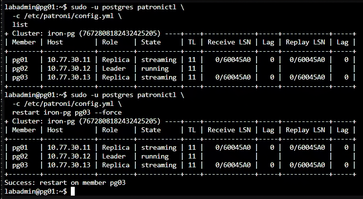

圖（七）重新啟動 pg03 後，叢集維持一台 Leader 與兩台串流中的 Replica，Lag 為 0。

等待 pg03 也恢復為 `Replica / streaming`。接著把 Leader 從 pg01 Planned Switchover 到已完成 Restart 且 Lag 為 0 的 pg02：

```bash
sudo -u postgres patronictl \
  -c /etc/patroni/config.yml \
  switchover iron-pg \
  --leader pg01 \
  --candidate pg02 \
  --force

sudo -u postgres patronictl \
  -c /etc/patroni/config.yml \
  list
```

確認 pg02 已成為 Leader、pg01 已成為 `Replica / streaming` 後，Restart 原 Leader：

```bash
sudo -u postgres patronictl \
  -c /etc/patroni/config.yml \
  restart iron-pg pg01 --force

sudo -u postgres patronictl \
  -c /etc/patroni/config.yml \
  list
```

最後必須看到一台 Leader、兩台 `Replica / streaming`，三台都沒有 `Pending restart`。接著在 pg01、pg02、pg03 各自執行下列命令，透過本機 Unix Socket 查詢該 PostgreSQL Instance 實際載入的 Archive 設定：

```bash
hostnamectl --static
sudo -u postgres psql \
  -X -d postgres -P pager=off \
  -c "SELECT current_setting('archive_mode') AS archive_mode,
             current_setting('archive_command') AS archive_command,
             current_setting('restore_command') AS restore_command,
             current_setting('archive_timeout') AS archive_timeout;"
```

本 Lab 維持既有 HBA 限制，並在三台節點各自透過本機 Unix Socket 查詢。三台的 `archive_mode` 都必須是 `on`，另外三個值也必須與本節設定一致。Dynamic Configuration 顯示的是預定設定，實際查詢結果才能確認需要 Restart 的參數已載入。任一台顯示 `off` 時，請先以 `patronictl restart` 完成該成員的 Restart，再執行 `check` 或 `backup`。`stanza-create` 成功只確認 Stanza 已建立；修正 Archive 參數後無須重建 Stanza。

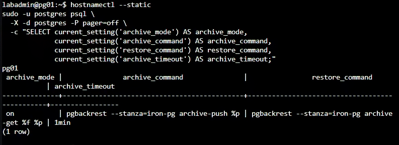

圖（八）節點實際載入 `archive_mode=on`、pgBackRest Archive Push／Get 命令與 `archive_timeout=1min`。

## 7. 建立 Stanza 與 Full Backup

**操作順序：先在 backup01 建立 Stanza 與 Full Backup，再到目前 Patroni Leader 切換 WAL 並檢查 Archive。**

在 backup01：

```bash
sudo -u pgbackrest pgbackrest --stanza=iron-pg stanza-create
sudo -u pgbackrest pgbackrest --stanza=iron-pg check
sudo -u pgbackrest pgbackrest --stanza=iron-pg --type=full backup
sudo -u pgbackrest pgbackrest --stanza=iron-pg info
```

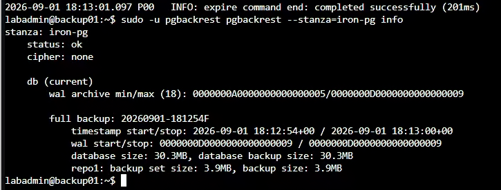

圖（九）`iron-pg` Stanza 狀態為 `ok`，並列出完整備份及其 WAL 起訖範圍。

在目前 Primary：

```bash
sudo -u postgres pgbackrest --stanza=iron-pg check
sudo -u postgres psql -c 'SELECT pg_switch_wal();'
```

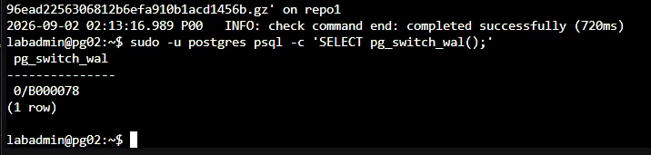

圖（十）pgBackRest Check 成功後，Primary 以 `pg_switch_wal()` 主動完成目前 WAL 區段。

Repository 中應看到 Backup Set 與 WAL 範圍。只看到 `backup command end: completed successfully` 還不算完成，必須做還原。

## 8. 建立誤刪時間點

**操作順序：先找出目前 Leader，再於該 Leader 建立測試資料、記錄時間、執行誤刪。**

在任一 PG Node 先確認目前 Leader：

```bash
sudo -u postgres patronictl \
  -c /etc/patroni/config.yml \
  list
```

進入目前顯示為 `Leader` 的節點 Console，先建立本次測試專用的 `PROOF_ID`，再使用本機 Unix Socket 開啟管理 Session：

```bash
hostnamectl --static
PROOF_ID="day28-$(date +%Y%m%dT%H%M%S%z)"
printf 'PROOF_ID=%s\n' "$PROOF_ID"
sudo -u postgres psql \
  -X -d appdb -v ON_ERROR_STOP=1 \
  -P pager=off -v proof_id="$PROOF_ID"
```

在 psql 中切換成 `app_owner` 後建立測試資料：

```sql
SET ROLE app_owner;
CREATE TABLE IF NOT EXISTS app.pitr_demo(
  id bigint GENERATED ALWAYS AS IDENTITY PRIMARY KEY,
  note text NOT NULL,
  created_at timestamptz DEFAULT clock_timestamp()
);
INSERT INTO app.pitr_demo(note) VALUES (:'proof_id')
RETURNING id, note, created_at;
SELECT clock_timestamp() AS restore_target_time;
RESET ROLE;
SELECT pg_walfile_name(pg_current_wal_lsn()) AS target_wal;
SELECT pg_switch_wal();
```

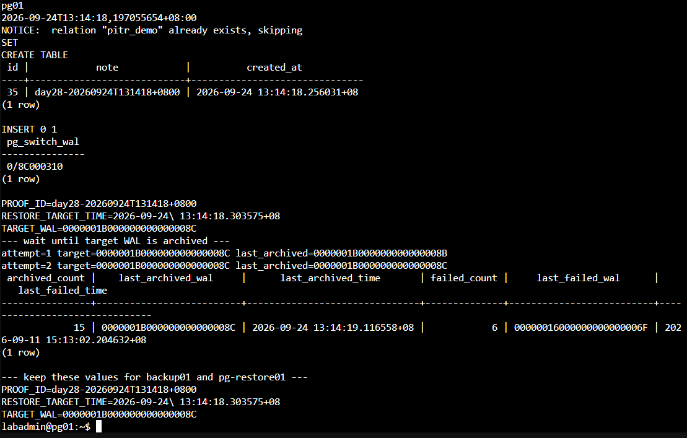

圖（十一）同一次操作建立唯一 `PROOF_ID`、記錄復原目標時間與目標 WAL，並確認該 WAL 已封存。

保存 `PROOF_ID`、`restore_target_time` 與 `target_wal`。`restore_target_time` 要保存查詢結果中的完整時間戳，例如 `2026-09-02 02:15:43.123456+08`；不要只記錄日期、整點或欄位名稱。保持這個 psql Session，不要先執行 `DELETE`。在目前 Leader 的另一個 Console 查詢 Archiver：

```bash
sudo -u postgres psql \
  -X -d postgres -P pager=off \
  -c "SELECT archived_count,
             last_archived_wal,
             last_archived_time,
             failed_count,
             last_failed_wal,
             last_failed_time
      FROM pg_stat_archiver;"
```

`last_archived_wal` 必須等於剛才保存的 `target_wal`，或已經是它之後的 WAL；`last_archived_time` 必須是本次操作後的新時間。`last_failed_wal` 與 `last_failed_time` 是排錯線索；曾經失敗但後來成功時，歷史失敗欄位不會立刻清空，因此以較新的 `last_archived_wal` 與 `last_archived_time` 判斷最終結果。

接著在 backup01 執行 Repository 端檢查：

```bash
sudo -u pgbackrest pgbackrest \
  --stanza=iron-pg check
```

必須看到 `check command end: completed successfully`。只有 Leader 的 `pg_stat_archiver` 已越過 `target_wal`，而且 Repository Check 成功，才能回到剛才保持開啟的 psql Session 執行誤刪：

```sql
SET ROLE app_owner;
DELETE FROM app.pitr_demo WHERE note = :'proof_id';
SELECT count(*) AS rows_visible_after_delete
FROM app.pitr_demo
WHERE note = :'proof_id';
RESET ROLE;
\q
```

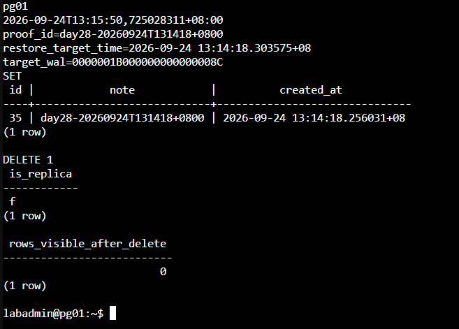

圖（十二）正式 Cluster 已刪除本次 `PROOF_ID`，條件查詢結果為 0 筆。

Day 25 的 HBA 只允許 Proxy 節點以 `app_rw` 與 `app_ro` 連線，沒有允許權限較高的 `app_owner` 從網路登入。不要為本節新增 `app_owner` HBA，也不要從 client01 經 DB RW VIP 使用該帳號。不要用模糊的「大約幾分鐘前」；保存含時區的完整 Timestamp。

## 9. 建立 Restore VM

**操作位置：先在 PVE Web UI 建立全新的 Restore VM，後續還原指令只在該 VM 執行。**

在 PVE Web UI 建立臨時 VM：

1. 左側選 Debian 13 Template，按 `More` → `Clone`。
2. `Target Node` 選 `pve03`、`VM ID` 填 `904`、`Name` 填 `pg-restore01`。
3. `Mode` 選 `Full Clone`、`Target Storage` 選 pve03 的 `local-lvm`，按 `Clone`。
4. Task 顯示 `OK` 後，到 VM 904 → `Hardware` → `Processors` → `Edit`。
5. Sockets 填 `1`、Cores 填 `2`，按 `OK`。
6. 選 `Memory` → `Edit`，Memory 填 `2048 MiB`、取消 Ballooning，按 `OK`。
7. 選 System Disk → `Disk Action` → `Resize`，使最終容量為 16 GiB。
8. 選 `Network Device (net0)` → `Edit`，Bridge 選 `vmbr1`、VLAN Tag 填 `30`、Model 選 `VirtIO`、Firewall 勾選，按 `OK`。
9. 到 `Cloud-Init`，User 填 `labadmin`、Password 填 Lab 管理密碼。
10. `IP Config (net0)` → `Edit`，IPv4 選 `Static`，IPv4/CIDR 填 `10.77.30.21/24`、Gateway 填 `10.77.30.1`，按 `OK`。
11. DNS Domain 填 `lab.home`、DNS Server 填 `10.77.30.1`，按 `Regenerate Image`。
12. 到 `Hardware` → `Add` → `Hard Disk`。
13. Bus／Device 選 `SCSI`、Storage 選 pve03 的 `local-lvm`、Disk size 填 `16 GiB`。
14. 勾選 `Discard` 與 `IO thread`，按 `Add`。
15. 按 `Start`，再開啟 `Console`。

這台 VM 不加入 Patroni／etcd，不接受 Application 流量。開機後先確認 DNS：

```bash
resolvectl status
resolvectl query deb.debian.org
```

`resolvectl status` 必須看到 DNS Server `10.77.30.1` 與 DNS Domain `lab.home`。若缺少，執行：

```bash
sudo install -d -m 0755 /etc/systemd/resolved.conf.d
printf '%s\n' \
  '[Resolve]' \
  'DNS=10.77.30.1' \
  'Domains=lab.home' |
  sudo tee /etc/systemd/resolved.conf.d/10-lab-dns.conf
sudo systemctl restart systemd-resolved
sudo resolvectl flush-caches
resolvectl query deb.debian.org
```

確認解析正常後，再找出 16 GiB 空白 Data Disk：

```bash
sudo lsblk -o NAME,SIZE,TYPE,FSTYPE,MOUNTPOINTS,MODEL
```

以下假設空白磁碟是 `/dev/sdb`。請先以 `lsblk` 確認它是 16 GiB，且 FSTYPE 與 Mountpoint 都為空，再執行：

```bash
sudo wipefs -n /dev/sdb
sudo mkfs.ext4 -L pgrestore /dev/sdb
sudo mkdir -p /var/lib/postgresql
grep -q '^LABEL=pgrestore /var/lib/postgresql ' /etc/fstab || \
  echo 'LABEL=pgrestore /var/lib/postgresql ext4 defaults,noatime 0 2' | \
  sudo tee -a /etc/fstab
sudo systemctl daemon-reload
sudo findmnt --verify --verbose
sudo mount -a
df -hT /var/lib/postgresql
```

安裝與 Primary 完全相同版本的 PostgreSQL 18 與 pgBackRest：

```bash
sudo apt update
sudo apt install -y postgresql-common ca-certificates curl openssh-client
sudo /usr/share/postgresql-common/pgdg/apt.postgresql.org.sh
sudo apt update
sudo apt install -y postgresql-18 postgresql-client-18 pgbackrest
psql --version
pgbackrest version
```

版本與 pg01 相同後，停止套件預設 Cluster，確認 PostgreSQL 18 的上層目錄由 `postgres` 管理：

```bash
sudo systemctl disable --now postgresql
sudo install -d -m 700 -o postgres -g postgres /var/lib/postgresql/18
```

開啟 Restore VM 的設定檔：

```bash
sudo install -d -m 755 /etc/pgbackrest
sudo nano /etc/pgbackrest/pgbackrest.conf
```

貼上：

```ini
[iron-pg]
pg1-path=/var/lib/postgresql/18/restore

[global]
repo1-host=backup01.lab.home
repo1-host-user=pgbackrest
repo1-path=/var/lib/pgbackrest/repo
process-max=2
log-level-console=info
```

按 `Ctrl+O`、Enter、`Ctrl+X` 儲存，再執行：

```bash
sudo chown root:postgres /etc/pgbackrest/pgbackrest.conf
sudo chmod 640 /etc/pgbackrest/pgbackrest.conf
sudo -u postgres install -d -m 700 /var/lib/postgresql/.ssh
sudo -u postgres ssh-keygen -t ed25519 \
  -f /var/lib/postgresql/.ssh/id_ed25519 \
  -C 'postgres@pg-restore01' -N ''
sudo -u postgres cat /var/lib/postgresql/.ssh/id_ed25519.pub
```

複製這行 Public Key。到 backup01 執行 `sudo -u pgbackrest nano /var/lib/pgbackrest/.ssh/authorized_keys`，把 Key 貼到新的一行，按 `Ctrl+O`、Enter、`Ctrl+X`。

在 OPNsense 進入 `Firewall` → `Rules`，按 `Add`。Interface 選 `LAB_INTERNAL`、Action 選 `Pass`、Version 選 `IPv4`、Protocol 選 `TCP`、Source 填 `10.77.30.21`、Destination 選 `BACKUP_NODE`、Destination Port 填 `22`，Description 填 `PITR restore VM to repository`。按 `Save` 後將規則移到 `Block LAB_INTERNAL to internal networks` 上方，再按 `Apply`。不建立 backup01 主動連回 Restore VM 的規則。

回到 pg-restore01，加入 backup01 Host Key 並測試：

```bash
grep -qE '^10\.77\.40\.11[[:space:]]+backup01\.lab\.home([[:space:]]|$)' /etc/hosts || \
  echo '10.77.40.11 backup01.lab.home backup01' | \
  sudo tee -a /etc/hosts
getent ahostsv4 backup01.lab.home
sudo -u postgres ssh-keyscan -H backup01.lab.home \
  | sudo -u postgres tee /var/lib/postgresql/.ssh/known_hosts
sudo -u postgres ssh pgbackrest@backup01.lab.home 'hostnamectl --static'
```

確認回傳 `backup01` 後才執行 Restore。先建立本次專用的還原目錄並記錄開始時間：

將下方 `2026-09-02 02:15:43.123456+08` 換成前面實際保存的 `restore_target_time`，不要直接照抄範例時間。

> **安全限制：** `pg-restore01` 只用來讀取與驗證還原結果，不得產生新 Timeline，也不得把 WAL 寫回正式 Repository。以下 Restore 使用 `--target-action=pause`，讓 PostgreSQL 到達目標時間後停在 Recovery；`--archive-mode=off` 與啟動參數中的 `-c archive_mode=off` 則是兩道防護。不要將 `pause` 改成 `promote`，也不要移除這兩個 Archive Mode 設定。

```bash
RESTORE_DIR="/var/lib/postgresql/18/day28-proof-$(date +%Y%m%dT%H%M%S)"
sudo -u postgres test ! -e "$RESTORE_DIR"
sudo -u postgres install -d -m 700 "$RESTORE_DIR"

sudo -u postgres pgbackrest --stanza=iron-pg info

RESTORE_START_EPOCH="$(date +%s.%N)"

sudo -u postgres pgbackrest --stanza=iron-pg \
  --pg1-path="$RESTORE_DIR" \
  --type=time \
  --target='2026-09-02 02:15:43.123456+08' \
  --target-action=pause \
  --archive-mode=off \
  restore

RESTORE_END_EPOCH="$(date +%s.%N)"
```

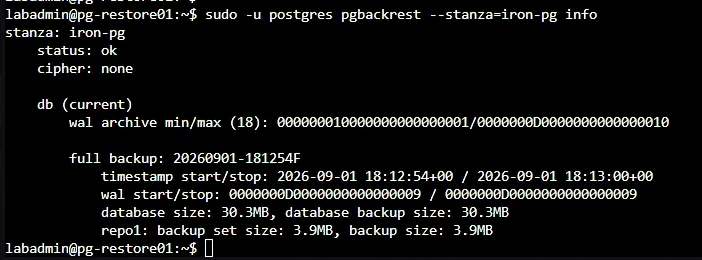

圖（十三）pg-restore01 已透過專用 SSH 路徑讀取 `iron-pg` Stanza、完整備份與 Archived WAL 範圍。

以獨立 Port `55432` 啟動，不加入 Patroni。還原資料會保留正式 Cluster 的 TLS 與絕對 HBA 路徑；Restore VM 不複製正式 Server Private Key，而且只監聽 Loopback，因此啟動時覆寫這些設定。啟動命令再次強制關閉 Archive Mode，並使用 `-l` 將背景 Recovery Log 寫入檔案：

```bash
PG_START_EPOCH="$(date +%s.%N)"

sudo -u postgres /usr/lib/postgresql/18/bin/pg_ctl \
  -D "$RESTORE_DIR" \
  -l "$RESTORE_DIR/restore-startup.log" \
  -o "-p 55432 -c listen_addresses=127.0.0.1 -c ssl=off -c archive_mode=off -c hba_file=$RESTORE_DIR/pg_hba.conf -c ident_file=$RESTORE_DIR/pg_ident.conf" \
  start

for attempt in $(seq 1 60); do
  recovery_state=$(sudo -u postgres psql \
    -p 55432 -d postgres -Atqc \
    "SELECT current_setting('archive_mode'),
            pg_is_in_recovery(),
            pg_get_wal_replay_pause_state();" 2>/dev/null || true)
  if [ "$recovery_state" = 'off|t|paused' ]; then
    echo 'PITR target: reached and paused; archive_mode=off'
    break
  fi
  sleep 1
done

test "$recovery_state" = 'off|t|paused' || {
  echo 'PITR target was not reached safely or timed out'
  sudo -u postgres tail -n 80 \
    "$RESTORE_DIR/restore-startup.log"
  exit 1
}

TARGET_REACHED_EPOCH="$(date +%s.%N)"

PROOF_ID='請填入前面保存的 PROOF_ID'
sudo -u postgres psql \
  -p 55432 -X -d appdb -v proof_id="$PROOF_ID" \
  -c "SELECT id, note, created_at
      FROM app.pitr_demo
      WHERE note = :'proof_id';"

VALIDATION_END_EPOCH="$(date +%s.%N)"

awk \
  -v restore_start="$RESTORE_START_EPOCH" \
  -v restore_end="$RESTORE_END_EPOCH" \
  -v pg_start="$PG_START_EPOCH" \
  -v target_reached="$TARGET_REACHED_EPOCH" \
  -v validation_end="$VALIDATION_END_EPOCH" \
  'BEGIN {
    printf "base_restore_duration=%.3f_seconds\n", restore_end-restore_start
    printf "startup_and_wal_replay_duration=%.3f_seconds\n", target_reached-pg_start
    printf "validation_duration=%.3f_seconds\n", validation_end-target_reached
    printf "restore_to_validated_duration=%.3f_seconds\n", validation_end-restore_start
  }'
```

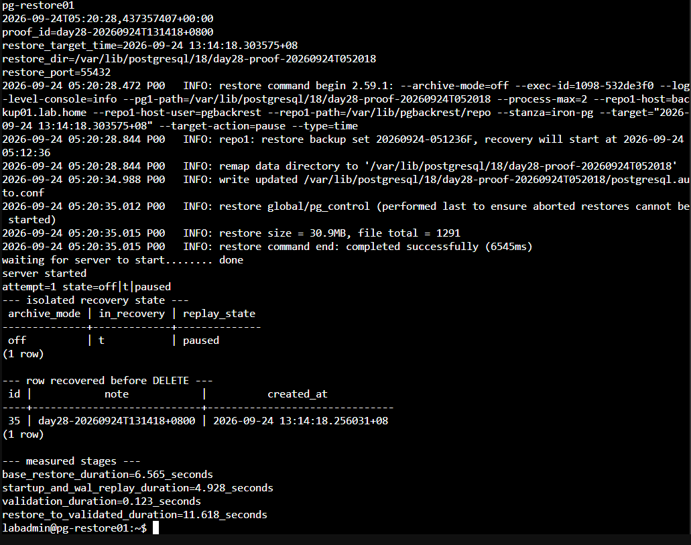

圖（十四）隔離 Restore Instance 維持 `archive_mode=off` 與 Paused Recovery，並找回相同 `PROOF_ID`。

預期可以查到相同的 `PROOF_ID`，表示這筆 `DELETE` 尚未在還原狀態中套用。此時 Restore Instance 位於 Recovery 並已暫停 WAL Replay，只提供唯讀驗證。驗證完成後立即停止，不要將它升級成 Primary，也不要把它加入正式流量：

```bash
sudo -u postgres /usr/lib/postgresql/18/bin/pg_ctl \
  -D "$RESTORE_DIR" \
  -m fast stop
```