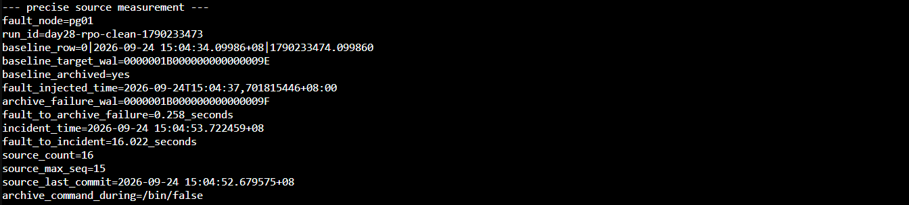
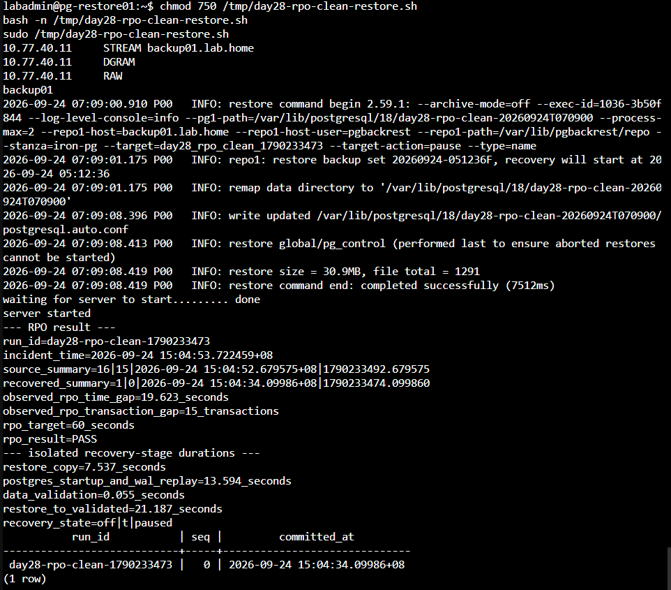
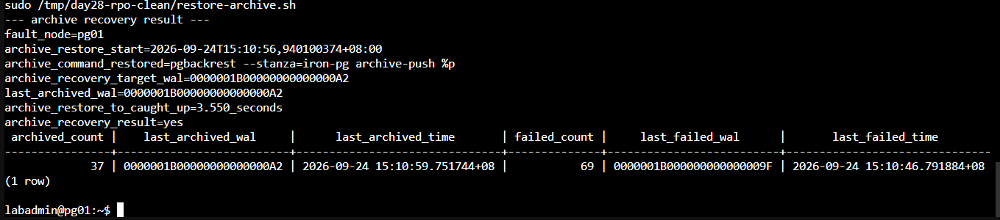
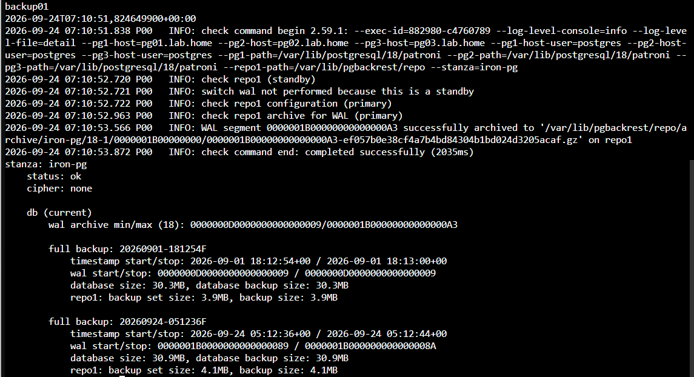

# Day 28 額外實作｜量測 WAL Archive 中斷時的 RPO

對應文章：[Day 28｜PostgreSQL 資料誤刪如何復原？使用 pgBackRest、WAL Archive 與 PITR 回到指定時間點](https://ithelp.ithome.com.tw/articles/10418150)

本文件接續 [Day 28｜PostgreSQL 資料誤刪如何復原？使用 pgBackRest、WAL Archive 與 PITR 回到指定時間點](./DAY28_pgBackRest_WAL與PITR.md)。主實作完成備份、WAL Archive 與指定時間 PITR；本額外實作建立受控的 Archive 中斷，量測事故發生時的資料缺口、隔離還原階段耗時，以及恢復 Archive 後追上 Repository 的時間。

本次測試把「基準 WAL 已封存」到「事故時間」放進同一支腳本，先驗證 Archive 停止前進，再產生測試交易，讓資料缺口只反映受控的 Archive 中斷。

本次同時取得三組彼此獨立的結果：

| 結果             | 起點與終點                                               | 用途                               |
| ---------------- | -------------------------------------------------------- | ---------------------------------- |
| RPO 資料缺口     | 事故時間 − Restore Instance 最後可見交易時間             | 與預先設定的 60 秒 RPO 比較        |
| 隔離還原階段耗時 | Restore 開始、檔案還原完成、WAL 重播到目標、資料驗證完成 | 提供災難復原分析；完整服務 RTO 另行量測 |
| Archive 恢復耗時 | 恢復 `archive_command` − 目標 WAL 完成封存               | 評估維運處置與 Repository 追趕時間 |

## 一、測試安全邊界

- 只在目前 Primary 執行來源端腳本。
- 測試期間不要執行 Switchover 或 Failover。
- 來源端腳本成功時會刻意保留 `archive_command=/bin/false`，直到隔離還原完成。
- 來源端腳本若中途失敗或收到中斷訊號，會自動重設 `archive_command`。
- pg-restore01 使用新的資料目錄與 TCP `55434`，不修改正式 Patroni Cluster。
- RPO 只比較資料時間與交易序號；Restore 耗時及 Archive 追趕耗時分開記錄。

## 二、確認開始條件

### 在任一 PostgreSQL 節點確認角色

```bash
sudo -u postgres patronictl \
  -c /etc/patroni/config.yml \
  list -e
```

記住目前顯示為 `Leader` 的節點，後續來源端與恢復 Archive 的命令都必須在同一台節點執行。開始時應為一台 Leader、兩台 `Replica / streaming`，Lag 為 0。

### 在 backup01 確認 Repository

```bash
hostnamectl --static
date --iso-8601=ns

sudo -u pgbackrest pgbackrest \
  --stanza=iron-pg \
  check

sudo -u pgbackrest pgbackrest \
  --stanza=iron-pg \
  info
```

只有 Check 成功且至少存在一份有效 Full Backup 時才繼續。

## 三、在目前 Primary 建立補測腳本

登入目前 Leader，建立腳本：

```bash
mkdir -p /tmp/day28-rpo-clean
nano /tmp/day28-rpo-clean/run-source.sh
```

貼入以下完整內容：

```bash
#!/usr/bin/env bash
set -Eeuo pipefail

RUN_DIR='/tmp/day28-rpo-clean'
SOURCE_ENV="$RUN_DIR/source.env"
WRITE_LOG="$RUN_DIR/writes.log"
RPO_TARGET_SECONDS='60'
EXPECTED_ARCHIVE_COMMAND='pgbackrest --stanza=iron-pg archive-push %p'
DAY28_RPO_RUN="day28-rpo-clean-$(date +%s)"
RESTORE_POINT_NAME="day28_rpo_clean_$(date +%s)"
FAULT_ACTIVE='no'
SOURCE_COMPLETE='no'

mkdir -p "$RUN_DIR"
rm -f "$SOURCE_ENV" "$WRITE_LOG"

restore_archive_after_error() {
  exit_code=$?

  if [ "$FAULT_ACTIVE" = 'yes' ] && \
     [ "$SOURCE_COMPLETE" != 'yes' ]; then
    printf '%s\n' \
      'ERROR: source measurement stopped early; restoring archive_command'

    sudo -u postgres psql \
      -X -d postgres -v ON_ERROR_STOP=1 \
      -c 'ALTER SYSTEM RESET archive_command;' \
      -c 'SELECT pg_reload_conf();' \
      >/dev/null || true
  fi

  exit "$exit_code"
}

trap restore_archive_after_error ERR INT TERM

FAULT_NODE="$(hostnamectl --static)"

IS_IN_RECOVERY="$(
  sudo -u postgres psql \
    -X -d postgres -Atqc \
    'SELECT pg_is_in_recovery();'
)"

if [ "$IS_IN_RECOVERY" != 'f' ]; then
  echo 'ERROR: this node is not the current Primary' >&2
  exit 1
fi

ARCHIVE_COMMAND_SOURCE="$(
  sudo -u postgres psql \
    -X -d postgres -Atqc \
    "SELECT coalesce(sourcefile, '')
     FROM pg_settings
     WHERE name = 'archive_command';"
)"

ARCHIVE_COMMAND_BEFORE="$(
  sudo -u postgres psql \
    -X -d postgres -Atqc \
    'SHOW archive_command;'
)"

if [[ "$ARCHIVE_COMMAND_SOURCE" == */postgresql.auto.conf ]]; then
  echo 'ERROR: archive_command already has an ALTER SYSTEM override' >&2
  exit 1
fi

if [ "$ARCHIVE_COMMAND_BEFORE" != \
     "$EXPECTED_ARCHIVE_COMMAND" ]; then
  echo 'ERROR: unexpected archive_command' >&2
  printf 'actual_archive_command=%s\n' "$ARCHIVE_COMMAND_BEFORE"
  exit 1
fi

sudo -u postgres psql \
  -X -d appdb -v ON_ERROR_STOP=1 \
  -P pager=off \
  -c "SET ROLE app_owner;
      CREATE TABLE IF NOT EXISTS app.rpo_probe(
        run_id text NOT NULL,
        seq integer NOT NULL,
        committed_at timestamptz NOT NULL
          DEFAULT clock_timestamp(),
        committed_epoch numeric NOT NULL
          DEFAULT extract(epoch FROM clock_timestamp()),
        PRIMARY KEY(run_id, seq)
      );
      RESET ROLE;" \
  >/dev/null

BASELINE_ROW="$(
  sudo -u postgres psql \
    -X -qAt -F '|' -d appdb -v ON_ERROR_STOP=1 \
    -c "SET ROLE app_owner;
        INSERT INTO app.rpo_probe(run_id, seq)
        VALUES ('$DAY28_RPO_RUN', 0)
        RETURNING seq, committed_at, committed_epoch;"
)"

RESTORE_POINT_LSN="$(
  sudo -u postgres psql \
    -X -d postgres -v ON_ERROR_STOP=1 -Atqc \
    "SELECT pg_create_restore_point('$RESTORE_POINT_NAME');"
)"

BASELINE_TARGET_WAL="$(
  sudo -u postgres psql \
    -X -d postgres -Atqc \
    "SELECT pg_walfile_name(pg_current_wal_lsn());"
)"

sudo -u postgres psql \
  -X -d postgres -Atqc \
  'SELECT pg_switch_wal();' \
  >/dev/null

BASELINE_ARCHIVED='no'
LAST_ARCHIVED_WAL=''

for attempt in $(seq 1 90); do
  LAST_ARCHIVED_WAL="$(
    sudo -u postgres psql \
      -X -d postgres -Atqc \
      "SELECT coalesce(last_archived_wal, '')
       FROM pg_stat_archiver;"
  )"

  if [[ "$LAST_ARCHIVED_WAL" == "$BASELINE_TARGET_WAL" || \
        "$LAST_ARCHIVED_WAL" > "$BASELINE_TARGET_WAL" ]]; then
    BASELINE_ARCHIVED='yes'
    break
  fi

  sleep 1
done

if [ "$BASELINE_ARCHIVED" != 'yes' ]; then
  echo 'ERROR: baseline WAL was not archived within 90 seconds' >&2
  exit 1
fi

BASELINE_ARCHIVED_EPOCH="$(date +%s.%N)"

FAILED_COUNT_BEFORE="$(
  sudo -u postgres psql \
    -X -d postgres -Atqc \
    'SELECT failed_count FROM pg_stat_archiver;'
)"

# 先把故障狀態交給 Trap 管理。即使 ALTER SYSTEM 或 Reload 失敗，
# RESET archive_command 也只會移除可能存在的本次 Override。
FAULT_ACTIVE='yes'

sudo -u postgres psql \
  -X -d postgres -v ON_ERROR_STOP=1 \
  -c "ALTER SYSTEM SET archive_command = '/bin/false';" \
  -c 'SELECT pg_reload_conf();' \
  >/dev/null

sleep 2

ARCHIVE_COMMAND_DURING="$(
  sudo -u postgres psql \
    -X -d postgres -Atqc \
    'SHOW archive_command;'
)"

if [ "$ARCHIVE_COMMAND_DURING" != '/bin/false' ]; then
  echo 'ERROR: archive fault was not activated' >&2
  exit 1
fi

FAULT_INJECTED_EPOCH="$(date +%s.%N)"
FAULT_INJECTED_TIME="$(date --iso-8601=ns)"

sudo -u postgres psql \
  -X -d postgres -Atqc \
  'SELECT pg_switch_wal();' \
  >/dev/null

ARCHIVE_FAILURE_OBSERVED='no'
ARCHIVE_FAILURE_EPOCH=''
ARCHIVE_FAILURE_WAL=''
FAILED_COUNT_AFTER=''

for attempt in $(seq 1 90); do
  ARCHIVER_FAILURE_STATE="$(
    sudo -u postgres psql \
      -X -d postgres -At -F '|' \
      -c "SELECT failed_count,
                 coalesce(last_failed_wal, ''),
                 coalesce(extract(epoch FROM last_failed_time), 0)
          FROM pg_stat_archiver;"
  )"

  IFS='|' read -r \
    FAILED_COUNT_AFTER \
    ARCHIVE_FAILURE_WAL \
    ARCHIVE_FAILURE_EPOCH \
    <<< "$ARCHIVER_FAILURE_STATE"

  if [ "$FAILED_COUNT_AFTER" -gt "$FAILED_COUNT_BEFORE" ]; then
    ARCHIVE_FAILURE_OBSERVED='yes'
    break
  fi

  sleep 1
done

if [ "$ARCHIVE_FAILURE_OBSERVED" != 'yes' ]; then
  echo 'ERROR: pg_stat_archiver did not record the injected fault' >&2
  exit 1
fi

for seq in $(seq 1 15); do
  sudo -u postgres psql \
    -X -qAt -F '|' -d appdb -v ON_ERROR_STOP=1 \
    -c "SET ROLE app_owner;
        INSERT INTO app.rpo_probe(run_id, seq)
        VALUES ('$DAY28_RPO_RUN', $seq)
        RETURNING seq, committed_at, committed_epoch;"
  sleep 1
done | tee "$WRITE_LOG"

INCIDENT_RECORD="$(
  sudo -u postgres psql \
    -X -d postgres -At -F '|' \
    -c "WITH captured AS (
          SELECT clock_timestamp() AS ts
        )
        SELECT ts, extract(epoch FROM ts)
        FROM captured;"
)"

IFS='|' read -r INCIDENT_TIME INCIDENT_EPOCH \
  <<< "$INCIDENT_RECORD"

SOURCE_SUMMARY="$(
  sudo -u postgres psql \
    -X -d appdb -At -F '|' \
    -c "SELECT count(*),
               max(seq),
               max(committed_at),
               max(committed_epoch)
        FROM app.rpo_probe
        WHERE run_id = '$DAY28_RPO_RUN';"
)"

IFS='|' read -r \
  SOURCE_COUNT \
  SOURCE_MAX_SEQ \
  SOURCE_LAST_TIME \
  SOURCE_LAST_EPOCH \
  <<< "$SOURCE_SUMMARY"

if [ "$SOURCE_COUNT" != '16' ] || \
   [ "$SOURCE_MAX_SEQ" != '15' ]; then
  echo 'ERROR: source transaction set is incomplete' >&2
  exit 1
fi

{
  printf 'FAULT_NODE=%q\n' "$FAULT_NODE"
  printf 'DAY28_RPO_RUN=%q\n' "$DAY28_RPO_RUN"
  printf 'RESTORE_POINT_NAME=%q\n' "$RESTORE_POINT_NAME"
  printf 'RESTORE_POINT_LSN=%q\n' "$RESTORE_POINT_LSN"
  printf 'RPO_TARGET_SECONDS=%q\n' "$RPO_TARGET_SECONDS"
  printf 'BASELINE_ROW=%q\n' "$BASELINE_ROW"
  printf 'BASELINE_TARGET_WAL=%q\n' "$BASELINE_TARGET_WAL"
  printf 'BASELINE_ARCHIVED_EPOCH=%q\n' "$BASELINE_ARCHIVED_EPOCH"
  printf 'FAULT_INJECTED_TIME=%q\n' "$FAULT_INJECTED_TIME"
  printf 'FAULT_INJECTED_EPOCH=%q\n' "$FAULT_INJECTED_EPOCH"
  printf 'ARCHIVE_FAILURE_EPOCH=%q\n' "$ARCHIVE_FAILURE_EPOCH"
  printf 'ARCHIVE_FAILURE_WAL=%q\n' "$ARCHIVE_FAILURE_WAL"
  printf 'INCIDENT_TIME=%q\n' "$INCIDENT_TIME"
  printf 'INCIDENT_EPOCH=%q\n' "$INCIDENT_EPOCH"
  printf 'SOURCE_SUMMARY=%q\n' "$SOURCE_SUMMARY"
} | tee "$SOURCE_ENV" >/dev/null

FAULT_TO_FAILURE_SECONDS="$(
  awk \
    -v start="$FAULT_INJECTED_EPOCH" \
    -v finish="$ARCHIVE_FAILURE_EPOCH" \
    'BEGIN { printf "%.3f", finish-start }'
)"

FAULT_TO_INCIDENT_SECONDS="$(
  awk \
    -v start="$FAULT_INJECTED_EPOCH" \
    -v finish="$INCIDENT_EPOCH" \
    'BEGIN { printf "%.3f", finish-start }'
)"

SOURCE_COMPLETE='yes'

printf '%s\n' '--- precise source measurement ---'
printf 'fault_node=%s\n' "$FAULT_NODE"
printf 'run_id=%s\n' "$DAY28_RPO_RUN"
printf 'baseline_row=%s\n' "$BASELINE_ROW"
printf 'baseline_target_wal=%s\n' "$BASELINE_TARGET_WAL"
printf 'baseline_archived=yes\n'
printf 'fault_injected_time=%s\n' "$FAULT_INJECTED_TIME"
printf 'archive_failure_wal=%s\n' "$ARCHIVE_FAILURE_WAL"
printf 'fault_to_archive_failure=%s_seconds\n' \
  "$FAULT_TO_FAILURE_SECONDS"
printf 'incident_time=%s\n' "$INCIDENT_TIME"
printf 'fault_to_incident=%s_seconds\n' \
  "$FAULT_TO_INCIDENT_SECONDS"
printf 'source_count=%s\n' "$SOURCE_COUNT"
printf 'source_max_seq=%s\n' "$SOURCE_MAX_SEQ"
printf 'source_last_commit=%s\n' "$SOURCE_LAST_TIME"
printf 'archive_command_during=%s\n' "$ARCHIVE_COMMAND_DURING"
printf 'source_measurement=READY_FOR_ISOLATED_RESTORE\n'

printf '%s\n' '--- transfer token ---'
base64 -w 0 "$SOURCE_ENV"
printf '\n'
```

儲存後檢查並執行：

```bash
chmod 750 /tmp/day28-rpo-clean/run-source.sh
bash -n /tmp/day28-rpo-clean/run-source.sh
sudo /tmp/day28-rpo-clean/run-source.sh
```

完成後先不要關閉這個終端，也不要恢復 `archive_command`。複製輸出最後一行的 Base64 Transfer Token。

下圖保留本次來源端輸出，可核對基準 WAL、Archive 故障成立時間、事故時間、交易數量與故障期間的 `archive_command`。



圖（一）基準 WAL `9E` 已封存，Archive 故障於 0.258 秒後留下紀錄；來源端在 16.022 秒後完成 `seq=1～15` 並固定事故時間。

## 四、在 pg-restore01 還原並計算資料缺口

先把上一節的 Transfer Token 填入：

```bash
SOURCE_ENV_B64='請貼上來源端腳本輸出的完整 Base64 Transfer Token'

SOURCE_ENV_FILE='/tmp/day28-rpo-clean-source.env'

unset \
  FAULT_NODE \
  DAY28_RPO_RUN \
  RESTORE_POINT_NAME \
  RESTORE_POINT_LSN \
  RPO_TARGET_SECONDS \
  BASELINE_ROW \
  BASELINE_TARGET_WAL \
  BASELINE_ARCHIVED_EPOCH \
  FAULT_INJECTED_TIME \
  FAULT_INJECTED_EPOCH \
  ARCHIVE_FAILURE_EPOCH \
  ARCHIVE_FAILURE_WAL \
  INCIDENT_TIME \
  INCIDENT_EPOCH \
  SOURCE_SUMMARY

sudo install \
  -o "$(id -un)" \
  -g "$(id -gn)" \
  -m 600 \
  /dev/null \
  "$SOURCE_ENV_FILE"

printf '%s' "$SOURCE_ENV_B64" | \
  base64 -d > "$SOURCE_ENV_FILE"

source "$SOURCE_ENV_FILE"

printf 'fault_node=%s\n' "$FAULT_NODE"
printf 'run_id=%s\n' "$DAY28_RPO_RUN"
printf 'restore_point=%s\n' "$RESTORE_POINT_NAME"
printf 'incident_time=%s\n' "$INCIDENT_TIME"
printf 'source_summary=%s\n' "$SOURCE_SUMMARY"
```

輸出必須是本次 `day28-rpo-clean-*` 樣本。若出現舊的 `day28-rpo-*` Run ID，表示環境檔沒有載入成功，先停止，不要執行 Restore。

建立補測腳本：

```bash
nano /tmp/day28-rpo-clean-restore.sh
```

貼入以下完整內容：

```bash
#!/usr/bin/env bash
set -Eeuo pipefail

source /tmp/day28-rpo-clean-source.env

RESTORE_PORT='55434'
RESTORE_DIR="/var/lib/postgresql/18/day28-rpo-clean-$(date +%Y%m%dT%H%M%S)"
RESULT_ENV='/tmp/day28-rpo-clean-result.env'

if ss -lnt | grep -qE \
   "127\\.0\\.0\\.1:${RESTORE_PORT}([[:space:]]|$)"; then
  echo "ERROR: TCP $RESTORE_PORT is already in use" >&2
  exit 1
fi

getent ahostsv4 backup01.lab.home

sudo -u postgres ssh \
  -o BatchMode=yes \
  -o ConnectTimeout=5 \
  pgbackrest@backup01.lab.home \
  'hostnamectl --static'

sudo -u postgres pgbackrest \
  --stanza=iron-pg \
  info \
  >/dev/null

sudo -u postgres test ! -e "$RESTORE_DIR"
sudo -u postgres install -d -m 700 "$RESTORE_DIR"

RESTORE_START_EPOCH="$(date +%s.%N)"

sudo -u postgres pgbackrest \
  --stanza=iron-pg \
  --pg1-path="$RESTORE_DIR" \
  --type=name \
  --target="$RESTORE_POINT_NAME" \
  --target-action=pause \
  --archive-mode=off \
  restore

RESTORE_END_EPOCH="$(date +%s.%N)"
PG_START_EPOCH="$(date +%s.%N)"

sudo -u postgres /usr/lib/postgresql/18/bin/pg_ctl \
  -D "$RESTORE_DIR" \
  -l "$RESTORE_DIR/restore-startup.log" \
  -o "-p $RESTORE_PORT -c listen_addresses=127.0.0.1 -c ssl=off -c archive_mode=off -c hba_file=$RESTORE_DIR/pg_hba.conf -c ident_file=$RESTORE_DIR/pg_ident.conf" \
  start

TARGET_REACHED='no'
RECOVERY_STATE=''

for attempt in $(seq 1 90); do
  RECOVERY_STATE="$(
    sudo -u postgres psql \
      -p "$RESTORE_PORT" -d postgres -Atqc \
      "SELECT current_setting('archive_mode'),
              pg_is_in_recovery(),
              pg_get_wal_replay_pause_state();" \
      2>/dev/null || true
  )"

  if [ "$RECOVERY_STATE" = 'off|t|paused' ]; then
    TARGET_REACHED='yes'
    break
  fi

  sleep 1
done

if [ "$TARGET_REACHED" != 'yes' ]; then
  sudo -u postgres tail -n 100 \
    "$RESTORE_DIR/restore-startup.log"
  echo 'ERROR: PITR target was not reached within 90 seconds' >&2
  exit 1
fi

TARGET_REACHED_EPOCH="$(date +%s.%N)"

RECOVERED_SUMMARY="$(
  sudo -u postgres psql \
    -p "$RESTORE_PORT" -X -d appdb -At -F '|' \
    -c "SELECT count(*),
               max(seq),
               max(committed_at),
               max(committed_epoch)
        FROM app.rpo_probe
        WHERE run_id = '$DAY28_RPO_RUN';"
)"

VALIDATION_END_EPOCH="$(date +%s.%N)"

SOURCE_SUMMARY_NORMALIZED="$(
  printf '%s' "$SOURCE_SUMMARY" | tr -d '\\'
)"

IFS='|' read -r \
  SOURCE_COUNT \
  SOURCE_MAX_SEQ \
  SOURCE_LAST_TIME \
  SOURCE_LAST_EPOCH \
  <<< "$SOURCE_SUMMARY_NORMALIZED"

IFS='|' read -r \
  RECOVERED_COUNT \
  RECOVERED_MAX_SEQ \
  RECOVERED_LAST_TIME \
  RECOVERED_LAST_EPOCH \
  <<< "$RECOVERED_SUMMARY"

if [ "$SOURCE_COUNT" != '16' ] || \
   [ "$SOURCE_MAX_SEQ" != '15' ] || \
   [ "$RECOVERED_COUNT" != '1' ] || \
   [ "$RECOVERED_MAX_SEQ" != '0' ]; then
  RESULT='INVALID_SAMPLE'
else
  RESULT="$(
    awk \
      -v incident="$INCIDENT_EPOCH" \
      -v recovered="$RECOVERED_LAST_EPOCH" \
      -v target="$RPO_TARGET_SECONDS" \
      'BEGIN {
        if ((incident-recovered) <= target) print "PASS"
        else print "FAIL"
      }'
  )"
fi

RPO_TIME_GAP="$(
  awk \
    -v incident="$INCIDENT_EPOCH" \
    -v recovered="$RECOVERED_LAST_EPOCH" \
    'BEGIN { printf "%.3f", incident-recovered }'
)"

RPO_TRANSACTION_GAP="$((
  SOURCE_MAX_SEQ - RECOVERED_MAX_SEQ
))"

RESTORE_COPY_DURATION="$(
  awk \
    -v start="$RESTORE_START_EPOCH" \
    -v finish="$RESTORE_END_EPOCH" \
    'BEGIN { printf "%.3f", finish-start }'
)"

STARTUP_REPLAY_DURATION="$(
  awk \
    -v start="$PG_START_EPOCH" \
    -v finish="$TARGET_REACHED_EPOCH" \
    'BEGIN { printf "%.3f", finish-start }'
)"

VALIDATION_DURATION="$(
  awk \
    -v start="$TARGET_REACHED_EPOCH" \
    -v finish="$VALIDATION_END_EPOCH" \
    'BEGIN { printf "%.3f", finish-start }'
)"

RESTORE_TO_VALIDATED_DURATION="$(
  awk \
    -v start="$RESTORE_START_EPOCH" \
    -v finish="$VALIDATION_END_EPOCH" \
    'BEGIN { printf "%.3f", finish-start }'
)"

{
  printf 'RESTORE_DIR=%q\n' "$RESTORE_DIR"
  printf 'RESTORE_PORT=%q\n' "$RESTORE_PORT"
  printf 'RPO_TIME_GAP=%q\n' "$RPO_TIME_GAP"
  printf 'RPO_TRANSACTION_GAP=%q\n' "$RPO_TRANSACTION_GAP"
  printf 'RPO_RESULT=%q\n' "$RESULT"
  printf 'RESTORE_COPY_DURATION=%q\n' \
    "$RESTORE_COPY_DURATION"
  printf 'STARTUP_REPLAY_DURATION=%q\n' \
    "$STARTUP_REPLAY_DURATION"
  printf 'VALIDATION_DURATION=%q\n' \
    "$VALIDATION_DURATION"
  printf 'RESTORE_TO_VALIDATED_DURATION=%q\n' \
    "$RESTORE_TO_VALIDATED_DURATION"
} | sudo tee "$RESULT_ENV" >/dev/null

printf '%s\n' '--- RPO result ---'
printf 'run_id=%s\n' "$DAY28_RPO_RUN"
printf 'incident_time=%s\n' "$INCIDENT_TIME"
printf 'source_summary=%s\n' "$SOURCE_SUMMARY_NORMALIZED"
printf 'recovered_summary=%s\n' "$RECOVERED_SUMMARY"
printf 'observed_rpo_time_gap=%s_seconds\n' "$RPO_TIME_GAP"
printf 'observed_rpo_transaction_gap=%s_transactions\n' \
  "$RPO_TRANSACTION_GAP"
printf 'rpo_target=%s_seconds\n' "$RPO_TARGET_SECONDS"
printf 'rpo_result=%s\n' "$RESULT"

printf '%s\n' '--- isolated recovery-stage durations ---'
printf 'restore_copy=%s_seconds\n' "$RESTORE_COPY_DURATION"
printf 'postgres_startup_and_wal_replay=%s_seconds\n' \
  "$STARTUP_REPLAY_DURATION"
printf 'data_validation=%s_seconds\n' "$VALIDATION_DURATION"
printf 'restore_to_validated=%s_seconds\n' \
  "$RESTORE_TO_VALIDATED_DURATION"
printf 'recovery_state=%s\n' "$RECOVERY_STATE"

sudo -u postgres psql \
  -p "$RESTORE_PORT" -X -d appdb -P pager=off \
  -c "SELECT run_id, seq, committed_at
      FROM app.rpo_probe
      WHERE run_id = '$DAY28_RPO_RUN'
      ORDER BY seq;"
```

儲存後檢查並執行：

```bash
chmod 750 /tmp/day28-rpo-clean-restore.sh
bash -n /tmp/day28-rpo-clean-restore.sh
sudo /tmp/day28-rpo-clean-restore.sh
```

下圖將來源端與 Restore Instance 的摘要放在一起，並列出資料缺口、60 秒目標、判讀結果與各還原階段耗時。



圖（二）正式 Cluster 保存 16 筆測試資料，Restore Instance 只看見 `seq=0`。時間缺口為 19.623 秒、交易缺口為 15 筆，低於預先設定的 60 秒 RPO。

## 五、停止隔離 Instance

在 pg-restore01 執行：

```bash
source /tmp/day28-rpo-clean-result.env

sudo -u postgres /usr/lib/postgresql/18/bin/pg_ctl \
  -D "$RESTORE_DIR" \
  -m fast \
  stop
```

確認 TCP `55434` 已釋放：

```bash
ss -lnt | grep -E '127\.0\.0\.1:55434([[:space:]]|$)' || \
  echo 'restore_instance_stopped=yes'
```

## 六、在原 Primary 恢復 Archive 並量測追趕時間

回到來源端腳本顯示的 `fault_node`。先確認該節點目前是 Primary：

```bash
source /tmp/day28-rpo-clean/source.env

hostnamectl --static

sudo -u postgres psql \
  -X -d postgres -Atqc \
  'SELECT pg_is_in_recovery();'

sudo -u postgres psql \
  -X -d postgres -Atqc \
  'SHOW archive_command;'
```

主機名稱必須等於 `FAULT_NODE`，`pg_is_in_recovery()` 必須為 `f`，`archive_command` 必須維持 `/bin/false`。任一條件不符就先停止，不要直接執行後續命令。

建立恢復腳本：

```bash
nano /tmp/day28-rpo-clean/restore-archive.sh
```

貼入以下完整內容：

```bash
#!/usr/bin/env bash
set -Eeuo pipefail

source /tmp/day28-rpo-clean/source.env

EXPECTED_ARCHIVE_COMMAND='pgbackrest --stanza=iron-pg archive-push %p'
CURRENT_NODE="$(hostnamectl --static)"

if [ "$CURRENT_NODE" != "$FAULT_NODE" ]; then
  echo 'ERROR: run this script on the original fault node' >&2
  exit 1
fi

IS_IN_RECOVERY="$(
  sudo -u postgres psql \
    -X -d postgres -Atqc \
    'SELECT pg_is_in_recovery();'
)"

if [ "$IS_IN_RECOVERY" != 'f' ]; then
  echo 'ERROR: the original fault node is no longer Primary' >&2
  echo 'Restoring archive_command on this node; the sample is invalid.' >&2

  sudo -u postgres psql \
    -X -d postgres -v ON_ERROR_STOP=1 \
    -c 'ALTER SYSTEM RESET archive_command;' \
    -c 'SELECT pg_reload_conf();' \
    >/dev/null

  printf 'archive_command_after_role_change=%s\n' "$(
    sudo -u postgres psql \
      -X -d postgres -Atqc \
      'SHOW archive_command;'
  )"
  printf 'measurement_result=INVALID_ROLE_CHANGE\n'
  exit 1
fi

ARCHIVE_RESTORE_START_EPOCH="$(date +%s.%N)"
ARCHIVE_RESTORE_START_TIME="$(date --iso-8601=ns)"

sudo -u postgres psql \
  -X -d postgres -v ON_ERROR_STOP=1 \
  -c 'ALTER SYSTEM RESET archive_command;' \
  -c 'SELECT pg_reload_conf();' \
  >/dev/null

sleep 2

ARCHIVE_COMMAND_AFTER="$(
  sudo -u postgres psql \
    -X -d postgres -Atqc \
    'SHOW archive_command;'
)"

if [ "$ARCHIVE_COMMAND_AFTER" != \
     "$EXPECTED_ARCHIVE_COMMAND" ]; then
  echo 'ERROR: archive_command was not restored' >&2
  exit 1
fi

ARCHIVE_RECOVERY_POINT="day28_rpo_recovery_$(date +%s)"

sudo -u postgres psql \
  -X -d postgres -v ON_ERROR_STOP=1 -Atqc \
  "SELECT pg_create_restore_point('$ARCHIVE_RECOVERY_POINT');" \
  >/dev/null

ARCHIVE_RECOVERY_TARGET_WAL="$(
  sudo -u postgres psql \
    -X -d postgres -Atqc \
    "SELECT pg_walfile_name(pg_current_wal_lsn());"
)"

sudo -u postgres psql \
  -X -d postgres -Atqc \
  'SELECT pg_switch_wal();' \
  >/dev/null

ARCHIVE_CAUGHT_UP='no'
LAST_ARCHIVED_WAL=''

for attempt in $(seq 1 180); do
  LAST_ARCHIVED_WAL="$(
    sudo -u postgres psql \
      -X -d postgres -Atqc \
      "SELECT coalesce(last_archived_wal, '')
       FROM pg_stat_archiver;"
  )"

  if [[ "$LAST_ARCHIVED_WAL" == \
        "$ARCHIVE_RECOVERY_TARGET_WAL" || \
        "$LAST_ARCHIVED_WAL" > \
        "$ARCHIVE_RECOVERY_TARGET_WAL" ]]; then
    ARCHIVE_CAUGHT_UP='yes'
    break
  fi

  sleep 1
done

if [ "$ARCHIVE_CAUGHT_UP" != 'yes' ]; then
  echo 'ERROR: WAL Archive did not catch up within 180 seconds' >&2
  exit 1
fi

ARCHIVE_CAUGHT_UP_EPOCH="$(date +%s.%N)"

ARCHIVE_RECOVERY_DURATION="$(
  awk \
    -v start="$ARCHIVE_RESTORE_START_EPOCH" \
    -v finish="$ARCHIVE_CAUGHT_UP_EPOCH" \
    'BEGIN { printf "%.3f", finish-start }'
)"

printf '%s\n' '--- archive recovery result ---'
printf 'fault_node=%s\n' "$FAULT_NODE"
printf 'archive_restore_start=%s\n' \
  "$ARCHIVE_RESTORE_START_TIME"
printf 'archive_command_restored=%s\n' \
  "$ARCHIVE_COMMAND_AFTER"
printf 'archive_recovery_target_wal=%s\n' \
  "$ARCHIVE_RECOVERY_TARGET_WAL"
printf 'last_archived_wal=%s\n' "$LAST_ARCHIVED_WAL"
printf 'archive_restore_to_caught_up=%s_seconds\n' \
  "$ARCHIVE_RECOVERY_DURATION"
printf 'archive_recovery_result=%s\n' "$ARCHIVE_CAUGHT_UP"

sudo -u postgres psql \
  -X -d postgres -P pager=off \
  -c "SELECT archived_count,
             last_archived_wal,
             last_archived_time,
             failed_count,
             last_failed_wal,
             last_failed_time
      FROM pg_stat_archiver;"
```

儲存後檢查並執行：

```bash
chmod 750 /tmp/day28-rpo-clean/restore-archive.sh
bash -n /tmp/day28-rpo-clean/restore-archive.sh
sudo /tmp/day28-rpo-clean/restore-archive.sh
```

下圖顯示 pgBackRest `archive-push` 已恢復、`last_archived_wal` 到達目標 WAL，以及 Archive 追趕耗時。



圖（三）恢復 pgBackRest `archive-push` 後，`last_archived_wal` 在 3.550 秒內到達目標 WAL `A2`。

## 七、在 backup01 完成最後檢查

```bash
hostnamectl --static
date --iso-8601=ns

sudo -u pgbackrest pgbackrest \
  --stanza=iron-pg \
  check

sudo -u pgbackrest pgbackrest \
  --stanza=iron-pg \
  info
```

最後在 backup01 重新執行 Check 與 Info，確認 `iron-pg` Stanza 和 Archived WAL 狀態。



圖（四）pgBackRest Check 成功、`iron-pg` Stanza 狀態為 `ok`，Archived WAL 已前進至 `A3`。

## 八、判讀規則

| 結果                           | 判讀方式                                                                           |
| ------------------------------ | ---------------------------------------------------------------------------------- |
| `rpo_result=PASS`              | 本次受控 Archive 中斷樣本的資料時間缺口小於或等於 60 秒                            |
| `rpo_result=FAIL`              | 本次受控 Archive 中斷樣本的資料時間缺口超過 60 秒                                  |
| `rpo_result=INVALID_SAMPLE`    | 來源端或還原端交易集合不符合預期，本次樣本不產生 RPO 結論                          |
| `fault_to_archive_failure`     | PostgreSQL Archiver 從注入故障到留下失敗紀錄的時間                                 |
| `restore_to_validated`         | 隔離還原開始到資料可驗證的時間；完整 RTO 還需量測事故判斷、核准及重新開放流量      |
| `archive_restore_to_caught_up` | 恢復 Archive 後追上明確 WAL 邊界的時間                                             |

資料傳遞與登入 pg-restore01 所花的時間不會進入 RPO 計算。RPO 的事故時間已由來源端腳本在完成 15 筆交易後固定記錄；隔離還原可以稍後執行。

## 九、實測結果

| RPO 觀察項目 | 實測結果 |
|---|---:|
| RPO 目標 | 60 秒 |
| 故障注入至 Archive 留下失敗紀錄 | 0.258 秒 |
| 故障注入至模擬事故 | 16.022 秒 |
| 最後可復原測試交易 | 2026-09-24 15:04:34.099860+08 |
| 模擬事故時間 | 2026-09-24 15:04:53.722459+08 |
| 正式 Cluster／Restore Instance 最大序號 | 15／0 |
| 觀察到的時間缺口 | 19.623 秒 |
| 觀察到的交易缺口 | 15 筆 |
| RPO 判讀 | PASS |

本次 PASS 代表約 16 秒的受控 Archive 中斷樣本符合 60 秒目標。Archive 持續停止時，Repository 的復原邊界也會持續落後；監控、告警與修復流程要在 RPO 用盡前完成處置。

| 隔離還原階段 | 實測時間 |
|---|---:|
| pgBackRest 還原檔案 | 7.537 秒 |
| PostgreSQL 啟動並重播 WAL 至命名還原點 | 13.594 秒 |
| 查詢並驗證資料 | 0.055 秒 |
| 從開始 Restore 到資料驗證完成 | 21.187 秒 |

21.187 秒是隔離 Restore、WAL 重播與資料驗證的階段耗時。完整服務 RTO 還要量測事故判斷、目標選擇、人工核准及重新開放流量。

恢復 `archive_command` 後，`last_archived_wal` 在 3.550 秒內到達目標 WAL `A2`；backup01 隨後完成 pgBackRest Check，Stanza 狀態為 `ok`，Archived WAL 前進至 `A3`。
