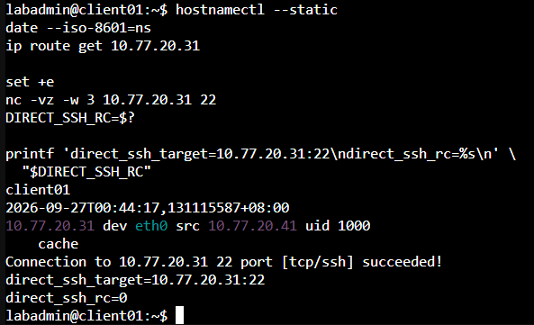
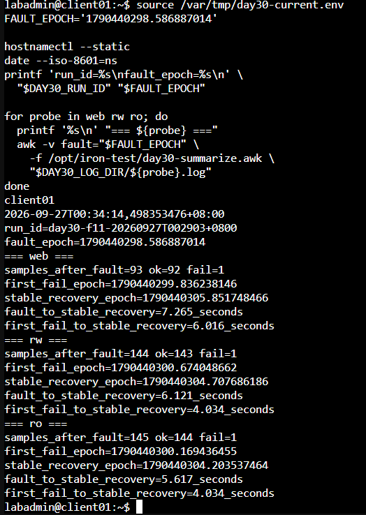
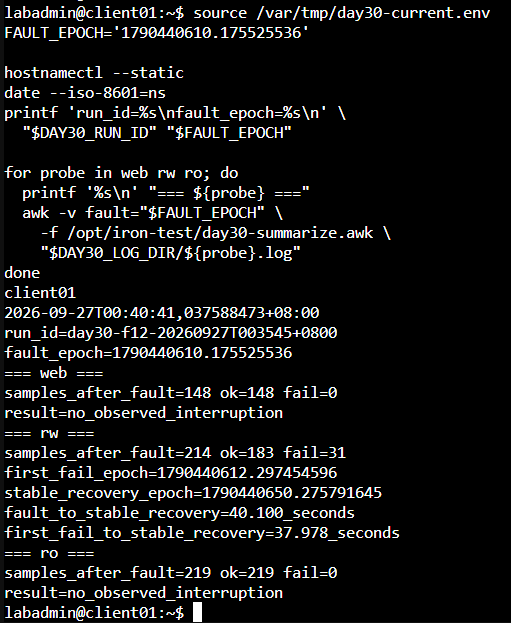
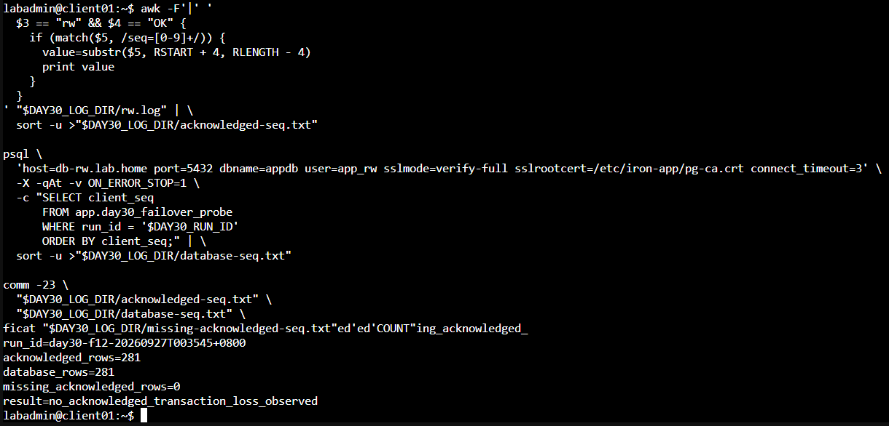

# Day 30｜最終驗收：用 Game Day 檢查安全邊界、服務切換與資料復原

對應文章：[Day 30｜最終驗收：用 Game Day 檢查安全邊界、服務切換與資料復原](https://ithelp.ithome.com.tw/users/20183351/ironman/9461)

本系列 Day 01～30 的實際結果、證據代號與 PASS／FAIL 另存於 [三十天驗收結果](../../08_三十天驗收結果.md)。讀者執行本文件時應在空白表格填入自己的環境、時間與結果。

Game Day 使用相同 Client Probe、共同時間基準與回復條件，一次注入一項主要故障，逐項驗證每一層的責任與限制。

## 演練範圍與排程

本文件保留 Scenario A～I，方便日後執行完整回歸。Day 30 正文新增證據的核心項目為 Scenario A 的 A06「同 VLAN 直接 SSH」、Scenario C 的 C03「Proxy VM 故障」，以及 Scenario D 的 D02「PostgreSQL Primary VM 故障」；其餘情境可以沿用前幾日證據，或在完整年度 Game Day、架構變更及缺口複測時執行。

若只要重現正文新增的三項測試與量化結果，可以直接使用 [Day 30 額外實作｜核心 Game Day 端到端量測](./DAY30_額外實作_核心GameDay量測.md)。

演練採用固定週期加變更觸發。下表是本環境的建議起點，實際週期仍要依服務風險、法規、業務活動與團隊能力核准：

| 驗證範圍 | 建議起始週期 | 變更觸發 |
|---|---|---|
| 連線、角色與權限回歸 | 每次相關設定或版本變更 | 防火牆、VPN、憑證、帳號與代理規則變更 |
| Proxy、Primary、etcd 等單一元件切換 | 每季或每半年 | 拓樸、容量、版本、切換參數與監控規則變更 |
| Backup、WAL Archive、Restore 與資料一致性 | 每季 | Repository、金鑰、保留政策或資料量明顯改變 |
| 完整 Scenario A～I | 至少每年 | 重大事故、Runbook、負責人或關鍵供應商變更 |

失敗項目在修正後安排複測。正式執行前建立排程紀錄：

| 欄位 | 本次填寫 |
|---|---|
| Exercise ID／日期 |  |
| 服務流程與重要性 |  |
| 演練負責人／核准人 |  |
| 執行範圍 | 核心 A06、C03、D02／指定 Scenario／完整 A～I |
| 核准時段與影響範圍 |  |
| RTO／RPO |  |
| 負載與資料量基準 |  |
| 停止條件與回復負責人 |  |
| 證據保存位置 |  |
| 改善項目、負責人與期限 |  |
| 下一次演練日期 |  |

## 本日操作順序

1. 從管理電腦、client01 與 monitor01 完成開始前檢查，所有服務必須先回到健康基準。
2. 先確認參與記錄的主機時間同步，再啟動持續 Web／SQL Probe。
3. Day 30 核心驗收執行 A06、C03、D02；完整回歸才依 Scenario A～I 順序一次執行一個測試。每次先記錄預期結果，再操作指定目標。
4. 從 client01 記錄使用者視角，從 monitor01 記錄告警，從目標與存活節點收集 Log。
5. 每個 Scenario 都必須完成回復與健康確認，才能開始下一個 Scenario。
6. 全部完成後才做最終資料一致性、備份、告警與殘留風險整理。

不要同時停止多個元件來節省時間。多重故障會讓中斷原因無法歸屬，也可能超出本 Lab 的復原能力。

## 1. 開始條件

**操作位置：管理電腦統籌。PVE／Ceph、OPNsense、etcd／Patroni、Proxy／App 與監控狀態分別到對應節點確認。**

開始前逐項填入 `PASS`、`FAIL`、`證據不足` 或 `未執行`。任何會影響故障歸因的項目未達 `PASS` 時，先處理基準問題再注入故障。

| ID | 開始條件 | 實際結果 | 狀態 | 證據位置 |
|---|---|---|---|---|
| P01 | 已公告測試窗口，沒有正式使用者流量 |  |  |  |
| P02 | PVE Console、L0 Rescue 與 OPNsense Console 可用 |  |  |  |
| P03 | pve01～pve03 的 Default Route 為 `10.77.10.1`，舊 `vmbr0` 沒有 Default Gateway |  |  |  |
| P04 | OPNsense 可觀察並依政策處理 PVE 對外流量 |  |  |  |
| P05 | PVE 3/3 Quorate，Ceph 沒有 Recovery／Backfill |  |  |  |
| P06 | etcd 3/3 Healthy，Patroni 為一台 Leader、兩台 Replica |  |  |  |
| P07 | 兩台 Proxy、三組 VIP 與兩台 App 正常 |  |  |  |
| P08 | Cloudflare Zone、Full (strict) 與 Proxied Record 正常 |  |  |  |
| P09 | Origin 443 只允許 Cloudflare 來源，公開 HTTPS 正常 |  |  |  |
| P10 | pgBackRest 最新 Backup 與 WAL Archive 正常 |  |  |  |
| P11 | Prometheus Targets、Alertmanager Readiness 與路由正常 |  |  |  |
| P12 | ca01 Health 正常，服務憑證尚未進入 30 天到期區間 |  |  |  |
| P13 | 所有參與量測的主機具有可比較的時間基準 |  |  |  |

下列命令不能放在同一台主機全部執行。依操作節點分別保存基準。

在任一台 PVE Cluster Node：

```bash
pvecm status
ceph -s
ha-manager status
```

在 pg01：

```bash
sudo -u postgres patronictl \
  -c /etc/patroni/config.yml \
  list -e

etcdctl_tls() {
  sudo -u etcd env \
    ETCDCTL_API=3 \
    ETCDCTL_ENDPOINTS='https://10.77.30.11:2379,https://10.77.30.12:2379,https://10.77.30.13:2379' \
    ETCDCTL_CACERT='/etc/etcd/tls/ca.crt' \
    ETCDCTL_CERT='/etc/etcd/tls/node.crt' \
    ETCDCTL_KEY='/etc/etcd/tls/node.key' \
    etcdctl "$@"
}

etcdctl_tls endpoint status --cluster -w table
etcdctl_tls endpoint health --cluster
```

在 backup01：

```bash
sudo -u pgbackrest pgbackrest --stanza=iron-pg info
sudo -u pgbackrest pgbackrest --stanza=iron-pg check
```

在 proxy01、proxy02 各執行一次：

```bash
hostnamectl --static
systemctl is-active nginx haproxy keepalived prometheus-node-exporter
sudo /usr/local/sbin/check-nginx
echo "check-nginx exit=$?"
sudo /usr/local/sbin/check-haproxy
echo "check-haproxy exit=$?"
ip -4 -o address show dev eth0 | \
  grep -E '10\.77\.20\.(10|11|12)/24' || true
```

三組 VIP 在兩台 Proxy 的輸出中都只能各出現一次。正常基準應由 proxy01 持有 `10.77.20.10～12`，proxy02 不持有 VIP；如果實際 Owner 不同，先確認 Keepalived 狀態，不要直接假設故障。

在 app01、app02 各執行一次：

```bash
hostnamectl --static
systemctl is-active iron-app prometheus-node-exporter
curl -fsS http://127.0.0.1:8080/health
```

在 monitor01：

```bash
systemctl is-active \
  prometheus \
  prometheus-alertmanager \
  prometheus-blackbox-exporter \
  grafana-server
curl -fsS http://127.0.0.1:9090/-/ready
curl -fsS http://127.0.0.1:9093/-/ready
curl -fsS 'http://127.0.0.1:9090/api/v1/query?query=up' |
  jq -e '.status == "success" and
         ([.data.result[].value[1]] | all(. == "1"))'
```

最後在 client01：

```bash
getent ahostsv4 web.lab.home
getent ahostsv4 db-rw.lab.home
getent ahostsv4 db-ro.lab.home
curl http://10.77.20.10/health
curl -fsS --connect-timeout 10 https://app.example.com/health
```

把 `app.example.com` 改成 Day 27 實際使用的公開 Hostname。Prometheus 查詢必須回傳 `true`，內部 Web VIP 與公開 Cloudflare HTTPS 都要成功，才能開始 Game Day。

## 2. 建立共同時間基準

**操作位置：client01、proxy01、proxy02、pg01、pg02、pg03、monitor01。逐台執行並保存結果。**

```bash
timedatectl show \
  -p Timezone \
  -p NTPSynchronized \
  -p LocalRTC
date '+%Y-%m-%dT%H:%M:%S.%3N%:z'
```

`Timezone=Etc/UTC` 只代表畫面以 UTC 顯示，`LocalRTC=no` 也是正常結果。各筆 Timestamp 已包含時區偏移，因此可以互相比較。這裡只記錄現況，不在 Day 30 臨時安裝或更換時間同步程式；參與同一項量測的節點只要有一台顯示 `NTPSynchronized=no`，就先排除同步問題，再開始需要比較跨主機時間的故障測試。

## 3. 建立 Day 30 固定 Probe

**操作節點：只在 client01。先建立 Script 與 Log 目錄，無故障執行五分鐘後才開始 Scenario。**

安裝工具：

```bash
sudo apt update
sudo apt install -y curl postgresql-client jq
sudo install -d -m 0755 /opt/iron-test
sudo install -d -m 0750 -o labadmin -g labadmin /var/log/iron-test
```

### 3.1 確認 PostgreSQL Root CA

Day 26 已將 Lab Root CA 安裝到 client01。Day 30 的 PostgreSQL Probe 使用這份公開憑證驗證資料庫伺服器的憑證鏈，並配合 `sslmode=verify-full` 核對連線名稱；這裡不重新複製憑證。

**操作位置：client01。**

```bash
sudo test -r /etc/iron-app/pg-ca.crt
echo "readable exit=$?"

sudo openssl x509 \
  -in /etc/iron-app/pg-ca.crt \
  -noout -subject -issuer -dates -fingerprint -sha256
```

`readable exit=0` 代表檔案存在且可讀，OpenSSL 必須能正常顯示 Subject、Issuer、有效期間與 SHA-256 Fingerprint。若檔案不存在或無法解析，先回到 Day 26 的「將 Root CA 安裝到測試節點」補齊，不要在 Day 30 建立另一份不同路徑的憑證。

### 3.2 建立 PostgreSQL Credential File

**操作位置：client01。**

```bash
nano ~/.pgpass
```

只輸入：

```text
db-rw.lab.home:5432:appdb:app_rw:實際app_rw密碼
db-ro.lab.home:5432:appdb:app_ro:實際app_ro密碼
```

按 `Ctrl+O`、Enter、`Ctrl+X`，再執行：

```bash
chmod 600 ~/.pgpass
stat -c '%U %G %a %n' ~/.pgpass
```

不要顯示 `.pgpass` 內容。

### 3.3 建立量測資料表

**操作位置：目前 PostgreSQL Leader。**

```bash
sudo -u postgres psql \
  -X -d appdb -v ON_ERROR_STOP=1 -P pager=off <<'SQL'
CREATE TABLE IF NOT EXISTS app.day30_failover_probe (
  run_id text NOT NULL,
  client_seq bigint NOT NULL,
  committed_at timestamptz NOT NULL DEFAULT clock_timestamp(),
  PRIMARY KEY (run_id, client_seq)
);

ALTER TABLE app.day30_failover_probe OWNER TO app_owner;
GRANT INSERT, SELECT ON app.day30_failover_probe TO app_rw;
GRANT SELECT ON app.day30_failover_probe TO app_ro;
SQL
```

`run_id` 隔離不同測試，`client_seq` 用來核對用戶端已收到成功回覆的交易是否仍存在於新 Primary。

### 3.4 建立統一 Probe

**操作位置：client01。**

```bash
sudo tee /opt/iron-test/day30-probe.sh >/dev/null <<'SCRIPT'
#!/bin/bash
set -u

probe_type="${1:?usage: day30-probe.sh web|rw|ro}"
run_id="${DAY30_RUN_ID:?DAY30_RUN_ID is required}"
public_host="${DAY30_PUBLIC_HOST:?DAY30_PUBLIC_HOST is required}"
seq=0

while true; do
  seq=$((seq + 1))
  epoch="$(date +%s.%N)"
  iso="$(date --iso-8601=ns)"
  output=''
  rc=0

  case "$probe_type" in
    web)
      output="$(curl -fsS --connect-timeout 3 --max-time 5 \
        "https://${public_host}/health?day30=${run_id}-${seq}" 2>&1)" || rc=$?
      ;;
    rw)
      output="$(PGOPTIONS='-c statement_timeout=3000' psql \
        'host=db-rw.lab.home port=5432 dbname=appdb user=app_rw sslmode=verify-full sslrootcert=/etc/iron-app/pg-ca.crt connect_timeout=3' \
        -X -qAt -F ',' -v ON_ERROR_STOP=1 \
        -c "INSERT INTO app.day30_failover_probe(run_id, client_seq)
            VALUES ('$run_id', $seq)
            RETURNING client_seq,extract(epoch FROM committed_at),inet_server_addr();" \
        2>&1)" || rc=$?
      ;;
    ro)
      output="$(PGOPTIONS='-c statement_timeout=3000' psql \
        'host=db-ro.lab.home port=5432 dbname=appdb user=app_ro sslmode=verify-full sslrootcert=/etc/iron-app/pg-ca.crt connect_timeout=3' \
        -X -qAt -F ',' -v ON_ERROR_STOP=1 \
        -c 'SELECT pg_is_in_recovery(),inet_server_addr(),extract(epoch FROM clock_timestamp());' \
        2>&1)" || rc=$?
      ;;
    *)
      echo 'usage: day30-probe.sh web|rw|ro' >&2
      exit 2
      ;;
  esac

  output="$(printf '%s' "$output" | tr '\n|' '  ')"
  if [ "$rc" -eq 0 ]; then status='OK'; else status='FAIL'; fi

  printf '%s|%s|%s|%s|rc=%s seq=%s %s\n' \
    "$epoch" "$iso" "$probe_type" "$status" "$rc" "$seq" "$output"
  sleep 1
done
SCRIPT

sudo chown root:root /opt/iron-test/day30-probe.sh
sudo chmod 755 /opt/iron-test/day30-probe.sh
sudo bash -n /opt/iron-test/day30-probe.sh
printf 'probe_syntax_rc=%s\n' "$?"
```

Web Probe 觀察公開服務路徑，DB-RW 每秒送出一筆可核對序號的交易，DB-RO 查詢目前承接唯讀連線的節點。

### 3.5 建立量測摘要程式

**操作位置：client01。**

```bash
sudo tee /opt/iron-test/day30-summarize.awk >/dev/null <<'AWK'
BEGIN {
  FS="|"
  first_fail=""
  stable=""
  consecutive_ok=0
  total=0
  ok_count=0
  fail_count=0
}

($1 + 0) >= fault {
  total++
  if ($4 == "FAIL") {
    fail_count++
    if (first_fail == "") first_fail=$1 + 0
    consecutive_ok=0
    next
  }
  if ($4 == "OK") {
    ok_count++
    if (first_fail != "") {
      consecutive_ok++
      if (consecutive_ok == 1) candidate=$1 + 0
      if (consecutive_ok >= 3 && stable == "") stable=candidate
    }
  }
}

END {
  printf "samples_after_fault=%d ok=%d fail=%d\n", total, ok_count, fail_count
  if (first_fail == "") {
    print "result=no_observed_interruption"
  } else if (stable == "") {
    printf "result=insufficient_recovery_evidence first_fail=%.9f\n", first_fail
  } else {
    printf "first_fail_epoch=%.9f\n", first_fail
    printf "stable_recovery_epoch=%.9f\n", stable
    printf "fault_to_stable_recovery=%.3f_seconds\n", stable-fault
    printf "first_fail_to_stable_recovery=%.3f_seconds\n", stable-first_fail
  }
}
AWK

sudo chmod 644 /opt/iron-test/day30-summarize.awk
```

摘要程式以故障後第一筆失敗為使用者可見中斷起點，以連續三次成功中的第一筆為穩定恢復點。整段沒有失敗時輸出 `result=no_observed_interruption`，保留「本次取樣未觀察到中斷」的語意。

### 3.6 啟動三個 Probe

**操作位置：client01。**

每個測試 ID、每次故障注入都使用新的 Run ID 與 Log 目錄。Scenario C 的 C01～C03、Scenario D 的 D01～D02 必須分開記錄，避免多次故障混入同一組 Log。把公開 Hostname 換成實際名稱：

```bash
export DAY30_PUBLIC_HOST='app.example.com'
export DAY30_RUN_ID="day30-測試ID-$(date +%Y%m%dT%H%M%S%z)"
export DAY30_LOG_DIR="/var/log/iron-test/${DAY30_RUN_ID}"

install -d -m 0750 "$DAY30_LOG_DIR"

for probe in web rw ro; do
  nohup env \
    DAY30_PUBLIC_HOST="$DAY30_PUBLIC_HOST" \
    DAY30_RUN_ID="$DAY30_RUN_ID" \
    /opt/iron-test/day30-probe.sh "$probe" \
    >"$DAY30_LOG_DIR/${probe}.log" 2>&1 &
  echo $! >"$DAY30_LOG_DIR/${probe}.pid"
done

printf 'export DAY30_PUBLIC_HOST=%q\nexport DAY30_RUN_ID=%q\nexport DAY30_LOG_DIR=%q\n' \
  "$DAY30_PUBLIC_HOST" "$DAY30_RUN_ID" "$DAY30_LOG_DIR" | \
  tee /var/tmp/day30-current.env
```

等待至少 30 秒，再確認三條路徑持續成功：

```bash
for probe in web rw ro; do
  printf '%s\n' "--- ${probe} latest samples ---"
  tail -n 5 "$DAY30_LOG_DIR/${probe}.log"
done
```

完成單一 Scenario 後，以該次故障畫面保存的 `FAULT_EPOCH` 產生摘要：

```bash
source /var/tmp/day30-current.env
FAULT_EPOCH='請填入本次故障Epoch'

for probe in web rw ro; do
  printf '%s\n' "=== ${probe} ==="
  awk -v fault="$FAULT_EPOCH" \
    -f /opt/iron-test/day30-summarize.awk \
    "$DAY30_LOG_DIR/${probe}.log"
done
```

所有故障都使用相同 Script、Timeout 與一秒間隔。每個測試 ID 結束後停止 Probe，完成回復檢查，再使用新的 Run ID 開始下一項：

```bash
for pid_file in "$DAY30_LOG_DIR"/*.pid; do
  kill "$(cat "$pid_file")" 2>/dev/null || true
done
```

## 4. Scenario A：未授權存取

**發起位置：未授權 Client。觀察位置：OPNsense Live View 與 monitor01。**

本 Scenario 不停止服務。每一組測試都先記錄 Client Profile 與來源位址，再開啟 OPNsense `Firewall` → `Log Files` → `Live View`，用來源 IP 或目的 Port 過濾。先從真正外部網路確認沒有公開 PostgreSQL，並重做 Origin Bypass 負向測試：

```powershell
Test-NetConnection 實際Origin公網IPv4 -Port 5432

curl.exe -vk --connect-timeout 5 `
  --resolve app.example.com:443:實際Origin公網IPv4 `
  https://app.example.com/health
```

把 `app.example.com` 換成 Day 27 的真實 Hostname。TCP 5432 的 `TcpTestSucceeded` 必須是 `False`；直接連 Origin 不能取得 HTTP 200。同一台外部 Client 再執行一般請求：

```powershell
curl.exe -fsS --connect-timeout 10 https://app.example.com/health
```

一般請求必須經 Cloudflare 成功。

Day 17 已完成一般 VPN 帳號的分級授權正反向測試，本次沿用該證據，不重複執行。需要做完整回歸時，連線 `vpn-admin01`：

```powershell
Test-NetConnection 10.77.10.11 -Port 8006
Test-NetConnection 10.77.10.11 -Port 22
```

PVE Web UI TCP 8006 必須是 `True`，PVE SSH TCP 22 必須是 `False`。完成後斷開 VPN，避免後面的來源路徑混在一起。

在 client01 檢查是否能繞過 jump01，直接建立到 app01 SSH Port 的 TCP Connection：

```bash
timeout 3 bash -c '</dev/tcp/10.77.20.31/22'
echo "direct SSH exit=$?"
```

依目前實作，預期 Exit Code 是 `0`。client01、app01 與 monitor01 同在 VLAN 20，這段流量不經 OPNsense；Day 29 的 app01 nftables 只限制監控 Port 9100，沒有封鎖 TCP 22。這項結果要記為已知缺口：目前 ProxyJump 能限制經過 jump01 的轉送目的地，卻沒有在目標主機強制所有 SSH 都必須來自 jump01。不要把 TCP 可達誤寫成登入成功，也不要在 Game Day 當場新增規則改變基準。

最後在 Day 16 已保存 SSH Config 與 Key 的管理電腦，先做 Alice 正向測試，再測試 Alice 前往 Bob 的目標：

```powershell
ssh app01-via-jump

ssh -vv -J iron-jump-alice `
  -i "$env:USERPROFILE\.ssh\ithome_day17\alice_target" `
  alice@10.77.20.51
```

第一條應登入 app01；輸入 `exit` 返回管理電腦後，第二條必須顯示 `administratively prohibited` 或 `open failed`。至此分別驗證外部入口、VPN 角色與 ProxyJump 授權邊界，並留下同 VLAN SSH 尚未由目標主機防火牆收斂的改善項目。

再以允許取得 jump01 Shell 的 `opsadmin` 登入 jump01，測試一台不在 `BASTION_TARGETS` 的 PVE SSH Port：

```bash
nc -vz -w 3 10.77.10.11 22
echo "unauthorized target exit=$?"
```

預期非 `0`，並在 OPNsense Live View 找到 `BASTION_HOST` 前往未授權內部目的地的 Block／Default Deny 紀錄。這項測試只驗證跨 VLAN 的網路邊界；不要掃描整個網段。



圖（一）　A06 實測確認 client01 可在同一 VLAN 直接連到 app01 TCP 22，因此保留為待補強的管理入口缺口

## 5. Scenario B：Web Backend 故障

**操作順序：在 app01 或 app02 停止 App。從 client01 觀察。恢復後確認兩個 Backend 都健康。**

1. 停止 app01 `iron-app`。
2. Nginx 應只送往 app02。
3. Web VIP 不應移動，DB 不應切換。
4. 恢復 app01，確認健康後才進下一項。

在 app01：

```bash
date '+%Y-%m-%dT%H:%M:%S.%3N%:z'
sudo systemctl stop iron-app
sudo systemctl is-active iron-app
```

`inactive` 是本次預期結果。保持三個 client01 Probe 運作，以 `tail -f "$DAY30_LOG_DIR/web.log"` 觀察 Web Probe；停止 app01 後，Web 請求應由 app02 回應，DB-RW 與 DB-RO Probe 應持續成功。接著到目前 Web VIP Owner 查看 Nginx Log，並在兩台 Proxy 確認 Web VIP 沒有移動：

```bash
sudo journalctl -u nginx --since '-5 min' --no-pager
ip -4 -o address show dev eth0 | \
  grep '10.77.20.10/24' || true
```

確認後在 app01 恢復：

```bash
sudo systemctl start iron-app
sudo systemctl status iron-app --no-pager
curl -sS http://127.0.0.1:8080/health
```

回到 client01 查看 Web Log，確認 App 回復後持續成功。再從兩台 Proxy 直接查詢 `http://10.77.20.31:8080/health` 與 `http://10.77.20.32:8080/health`；兩台都成功後才開始 Scenario C。

## 6. Scenario C：Proxy 故障

**操作順序：停止目前持有 VIP 的 Proxy 或其單一服務。從另一台 Proxy 與 client01 觀察。完成後恢復。**

Day 30 核心驗收直接執行本節第三項「突然停止 Proxy VM」。前兩項 Nginx／HAProxy 處理程序停止保留給完整回歸，並可沿用 Day 26 的既有證據。

分三次執行，每次都先用以下命令在 proxy01、proxy02 確認當下 Owner；不要假設一定是 proxy01：

```bash
hostnamectl --static
ip -4 -o address show dev eth0 | \
  grep -E '10\.77\.20\.(10|11|12)/24' || true
```

三次測試為：

```text
停止 Nginx → 只移動 Web VIP
停止 HAProxy → 只移動 DB VIP
停止目前持有三組 VIP 的 Proxy VM → 三組 VIP 全部移動
```

每次保存 Keepalived Log、`ip address`、HAProxy Stats 與 Client 中斷秒數。

第一次登入目前持有 Web VIP `10.77.20.10` 的 Proxy，只停止 Nginx：

```bash
sudo systemctl stop nginx
ip -br address
sudo journalctl -u keepalived --since '-3 min' --no-pager
```

停止 Nginx 後，在 proxy01、proxy02 都執行：

```bash
node=$(hostnamectl --static)
for vip in 10.77.20.10 10.77.20.11 10.77.20.12; do
  if ip -4 -o address show dev eth0 | \
    grep -q " ${vip}/24 "; then
    echo "${node} owns ${vip}"
  else
    echo "${node} does not own ${vip}"
  fi
done
```

將結果和停止 Nginx 前保存的 Owner 對照：Web VIP `10.77.20.10` 必須從原節點移到另一台 Proxy；DB RW VIP `10.77.20.11` 與 DB RO VIP `10.77.20.12` 必須仍由原本的節點持有，不能跟著移動。兩台輸出合併後，每一組 VIP 都只能有一個 `owns`。

同時回到 client01 觀察三份 Probe Log，Web 最多短暫失敗後必須恢復，DB-RW／DB-RO Probe 則應持續成功。確認完成後回到剛才停止 Nginx 的原節點執行：

```bash
sudo systemctl start nginx
systemctl is-active nginx
sudo /usr/local/sbin/check-nginx
echo "check-nginx exit=$?"
```

等待 Web VIP 回到穩定且 Check Exit Code 為 `0`。

第二次登入目前持有 DB RW／RO VIP `10.77.20.11`、`10.77.20.12` 的 Proxy，只停止 HAProxy：

```bash
sudo systemctl stop haproxy
ip -br address
sudo journalctl -u keepalived --since '-3 min' --no-pager
```

在另一台 Proxy 確認 DB RW／RO VIP 移入，而 Web VIP 不應移動。DB-RW／DB-RO Probe 最多短暫失敗後必須恢復；Web Probe 應保持成功。驗證完在原節點執行：

```bash
sudo systemctl start haproxy
systemctl is-active haproxy
sudo /usr/local/sbin/check-haproxy
echo "check-haproxy exit=$?"
```

等待兩組 DB VIP 與 SQL Probe 回到穩定。

第三次先確認同一台 Proxy 持有三組 VIP；如果三組 VIP 分散在兩台，先等服務與 Keepalived 收斂，不要直接關機。接著在 PVE Cluster Web UI：

1. 選目前持有三組 VIP 的 Proxy VM。
2. 選 `Summary`。
3. 按右上角 `Stop` 並確認，模擬 VM 來不及主動釋放 VIP；只在已核准的 Lab 時段執行。
4. 等 VM 顯示 Stopped，從另一台 Proxy 確認三組 VIP 已接手，而且三個 Probe 都恢復。
5. 保持原 VM 為 Stopped，在 monitor01 確認該 Proxy 的 `InstanceDown` 依序進入 Pending、Firing，並由 Alertmanager 收到；規則設有 `for: 2m`，尚未進入 Firing 前不要啟動原 VM。
6. 保存 A02 證據後，按 `Start` 恢復原 VM。
7. 原 VM 開機後登入該 Proxy，執行 `systemctl is-active nginx haproxy keepalived`，三項都必須是 `active`。
8. 在兩台 Proxy 重新列出 VIP；每個 VIP 只能存在一台，並確認三個 Probe 連續成功至少一分鐘。
9. 回到 monitor01 確認 Proxy Target 回到 Up，Prometheus 與 Alertmanager 不再保留本次 `InstanceDown`，再開始 Scenario D。

為了取得可計算的故障起點，也可以在承載目標 VM 的 PVE Shell 執行等價操作。將 VMID 改成目前持有三組 VIP 的 Proxy：

```bash
TARGET_PROXY_VMID='201'
FAULT_EPOCH="$(date +%s.%N)"
FAULT_TIME="$(date --iso-8601=ns)"

printf 'scenario=C03\nfault_time=%s\nfault_epoch=%s\ntarget_vmid=%s\n' \
  "$FAULT_TIME" "$FAULT_EPOCH" "$TARGET_PROXY_VMID" | \
  tee /root/day30-c03-fault.env

qm status "$TARGET_PROXY_VMID"
qm stop "$TARGET_PROXY_VMID"
qm status "$TARGET_PROXY_VMID"
```

接手完成後回到 client01，以畫面保存的 `fault_epoch` 執行 3.6 節的摘要命令，將三條路徑的故障到穩定恢復、第一筆失敗到穩定恢復填入 13.3。保持原 VM 停止，在 monitor01 重複查詢，直到目標 Proxy 的 `InstanceDown` 進入 Firing 並出現在 Alertmanager：

```bash
curl -fsS http://127.0.0.1:9090/api/v1/alerts | \
  jq -r '.data.alerts[]? |
         select(.labels.alertname == "InstanceDown") |
         [.labels.alertname,
          .labels.instance,
          .state,
          .activeAt] | @tsv'

amtool alert query \
  --alertmanager.url=http://127.0.0.1:9093
```

只把 Instance、時間與停止中的 Proxy 相符的告警記為 `A02`。保存 Pending、Firing 與 Alertmanager 證據後，原 VM 回復使用：

```bash
qm start "$TARGET_PROXY_VMID"
qm status "$TARGET_PROXY_VMID"
```

原 VM 開機後，確認服務、VIP 與三個 Probe 恢復，再於 monitor01 重複查詢 Prometheus 與 Alertmanager；本次 Proxy `InstanceDown` 必須清除。



圖（二）　C03 摘要列出公開 Web、DB-RW 與 DB-RO 從故障到穩定恢復的量測結果

## 7. Scenario D：PostgreSQL Primary 故障

**操作順序：找出目前 Leader。核心驗收停止該 Leader VM；完整回歸可另外執行 Patroni 處理程序停止。從存活 PostgreSQL 節點與 client01 觀察。**

Day 30 核心驗收直接執行本節後半段「Leader VM 故障」。停止 Patroni 的處理程序級測試保留給完整回歸，並可沿用 Day 24 的既有證據。

1. 記錄目前 Leader。
2. 停止該節點 Patroni，不關閉其他服務。
3. 觀察 Patroni Promotion、HAProxy Backend 與 DB-RW／DB-RO Probe。
4. 啟動舊節點 Patroni。
5. 確認它以 Replica Rejoin，沒有第二個 Primary。

不直接啟動舊 `postgresql.service`。

在任一 PG Node 先找 Leader：

```bash
sudo -u postgres patronictl \
  -c /etc/patroni/config.yml \
  list -e
```

記下 Leader 名稱與 Timeline。只在輸出標示為 Leader 的節點執行：

```bash
date '+%Y-%m-%dT%H:%M:%S.%3N%:z'
sudo systemctl stop patroni
```

在存活節點觀察：

```bash
watch -n 1 'sudo -u postgres patronictl -c /etc/patroni/config.yml list -e'
```

同時觀察 client01 的 DB-RW Probe：舊 Leader 停止後應短暫失敗，新 Leader 產生且 HAProxy Health Check 更新後必須恢復寫入。DB-RO 與 Web Probe 的結果也要保留。新 Leader 出現後按 `Ctrl+C` 離開 Watch，再到任一 Proxy 檢查 Backend：

```bash
echo 'show stat' |
  sudo socat stdio /run/haproxy/admin.sock |
  grep -E '^pg_primary,(pg01|pg02|pg03),'
```

只有新 Leader 在 `pg_primary` Backend 應為 `UP`。接著回舊 Leader：

```bash
sudo systemctl start patroni
sudo journalctl -u patroni --since '-10 min' --no-pager
sudo -u postgres psql -Atqc 'SELECT pg_is_in_recovery();'
```

預期回傳 `t`。再到任一正常 PG Node 執行：

```bash
sudo -u postgres patronictl \
  -c /etc/patroni/config.yml \
  list -e
```

必須看到一台 Leader、兩台 `Replica / streaming`，三台 Timeline 相同、Lag 回到可接受範圍且沒有 Pending Restart。DB-RW／DB-RO Probe 連續成功至少一分鐘後，再測試 Leader VM 故障。

重新執行 `patronictl list -e` 找出此刻的 Leader，依下列對照確認 VMID：

```text
pg01 → VMID 221
pg02 → VMID 222
pg03 → VMID 223
```

在非leader節點觀察：

```bash
watch -n 1 'sudo -u postgres patronictl -c /etc/patroni/config.yml list -e'
```

到 PVE Cluster Web UI 選取該 Leader VM，核對 Name 與 VMID 後按 `Stop` 並確認。這項操作模擬 VM 未執行正常關機流程；只在已核准的 Lab 時段執行。從另一台 PG Node 重複觀察 `patronictl list -e`，並保留 client01 SQL Probe；預期一個 PostgreSQL／etcd VM 離線後仍有 2/3 etcd Quorum，新 Leader 產生後 RW Probe 恢復。

保持原 VM 為 Stopped，在 monitor01 確認該 VM 的 PostgreSQL、Patroni 與 Node Exporter Target 變成 Down，對應 `InstanceDown` 進入 Pending、Firing 並由 Alertmanager 收到。保存 `A03` 證據後，從 PVE Web UI 啟動原 VM，再於任一正常 PG Node 執行：

```bash
sudo -u postgres patronictl \
  -c /etc/patroni/config.yml \
  list -e
```

原 VM 必須以 `Replica / streaming` 回歸，叢集再次成為一台 Leader、兩台 Replica，etcd 回到 3/3 Healthy。三個 Probe 連續成功至少一分鐘後才進入 Scenario E。

核心驗收應在停止 VM 前保存精確時間。將 VMID 改成當下的 Leader：

```bash
TARGET_PRIMARY_VMID='221'
FAULT_EPOCH="$(date +%s.%N)"
FAULT_TIME="$(date --iso-8601=ns)"

printf 'scenario=D02\nfault_time=%s\nfault_epoch=%s\ntarget_vmid=%s\n' \
  "$FAULT_TIME" "$FAULT_EPOCH" "$TARGET_PRIMARY_VMID" | \
  tee /root/day30-d02-fault.env

qm status "$TARGET_PRIMARY_VMID"
qm stop "$TARGET_PRIMARY_VMID"
qm status "$TARGET_PRIMARY_VMID"
```

新 Leader 產生後，回到 client01 執行 3.6 節的摘要命令，並核對所有 DB-RW Probe 已收到成功回覆的序號仍存在：

```bash
source /var/tmp/day30-current.env

awk -F'|' '
  $3 == "rw" && $4 == "OK" && match($5, /seq=[0-9]+/) {
    print substr($5, RSTART + 4, RLENGTH - 4)
  }
' "$DAY30_LOG_DIR/rw.log" | \
  sort -u >"$DAY30_LOG_DIR/acknowledged-seq.txt"

psql \
  'host=db-rw.lab.home port=5432 dbname=appdb user=app_rw sslmode=verify-full sslrootcert=/etc/iron-app/pg-ca.crt connect_timeout=3' \
  -X -qAt -v ON_ERROR_STOP=1 \
  -c "SELECT client_seq
      FROM app.day30_failover_probe
      WHERE run_id = '$DAY30_RUN_ID'
      ORDER BY client_seq;" | \
  sort -u >"$DAY30_LOG_DIR/database-seq.txt"

comm -23 \
  "$DAY30_LOG_DIR/acknowledged-seq.txt" \
  "$DAY30_LOG_DIR/database-seq.txt" \
  >"$DAY30_LOG_DIR/missing-acknowledged-seq.txt"

printf 'acknowledged_rows=%s\ndatabase_rows=%s\nmissing_acknowledged_rows=%s\n' \
  "$(wc -l <"$DAY30_LOG_DIR/acknowledged-seq.txt")" \
  "$(wc -l <"$DAY30_LOG_DIR/database-seq.txt")" \
  "$(wc -l <"$DAY30_LOG_DIR/missing-acknowledged-seq.txt")"
```

`missing_acknowledged_rows=0` 代表本次樣本未觀察到已確認交易遺失。`database_rows` 可能大於 `acknowledged_rows`，代表部分交易已 Commit，但用戶端在連線中斷前沒有收到成功回覆。把結果填入 13.4。

保持原 Primary VM 停止，在 monitor01 重複查詢，直到本次故障對應的 `InstanceDown` 進入 Firing 並出現在 Alertmanager：

```bash
curl -fsS http://127.0.0.1:9090/api/v1/alerts | \
  jq -r '.data.alerts[]? |
         select(.labels.alertname == "InstanceDown") |
         [.labels.alertname,
          .labels.instance,
          .state,
          .activeAt] | @tsv'

amtool alert query \
  --alertmanager.url=http://127.0.0.1:9093
```

只採用 Instance 與停止中的 Primary VM 相符的 PostgreSQL、Patroni 或 Node Exporter 告警。保存 Pending、Firing 與 Alertmanager 證據後再啟動原 VM。

回到承載原 Primary 的 PVE 節點，將 VMID 換成這次停止的目標並執行：

```bash
TARGET_PRIMARY_VMID='221'
date --iso-8601=ns
qm start "$TARGET_PRIMARY_VMID"
qm status "$TARGET_PRIMARY_VMID"
```

等待節點完成開機，再到任一正常 PostgreSQL 節點執行：

```bash
sudo -u postgres patronictl \
  -c /etc/patroni/config.yml \
  list -e

sudo -u etcd env \
  ETCDCTL_API=3 \
  ETCDCTL_ENDPOINTS='https://10.77.30.11:2379,https://10.77.30.12:2379,https://10.77.30.13:2379' \
  ETCDCTL_CACERT='/etc/etcd/tls/ca.crt' \
  ETCDCTL_CERT='/etc/etcd/tls/node.crt' \
  ETCDCTL_KEY='/etc/etcd/tls/node.key' \
  etcdctl endpoint health --cluster
```

原 VM 必須以 `Replica / streaming` 回歸，叢集恢復為一台 Leader、兩台 Replica，etcd 三個 Endpoint 都回到 Healthy。

回到 monitor01 確認三個 Target 全部回到 Up，Prometheus 與 Alertmanager 不再保留本次 `InstanceDown`，並將 Target Up 與告警清除時間填入 13.5。



圖（三）　D02 摘要顯示 DB-RW 的中斷與穩定恢復時間，公開 Web 與 DB-RO 在本次取樣中持續成功



圖（四）　D02 核對已確認交易與新 Primary 可見資料，本次 `missing_acknowledged_rows` 為 0

## 8. Scenario E：etcd Quorum

**操作順序：一次只停止一個 etcd Member。恢復為 3/3 Healthy 後，再做下一個對照。**

1. 停止一個非 Leader etcd Member，叢集應維持 Quorum。
2. 恢復並確認 Healthy。
3. 再停止兩個 Member，觀察 Patroni 無法安全更新 DCS。
4. 不刪除 Leader Key、不 Force New Cluster，立即恢復 Member。

保存 3/3、2/3、1/3 的 `endpoint status`、`endpoint health` 與測試 Key 寫入結果。`endpoint health --cluster` 只要包含停止中的 Endpoint，整體命令就可能回傳非零；因此 2/3 階段還要用成功的 `put/get` 證明 Quorum 仍可提交資料。

在 pg01 建立本次 Shell 的 Helper：

```bash
etcdctl_tls() {
  sudo -u etcd env \
    ETCDCTL_API=3 \
    ETCDCTL_ENDPOINTS='https://10.77.30.11:2379,https://10.77.30.12:2379,https://10.77.30.13:2379' \
    ETCDCTL_CACERT='/etc/etcd/tls/ca.crt' \
    ETCDCTL_CERT='/etc/etcd/tls/node.crt' \
    ETCDCTL_KEY='/etc/etcd/tls/node.key' \
    etcdctl "$@"
}

etcdctl_tls endpoint status --cluster -w table
etcdctl_tls endpoint health --cluster
etcdctl_tls put /lab/day30/quorum three-members
etcdctl_tls get /lab/day30/quorum
```

確認三個 Endpoint Healthy，且 Key 回傳 `three-members`。接著在 pg03 停止一個 Member：

```bash
date '+%Y-%m-%dT%H:%M:%S.%3N%:z'
sudo systemctl stop etcd
systemctl is-active etcd
```

回 pg01：

```bash
etcdctl_tls --command-timeout=5s \
  endpoint status --cluster -w table
etcdctl_tls --command-timeout=5s \
  endpoint health --cluster
etcdctl_tls --command-timeout=5s \
  put /lab/day30/quorum one-member-down
etcdctl_tls --command-timeout=5s \
  get /lab/day30/quorum
sudo -u postgres patronictl \
  -c /etc/patroni/config.yml \
  list -e
```

pg03 Endpoint 應顯示 Unhealthy，但 `put/get` 必須成功，Patroni 仍維持一台 Leader 與兩台 Replica。回 pg03 恢復：

```bash
sudo systemctl start etcd
systemctl is-active etcd
```

回 pg01 每五秒重試 `etcdctl_tls endpoint health --cluster`，直到三個 Endpoint 都 Healthy；未恢復 3/3 前不能繼續。

接著分別在 pg02、pg03 停止 etcd，讓叢集只剩 1/3：

```bash
sudo systemctl stop etcd
systemctl is-active etcd
```

兩台都顯示 `inactive` 後，回 pg01 執行：

```bash
date '+%Y-%m-%dT%H:%M:%S.%3N%:z'
etcdctl_tls --command-timeout=5s \
  endpoint health --cluster
etcdctl_tls --command-timeout=5s \
  put /lab/day30/quorum two-members-down
etcdctl_tls --command-timeout=5s \
  get /lab/day30/quorum
sudo -u postgres patronictl \
  -c /etc/patroni/config.yml \
  list -e
```

`put two-members-down` 不得成功，`get` 與 `patronictl` 可能逾時。保持三個 client01 Probe，觀察 PostgreSQL Leader 在 DCS Lease 無法安全更新後的行為；不要手動 Promote、刪除 Leader Key 或寫入正式資料。記錄到結果後立即在 pg02 恢復第一個 Member：

```bash
sudo systemctl start etcd
systemctl is-active etcd
```

回 pg01 確認 2/3 已恢復，並讀取原 Key：

```bash
etcdctl_tls --command-timeout=5s \
  endpoint health --cluster
etcdctl_tls --command-timeout=5s \
  get /lab/day30/quorum
```

此時 `endpoint health --cluster` 仍會因 pg03 尚未啟動而整體回傳非零；Key 必須仍是 `one-member-down`，用成功的 `get` 證明 2/3 Quorum 已恢復。再到 pg03 啟動 etcd：

```bash
sudo systemctl start etcd
systemctl is-active etcd
```

最後回 pg01 完成驗證與清理：

```bash
etcdctl_tls endpoint health --cluster
etcdctl_tls endpoint status --cluster -w table
sudo -u postgres patronictl \
  -c /etc/patroni/config.yml \
  list -e
etcdctl_tls del /lab/day30/quorum
```

必須恢復 3/3 Healthy、一台 Leader、兩台 `Replica / streaming`，並等 SQL Probe 重新連續成功至少一分鐘後才開始 Scenario F。

## 9. Scenario F：PVE／Ceph 節點

**操作位置：PVE Web UI 與 L0 Console。先選定一台 L1 PVE 節點，確認該節點工作負載與 Storage 條件後才停止。**

1. 確認 Day 08 實際使用的 HA 測試 VM（VMID 903）仍是 HA Resource，而且所有 Disk 都位於 `ceph-vm`。
2. 停止一台 Nested PVE VM。
3. 記錄 PVE Quorum、Ceph Degraded 與 VM HA Recovery。
4. 恢復節點，等待 Ceph 全部 Clean 才繼續。

三台 Nested PVE、三顆 OSD 共用同一台 L0 Host，因此此測試不能證明 L0 斷電後服務仍可用。

PVE Web UI 操作：

1. 選 `Datacenter` → `HA` → `Resources`，確認 `vm:903` 的 Requested State 是 `started`。
2. 選 VM 903 → `Hardware`，確認系統磁碟與 Cloud-Init Disk 都位於 `ceph-vm`；任何一顆仍在 `local-lvm` 就停止本 Scenario。
3. 選 `Datacenter` → `HA` → `Status`，記錄 VM 903 目前所在的 L1 Node。
4. 在該 L1 Node Shell 保存基準：

```bash
ha-manager config
ha-manager status
pvecm status
ceph -s
```

5. 到 L0 PVE Web UI，選承載上述 L1 Node 的 VM：pve01 是 VM 101、pve02 是 VM 102、pve03 是 VM 103。再次核對名稱與 VMID 後，選 `Summary` → `Stop`，直接停止 Nested PVE VM 來模擬節點失聯。
6. 回 Cluster Web UI 觀察 HA Status、Task Log 與 VM 903 的位置；在存活 L1 Node 執行：

```bash
watch -n 2 'ha-manager status'
```

7. VM 903 在另一台 L1 Node 顯示 `started` 後按 `Ctrl+C`，再保存：

```bash
pvecm status
ceph -s
ha-manager status
```

8. 預期 PVE 仍有 2/3 Quorum，VM 903 被重新啟動，Ceph 因一個 MON／OSD 離線顯示 Degraded。這個節點級 Scenario 會連帶停止原節點上的 `local-lvm` Guest；它們不具備 VM 903 的共享磁碟 HA 條件，不能宣稱也會自動接手。
9. 回 L0 啟動剛才停止的 VM 101、102 或 103。等 L1 Node 回到 Cluster 後確認：

```bash
pvecm status
ceph -s
ha-manager status
```

10. `pvecm status` 必須恢復 3/3 Quorate；`ceph -s` 必須完成 Recovery／Backfill 並回到 Healthy／Clean。再逐一確認該節點原有 Guest 與三個 client01 Probe 均已恢復，才能開始 Scenario G。

## 10. Scenario G：資料誤刪與 PITR

**操作順序：在目前 Leader 建立可辨識測試資料並誤刪。還原只在獨立 Restore VM。**

先在任一 PG Node 找出目前 Leader：

```bash
sudo -u postgres patronictl \
  -c /etc/patroni/config.yml \
  list -e
```

登入目前 Leader，先確認 `tmux` 是否存在：

```bash
command -v tmux
```

若沒有輸出，才安裝：

```bash
sudo apt update
sudo apt install -y tmux
```

在目前 Leader 建立名為 `day30-pitr` 的 Session，並將 Window 上下分成兩個 Pane。如果 Session 已存在，這段不會重複建立：

```bash
if ! tmux has-session -t day30-pitr 2>/dev/null; then
  tmux new-session -d -s day30-pitr -n recovery-point
  tmux split-window -v -t day30-pitr:recovery-point.0
  tmux select-pane -t day30-pitr:recovery-point.0
fi

tmux attach-session -t day30-pitr
```

進入 tmux 後，焦點會位於上方 Pane。在上方 Pane 使用本機 Unix Socket 開啟 psql：

```bash
sudo -u postgres psql \
  -X -d appdb -v ON_ERROR_STOP=1 \
  -P pager=off
```

在 psql 建立本次唯一資料，並保存輸出的 `id`、完整 `restore_target_time` 與 `target_wal`：

```sql
SET ROLE app_owner;
INSERT INTO app.pitr_demo(note)
VALUES ('day30-must-survive')
RETURNING id,note,created_at;
RESET ROLE;

SELECT clock_timestamp() AS restore_target_time;
SELECT pg_walfile_name(pg_current_wal_lsn()) AS target_wal;
SELECT pg_switch_wal();
```

保持這個 psql Session，不要先執行 DELETE。按 `Ctrl+B`，放開後按方向鍵 `↓`，切換到下方 Pane，再檢查 WAL Archive：

```bash
sudo -u postgres psql \
  -X -d postgres -P pager=off \
  -c "SELECT archived_count,
             last_archived_wal,
             last_archived_time,
             failed_count,
             last_failed_wal,
             last_failed_time
      FROM pg_stat_archiver;"
```

若尚未歸檔，可按方向鍵 `↑` 取回上一條命令，再按 Enter 重新查詢。`last_archived_wal` 必須等於保存的 `target_wal`，或已經是它之後的 WAL。

確認後按 `Ctrl+B`，放開後按 `d`，暫時離開 tmux；上下兩個 Pane 與 psql 都會繼續保留。再到 backup01 執行：

```bash
sudo -u pgbackrest pgbackrest \
  --stanza=iron-pg check
```

看到 `completed successfully` 後，回到目前 Leader，重新進入 tmux：

```bash
tmux attach-session -t day30-pitr
```

如果焦點位於下方 Pane，按 `Ctrl+B`，放開後按方向鍵 `↑`，回到保持開啟的 psql。只刪除剛才保存的 ID。下列範例以 `123` 表示剛才輸出的 ID，執行前必須換成實際值：

```sql
SET ROLE app_owner;
DELETE FROM app.pitr_demo
WHERE id = 123
RETURNING id,note,created_at;
RESET ROLE;
\q
```

離開 psql 後，按 `Ctrl+B`，放開後按 `d` 暫離 tmux，再結束這個已完成任務的 Session：

```bash
tmux kill-session -t day30-pitr
tmux list-sessions 2>/dev/null || \
  echo 'No tmux session remains'
```

在目前 Leader 確認正式 Cluster 已經找不到該筆資料；同樣把 `123` 換成實際 ID：

```bash
sudo -u postgres psql \
  -X -d appdb -P pager=off \
  -c "SELECT id,note,created_at
      FROM app.pitr_demo
      WHERE id = 123;"
```

接著啟動 Day 28 保留的 VM 904 `pg-restore01`。如果已刪除該 VM，先完整重做 Day 28 第 9 節，不要在 Patroni Member 上還原。登入 pg-restore01，確認測試 PostgreSQL 沒有執行：

```bash
sudo -u postgres /usr/lib/postgresql/18/bin/pg_ctl \
  -D /var/lib/postgresql/18/restore \
  status || true
sudo ss -lntp | grep ':55432' || \
  echo '55432 is not listening'
```

必須顯示沒有 Server 執行。將下方時間換成剛才保存的完整 `restore_target_time`；保留 `pause` 與兩個關閉 Archive Mode 的設定：

```bash
sudo -u postgres pgbackrest \
  --stanza=iron-pg \
  --pg1-path=/var/lib/postgresql/18/restore \
  --delta \
  --type=time \
  --target='2026-09-02 20:15:43.123456+08' \
  --target-action=pause \
  --archive-mode=off \
  restore

sudo -u postgres /usr/lib/postgresql/18/bin/pg_ctl \
  -D /var/lib/postgresql/18/restore \
  -l /var/lib/postgresql/18/restore-startup.log \
  -o '-p 55432 -c listen_addresses=127.0.0.1 -c ssl=off -c archive_mode=off -c hba_file=/var/lib/postgresql/18/restore/pg_hba.conf -c ident_file=/var/lib/postgresql/18/restore/pg_ident.conf' \
  start

for attempt in $(seq 1 60); do
  recovery_state=$(sudo -u postgres psql \
    -p 55432 -d postgres -Atqc \
    "SELECT current_setting('archive_mode'),
            pg_is_in_recovery(),
            pg_get_wal_replay_pause_state();" \
    2>/dev/null || true)
  if [ "$recovery_state" = 'off|t|paused' ]; then
    echo 'PITR target: reached and paused; archive_mode=off'
    break
  fi
  sleep 1
done

test "$recovery_state" = 'off|t|paused' || {
  echo 'PITR target was not reached safely or timed out'
  sudo -u postgres tail -n 80 \
    /var/lib/postgresql/18/restore-startup.log
  exit 1
}
```

在 pg-restore01 查詢保存的 ID；把 `123` 換成實際 ID：

```bash
sudo -u postgres psql \
  -p 55432 -d appdb -P pager=off \
  -c "SELECT id,note,created_at
      FROM app.pitr_demo
      WHERE id = 123;"
```

Restore Instance 必須找得到 `day30-must-survive`，正式 Cluster 則查不到，才證明 PITR 成功。驗證後立即停止：

```bash
sudo -u postgres /usr/lib/postgresql/18/bin/pg_ctl \
  -D /var/lib/postgresql/18/restore \
  -m fast stop
```

不要執行 `pg_wal_replay_resume()`、不要 Promote，也不要直接覆寫 Patroni Cluster。先保存證據，再另行決定用邏輯匯出回填單筆資料，或依正式 Runbook 重建整個 Cluster。

## 11. Scenario H：監控失效

**操作順序：先停止一個 Exporter 產生真實 Alert；Alert 進入 Firing 後再暫停 Alertmanager。先恢復 Alertmanager，最後恢復 Exporter。**

本 Scenario 不再停止 HAProxy；HAProxy 與 VIP 故障已在 Scenario C 驗證。重複停止只會混淆服務中斷與監控中斷。

監控平台自身仍是單點，必須列入殘留風險。

在管理電腦保持 Prometheus Alerts 頁面開啟；在 monitor01 開啟另一個 Terminal：

```bash
watch -n 2 \
  'amtool alert query --alertmanager.url=http://127.0.0.1:9093'
```

在 app02 停止 Day 29 實際安裝的 Node Exporter Unit：

```bash
date '+%Y-%m-%dT%H:%M:%S.%3N%:z'
sudo systemctl stop prometheus-node-exporter
systemctl is-active prometheus-node-exporter
```

`inactive` 是預期結果。在 Prometheus：

1. 開啟 `Status` → `Targets`，確認 `10.77.20.32:9100` 變成 Down。
2. 開啟 `Alerts`，確認 `InstanceDown` 先進入 Pending。
3. 等待規則的 `for: 2m` 通過，確認它變成 Firing。
4. 確認 monitor01 的 `amtool` 出現 `instance="10.77.20.32:9100"`、`job="node"`、`severity="critical"`。

保持 app02 Exporter 停止，按 `Ctrl+C` 結束 Watch，再在 monitor01 停止 Alertmanager：

```bash
date '+%Y-%m-%dT%H:%M:%S.%3N%:z'
sudo systemctl stop prometheus-alertmanager
systemctl is-active prometheus-alertmanager
curl --max-time 3 http://127.0.0.1:9093/-/ready
```

Alertmanager 應為 `inactive`，Readiness Check 應失敗；Prometheus 的 `InstanceDown` 仍必須保持 Firing，證明規則評估不依賴 Alertmanager。不要把「Prometheus 還看得到 Alert」誤寫成「通知仍正常」。

先在 monitor01 恢復 Alertmanager：

```bash
sudo systemctl start prometheus-alertmanager
systemctl is-active prometheus-alertmanager
curl -fsS http://127.0.0.1:9093/-/ready

watch -n 2 \
  'amtool alert query --alertmanager.url=http://127.0.0.1:9093'
```

等 Alertmanager 再次收到仍在 Firing 的 `InstanceDown`，按 `Ctrl+C`。最後回 app02 恢復 Exporter：

```bash
sudo systemctl start prometheus-node-exporter
systemctl is-active prometheus-node-exporter
curl -fsS http://127.0.0.1:9100/metrics |
  sed -n '1,2p'
```

等待 Prometheus Target 回到 Up、Alert 不再 Firing，並在 monitor01 確認 Active Alert 清單已清空：

```bash
amtool alert query \
  --alertmanager.url=http://127.0.0.1:9093
```

## 12. Scenario I：ca01 暫停

**操作順序：先確認三台 PostgreSQL 與 etcd 都已有有效憑證，再從 PVE Console 停止 ca01 的 step-ca。**

先在 ca01 的 PVE Console 執行：

```bash
sudo -u step-ca curl \
  --cacert /var/lib/step-ca/certs/root_ca.crt \
  https://ca01.lab.home:9000/health
sudo -u step-ca openssl x509 \
  -checkend 2592000 -noout \
  -in /var/lib/step-ca/certs/intermediate_ca.crt
echo "intermediate certificate exit=$?"
```

Health 必須回傳 `{"status":"ok"}`，憑證檢查 Exit Code 必須是 `0`。再到 pg01、pg02、pg03 各執行一次：

```bash
hostnamectl --static
sudo -u postgres openssl x509 \
  -checkend 2592000 -noout \
  -in /etc/postgresql/tls/server.crt
echo "PostgreSQL certificate exit=$?"
sudo -u etcd openssl x509 \
  -checkend 2592000 -noout \
  -in /etc/etcd/tls/node.crt
echo "etcd certificate exit=$?"
```

六次 Exit Code 都必須是 `0`。任何現有 Certificate 已接近到期時，先停止本 Scenario 並完成續期，不可用 CA 離線測試掩蓋原本的憑證問題。

回 ca01 記錄時間並停止 step-ca：

```bash
date '+%Y-%m-%dT%H:%M:%S.%3N%:z'
sudo systemctl stop step-ca
systemctl is-active step-ca
sudo ss -lntp | grep ':9000' || \
  echo 'TCP 9000 is not listening'
```

`inactive` 與 TCP 9000 未監聽是預期結果。client01 的 Web、DB-RW、DB-RO Probe 都應繼續成功；每次資料庫 Probe 都會建立新的 PostgreSQL TLS Connection，因此這同時證明既有服務憑證不需要在每次握手時即時連回 CA。

在 pg01 確認 CA Health 已失敗，並用全新的暫存路徑測試簽發：

```bash
sudo -u postgres curl -fsS \
  --connect-timeout 3 \
  --cacert /etc/postgresql/tls/ca.crt \
  https://ca01.lab.home:9000/health
echo "CA health exit=$?"

sudo install -d \
  -o postgres -g postgres -m 0700 \
  /var/tmp/day30-ca-offline
sudo -u postgres step ca certificate \
  day30-ca-offline.lab.home \
  /var/tmp/day30-ca-offline/test.crt \
  /var/tmp/day30-ca-offline/test.key \
  --ca-url https://ca01.lab.home:9000 \
  --root /etc/postgresql/tls/ca.crt \
  --provisioner iron-lab-admin \
  --san day30-ca-offline.lab.home \
  --not-after=10m
echo "certificate request exit=$?"
```

Health 與簽發都必須是非 `0`，而且不得改動 `/etc/postgresql/tls/server.crt` 或 `server.key`。回 ca01 恢復服務：

```bash
sudo systemctl start step-ca
systemctl is-active step-ca
sudo -u step-ca curl \
  --cacert /var/lib/step-ca/certs/root_ca.crt \
  https://ca01.lab.home:9000/health
```

確認 `active` 與 `{"status":"ok"}`。回 pg01 移除失敗測試可能留下的空檔，再重新申請一張短效測試憑證；命令提示時輸入 Day 19 設定的 `iron-lab-admin` Provisioner Password：

```bash
sudo rm -f \
  /var/tmp/day30-ca-offline/test.crt \
  /var/tmp/day30-ca-offline/test.key

sudo -u postgres step ca certificate \
  day30-ca-offline.lab.home \
  /var/tmp/day30-ca-offline/test.crt \
  /var/tmp/day30-ca-offline/test.key \
  --ca-url https://ca01.lab.home:9000 \
  --root /etc/postgresql/tls/ca.crt \
  --provisioner iron-lab-admin \
  --san day30-ca-offline.lab.home \
  --not-after=10m

sudo -u postgres openssl verify \
  -CAfile /etc/postgresql/tls/ca.crt \
  /var/tmp/day30-ca-offline/test.crt
```

簽發命令必須成功，OpenSSL 必須回傳 `OK`，才完成「CA 恢復後可重新簽發」的驗收。最後清除明確的暫存檔：

```bash
sudo rm -f \
  /var/tmp/day30-ca-offline/test.crt \
  /var/tmp/day30-ca-offline/test.key
sudo rmdir /var/tmp/day30-ca-offline
```

三個 client01 Probe 仍須保持成功。這項測試不撤銷、不續期，也不覆寫任何正式服務憑證。

這項測試證明 CA 不在每一條 TLS Data Path 上，但也證明單台 ca01 仍會中斷新簽發與續期。Lab 不把它描述成 PKI High Availability。

## 13. 所有測試紀錄表

**記錄位置：由管理電腦彙整。Client、監控與服務端時間都使用 ISO 8601 與明確時區。狀態欄只填 `PASS`、`FAIL`、`證據不足` 或 `未執行`。**

### 13.1 驗收矩陣

Runbook ID 依 Scenario 排列；證據 ID 沿用正文的故障注入（`F`）、使用者路徑（`U`）、控制面（`C`）、復原（`R`）與告警（`A`）編號。同一次測試可以產生多種證據。

| Runbook ID | 證據 ID | Scenario | 測試項目 | 類型 | 預期結果 | 實際結果 | 狀態 | 證據位置 |
|---|---|---|---|---|---|---|---|---|
| A01 |  | A | 公開 PostgreSQL 入口阻擋 | 負向 | Origin TCP 5432 無法連線 |  |  |  |
| A02 |  | A | Origin Bypass 阻擋 | 負向 | 直接指向 Origin 無法取得 HTTP 200 |  |  |  |
| A03 |  | A | Cloudflare 公開入口 | 正向 | 公開 HTTPS 正常 |  |  |  |
| A04 |  | A | VPN 管理權限 | 正反向 | PVE 8006 可達、PVE SSH 被拒絕 |  |  |  |
| A05 |  | A | ProxyJump 目的地限制 | 正反向 | 核准目標可登入、未核准目標被拒絕 |  |  |  |
| A06 | `F12` | A | 同 VLAN 直接 SSH | 負向 | 依核准政策阻擋直連 |  |  |  |
| B01 |  | B | 單一 Web Backend 停止 | 故障 | Web 持續由另一台 Backend 回應 |  |  |  |
| C01 |  | C | Nginx 服務停止 | 故障 | Web VIP 移動，Web 恢復 |  |  |  |
| C02 |  | C | HAProxy 服務停止 | 故障 | DB VIP 移動，DB-RW／DB-RO 恢復 |  |  |  |
| C03 | `F10／U05／C04／A02` | C | Proxy VM 突然停止 | 故障 | 三組 VIP 移動，三條 Probe 恢復 |  |  |  |
| D01 |  | D | Patroni 程序停止 | 故障 | 新 Leader 產生，DB-RW 恢復 |  |  |  |
| D02 | `F11／U06／C05／R04／A03` | D | Primary VM 突然停止 | 故障 | 新 Leader 產生、已確認交易可核對 |  |  |  |
| E01 |  | E | 單一 etcd Member 停止 | 故障 | 多數仍可提交，服務維持 |  |  |  |
| E02 |  | E | etcd 失去多數 | 負向 | 控制面停止角色變更，既有資料路徑依設計處理 |  |  |  |
| F01 |  | F | PVE／Ceph 節點停止 | 故障 | Quorum 維持、服務與資料層完成復原 |  |  |  |
| G01 |  | G | 誤刪後 PITR | 復原 | 隔離還原至目標時間並核對資料 |  |  |  |
| H01 |  | H | Exporter／Target 停止 | 故障 | Pending、Firing、Alertmanager、Resolved 證據完整 |  |  |  |
| I01 |  | I | ca01 暫停 | 故障 | 既有 TLS 連線維持、新簽發失敗、恢復後可簽發 |  |  |  |

### 13.2 事件時間線

| 測試 ID | 事件 | 觀察位置 | ISO 8601 時間 | Epoch | 證據位置 |
|---|---|---|---|---:|---|
|  | 故障注入 |  |  |  |  |
|  | 第一筆失敗 |  |  |  |  |
|  | 控制面完成接手 |  |  |  |  |
|  | 連續三次成功中的第一筆 |  |  |  |  |
|  | 原元件開始回復 |  |  |  |  |
|  | 完整穩態 |  |  |  |  |

### 13.3 服務恢復能力與 RTC／RTO

| 測試 ID | 使用者路徑 | 探測間隔 | 故障到穩定恢復 | 使用者可見中斷 | 核准 RTO | 判讀 | Log 位置 |
|---|---|---:|---:|---:|---:|---|---|
|  | 公開 Web |  |  |  |  |  |  |
|  | DB-RW |  |  |  |  |  |  |
|  | DB-RO |  |  |  |  |  |  |

### 13.4 資料完整性與 RPC／RPO

| 測試 ID | 資料集／Run ID | 已確認交易 | 復原後可見 | 缺少已確認交易 | 時間缺口 | 核准 RPO | 判讀 | 證據位置 |
|---|---|---:|---:|---:|---:|---:|---|---|
|  |  |  |  |  |  |  |  |  |

### 13.5 告警生命週期

| 測試 ID | Target Down | Pending | Firing | Alertmanager 收到 | Target Up | 告警清除 | 判讀 | 證據位置 |
|---|---|---|---|---|---|---|---|---|
|  |  |  |  |  |  |  |  |  |

### 13.6 回復與改善追蹤

| 測試 ID | 回復動作 | 完整穩態結果 | 殘留風險 | 改善負責人 | 完成期限 | 複測日期 | 狀態 |
|---|---|---|---|---|---|---|---|
|  |  |  |  |  |  |  |  |

## 14. 結束與回復

**操作順序：依網路、PVE／Ceph、etcd／Patroni、Proxy／App、Backup、Monitoring 逐層確認。**

先回到 client01，停止目前 Run 的 Probe，確認 Log 已寫入且沒有殘留程序：

```bash
source /var/tmp/day30-current.env

for pid_file in "$DAY30_LOG_DIR"/*.pid; do
  kill "$(cat "$pid_file")" 2>/dev/null || true
done

pgrep -af '/opt/iron-test/day30-probe.sh' || \
  echo 'Day 30 probes stopped'
ls -lh "$DAY30_LOG_DIR"/*.log
tail -n 5 "$DAY30_LOG_DIR/web.log"
tail -n 5 "$DAY30_LOG_DIR/rw.log"
tail -n 5 "$DAY30_LOG_DIR/ro.log"
```

先確認 OPNsense 與管理路由：

1. 在 OPNsense Web UI 開啟 `Interfaces` → `Overview`，確認 WAN、Management 與 VLAN 20～50 介面均為 Up。
2. 開啟 `System` → `Gateways` → `Status`，確認實際使用的 WAN Gateway 為 Online。
3. 在 pve01、pve02、pve03 各執行：

```bash
hostnamectl --static
ip route show default
ip route get 1.1.1.1
ping -c 3 10.77.10.1
```

三台 PVE 的 Default Route 都必須經 `10.77.10.1`，Gateway 必須可達；舊 Bootstrap `vmbr0` 不得重新取得 Default Route。

在任一 PVE Cluster Node：

```bash
pvecm status
ceph -s
ha-manager status
```

在 pg01：

```bash
sudo -u postgres patronictl \
  -c /etc/patroni/config.yml \
  list -e

etcdctl_tls() {
  sudo -u etcd env \
    ETCDCTL_API=3 \
    ETCDCTL_ENDPOINTS='https://10.77.30.11:2379,https://10.77.30.12:2379,https://10.77.30.13:2379' \
    ETCDCTL_CACERT='/etc/etcd/tls/ca.crt' \
    ETCDCTL_CERT='/etc/etcd/tls/node.crt' \
    ETCDCTL_KEY='/etc/etcd/tls/node.key' \
    etcdctl "$@"
}

etcdctl_tls endpoint health --cluster
etcdctl_tls endpoint status --cluster -w table
```

在 backup01：

```bash
sudo -u pgbackrest pgbackrest --stanza=iron-pg check
sudo -u pgbackrest pgbackrest --stanza=iron-pg info
```

在 proxy01、proxy02 各執行一次：

```bash
hostnamectl --static
systemctl is-active nginx haproxy keepalived
sudo /usr/local/sbin/check-nginx
echo "check-nginx exit=$?"
sudo /usr/local/sbin/check-haproxy
echo "check-haproxy exit=$?"
ip -4 -o address show dev eth0 | \
  grep -E '10\.77\.20\.(10|11|12)/24' || true
```

在 app01、app02 各執行一次：

```bash
hostnamectl --static
systemctl is-active iron-app prometheus-node-exporter
curl -fsS http://127.0.0.1:8080/health
```

在 ca01：

```bash
systemctl is-active step-ca prometheus-node-exporter
sudo -u step-ca curl -fsS \
  --cacert /var/lib/step-ca/certs/root_ca.crt \
  https://ca01.lab.home:9000/health
```

在 monitor01：

```bash
systemctl is-active \
  prometheus \
  prometheus-alertmanager \
  prometheus-blackbox-exporter \
  grafana-server
curl -fsS http://127.0.0.1:9090/-/ready
curl -fsS http://127.0.0.1:9093/-/ready
amtool alert query \
  --alertmanager.url=http://127.0.0.1:9093
```

最後在 client01：

```bash
curl http://10.77.20.10/health
curl -fsS --connect-timeout 10 https://app.example.com/health
```

把公開 Hostname 換成實際值。確認 PVE 3/3 Quorate、Ceph Healthy／Clean、etcd 3/3 Healthy、Patroni 一台 Leader 與兩台 `Replica / streaming`、三組 VIP 各只有一個 Owner、所有服務為 Active、Alertmanager 沒有殘留測試 Alert，而且內外 Web Check 都成功。

確認所有暫時停止的服務都已恢復；Scenario A 沒有建立臨時防火牆規則，並已將同 VLAN SSH 可直接抵達目標主機記錄為已知缺口；Scenario I 的暫存 Certificate 路徑已刪除。VM 904 `pg-restore01` 在證據保存後關機，不要讓測試 PostgreSQL 長期執行；是否保留 VM 由容量與發表需求另行決定。
