# Day 30 額外實作｜核心 Game Day 端到端量測

本文件接續 [Day 30｜最終驗收：用 Game Day 檢查安全邊界、服務切換與資料復原](./DAY30_最終GameDay.md)，執行正文新增證據的三項核心測試：

- `C03／F10`：目前持有三組 VIP 的 Proxy VM 突然停止。
- `D02／F11`：目前 PostgreSQL Primary VM 突然停止。
- `A06／F12`：client01 從同一個 VLAN 直接連向 app01 TCP 22。

完整正向、負向與元件回歸保留在正式 Runbook 的 Scenario A～I。本文件提供固定 Probe、量測計算、交易核對與實際驗證畫面，讓讀者重現正文的核心結果。

原始畫面保留測試當時使用的 `day30-f11`、`day30-f12` Run ID；這兩個值只用來識別該次 Log。現行文件依驗收矩陣使用 C03、D02 與 A06，新一輪執行時會建立新的 Run ID，不影響既有量測結果。

> [!CAUTION]
> 本文件會停止 Proxy VM 與 PostgreSQL Primary VM。只在已核准的 Lab 時段執行，每次只注入一項故障。保留 L0、PVE Console 與 OPNsense Console；目前 Primary、VIP Owner 或回復路徑不明時停止操作。

## 本次驗收會取得哪些證據

| 證據群組 | 內容                                     | 用途                                 |
| -------- | ---------------------------------------- | ------------------------------------ |
| C1       | 執行前健康基準                           | 證明故障前環境健康                   |
| C2       | 三條 Probe 連續成功                      | 固定使用者觀察方式                   |
| C3       | `C03／F10` 故障注入與 VM 狀態             | 確定 Proxy 故障起點                  |
| C4       | `C03／F10` 三條 Probe 的量測摘要與 VIP 接手 | 判讀 Proxy VM 故障結果             |
| C5       | `C03／F10` 回復後完整穩態                 | 證明環境可以進入下一項測試           |
| D1       | `D02／F11` 前的 Primary、Timeline 與 VMID | 確定資料庫故障目標                  |
| D2       | `D02／F11` 故障注入、新 Primary 與 Probe 恢復 | 判讀控制面與使用者路徑            |
| D3       | 已確認交易核對                           | 判讀本次 Failover 是否遺失已確認交易 |
| D4       | 舊 Primary 回歸與服務元件穩態            | 判讀備援能力修復                     |
| D5       | `D02／A03` 告警生命週期補測               | 量測 Pending、Firing 與告警清除      |
| N1       | `A06／F12` 同 VLAN 直接 SSH               | 保存目前管理路徑的既有缺口           |

這些畫面分別支持故障前基準、使用者影響、控制面接手、資料核對、告警生命週期與已知安全缺口。

## 1. 填寫本次演練資料

**操作位置：管理電腦。**

執行前先記錄：

| 欄位                 | 本次填寫             |
| -------------------- | -------------------- |
| Exercise ID          |                      |
| 日期與核准時段       |                      |
| 操作者／回復負責人   |                      |
| Proxy VM RTO         | 未核准時填「未設定」 |
| Primary VM RTO       | 未核准時填「未設定」 |
| Primary Failover RPO | 未核准時填「未設定」 |
| 證據保存位置         |                      |

測得的秒數是實際能力。只有事先填入並核准的 RTO／RPO，才能用於 PASS／FAIL；未設定的項目保留為能力基線。

## 2. 確認開始前健康基準

### 2.0 確認跨主機時間可以比較

**操作位置：client01、承載目標 VM 的 PVE 節點、兩台 Proxy、三台 PostgreSQL 節點與 monitor01。**

```bash
hostnamectl --static 2>/dev/null || hostname
date --iso-8601=ns
timedatectl show -p NTPSynchronized --value
chronyc tracking 2>/dev/null | \
  grep -E 'Reference ID|System time|Leap status' || true
```

跨主機的 `fault_to_stable_recovery` 只有在時鐘同步時才具備量測意義。某台主機無法證明同步時，仍可使用 client01 同一份 Log 計算 `first_fail_to_stable_recovery`，跨主機故障起點到恢復時間則標示為證據不足。

### 2.1 PVE 與 Ceph

**操作位置：任一 PVE 叢集節點。**

```bash
hostname
date --iso-8601=ns
pvecm status
ceph -s
ha-manager status
```

必須確認 PVE 為 3/3 Quorate、Ceph 為 `HEALTH_OK` 且 PG 全部 `active+clean`。

### 2.2 PostgreSQL 與 etcd

**操作位置：任一 PostgreSQL 節點。**

```bash
hostnamectl --static
date --iso-8601=ns

sudo -u postgres patronictl \
  -c /etc/patroni/config.yml \
  list -e

sudo -u etcd env \
  ETCDCTL_API=3 \
  ETCDCTL_ENDPOINTS='https://10.77.30.11:2379,https://10.77.30.12:2379,https://10.77.30.13:2379' \
  ETCDCTL_CACERT='/etc/etcd/tls/ca.crt' \
  ETCDCTL_CERT='/etc/etcd/tls/node.crt' \
  ETCDCTL_KEY='/etc/etcd/tls/node.key' \
  etcdctl endpoint health --cluster
```

必須看到一台 Leader、兩台 `Replica / streaming`，而且 etcd 三個 Endpoint 都為 Healthy。

### 2.3 Proxy、VIP 與監控

**操作位置：proxy01、proxy02 各執行一次。**

```bash
hostnamectl --static
date --iso-8601=ns
systemctl is-active nginx haproxy keepalived

for vip in 10.77.20.10 10.77.20.11 10.77.20.12; do
  if ip -4 -o address show dev eth0 | grep -Fq " ${vip}/24 "; then
    printf '%s owner=%s\n' "$vip" "$(hostnamectl --static)"
  else
    printf '%s owner=other-node\n' "$vip"
  fi
done
```

**操作位置：monitor01。**

```bash
hostnamectl --static
date --iso-8601=ns
systemctl is-active \
  prometheus \
  prometheus-alertmanager \
  prometheus-blackbox-exporter \
  grafana-server
curl -fsS http://127.0.0.1:9090/-/ready
curl -fsS http://127.0.0.1:9093/-/ready
```

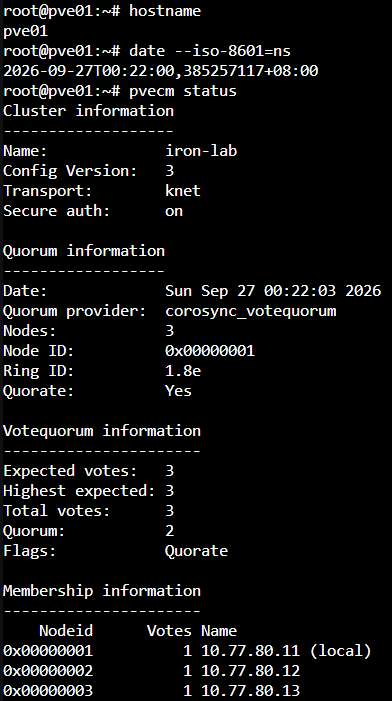

圖（一）　PVE 三個節點均在成員清單且叢集維持 Quorate


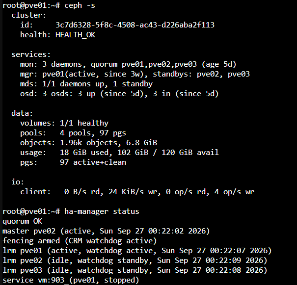

圖（二）　Ceph 為 HEALTH_OK 且 HA 服務處於 Started


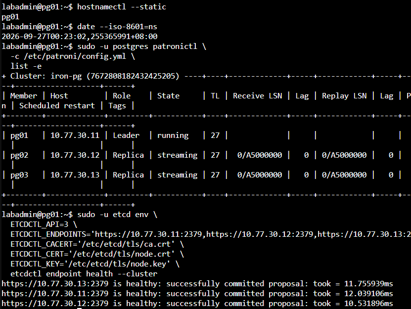

圖（三）　Patroni 為一台 Leader 兩台 Replica 且 etcd 三個 Endpoint 健康


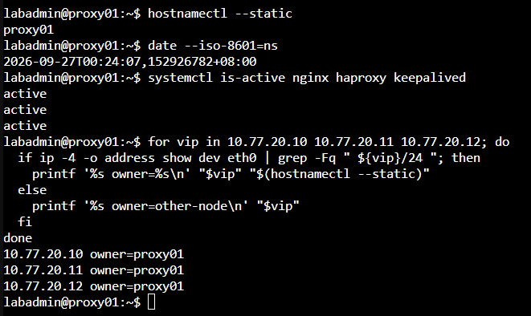

圖（四）　proxy01 持有三組 VIP

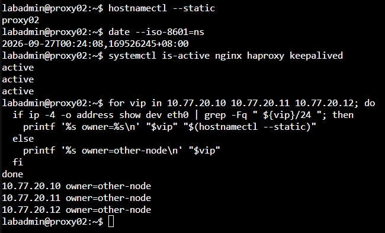

圖（五）　proxy02 未持有 VIP


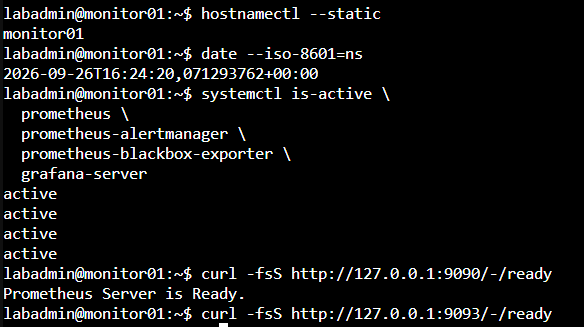

圖（六）　monitor01 的監控服務均為 active


## 3. 建立固定 Probe 與量測工具

### 3.1 建立測試資料表

**操作位置：目前 PostgreSQL Leader。**

```bash
hostnamectl --static

sudo -u postgres psql \
  -X -d appdb -v ON_ERROR_STOP=1 -P pager=off <<'SQL'
CREATE TABLE IF NOT EXISTS app.day30_failover_probe (
  run_id text NOT NULL,
  client_seq bigint NOT NULL,
  committed_at timestamptz NOT NULL DEFAULT clock_timestamp(),
  PRIMARY KEY (run_id, client_seq)
);

ALTER TABLE app.day30_failover_probe OWNER TO app_owner;
GRANT INSERT, SELECT ON app.day30_failover_probe TO app_rw;
GRANT SELECT ON app.day30_failover_probe TO app_ro;
SQL

sudo -u postgres psql \
  -X -d appdb -P pager=off \
  -c '\d+ app.day30_failover_probe'
```

這張表只保存本次測試的 Run ID、用戶端序號與 Commit 時間。`run_id` 讓 `C03`、`D02` 與後續複測互不混淆。

### 3.2 建立 Probe Script

**操作位置：client01。**

開始前確認 Root CA 與 `.pgpass` 已依正式 Runbook 建立；畫面不顯示 `.pgpass` 內容：

```bash
hostnamectl --static
date --iso-8601=ns
sudo test -r /etc/iron-app/pg-ca.crt
printf 'pg_ca_readable_rc=%s\n' "$?"
stat -c '%U %G %a %n' "$HOME/.pgpass"
```

建立程式：

```bash
sudo install -d -m 0755 /opt/iron-test
sudo install -d -m 0750 -o labadmin -g labadmin /var/log/iron-test

sudo tee /opt/iron-test/day30-probe.sh >/dev/null <<'SCRIPT'
#!/bin/bash
set -u

probe_type="${1:?usage: day30-probe.sh web|rw|ro}"
run_id="${DAY30_RUN_ID:?DAY30_RUN_ID is required}"
public_host="${DAY30_PUBLIC_HOST:?DAY30_PUBLIC_HOST is required}"
seq=0

while true; do
  seq=$((seq + 1))
  epoch="$(date +%s.%N)"
  iso="$(date --iso-8601=ns)"
  output=''
  rc=0

  case "$probe_type" in
    web)
      if output="$(curl -fsS --connect-timeout 3 --max-time 5 \
        "https://${public_host}/health?day30=${run_id}-${seq}" 2>&1)"; then
        rc=0
      else
        rc=$?
      fi
      ;;

    rw)
      if output="$(PGOPTIONS='-c statement_timeout=3000' \
        psql \
          'host=db-rw.lab.home port=5432 dbname=appdb user=app_rw sslmode=verify-full sslrootcert=/etc/iron-app/pg-ca.crt connect_timeout=3' \
          -X -qAt -F ',' -v ON_ERROR_STOP=1 \
          -c "INSERT INTO app.day30_failover_probe(run_id, client_seq)
              VALUES ('$run_id', $seq)
              RETURNING client_seq,
                        extract(epoch FROM committed_at),
                        inet_server_addr();" 2>&1)"; then
        rc=0
      else
        rc=$?
      fi
      ;;

    ro)
      if output="$(PGOPTIONS='-c statement_timeout=3000' \
        psql \
          'host=db-ro.lab.home port=5432 dbname=appdb user=app_ro sslmode=verify-full sslrootcert=/etc/iron-app/pg-ca.crt connect_timeout=3' \
          -X -qAt -F ',' -v ON_ERROR_STOP=1 \
          -c 'SELECT pg_is_in_recovery(),inet_server_addr(),extract(epoch FROM clock_timestamp());' \
          2>&1)"; then
        rc=0
      else
        rc=$?
      fi
      ;;

    *)
      echo 'usage: day30-probe.sh web|rw|ro' >&2
      exit 2
      ;;
  esac

  output="$(printf '%s' "$output" | tr '\n|' '  ')"

  if [ "$rc" -eq 0 ]; then
    status='OK'
  else
    status='FAIL'
  fi

  printf '%s|%s|%s|%s|rc=%s seq=%s %s\n' \
    "$epoch" "$iso" "$probe_type" "$status" "$rc" "$seq" "$output"

  sleep 1
done
SCRIPT

sudo chown root:root /opt/iron-test/day30-probe.sh
sudo chmod 755 /opt/iron-test/day30-probe.sh
sudo bash -n /opt/iron-test/day30-probe.sh
printf 'probe_syntax_rc=%s\n' "$?"
```

### 3.3 建立量測摘要程式

**操作位置：client01。**

```bash
sudo tee /opt/iron-test/day30-summarize.awk >/dev/null <<'AWK'
BEGIN {
  FS="|"
  first_fail=""
  stable=""
  consecutive_ok=0
  total=0
  ok_count=0
  fail_count=0
}

($1 + 0) >= fault {
  total++

  if ($4 == "FAIL") {
    fail_count++
    if (first_fail == "") {
      first_fail=$1 + 0
    }
    consecutive_ok=0
    next
  }

  if ($4 == "OK") {
    ok_count++

    if (first_fail != "") {
      consecutive_ok++
      if (consecutive_ok == 1) {
        candidate=$1 + 0
      }
      if (consecutive_ok >= 3 && stable == "") {
        stable=candidate
      }
    }
  }
}

END {
  printf "samples_after_fault=%d ok=%d fail=%d\n", total, ok_count, fail_count

  if (first_fail == "") {
    print "result=no_observed_interruption"
  } else if (stable == "") {
    printf "result=insufficient_recovery_evidence first_fail=%.9f\n", first_fail
  } else {
    printf "first_fail_epoch=%.9f\n", first_fail
    printf "stable_recovery_epoch=%.9f\n", stable
    printf "fault_to_stable_recovery=%.3f_seconds\n", stable-fault
    printf "first_fail_to_stable_recovery=%.3f_seconds\n", stable-first_fail
  }
}
AWK

sudo chmod 644 /opt/iron-test/day30-summarize.awk
```

此程式以故障後第一筆失敗為中斷起點，以連續三次成功中的第一筆為穩定恢復點。整段沒有失敗時會輸出 `result=no_observed_interruption`，不會虛構中斷秒數。

### 3.4 啟動一組測試 Probe

**操作位置：client01。先執行 `C03`，完成回復後再以新 Run ID 執行 `D02`。**

把公開 Hostname 換成 Day 27 實際使用的名稱：

```bash
export DAY30_PUBLIC_HOST='app.example.com'
export DAY30_RUN_ID="day30-c03-$(date +%Y%m%dT%H%M%S%z)"
export DAY30_LOG_DIR="/var/log/iron-test/${DAY30_RUN_ID}"

install -d -m 0750 "$DAY30_LOG_DIR"

nohup env \
  DAY30_PUBLIC_HOST="$DAY30_PUBLIC_HOST" \
  DAY30_RUN_ID="$DAY30_RUN_ID" \
  /opt/iron-test/day30-probe.sh web \
  >"$DAY30_LOG_DIR/web.log" 2>&1 &
echo $! >"$DAY30_LOG_DIR/web.pid"

nohup env \
  DAY30_PUBLIC_HOST="$DAY30_PUBLIC_HOST" \
  DAY30_RUN_ID="$DAY30_RUN_ID" \
  /opt/iron-test/day30-probe.sh rw \
  >"$DAY30_LOG_DIR/rw.log" 2>&1 &
echo $! >"$DAY30_LOG_DIR/rw.pid"

nohup env \
  DAY30_PUBLIC_HOST="$DAY30_PUBLIC_HOST" \
  DAY30_RUN_ID="$DAY30_RUN_ID" \
  /opt/iron-test/day30-probe.sh ro \
  >"$DAY30_LOG_DIR/ro.log" 2>&1 &
echo $! >"$DAY30_LOG_DIR/ro.pid"

printf 'DAY30_RUN_ID=%s\nDAY30_LOG_DIR=%s\n' \
  "$DAY30_RUN_ID" "$DAY30_LOG_DIR" | \
  tee "$DAY30_LOG_DIR/run.env"

printf 'export DAY30_PUBLIC_HOST=%q\nexport DAY30_RUN_ID=%q\nexport DAY30_LOG_DIR=%q\n' \
  "$DAY30_PUBLIC_HOST" "$DAY30_RUN_ID" "$DAY30_LOG_DIR" | \
  tee /var/tmp/day30-current.env
```

等待至少 30 秒，再確認三條路徑都持續成功：

```bash
hostnamectl --static
date --iso-8601=ns
printf 'run_id=%s\n' "$DAY30_RUN_ID"

for probe in web rw ro; do
  printf '%s\n' "--- ${probe} latest samples ---"
  tail -n 5 "$DAY30_LOG_DIR/${probe}.log"
done
```

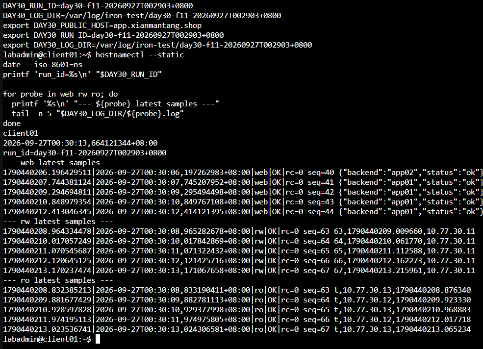

圖（七）　C03 故障前 Web DB-RW 與 DB-RO Probe 連續成功


## 4. `C03`：Proxy VM 突然停止

### 4.1 確認 VIP Owner 與 VMID

**操作位置：proxy01、proxy02。**

```bash
hostnamectl --static
date --iso-8601=ns

for vip in 10.77.20.10 10.77.20.11 10.77.20.12; do
  if ip -4 -o address show dev eth0 | grep -Fq " ${vip}/24 "; then
    printf '%s owner=%s\n' "$vip" "$(hostnamectl --static)"
  fi
done
```

三組 VIP 必須集中於同一台 Proxy 才執行本次測試。VMID 對照如下：

```text
proxy01 → VMID 201
proxy02 → VMID 202
```

### 4.2 注入 Proxy VM 故障

**操作位置：承載目標 Proxy VM 的 PVE 節點 Shell。**

先將 VMID 改成目前持有三組 VIP 的節點，再執行：

```bash
TARGET_PROXY_VMID='201'
FAULT_EPOCH="$(date +%s.%N)"
FAULT_TIME="$(date --iso-8601=ns)"

printf 'scenario=C03\nfault_time=%s\nfault_epoch=%s\ntarget_vmid=%s\n' \
  "$FAULT_TIME" "$FAULT_EPOCH" "$TARGET_PROXY_VMID" | \
  tee /root/day30-c03-fault.env

qm status "$TARGET_PROXY_VMID"
qm stop "$TARGET_PROXY_VMID"
qm status "$TARGET_PROXY_VMID"
```

### 4.3 確認接手並恢復原 VM

**操作位置：仍在線的 Proxy。**

```bash
hostnamectl --static
date --iso-8601=ns
systemctl is-active nginx haproxy keepalived

for vip in 10.77.20.10 10.77.20.11 10.77.20.12; do
  ip -4 -o address show dev eth0 | grep -F " ${vip}/24 "
done
```

三組 VIP 都必須由存活 Proxy 持有。先保存 A02 告警證據，再回到 PVE 節點啟動原 VM。

保持原 Proxy VM 停止，在 monitor01 重複查詢，直到停止中的 Proxy 對應 `InstanceDown` 進入 Firing 並出現在 Alertmanager：

```bash
curl -fsS http://127.0.0.1:9090/api/v1/alerts | \
  jq -r '.data.alerts[]? |
         select(.labels.alertname == "InstanceDown") |
         [.labels.alertname,
          .labels.instance,
          .state,
          .activeAt] | @tsv'

amtool alert query \
  --alertmanager.url=http://127.0.0.1:9093
```

規則設有 `for: 2m`，尚未進入 Firing 前不要啟動原 VM。只把 Instance 與停止中的 Proxy 相符的告警記為 `A02`。保存證據後，回到 PVE 節點啟動原 VM：

```bash
TARGET_PROXY_VMID='201'
date --iso-8601=ns
qm start "$TARGET_PROXY_VMID"
qm status "$TARGET_PROXY_VMID"
```

等待原 Proxy 開機後，在兩台 Proxy 各執行：

```bash
hostnamectl --static
systemctl is-active nginx haproxy keepalived
ip -4 -o address show dev eth0 | \
  grep -E '10\.77\.20\.(10|11|12)/24' || true
```

每個 VIP 在兩台輸出中只能出現一次。

### 4.4 計算 `C03` 使用者中斷

**操作位置：client01。把 `FAULT_EPOCH` 換成 C3 畫面的實際值。**

```bash
source /var/tmp/day30-current.env
FAULT_EPOCH='1790440298.586887014'

hostnamectl --static
date --iso-8601=ns
printf 'run_id=%s\nfault_epoch=%s\n' \
  "$DAY30_RUN_ID" "$FAULT_EPOCH"

for probe in web rw ro; do
  printf '%s\n' "=== ${probe} ==="
  awk -v fault="$FAULT_EPOCH" \
    -f /opt/iron-test/day30-summarize.awk \
    "$DAY30_LOG_DIR/${probe}.log"
done
```

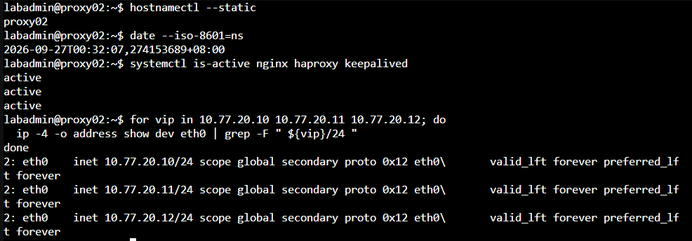

圖（八）　proxy01 停止後 proxy02 接手三組 VIP


圖（九）　C03 三條 Probe 的中斷與穩定恢復摘要


### 4.5 停止 `C03` Probe

**操作位置：client01。**

```bash
source /var/tmp/day30-current.env

for pid_file in "$DAY30_LOG_DIR"/*.pid; do
  kill "$(cat "$pid_file")" 2>/dev/null || true
done

sleep 2
pgrep -af '/opt/iron-test/day30-probe.sh' || \
  echo 'C03 probes stopped'

tail -n 3 "$DAY30_LOG_DIR/web.log"
tail -n 3 "$DAY30_LOG_DIR/rw.log"
tail -n 3 "$DAY30_LOG_DIR/ro.log"
```

在 monitor01 查詢本次 Alert：

```bash
hostnamectl --static
date --iso-8601=ns

curl -fsS http://127.0.0.1:9090/api/v1/alerts | \
  jq -r '.data.alerts[]? |
         [.labels.alertname,
          .labels.instance,
          .state,
          .activeAt] | @tsv'

amtool alert query \
  --alertmanager.url=http://127.0.0.1:9093
```

確認 Proxy 故障對應的 `InstanceDown` 已觸發，且 Proxy 回復後相關 Target 與 Alert 已恢復；只採用名稱、Instance 與時間能對應本次故障的告警作為 `A02` 證據。

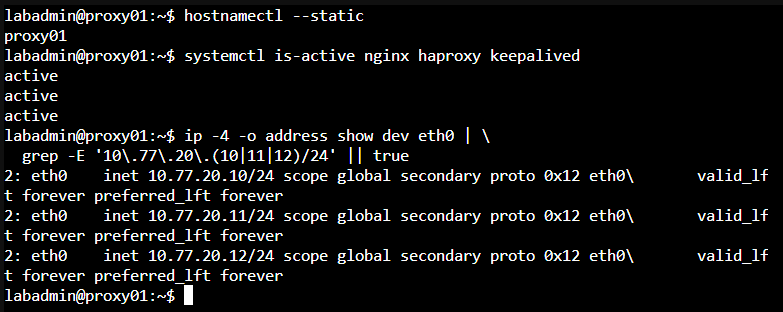

圖（十）　proxy01 回歸後重新持有三組 VIP

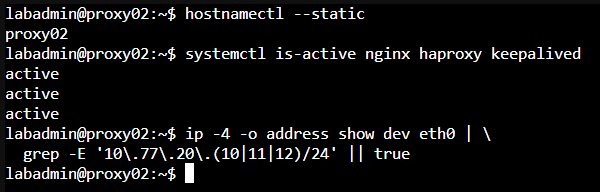

圖（十一）　proxy02 回到不持有 VIP 的狀態


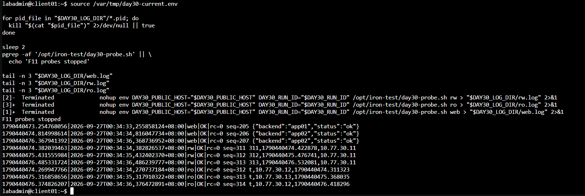

圖（十二）　C03 結束前三條 Probe 持續成功


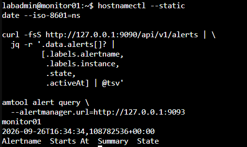

圖（十三）　C03 回復後 Prometheus 與 Alertmanager 無殘留告警


## 5. `D02`：PostgreSQL Primary VM 突然停止

### 5.1 建立新的 Probe Run

**操作位置：client01。**

把 `app.example.com` 換成 Day 27 實際使用的公開 Hostname。

```bash
export DAY30_PUBLIC_HOST='app.example.com'
export DAY30_RUN_ID="day30-d02-$(date +%Y%m%dT%H%M%S%z)"
export DAY30_LOG_DIR="/var/log/iron-test/${DAY30_RUN_ID}"

install -d -m 0750 "$DAY30_LOG_DIR"

for probe in web rw ro; do
  nohup env \
    DAY30_PUBLIC_HOST="$DAY30_PUBLIC_HOST" \
    DAY30_RUN_ID="$DAY30_RUN_ID" \
    /opt/iron-test/day30-probe.sh "$probe" \
    >"$DAY30_LOG_DIR/${probe}.log" 2>&1 &
  echo $! >"$DAY30_LOG_DIR/${probe}.pid"
done

printf 'DAY30_RUN_ID=%s\nDAY30_LOG_DIR=%s\n' \
  "$DAY30_RUN_ID" "$DAY30_LOG_DIR" | \
  tee "$DAY30_LOG_DIR/run.env"

printf 'export DAY30_PUBLIC_HOST=%q\nexport DAY30_RUN_ID=%q\nexport DAY30_LOG_DIR=%q\n' \
  "$DAY30_PUBLIC_HOST" "$DAY30_RUN_ID" "$DAY30_LOG_DIR" | \
  tee /var/tmp/day30-current.env

sleep 30

for probe in web rw ro; do
  printf '%s\n' "--- ${probe} latest samples ---"
  tail -n 3 "$DAY30_LOG_DIR/${probe}.log"
done
```

### 5.2 確認 Primary、Timeline 與 VMID

**操作位置：任一 PostgreSQL 節點。**

```bash
hostnamectl --static
date --iso-8601=ns

sudo -u postgres patronictl \
  -c /etc/patroni/config.yml \
  list -e
```

VMID 對照如下：

```text
pg01 → VMID 221
pg02 → VMID 222
pg03 → VMID 223
```

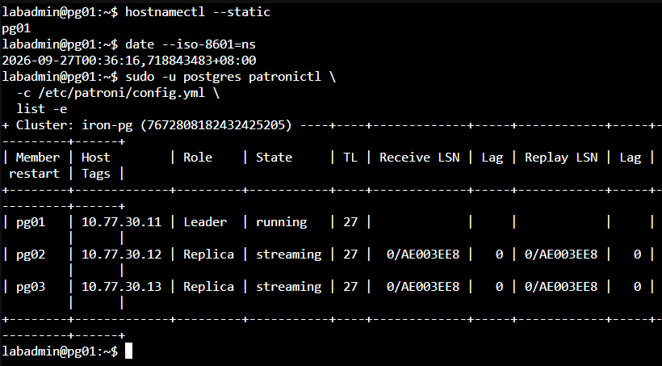

圖（十四）　D02 前 pg01 為 Leader 且兩台 Replica 持續串流


### 5.3 注入 Primary VM 故障

**操作位置：承載目前 Primary VM 的 PVE 節點 Shell。**

將 VMID 改成 D1 的目前 Leader：

```bash
TARGET_PRIMARY_VMID='221'
FAULT_EPOCH="$(date +%s.%N)"
FAULT_TIME="$(date --iso-8601=ns)"

printf 'scenario=D02\nfault_time=%s\nfault_epoch=%s\ntarget_vmid=%s\n' \
  "$FAULT_TIME" "$FAULT_EPOCH" "$TARGET_PRIMARY_VMID" | \
  tee /root/day30-d02-fault.env

qm status "$TARGET_PRIMARY_VMID"
qm stop "$TARGET_PRIMARY_VMID"
qm status "$TARGET_PRIMARY_VMID"
```

**操作位置：任一存活 PostgreSQL 節點。**

```bash
watch -n 1 \
  'sudo -u postgres patronictl -c /etc/patroni/config.yml list -e'
```

看到新 Leader 後按 `Ctrl+C`。在任一 Proxy 確認 HAProxy：

```bash
hostnamectl --static
date --iso-8601=ns
echo 'show stat' | \
  sudo socat stdio /run/haproxy/admin.sock | \
  grep -E '^pg_primary,(pg01|pg02|pg03),'
```

只有新 Leader 在 `pg_primary` Backend 應為 `UP`。

此時在 monitor01 保存仍離線的 PostgreSQL Instance、Prometheus Alert 與 Alertmanager 狀態：

```bash
hostnamectl --static
date --iso-8601=ns

curl -fsS http://127.0.0.1:9090/api/v1/alerts | \
  jq -r '.data.alerts[]? |
         [.labels.alertname,
          .labels.instance,
          .state,
          .activeAt] | @tsv'

amtool alert query \
  --alertmanager.url=http://127.0.0.1:9093
```

保持原 Primary VM 停止並重複查詢，直到對應的 `InstanceDown` 進入 Firing 並出現在 Alertmanager。只將名稱、Instance 與時間能對應本次 Primary VM 故障的項目列為 `A03`；尚未進入 Firing 前不要啟動原 VM。

### 5.4 計算 `D02` 中斷並核對交易

**操作位置：client01。把 `FAULT_EPOCH` 換成故障注入畫面的實際值。**

```bash
source /var/tmp/day30-current.env
FAULT_EPOCH='請貼上D02的fault_epoch'

hostnamectl --static
date --iso-8601=ns
printf 'run_id=%s\nfault_epoch=%s\n' \
  "$DAY30_RUN_ID" "$FAULT_EPOCH"

for probe in web rw ro; do
  printf '%s\n' "=== ${probe} ==="
  awk -v fault="$FAULT_EPOCH" \
    -f /opt/iron-test/day30-summarize.awk \
    "$DAY30_LOG_DIR/${probe}.log"
done
```

接著核對所有 DB-RW Probe 已收到成功回覆的序號仍存在於新 Primary：

```bash
awk -F'|' '
  $3 == "rw" && $4 == "OK" {
    if (match($5, /seq=[0-9]+/)) {
      value=substr($5, RSTART + 4, RLENGTH - 4)
      print value
    }
  }
' "$DAY30_LOG_DIR/rw.log" | \
  sort -u >"$DAY30_LOG_DIR/acknowledged-seq.txt"

psql \
  'host=db-rw.lab.home port=5432 dbname=appdb user=app_rw sslmode=verify-full sslrootcert=/etc/iron-app/pg-ca.crt connect_timeout=3' \
  -X -qAt -v ON_ERROR_STOP=1 \
  -c "SELECT client_seq
      FROM app.day30_failover_probe
      WHERE run_id = '$DAY30_RUN_ID'
      ORDER BY client_seq;" | \
  sort -u >"$DAY30_LOG_DIR/database-seq.txt"

comm -23 \
  "$DAY30_LOG_DIR/acknowledged-seq.txt" \
  "$DAY30_LOG_DIR/database-seq.txt" \
  >"$DAY30_LOG_DIR/missing-acknowledged-seq.txt"

ACK_COUNT="$(wc -l <"$DAY30_LOG_DIR/acknowledged-seq.txt")"
DB_COUNT="$(wc -l <"$DAY30_LOG_DIR/database-seq.txt")"
MISSING_ACK_COUNT="$(wc -l <"$DAY30_LOG_DIR/missing-acknowledged-seq.txt")"

printf 'run_id=%s\nacknowledged_rows=%s\ndatabase_rows=%s\nmissing_acknowledged_rows=%s\n' \
  "$DAY30_RUN_ID" "$ACK_COUNT" "$DB_COUNT" "$MISSING_ACK_COUNT"

if [ "$MISSING_ACK_COUNT" -eq 0 ]; then
  echo 'result=no_acknowledged_transaction_loss_observed'
else
  echo 'result=acknowledged_transaction_loss_observed'
  cat "$DAY30_LOG_DIR/missing-acknowledged-seq.txt"
fi
```

`database_rows` 可能大於 `acknowledged_rows`，代表部分交易已 Commit，但用戶端在連線中斷前沒有收到成功回覆；這些交易不屬於已確認交易遺失。`missing_acknowledged_rows` 才是本次核對的核心結果。

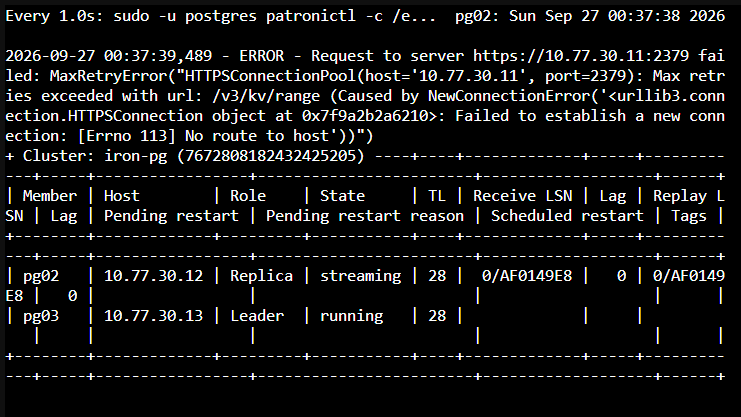

圖（十五）　pg03 晉升為 Leader 且 pg02 持續串流


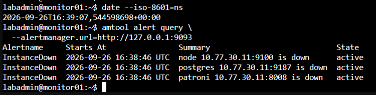

圖（十六）　Primary VM 故障對應的 InstanceDown 告警進入 Firing


圖（十七）　D02 三條 Probe 的中斷與穩定恢復摘要


圖（十八）　D02 已確認交易與新 Primary 可見資料核對


### 5.5 啟動舊 Primary 並確認回歸

**操作位置：承載原 Primary 的 PVE 節點。**

```bash
TARGET_PRIMARY_VMID='221'
date --iso-8601=ns
qm start "$TARGET_PRIMARY_VMID"
qm status "$TARGET_PRIMARY_VMID"
```

等待節點完成開機，再到任一 PostgreSQL 節點執行：

```bash
hostnamectl --static
date --iso-8601=ns

sudo -u postgres patronictl \
  -c /etc/patroni/config.yml \
  list -e

sudo -u etcd env \
  ETCDCTL_API=3 \
  ETCDCTL_ENDPOINTS='https://10.77.30.11:2379,https://10.77.30.12:2379,https://10.77.30.13:2379' \
  ETCDCTL_CACERT='/etc/etcd/tls/ca.crt' \
  ETCDCTL_CERT='/etc/etcd/tls/node.crt' \
  ETCDCTL_KEY='/etc/etcd/tls/node.key' \
  etcdctl endpoint health --cluster
```

預期結果為一台 Leader、兩台 `Replica / streaming`、三台 Timeline 相同、Lag 回到可接受範圍，etcd 3/3 Healthy。

停止 `D02` Probe：

```bash
source /var/tmp/day30-current.env

for pid_file in "$DAY30_LOG_DIR"/*.pid; do
  kill "$(cat "$pid_file")" 2>/dev/null || true
done

sleep 2
pgrep -af '/opt/iron-test/day30-probe.sh' || \
  echo 'D02 probes stopped'

for probe in web rw ro; do
  printf '%s\n' "--- ${probe} final samples ---"
  tail -n 3 "$DAY30_LOG_DIR/${probe}.log"
done
```

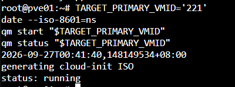

圖（十九）　從 PVE 重新啟動舊 Primary pg01


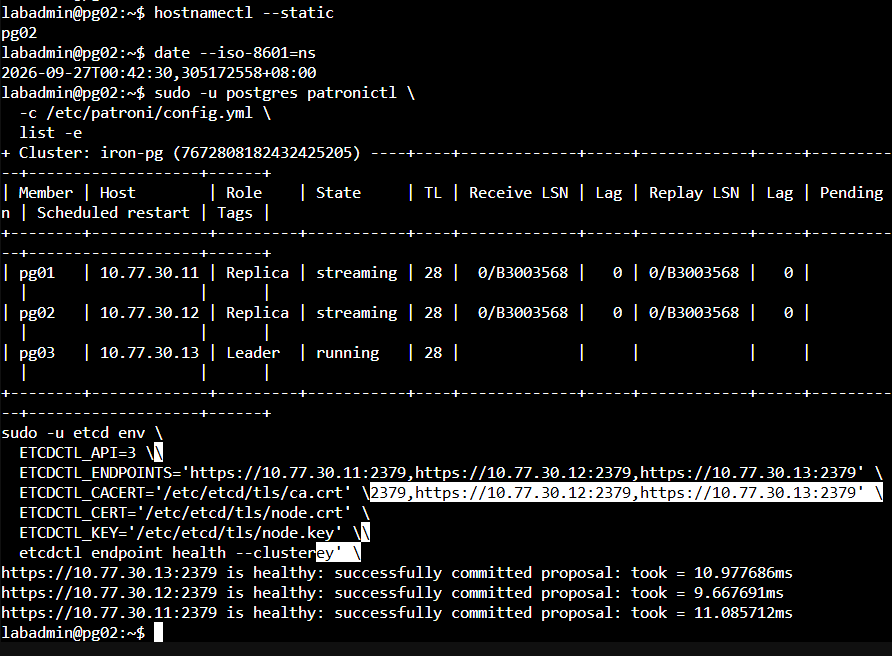

圖（二十）　pg01 以 Replica 回歸且 etcd 三個 Endpoint 健康


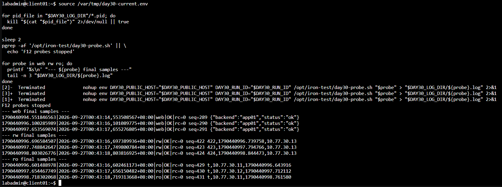

圖（二十一）　D02 結束前三條 Probe 持續成功


原始 `D02` 已完成服務恢復、交易核對與舊 Primary 回歸，後續以相同故障類型補測 `InstanceDown` 的完整告警生命週期。補測對象為當時的 Primary pg03，不重複計算服務 RTO 或交易缺口。

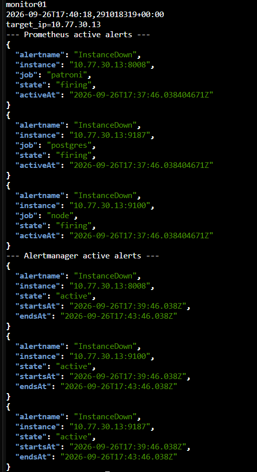

圖（二十二）　pg03 三個 InstanceDown 告警進入 Firing 並送達 Alertmanager


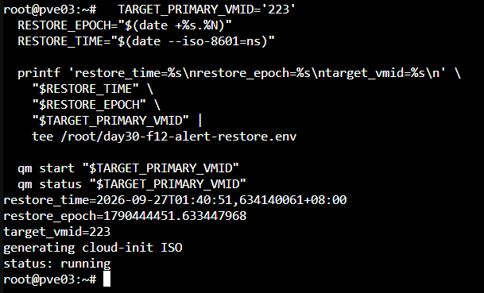

圖（二十三）　重新啟動 pg03 並保存恢復操作時間


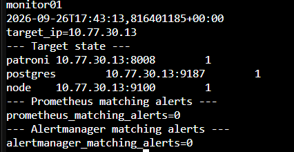

圖（二十四）　pg03 三個 Target 回到 Up 且告警清空


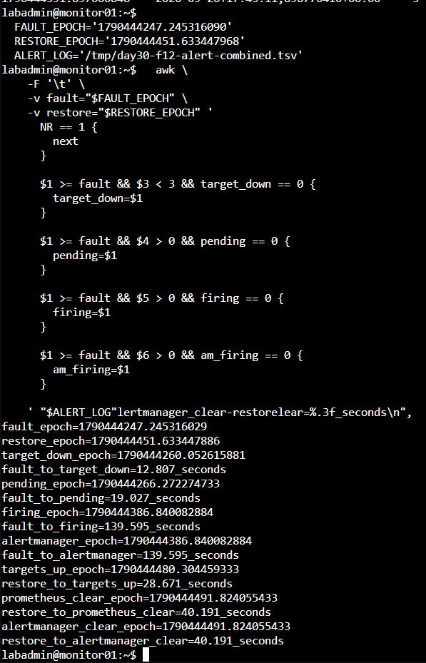

圖（二十五）　D02 告警補測生命週期計算結果


Prometheus 規則設有 `for: 2m`，因此 Pending 到 Firing 約需 120 秒；本次故障注入到 Firing 的 139.595 秒還包含 Prometheus 首次觀察到 Target Down 的時間。重新啟動後，三個 Target 在 28.671 秒全部 Up，告警在 40.191 秒清除。這組補測完成 `A03` 的 Pending、Firing 與清除證據鏈。

## 6. `A06`：同 VLAN 直接 SSH

**操作位置：client01。**

```bash
hostnamectl --static
date --iso-8601=ns
ip route get 10.77.20.31

set +e
nc -vz -w 3 10.77.20.31 22
DIRECT_SSH_RC=$?

printf 'direct_ssh_target=10.77.20.31:22\ndirect_ssh_rc=%s\n' \
  "$DIRECT_SSH_RC"
```

client01 與 app01 同在 VLAN 20，這段流量由第二層直接交換，不經 OPNsense。依目前設定，app01 的主機防火牆只限制監控 Port，TCP 22 仍可達，因此預期 `direct_ssh_rc=0`。

這個結果只能證明 TCP 22 可達，無法證明 SSH 登入成功。若安全需求是所有 SSH 都必須經過 jump01，本次結果應記為功能 FAIL／已知缺口，改善方式是由 app01 主機防火牆只允許 jump01 來源，再重新執行相同測試。Game Day 保留現況，不在量測途中改規則。


圖（二十六）　client01 可在同一 VLAN 直接連到 app01 TCP 22


## 7. 彙整最終結果

下表依 C4、D2、D3、D4 的原始輸出彙整，Epoch 保留至小數點後六位，秒數沿用量測 Script 的三位小數結果。

| 情境                      | 路徑     | 第一筆失敗 Epoch  | 穩定恢復 Epoch    | 故障到穩定恢復 | 使用者可見中斷 | 資料結果                 |
| ------------------------- | -------- | ----------------- | ----------------- | -------------: | -------------: | ------------------------ |
| `C03／F10` Proxy VM 突然停止   | 公開 Web | 1790440299.836238 | 1790440305.851748 |        7.265 秒 |        6.016 秒 | 不適用                   |
| `C03／F10` Proxy VM 突然停止   | DB-RW    | 1790440300.674049 | 1790440304.707686 |        6.121 秒 |        4.034 秒 | Probe 持續完成交易       |
| `C03／F10` Proxy VM 突然停止   | DB-RO    | 1790440300.169436 | 1790440304.203537 |        5.617 秒 |        4.034 秒 | 不適用                   |
| `D02／F11` Primary VM 突然停止 | 公開 Web | 未觀察到失敗      | 未觀察到中斷      |       無法換算 |       無法換算 | 不適用                   |
| `D02／F11` Primary VM 突然停止 | DB-RW    | 1790440612.297455 | 1790440650.275792 |       40.100 秒 |       37.978 秒 | 已確認交易缺口：0／281   |
| `D02／F11` Primary VM 突然停止 | DB-RO    | 未觀察到失敗      | 未觀察到中斷      |       無法換算 |       無法換算 | 查詢由存活 Replica 承接  |

再填寫完整穩態與告警：

| 情境  | 控制面接手             | 完整穩態                         | Firing                 | Resolved | 功能判讀 | RTO／RPO 判讀 |
| ----- | ---------------------- | -------------------------------- | ---------------------- | -------- | -------- | ------------- |
| `C03／F10` | proxy02 接手三組 VIP   | proxy01 回歸、VIP 維持唯一       | `InstanceDown` 已觸發  | 恢復後告警清除 | PASS   | 以三條 Probe 的實測值建立 RTC 基線；RPC 不適用 |
| `D02／F11` | pg03 晉升為新 Leader   | 舊 Primary 回歸，服務元件與告警均恢復 | 補測中故障後 139.595 秒 | 補測中重新啟動後 40.191 秒 | PASS | DB-RW RTC 為 40.100 秒；本次 RPC 為零筆已確認交易缺口 |

安全邊界結果另外保存：

| 情境              | 正向路徑               | 負向路徑                   | 控制點證據               | 功能判讀                     |
| ----------------- | ---------------------- | -------------------------- | ------------------------ | ---------------------------- |
| `A06／F12` 同 VLAN SSH | ProxyJump 既有正向證據 | client01 直連 app01 TCP 22 | client01 Route／TCP 結果 | FAIL，確認目前管理入口缺口   |

判讀規則：

- `result=no_observed_interruption`：本次取樣沒有觀察到失敗，保留樣本數與探測間隔。
- `result=insufficient_recovery_evidence`：失敗後尚未取得連續三次成功，需要延長觀察或處理故障。
- `missing_acknowledged_rows=0`：本次未觀察到已確認交易遺失。
- 有核准目標：用實際觀察值判讀 PASS／FAIL。
- 沒有核准目標：將數值列為能力基線。

取得所有原始證據後，將表格直接填入本文件，不需要把 Markdown 表格另外截成圖片。空白欄位、未執行項目與證據不足都照實保留。

## 8. 結束檢查

在正式 Runbook 的「結束與回復」逐層確認 PVE／Ceph、etcd／Patroni、Proxy、App、Backup、Monitoring 與公開服務。最後在 client01 確認沒有殘留 Probe：

```bash
pgrep -af '/opt/iron-test/day30-probe.sh' || \
  echo 'all Day 30 probes stopped'

find /var/log/iron-test \
  -maxdepth 2 \
  -type f \
  -name '*.log' \
  -printf '%TY-%Tm-%Td %TH:%TM:%TS %p\n' | \
  sort
```

依演練證據保存政策保留 Script、原始 Log、故障時間與彙整表。測試資料表可以留下供下一次 Game Day 使用；每次以新的 `run_id` 隔離資料，不需為了複測重新建表。
